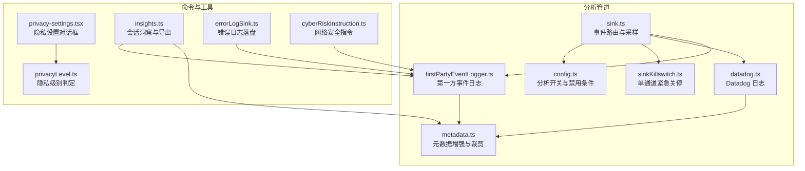
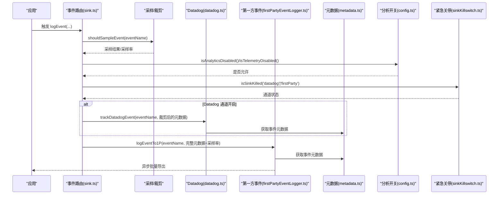
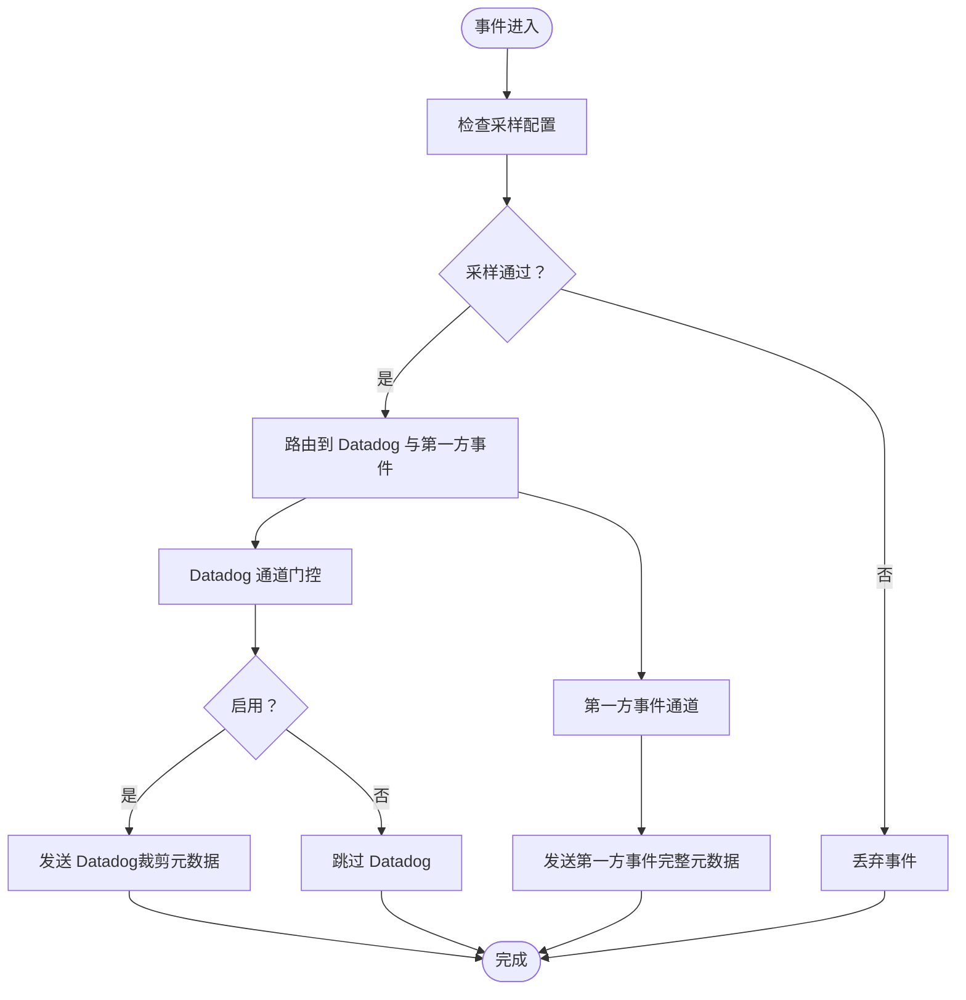
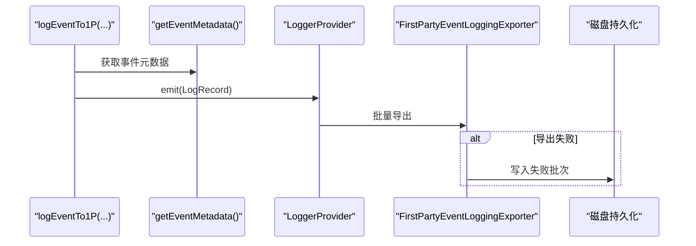
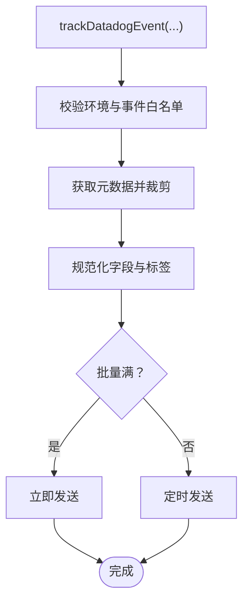
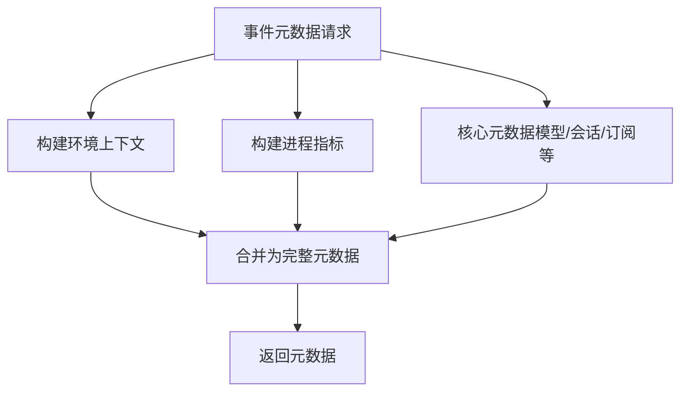
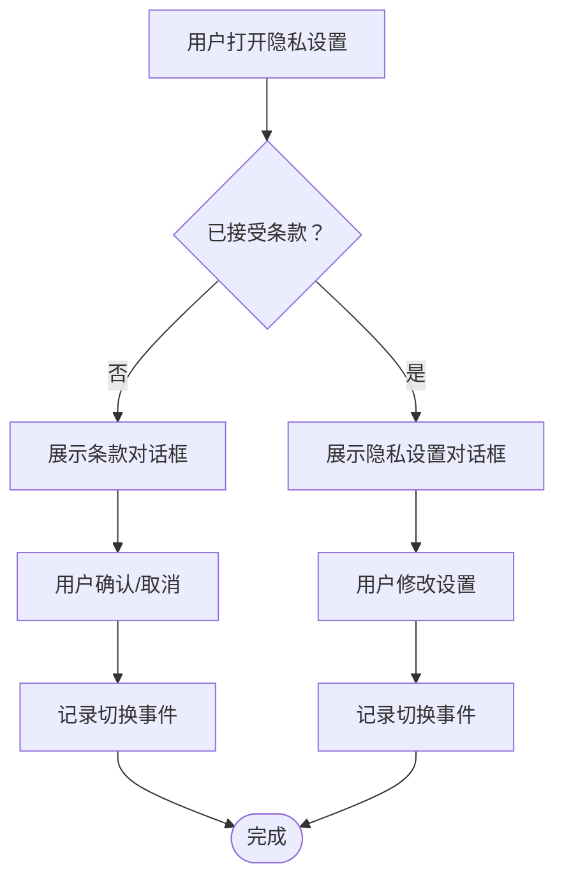
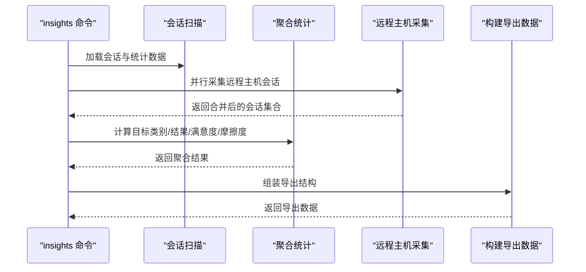
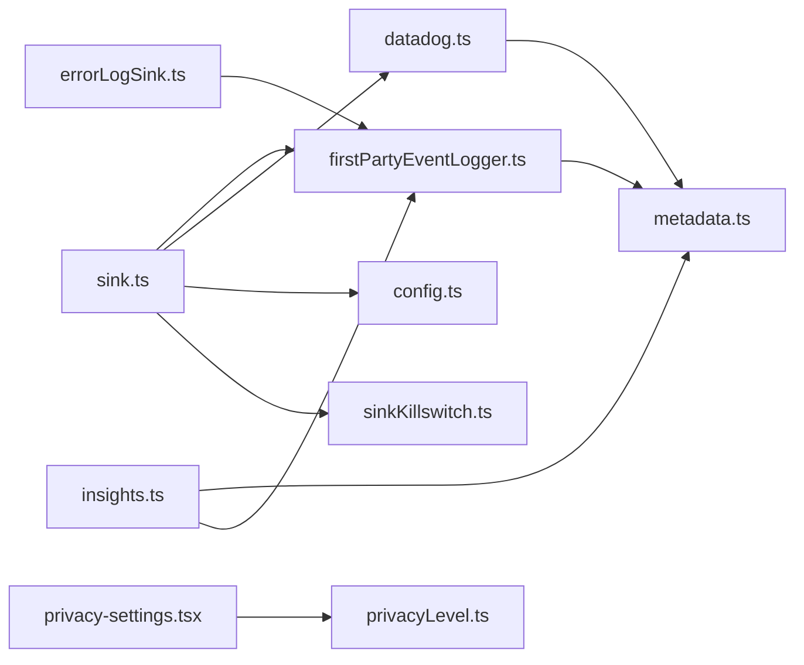

# 合规性监控与审计

<cite>
**本文引用的文件**
- [firstPartyEventLogger.ts](file://src/services/analytics/firstPartyEventLogger.ts)
- [metadata.ts](file://src/services/analytics/metadata.ts)
- [datadog.ts](file://src/services/analytics/datadog.ts)
- [config.ts](file://src/services/analytics/config.ts)
- [sink.ts](file://src/services/analytics/sink.ts)
- [sinkKillswitch.ts](file://src/services/analytics/sinkKillswitch.ts)
- [privacy-settings.tsx](file://src/commands/privacy-settings/privacy-settings.tsx)
- [privacyLevel.ts](file://src/utils/privacyLevel.ts)
- [insights.ts](file://src/commands/insights.ts)
- [errorLogSink.ts](file://src/utils/errorLogSink.ts)
- [cyberRiskInstruction.ts](file://src/constants/cyberRiskInstruction.ts)
</cite>

## 目录
1. [简介](#简介)
2. [项目结构](#项目结构)
3. [核心组件](#核心组件)
4. [架构总览](#架构总览)
5. [详细组件分析](#详细组件分析)
6. [依赖关系分析](#依赖关系分析)
7. [性能考量](#性能考量)
8. [故障排查指南](#故障排查指南)
9. [结论](#结论)
10. [附录](#附录)

## 简介
本技术文档聚焦 Claude Code 的合规性监控与审计体系，围绕数据处理活动跟踪、合规性指标采集、异常行为检测、审计日志实现、合规性报告生成、隐私影响评估以及自动化告警机制展开。通过对遥测与隐私相关模块的深入分析，帮助合规与安全部门建立对系统数据流、事件采样、传输路径与存储策略的全面认知，并提供可操作的配置示例与监管适配建议。

## 项目结构
合规性监控与审计能力主要由“分析管道”和“命令与工具”两部分组成：
- 分析管道：负责事件采样、元数据增强、双通道传输（Datadog 与第一方事件日志）、动态配置与紧急关停。
- 命令与工具：提供隐私设置交互、会话洞察导出、错误日志落盘与归档、安全指令约束等。

图表来源
- [sink.ts:1-115](file://src/services/analytics/sink.ts#L1-L115)
- [firstPartyEventLogger.ts:1-450](file://src/services/analytics/firstPartyEventLogger.ts#L1-L450)
- [datadog.ts:1-308](file://src/services/analytics/datadog.ts#L1-L308)
- [metadata.ts:1-800](file://src/services/analytics/metadata.ts#L1-L800)
- [config.ts:1-39](file://src/services/analytics/config.ts#L1-L39)
- [sinkKillswitch.ts:1-26](file://src/services/analytics/sinkKillswitch.ts#L1-L26)
- [privacy-settings.tsx:1-58](file://src/commands/privacy-settings/privacy-settings.tsx#L1-L58)
- [privacyLevel.ts:1-56](file://src/utils/privacyLevel.ts#L1-L56)
- [insights.ts:1-3201](file://src/commands/insights.ts#L1-L3201)
- [errorLogSink.ts:1-41](file://src/utils/errorLogSink.ts#L1-L41)
- [cyberRiskInstruction.ts:1-24](file://src/constants/cyberRiskInstruction.ts#L1-L24)

章节来源
- [sink.ts:1-115](file://src/services/analytics/sink.ts#L1-L115)
- [firstPartyEventLogger.ts:1-450](file://src/services/analytics/firstPartyEventLogger.ts#L1-L450)
- [datadog.ts:1-308](file://src/services/analytics/datadog.ts#L1-L308)
- [metadata.ts:1-800](file://src/services/analytics/metadata.ts#L1-L800)
- [config.ts:1-39](file://src/services/analytics/config.ts#L1-L39)
- [sinkKillswitch.ts:1-26](file://src/services/analytics/sinkKillswitch.ts#L1-L26)
- [privacy-settings.tsx:1-58](file://src/commands/privacy-settings/privacy-settings.tsx#L1-L58)
- [privacyLevel.ts:1-56](file://src/utils/privacyLevel.ts#L1-L56)
- [insights.ts:1-3201](file://src/commands/insights.ts#L1-L3201)
- [errorLogSink.ts:1-41](file://src/utils/errorLogSink.ts#L1-L41)
- [cyberRiskInstruction.ts:1-24](file://src/constants/cyberRiskInstruction.ts#L1-L24)

## 核心组件
- 事件路由与采样（sink.ts）
  - 将事件按采样配置决定是否记录；Datadog 侧进行字段裁剪以避免敏感信息泄露；第一方事件日志接收完整载荷。
- 第一方事件日志（firstPartyEventLogger.ts）
  - 基于 OpenTelemetry SDK 构建独立 Provider，批量导出至内部端点；支持动态批处理配置与重初始化。
- Datadog 日志（datadog.ts）
  - 限定白名单事件类型，进行字段规范化与标签化，定时批量发送。
- 元数据增强与裁剪（metadata.ts）
  - 提供统一的环境上下文、进程指标、工具输入裁剪、文件扩展名提取等能力；严格控制敏感信息暴露。
- 分析开关与禁用条件（config.ts）
  - 统一判定测试环境、第三方云提供商、隐私级别等禁用场景。
- 单通道紧急关停（sinkKillswitch.ts）
  - 支持通过动态配置临时关停 Datadog 或第一方事件日志通道。
- 隐私设置与级别（privacy-settings.tsx, privacyLevel.ts）
  - 提供用户交互式隐私设置入口；根据环境变量计算隐私级别，决定是否禁用遥测。
- 会话洞察与导出（insights.ts）
  - 聚合会话统计、面部分析、导出报告，支持远程主机数据采集与合并。
- 错误日志落盘（errorLogSink.ts）
  - 将错误事件写入本地 JSONL 文件，便于离线审计与取证。
- 安全指令约束（cyberRiskInstruction.ts）
  - 明确安全辅助边界，指导在渗透测试、CTF、教育等场景下的行为准则。

章节来源
- [sink.ts:1-115](file://src/services/analytics/sink.ts#L1-L115)
- [firstPartyEventLogger.ts:1-450](file://src/services/analytics/firstPartyEventLogger.ts#L1-L450)
- [datadog.ts:1-308](file://src/services/analytics/datadog.ts#L1-L308)
- [metadata.ts:1-800](file://src/services/analytics/metadata.ts#L1-L800)
- [config.ts:1-39](file://src/services/analytics/config.ts#L1-L39)
- [sinkKillswitch.ts:1-26](file://src/services/analytics/sinkKillswitch.ts#L1-L26)
- [privacy-settings.tsx:1-58](file://src/commands/privacy-settings/privacy-settings.tsx#L1-L58)
- [privacyLevel.ts:1-56](file://src/utils/privacyLevel.ts#L1-L56)
- [insights.ts:1-3201](file://src/commands/insights.ts#L1-L3201)
- [errorLogSink.ts:1-41](file://src/utils/errorLogSink.ts#L1-L41)
- [cyberRiskInstruction.ts:1-24](file://src/constants/cyberRiskInstruction.ts#L1-L24)

## 架构总览
下图展示合规性监控与审计的关键交互：事件从路由模块进入，经采样与裁剪后分别流向 Datadog 与第一方事件日志；元数据模块提供统一的环境与进程指标；隐私与分析开关控制整体行为；命令与工具模块提供用户交互、导出与错误落盘能力。

图表来源
- [sink.ts:48-72](file://src/services/analytics/sink.ts#L48-L72)
- [firstPartyEventLogger.ts:156-230](file://src/services/analytics/firstPartyEventLogger.ts#L156-L230)
- [datadog.ts:160-279](file://src/services/analytics/datadog.ts#L160-L279)
- [metadata.ts:693-743](file://src/services/analytics/metadata.ts#L693-L743)
- [config.ts:19-27](file://src/services/analytics/config.ts#L19-L27)
- [sinkKillswitch.ts:18-25](file://src/services/analytics/sinkKillswitch.ts#L18-L25)

## 详细组件分析

### 事件路由与采样（sink.ts）
- 功能要点
  - 事件采样：基于事件名称的采样配置，随机决定是否记录；若采样率为 0 则丢弃。
  - 双通道分发：Datadog 通道使用裁剪后的元数据；第一方事件通道使用完整元数据。
  - 动态门控：Datadog 通道可通过特性门控启用/禁用；支持缓存值回退。
  - 紧急关停：通过动态配置可临时关停任一通道，Fail-open 设计避免误杀。
- 合规意义
  - 降低数据体量与敏感字段暴露风险；在异常情况下可快速阻断特定通道。

图表来源
- [sink.ts:48-72](file://src/services/analytics/sink.ts#L48-L72)
- [sink.ts:29-43](file://src/services/analytics/sink.ts#L29-L43)
- [sink.ts:109-115](file://src/services/analytics/sink.ts#L109-L115)

章节来源
- [sink.ts:1-115](file://src/services/analytics/sink.ts#L1-L115)

### 第一方事件日志（firstPartyEventLogger.ts）
- 功能要点
  - 独立 Provider：与客户 OTLP 遥测分离，避免交叉污染。
  - 批量导出：支持动态批大小、延迟与最大队列；失败事件持久化至磁盘并重试。
  - 元数据增强：在日志时注入核心元数据（模型、会话、环境、订阅等级、仓库指纹等）。
  - 重初始化：当动态配置变化时，安全地重建导出管线，保证不丢事件。
- 合规意义
  - 内部审计与问题复盘；支持事件溯源与取证；可配置化调整传输策略。

图表来源
- [firstPartyEventLogger.ts:156-230](file://src/services/analytics/firstPartyEventLogger.ts#L156-L230)
- [firstPartyEventLogger.ts:312-389](file://src/services/analytics/firstPartyEventLogger.ts#L312-L389)
- [firstPartyEventLogger.ts:407-449](file://src/services/analytics/firstPartyEventLogger.ts#L407-L449)

章节来源
- [firstPartyEventLogger.ts:1-450](file://src/services/analytics/firstPartyEventLogger.ts#L1-L450)

### Datadog 日志（datadog.ts）
- 功能要点
  - 白名单事件：仅允许预批准的事件类型进入 Datadog。
  - 字段规范化：标准化模型名、版本、状态码等，避免保留字冲突。
  - 标签化：高基数字段转为标签，便于查询与聚合。
  - 批量与定时：固定批量大小与刷新间隔，失败不阻塞主流程。
- 合规意义
  - 限定数据范围与字段，降低敏感信息泄露风险；便于合规查询与审计。

图表来源
- [datadog.ts:160-279](file://src/services/analytics/datadog.ts#L160-L279)

章节来源
- [datadog.ts:1-308](file://src/services/analytics/datadog.ts#L1-L308)

### 元数据增强与裁剪（metadata.ts）
- 功能要点
  - 环境上下文：平台、架构、终端、包管理器、运行时、CI/CD、WSL、发行版、内核、版本控制系统等。
  - 进程指标：运行时长、内存、CPU 使用率与百分比等。
  - 工具输入裁剪：字符串、JSON、数组、嵌套对象的长度与深度限制；支持通过环境变量开启完整输入记录。
  - 文件扩展名提取：从 Bash 命令中提取文件扩展名，超过阈值的扩展名替换为通用值。
  - MCP/Skill 名称处理：内置服务器与官方注册表的名称可记录，自定义配置名称进行脱敏。
- 合规意义
  - 在保留可观测性的同时，最小化敏感信息暴露；支持按需放宽记录策略（如调试场景）。

图表来源
- [metadata.ts:693-743](file://src/services/analytics/metadata.ts#L693-L743)
- [metadata.ts:574-638](file://src/services/analytics/metadata.ts#L574-L638)
- [metadata.ts:648-682](file://src/services/analytics/metadata.ts#L648-L682)

章节来源
- [metadata.ts:1-800](file://src/services/analytics/metadata.ts#L1-L800)

### 分析开关与禁用条件（config.ts）
- 功能要点
  - 统一禁用判定：测试环境、第三方云提供商、隐私级别（no-telemetry/essential-traffic）。
  - 反馈调查禁用：与遥测逻辑类似，但不阻断第三方提供商。
- 合规意义
  - 为不同部署与合规需求提供一致的禁用策略，确保在受限环境中不产生遥测数据。

章节来源
- [config.ts:1-39](file://src/services/analytics/config.ts#L1-L39)

### 单通道紧急关停（sinkKillswitch.ts）
- 功能要点
  - 通过动态配置临时关停 Datadog 或第一方事件日志通道；默认启用，Fail-open 设计。
- 合规意义
  - 在发现异常或安全风险时，可快速隔离特定通道，降低影响面。

章节来源
- [sinkKillswitch.ts:1-26](file://src/services/analytics/sinkKillswitch.ts#L1-L26)

### 隐私设置与级别（privacy-settings.tsx, privacyLevel.ts）
- 功能要点
  - 隐私设置对话框：用户可查看与更新隐私设置；切换时记录事件。
  - 隐私级别：根据环境变量计算 default/no-telemetry/essential-traffic；前者允许所有功能，后者禁用遥测与非必要网络流量。
- 合规意义
  - 提供用户可控的隐私边界；在企业环境中可强制启用更严格的隐私级别。

图表来源
- [privacy-settings.tsx:7-57](file://src/commands/privacy-settings/privacy-settings.tsx#L7-L57)
- [privacyLevel.ts:20-44](file://src/utils/privacyLevel.ts#L20-L44)

章节来源
- [privacy-settings.tsx:1-58](file://src/commands/privacy-settings/privacy-settings.tsx#L1-L58)
- [privacyLevel.ts:1-56](file://src/utils/privacyLevel.ts#L1-L56)

### 会话洞察与导出（insights.ts）
- 功能要点
  - 会话扫描与聚合：统计会话数量、日期范围、目标类别、结果、满意度与摩擦度分布。
  - 导出数据构建：生成导出结构，包含元数据、聚合数据、洞察与面部分布摘要。
  - 远程主机数据采集：在受控环境下并行拉取远程主机的会话数据，去重合并。
- 合规意义
  - 支持合规性报告生成与监管评估；提供数据处理活动清单与状态概览。

图表来源
- [insights.ts:2660-2737](file://src/commands/insights.ts#L2660-L2737)
- [insights.ts:1-200](file://src/commands/insights.ts#L1-L200)
- [insights.ts:191-200](file://src/commands/insights.ts#L191-L200)

章节来源
- [insights.ts:1-3201](file://src/commands/insights.ts#L1-L3201)

### 错误日志落盘（errorLogSink.ts）
- 功能要点
  - 初始化时挂载错误日志 Sink；将错误事件写入 JSONL 文件，按日期命名，支持 MCP 日志。
  - 与主日志模块解耦，避免循环依赖；错误事件不泄漏 API Key 等敏感信息。
- 合规意义
  - 支持离线审计与取证；便于异常行为检测与问题复盘。

章节来源
- [errorLogSink.ts:1-41](file://src/utils/errorLogSink.ts#L1-L41)

### 安全指令约束（cyberRiskInstruction.ts）
- 功能要点
  - 明确安全辅助边界：授权的安全测试、防御性安全、CTF、教育场景；拒绝破坏性技术、DoS、大规模目标、供应链破坏与恶意检测规避。
  - 双用途工具（C2、凭证测试、漏洞开发）需明确授权背景。
- 合规意义
  - 为安全相关请求提供清晰的行为准则，降低合规风险。

章节来源
- [cyberRiskInstruction.ts:1-24](file://src/constants/cyberRiskInstruction.ts#L1-L24)

## 依赖关系分析
- 组件耦合
  - sink.ts 依赖采样配置、动态门控与紧急关停；同时调用 Datadog 与第一方事件日志模块。
  - firstPartyEventLogger.ts 与 metadata.ts 强耦合，确保日志时注入最新元数据。
  - datadog.ts 依赖 metadata.ts 的元数据与字段规范化逻辑。
  - privacyLevel.ts 与 config.ts 共同决定分析开关。
- 外部依赖
  - OpenTelemetry SDK 用于第一方事件日志；Axios 用于 Datadog 与远程主机数据采集。
- 循环依赖
  - errorLogSink.ts 与 log.ts 解耦设计避免导入循环；analytics 模块通过接口与命令模块解耦。

图表来源
- [sink.ts:1-115](file://src/services/analytics/sink.ts#L1-L115)
- [firstPartyEventLogger.ts:1-450](file://src/services/analytics/firstPartyEventLogger.ts#L1-L450)
- [datadog.ts:1-308](file://src/services/analytics/datadog.ts#L1-L308)
- [metadata.ts:1-800](file://src/services/analytics/metadata.ts#L1-L800)
- [config.ts:1-39](file://src/services/analytics/config.ts#L1-L39)
- [sinkKillswitch.ts:1-26](file://src/services/analytics/sinkKillswitch.ts#L1-L26)
- [privacy-settings.tsx:1-58](file://src/commands/privacy-settings/privacy-settings.tsx#L1-L58)
- [privacyLevel.ts:1-56](file://src/utils/privacyLevel.ts#L1-L56)
- [insights.ts:1-3201](file://src/commands/insights.ts#L1-L3201)
- [errorLogSink.ts:1-41](file://src/utils/errorLogSink.ts#L1-L41)

章节来源
- [sink.ts:1-115](file://src/services/analytics/sink.ts#L1-L115)
- [firstPartyEventLogger.ts:1-450](file://src/services/analytics/firstPartyEventLogger.ts#L1-L450)
- [datadog.ts:1-308](file://src/services/analytics/datadog.ts#L1-L308)
- [metadata.ts:1-800](file://src/services/analytics/metadata.ts#L1-L800)
- [config.ts:1-39](file://src/services/analytics/config.ts#L1-L39)
- [sinkKillswitch.ts:1-26](file://src/services/analytics/sinkKillswitch.ts#L1-L26)
- [privacy-settings.tsx:1-58](file://src/commands/privacy-settings/privacy-settings.tsx#L1-L58)
- [privacyLevel.ts:1-56](file://src/utils/privacyLevel.ts#L1-L56)
- [insights.ts:1-3201](file://src/commands/insights.ts#L1-L3201)
- [errorLogSink.ts:1-41](file://src/utils/errorLogSink.ts#L1-L41)

## 性能考量
- 事件采样：通过事件级采样降低数据体量与传输开销。
- 批量与队列：Datadog 与第一方事件日志均采用批量与队列机制，减少频繁网络请求。
- 异步与无阻塞：事件路由为 fire-and-forget，避免阻塞主流程。
- 磁盘持久化：第一方事件日志在导出失败时写入磁盘，保障不丢失且可重试。

## 故障排查指南
- 事件未到达 Datadog
  - 检查 Datadog 通道门控与紧急关停配置；确认事件是否在白名单内；核对网络超时与批量大小。
- 事件未到达第一方事件日志
  - 检查分析禁用条件（测试环境、第三方提供商、隐私级别）；确认 Provider 初始化与重初始化流程。
- 工具输入未记录或记录不完整
  - 检查工具详情记录开关；确认输入是否超过裁剪阈值。
- 隐私设置无效
  - 检查隐私级别计算与环境变量；确认用户对话框是否成功提交并记录切换事件。
- 错误日志缺失
  - 检查错误日志 Sink 初始化与文件路径；确认错误事件是否被正确写入 JSONL。

章节来源
- [datadog.ts:160-279](file://src/services/analytics/datadog.ts#L160-L279)
- [firstPartyEventLogger.ts:312-389](file://src/services/analytics/firstPartyEventLogger.ts#L312-L389)
- [metadata.ts:291-303](file://src/services/analytics/metadata.ts#L291-L303)
- [privacy-settings.tsx:30-47](file://src/commands/privacy-settings/privacy-settings.tsx#L30-L47)
- [errorLogSink.ts:29-38](file://src/utils/errorLogSink.ts#L29-L38)

## 结论
该合规性监控与审计体系通过“事件路由与采样—双通道传输—统一元数据—隐私与开关控制”的闭环，实现了可观测性与合规性的平衡。第一方事件日志为内部审计与取证提供可靠依据，Datadog 通道在白名单与字段规范化的约束下满足外部合规查询；隐私设置与级别为用户与企业提供了灵活的控制手段；会话洞察与错误日志进一步完善了合规性报告与异常检测能力。建议结合企业内控流程，定期审查动态配置、采样策略与传输路径，确保持续满足监管要求。

## 附录

### 合规性监控与审计清单
- 数据处理活动跟踪
  - 事件采样与记录：通过事件路由与采样配置控制数据体量。
  - 元数据增强：统一环境与进程指标，保留必要字段。
  - 工具输入裁剪：限制字符串、JSON、数组与嵌套对象长度与深度。
- 合规性指标收集
  - 会话统计：会话数量、日期范围、目标类别、结果、满意度、摩擦度。
  - 传输指标：批量大小、刷新间隔、失败重试次数与磁盘持久化状态。
- 异常行为检测
  - 紧急关停：通过动态配置临时关停通道。
  - 采样异常：采样率异常波动触发告警。
  - 传输异常：Datadog 与第一方事件日志的网络错误与磁盘持久化状态。
- 审计日志实现
  - 操作日志：隐私设置切换事件、反馈调查事件等。
  - 访问日志：错误日志落盘，按日期命名，支持 MCP 日志。
  - 审计数据存储：第一方事件日志持久化至磁盘，支持离线检索。
- 合规性报告生成
  - 合规性状态报告：会话洞察导出数据，包含聚合统计与面部分布。
  - 数据处理活动清单：按日期与会话维度汇总工具使用与文件扩展名。
  - 监管要求满足度评估：基于白名单事件、字段规范化与隐私级别判定。
- 隐私影响评估支持
  - 数据处理影响分析：工具输入裁剪、MCP/Skill 名称处理、文件扩展名提取。
  - 隐私风险评估：Datadog 通道的字段裁剪与标签化；第一方事件日志的完整元数据。
  - 合规性改进建议：启用更严格的隐私级别、限制采样率、优化传输路径。
- 合规性配置示例与监管适配
  - 隐私级别：default/no-telemetry/essential-traffic；通过环境变量控制。
  - 采样配置：事件级采样率；动态批处理配置。
  - 通道关停：Datadog 或第一方事件日志通道关停。
  - 自动化工具与告警机制：基于失败重试与异常状态的告警；定期导出合规报告。