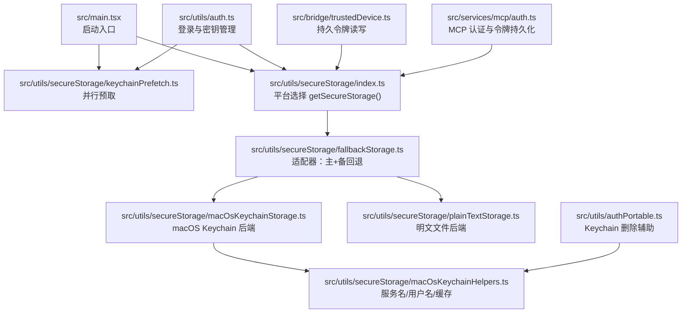
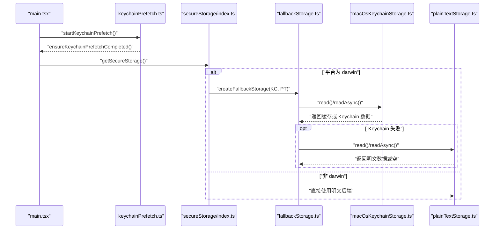
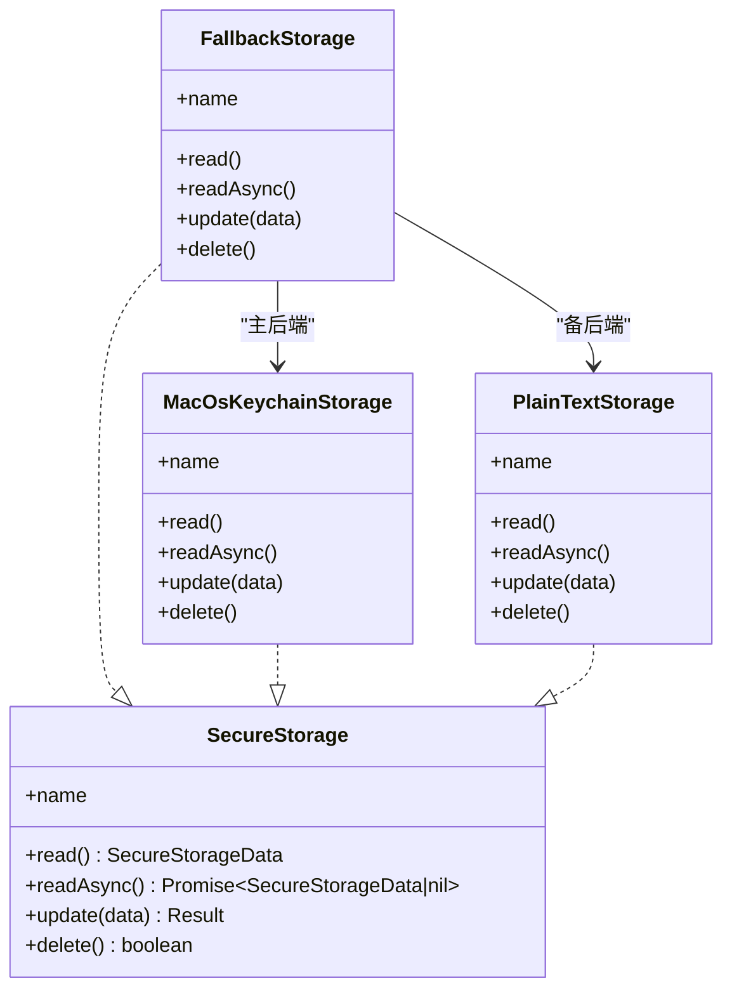
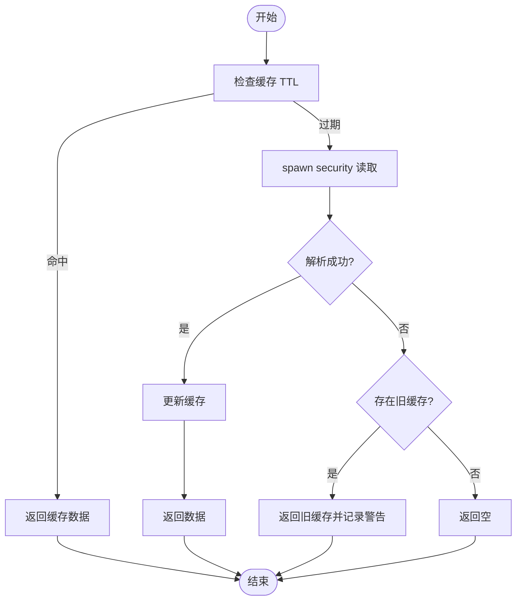
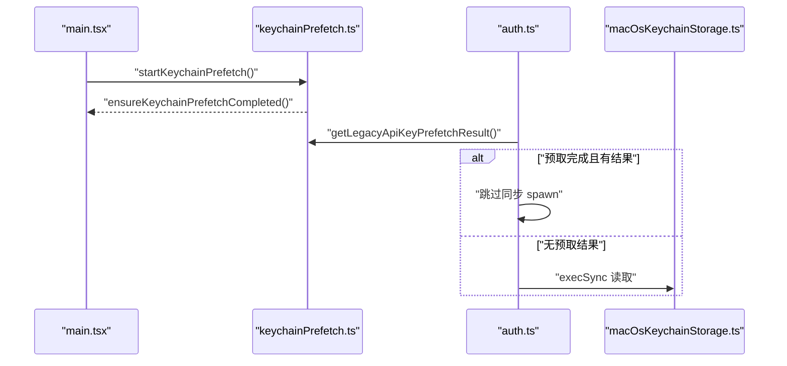
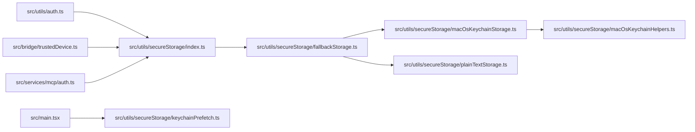

# 安全存储机制

<cite>
**本文引用的文件**
- [src/main.tsx](file://src/main.tsx)
- [src/utils/secureStorage/index.ts](file://src/utils/secureStorage/index.ts)
- [src/utils/secureStorage/fallbackStorage.ts](file://src/utils/secureStorage/fallbackStorage.ts)
- [src/utils/secureStorage/macOsKeychainStorage.ts](file://src/utils/secureStorage/macOsKeychainStorage.ts)
- [src/utils/secureStorage/plainTextStorage.ts](file://src/utils/secureStorage/plainTextStorage.ts)
- [src/utils/secureStorage/macOsKeychainHelpers.ts](file://src/utils/secureStorage/macOsKeychainHelpers.ts)
- [src/utils/secureStorage/keychainPrefetch.ts](file://src/utils/secureStorage/keychainPrefetch.ts)
- [src/utils/auth.ts](file://src/utils/auth.ts)
- [src/utils/authPortable.ts](file://src/utils/authPortable.ts)
- [src/bridge/trustedDevice.ts](file://src/bridge/trustedDevice.ts)
- [src/services/mcp/auth.ts](file://src/services/mcp/auth.ts)
</cite>

## 目录
1. [引言](#引言)
2. [项目结构](#项目结构)
3. [核心组件](#核心组件)
4. [架构总览](#架构总览)
5. [详细组件分析](#详细组件分析)
6. [依赖关系分析](#依赖关系分析)
7. [性能考量](#性能考量)
8. [故障排查指南](#故障排查指南)
9. [结论](#结论)
10. [附录：使用示例与最佳实践](#附录使用示例与最佳实践)

## 引言
本文件系统化梳理 Claude Code 的跨平台安全存储实现，重点覆盖以下方面：
- 平台特定存储后端选择与适配器模式
- 回退机制设计（macOS 上优先 Keychain，失败时回退到明文文件）
- macOS Keychain 集成细节（服务名构造、缓存与并发读取、写入与命令行限制）
- 存储配置与平台兼容性（Linux 计划、Windows 方案）
- 加密与安全评估（当前实现为明文文件，Keychain 作为替代方案）
- 性能优化与错误处理策略
- 实际使用示例与最佳实践

## 项目结构
安全存储相关代码集中在 src/utils/secureStorage 目录，并通过统一入口在运行时按平台选择具体实现；同时在应用启动阶段并行预取 Keychain 内容以降低冷启动延迟。

**图表来源**
- [src/main.tsx:17](file://src/main.tsx#L17)
- [src/utils/secureStorage/index.ts:9](file://src/utils/secureStorage/index.ts#L9)
- [src/utils/secureStorage/fallbackStorage.ts:7](file://src/utils/secureStorage/fallbackStorage.ts#L7)
- [src/utils/secureStorage/macOsKeychainStorage.ts:26](file://src/utils/secureStorage/macOsKeychainStorage.ts#L26)
- [src/utils/secureStorage/plainTextStorage.ts:19](file://src/utils/secureStorage/plainTextStorage.ts#L19)
- [src/utils/secureStorage/macOsKeychainHelpers.ts:29](file://src/utils/secureStorage/macOsKeychainHelpers.ts#L29)
- [src/utils/secureStorage/keychainPrefetch.ts:69](file://src/utils/secureStorage/keychainPrefetch.ts#L69)
- [src/utils/auth.ts:62](file://src/utils/auth.ts#L62)
- [src/utils/authPortable.ts:4](file://src/utils/authPortable.ts#L4)
- [src/bridge/trustedDevice.ts:11](file://src/bridge/trustedDevice.ts#L11)
- [src/services/mcp/auth.ts:40](file://src/services/mcp/auth.ts#L40)

**章节来源**
- [src/main.tsx:17](file://src/main.tsx#L17)
- [src/utils/secureStorage/index.ts:9](file://src/utils/secureStorage/index.ts#L9)

## 核心组件
- 安全存储接口与适配器
  - 接口定义：读取、异步读取、更新、删除
  - 适配器：createFallbackStorage(primary, secondary) 提供主备回退
- macOS Keychain 后端
  - 通过 security 命令读写通用密码条目
  - JSON 序列化存储，支持 stdin 与 argv 两种写入方式
  - 缓存与并发控制，避免重复昂贵的子进程调用
- 明文文件后端
  - 将 JSON 数据写入用户配置目录下的 .credentials.json
  - 文件权限设置为 0600，提示“明文存储”风险
- Keychain 预取与缓存
  - 启动阶段并行预取 OAuth 与旧版 API Key
  - 缓存 TTL 与失效传播，保证多实例一致性
- 平台选择
  - darwin 使用主备适配器（Keychain 为主，明文为备）
  - 其他平台直接使用明文文件后端（Linux 计划中）

**章节来源**
- [src/utils/secureStorage/fallbackStorage.ts:7](file://src/utils/secureStorage/fallbackStorage.ts#L7)
- [src/utils/secureStorage/macOsKeychainStorage.ts:26](file://src/utils/secureStorage/macOsKeychainStorage.ts#L26)
- [src/utils/secureStorage/plainTextStorage.ts:19](file://src/utils/secureStorage/plainTextStorage.ts#L19)
- [src/utils/secureStorage/macOsKeychainHelpers.ts:69](file://src/utils/secureStorage/macOsKeychainHelpers.ts#L69)
- [src/utils/secureStorage/keychainPrefetch.ts:69](file://src/utils/secureStorage/keychainPrefetch.ts#L69)
- [src/utils/secureStorage/index.ts:9](file://src/utils/secureStorage/index.ts#L9)

## 架构总览
下图展示从应用启动到安全存储可用的关键路径，以及平台选择与回退策略：

**图表来源**
- [src/main.tsx:17](file://src/main.tsx#L17)
- [src/utils/secureStorage/keychainPrefetch.ts:69](file://src/utils/secureStorage/keychainPrefetch.ts#L69)
- [src/utils/secureStorage/index.ts:9](file://src/utils/secureStorage/index.ts#L9)
- [src/utils/secureStorage/fallbackStorage.ts:7](file://src/utils/secureStorage/fallbackStorage.ts#L7)
- [src/utils/secureStorage/macOsKeychainStorage.ts:26](file://src/utils/secureStorage/macOsKeychainStorage.ts#L26)
- [src/utils/secureStorage/plainTextStorage.ts:19](file://src/utils/secureStorage/plainTextStorage.ts#L19)

## 详细组件分析

### 组件一：平台选择与适配器模式
- 平台选择逻辑
  - darwin：返回主备适配器（Keychain 为主，明文为备）
  - 其他平台：直接返回明文文件后端
- 适配器行为
  - 读取：优先主后端，失败则回退备后端
  - 更新：先尝试主后端；若失败且主后端之前为空，则删除备后端以迁移；若主后端有旧有效条目而更新失败，尽力删除主后端以避免“新写入被旧条目遮蔽”
  - 删除：双后端均尝试删除，任一成功即算成功

**图表来源**
- [src/utils/secureStorage/fallbackStorage.ts:7](file://src/utils/secureStorage/fallbackStorage.ts#L7)
- [src/utils/secureStorage/macOsKeychainStorage.ts:26](file://src/utils/secureStorage/macOsKeychainStorage.ts#L26)
- [src/utils/secureStorage/plainTextStorage.ts:19](file://src/utils/secureStorage/plainTextStorage.ts#L19)

**章节来源**
- [src/utils/secureStorage/index.ts:9](file://src/utils/secureStorage/index.ts#L9)
- [src/utils/secureStorage/fallbackStorage.ts:7](file://src/utils/secureStorage/fallbackStorage.ts#L7)

### 组件二：macOS Keychain 集成
- 服务名构造
  - 基于配置目录路径进行哈希，仅在非默认目录时附加稳定后缀，确保向后兼容
  - OAuth 条目与旧版 API Key 条目使用不同后缀，避免冲突
- 读取与缓存
  - 同步读取路径：spawnSync 调用 security，结果 JSON 解析后写入缓存
  - 异步读取路径：并发去重、生成号隔离、过期时间控制，失败时提供“陈旧-while-错误”策略
- 写入与命令行限制
  - 优先使用 stdin（security -i）写入，避免命令行参数暴露；当负载超过 stdin 行长度限制时回退到 argv
  - 写入前清理缓存，成功后更新缓存
- 锁定状态检测
  - 通过 security show-keychain-info 检查锁状态，结果缓存于进程生命周期内

**图表来源**
- [src/utils/secureStorage/macOsKeychainStorage.ts:28](file://src/utils/secureStorage/macOsKeychainStorage.ts#L28)
- [src/utils/secureStorage/macOsKeychainStorage.ts:67](file://src/utils/secureStorage/macOsKeychainStorage.ts#L67)
- [src/utils/secureStorage/macOsKeychainStorage.ts:178](file://src/utils/secureStorage/macOsKeychainStorage.ts#L178)

**章节来源**
- [src/utils/secureStorage/macOsKeychainHelpers.ts:29](file://src/utils/secureStorage/macOsKeychainHelpers.ts#L29)
- [src/utils/secureStorage/macOsKeychainStorage.ts:26](file://src/utils/secureStorage/macOsKeychainStorage.ts#L26)
- [src/utils/secureStorage/macOsKeychainStorage.ts:211](file://src/utils/secureStorage/macOsKeychainStorage.ts#L211)

### 组件三：明文文件存储
- 存储位置
  - 用户配置目录下的 .credentials.json
- 写入行为
  - 创建目录、写入 JSON、设置文件权限 0600
  - 返回“明文存储”警告
- 读取与删除
  - 读取失败返回空；删除不存在文件视为成功

**章节来源**
- [src/utils/secureStorage/plainTextStorage.ts:19](file://src/utils/secureStorage/plainTextStorage.ts#L19)

### 组件四：Keychain 预取与启动性能
- 并行预取
  - 在 main.tsx 顶部并行触发两个 security 子进程（OAuth 与旧版 API Key），与模块导入并行执行
- 结果注入
  - 若预取未超时，将结果注入缓存；超时则由同步读取重试
- 同步读取跳过
  - 在 auth.ts 中，若预取已完成且有结果，可跳过同步 spawn

**图表来源**
- [src/main.tsx:17](file://src/main.tsx#L17)
- [src/utils/secureStorage/keychainPrefetch.ts:69](file://src/utils/secureStorage/keychainPrefetch.ts#L69)
- [src/utils/secureStorage/keychainPrefetch.ts:104](file://src/utils/secureStorage/keychainPrefetch.ts#L104)
- [src/utils/auth.ts:1057](file://src/utils/auth.ts#L1057)

**章节来源**
- [src/utils/secureStorage/keychainPrefetch.ts:69](file://src/utils/secureStorage/keychainPrefetch.ts#L69)
- [src/utils/auth.ts:1057](file://src/utils/auth.ts#L1057)

### 组件五：OAuth 令牌与可信设备令牌的持久化
- 可信设备令牌
  - 通过 getSecureStorage().read() 读取，持久化周期较长（滚动过期）
  - 删除时清除存储与缓存
- MCP OAuth
  - 读取/更新 SecureStorageData 中的 mcpOAuth 字段
  - 通过缓存 TTL 与键链缓存配合，避免频繁刷新

**章节来源**
- [src/bridge/trustedDevice.ts:11](file://src/bridge/trustedDevice.ts#L11)
- [src/bridge/trustedDevice.ts:50](file://src/bridge/trustedDevice.ts#L50)
- [src/bridge/trustedDevice.ts:75](file://src/bridge/trustedDevice.ts#L75)
- [src/services/mcp/auth.ts:360](file://src/services/mcp/auth.ts#L360)
- [src/services/mcp/auth.ts:586](file://src/services/mcp/auth.ts#L586)

## 依赖关系分析
- 运行时耦合
  - getSecureStorage() 是唯一对外入口，其他模块仅依赖该函数返回的抽象接口
  - macOS Keychain 后端依赖 helpers 提供的服务名、用户名与缓存状态
- 启动期耦合
  - main.tsx 在模块导入早期触发 keychainPrefetch，避免后续同步读取阻塞
- 外部依赖
  - macOS 依赖 security 命令行工具
  - Linux 计划引入 libsecret（当前注释提示）
  - Windows 未见实现，建议采用 DPAPI 或 Credential Manager

**图表来源**
- [src/utils/auth.ts:62](file://src/utils/auth.ts#L62)
- [src/utils/secureStorage/index.ts:9](file://src/utils/secureStorage/index.ts#L9)
- [src/utils/secureStorage/fallbackStorage.ts:7](file://src/utils/secureStorage/fallbackStorage.ts#L7)
- [src/utils/secureStorage/macOsKeychainStorage.ts:26](file://src/utils/secureStorage/macOsKeychainStorage.ts#L26)
- [src/utils/secureStorage/plainTextStorage.ts:19](file://src/utils/secureStorage/plainTextStorage.ts#L19)
- [src/utils/secureStorage/macOsKeychainHelpers.ts:29](file://src/utils/secureStorage/macOsKeychainHelpers.ts#L29)
- [src/main.tsx:17](file://src/main.tsx#L17)
- [src/utils/secureStorage/keychainPrefetch.ts:69](file://src/utils/secureStorage/keychainPrefetch.ts#L69)
- [src/bridge/trustedDevice.ts:11](file://src/bridge/trustedDevice.ts#L11)
- [src/services/mcp/auth.ts:40](file://src/services/mcp/auth.ts#L40)

**章节来源**
- [src/utils/secureStorage/index.ts:9](file://src/utils/secureStorage/index.ts#L9)
- [src/utils/secureStorage/fallbackStorage.ts:7](file://src/utils/secureStorage/fallbackStorage.ts#L7)

## 性能考量
- 启动阶段并行预取
  - 避免每次启动都进行同步 spawn，显著降低冷启动延迟
- Keychain 缓存与并发
  - TTL 控制跨进程一致性与新鲜度平衡
  - readAsync 并发去重，避免风暴式重复 spawn
- 写入路径优化
  - stdin 优先写入，超出限制回退 argv；避免命令行暴露
- 文件权限与 I/O
  - 明文文件写入后设置严格权限，减少泄露面

**章节来源**
- [src/utils/secureStorage/keychainPrefetch.ts:69](file://src/utils/secureStorage/keychainPrefetch.ts#L69)
- [src/utils/secureStorage/macOsKeychainStorage.ts:67](file://src/utils/secureStorage/macOsKeychainStorage.ts#L67)
- [src/utils/secureStorage/macOsKeychainStorage.ts:178](file://src/utils/secureStorage/macOsKeychainStorage.ts#L178)
- [src/utils/secureStorage/plainTextStorage.ts:61](file://src/utils/secureStorage/plainTextStorage.ts#L61)

## 故障排查指南
- Keychain 无法读取
  - 检查是否锁定（isMacOsKeychainLocked），必要时解锁
  - 查看缓存状态与生成号，确认是否存在并发写入导致的过期
- 写入失败
  - 确认 security 命令可用与权限正确
  - 检查负载是否超过 stdin 行长度限制，必要时改用 argv
- 回退行为异常
  - 主后端写入失败但备后端成功时，会尽力删除主后端以避免遮蔽旧条目
  - 若主后端此前为空，会删除备后端以完成迁移
- 删除 API Key
  - macOS 平台可通过专用函数删除 Keychain 条目，失败时抛出错误

**章节来源**
- [src/utils/secureStorage/macOsKeychainStorage.ts:211](file://src/utils/secureStorage/macOsKeychainStorage.ts#L211)
- [src/utils/secureStorage/fallbackStorage.ts:27](file://src/utils/secureStorage/fallbackStorage.ts#L27)
- [src/utils/secureStorage/fallbackStorage.ts:52](file://src/utils/secureStorage/fallbackStorage.ts#L52)
- [src/utils/authPortable.ts:4](file://src/utils/authPortable.ts#L4)

## 结论
- 当前实现采用“平台选择 + 适配器 + 回退”的稳健架构：darwin 优先 Keychain，失败回退明文；其他平台直接使用明文
- macOS Keychain 集成具备完善的缓存、并发与写入保护机制，启动阶段并行预取进一步优化性能
- 明文文件后端提供最低成本的跨平台兼容性，但需注意安全风险
- Linux 与 Windows 的安全存储尚未实现，建议按平台特性引入对应系统级凭据存储

## 附录：使用示例与最佳实践
- 获取安全存储实例
  - 使用 getSecureStorage() 获取抽象后端，无需关心平台差异
- 读取与更新
  - 读取：优先 readAsync，必要时使用 read
  - 更新：传入包含所需字段的 SecureStorageData，自动处理回退与迁移
- 删除凭据
  - macOS：使用专用删除函数；非 darwin：通过后端 delete
- 最佳实践
  - 优先使用 Keychain（darwin）或等价系统级存储（Linux/Windows）
  - 对敏感数据进行最小化暴露，避免命令行参数传递
  - 合理设置缓存 TTL，平衡新鲜度与性能
  - 在多实例场景下，依赖缓存失效传播避免竞态

**章节来源**
- [src/utils/secureStorage/index.ts:9](file://src/utils/secureStorage/index.ts#L9)
- [src/utils/secureStorage/fallbackStorage.ts:7](file://src/utils/secureStorage/fallbackStorage.ts#L7)
- [src/utils/auth.ts:1094](file://src/utils/auth.ts#L1094)
- [src/utils/auth.ts:1170](file://src/utils/auth.ts#L1170)
- [src/utils/authPortable.ts:4](file://src/utils/authPortable.ts#L4)