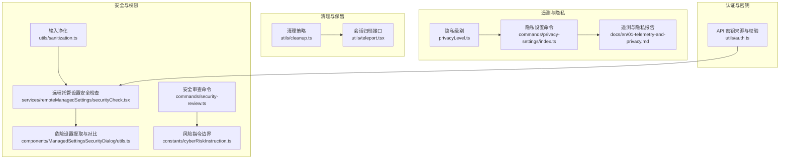
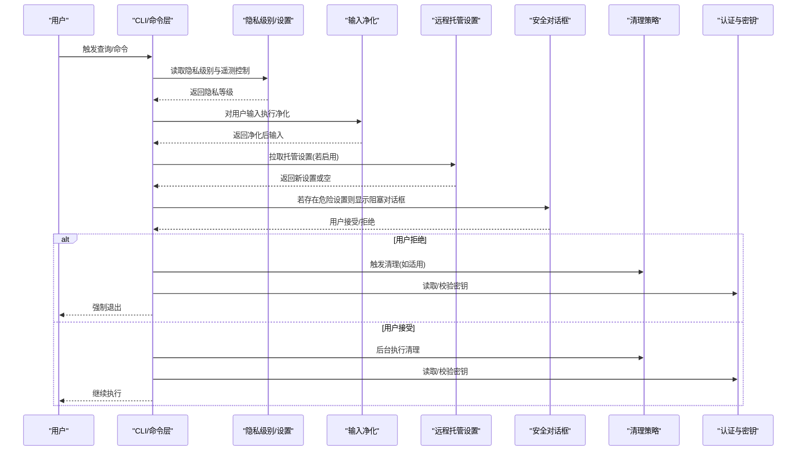
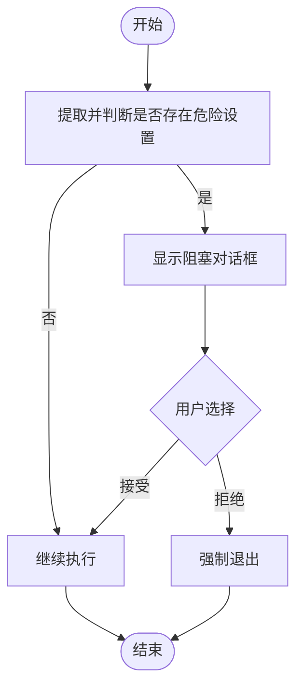
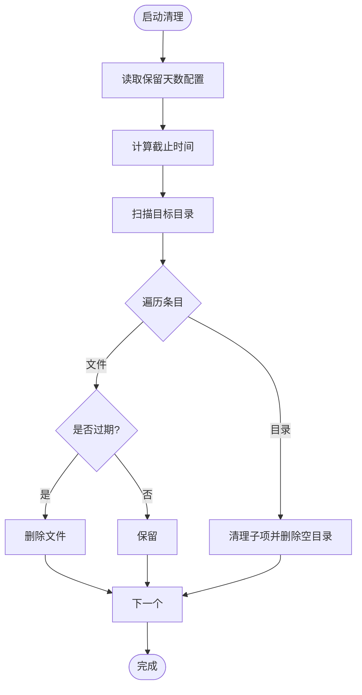
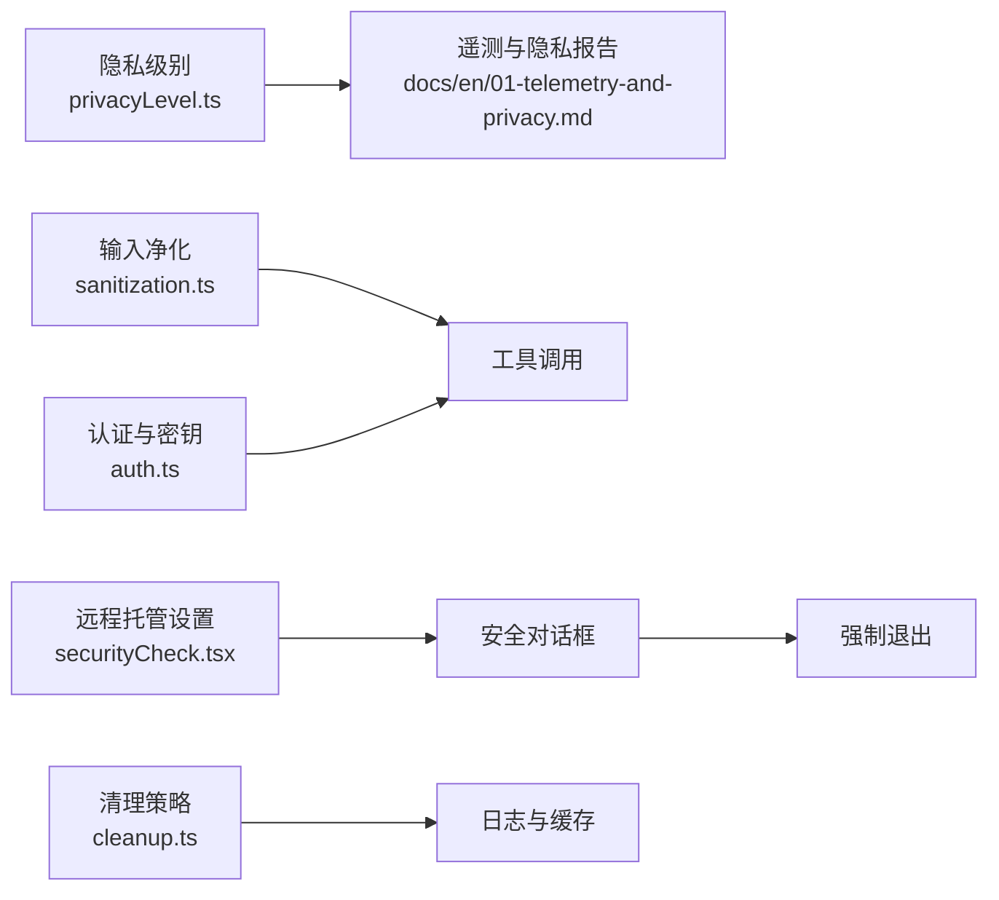

# 数据保护策略

<cite>
**本文引用的文件**
- [README.md](file://README.md)
- [01-telemetry-and-privacy.md](file://docs/en/01-telemetry-and-privacy.md)
- [privacyLevel.ts](file://src/utils/privacyLevel.ts)
- [index.ts](file://src/commands/privacy-settings/index.ts)
- [sanitization.ts](file://src/utils/sanitization.ts)
- [securityCheck.tsx](file://src/services/remoteManagedSettings/securityCheck.tsx)
- [utils.ts](file://src/components/ManagedSettingsSecurityDialog/utils.ts)
- [cleanup.ts](file://src/utils/cleanup.ts)
- [cyberRiskInstruction.ts](file://src/constants/cyberRiskInstruction.ts)
- [security-review.ts](file://src/commands/security-review.ts)
- [auth.ts](file://src/utils/auth.ts)
- [teleport.tsx](file://src/utils/teleport.tsx)
</cite>

## 目录
1. [引言](#引言)
2. [项目结构](#项目结构)
3. [核心组件](#核心组件)
4. [架构总览](#架构总览)
5. [详细组件分析](#详细组件分析)
6. [依赖关系分析](#依赖关系分析)
7. [性能考量](#性能考量)
8. [故障排查指南](#故障排查指南)
9. [结论](#结论)
10. [附录](#附录)

## 引言
本文件面向 Claude Code 的数据保护策略，基于仓库中的源代码与文档进行技术性梳理，聚焦以下方面：
- 数据分类与敏感信息识别：自动敏感数据检测、数据标记与分类规则
- 加密与密钥管理：传输加密、存储加密与密钥管理策略
- 数据脱敏与匿名化：PII 识别、数据掩码与差分隐私应用
- 访问控制与使用限制：数据共享策略、保留期限与删除机制
- 数据完整性：校验、版本控制与审计追踪
- 配置示例与合规要求
- 泄露防护与应急响应流程

本文件严格依据仓库内现有实现与文档进行说明，避免臆测。

## 项目结构
从整体上，Claude Code 的数据保护涉及多个层面：
- 隐私与遥测：遥测收集范围、环境指纹、进程指标、工具输入截断与可选全量记录
- 安全与权限：工具调用权限、危险设置检查、强制对话框与退出策略
- 清理与保留：会话日志、调试日志、计划文件、文件历史备份等的清理策略
- 输入净化：Unicode 隐藏字符攻击防护
- 远端控制与密钥：远程托管设置拉取、安全检查与密钥来源

**图表来源**
- [privacyLevel.ts:1-56](file://src/utils/privacyLevel.ts#L1-L56)
- [index.ts:1-15](file://src/commands/privacy-settings/index.ts#L1-L15)
- [01-telemetry-and-privacy.md:1-125](file://docs/en/01-telemetry-and-privacy.md#L1-L125)
- [sanitization.ts:1-92](file://src/utils/sanitization.ts#L1-L92)
- [securityCheck.tsx:1-74](file://src/services/remoteManagedSettings/securityCheck.tsx#L1-L74)
- [utils.ts:1-145](file://src/components/ManagedSettingsSecurityDialog/utils.ts#L1-L145)
- [cleanup.ts:1-603](file://src/utils/cleanup.ts#L1-L603)
- [teleport.tsx:1206-1225](file://src/utils/teleport.tsx#L1206-L1225)
- [auth.ts:1057-1096](file://src/utils/auth.ts#L1057-L1096)
- [cyberRiskInstruction.ts:1-24](file://src/constants/cyberRiskInstruction.ts#L1-L24)
- [security-review.ts:42-108](file://src/commands/security-review.ts#L42-L108)

**章节来源**
- [README.md:1-224](file://README.md#L1-L224)

## 核心组件
- 隐私级别与遥测控制：通过环境变量与隐私级别函数控制遥测与非必要网络流量的启用状态，支持“默认”“无遥测”“仅必要流量”三个等级。
- 输入净化：对提示文本进行 Unicode 规范化与危险字符移除，防止隐藏字符注入。
- 远程托管设置安全检查：在新设置包含危险项时弹出阻塞式对话框，用户拒绝则强制退出。
- 清理策略：按保留期删除会话日志、调试日志、计划文件、文件历史备份等；支持阈值控制与并发清理。
- 认证与密钥：统一的 API 密钥来源与格式校验，支持 macOS Keychain 读取与全局配置。
- 风险指令边界：定义安全测试、CTF、研究等场景的协助边界，拒绝破坏性与恶意用途请求。

**章节来源**
- [privacyLevel.ts:1-56](file://src/utils/privacyLevel.ts#L1-L56)
- [sanitization.ts:1-92](file://src/utils/sanitization.ts#L1-L92)
- [securityCheck.tsx:1-74](file://src/services/remoteManagedSettings/securityCheck.tsx#L1-L74)
- [utils.ts:1-145](file://src/components/ManagedSettingsSecurityDialog/utils.ts#L1-L145)
- [cleanup.ts:1-603](file://src/utils/cleanup.ts#L1-L603)
- [auth.ts:1057-1096](file://src/utils/auth.ts#L1057-L1096)
- [cyberRiskInstruction.ts:1-24](file://src/constants/cyberRiskInstruction.ts#L1-L24)

## 架构总览
下图展示数据保护相关模块之间的交互关系与数据流：

**图表来源**
- [privacyLevel.ts:1-56](file://src/utils/privacyLevel.ts#L1-L56)
- [sanitization.ts:1-92](file://src/utils/sanitization.ts#L1-L92)
- [securityCheck.tsx:1-74](file://src/services/remoteManagedSettings/securityCheck.tsx#L1-L74)
- [utils.ts:1-145](file://src/components/ManagedSettingsSecurityDialog/utils.ts#L1-L145)
- [cleanup.ts:1-603](file://src/utils/cleanup.ts#L1-L603)
- [auth.ts:1057-1096](file://src/utils/auth.ts#L1057-L1096)

## 详细组件分析

### 数据分类与敏感信息识别
- 自动敏感数据检测
  - 工具输入默认截断：字符串、JSON、数组、嵌套对象均有限制长度与深度，降低敏感信息泄露风险。
  - 当设置特定环境变量时，可开启完整工具输入记录，但默认不记录全量细节。
- 数据标记系统
  - 会话日志以 JSONL 形式追加存储，包含用户消息、助手回复、进度与压缩边界标记，便于后续审计与检索。
- 分类规则
  - 隐私级别：通过环境变量与函数返回值决定是否禁用遥测与非必要网络流量。
  - 危险设置：远程托管设置中包含危险 Shell 设置、非白名单环境变量与钩子等，一旦变更即触发安全检查。

**章节来源**
- [01-telemetry-and-privacy.md:65-87](file://docs/en/01-telemetry-and-privacy.md#L65-L87)
- [01-telemetry-and-privacy.md:88-105](file://docs/en/01-telemetry-and-privacy.md#L88-L105)
- [privacyLevel.ts:1-56](file://src/utils/privacyLevel.ts#L1-L56)
- [utils.ts:1-145](file://src/components/ManagedSettingsSecurityDialog/utils.ts#L1-L145)

### 数据加密与密钥管理
- 传输加密
  - 遥测与第三方日志上报使用 HTTPS 通道，端点地址明确，符合最小暴露原则。
- 存储加密
  - 仓库未发现本地存储加密实现；会话日志与调试日志以明文形式保存于本地目录。
- 密钥管理
  - API 密钥来源：优先从 macOS Keychain 读取，其次从全局配置读取；同时对密钥格式进行正则校验，确保仅允许字母数字与连字符、下划线。
  - 远端托管设置拉取：通过受控端点获取，结合安全检查与阻塞对话框，防止未经用户同意的高危变更生效。

**章节来源**
- [01-telemetry-and-privacy.md:11-27](file://docs/en/01-telemetry-and-privacy.md#L11-L27)
- [auth.ts:1057-1096](file://src/utils/auth.ts#L1057-L1096)
- [securityCheck.tsx:1-74](file://src/services/remoteManagedSettings/securityCheck.tsx#L1-L74)

### 数据脱敏与匿名化
- PII 识别与处理
  - 工具输入默认截断，避免长文本与深层结构导致的敏感信息泄露。
  - 文件扩展名跟踪：对特定文件操作命令提取扩展名，用于统计与分析，但不包含文件内容。
- 数据掩码
  - 遥测事件中的用户标识（如会话 ID、设备 ID、账户 UUID）采用哈希或短前缀形式发送，避免直接暴露。
- 差分隐私
  - 仓库未发现差分隐私实现。

**章节来源**
- [01-telemetry-and-privacy.md:65-87](file://docs/en/01-telemetry-and-privacy.md#L65-L87)
- [01-telemetry-and-privacy.md:82-87](file://docs/en/01-telemetry-and-privacy.md#L82-L87)

### 访问控制与使用限制
- 权限与授权
  - 工具调用需经过输入验证、预执行钩子、规则匹配与交互确认，最终由工具自身逻辑进行路径沙箱等检查。
- 远程托管设置
  - 新设置若包含危险项，将弹出阻塞对话框；用户拒绝则强制退出，确保高风险变更无法在未获许可情况下生效。
- 使用限制
  - 隐私级别控制遥测与非必要网络流量；远程托管设置轮询周期与重试策略可控。

**图表来源**
- [utils.ts:1-145](file://src/components/ManagedSettingsSecurityDialog/utils.ts#L1-L145)
- [securityCheck.tsx:1-74](file://src/services/remoteManagedSettings/securityCheck.tsx#L1-L74)

**章节来源**
- [README.md:567-605](file://README.md#L567-L605)
- [securityCheck.tsx:1-74](file://src/services/remoteManagedSettings/securityCheck.tsx#L1-L74)
- [utils.ts:1-145](file://src/components/ManagedSettingsSecurityDialog/utils.ts#L1-L145)

### 数据完整性保护
- 校验
  - 会话日志采用 JSONL 追加写入，具备崩溃恢复能力；失败事件持久化至本地磁盘并重试。
- 版本控制
  - 仓库未发现专用版本控制机制；清理策略中包含对旧版本缓存的清理。
- 审计追踪
  - 安全对话框显示与结果事件被记录，便于审计与回溯。

**章节来源**
- [01-telemetry-and-privacy.md:11-18](file://docs/en/01-telemetry-and-privacy.md#L11-L18)
- [securityCheck.tsx:38-59](file://src/services/remoteManagedSettings/securityCheck.tsx#L38-L59)

### 数据保留与删除机制
- 保留期限
  - 默认保留 30 天；可通过设置覆盖该值。
- 删除策略
  - 后台批量清理：会话日志、调试日志、计划文件、文件历史备份、会话环境目录、图像缓存、剪贴板等。
  - 会话归档：通过接口将远端会话归档，减少在线存储占用。

**图表来源**
- [cleanup.ts:23-31](file://src/utils/cleanup.ts#L23-L31)
- [cleanup.ts:93-132](file://src/utils/cleanup.ts#L93-L132)
- [cleanup.ts:155-258](file://src/utils/cleanup.ts#L155-L258)
- [cleanup.ts:305-348](file://src/utils/cleanup.ts#L305-L348)
- [cleanup.ts:350-388](file://src/utils/cleanup.ts#L350-L388)
- [cleanup.ts:396-429](file://src/utils/cleanup.ts#L396-L429)
- [teleport.tsx:1206-1225](file://src/utils/teleport.tsx#L1206-L1225)

**章节来源**
- [cleanup.ts:1-603](file://src/utils/cleanup.ts#L1-L603)
- [teleport.tsx:1206-1225](file://src/utils/teleport.tsx#L1206-L1225)

### 数据保护配置示例
- 禁用遥测与非必要网络流量
  - 设置环境变量以进入“无遥测”或“仅必要流量”模式，从而关闭第一方事件日志与第三方日志上报。
- 开启工具输入全量记录
  - 通过设置指定环境变量可开启完整工具输入记录，但默认不记录全量细节。
- 远程托管设置安全检查
  - 当新设置包含危险项时，必须经用户确认；拒绝将导致强制退出。

**章节来源**
- [privacyLevel.ts:1-56](file://src/utils/privacyLevel.ts#L1-L56)
- [01-telemetry-and-privacy.md:76-81](file://docs/en/01-telemetry-and-privacy.md#L76-L81)
- [securityCheck.tsx:1-74](file://src/services/remoteManagedSettings/securityCheck.tsx#L1-L74)

### 合规性要求
- 风险指令边界
  - 明确界定防御性安全协助与潜在有害活动的边界，拒绝破坏性与恶意用途请求。
- 安全审查
  - 命令行安全审查工具聚焦高影响漏洞，排除低风险与理论性问题，避免误报噪音。

**章节来源**
- [cyberRiskInstruction.ts:1-24](file://src/constants/cyberRiskInstruction.ts#L1-L24)
- [security-review.ts:42-108](file://src/commands/security-review.ts#L42-L108)

### 数据泄露防护与应急响应
- 输入净化
  - 对提示文本进行 Unicode 规范化与危险字符移除，降低隐藏字符注入风险。
- 远程托管设置安全检查
  - 高危变更需用户确认；拒绝即强制退出，避免未授权变更生效。
- 清理与保留
  - 自动清理过期日志与缓存，缩短敏感数据在本地留存时间。
- 应急响应
  - 用户拒绝高危设置时立即退出，避免进一步执行；同时记录相关审计事件，便于后续调查。

**章节来源**
- [sanitization.ts:1-92](file://src/utils/sanitization.ts#L1-L92)
- [securityCheck.tsx:1-74](file://src/services/remoteManagedSettings/securityCheck.tsx#L1-L74)
- [cleanup.ts:1-603](file://src/utils/cleanup.ts#L1-L603)

## 依赖关系分析
- 隐私级别与遥测控制依赖于环境变量解析与设置读取。
- 输入净化在查询生命周期早期执行，贯穿工具调用前的预处理阶段。
- 远程托管设置安全检查在设置更新时触发，与 UI 对话框与日志事件联动。
- 清理策略在后台异步运行，与设置错误检测协同，避免误删。
- 认证与密钥在会话建立与工具执行前进行校验，确保凭据安全。

**图表来源**
- [privacyLevel.ts:1-56](file://src/utils/privacyLevel.ts#L1-L56)
- [01-telemetry-and-privacy.md:1-125](file://docs/en/01-telemetry-and-privacy.md#L1-L125)
- [sanitization.ts:1-92](file://src/utils/sanitization.ts#L1-L92)
- [securityCheck.tsx:1-74](file://src/services/remoteManagedSettings/securityCheck.tsx#L1-L74)
- [cleanup.ts:1-603](file://src/utils/cleanup.ts#L1-L603)
- [auth.ts:1057-1096](file://src/utils/auth.ts#L1057-L1096)

**章节来源**
- [README.md:567-605](file://README.md#L567-L605)

## 性能考量
- 遥测批处理与重试：批量大小与退避策略平衡吞吐与可靠性。
- 清理策略：后台异步清理与锁机制避免阻塞主流程。
- 输入净化：迭代与正则处理在安全与性能间折中，设置最大迭代次数防止异常输入导致资源耗尽。

[本节为通用建议，无需具体文件分析]

## 故障排查指南
- 隐私级别未生效
  - 检查环境变量是否正确设置；确认隐私级别解析逻辑与返回值。
- 遥测仍被上报
  - 确认当前用户类型是否属于可禁用遥测范围；检查第三方日志端点是否被绕过。
- 远程托管设置拒绝后无法继续
  - 检查安全对话框是否被非交互模式跳过；查看强制退出日志事件。
- 清理策略未执行
  - 检查设置错误与显式保留期配置；确认后台清理任务是否被跳过。

**章节来源**
- [privacyLevel.ts:1-56](file://src/utils/privacyLevel.ts#L1-L56)
- [01-telemetry-and-privacy.md:88-105](file://docs/en/01-telemetry-and-privacy.md#L88-L105)
- [securityCheck.tsx:32-36](file://src/services/remoteManagedSettings/securityCheck.tsx#L32-L36)
- [cleanup.ts:575-585](file://src/utils/cleanup.ts#L575-L585)

## 结论
Claude Code 的数据保护策略以隐私级别控制、输入净化、远程托管设置安全检查与自动化清理为核心，形成从采集、处理到存储与处置的闭环。传输加密与密钥管理在现有实现中已覆盖关键路径，而本地存储加密与差分隐私尚未发现实现。建议在后续版本中补充存储加密与差分隐私能力，并完善用户可见的合规与审计界面。

[本节为总结性内容，无需具体文件分析]

## 附录
- 隐私设置命令入口与启用条件
  - 命令注册与启用逻辑位于隐私设置命令文件中，仅对订阅用户开放。
- 风险指令边界与安全审查
  - 风险指令定义了安全测试与研究场景的边界；安全审查命令聚焦高影响漏洞评估。

**章节来源**
- [index.ts:1-15](file://src/commands/privacy-settings/index.ts#L1-L15)
- [cyberRiskInstruction.ts:1-24](file://src/constants/cyberRiskInstruction.ts#L1-L24)
- [security-review.ts:42-108](file://src/commands/security-review.ts#L42-L108)