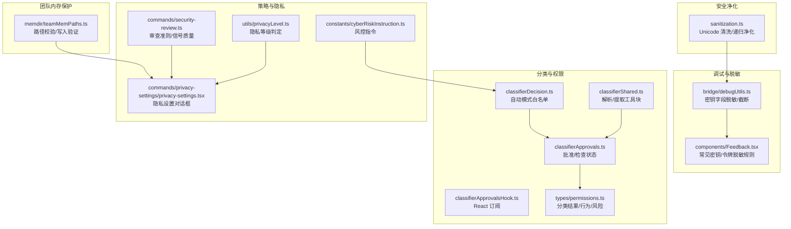
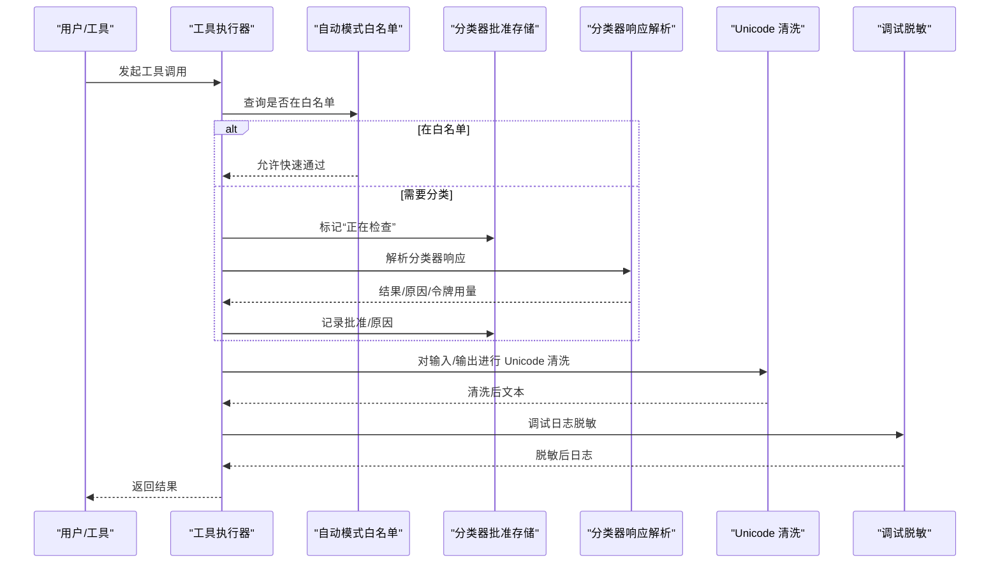
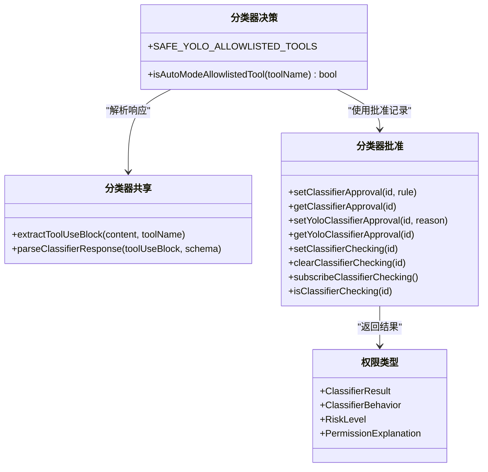
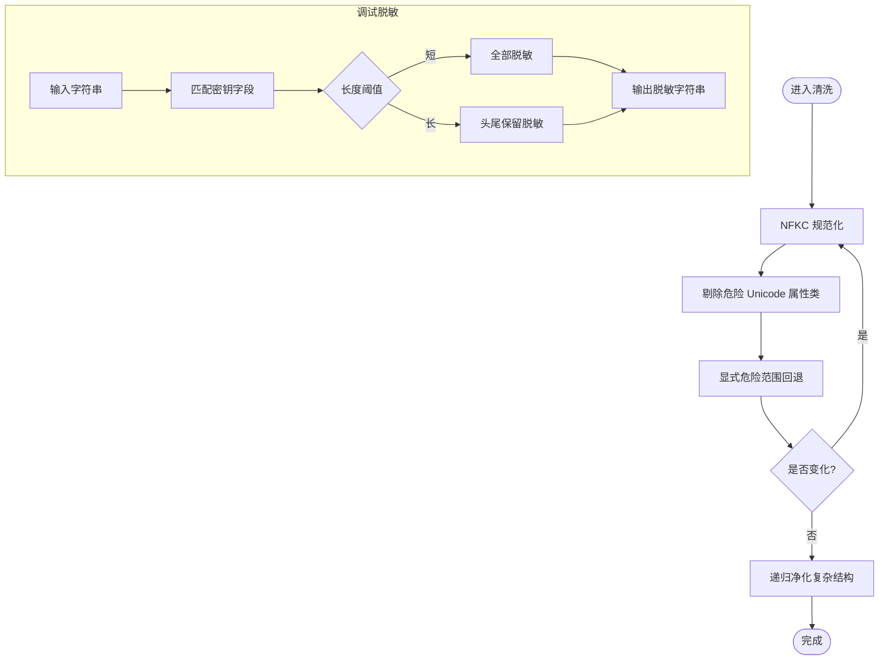
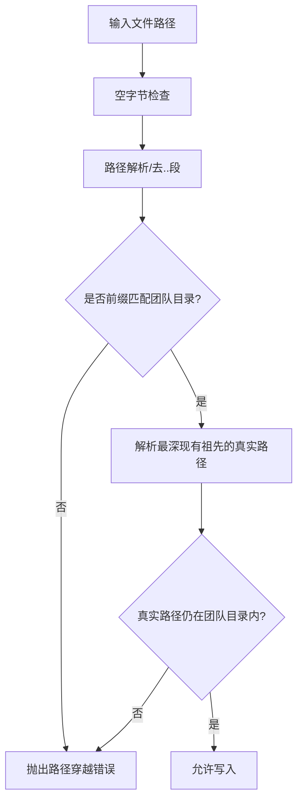
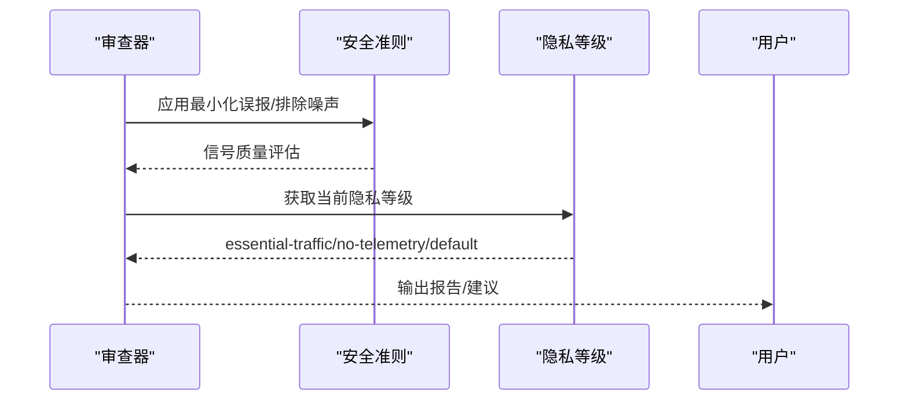
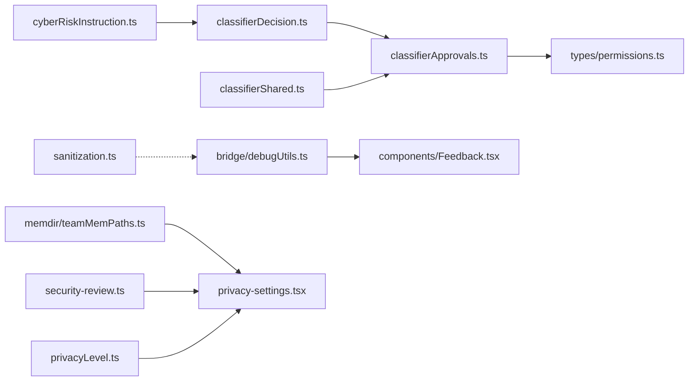

# 数据分类与敏感信息识别

<cite>
**本文引用的文件**
- [src/utils/sanitization.ts](file://src/utils/sanitization.ts)
- [src/bridge/debugUtils.ts](file://src/bridge/debugUtils.ts)
- [src/components/Feedback.tsx](file://src/components/Feedback.tsx)
- [src/memdir/teamMemPaths.ts](file://src/memdir/teamMemPaths.ts)
- [src/utils/permissions/classifierDecision.ts](file://src/utils/permissions/classifierDecision.ts)
- [src/utils/permissions/classifierShared.ts](file://src/utils/permissions/classifierShared.ts)
- [src/utils/classifierApprovals.ts](file://src/utils/classifierApprovals.ts)
- [src/utils/classifierApprovalsHook.ts](file://src/utils/classifierApprovalsHook.ts)
- [src/types/permissions.ts](file://src/types/permissions.ts)
- [src/commands/security-review.ts](file://src/commands/security-review.ts)
- [src/commands/privacy-settings/privacy-settings.tsx](file://src/commands/privacy-settings/privacy-settings.tsx)
- [src/utils/privacyLevel.ts](file://src/utils/privacyLevel.ts)
- [src/constants/cyberRiskInstruction.ts](file://src/constants/cyberRiskInstruction.ts)
</cite>

## 目录
1. [引言](#引言)
2. [项目结构](#项目结构)
3. [核心组件](#核心组件)
4. [架构总览](#架构总览)
5. [详细组件分析](#详细组件分析)
6. [依赖关系分析](#依赖关系分析)
7. [性能考虑](#性能考虑)
8. [故障排查指南](#故障排查指南)
9. [结论](#结论)
10. [附录](#附录)

## 引言
本技术文档聚焦 Claude Code 的“数据分类与敏感信息识别”能力，系统性阐述以下方面：
- 数据分类机制：敏感数据类型识别、数据标记系统、分类规则配置
- 自动敏感数据检测算法：危险模式匹配、PII 识别技术、数据泄露风险评估
- 团队内存中的秘密保护机制：敏感内容过滤、数据暴露检测、自动脱敏处理
- 配置选项与自定义规则：如何启用/禁用分类器、如何扩展白名单与规则
- 实际示例路径：通过源码路径定位关键实现位置，便于复用与扩展
- 性能优化与准确性保障：迭代清洗、白名单跳过、令牌用量统计等

## 项目结构
围绕数据分类与敏感信息识别的关键模块分布如下：
- 分类与权限：工具使用前的分类决策、白名单跳过、分类器结果存储与订阅
- 安全净化：Unicode 隐藏字符攻击防护、递归净化
- 调试与脱敏：调试日志中对密钥字段的脱敏与截断
- 团队内存路径校验：防止路径穿越与符号链接逃逸
- 安全审查与隐私策略：安全审查准则、隐私等级控制、风控指令

**图表来源**
- [src/utils/permissions/classifierDecision.ts:56-98](file://src/utils/permissions/classifierDecision.ts#L56-L98)
- [src/utils/permissions/classifierShared.ts:15-39](file://src/utils/permissions/classifierShared.ts#L15-L39)
- [src/utils/classifierApprovals.ts:19-49](file://src/utils/classifierApprovals.ts#L19-L49)
- [src/utils/classifierApprovalsHook.ts:13-16](file://src/utils/classifierApprovalsHook.ts#L13-L16)
- [src/types/permissions.ts:330-410](file://src/types/permissions.ts#L330-L410)
- [src/utils/sanitization.ts:25-91](file://src/utils/sanitization.ts#L25-L91)
- [src/bridge/debugUtils.ts:26-53](file://src/bridge/debugUtils.ts#L26-L53)
- [src/components/Feedback.tsx:83-110](file://src/components/Feedback.tsx#L83-L110)
- [src/memdir/teamMemPaths.ts:214-256](file://src/memdir/teamMemPaths.ts#L214-L256)
- [src/commands/security-review.ts:42-189](file://src/commands/security-review.ts#L42-L189)
- [src/commands/privacy-settings/privacy-settings.tsx:7-57](file://src/commands/privacy-settings/privacy-settings.tsx#L7-L57)
- [src/utils/privacyLevel.ts:20-55](file://src/utils/privacyLevel.ts#L20-L55)
- [src/constants/cyberRiskInstruction.ts:1-24](file://src/constants/cyberRiskInstruction.ts#L1-L24)

**章节来源**
- [src/utils/permissions/classifierDecision.ts:56-98](file://src/utils/permissions/classifierDecision.ts#L56-L98)
- [src/utils/permissions/classifierShared.ts:15-39](file://src/utils/permissions/classifierShared.ts#L15-L39)
- [src/utils/classifierApprovals.ts:19-49](file://src/utils/classifierApprovals.ts#L19-L49)
- [src/utils/classifierApprovalsHook.ts:13-16](file://src/utils/classifierApprovalsHook.ts#L13-L16)
- [src/types/permissions.ts:330-410](file://src/types/permissions.ts#L330-L410)
- [src/utils/sanitization.ts:25-91](file://src/utils/sanitization.ts#L25-L91)
- [src/bridge/debugUtils.ts:26-53](file://src/bridge/debugUtils.ts#L26-L53)
- [src/components/Feedback.tsx:83-110](file://src/components/Feedback.tsx#L83-L110)
- [src/memdir/teamMemPaths.ts:214-256](file://src/memdir/teamMemPaths.ts#L214-L256)
- [src/commands/security-review.ts:42-189](file://src/commands/security-review.ts#L42-L189)
- [src/commands/privacy-settings/privacy-settings.tsx:7-57](file://src/commands/privacy-settings/privacy-settings.tsx#L7-L57)
- [src/utils/privacyLevel.ts:20-55](file://src/utils/privacyLevel.ts#L20-L55)
- [src/constants/cyberRiskInstruction.ts:1-24](file://src/constants/cyberRiskInstruction.ts#L1-L24)

## 核心组件
- 分类器基础设施与白名单
  - 自动模式白名单工具集，用于跳过不必要的分类器调用，降低延迟与成本
  - 工具块提取与响应解析通用方法，确保分类器输出一致性
  - 分类器批准记录与“正在检查”状态管理，支持订阅式更新
- 安全净化
  - Unicode 隐藏字符攻击防护（NFKC 规范化 + 危险类别剔除 + 显式范围回退）
  - 递归净化支持字符串/数组/对象，保证复杂数据结构的安全
- 调试与脱敏
  - 对调试日志中的密钥字段进行脱敏与长度限制，避免敏感信息外泄
  - 前端反馈组件内置常见密钥/令牌正则，统一脱敏策略
- 团队内存保护
  - 路径解析与前缀保护，防止路径穿越与符号链接逃逸
  - 写入路径的深度解析与真实路径校验，确保落盘安全
- 安全审查与隐私策略
  - 安全审查准则与信号质量标准，指导漏洞评估与报告
  - 隐私等级判定与用户界面交互，支持一键开启/关闭非必要网络

**章节来源**
- [src/utils/permissions/classifierDecision.ts:56-98](file://src/utils/permissions/classifierDecision.ts#L56-L98)
- [src/utils/permissions/classifierShared.ts:15-39](file://src/utils/permissions/classifierShared.ts#L15-L39)
- [src/utils/classifierApprovals.ts:19-49](file://src/utils/classifierApprovals.ts#L19-L49)
- [src/utils/sanitization.ts:25-91](file://src/utils/sanitization.ts#L25-L91)
- [src/bridge/debugUtils.ts:26-53](file://src/bridge/debugUtils.ts#L26-L53)
- [src/components/Feedback.tsx:83-110](file://src/components/Feedback.tsx#L83-L110)
- [src/memdir/teamMemPaths.ts:214-256](file://src/memdir/teamMemPaths.ts#L214-L256)
- [src/commands/security-review.ts:42-189](file://src/commands/security-review.ts#L42-L189)
- [src/utils/privacyLevel.ts:20-55](file://src/utils/privacyLevel.ts#L20-L55)

## 架构总览
下图展示了从工具调用到分类决策、再到安全净化与脱敏的整体流程。

**图表来源**
- [src/utils/permissions/classifierDecision.ts:56-98](file://src/utils/permissions/classifierDecision.ts#L56-L98)
- [src/utils/classifierApprovals.ts:62-78](file://src/utils/classifierApprovals.ts#L62-L78)
- [src/utils/permissions/classifierShared.ts:15-39](file://src/utils/permissions/classifierShared.ts#L15-L39)
- [src/utils/sanitization.ts:25-65](file://src/utils/sanitization.ts#L25-L65)
- [src/bridge/debugUtils.ts:26-53](file://src/bridge/debugUtils.ts#L26-L53)

## 详细组件分析

### 组件A：分类器基础设施与白名单
- 白名单设计目标：跳过只读/元数据/计划模式等低风险工具，减少分类器调用次数
- 关键点
  - 安全工具集合与条件加载，避免外部构建引入无关逻辑
  - 允许快速路径（acceptEdits）与分类器路径并存，兼顾性能与安全
  - 分类器结果包含匹配规则、置信度、原因、令牌用量等，便于审计与优化
- 示例路径
  - [自动模式白名单工具集:56-98](file://src/utils/permissions/classifierDecision.ts#L56-L98)
  - [分类器响应解析与工具块提取:15-39](file://src/utils/permissions/classifierShared.ts#L15-L39)
  - [分类器批准/检查状态管理:19-78](file://src/utils/classifierApprovals.ts#L19-L78)
  - [React 订阅接口:13-16](file://src/utils/classifierApprovalsHook.ts#L13-L16)
  - [分类结果类型定义:330-410](file://src/types/permissions.ts#L330-L410)

**图表来源**
- [src/utils/permissions/classifierDecision.ts:56-98](file://src/utils/permissions/classifierDecision.ts#L56-L98)
- [src/utils/permissions/classifierShared.ts:15-39](file://src/utils/permissions/classifierShared.ts#L15-L39)
- [src/utils/classifierApprovals.ts:19-78](file://src/utils/classifierApprovals.ts#L19-L78)
- [src/types/permissions.ts:330-410](file://src/types/permissions.ts#L330-L410)

**章节来源**
- [src/utils/permissions/classifierDecision.ts:56-98](file://src/utils/permissions/classifierDecision.ts#L56-L98)
- [src/utils/permissions/classifierShared.ts:15-39](file://src/utils/permissions/classifierShared.ts#L15-L39)
- [src/utils/classifierApprovals.ts:19-78](file://src/utils/classifierApprovals.ts#L19-L78)
- [src/utils/classifierApprovalsHook.ts:13-16](file://src/utils/classifierApprovalsHook.ts#L13-L16)
- [src/types/permissions.ts:330-410](file://src/types/permissions.ts#L330-L410)

### 组件B：自动敏感数据检测与脱敏
- Unicode 隐藏字符攻击防护
  - 迭代清洗：NFKC 规范化 + Unicode 属性类剔除 + 显式范围回退
  - 递归净化：支持字符串/数组/对象，避免深层嵌套导致的绕过
- 调试日志脱敏
  - 密钥字段识别与脱敏，长值保留头尾片段，短值直接屏蔽
  - 日志截断与 JSON 化安全处理，避免超长消息影响性能
- 前端反馈脱敏
  - 常见密钥/令牌正则覆盖，统一脱敏占位符

**图表来源**
- [src/utils/sanitization.ts:25-91](file://src/utils/sanitization.ts#L25-L91)
- [src/bridge/debugUtils.ts:26-53](file://src/bridge/debugUtils.ts#L26-L53)
- [src/components/Feedback.tsx:83-110](file://src/components/Feedback.tsx#L83-L110)

**章节来源**
- [src/utils/sanitization.ts:25-91](file://src/utils/sanitization.ts#L25-L91)
- [src/bridge/debugUtils.ts:26-53](file://src/bridge/debugUtils.ts#L26-L53)
- [src/components/Feedback.tsx:83-110](file://src/components/Feedback.tsx#L83-L110)

### 组件C：团队内存中的秘密保护机制
- 路径解析与前缀保护
  - 使用绝对解析消除“..”段，防止路径穿越
  - 前缀攻击保护：要求分隔符后缀，避免“team-evil/”误匹配“team/”
- 符号链接逃逸防护
  - 深度解析现有祖先并校验真实路径，拒绝越界写入
  - 非预期错误时采取“关闭式”保护，避免漏保

**图表来源**
- [src/memdir/teamMemPaths.ts:228-256](file://src/memdir/teamMemPaths.ts#L228-L256)

**章节来源**
- [src/memdir/teamMemPaths.ts:214-256](file://src/memdir/teamMemPaths.ts#L214-L256)

### 组件D：安全审查与隐私策略
- 安全审查准则
  - 最小化误报：仅在 >80% 置信度时标记问题
  - 排除噪声：不报告 DoS、磁盘密钥存储、资源耗尽等问题
  - 信号质量：明确攻击路径、可利用性、可操作性与具体位置
- 隐私等级
  - default/no-telemetry/essential-traffic 三档，按最严格信号合并
  - 提供环境变量原因查询，便于用户解除限制

**图表来源**
- [src/commands/security-review.ts:42-189](file://src/commands/security-review.ts#L42-L189)
- [src/utils/privacyLevel.ts:20-55](file://src/utils/privacyLevel.ts#L20-L55)

**章节来源**
- [src/commands/security-review.ts:42-189](file://src/commands/security-review.ts#L42-L189)
- [src/utils/privacyLevel.ts:20-55](file://src/utils/privacyLevel.ts#L20-L55)
- [src/commands/privacy-settings/privacy-settings.tsx:7-57](file://src/commands/privacy-settings/privacy-settings.tsx#L7-L57)

## 依赖关系分析
- 分类器相关模块耦合度低，职责清晰：
  - 白名单与工具常量解耦于分类器实现
  - 响应解析与工具块提取作为共享工具被多处复用
  - 批准状态独立于业务逻辑，通过订阅驱动 UI 更新
- 安全净化与调试脱敏相互独立但共同服务于“可见即安全”的原则
- 团队内存路径校验与隐私策略分别面向“文件系统边界”和“网络传输边界”，互补存在

**图表来源**
- [src/utils/permissions/classifierDecision.ts:56-98](file://src/utils/permissions/classifierDecision.ts#L56-L98)
- [src/utils/classifierApprovals.ts:19-78](file://src/utils/classifierApprovals.ts#L19-L78)
- [src/utils/permissions/classifierShared.ts:15-39](file://src/utils/permissions/classifierShared.ts#L15-L39)
- [src/types/permissions.ts:330-410](file://src/types/permissions.ts#L330-L410)
- [src/utils/sanitization.ts:25-91](file://src/utils/sanitization.ts#L25-L91)
- [src/bridge/debugUtils.ts:26-53](file://src/bridge/debugUtils.ts#L26-L53)
- [src/components/Feedback.tsx:83-110](file://src/components/Feedback.tsx#L83-L110)
- [src/memdir/teamMemPaths.ts:214-256](file://src/memdir/teamMemPaths.ts#L214-L256)
- [src/commands/security-review.ts:42-189](file://src/commands/security-review.ts#L42-L189)
- [src/commands/privacy-settings/privacy-settings.tsx:7-57](file://src/commands/privacy-settings/privacy-settings.tsx#L7-L57)
- [src/utils/privacyLevel.ts:20-55](file://src/utils/privacyLevel.ts#L20-L55)
- [src/constants/cyberRiskInstruction.ts:1-24](file://src/constants/cyberRiskInstruction.ts#L1-L24)

**章节来源**
- [src/utils/permissions/classifierDecision.ts:56-98](file://src/utils/permissions/classifierDecision.ts#L56-L98)
- [src/utils/classifierApprovals.ts:19-78](file://src/utils/classifierApprovals.ts#L19-L78)
- [src/utils/permissions/classifierShared.ts:15-39](file://src/utils/permissions/classifierShared.ts#L15-L39)
- [src/types/permissions.ts:330-410](file://src/types/permissions.ts#L330-L410)
- [src/utils/sanitization.ts:25-91](file://src/utils/sanitization.ts#L25-L91)
- [src/bridge/debugUtils.ts:26-53](file://src/bridge/debugUtils.ts#L26-L53)
- [src/components/Feedback.tsx:83-110](file://src/components/Feedback.tsx#L83-L110)
- [src/memdir/teamMemPaths.ts:214-256](file://src/memdir/teamMemPaths.ts#L214-L256)
- [src/commands/security-review.ts:42-189](file://src/commands/security-review.ts#L42-L189)
- [src/commands/privacy-settings/privacy-settings.tsx:7-57](file://src/commands/privacy-settings/privacy-settings.tsx#L7-L57)
- [src/utils/privacyLevel.ts:20-55](file://src/utils/privacyLevel.ts#L20-L55)
- [src/constants/cyberRiskInstruction.ts:1-24](file://src/constants/cyberRiskInstruction.ts#L1-L24)

## 性能考虑
- 白名单快速路径：对只读/元数据类工具直接放行，避免分类器调用
- 迭代清洗上限：最大迭代次数保护，防止异常输入导致性能问题
- 令牌用量统计：阶段化分类器记录输入/输出/缓存读取/创建令牌用量，便于成本控制
- 日志截断与安全序列化：避免超长消息与敏感字段引发性能与安全问题

**章节来源**
- [src/utils/permissions/classifierDecision.ts:56-98](file://src/utils/permissions/classifierDecision.ts#L56-L98)
- [src/utils/sanitization.ts:25-65](file://src/utils/sanitization.ts#L25-L65)
- [src/types/permissions.ts:339-396](file://src/types/permissions.ts#L339-L396)
- [src/bridge/debugUtils.ts:37-53](file://src/bridge/debugUtils.ts#L37-L53)

## 故障排查指南
- 分类器未生效
  - 检查功能开关：确认 BASH_CLASSIFIER 或 TRANSCRIPT_CLASSIFIER 是否启用
  - 查看批准记录：是否存在已批准或正在检查的状态
  - 参考路径：[分类器批准/检查状态管理:62-78](file://src/utils/classifierApprovals.ts#L62-L78)
- Unicode 隐藏字符仍被识别为指令
  - 确认输入是否经过多次清洗；迭代清洗有上限保护
  - 参考路径：[Unicode 清洗实现:25-65](file://src/utils/sanitization.ts#L25-L65)
- 调试日志泄露密钥
  - 检查密钥字段是否命中脱敏规则；短值会全部脱敏
  - 参考路径：[调试脱敏:26-53](file://src/bridge/debugUtils.ts#L26-L53)
- 团队内存写入失败
  - 检查路径是否包含空字节、是否越界或符号链接逃逸
  - 参考路径：[路径写入验证:228-256](file://src/memdir/teamMemPaths.ts#L228-L256)
- 安全审查误报/漏报
  - 按照信号质量标准核对攻击路径与可利用性
  - 参考路径：[安全审查准则:42-189](file://src/commands/security-review.ts#L42-L189)

**章节来源**
- [src/utils/classifierApprovals.ts:62-78](file://src/utils/classifierApprovals.ts#L62-L78)
- [src/utils/sanitization.ts:25-65](file://src/utils/sanitization.ts#L25-L65)
- [src/bridge/debugUtils.ts:26-53](file://src/bridge/debugUtils.ts#L26-L53)
- [src/memdir/teamMemPaths.ts:228-256](file://src/memdir/teamMemPaths.ts#L228-L256)
- [src/commands/security-review.ts:42-189](file://src/commands/security-review.ts#L42-L189)

## 结论
本系统通过“白名单快速路径 + 分类器响应解析 + Unicode 清洗 + 调试脱敏 + 路径校验”的多层防护，实现了对敏感信息的自动化识别与保护。配合安全审查准则与隐私等级策略，既保证了安全性，也兼顾了性能与可维护性。建议在扩展新规则时遵循现有解析与批准模式，并持续监控令牌用量与清洗效果。

## 附录
- 配置与自定义
  - 启用/禁用分类器：通过功能开关控制
  - 扩展白名单：在自动模式白名单集中添加受信任工具
  - 自定义脱敏规则：在调试脱敏与前端反馈组件中追加字段与正则
  - 隐私等级：通过环境变量调整，影响网络流量与遥测
- 示例路径（不展示代码，仅提供定位）
  - [自动模式白名单工具集:56-98](file://src/utils/permissions/classifierDecision.ts#L56-L98)
  - [分类器响应解析与工具块提取:15-39](file://src/utils/permissions/classifierShared.ts#L15-L39)
  - [Unicode 清洗实现:25-91](file://src/utils/sanitization.ts#L25-L91)
  - [调试脱敏:26-53](file://src/bridge/debugUtils.ts#L26-L53)
  - [团队内存路径写入验证:228-256](file://src/memdir/teamMemPaths.ts#L228-L256)
  - [安全审查准则:42-189](file://src/commands/security-review.ts#L42-L189)
  - [隐私等级判定:20-55](file://src/utils/privacyLevel.ts#L20-L55)
  - [风控指令:1-24](file://src/constants/cyberRiskInstruction.ts#L1-L24)