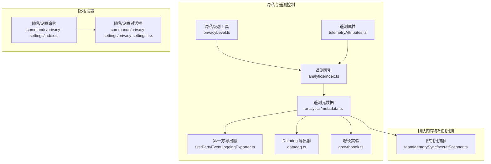
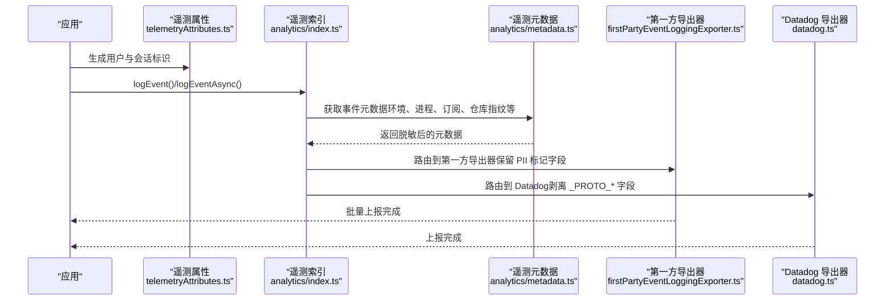
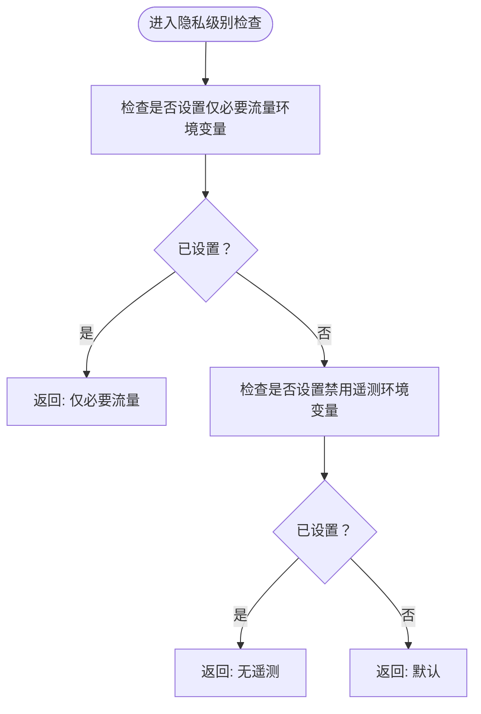
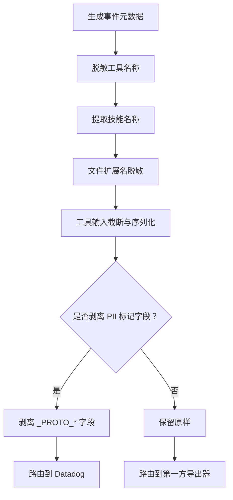
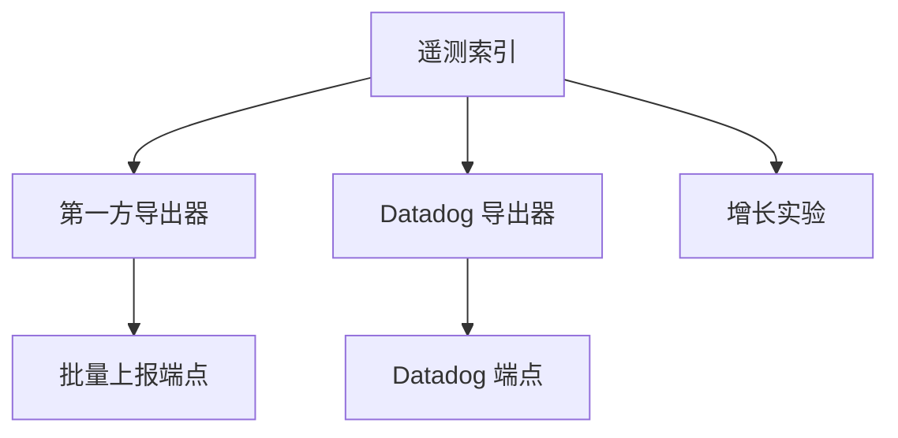
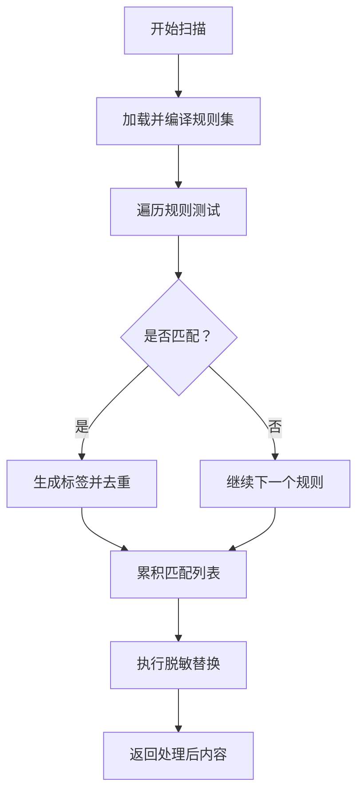
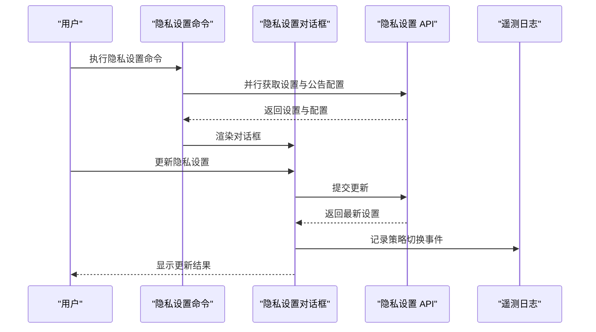
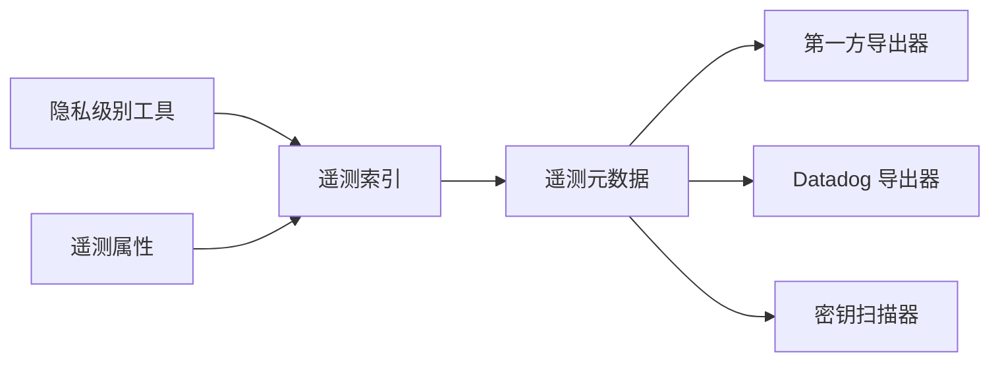

# 数据脱敏与匿名化

<cite>
**本文引用的文件**
- [隐私级别工具 privacyLevel.ts](file://src/utils/privacyLevel.ts)
- [遥测属性 telemetryAttributes.ts](file://src/utils/telemetryAttributes.ts)
- [遥测索引 analytics/index.ts](file://src/services/analytics/index.ts)
- [遥测元数据 metadata.ts](file://src/services/analytics/metadata.ts)
- [遥测导出器 firstPartyEventLoggingExporter.ts](file://src/services/analytics/firstPartyEventLoggingExporter.ts)
- [遥测 Datadog 导出器 datadog.ts](file://src/services/analytics/datadog.ts)
- [遥测增长实验 growthbook.ts](file://src/services/analytics/growthbook.ts)
- [隐私设置命令 privacy-settings/index.ts](file://src/commands/privacy-settings/index.ts)
- [隐私设置对话框 privacy-settings.tsx](file://src/commands/privacy-settings/privacy-settings.tsx)
- [团队内存密钥扫描 secretScanner.ts](file://src/services/teamMemorySync/secretScanner.ts)
- [遥测分析文档 01-telemetry-and-privacy.md](file://docs/en/01-telemetry-and-privacy.md)
- [遥测分析文档 01-遥测与隐私分析.md](file://docs/zh/01-遥测与隐私分析.md)
</cite>

## 目录
1. [简介](#简介)
2. [项目结构](#项目结构)
3. [核心组件](#核心组件)
4. [架构总览](#架构总览)
5. [详细组件分析](#详细组件分析)
6. [依赖关系分析](#依赖关系分析)
7. [性能考量](#性能考量)
8. [故障排查指南](#故障排查指南)
9. [结论](#结论)
10. [附录](#附录)

## 简介
本文件聚焦 Claude Code 的数据脱敏与匿名化体系，覆盖以下方面：
- PII 掩码与敏感信息替换：对工具名称、技能名称、文件扩展名等进行脱敏；对工具输入进行截断与序列化；对遥测属性中可选字段按策略剔除。
- 数据格式化与传输：统一遥测元数据格式，区分第一方与第三方导出路径；通过 Protobuf 批量上报；对 PII 标记字段进行隔离与剥离。
- 匿名化处理机制：通过隐私级别控制遥测与网络流量；在团队内存上传前进行本地密钥扫描与脱敏；对遥测事件进行采样与阈值控制。
- 团队内存中的秘密保护：客户端侧密钥扫描规则集、匹配结果标签化、脱敏替换策略。
- 遥测数据匿名化：事件数据清理、用户标识符移除、位置信息模糊化、仓库指纹哈希化。
- 配置示例与自定义规则：环境变量与隐私级别控制、遥测属性开关、工具详情日志开关。
- 效果验证与数据质量：采样配置、字段剥离、截断策略、错误处理与回退。

## 项目结构
围绕隐私与遥测的关键模块分布如下：
- 遥测与隐私控制：隐私级别工具、遥测属性、遥测索引与元数据、导出器与第三方集成。
- 团队内存与密钥扫描：客户端密钥扫描器，规则集与脱敏替换。
- 隐私设置命令与 UI：本地命令入口、对话框交互与事件上报。
- 文档：遥测与隐私分析文档（英文与中文）。

**图表来源**
- [隐私级别工具 privacyLevel.ts:1-56](file://src/utils/privacyLevel.ts#L1-L56)
- [遥测属性 telemetryAttributes.ts:1-44](file://src/utils/telemetryAttributes.ts#L1-L44)
- [遥测索引 analytics/index.ts:1-174](file://src/services/analytics/index.ts#L1-L174)
- [遥测元数据 metadata.ts:1-800](file://src/services/analytics/metadata.ts#L1-L800)
- [遥测导出器 firstPartyEventLoggingExporter.ts](file://src/services/analytics/firstPartyEventLoggingExporter.ts)
- [遥测 Datadog 导出器 datadog.ts](file://src/services/analytics/datadog.ts)
- [遥测增长实验 growthbook.ts](file://src/services/analytics/growthbook.ts)
- [团队内存密钥扫描 secretScanner.ts:1-325](file://src/services/teamMemorySync/secretScanner.ts#L1-L325)
- [隐私设置命令 privacy-settings/index.ts:1-15](file://src/commands/privacy-settings/index.ts#L1-L15)
- [隐私设置对话框 privacy-settings.tsx:1-58](file://src/commands/privacy-settings/privacy-settings.tsx#L1-L58)

**章节来源**
- [隐私级别工具 privacyLevel.ts:1-56](file://src/utils/privacyLevel.ts#L1-L56)
- [遥测属性 telemetryAttributes.ts:1-44](file://src/utils/telemetryAttributes.ts#L1-L44)
- [遥测索引 analytics/index.ts:1-174](file://src/services/analytics/index.ts#L1-L174)
- [遥测元数据 metadata.ts:1-800](file://src/services/analytics/metadata.ts#L1-L800)
- [遥测导出器 firstPartyEventLoggingExporter.ts](file://src/services/analytics/firstPartyEventLoggingExporter.ts)
- [遥测 Datadog 导出器 datadog.ts](file://src/services/analytics/datadog.ts)
- [遥测增长实验 growthbook.ts](file://src/services/analytics/growthbook.ts)
- [团队内存密钥扫描 secretScanner.ts:1-325](file://src/services/teamMemorySync/secretScanner.ts#L1-L325)
- [隐私设置命令 privacy-settings/index.ts:1-15](file://src/commands/privacy-settings/index.ts#L1-L15)
- [隐私设置对话框 privacy-settings.tsx:1-58](file://src/commands/privacy-settings/privacy-settings.tsx#L1-L58)

## 核心组件
- 隐私级别控制：基于环境变量解析当前隐私级别，决定是否禁用遥测与非必要网络流量。
- 遥测属性与元数据：统一生成遥测属性与事件元数据，包含环境上下文、进程指标、订阅信息、仓库指纹等；对工具名称、技能名称、文件扩展名等进行脱敏或截断。
- 遥测导出与剥离：将事件路由至第一方与第三方导出器，并对 PII 标记字段进行剥离与隔离。
- 客户端密钥扫描：在团队内存上传前扫描潜在凭据，使用高置信度规则集进行匹配与标签化，支持脱敏替换。
- 隐私设置命令：提供本地命令入口与 UI 对话框，允许用户查看与更新隐私设置，并记录切换事件。

**章节来源**
- [隐私级别工具 privacyLevel.ts:1-56](file://src/utils/privacyLevel.ts#L1-L56)
- [遥测属性 telemetryAttributes.ts:1-44](file://src/utils/telemetryAttributes.ts#L1-L44)
- [遥测索引 analytics/index.ts:1-174](file://src/services/analytics/index.ts#L1-L174)
- [遥测元数据 metadata.ts:1-800](file://src/services/analytics/metadata.ts#L1-L800)
- [团队内存密钥扫描 secretScanner.ts:1-325](file://src/services/teamMemorySync/secretScanner.ts#L1-L325)
- [隐私设置命令 privacy-settings/index.ts:1-15](file://src/commands/privacy-settings/index.ts#L1-L15)
- [隐私设置对话框 privacy-settings.tsx:1-58](file://src/commands/privacy-settings/privacy-settings.tsx#L1-L58)

## 架构总览
遥测数据从生成到导出的流程如下：

**图表来源**
- [遥测属性 telemetryAttributes.ts:1-44](file://src/utils/telemetryAttributes.ts#L1-L44)
- [遥测索引 analytics/index.ts:1-174](file://src/services/analytics/index.ts#L1-L174)
- [遥测元数据 metadata.ts:1-800](file://src/services/analytics/metadata.ts#L1-L800)
- [遥测导出器 firstPartyEventLoggingExporter.ts](file://src/services/analytics/firstPartyEventLoggingExporter.ts)
- [遥测 Datadog 导出器 datadog.ts](file://src/services/analytics/datadog.ts)

## 详细组件分析

### 隐私级别与遥测控制
- 隐私级别解析：优先级为“仅必要流量” > “无遥测” > “默认”，分别对应环境变量与布尔判断。
- 遥测禁用：在“无遥测”与“仅必要流量”模式下，抑制遥测与分析事件；同时影响非必要网络请求。
- 环境变量：提供“仅必要流量”与“禁用遥测”的显式开关，便于用户与运维控制。

**图表来源**
- [隐私级别工具 privacyLevel.ts:1-56](file://src/utils/privacyLevel.ts#L1-L56)

**章节来源**
- [隐私级别工具 privacyLevel.ts:1-56](file://src/utils/privacyLevel.ts#L1-L56)

### 遥测属性与元数据脱敏
- 属性生成：包含用户 ID、会话 ID、版本、平台、终端类型、包管理器与运行时、CI/CD 信息、WSL/Linux 发行版与内核、版本控制系统、部署环境等。
- 工具名称脱敏：MCP 工具名称按策略脱敏，内置工具保持原名，以避免泄露用户特定服务器配置。
- 技能名称提取：从工具输入中提取技能名称，仅在安全范围内使用。
- 文件扩展名脱敏：对长扩展名（超过阈值）统一标记为“其他”，避免潜在敏感信息泄露。
- 工具输入截断：对字符串、JSON、数组与嵌套对象设定上限，防止过长输入污染日志；可通过环境变量开启完整工具详情记录（风险提示）。
- PII 标记字段剥离：在非第一方导出目标前剥离以“_PROTO_”开头的字段，确保敏感数据仅流向受控通道。

**图表来源**
- [遥测元数据 metadata.ts:1-800](file://src/services/analytics/metadata.ts#L1-L800)
- [遥测索引 analytics/index.ts:1-174](file://src/services/analytics/index.ts#L1-L174)

**章节来源**
- [遥测属性 telemetryAttributes.ts:1-44](file://src/utils/telemetryAttributes.ts#L1-L44)
- [遥测索引 analytics/index.ts:1-174](file://src/services/analytics/index.ts#L1-L174)
- [遥测元数据 metadata.ts:1-800](file://src/services/analytics/metadata.ts#L1-L800)

### 遥测导出与第三方集成
- 第一方导出器：批量上报至指定端点，采用 OpenTelemetry + Protocol Buffers，具备重试与磁盘持久化能力。
- Datadog 导出器：限定预批准事件类型，使用公开令牌，事件在路由前剥离 PII 标记字段。
- 增长实验：在未明确同意情况下分配实验组，发送有限用户属性集合。

**图表来源**
- [遥测索引 analytics/index.ts:1-174](file://src/services/analytics/index.ts#L1-L174)
- [遥测导出器 firstPartyEventLoggingExporter.ts](file://src/services/analytics/firstPartyEventLoggingExporter.ts)
- [遥测 Datadog 导出器 datadog.ts](file://src/services/analytics/datadog.ts)
- [遥测增长实验 growthbook.ts](file://src/services/analytics/growthbook.ts)

**章节来源**
- [遥测索引 analytics/index.ts:1-174](file://src/services/analytics/index.ts#L1-L174)
- [遥测导出器 firstPartyEventLoggingExporter.ts](file://src/services/analytics/firstPartyEventLoggingExporter.ts)
- [遥测 Datadog 导出器 datadog.ts](file://src/services/analytics/datadog.ts)
- [遥测增长实验 growthbook.ts](file://src/services/analytics/growthbook.ts)

### 团队内存中的秘密保护
- 规则集来源：基于 gitleaks 的高置信度规则，仅包含特征明显、误报率极低的前缀规则。
- 匹配与标签：扫描内容，按规则 ID 生成人类可读标签，不记录原始匹配文本。
- 脱敏替换：对匹配到的内容进行就地替换，仅保留边界字符（空格、引号、分号等），确保上下文可读性的同时消除敏感值。

**图表来源**
- [团队内存密钥扫描 secretScanner.ts:1-325](file://src/services/teamMemorySync/secretScanner.ts#L1-L325)

**章节来源**
- [团队内存密钥扫描 secretScanner.ts:1-325](file://src/services/teamMemorySync/secretScanner.ts#L1-L325)

### 隐私设置命令与 UI
- 命令入口：本地 JSX 命令，仅对符合条件的消费者订阅者可用。
- 对话框交互：展示隐私设置，支持接受条款与更新设置；记录策略切换事件。
- 回退机制：若 API 获取失败，引导用户前往设置页面手动调整。

**图表来源**
- [隐私设置命令 privacy-settings/index.ts:1-15](file://src/commands/privacy-settings/index.ts#L1-L15)
- [隐私设置对话框 privacy-settings.tsx:1-58](file://src/commands/privacy-settings/privacy-settings.tsx#L1-L58)

**章节来源**
- [隐私设置命令 privacy-settings/index.ts:1-15](file://src/commands/privacy-settings/index.ts#L1-L15)
- [隐私设置对话框 privacy-settings.tsx:1-58](file://src/commands/privacy-settings/privacy-settings.tsx#L1-L58)

## 依赖关系分析
- 隐私级别工具与遥测索引：隐私级别决定遥测与网络流量策略，影响事件是否进入队列与导出。
- 遥测索引与元数据：索引模块负责事件路由与队列，元数据模块负责脱敏与格式化。
- 元数据与导出器：元数据在进入导出器前完成字段剥离与格式转换，确保不同目的地的数据一致性与安全性。
- 团队内存扫描与上传：扫描器在上传前执行，避免敏感信息外泄。

**图表来源**
- [隐私级别工具 privacyLevel.ts:1-56](file://src/utils/privacyLevel.ts#L1-L56)
- [遥测属性 telemetryAttributes.ts:1-44](file://src/utils/telemetryAttributes.ts#L1-L44)
- [遥测索引 analytics/index.ts:1-174](file://src/services/analytics/index.ts#L1-L174)
- [遥测元数据 metadata.ts:1-800](file://src/services/analytics/metadata.ts#L1-L800)
- [遥测导出器 firstPartyEventLoggingExporter.ts](file://src/services/analytics/firstPartyEventLoggingExporter.ts)
- [遥测 Datadog 导出器 datadog.ts](file://src/services/analytics/datadog.ts)
- [团队内存密钥扫描 secretScanner.ts:1-325](file://src/services/teamMemorySync/secretScanner.ts#L1-L325)

**章节来源**
- [隐私级别工具 privacyLevel.ts:1-56](file://src/utils/privacyLevel.ts#L1-L56)
- [遥测索引 analytics/index.ts:1-174](file://src/services/analytics/index.ts#L1-L174)
- [遥测元数据 metadata.ts:1-800](file://src/services/analytics/metadata.ts#L1-L800)
- [团队内存密钥扫描 secretScanner.ts:1-325](file://src/services/teamMemorySync/secretScanner.ts#L1-L325)

## 性能考量
- 事件队列与异步排空：在未附加导出器时，事件先入队并在挂载后异步排空，避免阻塞启动路径。
- 截断与序列化：对工具输入进行深度与长度限制，降低日志体积与序列化开销。
- 缓存与记忆化：环境上下文与版本基础信息采用记忆化缓存，减少重复计算。
- 批量上报与重试：第一方导出器采用批量与指数退避重试，结合磁盘持久化，提升可靠性与吞吐。

## 故障排查指南
- 遥测未上报或延迟：检查隐私级别与环境变量设置；确认导出器端点可达与凭据有效；查看磁盘持久化目录中的待发送事件。
- PII 字段泄露风险：确认非第一方导出目标已剥离“_PROTO_*”字段；检查工具详情日志开关是否意外开启。
- 工具输入过大：启用截断策略；如需调试，谨慎开启完整工具详情记录。
- 团队内存上传失败：检查密钥扫描规则是否误判；确认脱敏替换后的内容仍可上传。

**章节来源**
- [遥测索引 analytics/index.ts:1-174](file://src/services/analytics/index.ts#L1-L174)
- [遥测元数据 metadata.ts:1-800](file://src/services/analytics/metadata.ts#L1-L800)
- [遥测导出器 firstPartyEventLoggingExporter.ts](file://src/services/analytics/firstPartyEventLoggingExporter.ts)
- [遥测 Datadog 导出器 datadog.ts](file://src/services/analytics/datadog.ts)
- [团队内存密钥扫描 secretScanner.ts:1-325](file://src/services/teamMemorySync/secretScanner.ts#L1-L325)

## 结论
Claude Code 的数据脱敏与匿名化体系通过“隐私级别控制 + 元数据脱敏 + 字段剥离 + 客户端密钥扫描 + 遥测导出隔离”形成闭环，既满足产品分析需求，又严格限制敏感信息的传播路径。团队内存上传前的密钥扫描进一步强化了本地安全边界。建议在生产环境中默认启用“仅必要流量”与“无遥测”策略，并谨慎开启工具详情记录与 PII 标记字段导出。

## 附录

### 配置示例与自定义规则
- 隐私级别控制
  - 仅必要流量：设置相应环境变量以禁用非必要网络与遥测。
  - 禁用遥测：设置禁用遥测环境变量以完全关闭遥测与分析事件。
- 遥测属性开关
  - 会话 ID、版本等属性可通过环境变量控制是否包含。
- 工具详情日志
  - 通过环境变量开启完整工具输入记录（风险提示）。
- 自定义脱敏规则
  - 在密钥扫描器中添加新的规则 ID 与正则表达式，遵循现有标签化与脱敏替换模式。

**章节来源**
- [隐私级别工具 privacyLevel.ts:1-56](file://src/utils/privacyLevel.ts#L1-L56)
- [遥测属性 telemetryAttributes.ts:1-44](file://src/utils/telemetryAttributes.ts#L1-L44)
- [遥测元数据 metadata.ts:1-800](file://src/services/analytics/metadata.ts#L1-L800)
- [团队内存密钥扫描 secretScanner.ts:1-325](file://src/services/teamMemorySync/secretScanner.ts#L1-L325)

### 脱敏效果验证与数据质量保证
- 采样与阈值：事件可按动态配置采样，采样率写入元数据；对长字符串、深嵌套对象与超长数组进行截断。
- 字段剥离：在非第一方导出前剥离 PII 标记字段，确保敏感数据仅流向受控通道。
- 错误处理：导出失败事件持久化至磁盘并重试；隐私设置 API 失败时回退至网页设置页面。
- 文档参考：遥测与隐私分析文档提供了事件范围、端点、令牌与持久化策略等背景信息。

**章节来源**
- [遥测索引 analytics/index.ts:1-174](file://src/services/analytics/index.ts#L1-L174)
- [遥测元数据 metadata.ts:1-800](file://src/services/analytics/metadata.ts#L1-L800)
- [遥测分析文档 01-telemetry-and-privacy.md](file://docs/en/01-telemetry-and-privacy.md)
- [遥测分析文档 01-遥测与隐私分析.md](file://docs/zh/01-遥测与隐私分析.md)