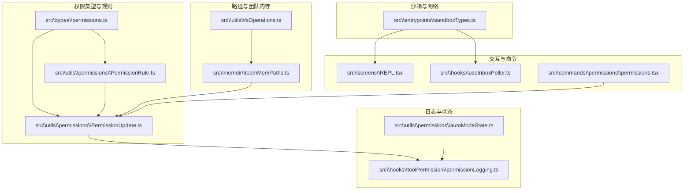
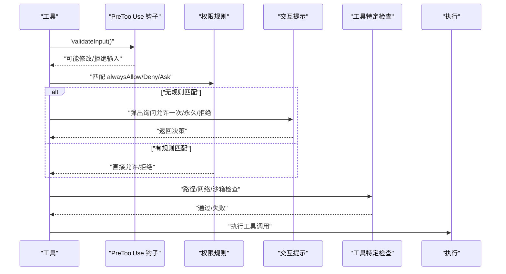
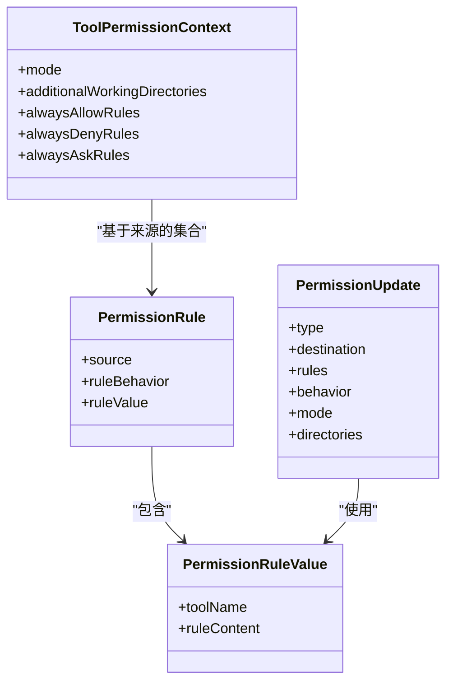
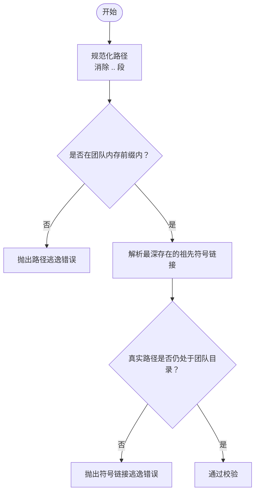
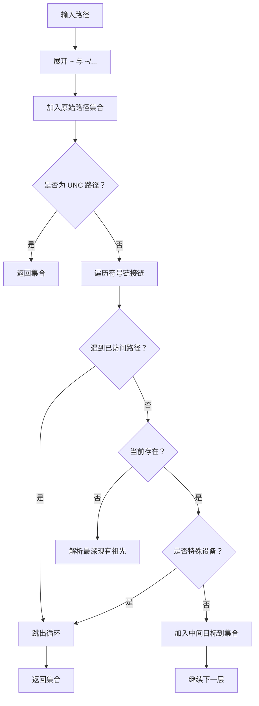
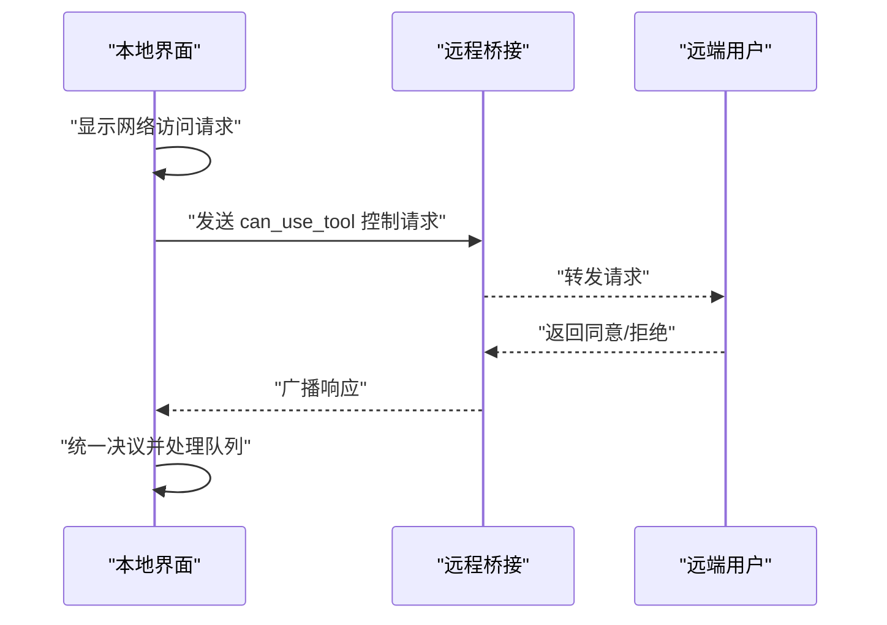
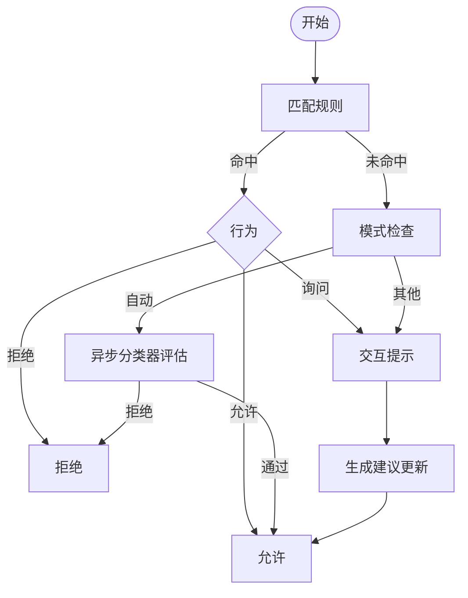
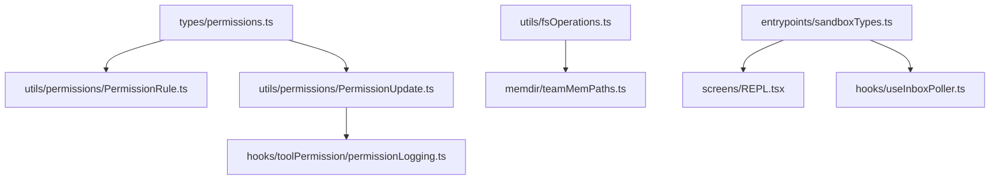

# 数据访问控制

<cite>
**本文引用的文件**
- [src\types\permissions.ts](file://src\types\permissions.ts)
- [src\utils\permissions\PermissionRule.ts](file://src\utils\permissions\PermissionRule.ts)
- [src\utils\permissions\PermissionUpdate.ts](file://src\utils\permissions\PermissionUpdate.ts)
- [src\utils\permissions\autoModeState.ts](file://src\utils\permissions\autoModeState.ts)
- [src\hooks\toolPermission\permissionLogging.ts](file://src\hooks\toolPermission\permissionLogging.ts)
- [src\memdir\teamMemPaths.ts](file://src\memdir\teamMemPaths.ts)
- [src\utils\fsOperations.ts](file://src\utils\fsOperations.ts)
- [src\entrypoints\sandboxTypes.ts](file://src\entrypoints\sandboxTypes.ts)
- [src\screens\REPL.tsx](file://src\screens\REPL.tsx)
- [src\hooks\useInboxPoller.ts](file://src\hooks\useInboxPoller.ts)
- [src\commands\permissions\permissions.tsx](file://src\commands\permissions\permissions.tsx)
- [README.md](file://README.md)
</cite>

## 目录
1. [简介](#简介)
2. [项目结构](#项目结构)
3. [核心组件](#核心组件)
4. [架构总览](#架构总览)
5. [详细组件分析](#详细组件分析)
6. [依赖关系分析](#依赖关系分析)
7. [性能考量](#性能考量)
8. [故障排查指南](#故障排查指南)
9. [结论](#结论)
10. [附录](#附录)

## 简介
本技术文档面向 Claude Code 的数据访问控制系统，系统性阐述权限模型设计（规则定义、继承与冲突解决）、数据使用限制（路径访问、文件系统与网络）、权限解析与执行（语法、决策树、实时检查）、团队内存访问控制（成员权限、数据共享、审计）以及性能优化与安全防护。文档以代码为依据，辅以图示帮助非专业读者理解。

## 项目结构
围绕权限控制的关键模块分布如下：
- 类型与规则：src\types\permissions.ts 定义权限模式、行为、规则与更新类型；src\utils\permissions 下的 PermissionRule.ts、PermissionUpdate.ts 实现规则值与更新应用逻辑。
- 团队内存与路径校验：src\memdir\teamMemPaths.ts 提供团队内存目录的路径合法性与写入校验。
- 文件系统权限与路径集合：src\utils\fsOperations.ts 提供权限检查时的路径集合与符号链接链处理。
- 沙箱与网络限制：src\entrypoints\sandboxTypes.ts 定义沙箱网络/文件系统配置类型。
- REPL 与团队权限交互：src\screens\REPL.tsx 与 src\hooks\useInboxPoller.ts 协调本地与远程的网络访问授权。
- 权限命令入口：src\commands\permissions\permissions.tsx 提供规则列表与重试提示能力。
- 日志与审计：src\hooks\toolPermission\permissionLogging.ts 统一记录权限决策来源与指标。
- 自动模式状态：src\utils\permissions\autoModeState.ts 管理自动模式的启用与回路状态。

**图表来源**
- [src\types\permissions.ts:1-442](file://src\types\permissions.ts#L1-L442)
- [src\utils\permissions\PermissionRule.ts:1-41](file://src\utils\permissions\PermissionRule.ts#L1-L41)
- [src\utils\permissions\PermissionUpdate.ts:1-390](file://src\utils\permissions\PermissionUpdate.ts#L1-L390)
- [src\memdir\teamMemPaths.ts:1-293](file://src\memdir\teamMemPaths.ts#L1-L293)
- [src\utils\fsOperations.ts:246-353](file://src\utils\fsOperations.ts#L246-L353)
- [src\entrypoints\sandboxTypes.ts:1-157](file://src\entrypoints\sandboxTypes.ts#L1-L157)
- [src\screens\REPL.tsx:2257-2283](file://src\screens\REPL.tsx#L2257-L2283)
- [src\hooks\useInboxPoller.ts:296-337](file://src\hooks\useInboxPoller.ts#L296-L337)
- [src\commands\permissions\permissions.tsx:1-9](file://src\commands\permissions\permissions.tsx#L1-L9)
- [src\hooks\toolPermission\permissionLogging.ts:1-239](file://src\hooks\toolPermission\permissionLogging.ts#L1-L239)
- [src\utils\permissions\autoModeState.ts:1-40](file://src\utils\permissions\autoModeState.ts#L1-L40)

**章节来源**
- [src\types\permissions.ts:1-442](file://src\types\permissions.ts#L1-L442)
- [src\utils\permissions\PermissionRule.ts:1-41](file://src\utils\permissions\PermissionRule.ts#L1-L41)
- [src\utils\permissions\PermissionUpdate.ts:1-390](file://src\utils\permissions\PermissionUpdate.ts#L1-L390)
- [src\memdir\teamMemPaths.ts:1-293](file://src\memdir\teamMemPaths.ts#L1-L293)
- [src\utils\fsOperations.ts:246-353](file://src\utils\fsOperations.ts#L246-L353)
- [src\entrypoints\sandboxTypes.ts:1-157](file://src\entrypoints\sandboxTypes.ts#L1-L157)
- [src\screens\REPL.tsx:2257-2283](file://src\screens\REPL.tsx#L2257-L2283)
- [src\hooks\useInboxPoller.ts:296-337](file://src\hooks\useInboxPoller.ts#L296-L337)
- [src\commands\permissions\permissions.tsx:1-9](file://src\commands\permissions\permissions.tsx#L1-L9)
- [src\hooks\toolPermission\permissionLogging.ts:1-239](file://src\hooks\toolPermission\permissionLogging.ts#L1-L239)
- [src\utils\permissions\autoModeState.ts:1-40](file://src\utils\permissions\autoModeState.ts#L1-L40)

## 核心组件
- 权限模式与行为
  - 模式：支持外部模式集（如默认、绕过、不询问等），内部运行时可选模式包含自动与冒泡模式。
  - 行为：允许、拒绝、询问。
- 规则与来源
  - 规则值包含工具名与可选内容；规则由不同来源（用户设置、项目设置、本地设置、标志、策略、命令行、会话）产生。
  - 规则按来源分组存储，分别对应“总是允许/拒绝/询问”三类集合。
- 决策结果与原因
  - 允许、询问（含建议更新、阻断路径、元数据、异步分类器检查）、拒绝（含原因）。
  - 决策原因类型覆盖规则、模式、子命令结果、提示工具、钩子、异步代理、沙箱覆盖、分类器、工作目录、安全检查等。
- 更新与持久化
  - 支持添加/替换/移除规则、设置模式、增删额外工作目录。
  - 可持久化到用户/项目/本地设置或仅会话作用域。
- 分类器与自动模式
  - 自动模式状态机维护活动状态、CLI 标记与电路断开状态，配合分类器进行非阻塞审批。

**章节来源**
- [src\types\permissions.ts:15-32](file://src\types\permissions.ts#L15-L32)
- [src\types\permissions.ts:44-79](file://src\types\permissions.ts#L44-L79)
- [src\types\permissions.ts:98-131](file://src\types\permissions.ts#L98-L131)
- [src\types\permissions.ts:152-266](file://src\types\permissions.ts#L152-L266)
- [src\types\permissions.ts:271-324](file://src\types\permissions.ts#L271-L324)
- [src\utils\permissions\autoModeState.ts:1-40](file://src\utils\permissions\autoModeState.ts#L1-L40)

## 架构总览
权限系统遵循“输入验证 → 钩子预处理 → 规则匹配 → 交互提示 → 工具特定检查 → 执行”的流程。REPL 与团队权限通过本地对话框与远程桥接回调协同，沙箱配置统一约束网络与文件系统访问。

**图表来源**
- [README.md:567-605](file://README.md#L567-L605)
- [src\types\permissions.ts:152-266](file://src\types\permissions.ts#L152-L266)

**章节来源**
- [README.md:567-605](file://README.md#L567-L605)

## 详细组件分析

### 权限规则与更新机制
- 规则值与行为
  - 规则值包含工具名与可选内容；行为枚举为允许/拒绝/询问。
- 规则来源与集合
  - 规则按来源分组存储于“总是允许/拒绝/询问”集合中，便于快速匹配与优先级判定。
- 更新操作
  - 添加/替换/移除规则、设置模式、增删额外工作目录。
  - 应用更新后可选择持久化到用户/项目/本地设置，或仅会话生效。
- 规则持久化
  - 将规则字符串序列化并写入对应设置源；移除规则时进行规范化比较以避免重复项。

**图表来源**
- [src\types\permissions.ts:54-79](file://src\types\permissions.ts#L54-L79)
- [src\types\permissions.ts:98-131](file://src\types\permissions.ts#L98-L131)
- [src\types\permissions.ts:419-441](file://src\types\permissions.ts#L419-L441)

**章节来源**
- [src\utils\permissions\PermissionRule.ts:25-40](file://src\utils\permissions\PermissionRule.ts#L25-L40)
- [src\utils\permissions\PermissionUpdate.ts:55-206](file://src\utils\permissions\PermissionUpdate.ts#L55-L206)
- [src\utils\permissions\PermissionUpdate.ts:222-342](file://src\utils\permissions\PermissionUpdate.ts#L222-L342)

### 路径访问控制与团队内存
- 路径合法性与写入校验
  - 使用路径解析消除“..”段，防止路径穿越；对绝对路径进行前缀攻击保护。
  - 对写入路径进行符号链接深度解析，确保真实路径仍在团队内存目录内。
- 键名与键路径校验
  - 对相对键名进行多层注入向量检测（空字节、URL 编码、Unicode 正规化、反斜杠、绝对路径）。
- 团队内存启用与范围
  - 团队内存依赖自动内存开启且特性开关启用；路径以项目维度隔离。

**图表来源**
- [src\memdir\teamMemPaths.ts:228-256](file://src\memdir\teamMemPaths.ts#L228-L256)

**章节来源**
- [src\memdir\teamMemPaths.ts:10-64](file://src\memdir\teamMemPaths.ts#L10-L64)
- [src\memdir\teamMemPaths.ts:214-220](file://src\memdir\teamMemPaths.ts#L214-L220)
- [src\memdir\teamMemPaths.ts:228-284](file://src\memdir\teamMemPaths.ts#L228-L284)

### 文件系统权限与路径集合
- 路径集合生成
  - 在权限检查时收集原始路径、中间符号链接目标与最终解析路径，确保规则能命中所有层级。
- 符号链接与特殊设备处理
  - 遍历符号链接链，最多限制深度；跳过 FIFO、套接字、字符/块设备等特殊文件类型。
- 防御性处理
  - 处理波浪号展开与 Windows UNC 前缀，避免网络请求与越权。

**图表来源**
- [src\utils\fsOperations.ts:288-353](file://src\utils\fsOperations.ts#L288-L353)

**章节来源**
- [src\utils\fsOperations.ts:288-353](file://src\utils\fsOperations.ts#L288-L353)

### 网络访问限制与沙箱
- 沙箱网络配置
  - 支持允许域名、仅受托管域名、Unix Socket、本地绑定、HTTP/SOCKS 代理端口等。
- 沙箱文件系统配置
  - 允许/拒绝读写路径合并策略，受托管设置影响。
- REPL 与远程桥接
  - 本地弹窗队列与远程桥接回调联动，同一主机的所有请求统一决议。

**图表来源**
- [src\screens\REPL.tsx:2257-2283](file://src\screens\REPL.tsx#L2257-L2283)
- [src\hooks\useInboxPoller.ts:444-480](file://src\hooks\useInboxPoller.ts#L444-L480)

**章节来源**
- [src\entrypoints\sandboxTypes.ts:14-42](file://src\entrypoints\sandboxTypes.ts#L14-L42)
- [src\entrypoints\sandboxTypes.ts:47-86](file://src\entrypoints\sandboxTypes.ts#L47-L86)
- [src\screens\REPL.tsx:2257-2283](file://src\screens\REPL.tsx#L2257-L2283)
- [src\hooks\useInboxPoller.ts:296-337](file://src\hooks\useInboxPoller.ts#L296-L337)

### 权限决策树与冲突解决
- 决策来源
  - 规则匹配优先于模式；若无规则，则进入交互提示；提示后可生成建议更新以修正后续决策。
- 冲突解决
  - “总是允许/拒绝/询问”三类集合按来源聚合；当多条规则冲突时，按来源优先级与规则顺序决定最终行为。
- 自动模式与分类器
  - 自动模式下可异步运行分类器评估，减少用户等待；敏感路径可交由分类器判断是否可自动放行。

**图表来源**
- [src\types\permissions.ts:152-266](file://src\types\permissions.ts#L152-L266)
- [src\utils\permissions\autoModeState.ts:1-40](file://src\utils\permissions\autoModeState.ts#L1-L40)

**章节来源**
- [src\types\permissions.ts:152-266](file://src\types\permissions.ts#L152-L266)
- [src\utils\permissions\autoModeState.ts:1-40](file://src\utils\permissions\autoModeState.ts#L1-L40)

### 团队内存访问控制与审计
- 成员权限与数据共享
  - 团队内存启用需满足自动内存与特性开关；路径校验严格防止符号链接逃逸与路径穿越。
- 访问审计
  - 权限决策统一记录到分析事件、OTel 指标与工具使用上下文，支持按来源（用户、钩子、分类器、配置）区分统计。

**图表来源**
- [src\memdir\teamMemPaths.ts:84-94](file://src\memdir\teamMemPaths.ts#L84-L94)
- [src\hooks\toolPermission\permissionLogging.ts:181-239](file://src\hooks\toolPermission\permissionLogging.ts#L181-L239)

**章节来源**
- [src\memdir\teamMemPaths.ts:84-94](file://src\memdir\teamMemPaths.ts#L84-L94)
- [src\hooks\toolPermission\permissionLogging.ts:181-239](file://src\hooks\toolPermission\permissionLogging.ts#L181-L239)

### 权限配置示例与开发指南
- 规则语法
  - 规则值包含工具名与可选内容；内容由各工具自定义解析。
- 建议更新
  - 可通过“添加规则/替换规则/移除规则/设置模式/增删额外工作目录”生成建议，用于快速修复权限问题。
- 开发要点
  - 在工具的 checkPermissions 中结合路径集合与沙箱配置进行二次校验。
  - 使用 PermissionUpdate 生成建议并持久化到合适来源，避免重复提示。

**章节来源**
- [src\utils\permissions\PermissionRule.ts:35-40](file://src\utils\permissions\PermissionRule.ts#L35-L40)
- [src\utils\permissions\PermissionUpdate.ts:361-389](file://src\utils\permissions\PermissionUpdate.ts#L361-L389)
- [src\utils\permissions\PermissionUpdate.ts:55-206](file://src\utils\permissions\PermissionUpdate.ts#L55-L206)

## 依赖关系分析
- 类型与实现解耦
  - 权限类型集中于 types 层，避免循环依赖；具体实现位于 utils/permissions。
- 规则与上下文
  - 规则值与行为通过 Schema 校验；上下文包含模式与来源分组的规则集合。
- 路径与沙箱
  - fsOperations 与 teamMemPaths 为权限检查提供路径集合与合法性保障；sandboxTypes 为网络/文件系统访问提供统一约束。

**图表来源**
- [src\types\permissions.ts:1-442](file://src\types\permissions.ts#L1-L442)
- [src\utils\permissions\PermissionRule.ts:1-41](file://src\utils\permissions\PermissionRule.ts#L1-L41)
- [src\utils\permissions\PermissionUpdate.ts:1-390](file://src\utils\permissions\PermissionUpdate.ts#L1-L390)
- [src\hooks\toolPermission\permissionLogging.ts:1-239](file://src\hooks\toolPermission\permissionLogging.ts#L1-L239)
- [src\utils\fsOperations.ts:246-353](file://src\utils\fsOperations.ts#L246-L353)
- [src\memdir\teamMemPaths.ts:1-293](file://src\memdir\teamMemPaths.ts#L1-L293)
- [src\entrypoints\sandboxTypes.ts:1-157](file://src\entrypoints\sandboxTypes.ts#L1-L157)
- [src\screens\REPL.tsx:2257-2283](file://src\screens\REPL.tsx#L2257-L2283)
- [src\hooks\useInboxPoller.ts:296-337](file://src\hooks\useInboxPoller.ts#L296-L337)

**章节来源**
- [src\types\permissions.ts:1-442](file://src\types\permissions.ts#L1-L442)
- [src\utils\permissions\PermissionRule.ts:1-41](file://src\utils\permissions\PermissionRule.ts#L1-L41)
- [src\utils\permissions\PermissionUpdate.ts:1-390](file://src\utils\permissions\PermissionUpdate.ts#L1-L390)
- [src\hooks\toolPermission\permissionLogging.ts:1-239](file://src\hooks\toolPermission\permissionLogging.ts#L1-L239)
- [src\utils\fsOperations.ts:246-353](file://src\utils\fsOperations.ts#L246-L353)
- [src\memdir\teamMemPaths.ts:1-293](file://src\memdir\teamMemPaths.ts#L1-L293)
- [src\entrypoints\sandboxTypes.ts:1-157](file://src\entrypoints\sandboxTypes.ts#L1-L157)
- [src\screens\REPL.tsx:2257-2283](file://src\screens\REPL.tsx#L2257-L2283)
- [src\hooks\useInboxPoller.ts:296-337](file://src\hooks\useInboxPoller.ts#L296-L337)

## 性能考量
- 路径集合与符号链接遍历
  - 限制最大深度以避免环形链接导致的性能问题；对不存在路径采用“最深现有祖先”解析策略，兼顾准确性与效率。
- 异步分类器
  - 自动模式下异步运行分类器，减少用户等待时间；敏感路径可交由分类器评估，避免误判。
- 沙箱配置缓存
  - 沙箱网络/文件系统配置作为统一入口，减少重复计算与跨模块耦合。

[本节为通用性能讨论，无需特定文件来源]

## 故障排查指南
- 规则不可达警告
  - 医生界面会提示不可达规则警告，帮助定位配置问题。
- 路径逃逸与符号链接异常
  - 出现 PathTraversalError 时，检查路径中是否存在“..”、URL 编码穿越、Unicode 正规化攻击、反斜杠或绝对键名。
- 网络访问被拒
  - 检查沙箱网络配置中的允许域名与代理设置；确认本地弹窗与远程桥接回调是否一致。
- 权限决策来源追踪
  - 通过审计日志区分用户、钩子、分类器、配置等来源，定位误判原因。

**章节来源**
- [src\screens\Doctor.tsx:459-473](file://src\screens\Doctor.tsx#L459-L473)
- [src\memdir\teamMemPaths.ts:10-15](file://src\memdir\teamMemPaths.ts#L10-L15)
- [src\hooks\toolPermission\permissionLogging.ts:181-239](file://src\hooks\toolPermission\permissionLogging.ts#L181-L239)

## 结论
该权限系统通过清晰的类型定义、规则来源分组与更新持久化机制，实现了灵活可控的权限治理；路径与团队内存的严格校验、沙箱网络/文件系统统一约束，有效降低了越权风险；自动模式与分类器结合提升了用户体验；审计日志与可视化界面为运维与排障提供了坚实支撑。

[本节为总结性内容，无需特定文件来源]

## 附录
- 常用入口
  - 权限规则列表命令入口：src\commands\permissions\permissions.tsx
  - 权限类型与决策结构：src\types\permissions.ts
  - 规则值与行为 Schema：src\utils\permissions\PermissionRule.ts
  - 规则更新与持久化：src\utils\permissions\PermissionUpdate.ts
  - 团队内存路径校验：src\memdir\teamMemPaths.ts
  - 文件系统路径集合：src\utils\fsOperations.ts
  - 沙箱网络/文件系统类型：src\entrypoints\sandboxTypes.ts
  - REPL 网络权限交互：src\screens\REPL.tsx
  - 团队权限消息轮询：src\hooks\useInboxPoller.ts
  - 权限决策审计：src\hooks\toolPermission\permissionLogging.ts
  - 自动模式状态：src\utils\permissions\autoModeState.ts