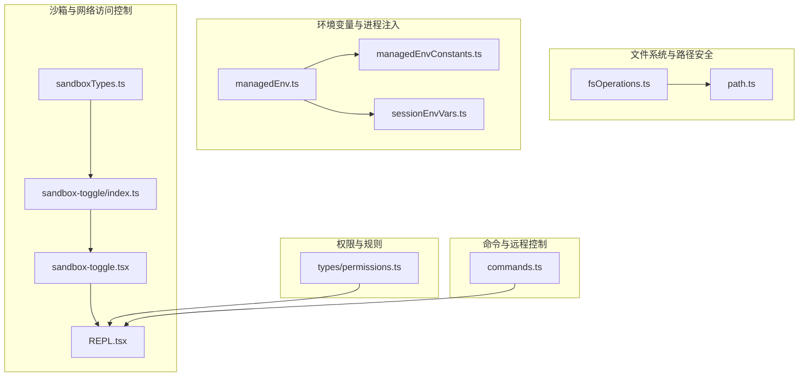
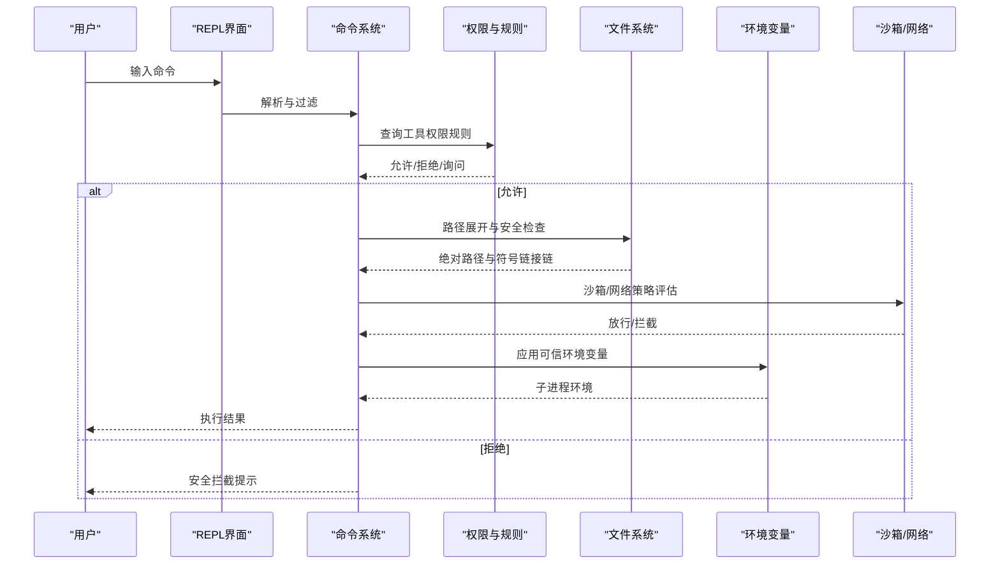
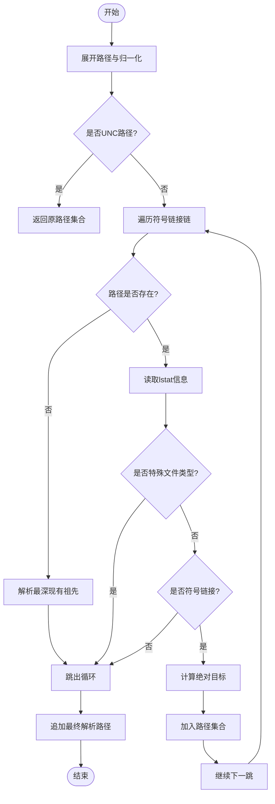
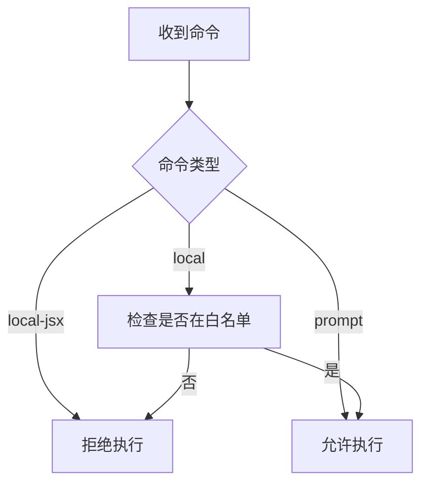
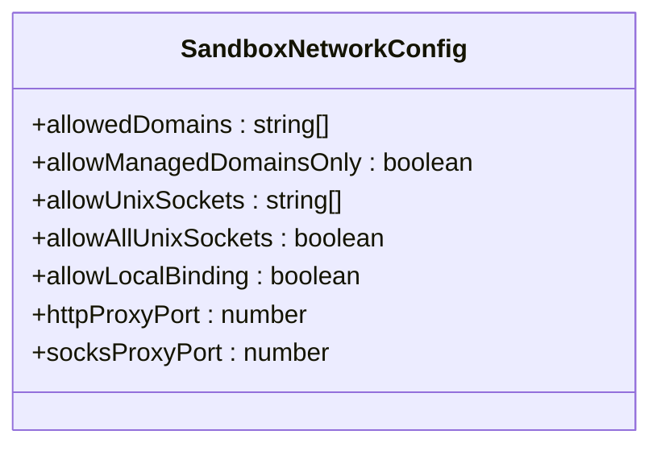
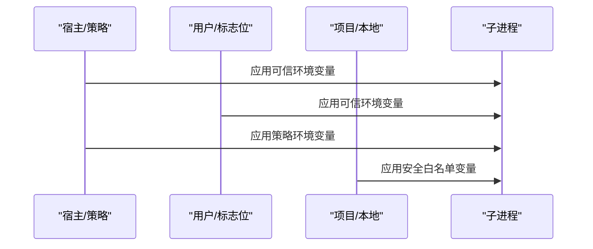
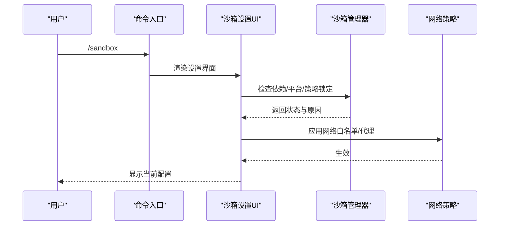
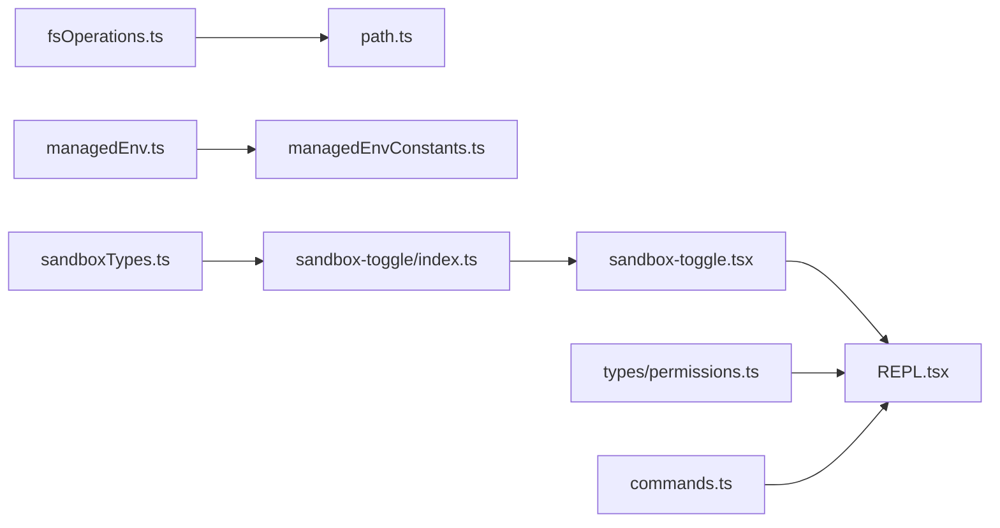

# 安全限制机制

<cite>
**本文档引用的文件**
- [fsOperations.ts](file://src/utils/fsOperations.ts)
- [path.ts](file://src/utils/path.ts)
- [managedEnv.ts](file://src/utils/managedEnv.ts)
- [managedEnvConstants.ts](file://src/utils/managedEnvConstants.ts)
- [sandboxTypes.ts](file://src/entrypoints/sandboxTypes.ts)
- [sandbox-toggle/index.ts](file://src/commands/sandbox-toggle/index.ts)
- [sandbox-toggle.tsx](file://src/commands/sandbox-toggle/sandbox-toggle.tsx)
- [REPL.tsx](file://src/screens/REPL.tsx)
- [permissions.ts](file://src/types/permissions.ts)
- [sessionEnvVars.ts](file://src/utils/sessionEnvVars.ts)
- [cyberRiskInstruction.ts](file://src/constants/cyberRiskInstruction.ts)
- [commands.ts](file://src/commands.ts)
</cite>

## 目录
1. [简介](#简介)
2. [项目结构](#项目结构)
3. [核心组件](#核心组件)
4. [架构总览](#架构总览)
5. [详细组件分析](#详细组件分析)
6. [依赖关系分析](#依赖关系分析)
7. [性能考虑](#性能考虑)
8. [故障排除指南](#故障排除指南)
9. [结论](#结论)
10. [附录](#附录)

## 简介
本文件系统化梳理并解释该代码库中的安全限制机制，覆盖文件系统访问控制（路径白名单、目录遍历防护、符号链接处理）、命令执行限制（危险命令识别、参数过滤、沙箱隔离）、网络访问控制（域名白名单、IP绑定限制、代理支持）、环境变量与进程注入防护、安全模式下的权限降级与额外检查、安全配置与自定义策略、安全漏洞检测与防护最佳实践以及安全审计与合规性要求。文档以循序渐进的方式呈现，既适合非技术读者快速理解，也提供面向开发者的深入实现细节与源码定位。

## 项目结构
围绕安全限制的关键模块分布如下：
- 文件系统与路径安全：路径规范化、UNC防护、目录遍历检测、符号链接解析与去重
- 环境变量与进程注入：可信来源应用、危险变量过滤、会话级环境变量管理
- 沙箱与网络访问控制：类型定义、配置模式、UI交互与运行时初始化
- 权限与规则：工具权限行为、规则来源与持久化目标
- 命令桥接与远程控制：远程模式下命令白名单与安全过滤

**图表来源**
- [fsOperations.ts:1-771](file://src/utils/fsOperations.ts#L1-L771)
- [path.ts:1-156](file://src/utils/path.ts#L1-L156)
- [managedEnv.ts:1-200](file://src/utils/managedEnv.ts#L1-L200)
- [managedEnvConstants.ts:1-192](file://src/utils/managedEnvConstants.ts#L1-L192)
- [sandboxTypes.ts:1-157](file://src/entrypoints/sandboxTypes.ts#L1-L157)
- [sandbox-toggle/index.ts:1-50](file://src/commands/sandbox-toggle/index.ts#L1-L50)
- [sandbox-toggle.tsx:20-54](file://src/commands/sandbox-toggle/sandbox-toggle.tsx#L20-L54)
- [REPL.tsx:2313-2344](file://src/screens/REPL.tsx#L2313-L2344)
- [permissions.ts:34-128](file://src/types/permissions.ts#L34-L128)
- [commands.ts:660-699](file://src/commands.ts#L660-L699)

**章节来源**
- [fsOperations.ts:1-771](file://src/utils/fsOperations.ts#L1-L771)
- [path.ts:1-156](file://src/utils/path.ts#L1-L156)
- [managedEnv.ts:1-200](file://src/utils/managedEnv.ts#L1-L200)
- [managedEnvConstants.ts:1-192](file://src/utils/managedEnvConstants.ts#L1-L192)
- [sandboxTypes.ts:1-157](file://src/entrypoints/sandboxTypes.ts#L1-L157)
- [sandbox-toggle/index.ts:1-50](file://src/commands/sandbox-toggle/index.ts#L1-L50)
- [sandbox-toggle.tsx:20-54](file://src/commands/sandbox-toggle/sandbox-toggle.tsx#L20-L54)
- [REPL.tsx:2313-2344](file://src/screens/REPL.tsx#L2313-L2344)
- [permissions.ts:34-128](file://src/types/permissions.ts#L34-L128)
- [commands.ts:660-699](file://src/commands.ts#L660-L699)

## 核心组件
- 文件系统访问控制
  - 路径白名单与符号链接链追踪：对原始路径、中间目标与最终解析路径进行统一权限检查，确保跨平台一致性与防逃逸
  - UNC路径阻断：在Windows上阻止网络路径引发的潜在NTLM泄漏与网络请求
  - 目录遍历检测：基于正则表达式识别“../”等遍历模式
  - 特殊文件类型跳过：避免FIFO、套接字、设备文件导致的阻塞或异常
- 命令执行限制
  - 远程桥接命令白名单：仅允许prompt类与显式列入的本地命令；本地JSX命令默认禁止
  - 危险设置识别：对可能执行任意shell代码的设置项进行拦截
- 网络访问控制
  - 域名白名单与受管域优先：支持受管设置中仅使用受控域名的强制模式
  - Unix Socket与本地绑定：macOS平台可按路径放行或全局放行，Linux平台不支持按路径过滤
  - 代理端口：HTTP/ SOCKS代理端口可配置
- 环境变量与进程注入防护
  - 双阶段应用：可信来源先于信任对话后应用；仅在建立信任后应用高危变量
  - 危险变量过滤：移除路由、代理、证书信任等高危键，保留安全白名单
  - 会话级环境变量：仅作用于子进程，不影响REPL主进程
- 沙箱隔离与权限降级
  - 配置类型与模式：启用/禁用、失败即停、自动放行Bash、排除命令、弱化隔离选项
  - UI交互与初始化：命令入口展示状态、依赖检查、策略锁定提示；运行时初始化与不可用原因上报
  - 工具权限规则：允许/拒绝/询问三种行为，多来源合并与持久化目标
- 安全指令与合规
  - 安全风险指令：明确防御性安全协助边界，拒绝破坏性与恶意用途的技术支持

**章节来源**
- [fsOperations.ts:288-382](file://src/utils/fsOperations.ts#L288-L382)
- [path.ts:109-135](file://src/utils/path.ts#L109-L135)
- [managedEnv.ts:124-178](file://src/utils/managedEnv.ts#L124-L178)
- [managedEnvConstants.ts:74-191](file://src/utils/managedEnvConstants.ts#L74-L191)
- [sandboxTypes.ts:14-143](file://src/entrypoints/sandboxTypes.ts#L14-L143)
- [sandbox-toggle/index.ts:1-50](file://src/commands/sandbox-toggle/index.ts#L1-L50)
- [sandbox-toggle.tsx:20-54](file://src/commands/sandbox-toggle/sandbox-toggle.tsx#L20-L54)
- [permissions.ts:34-128](file://src/types/permissions.ts#L34-L128)
- [cyberRiskInstruction.ts:1-24](file://src/constants/cyberRiskInstruction.ts#L1-L24)

## 架构总览
下图展示了从用户输入到工具执行的完整安全链路，包括路径解析、权限检查、沙箱决策与网络访问控制：

**图表来源**
- [REPL.tsx:2313-2344](file://src/screens/REPL.tsx#L2313-L2344)
- [commands.ts:660-699](file://src/commands.ts#L660-L699)
- [fsOperations.ts:288-382](file://src/utils/fsOperations.ts#L288-L382)
- [managedEnv.ts:124-178](file://src/utils/managedEnv.ts#L124-L178)
- [sandboxTypes.ts:14-143](file://src/entrypoints/sandboxTypes.ts#L14-L143)

## 详细组件分析

### 文件系统访问控制
- 路径白名单机制
  - 对原始路径、中间符号链接目标与最终解析路径进行集合去重与统一检查，确保对真实落点的完全覆盖
  - 在Windows上提前阻断UNC路径，防止潜在NTLM泄漏与网络请求
- 目录遍历防护
  - 使用正则匹配识别“../”等遍历片段，作为规则判定依据之一
- 符号链接与特殊文件处理
  - 遍历符号链接链，收集所有中间目标；对不存在路径进行“最深现有祖先”解析，避免写入逃逸
  - 跳过FIFO、套接字、字符/块设备，避免阻塞与异常
- 复杂度与性能
  - 最大深度限制（典型SYMLOOP_MAX）防止循环链接导致的无限循环
  - 同步/异步接口分离，避免长耗时操作阻塞主线程

**图表来源**
- [fsOperations.ts:288-382](file://src/utils/fsOperations.ts#L288-L382)
- [path.ts:109-135](file://src/utils/path.ts#L109-L135)

**章节来源**
- [fsOperations.ts:138-178](file://src/utils/fsOperations.ts#L138-L178)
- [fsOperations.ts:215-270](file://src/utils/fsOperations.ts#L215-L270)
- [fsOperations.ts:288-382](file://src/utils/fsOperations.ts#L288-L382)
- [path.ts:109-135](file://src/utils/path.ts#L109-L135)

### 命令执行限制
- 远程桥接命令白名单
  - prompt类命令默认安全；local-jsx命令默认禁止；local命令需显式列入白名单
- 危险设置识别
  - 对可能触发任意shell执行的设置项进行拦截，避免通过环境变量或配置绕过

**图表来源**
- [commands.ts:660-699](file://src/commands.ts#L660-L699)

**章节来源**
- [commands.ts:660-699](file://src/commands.ts#L660-L699)
- [managedEnvConstants.ts:74-82](file://src/utils/managedEnvConstants.ts#L74-L82)

### 网络访问控制
- 域名白名单与受管域优先
  - 支持受管设置中仅使用受控域名的强制模式，忽略用户/项目/本地/标志位设置
- Unix Socket与本地绑定
  - macOS平台可按路径放行或全局放行；Linux平台不支持按路径过滤
- 代理端口
  - 支持HTTP/ SOCKS代理端口配置，便于企业网络环境

**图表来源**
- [sandboxTypes.ts:14-42](file://src/entrypoints/sandboxTypes.ts#L14-L42)

**章节来源**
- [sandboxTypes.ts:14-42](file://src/entrypoints/sandboxTypes.ts#L14-L42)

### 环境变量与进程注入防护
- 双阶段应用策略
  - 可信来源（用户/标志位/策略）先于信任对话应用；建立信任后再应用项目来源的高危变量
- 危险变量过滤
  - 移除路由、代理、证书信任等高危键；仅保留安全白名单
- 会话级环境变量
  - 仅影响子进程，不影响REPL主进程

**图表来源**
- [managedEnv.ts:124-178](file://src/utils/managedEnv.ts#L124-L178)
- [managedEnv.ts:187-199](file://src/utils/managedEnv.ts#L187-L199)
- [managedEnvConstants.ts:108-191](file://src/utils/managedEnvConstants.ts#L108-L191)
- [sessionEnvVars.ts:1-22](file://src/utils/sessionEnvVars.ts#L1-L22)

**章节来源**
- [managedEnv.ts:124-178](file://src/utils/managedEnv.ts#L124-L178)
- [managedEnv.ts:187-199](file://src/utils/managedEnv.ts#L187-L199)
- [managedEnvConstants.ts:108-191](file://src/utils/managedEnvConstants.ts#L108-L191)
- [sessionEnvVars.ts:1-22](file://src/utils/sessionEnvVars.ts#L1-L22)

### 沙箱隔离与权限降级
- 配置模式
  - 启用/禁用、失败即停、自动放行Bash、排除命令、弱化隔离选项
- UI交互与初始化
  - 展示状态、依赖检查、策略锁定提示；运行时初始化与不可用原因上报
- 工具权限规则
  - 允许/拒绝/询问三种行为，多来源合并与持久化目标

**图表来源**
- [sandbox-toggle/index.ts:1-50](file://src/commands/sandbox-toggle/index.ts#L1-L50)
- [sandbox-toggle.tsx:20-54](file://src/commands/sandbox-toggle/sandbox-toggle.tsx#L20-L54)
- [REPL.tsx:2313-2344](file://src/screens/REPL.tsx#L2313-L2344)
- [sandboxTypes.ts:91-143](file://src/entrypoints/sandboxTypes.ts#L91-L143)

**章节来源**
- [sandbox-toggle/index.ts:1-50](file://src/commands/sandbox-toggle/index.ts#L1-L50)
- [sandbox-toggle.tsx:20-54](file://src/commands/sandbox-toggle/sandbox-toggle.tsx#L20-L54)
- [REPL.tsx:2313-2344](file://src/screens/REPL.tsx#L2313-L2344)
- [sandboxTypes.ts:91-143](file://src/entrypoints/sandboxTypes.ts#L91-L143)

### 权限与规则
- 规则来源与行为
  - 来源于用户/项目/本地/标志位/策略/会话等；行为为允许/拒绝/询问
- 更新与持久化
  - 支持添加/替换/删除规则与目录，目标可选用户/项目/本地/会话/CLI参数

**章节来源**
- [permissions.ts:34-128](file://src/types/permissions.ts#L34-L128)

### 安全指令与合规
- 安全风险指令
  - 明确防御性安全协助边界，拒绝破坏性与恶意用途的技术支持

**章节来源**
- [cyberRiskInstruction.ts:1-24](file://src/constants/cyberRiskInstruction.ts#L1-L24)

## 依赖关系分析
- 组件耦合
  - 文件系统安全依赖路径工具与平台抽象；环境变量模块依赖常量白名单与设置合并逻辑
  - 沙箱配置类型被命令入口与UI共同消费；REPL负责初始化与不可用原因上报
- 外部依赖
  - Node.js fs与路径API、Zod校验、平台检测与代理/证书缓存刷新

**图表来源**
- [fsOperations.ts:1-771](file://src/utils/fsOperations.ts#L1-L771)
- [path.ts:1-156](file://src/utils/path.ts#L1-L156)
- [managedEnv.ts:1-200](file://src/utils/managedEnv.ts#L1-L200)
- [managedEnvConstants.ts:1-192](file://src/utils/managedEnvConstants.ts#L1-L192)
- [sandboxTypes.ts:1-157](file://src/entrypoints/sandboxTypes.ts#L1-L157)
- [sandbox-toggle/index.ts:1-50](file://src/commands/sandbox-toggle/index.ts#L1-L50)
- [sandbox-toggle.tsx:20-54](file://src/commands/sandbox-toggle/sandbox-toggle.tsx#L20-L54)
- [REPL.tsx:2313-2344](file://src/screens/REPL.tsx#L2313-L2344)
- [permissions.ts:34-128](file://src/types/permissions.ts#L34-L128)
- [commands.ts:660-699](file://src/commands.ts#L660-L699)

**章节来源**
- [fsOperations.ts:1-771](file://src/utils/fsOperations.ts#L1-L771)
- [path.ts:1-156](file://src/utils/path.ts#L1-L156)
- [managedEnv.ts:1-200](file://src/utils/managedEnv.ts#L1-L200)
- [managedEnvConstants.ts:1-192](file://src/utils/managedEnvConstants.ts#L1-L192)
- [sandboxTypes.ts:1-157](file://src/entrypoints/sandboxTypes.ts#L1-L157)
- [sandbox-toggle/index.ts:1-50](file://src/commands/sandbox-toggle/index.ts#L1-L50)
- [sandbox-toggle.tsx:20-54](file://src/commands/sandbox-toggle/sandbox-toggle.tsx#L20-L54)
- [REPL.tsx:2313-2344](file://src/screens/REPL.tsx#L2313-L2344)
- [permissions.ts:34-128](file://src/types/permissions.ts#L34-L128)
- [commands.ts:660-699](file://src/commands.ts#L660-L699)

## 性能考虑
- 文件系统操作
  - 使用同步/异步双接口，避免长耗时操作阻塞；对特殊文件类型提前跳过，减少I/O等待
  - 最大深度限制与已访问集合避免符号链接环导致的无限循环
- 网络策略
  - 域名白名单与代理端口配置在沙箱初始化时一次性应用，降低运行时判断开销
- 环境变量
  - 双阶段应用减少不必要的信任对话；缓存清理与代理/证书重配在变更后集中执行

[本节为通用指导，无需具体文件分析]

## 故障排除指南
- 沙箱不可用
  - 检查平台支持与enabledPlatforms限制；查看依赖缺失与策略锁定提示
  - 若failIfUnavailable启用，启动将直接退出并输出不可用原因
- UNC路径问题
  - Windows上UNC路径会被阻断，避免潜在NTLM泄漏与网络请求
- 目录遍历与符号链接
  - 出现权限异常时，检查路径是否包含“../”或存在循环/悬挂符号链接
- 环境变量冲突
  - 受管路由变量与SSH隧道变量会被过滤，确保宿主配置不被覆盖
- 远程桥接命令
  - local-jsx命令默认禁止；local命令需显式列入白名单

**章节来源**
- [REPL.tsx:2313-2344](file://src/screens/REPL.tsx#L2313-L2344)
- [sandbox-toggle.tsx:20-54](file://src/commands/sandbox-toggle/sandbox-toggle.tsx#L20-L54)
- [fsOperations.ts:142-178](file://src/utils/fsOperations.ts#L142-L178)
- [managedEnv.ts:85-91](file://src/utils/managedEnv.ts#L85-L91)
- [commands.ts:660-699](file://src/commands.ts#L660-L699)

## 结论
该代码库通过“路径白名单+符号链接链追踪+UNC阻断+目录遍历检测”的文件系统安全策略，结合“可信来源优先+危险变量过滤+会话级环境变量”的进程注入防护，辅以“域名白名单+Unix Socket/本地绑定+代理端口”的网络访问控制，形成了从输入到执行的多层安全防线。沙箱配置与UI交互确保了企业级部署的可治理性与可审计性，而权限规则与远程桥接白名单进一步降低了越权与误用风险。建议在生产环境中启用沙箱、严格管理受管域与代理，并定期审查权限规则与环境变量变更。

[本节为总结性内容，无需具体文件分析]

## 附录

### 安全限制配置与自定义策略
- 沙箱配置
  - 启用/禁用、失败即停、自动放行Bash、排除命令、弱化隔离选项
  - 网络：域名白名单、受管域优先、Unix Socket放行、本地绑定、代理端口
  - 文件系统：读/写允许/拒绝路径列表
- 权限规则
  - 允许/拒绝/询问行为，多来源合并与持久化目标
- 远程桥接
  - prompt类命令默认安全；local-jsx默认禁止；local命令需白名单

**章节来源**
- [sandboxTypes.ts:14-143](file://src/entrypoints/sandboxTypes.ts#L14-L143)
- [permissions.ts:34-128](file://src/types/permissions.ts#L34-L128)
- [commands.ts:660-699](file://src/commands.ts#L660-L699)

### 安全漏洞检测与防护最佳实践
- 路径安全
  - 始终进行UNC阻断与符号链接链追踪；对不存在路径使用“最深现有祖先”解析
  - 使用正则检测目录遍历模式，必要时结合白名单
- 环境变量
  - 采用双阶段应用策略；仅在建立信任后应用高危变量
  - 使用白名单过滤路由、代理、证书信任等高危键
- 沙箱与网络
  - 启用failIfUnavailable以强制安全基线；在受管域优先模式下严格限制域名
  - macOS平台谨慎开启弱化隔离选项，评估数据外泄风险

**章节来源**
- [fsOperations.ts:288-382](file://src/utils/fsOperations.ts#L288-L382)
- [managedEnv.ts:124-178](file://src/utils/managedEnv.ts#L124-L178)
- [sandboxTypes.ts:91-143](file://src/entrypoints/sandboxTypes.ts#L91-L143)

### 安全审计与合规性要求
- 安全风险指令
  - 明确防御性安全协助边界，拒绝破坏性与恶意用途的技术支持
- 日志与遥测
  - 第三方日志与事件记录遵循隐私与合规要求，提供禁用与详情开关

**章节来源**
- [cyberRiskInstruction.ts:1-24](file://src/constants/cyberRiskInstruction.ts#L1-L24)