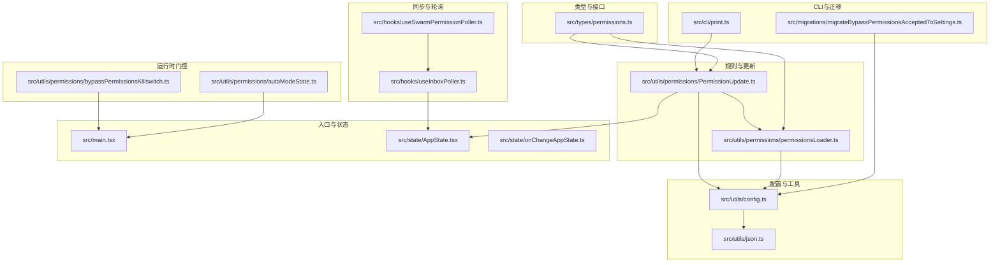
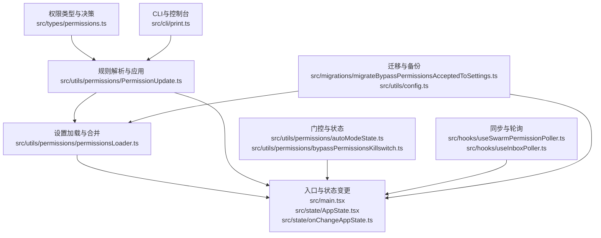
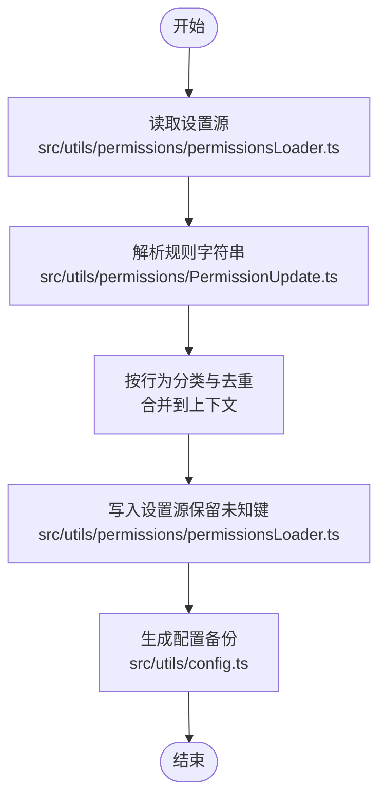
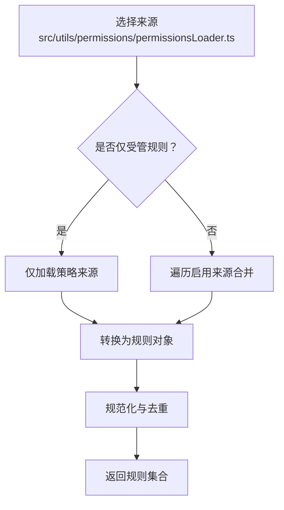
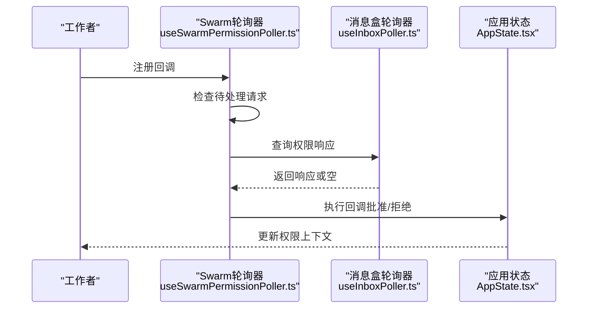
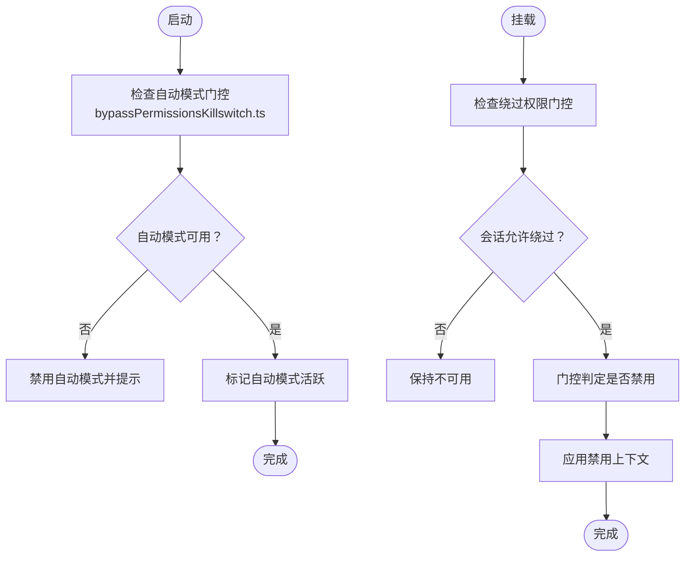
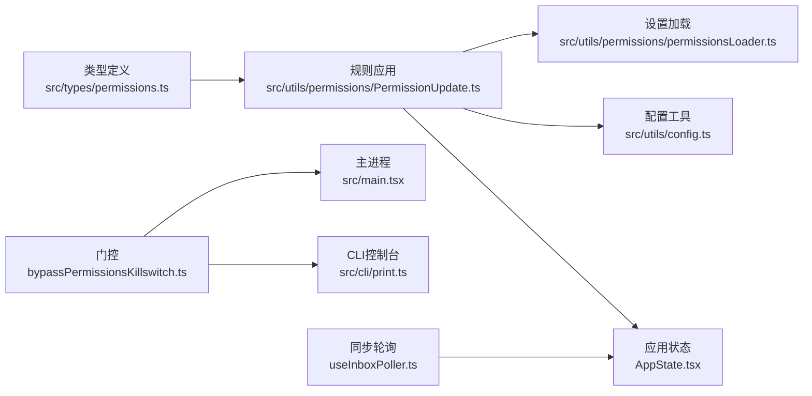

# 权限持久化

<cite>
**本文引用的文件**
- [src/types/permissions.ts](file://src/types/permissions.ts)
- [src/utils/permissions/PermissionUpdate.ts](file://src/utils/permissions/PermissionUpdate.ts)
- [src/utils/permissions/permissionsLoader.ts](file://src/utils/permissions/permissionsLoader.ts)
- [src/utils/permissions/autoModeState.ts](file://src/utils/permissions/autoModeState.ts)
- [src/utils/permissions/bypassPermissionsKillswitch.ts](file://src/utils/permissions/bypassPermissionsKillswitch.ts)
- [src/hooks/useSwarmPermissionPoller.ts](file://src/hooks/useSwarmPermissionPoller.ts)
- [src/hooks/useInboxPoller.ts](file://src/hooks/useInboxPoller.ts)
- [src/cli/print.ts](file://src/cli/print.ts)
- [src/main.tsx](file://src/main.tsx)
- [src/state/AppState.tsx](file://src/state/AppState.tsx)
- [src/state/onChangeAppState.ts](file://src/state/onChangeAppState.ts)
- [src/migrations/migrateBypassPermissionsAcceptedToSettings.ts](file://src/migrations/migrateBypassPermissionsAcceptedToSettings.ts)
- [src/utils/config.ts](file://src/utils/config.ts)
- [src/utils/json.ts](file://src/utils/json.ts)
</cite>

## 目录
1. [简介](#简介)
2. [项目结构](#项目结构)
3. [核心组件](#核心组件)
4. [架构总览](#架构总览)
5. [详细组件分析](#详细组件分析)
6. [依赖关系分析](#依赖关系分析)
7. [性能考量](#性能考量)
8. [故障排查指南](#故障排查指南)
9. [结论](#结论)
10. [附录](#附录)

## 简介
本技术文档聚焦于权限持久化系统，围绕以下目标展开：权限状态的存储机制（本地存储格式、序列化与版本兼容）、权限配置的加载与初始化流程（默认配置、合并策略与校验）、权限状态同步机制（跨设备同步、备份与恢复）、自动模式状态管理与绕过权限模式的实现原理、性能优化与缓存策略、数据迁移与升级方法、故障恢复与数据修复指南，以及权限配置的导入导出能力。

## 项目结构
权限持久化涉及类型定义、规则解析与应用、设置源加载与写入、自动模式与绕过权限的门控、跨设备同步与轮询、CLI 与主进程集成、以及迁移与备份等模块。下图展示与权限持久化直接相关的模块关系：

**图表来源**
- [src/types/permissions.ts:1-442](file://src/types/permissions.ts#L1-L442)
- [src/utils/permissions/PermissionUpdate.ts:1-390](file://src/utils/permissions/PermissionUpdate.ts#L1-L390)
- [src/utils/permissions/permissionsLoader.ts:1-297](file://src/utils/permissions/permissionsLoader.ts#L1-L297)
- [src/utils/permissions/autoModeState.ts:1-40](file://src/utils/permissions/autoModeState.ts#L1-L40)
- [src/utils/permissions/bypassPermissionsKillswitch.ts:1-156](file://src/utils/permissions/bypassPermissionsKillswitch.ts#L1-L156)
- [src/hooks/useSwarmPermissionPoller.ts:247-298](file://src/hooks/useSwarmPermissionPoller.ts#L247-L298)
- [src/hooks/useInboxPoller.ts:368-407](file://src/hooks/useInboxPoller.ts#L368-L407)
- [src/cli/print.ts:4584-4635](file://src/cli/print.ts#L4584-L4635)
- [src/main.tsx:2634-2661](file://src/main.tsx#L2634-L2661)
- [src/state/AppState.tsx:58-110](file://src/state/AppState.tsx#L58-L110)
- [src/state/onChangeAppState.ts:1-42](file://src/state/onChangeAppState.ts#L1-L42)
- [src/migrations/migrateBypassPermissionsAcceptedToSettings.ts:1-40](file://src/migrations/migrateBypassPermissionsAcceptedToSettings.ts#L1-L40)
- [src/utils/config.ts:1269-1310](file://src/utils/config.ts#L1269-L1310)
- [src/utils/json.ts:263-277](file://src/utils/json.ts#L263-L277)

**章节来源**
- [src/types/permissions.ts:1-442](file://src/types/permissions.ts#L1-L442)
- [src/utils/permissions/PermissionUpdate.ts:1-390](file://src/utils/permissions/PermissionUpdate.ts#L1-L390)
- [src/utils/permissions/permissionsLoader.ts:1-297](file://src/utils/permissions/permissionsLoader.ts#L1-L297)
- [src/utils/permissions/autoModeState.ts:1-40](file://src/utils/permissions/autoModeState.ts#L1-L40)
- [src/utils/permissions/bypassPermissionsKillswitch.ts:1-156](file://src/utils/permissions/bypassPermissionsKillswitch.ts#L1-L156)
- [src/hooks/useSwarmPermissionPoller.ts:247-298](file://src/hooks/useSwarmPermissionPoller.ts#L247-L298)
- [src/hooks/useInboxPoller.ts:368-407](file://src/hooks/useInboxPoller.ts#L368-L407)
- [src/cli/print.ts:4584-4635](file://src/cli/print.ts#L4584-L4635)
- [src/main.tsx:2634-2661](file://src/main.tsx#L2634-L2661)
- [src/state/AppState.tsx:58-110](file://src/state/AppState.tsx#L58-L110)
- [src/state/onChangeAppState.ts:1-42](file://src/state/onChangeAppState.ts#L1-L42)
- [src/migrations/migrateBypassPermissionsAcceptedToSettings.ts:1-40](file://src/migrations/migrateBypassPermissionsAcceptedToSettings.ts#L1-L40)
- [src/utils/config.ts:1269-1310](file://src/utils/config.ts#L1269-L1310)
- [src/utils/json.ts:263-277](file://src/utils/json.ts#L263-L277)

## 核心组件
- 权限类型与模式：定义外部与内部权限模式、行为、规则值与决策结果等类型，确保跨模块一致的数据契约。
- 规则解析与应用：将字符串规则解析为对象，支持添加、替换、移除规则与目录范围；并可持久化到用户/项目/本地设置源。
- 设置加载器：从多源设置中加载权限规则，支持“仅受管规则”模式与去重合并；提供编辑时的宽松解析以避免破坏现有设置。
- 门控与状态：自动模式与绕过权限模式的运行时检查、禁用与通知；在启动与模型切换时进行一致性校验。
- 同步与轮询：通过消息盒轮询与 Swarm 工作流回调注册，实现跨设备权限响应的处理与状态同步。
- CLI 与主进程：CLI 控制台路径对模式切换进行校验与回执；主进程在启动时执行门控检查与状态修正。
- 迁移与备份：将历史配置迁移至新位置；对配置文件进行定时备份与清理，保障数据安全。

**章节来源**
- [src/types/permissions.ts:16-38](file://src/types/permissions.ts#L16-L38)
- [src/utils/permissions/PermissionUpdate.ts:55-206](file://src/utils/permissions/PermissionUpdate.ts#L55-L206)
- [src/utils/permissions/permissionsLoader.ts:120-145](file://src/utils/permissions/permissionsLoader.ts#L120-L145)
- [src/utils/permissions/autoModeState.ts:1-40](file://src/utils/permissions/autoModeState.ts#L1-L40)
- [src/utils/permissions/bypassPermissionsKillswitch.ts:19-155](file://src/utils/permissions/bypassPermissionsKillswitch.ts#L19-L155)
- [src/hooks/useSwarmPermissionPoller.ts:82-167](file://src/hooks/useSwarmPermissionPoller.ts#L82-L167)
- [src/cli/print.ts:4584-4635](file://src/cli/print.ts#L4584-L4635)
- [src/main.tsx:2655-2661](file://src/main.tsx#L2655-L2661)

## 架构总览
权限持久化系统由“类型层—规则层—设置层—门控层—同步层—入口层—迁移与备份层”构成，形成从规则解析、持久化、加载、门控校验到跨设备同步与恢复的完整闭环。

**图表来源**
- [src/types/permissions.ts:1-442](file://src/types/permissions.ts#L1-L442)
- [src/utils/permissions/PermissionUpdate.ts:1-390](file://src/utils/permissions/PermissionUpdate.ts#L1-L390)
- [src/utils/permissions/permissionsLoader.ts:1-297](file://src/utils/permissions/permissionsLoader.ts#L1-L297)
- [src/utils/permissions/autoModeState.ts:1-40](file://src/utils/permissions/autoModeState.ts#L1-L40)
- [src/utils/permissions/bypassPermissionsKillswitch.ts:1-156](file://src/utils/permissions/bypassPermissionsKillswitch.ts#L1-L156)
- [src/hooks/useSwarmPermissionPoller.ts:247-298](file://src/hooks/useSwarmPermissionPoller.ts#L247-L298)
- [src/hooks/useInboxPoller.ts:368-407](file://src/hooks/useInboxPoller.ts#L368-L407)
- [src/cli/print.ts:4584-4635](file://src/cli/print.ts#L4584-L4635)
- [src/main.tsx:2634-2661](file://src/main.tsx#L2634-L2661)
- [src/state/AppState.tsx:58-110](file://src/state/AppState.tsx#L58-L110)
- [src/state/onChangeAppState.ts:24-41](file://src/state/onChangeAppState.ts#L24-L41)
- [src/migrations/migrateBypassPermissionsAcceptedToSettings.ts:1-40](file://src/migrations/migrateBypassPermissionsAcceptedToSettings.ts#L1-L40)
- [src/utils/config.ts:1269-1310](file://src/utils/config.ts#L1269-L1310)

## 详细组件分析

### 存储机制与序列化
- 本地存储格式
  - 权限规则与模式持久化在用户/项目/本地设置源中，字段包含允许、拒绝、询问三类规则数组与默认模式等。
  - 额外工作目录通过“附加目录”列表保存，避免重复。
- 数据序列化
  - 规则值采用字符串表示，解析/序列化使用专用解析器，保证规则名标准化与兼容性。
  - 写入设置时保留未识别键，避免破坏其他字段。
- 版本兼容性
  - 加载阶段提供宽松解析用于编辑场景，避免因钩子等字段校验失败导致规则丢失。
  - 迁移脚本负责将历史字段迁移到新位置，记录事件并清理旧字段。

**图表来源**
- [src/utils/permissions/permissionsLoader.ts:229-297](file://src/utils/permissions/permissionsLoader.ts#L229-L297)
- [src/utils/permissions/PermissionUpdate.ts:222-353](file://src/utils/permissions/PermissionUpdate.ts#L222-L353)
- [src/utils/config.ts:1269-1310](file://src/utils/config.ts#L1269-L1310)

**章节来源**
- [src/utils/permissions/permissionsLoader.ts:218-297](file://src/utils/permissions/permissionsLoader.ts#L218-L297)
- [src/utils/permissions/PermissionUpdate.ts:222-353](file://src/utils/permissions/PermissionUpdate.ts#L222-L353)
- [src/utils/config.ts:1269-1310](file://src/utils/config.ts#L1269-L1310)

### 权限配置加载与初始化
- 默认配置与来源
  - 支持用户、项目、本地、策略、标志、命令、会话等来源；策略来源可启用“仅受管规则”模式。
- 合并策略
  - 在“仅受管规则”模式下，仅使用策略来源；否则遍历启用的来源合并规则。
  - 规则去重基于规范化后的字符串，兼容旧名称别名。
- 配置验证
  - 正常加载使用严格校验；编辑场景使用宽松解析，优先保留既有规则。

**图表来源**
- [src/utils/permissions/permissionsLoader.ts:120-145](file://src/utils/permissions/permissionsLoader.ts#L120-L145)

**章节来源**
- [src/utils/permissions/permissionsLoader.ts:120-145](file://src/utils/permissions/permissionsLoader.ts#L120-L145)

### 权限状态同步机制
- 跨设备同步
  - 通过消息盒轮询检测权限响应与模式变更请求，处理批准/拒绝与更新输入。
  - Swarm 工作者侧轮询等待响应，回调注册与清理避免泄漏。
- 配置备份与恢复
  - 写入前按时间间隔生成备份文件，最多保留最近 5 份；清理旧备份。
  - 备份失败不影响写入，但会记录调试日志。

**图表来源**
- [src/hooks/useSwarmPermissionPoller.ts:268-298](file://src/hooks/useSwarmPermissionPoller.ts#L268-L298)
- [src/hooks/useInboxPoller.ts:368-407](file://src/hooks/useInboxPoller.ts#L368-L407)
- [src/state/AppState.tsx:58-110](file://src/state/AppState.tsx#L58-L110)

**章节来源**
- [src/hooks/useSwarmPermissionPoller.ts:82-167](file://src/hooks/useSwarmPermissionPoller.ts#L82-L167)
- [src/hooks/useInboxPoller.ts:550-591](file://src/hooks/useInboxPoller.ts#L550-L591)
- [src/state/AppState.tsx:58-110](file://src/state/AppState.tsx#L58-L110)

### 自动模式状态管理与绕过权限模式
- 自动模式
  - 通过独立状态模块维护活动标志、CLI 标记与电路断开状态；启动时异步校验门控，必要时禁用并提示。
- 绕过权限模式
  - 仅在会话启动参数允许时可用；若门控判定应禁用，则在挂载时修正状态，防止远程设置加载后仍保留禁用态。

**图表来源**
- [src/utils/permissions/bypassPermissionsKillswitch.ts:74-155](file://src/utils/permissions/bypassPermissionsKillswitch.ts#L74-L155)
- [src/utils/permissions/autoModeState.ts:1-40](file://src/utils/permissions/autoModeState.ts#L1-L40)
- [src/state/AppState.tsx:64-67](file://src/state/AppState.tsx#L64-L67)

**章节来源**
- [src/utils/permissions/bypassPermissionsKillswitch.ts:19-155](file://src/utils/permissions/bypassPermissionsKillswitch.ts#L19-L155)
- [src/utils/permissions/autoModeState.ts:1-40](file://src/utils/permissions/autoModeState.ts#L1-L40)
- [src/state/AppState.tsx:64-67](file://src/state/AppState.tsx#L64-L67)

### 性能优化与缓存策略
- 缓存与变更检测
  - 设置变更检测器订阅设置源变化，避免多路订阅导致的缓存抖动。
- 序列化与写入
  - 使用安全 JSON 序列化与增量编辑，减少磁盘写入与解析开销。
- 异步门控检查
  - 自动模式与绕过权限门控在后台异步执行，避免阻塞主循环。

**章节来源**
- [src/hooks/useSettingsChange.ts:1-25](file://src/hooks/useSettingsChange.ts#L1-L25)
- [src/utils/json.ts:263-277](file://src/utils/json.ts#L263-L277)
- [src/main.tsx:2655-2661](file://src/main.tsx#L2655-L2661)

### 数据迁移与升级
- 历史字段迁移
  - 将“绕过权限接受”历史字段迁移至用户设置源，并记录迁移事件，随后删除全局配置中的对应字段。
- 版本兼容
  - 迁移脚本在读取与写入过程中均进行错误捕获与日志记录，确保升级过程稳健。

**章节来源**
- [src/migrations/migrateBypassPermissionsAcceptedToSettings.ts:1-40](file://src/migrations/migrateBypassPermissionsAcceptedToSettings.ts#L1-L40)

### 导入导出能力
- 导入
  - 通过设置加载器将规则字符串解析为规则对象，按行为分类并去重后写入指定设置源。
- 导出
  - 从设置源读取规则数组，序列化为字符串列表，便于复制与分享。
- 注意
  - 导出不包含非权限字段；导入时建议先进行宽松解析以保留其他设置。

**章节来源**
- [src/utils/permissions/permissionsLoader.ts:229-297](file://src/utils/permissions/permissionsLoader.ts#L229-L297)
- [src/utils/permissions/PermissionUpdate.ts:222-353](file://src/utils/permissions/PermissionUpdate.ts#L222-L353)

## 依赖关系分析
- 类型层依赖：所有规则与更新操作依赖统一的类型定义，避免循环依赖。
- 规则层依赖：规则应用依赖设置加载器与解析器；持久化依赖设置源与配置工具。
- 门控层依赖：自动模式与绕过权限门控依赖特征开关与远程门控服务。
- 同步层依赖：消息盒轮询依赖应用状态与回调注册表。
- 入口层依赖：主进程与 CLI 控制台路径共同驱动权限模式切换与状态修正。

**图表来源**
- [src/types/permissions.ts:1-442](file://src/types/permissions.ts#L1-L442)
- [src/utils/permissions/PermissionUpdate.ts:1-390](file://src/utils/permissions/PermissionUpdate.ts#L1-L390)
- [src/utils/permissions/permissionsLoader.ts:1-297](file://src/utils/permissions/permissionsLoader.ts#L1-L297)
- [src/utils/config.ts:1269-1310](file://src/utils/config.ts#L1269-L1310)
- [src/utils/permissions/bypassPermissionsKillswitch.ts:1-156](file://src/utils/permissions/bypassPermissionsKillswitch.ts#L1-L156)
- [src/main.tsx:2634-2661](file://src/main.tsx#L2634-L2661)
- [src/cli/print.ts:4584-4635](file://src/cli/print.ts#L4584-L4635)
- [src/hooks/useInboxPoller.ts:368-407](file://src/hooks/useInboxPoller.ts#L368-L407)
- [src/state/AppState.tsx:58-110](file://src/state/AppState.tsx#L58-L110)

**章节来源**
- [src/types/permissions.ts:1-442](file://src/types/permissions.ts#L1-L442)
- [src/utils/permissions/PermissionUpdate.ts:1-390](file://src/utils/permissions/PermissionUpdate.ts#L1-L390)
- [src/utils/permissions/permissionsLoader.ts:1-297](file://src/utils/permissions/permissionsLoader.ts#L1-L297)
- [src/utils/permissions/bypassPermissionsKillswitch.ts:1-156](file://src/utils/permissions/bypassPermissionsKillswitch.ts#L1-L156)
- [src/hooks/useInboxPoller.ts:368-407](file://src/hooks/useInboxPoller.ts#L368-L407)
- [src/state/AppState.tsx:58-110](file://src/state/AppState.tsx#L58-L110)

## 性能考量
- 异步门控：自动模式与绕过权限门控在后台执行，避免阻塞主线程。
- 变更检测：设置变更检测器集中处理缓存失效，避免多订阅导致的抖动。
- 序列化优化：使用安全序列化与增量编辑，降低磁盘 IO 与解析成本。
- 轮询节流：Swarm 轮询器避免并发处理与空轮询，减少无效开销。

[本节为通用指导，无需特定文件来源]

## 故障排查指南
- 权限模式切换失败
  - 检查绕过权限模式是否被门控禁用或会话未启用；检查自动模式门控状态与通知。
- 规则未生效
  - 确认规则已持久化到正确设置源；检查“仅受管规则”模式是否限制了编辑。
- 同步异常
  - 查看消息盒轮询日志与回调注册情况；确认请求 ID 匹配与响应处理。
- 备份问题
  - 检查备份目录权限与磁盘空间；查看备份间隔与清理逻辑是否触发。

**章节来源**
- [src/cli/print.ts:4584-4635](file://src/cli/print.ts#L4584-L4635)
- [src/utils/permissions/bypassPermissionsKillswitch.ts:74-155](file://src/utils/permissions/bypassPermissionsKillswitch.ts#L74-L155)
- [src/hooks/useSwarmPermissionPoller.ts:268-298](file://src/hooks/useSwarmPermissionPoller.ts#L268-L298)
- [src/utils/config.ts:1269-1310](file://src/utils/config.ts#L1269-L1310)

## 结论
权限持久化系统通过清晰的类型定义、严格的规则解析与持久化、灵活的设置源加载与合并、可靠的门控与同步机制，以及完善的迁移与备份策略，实现了跨设备的一致性与可恢复性。结合异步门控与缓存优化，系统在保证安全性的同时兼顾性能与用户体验。

[本节为总结，无需特定文件来源]

## 附录
- 关键流程路径参考
  - 规则应用与持久化：[src/utils/permissions/PermissionUpdate.ts:222-353](file://src/utils/permissions/PermissionUpdate.ts#L222-L353)
  - 设置加载与合并：[src/utils/permissions/permissionsLoader.ts:120-145](file://src/utils/permissions/permissionsLoader.ts#L120-L145)
  - 门控与状态：[src/utils/permissions/bypassPermissionsKillswitch.ts:74-155](file://src/utils/permissions/bypassPermissionsKillswitch.ts#L74-L155)
  - 同步轮询：[src/hooks/useSwarmPermissionPoller.ts:268-298](file://src/hooks/useSwarmPermissionPoller.ts#L268-L298)
  - CLI 模式切换：[src/cli/print.ts:4584-4635](file://src/cli/print.ts#L4584-L4635)
  - 主进程门控：[src/main.tsx:2655-2661](file://src/main.tsx#L2655-L2661)
  - 状态挂载修正：[src/state/AppState.tsx:64-67](file://src/state/AppState.tsx#L64-L67)
  - 迁移脚本：[src/migrations/migrateBypassPermissionsAcceptedToSettings.ts:1-40](file://src/migrations/migrateBypassPermissionsAcceptedToSettings.ts#L1-L40)
  - 备份策略：[src/utils/config.ts:1269-1310](file://src/utils/config.ts#L1269-L1310)

[本节为补充信息，无需特定文件来源]