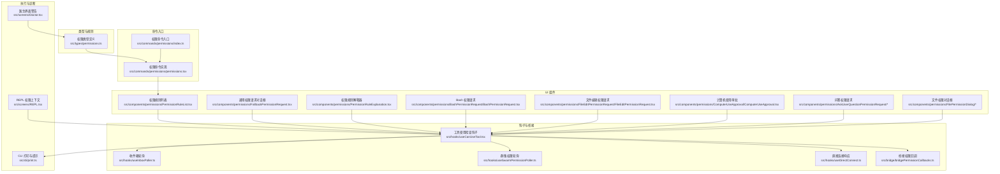
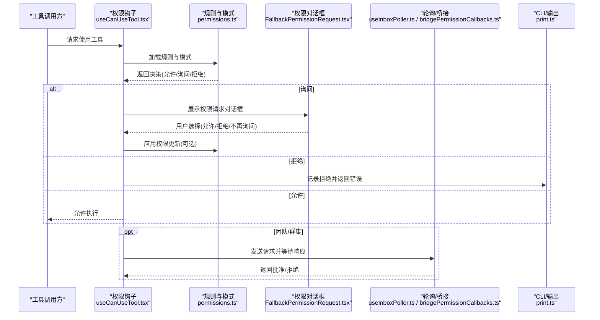
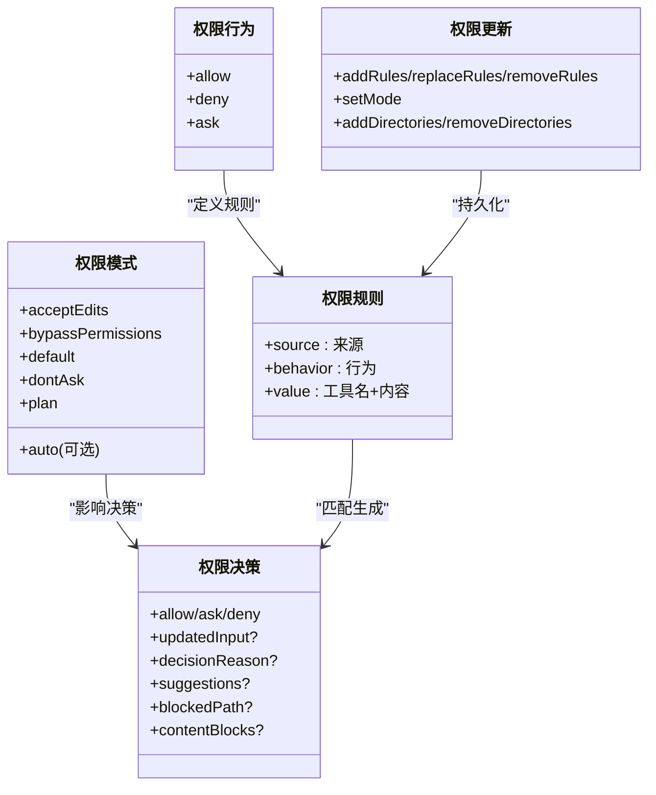
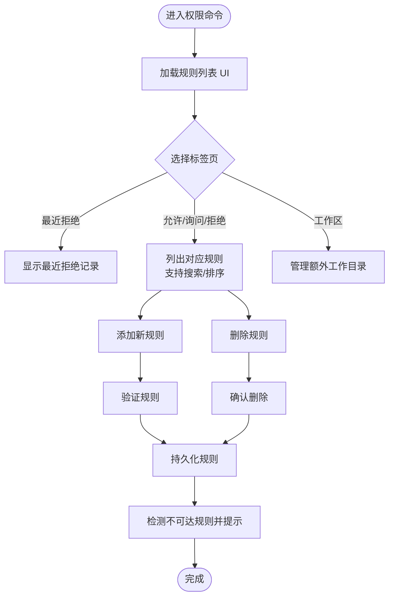
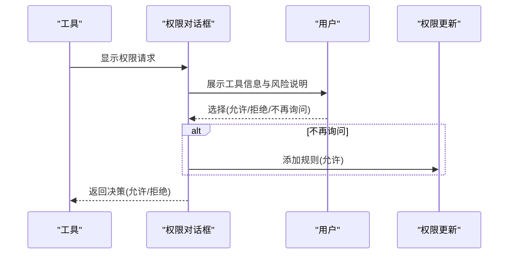
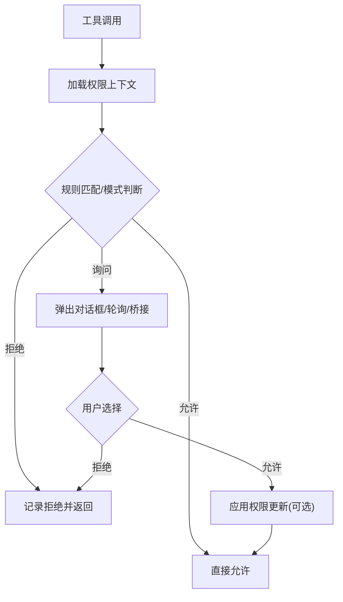
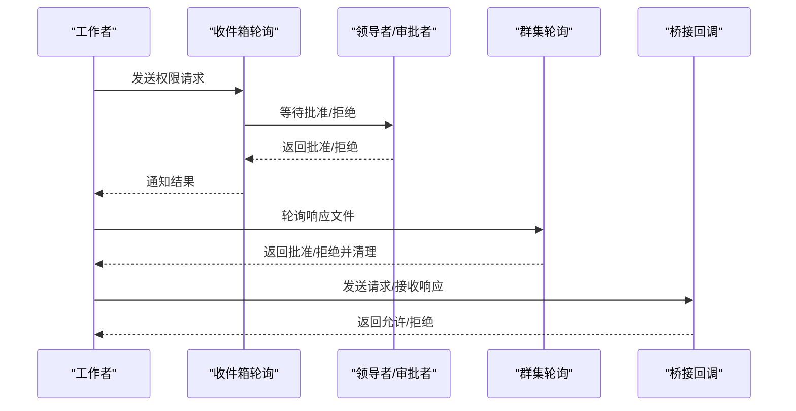
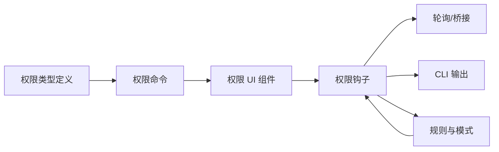

# 权限控制系统

<cite>
**本文档引用的文件**
- [src/types/permissions.ts](file://src/types/permissions.ts)
- [src/commands/permissions/index.ts](file://src/commands/permissions/index.ts)
- [src/commands/permissions/permissions.tsx](file://src/commands/permissions/permissions.tsx)
- [src/components/permissions/FallbackPermissionRequest.tsx](file://src/components/permissions/FallbackPermissionRequest.tsx)
- [src/components/permissions/PermissionRuleExplanation.tsx](file://src/components/permissions/PermissionRuleExplanation.tsx)
- [src/components/permissions/PermissionRuleList.tsx](file://src/components/permissions/PermissionRuleList.tsx)
- [src/components/permissions/BashPermissionRequest/BashPermissionRequest.tsx](file://src/components/permissions/BashPermissionRequest/BashPermissionRequest.tsx)
- [src/components/permissions/FileEditPermissionRequest/FileEditPermissionRequest.tsx](file://src/components/permissions/FileEditPermissionRequest/FileEditPermissionRequest.tsx)
- [src/components/permissions/ComputerUseApproval/ComputerUseApproval.tsx](file://src/components/permissions/ComputerUseApproval/ComputerUseApproval.tsx)
- [src/hooks/useCanUseTool.tsx](file://src/hooks/useCanUseTool.tsx)
- [src/hooks/useInboxPoller.ts](file://src/hooks/useInboxPoller.ts)
- [src/hooks/useSwarmPermissionPoller.ts](file://src/hooks/useSwarmPermissionPoller.ts)
- [src/hooks/useDirectConnect.ts](file://src/hooks/useDirectConnect.ts)
- [src/cli/print.ts](file://src/cli/print.ts)
- [src/bridge/bridgePermissionCallbacks.ts](file://src/bridge/bridgePermissionCallbacks.ts)
- [src/screens/Doctor.tsx](file://src/screens/Doctor.tsx)
- [src/screens/REPL.tsx](file://src/screens/REPL.tsx)
- [src/components/permissions/AskUserQuestionPermissionRequest/AskUserQuestionPermissionRequest.tsx](file://src/components/permissions/AskUserQuestionPermissionRequest/AskUserQuestionPermissionRequest.tsx)
- [src/components/permissions/AskUserQuestionPermissionRequest/QuestionView.tsx](file://src/components/permissions/AskUserQuestionPermissionRequest/QuestionView.tsx)
- [src/components/permissions/AskUserQuestionPermissionRequest/SubmitQuestionsView.tsx](file://src/components/permissions/AskUserQuestionPermissionRequest/SubmitQuestionsView.tsx)
- [src/components/permissions/AskUserQuestionPermissionRequest/PreviewQuestionView.tsx](file://src/components/permissions/AskUserQuestionPermissionRequest/PreviewQuestionView.tsx)
- [src/components/permissions/AskUserQuestionPermissionRequest/PreviewBox.tsx](file://src/components/permissions/AskUserQuestionPermissionRequest/PreviewBox.tsx)
- [src/components/permissions/AskUserQuestionPermissionRequest/QuestionNavigationBar.tsx](file://src/components/permissions/AskUserQuestionPermissionRequest/QuestionNavigationBar.tsx)
- [src/components/permissions/AskUserQuestionPermissionRequest/use-multiple-choice-state.ts](file://src/components/permissions/AskUserQuestionPermissionRequest/use-multiple-choice-state.ts)
- [src/components/permissions/FilePermissionDialog/FilePermissionDialog.tsx](file://src/components/permissions/FilePermissionDialog/FilePermissionDialog.tsx)
- [src/components/permissions/FilePermissionDialog/permissionOptions.tsx](file://src/components/permissions/FilePermissionDialog/permissionOptions.tsx)
- [src/components/permissions/FilePermissionDialog/useFilePermissionDialog.ts](file://src/components/permissions/FilePermissionDialog/useFilePermissionDialog.ts)
- [src/components/permissions/FilePermissionDialog/usePermissionHandler.ts](file://src/components/permissions/FilePermissionDialog/usePermissionHandler.ts)
- [src/components/permissions/FilePermissionDialog/ideDiffConfig.ts](file://src/components/permissions/FilePermissionDialog/ideDiffConfig.ts)
</cite>

## 目录
1. [简介](#简介)
2. [项目结构](#项目结构)
3. [核心组件](#核心组件)
4. [架构总览](#架构总览)
5. [详细组件分析](#详细组件分析)
6. [依赖关系分析](#依赖关系分析)
7. [性能考虑](#性能考虑)
8. [故障排除指南](#故障排除指南)
9. [结论](#结论)
10. [附录](#附录)

## 简介
本文件为 Claude Code 的权限控制系统提供全面技术文档。内容涵盖权限分类、权限检查流程、权限决策逻辑、规则引擎设计与实现、用户交互流程（权限请求对话框、用户确认机制、权限历史记录）、安全路径限制（文件系统访问控制、命令执行限制、网络访问控制）、权限缓存与性能优化策略、权限配置示例与最佳实践，以及扩展方法与自定义权限规则开发指南。

## 项目结构
权限系统围绕“类型定义—命令入口—UI 组件—钩子与桥接—工具使用检查”展开，形成从配置到执行的闭环。主要模块包括：
- 类型与规则：统一的权限模式、行为、规则、更新与决策类型定义
- 命令入口：提供权限规则管理命令
- UI 组件：规则列表、权限请求对话框、解释器等
- 钩子与桥接：权限轮询、远程响应、直接连接响应
- 工具使用检查：在工具调用前进行权限决策与提示

**图表来源**
- [src/types/permissions.ts](file://src/types/permissions.ts)
- [src/commands/permissions/index.ts](file://src/commands/permissions/index.ts)
- [src/commands/permissions/permissions.tsx](file://src/commands/permissions/permissions.tsx)
- [src/components/permissions/PermissionRuleList.tsx](file://src/components/permissions/PermissionRuleList.tsx)
- [src/components/permissions/FallbackPermissionRequest.tsx](file://src/components/permissions/FallbackPermissionRequest.tsx)
- [src/components/permissions/PermissionRuleExplanation.tsx](file://src/components/permissions/PermissionRuleExplanation.tsx)
- [src/components/permissions/BashPermissionRequest/BashPermissionRequest.tsx](file://src/components/permissions/BashPermissionRequest/BashPermissionRequest.tsx)
- [src/components/permissions/FileEditPermissionRequest/FileEditPermissionRequest.tsx](file://src/components/permissions/FileEditPermissionRequest/FileEditPermissionRequest.tsx)
- [src/components/permissions/ComputerUseApproval/ComputerUseApproval.tsx](file://src/components/permissions/ComputerUseApproval/ComputerUseApproval.tsx)
- [src/components/permissions/AskUserQuestionPermissionRequest/AskUserQuestionPermissionRequest.tsx](file://src/components/permissions/AskUserQuestionPermissionRequest/AskUserQuestionPermissionRequest.tsx)
- [src/components/permissions/FilePermissionDialog/FilePermissionDialog.tsx](file://src/components/permissions/FilePermissionDialog/FilePermissionDialog.tsx)
- [src/hooks/useCanUseTool.tsx](file://src/hooks/useCanUseTool.tsx)
- [src/hooks/useInboxPoller.ts](file://src/hooks/useInboxPoller.ts)
- [src/hooks/useSwarmPermissionPoller.ts](file://src/hooks/useSwarmPermissionPoller.ts)
- [src/hooks/useDirectConnect.ts](file://src/hooks/useDirectConnect.ts)
- [src/bridge/bridgePermissionCallbacks.ts](file://src/bridge/bridgePermissionCallbacks.ts)
- [src/cli/print.ts](file://src/cli/print.ts)
- [src/screens/Doctor.tsx](file://src/screens/Doctor.tsx)
- [src/screens/REPL.tsx](file://src/screens/REPL.tsx)

**章节来源**
- [src/types/permissions.ts](file://src/types/permissions.ts)
- [src/commands/permissions/index.ts](file://src/commands/permissions/index.ts)
- [src/commands/permissions/permissions.tsx](file://src/commands/permissions/permissions.tsx)

## 核心组件
- 权限类型与规则
  - 权限模式：默认、不询问、接受编辑、绕过权限、计划模式、自动模式（可选）
  - 权限行为：允许、拒绝、询问
  - 规则来源：用户设置、项目设置、本地设置、标志设置、策略设置、命令、会话
  - 决策类型：允许、询问（含建议、阻断路径、元数据、异步分类器）、拒绝（含原因）
  - 更新类型：增删改规则、设置模式、增删工作目录
- 权限命令入口
  - 提供“permissions/allowed-tools”命令，打开权限规则列表 UI
- UI 组件
  - 规则列表：按允许/询问/拒绝/工作区分页查看与搜索，支持新增、删除规则
  - 权限请求对话框：通用与专用（Bash、文件编辑、问答、计算机使用）对话框
  - 权限解释器：展示决策原因与风险等级
- 钩子与桥接
  - 工具使用检查：根据规则与模式生成决策，必要时弹出对话框或轮询响应
  - 收件箱轮询与群集轮询：处理团队/群集权限审批
  - 桥接回调：跨进程/远程通信的权限请求与响应
- 执行与诊断
  - CLI 打印：权限提示工具结果映射与错误处理
  - 医生界面：不可达规则等警告
  - REPL：权限上下文变更触发队列重检

**章节来源**
- [src/types/permissions.ts](file://src/types/permissions.ts)
- [src/commands/permissions/index.ts](file://src/commands/permissions/index.ts)
- [src/commands/permissions/permissions.tsx](file://src/commands/permissions/permissions.tsx)
- [src/components/permissions/PermissionRuleList.tsx](file://src/components/permissions/PermissionRuleList.tsx)
- [src/components/permissions/FallbackPermissionRequest.tsx](file://src/components/permissions/FallbackPermissionRequest.tsx)
- [src/components/permissions/PermissionRuleExplanation.tsx](file://src/components/permissions/PermissionRuleExplanation.tsx)
- [src/hooks/useCanUseTool.tsx](file://src/hooks/useCanUseTool.tsx)
- [src/hooks/useInboxPoller.ts](file://src/hooks/useInboxPoller.ts)
- [src/hooks/useSwarmPermissionPoller.ts](file://src/hooks/useSwarmPermissionPoller.ts)
- [src/bridge/bridgePermissionCallbacks.ts](file://src/bridge/bridgePermissionCallbacks.ts)
- [src/cli/print.ts](file://src/cli/print.ts)
- [src/screens/Doctor.tsx](file://src/screens/Doctor.tsx)
- [src/screens/REPL.tsx](file://src/screens/REPL.tsx)

## 架构总览
权限系统采用“规则驱动 + 决策引擎 + 对话框 + 轮询/桥接”的架构。工具调用前由钩子进行规则匹配与模式判断，生成允许/询问/拒绝决策；询问场景下通过 UI 对话框收集用户确认，并可附带权限更新建议；团队/群集场景通过轮询等待审批；远程/桥接场景通过回调传递请求与响应。

**图表来源**
- [src/hooks/useCanUseTool.tsx](file://src/hooks/useCanUseTool.tsx)
- [src/types/permissions.ts](file://src/types/permissions.ts)
- [src/components/permissions/FallbackPermissionRequest.tsx](file://src/components/permissions/FallbackPermissionRequest.tsx)
- [src/hooks/useInboxPoller.ts](file://src/hooks/useInboxPoller.ts)
- [src/bridge/bridgePermissionCallbacks.ts](file://src/bridge/bridgePermissionCallbacks.ts)
- [src/cli/print.ts](file://src/cli/print.ts)

## 详细组件分析

### 权限类型与规则引擎
- 权限模式
  - 外部模式：acceptEdits、bypassPermissions、default、dontAsk、plan
  - 内部模式：在外部基础上可选包含 auto（受特性开关控制）
- 权限行为：allow/deny/ask
- 规则来源与值：包含工具名与可选规则内容
- 决策类型
  - 允许：可携带更新后的输入、用户修改标记、决策原因、工具使用 ID、内容块
  - 询问：消息、更新后输入、决策原因、建议、阻断路径、元数据、异步分类器检查、内容块
  - 拒绝：消息、决策原因、工具使用 ID
  - 附加：passthrough（透传）
- 决策原因：规则、模式、子命令结果、权限提示工具、钩子、异步代理、沙箱覆盖、分类器、工作目录、安全检查、其他
- 分类器：支持两阶段（fast/thinking），记录 token 使用、请求 ID、消息 ID、持续时间等
- 权限更新：增删改规则、设置模式、增删工作目录

**图表来源**
- [src/types/permissions.ts](file://src/types/permissions.ts)

**章节来源**
- [src/types/permissions.ts](file://src/types/permissions.ts)

### 权限命令与规则列表
- 命令入口：提供“permissions/allowed-tools”命令，加载规则列表 UI
- 规则列表 UI：支持最近拒绝、允许、询问、拒绝、工作区标签页；支持搜索与排序；支持新增/删除规则；显示不可达规则警告

**图表来源**
- [src/commands/permissions/index.ts](file://src/commands/permissions/index.ts)
- [src/commands/permissions/permissions.tsx](file://src/commands/permissions/permissions.tsx)
- [src/components/permissions/PermissionRuleList.tsx](file://src/components/permissions/PermissionRuleList.tsx)

**章节来源**
- [src/commands/permissions/index.ts](file://src/commands/permissions/index.ts)
- [src/commands/permissions/permissions.tsx](file://src/commands/permissions/permissions.tsx)
- [src/components/permissions/PermissionRuleList.tsx](file://src/components/permissions/PermissionRuleList.tsx)

### 权限请求对话框与用户交互
- 通用对话框：支持“是/不再询问/否”，记录事件日志，支持反馈
- 专用对话框：
  - Bash：针对命令执行的安全检查与选项
  - 文件编辑：针对文件读写操作的权限请求
  - 问答：多选题预览与提交视图
  - 计算机使用：屏幕/鼠标/键盘操作审批
- 权限解释器：展示决策原因、风险等级与解释
- 文件权限对话框：IDE 差异配置、权限选项、处理器与状态管理

**图表来源**
- [src/components/permissions/FallbackPermissionRequest.tsx](file://src/components/permissions/FallbackPermissionRequest.tsx)
- [src/components/permissions/BashPermissionRequest/BashPermissionRequest.tsx](file://src/components/permissions/BashPermissionRequest/BashPermissionRequest.tsx)
- [src/components/permissions/FileEditPermissionRequest/FileEditPermissionRequest.tsx](file://src/components/permissions/FileEditPermissionRequest/FileEditPermissionRequest.tsx)
- [src/components/permissions/AskUserQuestionPermissionRequest/AskUserQuestionPermissionRequest.tsx](file://src/components/permissions/AskUserQuestionPermissionRequest/AskUserQuestionPermissionRequest.tsx)
- [src/components/permissions/ComputerUseApproval/ComputerUseApproval.tsx](file://src/components/permissions/ComputerUseApproval/ComputerUseApproval.tsx)
- [src/components/permissions/PermissionRuleExplanation.tsx](file://src/components/permissions/PermissionRuleExplanation.tsx)
- [src/components/permissions/FilePermissionDialog/FilePermissionDialog.tsx](file://src/components/permissions/FilePermissionDialog/FilePermissionDialog.tsx)

**章节来源**
- [src/components/permissions/FallbackPermissionRequest.tsx](file://src/components/permissions/FallbackPermissionRequest.tsx)
- [src/components/permissions/BashPermissionRequest/BashPermissionRequest.tsx](file://src/components/permissions/BashPermissionRequest/BashPermissionRequest.tsx)
- [src/components/permissions/FileEditPermissionRequest/FileEditPermissionRequest.tsx](file://src/components/permissions/FileEditPermissionRequest/FileEditPermissionRequest.tsx)
- [src/components/permissions/AskUserQuestionPermissionRequest/AskUserQuestionPermissionRequest.tsx](file://src/components/permissions/AskUserQuestionPermissionRequest/AskUserQuestionPermissionRequest.tsx)
- [src/components/permissions/ComputerUseApproval/ComputerUseApproval.tsx](file://src/components/permissions/ComputerUseApproval/ComputerUseApproval.tsx)
- [src/components/permissions/PermissionRuleExplanation.tsx](file://src/components/permissions/PermissionRuleExplanation.tsx)
- [src/components/permissions/FilePermissionDialog/FilePermissionDialog.tsx](file://src/components/permissions/FilePermissionDialog/FilePermissionDialog.tsx)

### 权限检查流程与决策逻辑
- 工具使用检查钩子：根据规则与模式生成决策；若开启自动模式且满足条件，可能异步运行分类器；必要时弹出对话框或等待轮询/桥接响应
- CLI 打印：权限提示工具调用与结果映射，异常时抛出错误
- REPL：权限上下文变更时触发队列重检，支持“不要再次询问”等更新

**图表来源**
- [src/hooks/useCanUseTool.tsx](file://src/hooks/useCanUseTool.tsx)
- [src/cli/print.ts](file://src/cli/print.ts)
- [src/screens/REPL.tsx](file://src/screens/REPL.tsx)

**章节来源**
- [src/hooks/useCanUseTool.tsx](file://src/hooks/useCanUseTool.tsx)
- [src/cli/print.ts](file://src/cli/print.ts)
- [src/screens/REPL.tsx](file://src/screens/REPL.tsx)

### 团队/群集与远程权限流程
- 收件箱轮询：在团队模式下，发送权限请求并通过邮箱通道等待批准/拒绝
- 群集轮询：作为群集工作者轮询响应文件，处理批准/拒绝并清理响应
- 直连响应：远程会话中对权限请求进行允许/拒绝响应
- 桥接回调：定义请求/响应/取消接口与校验函数

**图表来源**
- [src/hooks/useInboxPoller.ts](file://src/hooks/useInboxPoller.ts)
- [src/hooks/useSwarmPermissionPoller.ts](file://src/hooks/useSwarmPermissionPoller.ts)
- [src/hooks/useDirectConnect.ts](file://src/hooks/useDirectConnect.ts)
- [src/bridge/bridgePermissionCallbacks.ts](file://src/bridge/bridgePermissionCallbacks.ts)

**章节来源**
- [src/hooks/useInboxPoller.ts](file://src/hooks/useInboxPoller.ts)
- [src/hooks/useSwarmPermissionPoller.ts](file://src/hooks/useSwarmPermissionPoller.ts)
- [src/hooks/useDirectConnect.ts](file://src/hooks/useDirectConnect.ts)
- [src/bridge/bridgePermissionCallbacks.ts](file://src/bridge/bridgePermissionCallbacks.ts)

### 安全路径限制与规则优先级
- 工作目录：支持额外工作目录，来源与规则一致
- 安全检查：敏感路径（如 .claude/、.git/、shell 配置）与安全检查（Windows 路径绕过、跨机器桥接消息）区分对待
- 不可达规则：医生界面提示不可达规则（被更高优先级规则屏蔽或阻止）

**章节来源**
- [src/types/permissions.ts](file://src/types/permissions.ts)
- [src/screens/Doctor.tsx](file://src/screens/Doctor.tsx)

## 依赖关系分析
- 松耦合：类型定义独立于实现，避免循环依赖
- 高内聚：规则、对话框、钩子、桥接各司其职
- 关键依赖链：
  - 类型定义 → 命令入口 → UI 组件 → 钩子 → 轮询/桥接 → CLI 输出
  - 规则来源 → 决策生成 → 对话框/轮询 → 权限更新 → 规则持久化

**图表来源**
- [src/types/permissions.ts](file://src/types/permissions.ts)
- [src/commands/permissions/index.ts](file://src/commands/permissions/index.ts)
- [src/commands/permissions/permissions.tsx](file://src/commands/permissions/permissions.tsx)
- [src/components/permissions/PermissionRuleList.tsx](file://src/components/permissions/PermissionRuleList.tsx)
- [src/hooks/useCanUseTool.tsx](file://src/hooks/useCanUseTool.tsx)
- [src/hooks/useInboxPoller.ts](file://src/hooks/useInboxPoller.ts)
- [src/bridge/bridgePermissionCallbacks.ts](file://src/bridge/bridgePermissionCallbacks.ts)
- [src/cli/print.ts](file://src/cli/print.ts)

**章节来源**
- [src/types/permissions.ts](file://src/types/permissions.ts)
- [src/commands/permissions/index.ts](file://src/commands/permissions/index.ts)
- [src/commands/permissions/permissions.tsx](file://src/commands/permissions/permissions.tsx)
- [src/components/permissions/PermissionRuleList.tsx](file://src/components/permissions/PermissionRuleList.tsx)
- [src/hooks/useCanUseTool.tsx](file://src/hooks/useCanUseTool.tsx)
- [src/hooks/useInboxPoller.ts](file://src/hooks/useInboxPoller.ts)
- [src/bridge/bridgePermissionCallbacks.ts](file://src/bridge/bridgePermissionCallbacks.ts)
- [src/cli/print.ts](file://src/cli/print.ts)

## 性能考虑
- 异步分类器：允许在用户未确认前进行异步评估，减少等待时间
- 队列重检：权限上下文变化时批量重检队列项，避免重复计算
- 缓存与去重：规则键值化与映射，避免重复渲染与计算
- 轮询节流：群集轮询设置处理标志与并发控制，避免频繁 IO

**章节来源**
- [src/types/permissions.ts](file://src/types/permissions.ts)
- [src/screens/REPL.tsx](file://src/screens/REPL.tsx)
- [src/hooks/useSwarmPermissionPoller.ts](file://src/hooks/useSwarmPermissionPoller.ts)

## 故障排除指南
- 权限提示工具失败：检查工具结果格式与内容块，确保文本字段存在
- 自动模式拒绝：记录自动模式拒绝通知，可通过 /permissions 查看
- 医生界面警告：关注不可达规则警告，修复高优先级规则冲突
- 远程/桥接权限：确认回调接口与响应格式，校验行为字段

**章节来源**
- [src/cli/print.ts](file://src/cli/print.ts)
- [src/screens/Doctor.tsx](file://src/screens/Doctor.tsx)
- [src/bridge/bridgePermissionCallbacks.ts](file://src/bridge/bridgePermissionCallbacks.ts)

## 结论
该权限控制系统以类型驱动的规则引擎为核心，结合对话框、轮询与桥接机制，实现了灵活、可扩展且安全的权限管理。通过异步分类器与上下文重检等优化策略，在保证安全性的同时提升了用户体验与性能。

## 附录

### 权限配置示例与最佳实践
- 常见配置
  - 将常用工具设为“允许”，减少频繁询问
  - 对敏感操作（如 Bash、文件编辑）保持“询问”
  - 使用“不要再次询问”仅用于已充分信任的场景
- 最佳实践
  - 合理使用工作目录，限制工具访问范围
  - 定期审查不可达规则，避免误配置
  - 在团队/群集场景中明确审批流程与轮询策略
  - 利用自动模式（如可用）提升效率，同时保留人工复核

### 扩展方法与自定义权限规则开发指南
- 新增权限规则来源
  - 在规则来源枚举中添加新来源，并在加载逻辑中支持
- 新增权限行为
  - 在行为枚举中添加新行为，并在决策与 UI 中处理
- 新增权限对话框
  - 参考现有专用对话框（Bash、文件编辑、问答、计算机使用）实现
- 新增权限钩子
  - 在钩子中集成规则匹配、模式判断与 UI 调用
- 新增桥接回调
  - 实现请求/响应/取消接口，确保行为字段校验

**章节来源**
- [src/types/permissions.ts](file://src/types/permissions.ts)
- [src/components/permissions/BashPermissionRequest/BashPermissionRequest.tsx](file://src/components/permissions/BashPermissionRequest/BashPermissionRequest.tsx)
- [src/components/permissions/FileEditPermissionRequest/FileEditPermissionRequest.tsx](file://src/components/permissions/FileEditPermissionRequest/FileEditPermissionRequest.tsx)
- [src/components/permissions/AskUserQuestionPermissionRequest/AskUserQuestionPermissionRequest.tsx](file://src/components/permissions/AskUserQuestionPermissionRequest/AskUserQuestionPermissionRequest.tsx)
- [src/components/permissions/ComputerUseApproval/ComputerUseApproval.tsx](file://src/components/permissions/ComputerUseApproval/ComputerUseApproval.tsx)
- [src/hooks/useCanUseTool.tsx](file://src/hooks/useCanUseTool.tsx)
- [src/bridge/bridgePermissionCallbacks.ts](file://src/bridge/bridgePermissionCallbacks.ts)