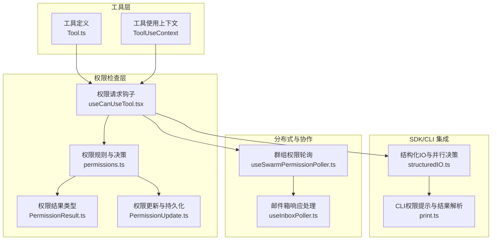
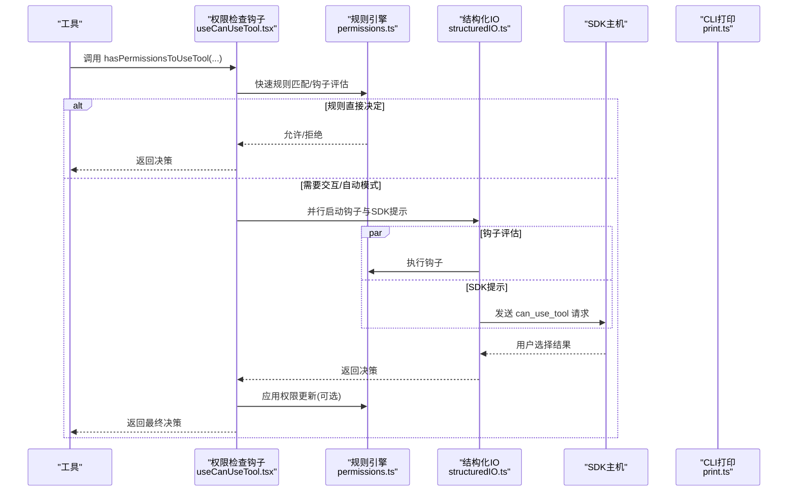
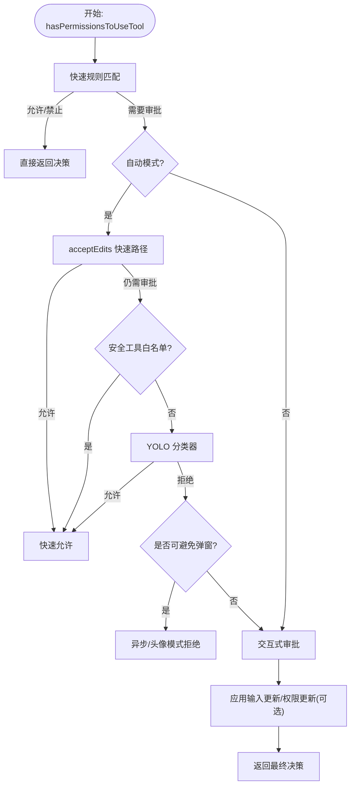
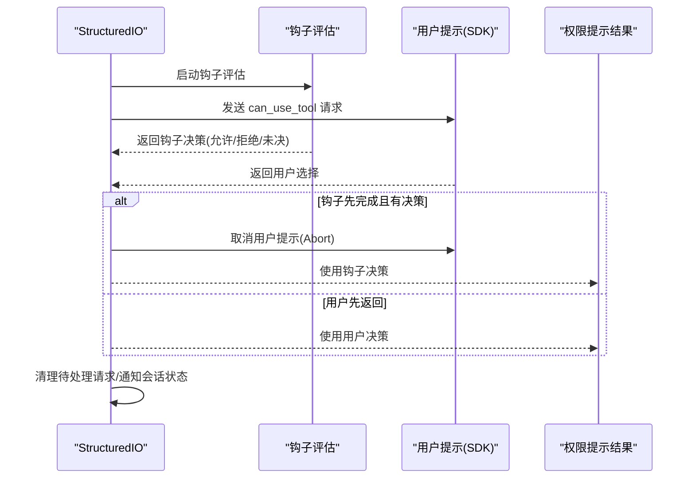
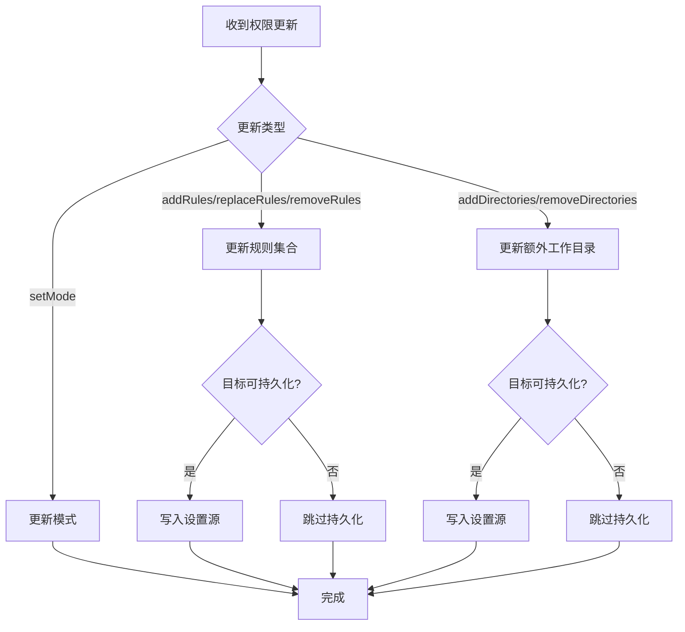
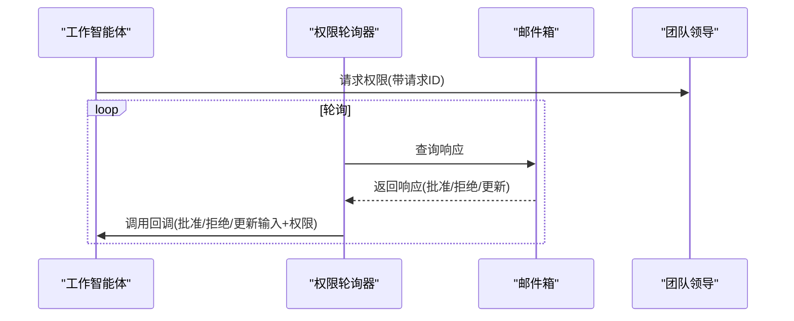
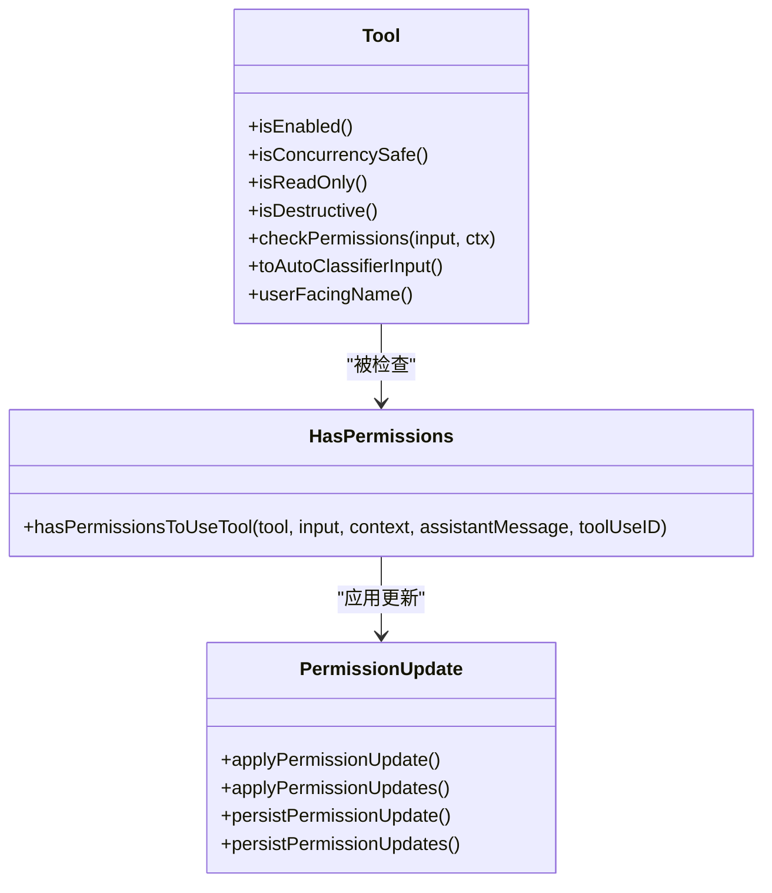
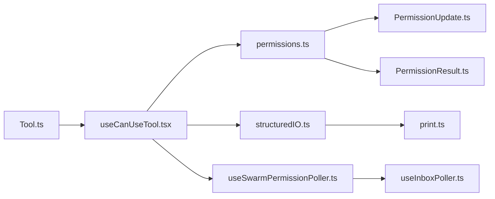

# 权限检查机制

<cite>
**本文档引用的文件**
- [src/hooks/useCanUseTool.tsx](file://src/hooks/useCanUseTool.tsx)
- [src/cli/structuredIO.ts](file://src/cli/structuredIO.ts)
- [src/utils/permissions/permissions.ts](file://src/utils/permissions/permissions.ts)
- [src/utils/permissions/PermissionResult.ts](file://src/utils/permissions/PermissionResult.ts)
- [src/utils/permissions/PermissionUpdate.ts](file://src/utils/permissions/PermissionUpdate.ts)
- [src/hooks/useSwarmPermissionPoller.ts](file://src/hooks/useSwarmPermissionPoller.ts)
- [src/hooks/useInboxPoller.ts](file://src/hooks/useInboxPoller.ts)
- [src/Tool.ts](file://src/Tool.ts)
- [src/cli/print.ts](file://src/cli/print.ts)
</cite>

## 目录
1. [简介](#简介)
2. [项目结构](#项目结构)
3. [核心组件](#核心组件)
4. [架构总览](#架构总览)
5. [详细组件分析](#详细组件分析)
6. [依赖关系分析](#依赖关系分析)
7. [性能考虑](#性能考虑)
8. [故障排除指南](#故障排除指南)
9. [结论](#结论)

## 简介
本技术文档系统性阐述权限检查机制的设计与实现，覆盖权限验证流程、权限缓存策略、权限决策树、工具执行前的拦截机制（权限预检查、权限状态查询、权限结果处理）、异步处理与错误处理策略，以及与工具执行的集成方式（工具包装器模式与权限装饰器）。同时提供性能优化技巧与调试方法，帮助开发者在保证安全的前提下提升系统可用性与可维护性。

## 项目结构
权限检查机制主要分布在以下模块：
- 工具使用前置检查：通过钩子与规则系统进行快速判定，并在必要时触发交互式或异步审批。
- SDK/CLI 集成：通过结构化输入输出协议与 SDK 主机协作，支持并行的权限请求与钩子评估。
- 权限更新持久化：将权限决策转化为规则与工作目录配置，形成可复用的上下文状态。
- 分布式与团队协作：在多智能体场景下，通过轮询与消息传递实现跨进程/跨主机的权限同步。

**图表来源**
- [src/hooks/useCanUseTool.tsx:1-204](file://src/hooks/useCanUseTool.tsx#L1-L204)
- [src/utils/permissions/permissions.ts:1-800](file://src/utils/permissions/permissions.ts#L1-L800)
- [src/utils/permissions/PermissionResult.ts:1-36](file://src/utils/permissions/PermissionResult.ts#L1-L36)
- [src/utils/permissions/PermissionUpdate.ts:1-390](file://src/utils/permissions/PermissionUpdate.ts#L1-L390)
- [src/cli/structuredIO.ts:135-774](file://src/cli/structuredIO.ts#L135-L774)
- [src/cli/print.ts:4247-4291](file://src/cli/print.ts#L4247-L4291)
- [src/hooks/useSwarmPermissionPoller.ts:1-298](file://src/hooks/useSwarmPermissionPoller.ts#L1-L298)
- [src/hooks/useInboxPoller.ts:296-337](file://src/hooks/useInboxPoller.ts#L296-L337)

**章节来源**
- [src/hooks/useCanUseTool.tsx:1-204](file://src/hooks/useCanUseTool.tsx#L1-L204)
- [src/utils/permissions/permissions.ts:1-800](file://src/utils/permissions/permissions.ts#L1-L800)
- [src/cli/structuredIO.ts:135-774](file://src/cli/structuredIO.ts#L135-L774)

## 核心组件
- 工具使用前置检查器：负责在工具执行前进行权限判定，支持快速允许/拒绝、交互式审批、自动模式分类器替代、以及钩子扩展。
- 权限规则引擎：基于“总是允许/禁止/询问”的规则集合，结合工具名、MCP 服务器名、规则内容等进行匹配。
- 结构化IO与并行决策：在 SDK 主机中并行运行钩子与用户提示，以最快者为准，避免阻塞。
- 权限更新与持久化：将权限决策转化为规则与工作目录配置，写入本地/用户/项目设置。
- 分布式权限轮询：在多智能体场景下，通过轮询与邮件箱通信实现跨节点的权限同步。

**章节来源**
- [src/hooks/useCanUseTool.tsx:28-191](file://src/hooks/useCanUseTool.tsx#L28-L191)
- [src/utils/permissions/permissions.ts:473-800](file://src/utils/permissions/permissions.ts#L473-L800)
- [src/utils/permissions/PermissionUpdate.ts:55-206](file://src/utils/permissions/PermissionUpdate.ts#L55-L206)
- [src/hooks/useSwarmPermissionPoller.ts:268-298](file://src/hooks/useSwarmPermissionPoller.ts#L268-L298)

## 架构总览
权限检查的整体流程如下：
- 工具调用进入权限检查入口，先进行快速规则匹配与钩子评估。
- 若规则直接给出允许/拒绝，则立即返回；否则进入交互式或自动模式审批。
- 在 SDK/CLI 环境中，钩子与用户提示并行运行，以最快完成者为准。
- 审批结果可能包含对输入的更新与权限规则的持久化建议。
- 在分布式场景下，通过轮询与邮件箱实现跨节点的权限同步与回调。

**图表来源**
- [src/hooks/useCanUseTool.tsx:32-182](file://src/hooks/useCanUseTool.tsx#L32-L182)
- [src/utils/permissions/permissions.ts:473-800](file://src/utils/permissions/permissions.ts#L473-L800)
- [src/cli/structuredIO.ts:533-659](file://src/cli/structuredIO.ts#L533-L659)

**章节来源**
- [src/hooks/useCanUseTool.tsx:32-182](file://src/hooks/useCanUseTool.tsx#L32-L182)
- [src/cli/structuredIO.ts:533-659](file://src/cli/structuredIO.ts#L533-L659)

## 详细组件分析

### 组件A：权限检查入口与决策树
- 入口函数 hasPermissionsToUseTool：统一聚合规则匹配、钩子评估、自动模式分类器、交互式审批等逻辑。
- 决策树关键分支：
  - 快速路径：规则命中允许/禁止，直接返回。
  - 自动模式：在允许/询问场景下，优先尝试 acceptEdits 快速路径与安全工具白名单，再调用分类器。
  - 交互式审批：当需要用户确认时，按配置等待自动化检查后再弹窗，或直接弹窗。
  - 头脑风暴/异步代理：在无法弹窗的环境中，优先运行权限请求钩子，若无钩子决策则自动拒绝。
- 输入更新与权限更新：支持对输入进行安全更新，并将规则变更持久化到设置源。

**图表来源**
- [src/utils/permissions/permissions.ts:473-800](file://src/utils/permissions/permissions.ts#L473-L800)

**章节来源**
- [src/utils/permissions/permissions.ts:473-800](file://src/utils/permissions/permissions.ts#L473-L800)

### 组件B：结构化IO与并行决策
- 并行策略：在 SDK 主机中，同时运行权限请求钩子与用户提示，以最快完成者为准，避免 UI 阻塞。
- 取消与竞态：通过 AbortController 将父级取消信号转发给钩子，确保钩子提前结束并抑制后续异常。
- 请求跟踪：记录已解决的 tool_use_id，防止重复响应导致的消息重复问题。
- 沙箱网络访问：通过合成工具名将沙箱网络权限请求转为标准 can_use_tool 协议。

**图表来源**
- [src/cli/structuredIO.ts:533-659](file://src/cli/structuredIO.ts#L533-L659)
- [src/cli/structuredIO.ts:787-859](file://src/cli/structuredIO.ts#L787-L859)

**章节来源**
- [src/cli/structuredIO.ts:533-659](file://src/cli/structuredIO.ts#L533-L659)
- [src/cli/structuredIO.ts:787-859](file://src/cli/structuredIO.ts#L787-L859)

### 组件C：权限更新与持久化
- 更新类型：设置模式、添加/替换/移除规则、添加/移除工作目录。
- 应用策略：在内存中生成新的权限上下文，必要时写入设置源（本地/用户/项目）。
- 持久化策略：仅对可持久化的目标进行写入，避免对不可持久化目标产生副作用。

**图表来源**
- [src/utils/permissions/PermissionUpdate.ts:55-353](file://src/utils/permissions/PermissionUpdate.ts#L55-L353)

**章节来源**
- [src/utils/permissions/PermissionUpdate.ts:55-353](file://src/utils/permissions/PermissionUpdate.ts#L55-L353)

### 组件D：分布式与团队协作
- 群组权限轮询：在多智能体场景下，定期轮询响应队列，处理批准/拒绝与权限更新。
- 邮件箱响应：通过邮件箱发送/接收权限响应，支持反馈信息与更新后的输入。
- 回调注册：为每个请求注册回调，处理响应并清理注册表。

**图表来源**
- [src/hooks/useSwarmPermissionPoller.ts:268-298](file://src/hooks/useSwarmPermissionPoller.ts#L268-L298)
- [src/hooks/useInboxPoller.ts:296-337](file://src/hooks/useInboxPoller.ts#L296-L337)

**章节来源**
- [src/hooks/useSwarmPermissionPoller.ts:268-298](file://src/hooks/useSwarmPermissionPoller.ts#L268-L298)
- [src/hooks/useInboxPoller.ts:296-337](file://src/hooks/useInboxPoller.ts#L296-L337)

### 组件E：工具包装器与权限装饰器
- 工具默认行为：工具导出通过统一的默认值处理，确保在缺少显式实现时采用“保守闭合”策略。
- 包装器模式：在工具使用前统一调用权限检查入口，确保所有工具都经过一致的权限控制。
- 权限装饰器：通过钩子与规则系统对工具行为进行装饰，支持动态更新与持久化。

**图表来源**
- [src/Tool.ts:745-775](file://src/Tool.ts#L745-L775)
- [src/utils/permissions/permissions.ts:473-800](file://src/utils/permissions/permissions.ts#L473-L800)
- [src/utils/permissions/PermissionUpdate.ts:55-206](file://src/utils/permissions/PermissionUpdate.ts#L55-L206)

**章节来源**
- [src/Tool.ts:745-775](file://src/Tool.ts#L745-L775)
- [src/utils/permissions/permissions.ts:473-800](file://src/utils/permissions/permissions.ts#L473-L800)
- [src/utils/permissions/PermissionUpdate.ts:55-206](file://src/utils/permissions/PermissionUpdate.ts#L55-L206)

## 依赖关系分析
- 松耦合设计：权限检查通过钩子与规则解耦具体工具实现，工具只需暴露最小接口即可参与权限控制。
- 依赖注入：通过 ToolUseContext 注入应用状态、消息历史、取消信号等，便于测试与扩展。
- 循环依赖规避：权限更新类型迁移至独立模块，避免循环导入。

**图表来源**
- [src/Tool.ts:745-775](file://src/Tool.ts#L745-L775)
- [src/hooks/useCanUseTool.tsx:1-204](file://src/hooks/useCanUseTool.tsx#L1-L204)
- [src/utils/permissions/permissions.ts:1-800](file://src/utils/permissions/permissions.ts#L1-L800)
- [src/utils/permissions/PermissionUpdate.ts:1-390](file://src/utils/permissions/PermissionUpdate.ts#L1-L390)
- [src/utils/permissions/PermissionResult.ts:1-36](file://src/utils/permissions/PermissionResult.ts#L1-L36)
- [src/cli/structuredIO.ts:135-774](file://src/cli/structuredIO.ts#L135-L774)
- [src/cli/print.ts:4247-4291](file://src/cli/print.ts#L4247-L4291)
- [src/hooks/useSwarmPermissionPoller.ts:1-298](file://src/hooks/useSwarmPermissionPoller.ts#L1-L298)
- [src/hooks/useInboxPoller.ts:296-337](file://src/hooks/useInboxPoller.ts#L296-L337)

**章节来源**
- [src/hooks/useCanUseTool.tsx:1-204](file://src/hooks/useCanUseTool.tsx#L1-L204)
- [src/utils/permissions/permissions.ts:1-800](file://src/utils/permissions/permissions.ts#L1-L800)

## 性能考虑
- 并行评估：钩子与用户提示并行运行，减少等待时间，提高用户体验。
- 缓存与快路径：acceptEdits 快速路径与安全工具白名单减少分类器调用次数。
- 请求去重：通过 resolvedToolUseIds 集合避免重复响应导致的消息重复与资源浪费。
- 取消与降级：在父级取消时及时终止钩子，避免无效计算；分类器失败时采用降级策略。
- 日志与指标：记录分类器成本、令牌用量、延迟等指标，辅助性能分析与优化。

[本节为通用性能指导，不直接分析特定文件]

## 故障排除指南
- 常见问题
  - 权限提示未出现：检查 awaitAutomatedChecksBeforeDialog 配置与钩子是否提前决策。
  - 重复消息/冲突：确认 resolvedToolUseIds 是否正确跟踪 tool_use_id。
  - 分类器异常：查看分类器错误转储路径与通知，确认环境变量与令牌配置。
  - 分布式权限不同步：检查轮询间隔、邮件箱通信与回调注册是否正常。
- 调试步骤
  - 启用调试日志，观察权限检查链路中的关键事件与决策原因。
  - 使用 AbortError/APIUserAbortError 进行取消测试，验证取消路径。
  - 在 CLI 中通过 print.ts 的结果解析定位权限提示工具输出格式问题。
  - 检查权限更新持久化是否成功写入设置源。

**章节来源**
- [src/hooks/useCanUseTool.tsx:171-182](file://src/hooks/useCanUseTool.tsx#L171-L182)
- [src/cli/structuredIO.ts:374-430](file://src/cli/structuredIO.ts#L374-L430)
- [src/cli/print.ts:4247-4291](file://src/cli/print.ts#L4247-L4291)
- [src/hooks/useSwarmPermissionPoller.ts:268-298](file://src/hooks/useSwarmPermissionPoller.ts#L268-L298)

## 结论
该权限检查机制通过规则、钩子、自动模式与交互式审批的组合，实现了灵活而强大的工具使用控制。其并行决策、取消与降级策略有效提升了用户体验与系统鲁棒性；权限更新与持久化确保了策略的可复用与一致性；分布式轮询与邮件箱通信为多智能体协作提供了可靠支撑。遵循本文档的优化与排障建议，可在保证安全的前提下获得更佳的性能与稳定性。