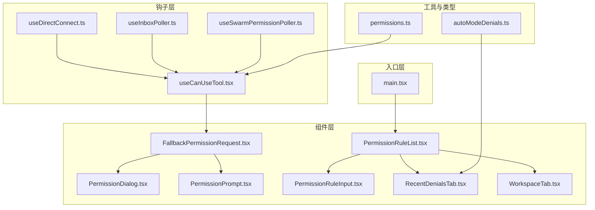
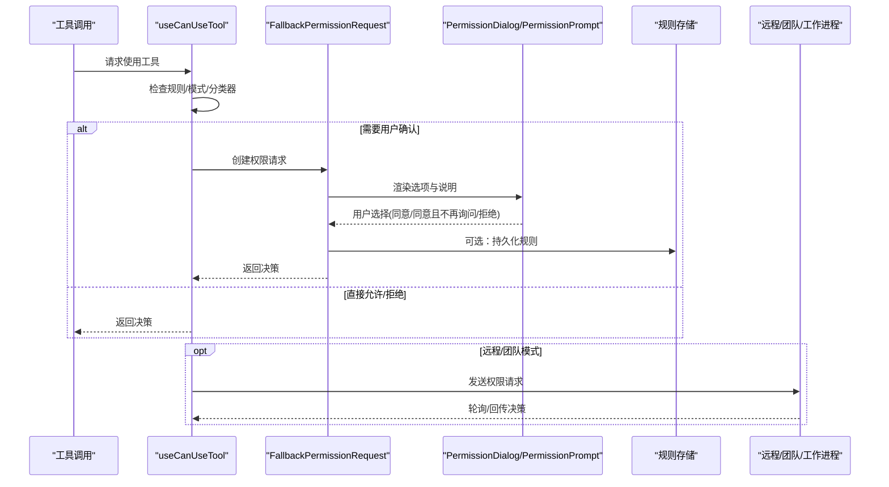
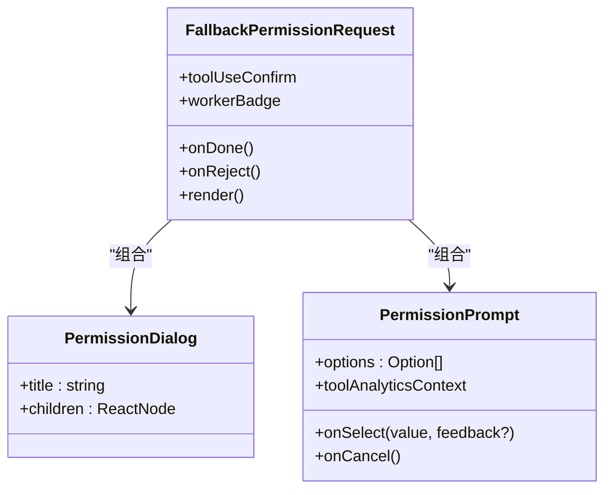
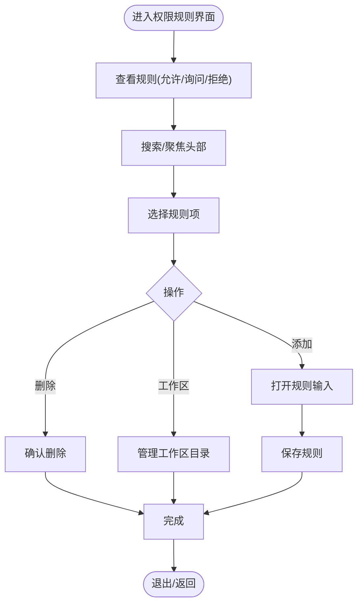
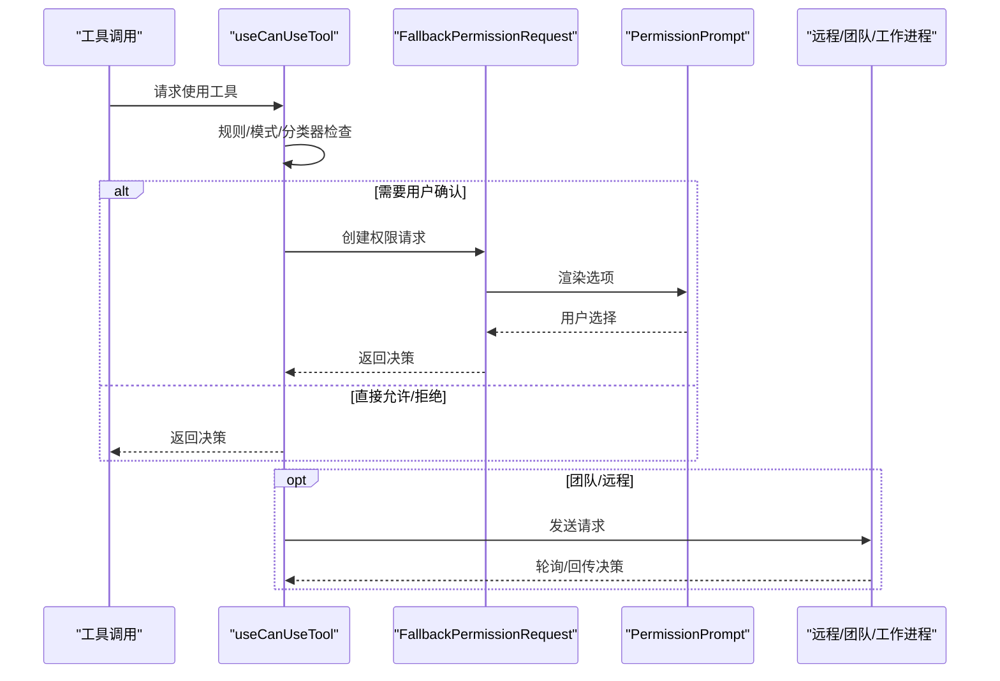
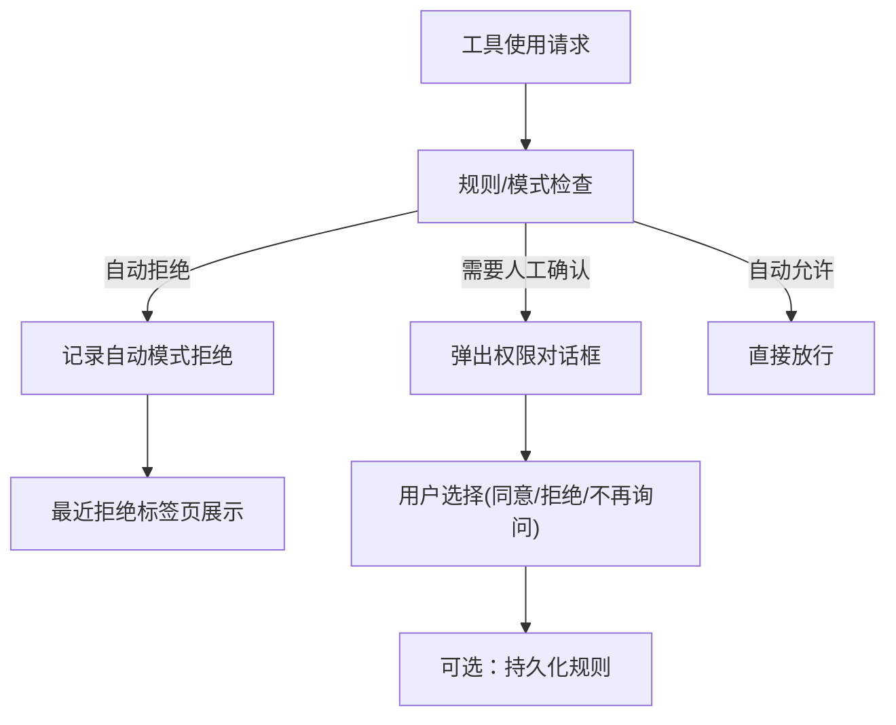
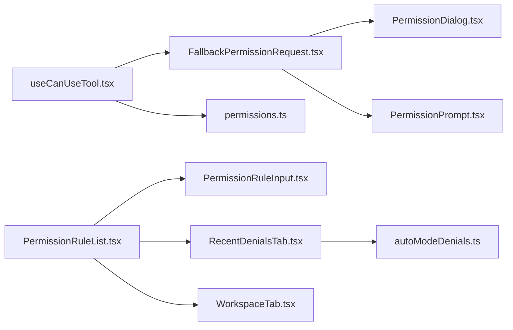

# 用户交互流程

<cite>
**本文引用的文件**
- [src/components/permissions/FallbackPermissionRequest.tsx](file://src/components/permissions/FallbackPermissionRequest.tsx)
- [src/components/permissions/PermissionDialog.tsx](file://src/components/permissions/PermissionDialog.tsx)
- [src/components/permissions/PermissionPrompt.tsx](file://src/components/permissions/PermissionPrompt.tsx)
- [src/components/permissions/PermissionRuleList.tsx](file://src/components/permissions/rules/PermissionRuleList.tsx)
- [src/components/permissions/rules/PermissionRuleInput.tsx](file://src/components/permissions/rules/PermissionRuleInput.tsx)
- [src/components/permissions/rules/RecentDenialsTab.tsx](file://src/components/permissions/rules/RecentDenialsTab.tsx)
- [src/components/permissions/rules/WorkspaceTab.tsx](file://src/components/permissions/rules/WorkspaceTab.tsx)
- [src/hooks/useCanUseTool.tsx](file://src/hooks/useCanUseTool.tsx)
- [src/hooks/useDirectConnect.ts](file://src/hooks/useDirectConnect.ts)
- [src/hooks/useInboxPoller.ts](file://src/hooks/useInboxPoller.ts)
- [src/hooks/useSwarmPermissionPoller.ts](file://src/hooks/useSwarmPermissionPoller.ts)
- [src/utils/autoModeDenials.ts](file://src/utils/autoModeDenials.ts)
- [src/main.tsx](file://src/main.tsx)
- [src/types/permissions.ts](file://src/types/permissions.ts)
</cite>

## 目录
1. [简介](#简介)
2. [项目结构](#项目结构)
3. [核心组件](#核心组件)
4. [架构总览](#架构总览)
5. [详细组件分析](#详细组件分析)
6. [依赖关系分析](#依赖关系分析)
7. [性能考虑](#性能考虑)
8. [故障排查指南](#故障排查指南)
9. [结论](#结论)
10. [附录](#附录)

## 简介
本文件围绕“权限用户交互流程”进行系统化梳理，重点覆盖以下方面：
- 权限请求对话框的设计与实现：组件架构、界面布局与交互逻辑
- 用户确认机制：同意/拒绝流程、反馈收集、持久化规则
- 权限历史与审计：最近拒绝记录、自动模式拒绝追踪、权限使用统计入口
- 自动模式策略与通知：自动决策、用户提示与模式切换
- 上下文感知与智能建议：基于规则与分类器的决策
- 用户体验与无障碍：键位绑定、焦点管理、可读性设计
- 测试与评估：行为验证、指标采集与回归保障

## 项目结构
权限交互相关代码主要分布在以下模块：
- 组件层：权限对话框、权限提示、规则列表与编辑
- 钩子层：工具使用前的权限检查、远程/团队模式下的权限轮询
- 工具与类型：权限结果定义、自动模式拒绝记录
- 入口层：应用启动时的权限模式通知与广度权限警告

**图表来源**
- [src/components/permissions/FallbackPermissionRequest.tsx:16-333](file://src/components/permissions/FallbackPermissionRequest.tsx#L16-L333)
- [src/components/permissions/PermissionDialog.tsx](file://src/components/permissions/PermissionDialog.tsx)
- [src/components/permissions/PermissionPrompt.tsx](file://src/components/permissions/PermissionPrompt.tsx)
- [src/components/permissions/rules/PermissionRuleList.tsx:464-800](file://src/components/permissions/rules/PermissionRuleList.tsx#L464-L800)
- [src/components/permissions/rules/PermissionRuleInput.tsx:1-138](file://src/components/permissions/rules/PermissionRuleInput.tsx#L1-L138)
- [src/components/permissions/rules/RecentDenialsTab.tsx:1-207](file://src/components/permissions/rules/RecentDenialsTab.tsx#L1-L207)
- [src/components/permissions/rules/WorkspaceTab.tsx:1-150](file://src/components/permissions/rules/WorkspaceTab.tsx#L1-L150)
- [src/hooks/useCanUseTool.tsx:62-126](file://src/hooks/useCanUseTool.tsx#L62-L126)
- [src/hooks/useDirectConnect.ts:114-148](file://src/hooks/useDirectConnect.ts#L114-L148)
- [src/hooks/useInboxPoller.ts:296-337](file://src/hooks/useInboxPoller.ts#L296-L337)
- [src/hooks/useSwarmPermissionPoller.ts:247-298](file://src/hooks/useSwarmPermissionPoller.ts#L247-L298)
- [src/utils/autoModeDenials.ts:1-27](file://src/utils/autoModeDenials.ts#L1-L27)
- [src/main.tsx:2870-2905](file://src/main.tsx#L2870-L2905)
- [src/types/permissions.ts:212-257](file://src/types/permissions.ts#L212-L257)

**章节来源**
- [src/components/permissions/FallbackPermissionRequest.tsx:16-333](file://src/components/permissions/FallbackPermissionRequest.tsx#L16-L333)
- [src/components/permissions/rules/PermissionRuleList.tsx:464-800](file://src/components/permissions/rules/PermissionRuleList.tsx#L464-L800)
- [src/hooks/useCanUseTool.tsx:62-126](file://src/hooks/useCanUseTool.tsx#L62-L126)
- [src/utils/autoModeDenials.ts:1-27](file://src/utils/autoModeDenials.ts#L1-L27)
- [src/main.tsx:2870-2905](file://src/main.tsx#L2870-L2905)

## 核心组件
- 权限对话框与提示
  - PermissionDialog：统一的对话框容器，承载标题与内容区域
  - PermissionPrompt：选项选择与取消回调，支持工具分析上下文
  - FallbackPermissionRequest：通用权限请求组件，负责选项生成、日志与规则持久化
- 规则管理
  - PermissionRuleList：规则总览与分页选择，支持添加/删除规则、工作区目录管理
  - PermissionRuleInput：规则输入与校验，支持工具名与限定符
  - RecentDenialsTab：展示自动模式最近拒绝项，支持批准与重试标记
  - WorkspaceTab：工作区目录增删与当前目录标注
- 权限钩子
  - useCanUseTool：权限决策主流程（允许/询问/拒绝），支持自动模式与分类器
  - useDirectConnect：远程/直接连接场景下的权限响应
  - useInboxPoller：团队模式下通过邮箱通道接收权限决策
  - useSwarmPermissionPoller：工作进程轮询权限响应
- 类型与工具
  - permissions.ts：权限决策类型定义（允许/询问/拒绝/透传）
  - autoModeDenials.ts：自动模式拒绝记录的存取

**章节来源**
- [src/components/permissions/PermissionDialog.tsx](file://src/components/permissions/PermissionDialog.tsx)
- [src/components/permissions/PermissionPrompt.tsx](file://src/components/permissions/PermissionPrompt.tsx)
- [src/components/permissions/FallbackPermissionRequest.tsx:16-333](file://src/components/permissions/FallbackPermissionRequest.tsx#L16-L333)
- [src/components/permissions/rules/PermissionRuleList.tsx:464-800](file://src/components/permissions/rules/PermissionRuleList.tsx#L464-L800)
- [src/components/permissions/rules/PermissionRuleInput.tsx:1-138](file://src/components/permissions/rules/PermissionRuleInput.tsx#L1-L138)
- [src/components/permissions/rules/RecentDenialsTab.tsx:1-207](file://src/components/permissions/rules/RecentDenialsTab.tsx#L1-L207)
- [src/components/permissions/rules/WorkspaceTab.tsx:1-150](file://src/components/permissions/rules/WorkspaceTab.tsx#L1-L150)
- [src/hooks/useCanUseTool.tsx:62-126](file://src/hooks/useCanUseTool.tsx#L62-L126)
- [src/hooks/useDirectConnect.ts:114-148](file://src/hooks/useDirectConnect.ts#L114-L148)
- [src/hooks/useInboxPoller.ts:296-337](file://src/hooks/useInboxPoller.ts#L296-L337)
- [src/hooks/useSwarmPermissionPoller.ts:247-298](file://src/hooks/useSwarmPermissionPoller.ts#L247-L298)
- [src/types/permissions.ts:212-257](file://src/types/permissions.ts#L212-L257)
- [src/utils/autoModeDenials.ts:1-27](file://src/utils/autoModeDenials.ts#L1-L27)

## 架构总览
权限交互从“工具使用请求”开始，经由权限钩子进行决策，必要时弹出权限对话框，最终写入规则或返回决策。

**图表来源**
- [src/hooks/useCanUseTool.tsx:62-126](file://src/hooks/useCanUseTool.tsx#L62-L126)
- [src/components/permissions/FallbackPermissionRequest.tsx:16-333](file://src/components/permissions/FallbackPermissionRequest.tsx#L16-L333)
- [src/hooks/useDirectConnect.ts:114-148](file://src/hooks/useDirectConnect.ts#L114-L148)
- [src/hooks/useInboxPoller.ts:296-337](file://src/hooks/useInboxPoller.ts#L296-L337)
- [src/hooks/useSwarmPermissionPoller.ts:247-298](file://src/hooks/useSwarmPermissionPoller.ts#L247-L298)

## 详细组件分析

### 权限对话框与提示组件
- PermissionDialog：提供统一的标题与内容区域，承载权限说明与选项
- PermissionPrompt：根据工具与上下文渲染选项，支持“不再询问”等增强选项
- FallbackPermissionRequest：整合工具名称、描述、规则解释与分析上下文，处理同意/拒绝与规则持久化

**图表来源**
- [src/components/permissions/PermissionDialog.tsx](file://src/components/permissions/PermissionDialog.tsx)
- [src/components/permissions/PermissionPrompt.tsx](file://src/components/permissions/PermissionPrompt.tsx)
- [src/components/permissions/FallbackPermissionRequest.tsx:16-333](file://src/components/permissions/FallbackPermissionRequest.tsx#L16-L333)

**章节来源**
- [src/components/permissions/PermissionDialog.tsx](file://src/components/permissions/PermissionDialog.tsx)
- [src/components/permissions/PermissionPrompt.tsx](file://src/components/permissions/PermissionPrompt.tsx)
- [src/components/permissions/FallbackPermissionRequest.tsx:16-333](file://src/components/permissions/FallbackPermissionRequest.tsx#L16-L333)

### 规则管理组件
- PermissionRuleList：规则总览、搜索、分页选择；支持添加/删除规则、工作区目录管理
- PermissionRuleInput：规则输入与校验，支持工具名与限定符
- RecentDenialsTab：展示自动模式最近拒绝项，支持批准与重试标记
- WorkspaceTab：工作区目录增删与当前目录标注

**图表来源**
- [src/components/permissions/rules/PermissionRuleList.tsx:464-800](file://src/components/permissions/rules/PermissionRuleList.tsx#L464-L800)
- [src/components/permissions/rules/PermissionRuleInput.tsx:1-138](file://src/components/permissions/rules/PermissionRuleInput.tsx#L1-L138)
- [src/components/permissions/rules/RecentDenialsTab.tsx:1-207](file://src/components/permissions/rules/RecentDenialsTab.tsx#L1-L207)
- [src/components/permissions/rules/WorkspaceTab.tsx:1-150](file://src/components/permissions/rules/WorkspaceTab.tsx#L1-L150)

**章节来源**
- [src/components/permissions/rules/PermissionRuleList.tsx:464-800](file://src/components/permissions/rules/PermissionRuleList.tsx#L464-L800)
- [src/components/permissions/rules/PermissionRuleInput.tsx:1-138](file://src/components/permissions/rules/PermissionRuleInput.tsx#L1-L138)
- [src/components/permissions/rules/RecentDenialsTab.tsx:1-207](file://src/components/permissions/rules/RecentDenialsTab.tsx#L1-L207)
- [src/components/permissions/rules/WorkspaceTab.tsx:1-150](file://src/components/permissions/rules/WorkspaceTab.tsx#L1-L150)

### 权限决策与交互流程
- useCanUseTool：权限决策主流程，支持自动模式与分类器，必要时弹出权限请求
- useDirectConnect：远程/直接连接场景下的权限响应
- useInboxPoller：团队模式下通过邮箱通道接收权限决策
- useSwarmPermissionPoller：工作进程轮询权限响应

**图表来源**
- [src/hooks/useCanUseTool.tsx:62-126](file://src/hooks/useCanUseTool.tsx#L62-L126)
- [src/components/permissions/FallbackPermissionRequest.tsx:16-333](file://src/components/permissions/FallbackPermissionRequest.tsx#L16-L333)
- [src/hooks/useDirectConnect.ts:114-148](file://src/hooks/useDirectConnect.ts#L114-L148)
- [src/hooks/useInboxPoller.ts:296-337](file://src/hooks/useInboxPoller.ts#L296-L337)
- [src/hooks/useSwarmPermissionPoller.ts:247-298](file://src/hooks/useSwarmPermissionPoller.ts#L247-L298)

**章节来源**
- [src/hooks/useCanUseTool.tsx:62-126](file://src/hooks/useCanUseTool.tsx#L62-L126)
- [src/hooks/useDirectConnect.ts:114-148](file://src/hooks/useDirectConnect.ts#L114-L148)
- [src/hooks/useInboxPoller.ts:296-337](file://src/hooks/useInboxPoller.ts#L296-L337)
- [src/hooks/useSwarmPermissionPoller.ts:247-298](file://src/hooks/useSwarmPermissionPoller.ts#L247-L298)

### 自动模式与智能建议
- 自动模式拒绝记录：记录最近被自动模式拒绝的命令，供“最近拒绝”标签页展示
- 分类器与等待：在某些场景下，权限请求可能异步等待分类器决策，期间可显示“待分类器检查”
- 模式切换通知：应用启动时根据权限模式生成高优先级通知

**图表来源**
- [src/utils/autoModeDenials.ts:1-27](file://src/utils/autoModeDenials.ts#L1-L27)
- [src/components/permissions/rules/RecentDenialsTab.tsx:1-207](file://src/components/permissions/rules/RecentDenialsTab.tsx#L1-L207)
- [src/hooks/useCanUseTool.tsx:62-126](file://src/hooks/useCanUseTool.tsx#L62-L126)
- [src/main.tsx:2870-2905](file://src/main.tsx#L2870-L2905)

**章节来源**
- [src/utils/autoModeDenials.ts:1-27](file://src/utils/autoModeDenials.ts#L1-L27)
- [src/components/permissions/rules/RecentDenialsTab.tsx:1-207](file://src/components/permissions/rules/RecentDenialsTab.tsx#L1-L207)
- [src/hooks/useCanUseTool.tsx:62-126](file://src/hooks/useCanUseTool.tsx#L62-L126)
- [src/main.tsx:2870-2905](file://src/main.tsx#L2870-L2905)

## 依赖关系分析
- 组件间依赖
  - FallbackPermissionRequest 依赖 PermissionDialog 与 PermissionPrompt
  - PermissionRuleList 依赖 PermissionRuleInput、RecentDenialsTab、WorkspaceTab
- 钩子与组件协作
  - useCanUseTool 决策后驱动 FallbackPermissionRequest 弹窗
  - useDirectConnect/useInboxPoller/useSwarmPermissionPoller 在远程/团队/工作进程场景中回传决策
- 类型与工具
  - permissions.ts 定义权限决策类型，贯穿钩子与组件
  - autoModeDenials.ts 提供自动模式拒绝记录的存取

**图表来源**
- [src/hooks/useCanUseTool.tsx:62-126](file://src/hooks/useCanUseTool.tsx#L62-L126)
- [src/components/permissions/FallbackPermissionRequest.tsx:16-333](file://src/components/permissions/FallbackPermissionRequest.tsx#L16-L333)
- [src/components/permissions/PermissionDialog.tsx](file://src/components/permissions/PermissionDialog.tsx)
- [src/components/permissions/PermissionPrompt.tsx](file://src/components/permissions/PermissionPrompt.tsx)
- [src/components/permissions/rules/PermissionRuleList.tsx:464-800](file://src/components/permissions/rules/PermissionRuleList.tsx#L464-L800)
- [src/components/permissions/rules/PermissionRuleInput.tsx:1-138](file://src/components/permissions/rules/PermissionRuleInput.tsx#L1-L138)
- [src/components/permissions/rules/RecentDenialsTab.tsx:1-207](file://src/components/permissions/rules/RecentDenialsTab.tsx#L1-L207)
- [src/components/permissions/rules/WorkspaceTab.tsx:1-150](file://src/components/permissions/rules/WorkspaceTab.tsx#L1-L150)
- [src/types/permissions.ts:212-257](file://src/types/permissions.ts#L212-L257)
- [src/utils/autoModeDenials.ts:1-27](file://src/utils/autoModeDenials.ts#L1-L27)

**章节来源**
- [src/hooks/useCanUseTool.tsx:62-126](file://src/hooks/useCanUseTool.tsx#L62-L126)
- [src/components/permissions/FallbackPermissionRequest.tsx:16-333](file://src/components/permissions/FallbackPermissionRequest.tsx#L16-L333)
- [src/components/permissions/rules/PermissionRuleList.tsx:464-800](file://src/components/permissions/rules/PermissionRuleList.tsx#L464-L800)
- [src/types/permissions.ts:212-257](file://src/types/permissions.ts#L212-L257)
- [src/utils/autoModeDenials.ts:1-27](file://src/utils/autoModeDenials.ts#L1-L27)

## 性能考虑
- 选择器与渲染优化
  - 使用 memo 缓存计算结果，减少不必要的重渲染
  - Select 组件限制可见选项数量，避免长列表造成卡顿
- 聚合与批处理
  - 规则添加支持批量提交，减少多次写入
  - 自动模式拒绝记录限制数量，避免无限增长
- I/O 与网络
  - 远程/团队模式采用轮询策略，避免阻塞主线程
  - 建议在高负载场景下适当增加轮询间隔

[本节为通用指导，无需特定文件引用]

## 故障排查指南
- 对话框无响应
  - 检查键盘绑定与焦点状态，确保可输入/可选择
  - 确认 onDone/onReject 回调是否正确传递
- 远程/团队决策不生效
  - 核对轮询钩子是否启用，响应文件是否存在
  - 检查消息格式与解析逻辑
- 自动模式拒绝未显示
  - 确认 TRANSCRIPT_CLASSIFIER 功能开关开启
  - 检查记录函数是否被调用

**章节来源**
- [src/hooks/useSwarmPermissionPoller.ts:247-298](file://src/hooks/useSwarmPermissionPoller.ts#L247-L298)
- [src/hooks/useInboxPoller.ts:296-337](file://src/hooks/useInboxPoller.ts#L296-L337)
- [src/utils/autoModeDenials.ts:1-27](file://src/utils/autoModeDenials.ts#L1-L27)

## 结论
该权限交互体系以“规则+模式+对话框”为核心，结合自动模式与分类器实现智能化决策，并通过统一的对话框与规则管理界面提升用户体验。远程/团队场景通过钩子与轮询保障一致性，同时提供历史记录与审计能力。建议在实际部署中关注性能与可维护性，持续完善自动化与可视化能力。

[本节为总结性内容，无需特定文件引用]

## 附录
- 用户体验最佳实践
  - 明确的选项文案与反馈路径
  - 键盘快捷键与无障碍支持
  - 一致的通知与高优提示
- 测试方法与评估指标
  - 行为测试：覆盖同意/拒绝/不再询问/超时等分支
  - 指标采集：权限请求次数、自动拒绝率、用户重试率、平均等待时间
  - 回归保障：规则持久化、远程/团队模式一致性、历史记录准确性

[本节为通用指导，无需特定文件引用]