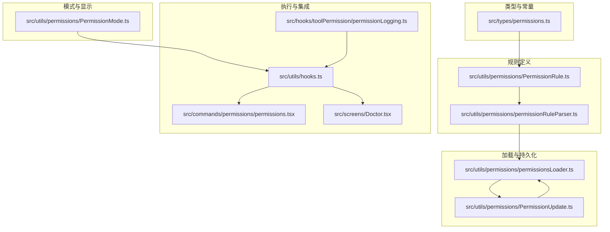
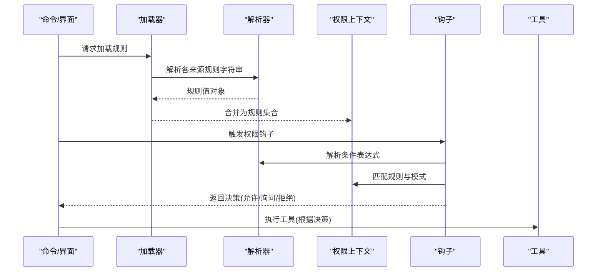
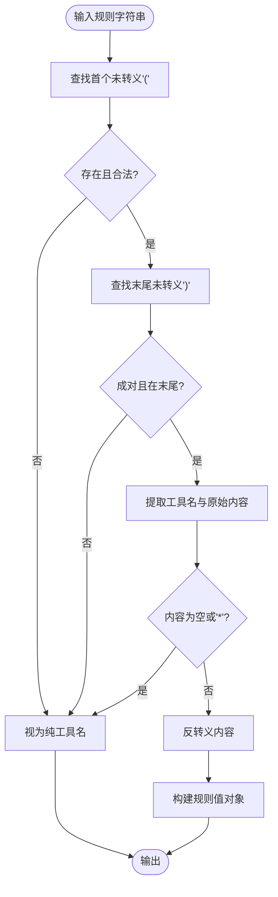
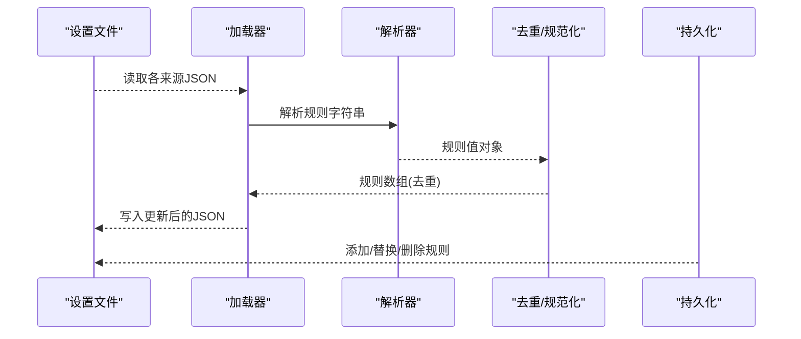
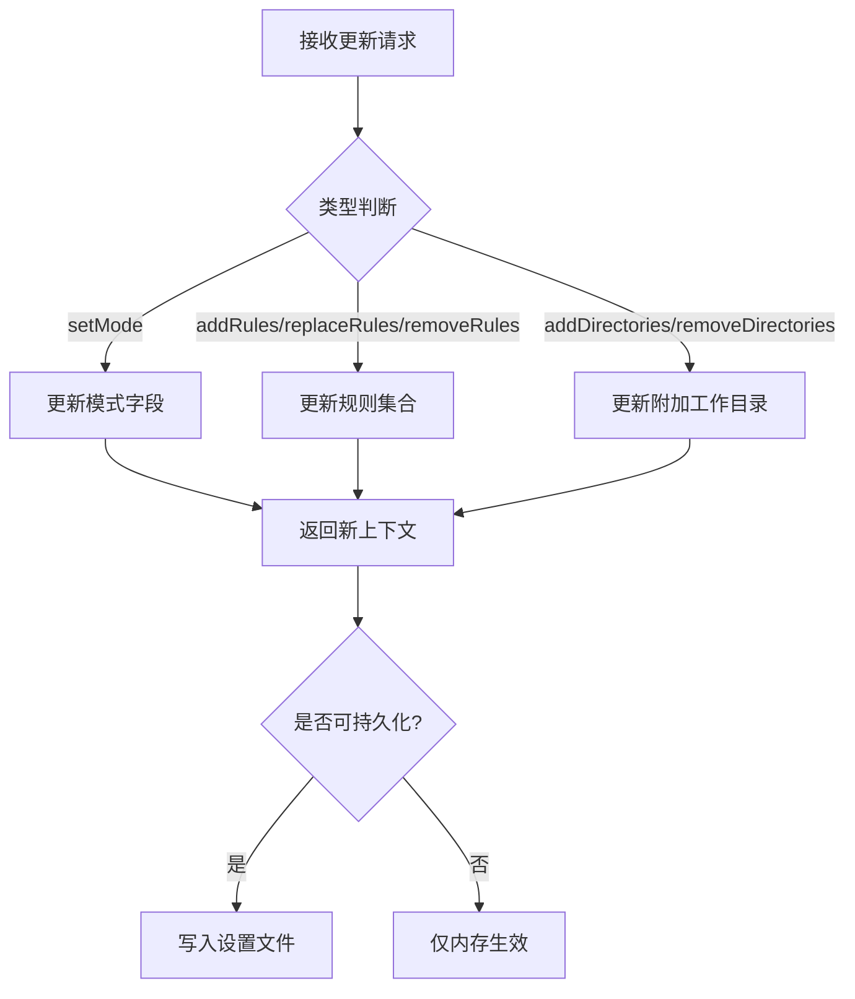
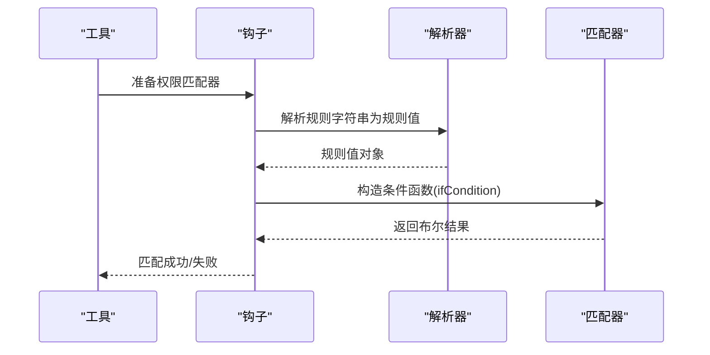
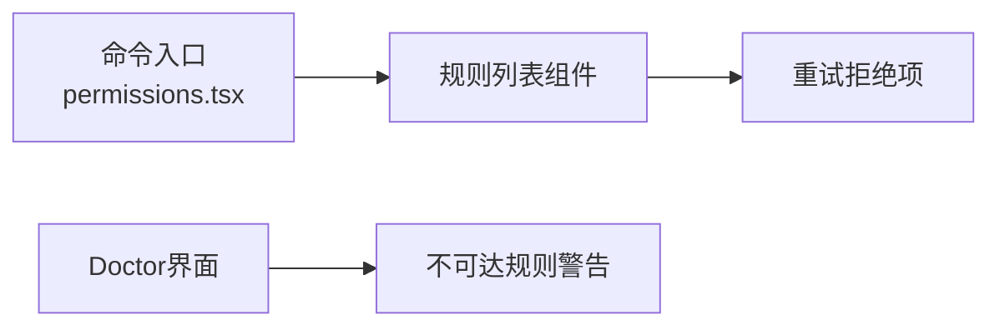
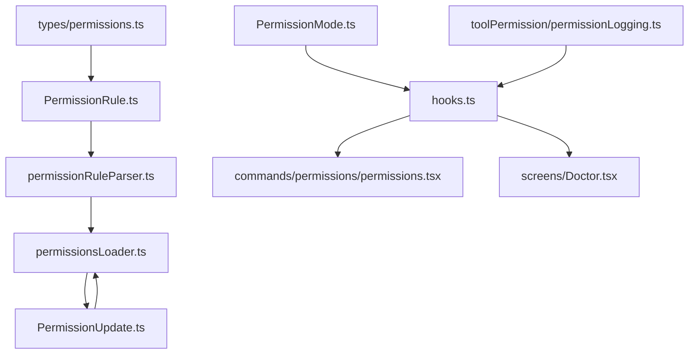

# 规则引擎

<cite>
**本文引用的文件**
- [src\types\permissions.ts](file://src\types\permissions.ts)
- [src\utils\permissions\PermissionRule.ts](file://src\utils\permissions\PermissionRule.ts)
- [src\utils\permissions\permissionRuleParser.ts](file://src\utils\permissions\permissionRuleParser.ts)
- [src\utils\permissions\permissionsLoader.ts](file://src\utils\permissions\permissionsLoader.ts)
- [src\utils\permissions\PermissionUpdate.ts](file://src\utils\permissions\PermissionUpdate.ts)
- [src\utils\permissions\PermissionMode.ts](file://src\utils\permissions\PermissionMode.ts)
- [src\utils\hooks.ts](file://src\utils\hooks.ts)
- [src\commands\permissions\permissions.tsx](file://src\commands\permissions\permissions.tsx)
- [src\screens\Doctor.tsx](file://src\screens\Doctor.tsx)
- [src\hooks\toolPermission\permissionLogging.ts](file://src\hooks\toolPermission\permissionLogging.ts)
</cite>

## 目录
1. [简介](#简介)
2. [项目结构](#项目结构)
3. [核心组件](#核心组件)
4. [架构总览](#架构总览)
5. [详细组件分析](#详细组件分析)
6. [依赖分析](#依赖分析)
7. [性能考虑](#性能考虑)
8. [故障排查指南](#故障排查指南)
9. [结论](#结论)
10. [附录：规则编写最佳实践与常见陷阱](#附录规则编写最佳实践与常见陷阱)

## 简介
本文件系统性地梳理并解释权限规则引擎的设计与实现，覆盖规则定义语法、解析器、持久化与加载、执行上下文与决策流程、模式与行为、冲突检测与优先级、动态加载与热更新、与权限检查系统的集成方式，并提供调试与测试建议。目标是帮助开发者在不深入源码的前提下，理解并正确使用该规则引擎。

## 项目结构
权限规则引擎相关代码主要分布在以下位置：
- 类型定义与常量：src/types/permissions.ts
- 规则值与行为定义：src/utils/permissions/PermissionRule.ts
- 规则解析与序列化：src/utils/permissions/permissionRuleParser.ts
- 规则加载与持久化：src/utils/permissions/permissionsLoader.ts
- 权限更新与应用：src/utils/permissions/PermissionUpdate.ts
- 模式与显示配置：src/utils/permissions/PermissionMode.ts
- 钩子与规则匹配：src/utils/hooks.ts
- UI入口与提示：src/commands/permissions/permissions.tsx、src/screens/Doctor.tsx
- 日志与审计：src/hooks/toolPermission/permissionLogging.ts



**图表来源**
- [src\types\permissions.ts:1-442](file://src\types\permissions.ts#L1-L442)
- [src\utils\permissions\PermissionRule.ts:1-41](file://src\utils\permissions\PermissionRule.ts#L1-L41)
- [src\utils\permissions\permissionRuleParser.ts:1-199](file://src\utils\permissions\permissionRuleParser.ts#L1-L199)
- [src\utils\permissions\permissionsLoader.ts:1-297](file://src\utils\permissions\permissionsLoader.ts#L1-L297)
- [src\utils\permissions\PermissionUpdate.ts:1-390](file://src\utils\permissions\PermissionUpdate.ts#L1-L390)
- [src\utils\permissions\PermissionMode.ts:1-142](file://src\utils\permissions\PermissionMode.ts#L1-L142)
- [src\utils\hooks.ts:1394-1440](file://src\utils\hooks.ts#L1394-L1440)
- [src\commands\permissions\permissions.tsx:1-9](file://src\commands\permissions\permissions.tsx#L1-L9)
- [src\screens\Doctor.tsx:459-473](file://src\screens\Doctor.tsx#L459-L473)
- [src\hooks\toolPermission\permissionLogging.ts](file://src\hooks\toolPermission\permissionLogging.ts)

**章节来源**
- [src\types\permissions.ts:1-442](file://src\types\permissions.ts#L1-L442)
- [src\utils\permissions\PermissionRule.ts:1-41](file://src\utils\permissions\PermissionRule.ts#L1-L41)
- [src\utils\permissions\permissionRuleParser.ts:1-199](file://src\utils\permissions\permissionRuleParser.ts#L1-L199)
- [src\utils\permissions\permissionsLoader.ts:1-297](file://src\utils\permissions\permissionsLoader.ts#L1-L297)
- [src\utils\permissions\PermissionUpdate.ts:1-390](file://src\utils\permissions\PermissionUpdate.ts#L1-L390)
- [src\utils\permissions\PermissionMode.ts:1-142](file://src\utils\permissions\PermissionMode.ts#L1-L142)
- [src\utils\hooks.ts:1394-1440](file://src\utils\hooks.ts#L1394-L1440)
- [src\commands\permissions\permissions.tsx:1-9](file://src\commands\permissions\permissions.tsx#L1-L9)
- [src\screens\Doctor.tsx:459-473](file://src\screens\Doctor.tsx#L459-L473)
- [src\hooks\toolPermission\permissionLogging.ts](file://src\hooks\toolPermission\permissionLogging.ts)

## 核心组件
- 规则值与行为
  - 规则值由工具名与可选内容组成；行为分为允许、拒绝、询问三类。
- 解析器
  - 支持“工具名(内容)”格式，对括号与反斜杠进行转义/反转义，保证内容安全存储与解析。
- 加载器
  - 从多来源设置中加载规则，支持策略限制仅使用受管规则。
- 更新器
  - 将规则更新应用到运行时上下文，并持久化到可编辑设置源。
- 模式
  - 定义默认、计划、接受编辑、绕过权限、禁止询问、自动等模式及其外部映射与显示配置。
- 执行与钩子
  - 工具在执行前通过钩子准备匹配器，结合规则值进行条件判断。

**章节来源**
- [src\types\permissions.ts:44-132](file://src\types\permissions.ts#L44-L132)
- [src\utils\permissions\PermissionRule.ts:19-41](file://src\utils\permissions\PermissionRule.ts#L19-L41)
- [src\utils\permissions\permissionRuleParser.ts:82-152](file://src\utils\permissions\permissionRuleParser.ts#L82-L152)
- [src\utils\permissions\permissionsLoader.ts:116-145](file://src\utils\permissions\permissionsLoader.ts#L116-L145)
- [src\utils\permissions\PermissionUpdate.ts:55-206](file://src\utils\permissions\PermissionUpdate.ts#L55-L206)
- [src\utils\permissions\PermissionMode.ts:21-142](file://src\utils\permissions\PermissionMode.ts#L21-L142)
- [src\utils\hooks.ts:1394-1420](file://src\utils\hooks.ts#L1394-L1420)

## 架构总览
规则引擎围绕“规则值→解析→加载→上下文→钩子匹配→决策”展开，支持多来源规则合并、模式驱动的快速通道、以及持久化更新。



**图表来源**
- [src\utils\permissions\permissionsLoader.ts:120-133](file://src\utils\permissions\permissionsLoader.ts#L120-L133)
- [src\utils\permissions\permissionRuleParser.ts:93-133](file://src\utils\permissions\permissionRuleParser.ts#L93-L133)
- [src\utils\hooks.ts:1394-1420](file://src\utils\hooks.ts#L1394-L1420)

## 详细组件分析

### 组件A：规则值与行为（类型层）
- 规则值包含工具名与可选内容；行为枚举为允许、拒绝、询问。
- 通过延迟模式的Zod Schema确保类型安全与运行时校验。

```mermaid
classDiagram
class PermissionRuleValue {
+string toolName
+string ruleContent
}
class PermissionBehavior {
<<enum>>
"allow"
"deny"
"ask"
}
class PermissionRule {
+PermissionRuleSource source
+PermissionBehavior ruleBehavior
+PermissionRuleValue ruleValue
}
PermissionRule --> PermissionRuleValue : "包含"
PermissionRule --> PermissionBehavior : "使用"
```

**图表来源**
- [src\types\permissions.ts:67-79](file://src\types\permissions.ts#L67-L79)
- [src\types\permissions.ts:44-44](file://src\types\permissions.ts#L44-L44)
- [src\utils\permissions\PermissionRule.ts:35-40](file://src\utils\permissions\PermissionRule.ts#L35-L40)

**章节来源**
- [src\types\permissions.ts:44-79](file://src\types\permissions.ts#L44-L79)
- [src\utils\permissions\PermissionRule.ts:19-41](file://src\utils\permissions\PermissionRule.ts#L19-L41)

### 组件B：规则解析器（语法与转义）
- 语法：工具名或“工具名(内容)”；内容可包含被转义的括号与反斜杠。
- 转义顺序与反转义顺序严格对应，避免歧义。
- 支持遗留工具名别名规范化，保证历史规则兼容。



**图表来源**
- [src\utils\permissions\permissionRuleParser.ts:93-133](file://src\utils\permissions\permissionRuleParser.ts#L93-L133)
- [src\utils\permissions\permissionRuleParser.ts:158-198](file://src\utils\permissions\permissionRuleParser.ts#L158-L198)

**章节来源**
- [src\utils\permissions\permissionRuleParser.ts:44-79](file://src\utils\permissions\permissionRuleParser.ts#L44-L79)
- [src\utils\permissions\permissionRuleParser.ts:82-152](file://src\utils\permissions\permissionRuleParser.ts#L82-L152)

### 组件C：规则加载与持久化
- 多来源加载：按启用顺序聚合规则；策略模式下仅使用受管规则。
- 去重与规范化：通过解析→序列化往返消除遗留名称差异。
- 持久化：支持添加、替换、删除规则与目录扩展；仅对可编辑来源生效。



**图表来源**
- [src\utils\permissions\permissionsLoader.ts:120-145](file://src\utils\permissions\permissionsLoader.ts#L120-L145)
- [src\utils\permissions\permissionsLoader.ts:229-296](file://src\utils\permissions\permissionsLoader.ts#L229-L296)
- [src\utils\permissions\PermissionUpdate.ts:222-342](file://src\utils\permissions\PermissionUpdate.ts#L222-L342)

**章节来源**
- [src\utils\permissions\permissionsLoader.ts:27-44](file://src\utils\permissions\permissionsLoader.ts#L27-L44)
- [src\utils\permissions\permissionsLoader.ts:116-145](file://src\utils\permissions\permissionsLoader.ts#L116-L145)
- [src\utils\permissions\permissionsLoader.ts:229-296](file://src\utils\permissions\permissionsLoader.ts#L229-L296)
- [src\utils\permissions\PermissionUpdate.ts:55-206](file://src\utils\permissions\PermissionUpdate.ts#L55-L206)

### 组件D：权限更新与应用
- 支持设置模式、增删改规则、增删工作目录。
- 应用到上下文后，影响后续钩子匹配与决策。
- 可选择性持久化到用户/项目/本地设置。



**图表来源**
- [src\utils\permissions\PermissionUpdate.ts:55-206](file://src\utils\permissions\PermissionUpdate.ts#L55-L206)
- [src\utils\permissions\PermissionUpdate.ts:222-342](file://src\utils\permissions\PermissionUpdate.ts#L222-L342)

**章节来源**
- [src\utils\permissions\PermissionUpdate.ts:30-47](file://src\utils\permissions\PermissionUpdate.ts#L30-L47)
- [src\utils\permissions\PermissionUpdate.ts:55-206](file://src\utils\permissions\PermissionUpdate.ts#L55-L206)
- [src\utils\permissions\PermissionUpdate.ts:222-342](file://src\utils\permissions\PermissionUpdate.ts#L222-L342)

### 组件E：模式与显示
- 模式枚举与外部映射，提供标题、符号、颜色等显示信息。
- 自动模式在特定特性开启时可用，外部用户不可见。

```mermaid
classDiagram
class PermissionMode {
<<enum>>
"default"
"plan"
"acceptEdits"
"bypassPermissions"
"dontAsk"
"auto"
}
class PermissionModeConfig {
+string title
+string shortTitle
+string symbol
+string color
+ExternalPermissionMode external
}
PermissionModeConfig <-- PermissionMode : "配置映射"
```

**图表来源**
- [src\utils\permissions\PermissionMode.ts:21-142](file://src\utils\permissions\PermissionMode.ts#L21-L142)
- [src\types\permissions.ts:16-38](file://src\types\permissions.ts#L16-L38)

**章节来源**
- [src\utils\permissions\PermissionMode.ts:21-142](file://src\utils\permissions\PermissionMode.ts#L21-L142)
- [src\types\permissions.ts:16-38](file://src\types\permissions.ts#L16-L38)

### 组件F：钩子与规则匹配
- 工具在执行前准备匹配器，基于规则值构造条件函数。
- 若工具未提供匹配器，则仅比较工具名；若规则无内容则视为通配。



**图表来源**
- [src\utils\hooks.ts:1394-1420](file://src\utils\hooks.ts#L1394-L1420)
- [src\utils\permissions\permissionRuleParser.ts:93-133](file://src\utils\permissions\permissionRuleParser.ts#L93-L133)

**章节来源**
- [src\utils\hooks.ts:1394-1420](file://src\utils\hooks.ts#L1394-L1420)

### 组件G：UI入口与提示
- 命令入口展示规则列表与重试逻辑。
- Doctor界面可提示不可达规则警告，辅助排查。



**图表来源**
- [src\commands\permissions\permissions.tsx:1-9](file://src\commands\permissions\permissions.tsx#L1-L9)
- [src\screens\Doctor.tsx:459-473](file://src\screens\Doctor.tsx#L459-L473)

**章节来源**
- [src\commands\permissions\permissions.tsx:1-9](file://src\commands\permissions\permissions.tsx#L1-L9)
- [src\screens\Doctor.tsx:459-473](file://src\screens\Doctor.tsx#L459-L473)

## 依赖分析
- 类型层依赖：类型定义集中于types/permissions.ts，避免循环依赖。
- 解析器依赖：依赖工具常量与特性开关，以支持条件加载。
- 加载器依赖：依赖设置源常量与设置读写模块。
- 更新器依赖：依赖设置读写与文件系统工具。
- 钩子依赖：依赖工具输入解析与规则值构造。



**图表来源**
- [src\types\permissions.ts:1-442](file://src\types\permissions.ts#L1-L442)
- [src\utils\permissions\PermissionRule.ts:1-41](file://src\utils\permissions\PermissionRule.ts#L1-L41)
- [src\utils\permissions\permissionRuleParser.ts:1-199](file://src\utils\permissions\permissionRuleParser.ts#L1-L199)
- [src\utils\permissions\permissionsLoader.ts:1-297](file://src\utils\permissions\permissionsLoader.ts#L1-L297)
- [src\utils\permissions\PermissionUpdate.ts:1-390](file://src\utils\permissions\PermissionUpdate.ts#L1-L390)
- [src\utils\permissions\PermissionMode.ts:1-142](file://src\utils\permissions\PermissionMode.ts#L1-L142)
- [src\utils\hooks.ts:1394-1440](file://src\utils\hooks.ts#L1394-L1440)
- [src\commands\permissions\permissions.tsx:1-9](file://src\commands\permissions\permissions.tsx#L1-L9)
- [src\screens\Doctor.tsx:459-473](file://src\screens\Doctor.tsx#L459-L473)
- [src\hooks\toolPermission\permissionLogging.ts](file://src\hooks\toolPermission\permissionLogging.ts)

**章节来源**
- [src\types\permissions.ts:1-442](file://src\types\permissions.ts#L1-L442)
- [src\utils\permissions\permissionRuleParser.ts:1-199](file://src\utils\permissions\permissionRuleParser.ts#L1-L199)
- [src\utils\permissions\permissionsLoader.ts:1-297](file://src\utils\permissions\permissionsLoader.ts#L1-L297)
- [src\utils\permissions\PermissionUpdate.ts:1-390](file://src\utils\permissions\PermissionUpdate.ts#L1-L390)
- [src\utils\permissions\PermissionMode.ts:1-142](file://src\utils\permissions\PermissionMode.ts#L1-L142)
- [src\utils\hooks.ts:1394-1440](file://src\utils\hooks.ts#L1394-L1440)
- [src\commands\permissions\permissions.tsx:1-9](file://src\commands\permissions\permissions.tsx#L1-L9)
- [src\screens\Doctor.tsx:459-473](file://src\screens\Doctor.tsx#L459-L473)
- [src\hooks\toolPermission\permissionLogging.ts](file://src\hooks\toolPermission\permissionLogging.ts)

## 性能考虑
- 解析与去重：解析→序列化往返用于规范化，注意在批量规则场景下的开销。
- 文件I/O：持久化写入应合并批处理，避免频繁落盘。
- 模式与钩子：模式切换与匹配器构造应尽量缓存，减少重复计算。
- 日志与诊断：调试日志在开发阶段开启，生产环境建议关闭或降级。

## 故障排查指南
- 不可达规则警告：Doctor界面会提示不可达规则，检查规则顺序与来源优先级。
- 规则冲突：同一工具的允许/拒绝/询问规则可能冲突，遵循“最后一条生效”的原则；建议通过UI或命令入口查看与调整。
- 模式异常：确认当前模式是否为外部可见模式，自动模式在外部用户不可见。
- 日志审计：通过权限日志模块记录决策原因与耗时，定位问题根因。

**章节来源**
- [src\screens\Doctor.tsx:459-473](file://src\screens\Doctor.tsx#L459-L473)
- [src\hooks\toolPermission\permissionLogging.ts](file://src\hooks\toolPermission\permissionLogging.ts)

## 结论
该规则引擎以清晰的类型定义、严谨的解析与持久化流程、灵活的模式与上下文设计，实现了可维护、可扩展、可观测的权限控制体系。通过钩子与工具的协作，规则得以在执行前精准匹配并生成决策，同时支持动态更新与热应用。

## 附录：规则编写最佳实践与常见陷阱
- 最佳实践
  - 使用“工具名(内容)”精确限定范围，避免通配导致过度授权。
  - 对包含括号的内容进行转义，确保解析正确。
  - 优先使用UI入口或命令进行规则管理，便于去重与持久化。
  - 合理利用模式（如禁止询问、绕过权限）仅在必要场景启用。
- 常见陷阱
  - 忽略转义导致内容被错误解析为规则语法。
  - 在策略限制下尝试向可编辑来源写入规则，会被忽略。
  - 遗留工具名未规范化，导致规则不生效。
  - 规则顺序不当造成冲突，应通过UI或命令入口核查与修正。