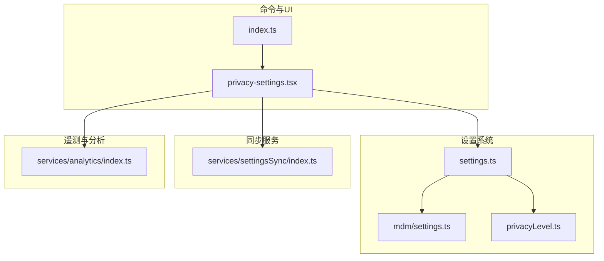
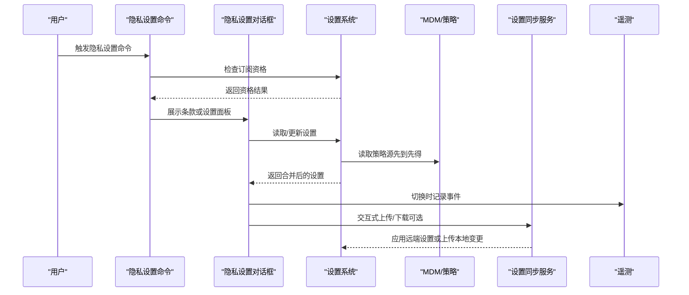
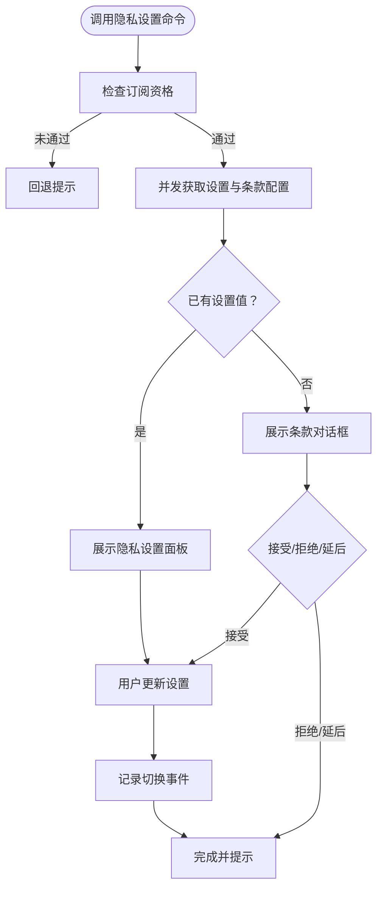
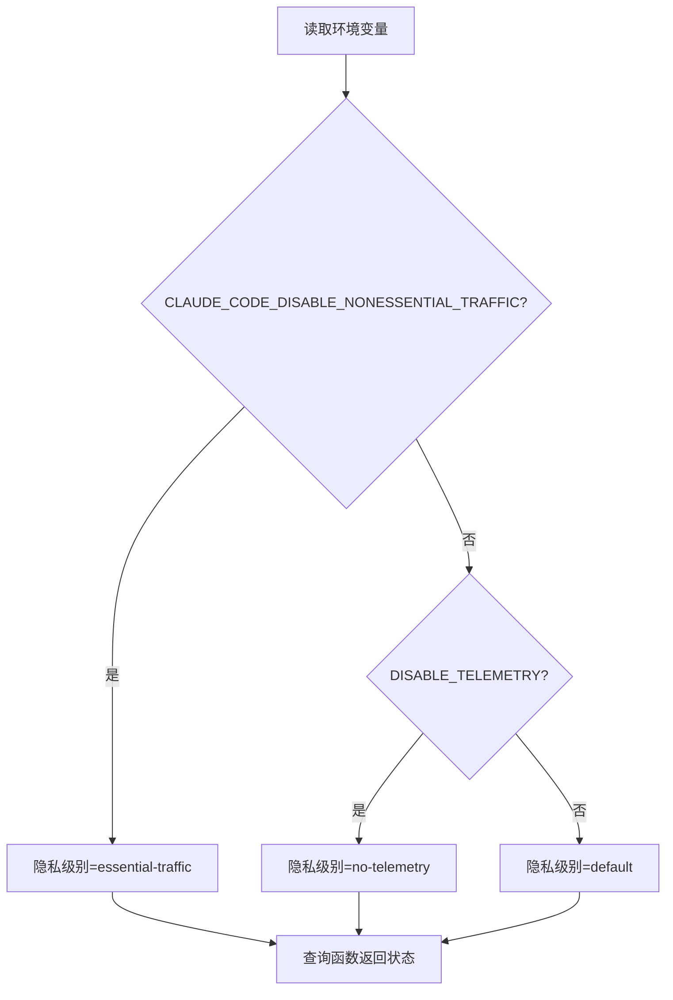
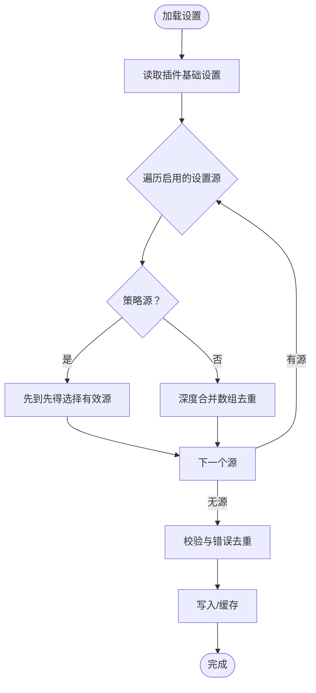
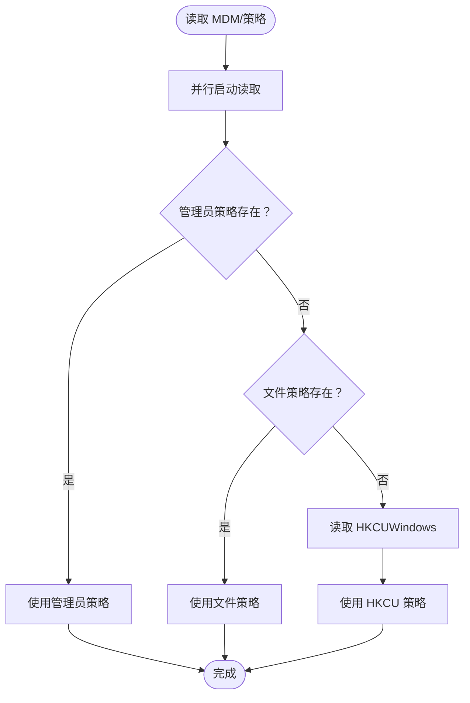
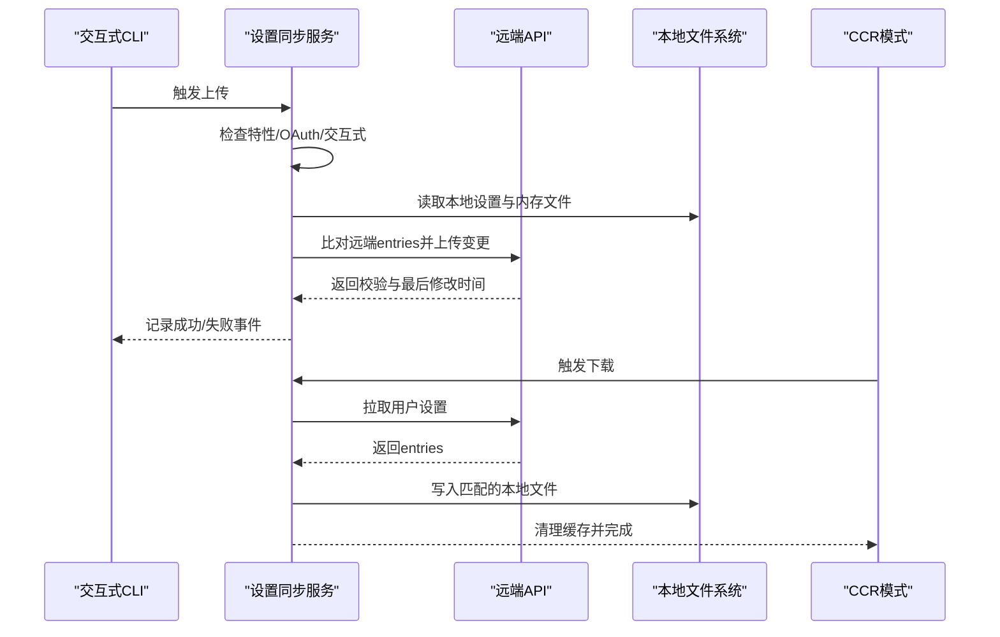
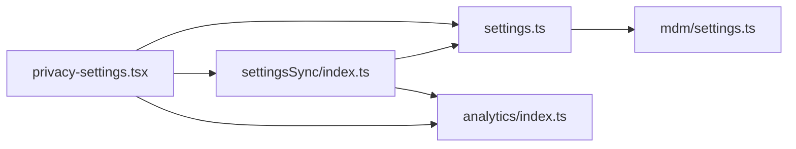

# 隐私设置管理

<cite>
**本文档引用的文件**
- [README.md](file://README.md)
- [01-遥测与隐私分析.md](file://docs/zh/01-遥测与隐私分析.md)
- [privacy-settings.tsx](file://src/commands/privacy-settings/privacy-settings.tsx)
- [index.ts](file://src/commands/privacy-settings/index.ts)
- [privacyLevel.ts](file://src/utils/privacyLevel.ts)
- [settings.ts](file://src/utils/settings/settings.ts)
- [mdm/settings.ts](file://src/utils/settings/mdm/settings.ts)
- [index.ts](file://src/services/settingsSync/index.ts)
- [index.ts](file://src/services/analytics/index.ts)
</cite>

## 目录
1. [简介](#简介)
2. [项目结构](#项目结构)
3. [核心组件](#核心组件)
4. [架构总览](#架构总览)
5. [详细组件分析](#详细组件分析)
6. [依赖关系分析](#依赖关系分析)
7. [性能考虑](#性能考虑)
8. [故障排除指南](#故障排除指南)
9. [结论](#结论)
10. [附录](#附录)

## 简介
本文件系统性梳理 Claude Code 的隐私设置管理架构与实现，涵盖设置分类、继承与冲突解决、用户隐私控制选项、跨设备同步、企业 MDM 策略、合规性与审计机制，并提供配置示例、最佳实践与 API 接口说明。文档基于仓库中的源码与文档进行技术归纳，帮助开发者与管理员理解并正确配置隐私策略。

## 项目结构
围绕隐私设置的关键模块分布如下：
- 命令入口与 UI：隐私设置命令与对话框组件
- 设置加载与合并：多源设置合并、缓存与校验
- MDM 与企业策略：Windows 注册表、macOS plist、文件型策略
- 设置同步：跨设备设置与内存文件同步
- 遥测与隐私级别：环境变量驱动的隐私级别控制

**图表来源**
- [privacy-settings.tsx:1-58](file://src/commands/privacy-settings/privacy-settings.tsx#L1-L58)
- [index.ts:1-15](file://src/commands/privacy-settings/index.ts#L1-L15)
- [settings.ts:638-800](file://src/utils/settings/settings.ts#L638-L800)
- [mdm/settings.ts:1-317](file://src/utils/settings/mdm/settings.ts#L1-L317)
- [privacyLevel.ts:1-56](file://src/utils/privacyLevel.ts#L1-L56)
- [index.ts:1-582](file://src/services/settingsSync/index.ts#L1-L582)
- [index.ts:1-200](file://src/services/analytics/index.ts#L1-L200)

**章节来源**
- [README.md:250-380](file://README.md#L250-L380)
- [01-遥测与隐私分析.md:1-110](file://docs/zh/01-遥测与隐私分析.md#L1-L110)

## 核心组件
- 隐私设置命令与 UI
  - 命令定义与启用条件：仅面向订阅用户开放
  - 对话框：首次访问展示条款，已接受则直接展示设置面板
  - 事件上报：切换“帮助改进 Claude”时记录埋点
- 隐私级别控制
  - 通过环境变量决定是否禁用遥测、是否仅允许必要网络流量
  - 提供查询函数以判断当前状态与原因
- 设置加载与合并
  - 多源优先级：插件基础 → 用户 → 项目 → 本地 → 策略（远程/MDM/文件/HKCU）
  - 策略源“先到先得”原则；其他源采用深度合并
  - 缓存与错误去重，支持增量写入与失效
- MDM 与企业策略
  - macOS：/Library/Managed Preferences/（管理员只读）
  - Windows：HKLM/HKCU（管理员优先）
  - 文件型策略：managed-settings.json + drop-in 目录
- 设置同步
  - 交互式 CLI：上传本地设置（增量）
  - CCR：下载远端设置到本地（按项目隔离）
  - OAuth 认证与重试、超时、大小限制

**章节来源**
- [privacy-settings.tsx:1-58](file://src/commands/privacy-settings/privacy-settings.tsx#L1-L58)
- [index.ts:1-15](file://src/commands/privacy-settings/index.ts#L1-L15)
- [privacyLevel.ts:1-56](file://src/utils/privacyLevel.ts#L1-L56)
- [settings.ts:638-800](file://src/utils/settings/settings.ts#L638-L800)
- [mdm/settings.ts:1-317](file://src/utils/settings/mdm/settings.ts#L1-L317)
- [index.ts:1-582](file://src/services/settingsSync/index.ts#L1-L582)

## 架构总览
隐私设置管理由“命令入口 → 设置加载 → 策略应用 → 同步与遥测”构成闭环。策略源遵循“先到先得”的最高优先级规则，其余源按优先级深度合并；同步服务在认证前提下进行增量上传/下载。

**图表来源**
- [privacy-settings.tsx:7-57](file://src/commands/privacy-settings/privacy-settings.tsx#L7-L57)
- [settings.ts:674-739](file://src/utils/settings/settings.ts#L674-L739)
- [mdm/settings.ts:114-156](file://src/utils/settings/mdm/settings.ts#L114-L156)
- [index.ts:60-202](file://src/services/settingsSync/index.ts#L60-L202)
- [index.ts:1-200](file://src/services/analytics/index.ts#L1-L200)

## 详细组件分析

### 隐私设置命令与对话框
- 启用条件：仅订阅用户可见
- 首次访问：展示条款对话框，接受后进入设置面板
- 设置面板：展示“帮助改进 Claude”等隐私相关选项
- 行为记录：切换状态时上报事件，便于审计

**图表来源**
- [privacy-settings.tsx:7-57](file://src/commands/privacy-settings/privacy-settings.tsx#L7-L57)

**章节来源**
- [index.ts:1-15](file://src/commands/privacy-settings/index.ts#L1-L15)
- [privacy-settings.tsx:1-58](file://src/commands/privacy-settings/privacy-settings.tsx#L1-L58)

### 隐私级别与遥测控制
- 环境变量驱动的隐私级别：
  - essential-traffic：禁止非必要网络流量（遥测/自动更新/通知等）
  - no-telemetry：禁用分析/遥测（Datadog、第一方事件、反馈调查）
  - default：默认开启所有功能
- 查询函数：
  - 获取当前级别
  - 是否仅允许必要流量
  - 是否禁用遥测
  - 获取禁止必要流量的原因（用于提示）

**图表来源**
- [privacyLevel.ts:20-56](file://src/utils/privacyLevel.ts#L20-L56)

**章节来源**
- [privacyLevel.ts:1-56](file://src/utils/privacyLevel.ts#L1-L56)

### 设置加载与合并机制
- 源优先级（从低到高）：插件基础 → 用户 → 项目 → 本地 → 策略
- 策略源“先到先得”：远程 > HKLM/plist > managed-settings.json > HKCU
- 其他源采用深度合并，数组合并去重
- 错误处理：解析失败时保留原始内容，避免覆盖；缓存命中与失效
- 写入行为：标记内部写入抑制检测；本地设置写入后加入 .gitignore 规则

**图表来源**
- [settings.ts:674-739](file://src/utils/settings/settings.ts#L674-L739)
- [settings.ts:741-784](file://src/utils/settings/settings.ts#L741-L784)
- [settings.ts:416-524](file://src/utils/settings/settings.ts#L416-L524)

**章节来源**
- [settings.ts:638-800](file://src/utils/settings/settings.ts#L638-L800)

### MDM 与企业策略
- macOS：/Library/Managed Preferences/（管理员只读），plist 解析
- Windows：HKLM（管理员优先）、HKCU（用户可写，最低优先）
- 文件型策略：managed-settings.json + managed-settings.d/*.json（按文件名排序合并）
- 加载策略：
  - 并行启动读取，缓存结果
  - “先到先得”：若任一策略源存在即作为最终策略
  - 支持刷新与诊断日志

**图表来源**
- [mdm/settings.ts:67-109](file://src/utils/settings/mdm/settings.ts#L67-L109)
- [mdm/settings.ts:228-273](file://src/utils/settings/mdm/settings.ts#L228-L273)
- [mdm/settings.ts:280-317](file://src/utils/settings/mdm/settings.ts#L280-L317)

**章节来源**
- [mdm/settings.ts:1-317](file://src/utils/settings/mdm/settings.ts#L1-L317)

### 设置同步机制
- 交互式上传：仅在交互式 CLI、OAuth 可用且特性开启时执行，增量上传变更条目
- CCR 下载：在 CCR 模式下拉取远端设置到本地，按项目隔离键名
- 认证与安全：使用 OAuth Bearer Token，限定作用域
- 错误处理：超时、网络、格式错误分类处理；失败时 fail-open 不阻塞启动
- 大小限制：单文件最大 500KB；写入前校验

**图表来源**
- [index.ts:60-111](file://src/services/settingsSync/index.ts#L60-L111)
- [index.ts:129-202](file://src/services/settingsSync/index.ts#L129-L202)
- [index.ts:347-392](file://src/services/settingsSync/index.ts#L347-L392)
- [index.ts:488-582](file://src/services/settingsSync/index.ts#L488-L582)

**章节来源**
- [index.ts:1-582](file://src/services/settingsSync/index.ts#L1-L582)

### 隐私控制选项与遥测
- 遥测与日志
  - 第一方事件日志：无法通过用户设置关闭（直接使用 Anthropic API 的用户）
  - Datadog：仅限预批准事件类型，带令牌
  - 工具输入：默认截断，可通过环境变量开启完整输入记录
- 隐私级别
  - essential-traffic：禁止非必要网络流量
  - no-telemetry：禁用分析/遥测
- 隐私设置命令
  - “帮助改进 Claude”开关，切换时记录事件

**章节来源**
- [01-遥测与隐私分析.md:1-110](file://docs/zh/01-遥测与隐私分析.md#L1-L110)
- [privacy-settings.tsx:42-46](file://src/commands/privacy-settings/privacy-settings.tsx#L42-L46)
- [privacyLevel.ts:18-44](file://src/utils/privacyLevel.ts#L18-L44)

## 依赖关系分析
- 命令依赖设置系统与同步服务，UI 依赖分析服务记录事件
- 设置系统依赖 MDM 读取与策略合并逻辑
- 同步服务依赖认证与网络库，受隐私级别与特性开关影响

**图表来源**
- [privacy-settings.tsx:1-58](file://src/commands/privacy-settings/privacy-settings.tsx#L1-L58)
- [settings.ts:638-800](file://src/utils/settings/settings.ts#L638-L800)
- [mdm/settings.ts:1-317](file://src/utils/settings/mdm/settings.ts#L1-L317)
- [index.ts:1-582](file://src/services/settingsSync/index.ts#L1-L582)
- [index.ts:1-200](file://src/services/analytics/index.ts#L1-L200)

**章节来源**
- [settings.ts:638-800](file://src/utils/settings/settings.ts#L638-L800)
- [mdm/settings.ts:1-317](file://src/utils/settings/mdm/settings.ts#L1-L317)
- [index.ts:1-582](file://src/services/settingsSync/index.ts#L1-L582)

## 性能考虑
- 设置加载与合并
  - 使用缓存与去重，避免重复解析与合并
  - 深度合并定制化数组合并策略，减少无效写入
- MDM 读取
  - 启动阶段并行读取，缩短首开等待
  - “先到先得”策略减少后续解析成本
- 同步
  - 增量上传/下载，降低网络与 IO 压力
  - 超时与重试策略，提升稳定性
  - 单文件大小限制，防止异常大文件拖慢流程

[本节为通用指导，无需特定文件引用]

## 故障排除指南
- 隐私设置命令不可见
  - 确认用户订阅状态；命令仅对订阅用户启用
- 无法更新隐私设置
  - 检查策略源是否覆盖（远程/MDM/文件/HKCU）；策略源“先到先得”
  - 查看设置文件语法错误与验证错误
- 同步失败
  - 确认 OAuth 令牌可用且具备所需作用域
  - 检查网络连接与超时设置
  - 确认文件大小未超过限制
- 遥测仍产生
  - 确认环境变量设置生效；检查隐私级别查询函数返回值
  - 若使用第三方云提供商或测试环境，可能不适用用户设置

**章节来源**
- [index.ts:1-15](file://src/commands/privacy-settings/index.ts#L1-L15)
- [settings.ts:416-524](file://src/utils/settings/settings.ts#L416-L524)
- [index.ts:247-345](file://src/services/settingsSync/index.ts#L247-L345)
- [privacyLevel.ts:20-56](file://src/utils/privacyLevel.ts#L20-L56)

## 结论
Claude Code 的隐私设置管理通过“命令入口 + 设置系统 + 策略源 + 同步服务 + 遥测控制”的协同，实现了从用户侧到企业侧的多层次隐私治理。策略源采用“先到先得”确保企业策略的权威性，同时通过环境变量与命令面板提供灵活的用户控制。同步服务在认证保障下实现跨设备一致性，配合遥测级别与事件记录形成可审计的隐私操作轨迹。

[本节为总结，无需特定文件引用]

## 附录

### 隐私设置配置示例与最佳实践
- 禁用非必要网络流量（企业/合规场景）
  - 设置环境变量以启用 essential-traffic
  - 通过策略源下发统一限制
- 禁用遥测（严格隐私场景）
  - 设置环境变量以启用 no-telemetry
  - 在命令面板中确认遥测状态
- 跨设备同步
  - 确保 OAuth 令牌具备所需作用域
  - 使用交互式上传与 CCR 下载保持一致
- MDM 部署
  - macOS：在 /Library/Managed Preferences/ 配置策略
  - Windows：在 HKLM/HKCU 写入 JSON 值
  - 文件型策略：使用 drop-in 目录分片管理

**章节来源**
- [privacyLevel.ts:18-44](file://src/utils/privacyLevel.ts#L18-L44)
- [mdm/settings.ts:11-19](file://src/utils/settings/mdm/settings.ts#L11-L19)
- [index.ts:212-221](file://src/services/settingsSync/index.ts#L212-L221)

### 隐私合规性与审计
- 合规要点
  - 遥测与日志：明确数据范围与第三方共享边界
  - 工具输入：默认截断，支持通过环境变量开启完整记录
  - 仓库指纹：发送哈希用于服务端关联
- 审计与透明度
  - 切换隐私设置时记录事件
  - 策略加载与设置写入具备诊断日志
  - 环境变量与隐私级别的查询函数便于审计

**章节来源**
- [01-遥测与隐私分析.md:65-110](file://docs/zh/01-遥测与隐私分析.md#L65-L110)
- [privacy-settings.tsx:42-46](file://src/commands/privacy-settings/privacy-settings.tsx#L42-L46)
- [settings.ts:651-795](file://src/utils/settings/settings.ts#L651-L795)

### API 接口与第三方集成
- 设置同步 API
  - 端点：/api/claude_code/user_settings
  - 方法：GET（拉取）、PUT（上传）
  - 认证：Bearer Token（OAuth），限定作用域
  - 参数：entries（键值对，按键名区分全局/项目）
- 第三方遥测
  - 第一方事件日志：OpenTelemetry + Protocol Buffers
  - Datadog：限定事件类型与令牌
- 隐私模式与隐蔽模式
  - 隐蔽模式（Undercover Mode）：在开源仓库中隐藏 AI 身份
  - 隐私模式：通过环境变量与策略限制网络与遥测

**章节来源**
- [index.ts:223-245](file://src/services/settingsSync/index.ts#L223-L245)
- [index.ts:347-392](file://src/services/settingsSync/index.ts#L347-L392)
- [01-遥测与隐私分析.md:11-27](file://docs/zh/01-遥测与隐私分析.md#L11-L27)
- [README.md:30-34](file://README.md#L30-L34)