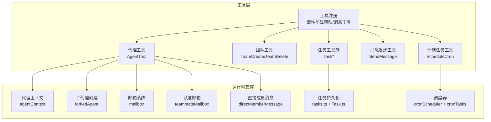
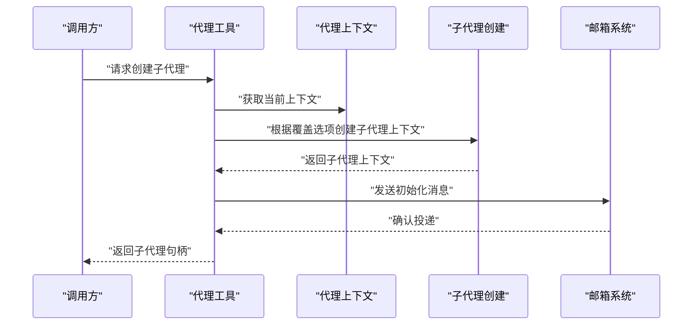
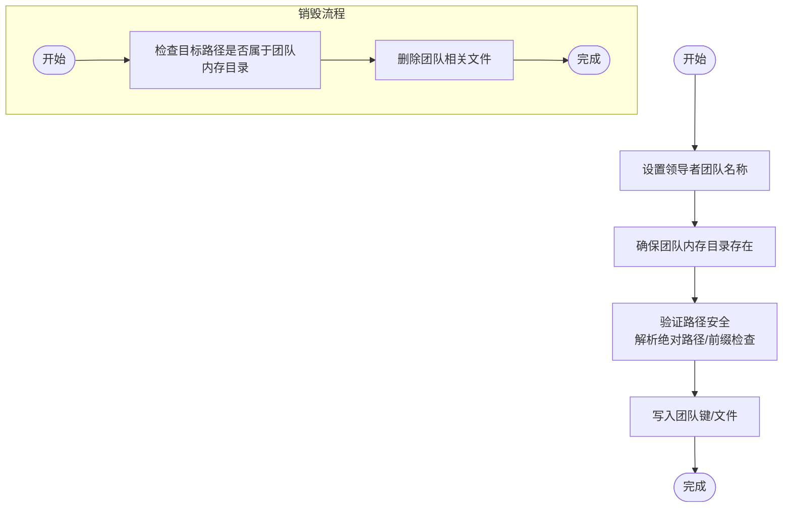
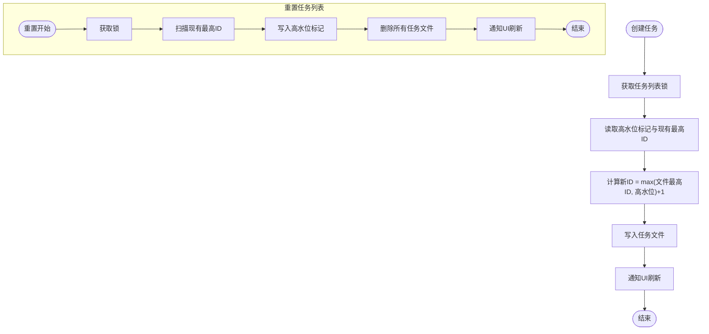
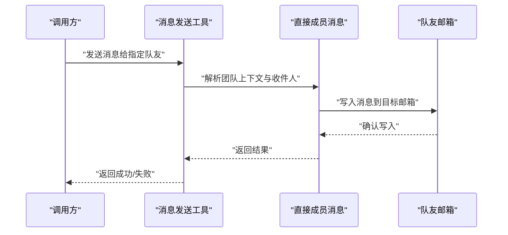
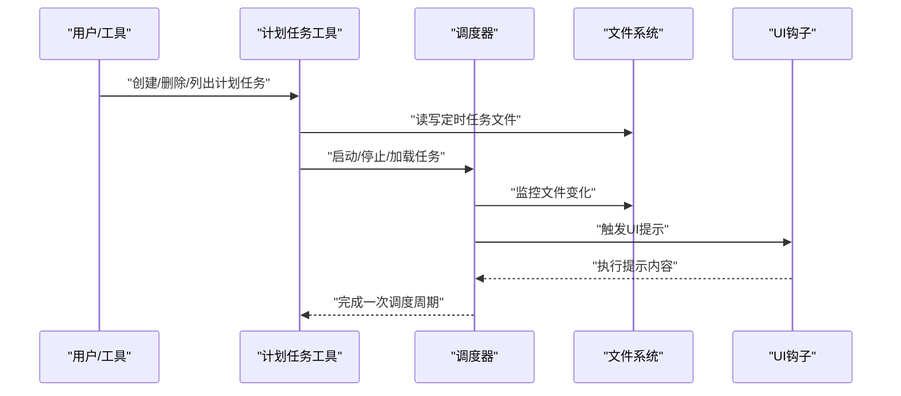
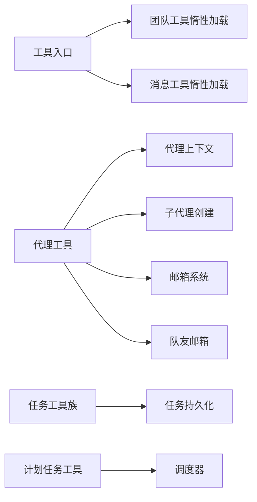

# 代理和任务工具

<cite>
**本文引用的文件**
- [src/tools.ts](file://src/tools.ts)
- [src/utils/agentContext.ts](file://src/utils/agentContext.ts)
- [src/utils/forkedAgent.ts](file://src/utils/forkedAgent.ts)
- [src/utils/mailbox.ts](file://src/utils/mailbox.ts)
- [src/utils/teammateMailbox.ts](file://src/utils/teammateMailbox.ts)
- [src/utils/directMemberMessage.ts](file://src/utils/directMemberMessage.ts)
- [src/utils/tasks.ts](file://src/utils/tasks.ts)
- [src/Task.ts](file://src/Task.ts)
- [src/utils/cronScheduler.ts](file://src/utils/cronScheduler.ts)
- [src/utils/cronTasks.ts](file://src/utils/cronTasks.ts)
- [src/hooks/useScheduledTasks.ts](file://src/hooks/useScheduledTasks.ts)
- [src/main.tsx](file://src/main.tsx)
- [src/memdir/teamMemPaths.ts](file://src/memdir/teamMemPaths.ts)
</cite>

## 目录
1. [引言](#引言)
2. [项目结构](#项目结构)
3. [核心组件](#核心组件)
4. [架构总览](#架构总览)
5. [详细组件分析](#详细组件分析)
6. [依赖关系分析](#依赖关系分析)
7. [性能考量](#性能考量)
8. [故障排查指南](#故障排查指南)
9. [结论](#结论)
10. [附录](#附录)

## 引言
本文件面向“代理和任务工具”的使用者与维护者，系统性阐述以下能力：
- 代理工具（AgentTool）：子代理创建、代理上下文隔离与协作、权限提示规避策略。
- 团队管理工具（TeamCreate、TeamDelete）：团队创建与销毁流程、安全路径校验与内存目录保护。
- 任务管理工具族（TaskCreate、TaskList、TaskGet、TaskUpdate、TaskStop、TaskOutput）：任务生命周期管理、并发安全与状态追踪。
- 消息发送工具（SendMessage）：跨代理/成员的消息投递与等待机制。
- 计划任务工具（ScheduleCron）：基于文件的定时调度与触发。

文档同时提供多代理协作、任务状态跟踪、消息传递与并发控制的技术实现说明，并给出最佳实践与性能优化建议。

## 项目结构
围绕代理与任务的核心模块分布如下：
- 工具注册与延迟加载：在工具入口中对团队与消息工具采用惰性加载，避免循环依赖。
- 代理上下文与子代理：通过异步存储保存当前代理上下文，支持子代理共享或隔离关键对象（如中断控制器）。
- 邮箱与消息：统一的消息队列与等待器模型，支持按条件筛选与订阅通知。
- 任务系统：以文件持久化为核心，提供高水位标记、锁文件与并发安全保证。
- 定时调度：基于文件变更监控与锁机制的守护式调度器。

图表来源
- [src/tools.ts:61-72](file://src/tools.ts#L61-L72)
- [src/utils/agentContext.ts:90-134](file://src/utils/agentContext.ts#L90-L134)
- [src/utils/forkedAgent.ts:345-369](file://src/utils/forkedAgent.ts#L345-L369)
- [src/utils/mailbox.ts:19-73](file://src/utils/mailbox.ts#L19-L73)
- [src/utils/teammateMailbox.ts:522-1058](file://src/utils/teammateMailbox.ts#L522-L1058)
- [src/utils/directMemberMessage.ts:45-69](file://src/utils/directMemberMessage.ts#L45-L69)
- [src/utils/tasks.ts:17-488](file://src/utils/tasks.ts#L17-L488)
- [src/Task.ts:95-125](file://src/Task.ts#L95-L125)
- [src/utils/cronScheduler.ts:409-491](file://src/utils/cronScheduler.ts#L409-L491)
- [src/utils/cronTasks.ts:90-284](file://src/utils/cronTasks.ts#L90-L284)

章节来源
- [src/tools.ts:61-72](file://src/tools.ts#L61-L72)

## 核心组件
- 代理上下文与子代理
  - 通过异步存储保存当前代理上下文，区分子代理与队友代理类型；支持在子代理中选择共享父级中断控制器或创建子中断控制器，从而控制交互式 UI 的显示与权限提示。
  - 子代理上下文创建函数根据覆盖选项决定是否共享关键对象，避免不必要的权限弹窗。
- 邮箱与消息
  - 统一的 Mailbox 类型，支持发送、轮询、接收（带条件）、订阅更新信号；消息体包含来源、内容、发件人、颜色与时间戳。
  - 队友邮箱扩展了多种消息类型（如权限请求/响应、模式设置请求、关机请求/批准/拒绝、计划审批等），并提供消息解析与构造函数。
- 任务系统
  - 任务状态基线包含唯一 ID、类型、状态、描述、工具调用 ID、开始时间、输出文件路径与偏移、通知标志等。
  - 任务列表采用高水位标记与锁文件机制，确保并发创建与重置时的原子性与一致性。
- 定时调度
  - 调度器基于文件监控与锁机制，自动启用/停止；支持批量标记已触发任务的时间戳并写回文件，保证幂等与一致性。

章节来源
- [src/utils/agentContext.ts:90-134](file://src/utils/agentContext.ts#L90-L134)
- [src/utils/forkedAgent.ts:345-369](file://src/utils/forkedAgent.ts#L345-L369)
- [src/utils/mailbox.ts:19-73](file://src/utils/mailbox.ts#L19-L73)
- [src/utils/teammateMailbox.ts:522-1058](file://src/utils/teammateMailbox.ts#L522-L1058)
- [src/Task.ts:95-125](file://src/Task.ts#L95-L125)
- [src/utils/tasks.ts:101-488](file://src/utils/tasks.ts#L101-L488)
- [src/utils/cronScheduler.ts:409-491](file://src/utils/cronScheduler.ts#L409-L491)
- [src/utils/cronTasks.ts:90-284](file://src/utils/cronTasks.ts#L90-L284)

## 架构总览
下图展示代理工具、团队与任务工具之间的交互关系，以及消息与任务的流转路径。

```mermaid
graph TB
AgentTool["代理工具<br/>AgentTool"] --> Ctx["代理上下文<br/>agentContext"]
AgentTool --> Fork["子代理创建<br/>forkedAgent"]
AgentTool --> Mail["邮箱系统<br/>mailbox"]
AgentTool --> TMBox["队友邮箱<br/>teammateMailbox"]
AgentTool --> DirectMsg["直接成员消息<br/>directMemberMessage"]
TeamCreate["团队创建<br/>TeamCreateTool"] --> TeamMem["团队内存目录<br/>teamMemPaths"]
TeamDelete["团队销毁<br/>TeamDeleteTool"] --> TeamMem
TaskCreate["任务创建<br/>TaskCreateTool"] --> Tasks["任务持久化<br/>tasks.ts"]
TaskList["任务列表<br/>TaskListTool"] --> Tasks
TaskGet["任务查询<br/>TaskGetTool"] --> Tasks
TaskUpdate["任务更新<br/>TaskUpdateTool"] --> Tasks
TaskStop["任务停止<br/>TaskStopTool"] --> Tasks
TaskOutput["任务输出<br/>TaskOutputTool"] --> Tasks
CronCreate["计划任务创建<br/>ScheduleCronTool"] --> Cron["调度器<br/>cronScheduler + cronTasks"]
```

图表来源
- [src/utils/agentContext.ts:90-134](file://src/utils/agentContext.ts#L90-L134)
- [src/utils/forkedAgent.ts:345-369](file://src/utils/forkedAgent.ts#L345-L369)
- [src/utils/mailbox.ts:19-73](file://src/utils/mailbox.ts#L19-L73)
- [src/utils/teammateMailbox.ts:522-1058](file://src/utils/teammateMailbox.ts#L522-L1058)
- [src/utils/directMemberMessage.ts:45-69](file://src/utils/directMemberMessage.ts#L45-L69)
- [src/memdir/teamMemPaths.ts:191-225](file://src/memdir/teamMemPaths.ts#L191-L225)
- [src/utils/tasks.ts:17-488](file://src/utils/tasks.ts#L17-L488)
- [src/utils/cronScheduler.ts:409-491](file://src/utils/cronScheduler.ts#L409-L491)
- [src/utils/cronTasks.ts:90-284](file://src/utils/cronTasks.ts#L90-L284)

## 详细组件分析

### 代理工具（AgentTool）
- 子代理创建与上下文隔离
  - 子代理上下文通过覆盖选项决定是否共享父级中断控制器与应用状态；若不共享，则在子代理中避免触发权限提示，提升非交互式场景下的可用性。
  - 支持在子代理中创建独立的中断控制器，以便与父级解耦。
- 代理通信与协作
  - 使用邮箱系统进行消息投递与等待；消息体包含来源、内容、发件人、颜色与时间戳，便于 UI 展示与过滤。
  - 队友邮箱扩展了多种协议消息（权限请求/响应、模式设置请求、关机请求/批准/拒绝、计划审批等），用于团队内部协作与控制流。
- 并发控制与权限提示
  - 在子代理上下文中，优先复用父级中断控制器以保持交互一致性；否则创建子中断控制器，避免不必要的权限弹窗。

图表来源
- [src/utils/agentContext.ts:90-134](file://src/utils/agentContext.ts#L90-L134)
- [src/utils/forkedAgent.ts:345-369](file://src/utils/forkedAgent.ts#L345-L369)
- [src/utils/mailbox.ts:19-73](file://src/utils/mailbox.ts#L19-L73)

章节来源
- [src/utils/agentContext.ts:90-134](file://src/utils/agentContext.ts#L90-L134)
- [src/utils/forkedAgent.ts:345-369](file://src/utils/forkedAgent.ts#L345-L369)
- [src/utils/mailbox.ts:19-73](file://src/utils/mailbox.ts#L19-L73)
- [src/utils/teammateMailbox.ts:522-1058](file://src/utils/teammateMailbox.ts#L522-L1058)

### 团队管理工具（TeamCreate、TeamDelete）
- 团队创建流程
  - 设置领导者的团队名称，使任务列表存储于团队名下而非会话 ID，便于与 tmux/iTerm2 同步。
  - 团队内存目录的安全路径校验：通过绝对路径解析与前缀匹配，防止路径穿越攻击；对写入路径与键名进一步解析符号链接，确保写入安全。
- 团队销毁流程
  - 通过团队内存路径校验与安全写入策略，确保删除操作不会越权访问或破坏其他团队数据。

图表来源
- [src/utils/tasks.ts:25-33](file://src/utils/tasks.ts#L25-L33)
- [src/memdir/teamMemPaths.ts:191-225](file://src/memdir/teamMemPaths.ts#L191-L225)

章节来源
- [src/utils/tasks.ts:25-33](file://src/utils/tasks.ts#L25-L33)
- [src/memdir/teamMemPaths.ts:191-225](file://src/memdir/teamMemPaths.ts#L191-L225)

### 任务管理工具族（TaskCreate、TaskList、TaskGet、TaskUpdate、TaskStop、TaskOutput）
- 生命周期管理
  - 创建：使用锁文件与高水位标记，确保并发安全地生成唯一任务 ID 并写入磁盘。
  - 查询：按任务列表 ID 与任务 ID 定位文件，解析并进行模式校验；兼容旧状态命名迁移。
  - 列表：扫描任务目录，聚合所有任务并返回。
  - 更新：原子性更新任务字段（如状态、阻塞关系等），并在完成后通知 UI 刷新。
  - 停止：可结合任务状态与阻塞关系进行清理与通知。
  - 输出：基于任务输出文件路径与偏移量，支持增量输出与定位。
- 并发与一致性
  - 文件锁与重试策略：在创建与重置任务列表时使用锁文件与指数退避重试，避免竞态。
  - 高水位标记：记录历史最高 ID，防止重置后 ID 冲突。

图表来源
- [src/utils/tasks.ts:101-488](file://src/utils/tasks.ts#L101-L488)
- [src/Task.ts:95-125](file://src/Task.ts#L95-L125)

章节来源
- [src/utils/tasks.ts:101-488](file://src/utils/tasks.ts#L101-L488)
- [src/Task.ts:95-125](file://src/Task.ts#L95-L125)

### 消息发送工具（SendMessage）
- 通信机制
  - 通过直接成员消息模块向指定队友发送消息；若未处于团队上下文或无写入邮箱回调，则返回错误信息。
  - 查找目标队友，若不存在则返回未知收件人错误；否则将消息写入目标队友的邮箱，并携带发件人、文本与时间戳。
- 协作与权限
  - 队友邮箱支持多种协议消息（权限请求/响应、模式设置请求、关机请求/批准/拒绝、计划审批等），用于跨代理协作与控制流。

图表来源
- [src/utils/directMemberMessage.ts:45-69](file://src/utils/directMemberMessage.ts#L45-L69)
- [src/utils/teammateMailbox.ts:522-1058](file://src/utils/teammateMailbox.ts#L522-L1058)

章节来源
- [src/utils/directMemberMessage.ts:45-69](file://src/utils/directMemberMessage.ts#L45-L69)
- [src/utils/teammateMailbox.ts:522-1058](file://src/utils/teammateMailbox.ts#L522-L1058)

### 计划任务工具（ScheduleCron）
- 定时调度功能
  - 调度器基于文件监控（chokidar）与锁机制，自动启用/停止；当检测到定时任务文件变化时重新加载任务列表。
  - 支持批量标记已触发任务的最后触发时间戳并写回文件，保证幂等与一致性。
  - 提供钩子在 UI 中显示“正在运行”提示，并将任务提示推送到主流程队列执行。
- CLI 与集成
  - 主程序中提供计划任务相关命令（创建、删除、列出等），并与调度器集成。

图表来源
- [src/utils/cronScheduler.ts:409-491](file://src/utils/cronScheduler.ts#L409-L491)
- [src/utils/cronTasks.ts:90-284](file://src/utils/cronTasks.ts#L90-L284)
- [src/hooks/useScheduledTasks.ts:106-139](file://src/hooks/useScheduledTasks.ts#L106-L139)
- [src/main.tsx:4442-4493](file://src/main.tsx#L4442-L4493)

章节来源
- [src/utils/cronScheduler.ts:409-491](file://src/utils/cronScheduler.ts#L409-L491)
- [src/utils/cronTasks.ts:90-284](file://src/utils/cronTasks.ts#L90-L284)
- [src/hooks/useScheduledTasks.ts:106-139](file://src/hooks/useScheduledTasks.ts#L106-L139)
- [src/main.tsx:4442-4493](file://src/main.tsx#L4442-L4493)

## 依赖关系分析
- 工具注册与延迟加载
  - 团队与消息工具采用惰性加载，避免循环依赖；在工具入口中导入相应模块。
- 代理与消息
  - 代理工具依赖代理上下文、子代理创建与邮箱系统；队友邮箱扩展消息协议，支持跨代理协作。
- 任务系统
  - 任务工具族依赖任务持久化模块与任务状态基线；并发安全由锁文件与高水位标记保障。
- 定时调度
  - 调度器依赖文件监控与锁机制；UI 钩子负责触发提示与执行。

图表来源
- [src/tools.ts:61-72](file://src/tools.ts#L61-L72)
- [src/utils/agentContext.ts:90-134](file://src/utils/agentContext.ts#L90-L134)
- [src/utils/forkedAgent.ts:345-369](file://src/utils/forkedAgent.ts#L345-L369)
- [src/utils/mailbox.ts:19-73](file://src/utils/mailbox.ts#L19-L73)
- [src/utils/teammateMailbox.ts:522-1058](file://src/utils/teammateMailbox.ts#L522-L1058)
- [src/utils/tasks.ts:101-488](file://src/utils/tasks.ts#L101-L488)
- [src/utils/cronScheduler.ts:409-491](file://src/utils/cronScheduler.ts#L409-L491)

章节来源
- [src/tools.ts:61-72](file://src/tools.ts#L61-L72)

## 性能考量
- 并发安全
  - 任务创建与重置使用锁文件与重试策略，降低竞态概率；高水位标记避免 ID 冲突。
- 序列化与 IO
  - 任务与定时任务文件采用 JSON 序列化；注意大任务输出时的文件写入开销，建议分块写入与增量读取。
- 调度器稳定性
  - 调度器使用文件监控与锁机制，避免多进程竞争；在非交互模式下合理设置启用条件，减少常驻开销。
- 缓存与内存
  - 对消息处理函数采用带 LRU 的缓存策略，防止内存无限增长；在高并发对话中保持良好命中率。

## 故障排查指南
- 任务读取失败
  - 若任务文件不存在或解析失败，系统会记录调试日志并返回空；检查任务文件是否存在、权限是否正确、序列化格式是否有效。
- 锁文件冲突
  - 任务创建/重置失败可能由于锁文件被占用；检查是否有其他进程持有锁，或等待锁释放后重试。
- 邮件投递异常
  - 发送消息返回未知收件人或无团队上下文错误时，检查团队上下文是否正确设置、收件人名称是否匹配。
- 定时任务无效
  - 若定时任务未触发，检查定时任务文件中的表达式是否合法、文件是否被监控、调度器是否已启用。

章节来源
- [src/utils/tasks.ts:310-350](file://src/utils/tasks.ts#L310-L350)
- [src/utils/tasks.ts:147-188](file://src/utils/tasks.ts#L147-L188)
- [src/utils/directMemberMessage.ts:45-69](file://src/utils/directMemberMessage.ts#L45-L69)
- [src/utils/cronTasks.ts:90-138](file://src/utils/cronTasks.ts#L90-L138)

## 结论
本文档从架构与实现层面梳理了代理与任务工具的关键能力：子代理创建与上下文隔离、团队创建/销毁的安全路径校验、任务生命周期的并发安全与状态追踪、消息发送的协议化与等待机制，以及基于文件的定时调度与触发。通过锁文件、高水位标记、邮箱系统与调度器的协同，系统在多代理协作、任务状态跟踪与消息传递方面具备良好的一致性与可维护性。建议在生产环境中遵循并发控制与文件 IO 最佳实践，结合缓存与监控策略，持续优化性能与稳定性。

## 附录
- CLI 与命令
  - 主程序中提供了任务相关的命令（创建、列出、查询、更新、目录等），便于在终端中进行任务管理与调试。
- 数据模型
  - 任务状态基线包含唯一 ID、类型、状态、描述、工具调用 ID、开始时间、输出文件路径与偏移、通知标志等字段，用于任务生命周期管理与 UI 展示。

章节来源
- [src/main.tsx:4442-4493](file://src/main.tsx#L4442-L4493)
- [src/Task.ts:95-125](file://src/Task.ts#L95-L125)