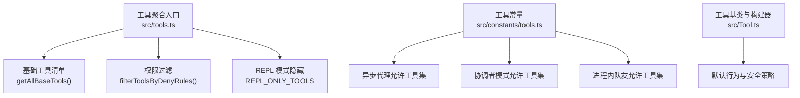
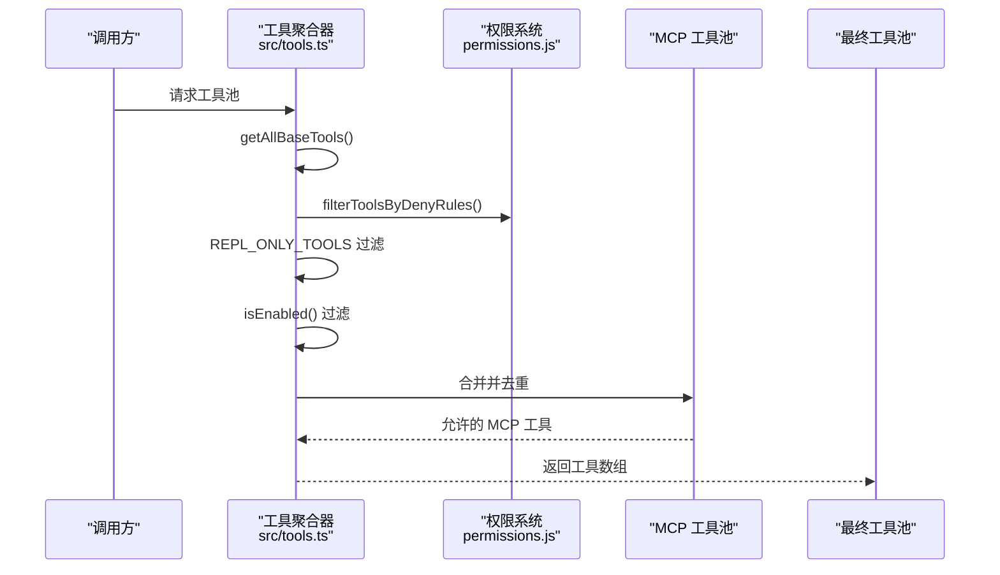
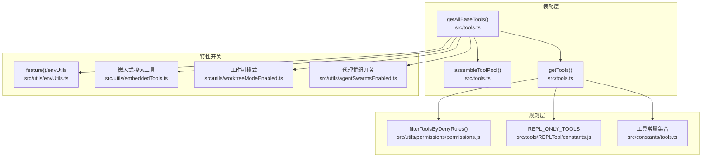

# 内置工具详解

<cite>
**本文引用的文件**
- [src/tools.ts](file://src/tools.ts)
- [src/constants/tools.ts](file://src/constants/tools.ts)
- [src/Tool.ts](file://src/Tool.ts)
- [src/utils/toolResultStorage.ts](file://src/utils/toolResultStorage.ts)
- [src/services/tools/StreamingToolExecutor.ts](file://src/services/tools/StreamingToolExecutor.ts)
- [src/utils/shell/shellToolUtils.ts](file://src/utils/shell/shellToolUtils.ts)
- [src/utils/embeddedTools.ts](file://src/utils/embeddedTools.ts)
- [src/utils/tasks.ts](file://src/utils/tasks.ts)
- [src/utils/agentSwarmsEnabled.ts](file://src/utils/agentSwarmsEnabled.ts)
- [src/utils/worktreeModeEnabled.ts](file://src/utils/worktreeModeEnabled.ts)
- [src/utils/envUtils.ts](file://src/utils/envUtils.ts)
- [src/tools/AgentTool/AgentTool.js](file://src/tools/AgentTool/AgentTool.js)
- [src/tools/TeamCreateTool/TeamCreateTool.js](file://src/tools/TeamCreateTool/TeamCreateTool.js)
- [src/tools/TeamDeleteTool/TeamDeleteTool.js](file://src/tools/TeamDeleteTool/TeamDeleteTool.js)
- [src/tools/SendMessageTool/SendMessageTool.js](file://src/tools/SendMessageTool/SendMessageTool.js)
- [src/tools/BashTool/BashTool.js](file://src/tools/BashTool/BashTool.js)
- [src/tools/PowerShellTool/PowerShellTool.js](file://src/tools/PowerShellTool/PowerShellTool.js)
- [src/tools/GlobTool/GlobTool.js](file://src/tools/GlobTool/GlobTool.js)
- [src/tools/GrepTool/GrepTool.js](file://src/tools/GrepTool/GrepTool.js)
- [src/tools/WebSearchTool/WebSearchTool.js](file://src/tools/WebSearchTool/WebSearchTool.js)
- [src/tools/WebFetchTool/WebFetchTool.js](file://src/tools/WebFetchTool/WebFetchTool.js)
- [src/tools/FileReadTool/FileReadTool.js](file://src/tools/FileReadTool/FileReadTool.js)
- [src/tools/FileEditTool/FileEditTool.js](file://src/tools/FileEditTool/FileEditTool.js)
- [src/tools/FileWriteTool/FileWriteTool.js](file://src/tools/FileWriteTool/FileWriteTool.js)
- [src/tools/LSPTool/LSPTool.js](file://src/tools/LSPTool/LSPTool.js)
- [src/tools/ToolSearchTool/ToolSearchTool.js](file://src/tools/ToolSearchTool/ToolSearchTool.js)
- [src/tools/TaskCreateTool/TaskCreateTool.js](file://src/tools/TaskCreateTool/TaskCreateTool.js)
- [src/tools/TaskGetTool/TaskGetTool.js](file://src/tools/TaskGetTool/TaskGetTool.js)
- [src/tools/TaskUpdateTool/TaskUpdateTool.js](file://src/tools/TaskUpdateTool/TaskUpdateTool.js)
- [src/tools/TaskListTool/TaskListTool.js](file://src/tools/TaskListTool/TaskListTool.js)
- [src/tools/TaskStopTool/TaskStopTool.js](file://src/tools/TaskStopTool/TaskStopTool.js)
- [src/tools/TaskOutputTool/TaskOutputTool.js](file://src/tools/TaskOutputTool/TaskOutputTool.js)
- [src/tools/ExitPlanModeTool/ExitPlanModeV2Tool.js](file://src/tools/ExitPlanModeTool/ExitPlanModeV2Tool.js)
- [src/tools/EnterPlanModeTool/EnterPlanModeTool.js](file://src/tools/EnterPlanModeTool/EnterPlanModeTool.js)
- [src/tools/EnterWorktreeTool/EnterWorktreeTool.js](file://src/tools/EnterWorktreeTool/EnterWorktreeTool.js)
- [src/tools/ExitWorktreeTool/ExitWorktreeTool.js](file://src/tools/ExitWorktreeTool/ExitWorktreeTool.js)
- [src/tools/NotebookEditTool/NotebookEditTool.js](file://src/tools/NotebookEditTool/NotebookEditTool.js)
- [src/tools/TodoWriteTool/TodoWriteTool.js](file://src/tools/TodoWriteTool/TodoWriteTool.js)
- [src/tools/SkillTool/SkillTool.js](file://src/tools/SkillTool/SkillTool.js)
- [src/tools/BriefTool/BriefTool.js](file://src/tools/BriefTool/BriefTool.js)
- [src/tools/AskUserQuestionTool/AskUserQuestionTool.js](file://src/tools/AskUserQuestionTool/AskUserQuestionTool.js)
- [src/tools/ConfigTool/ConfigTool.js](file://src/tools/ConfigTool/ConfigTool.js)
- [src/tools/TungstenTool/TungstenTool.js](file://src/tools/TungstenTool/TungstenTool.js)
- [src/tools/REPLTool/REPLTool.js](file://src/tools/REPLTool/REPLTool.js)
- [src/tools/WorkflowTool/WorkflowTool.js](file://src/tools/WorkflowTool/WorkflowTool.js)
- [src/tools/SleepTool/SleepTool.js](file://src/tools/SleepTool/SleepTool.js)
- [src/tools/ScheduleCronTool/CronCreateTool.js](file://src/tools/ScheduleCronTool/CronCreateTool.js)
- [src/tools/ScheduleCronTool/CronDeleteTool.js](file://src/tools/ScheduleCronTool/CronDeleteTool.js)
- [src/tools/ScheduleCronTool/CronListTool.js](file://src/tools/ScheduleCronTool/CronListTool.js)
- [src/tools/RemoteTriggerTool/RemoteTriggerTool.js](file://src/tools/RemoteTriggerTool/RemoteTriggerTool.js)
- [src/tools/MonitorTool/MonitorTool.js](file://src/tools/MonitorTool/MonitorTool.js)
- [src/tools/SendUserFileTool/SendUserFileTool.js](file://src/tools/SendUserFileTool/SendUserFileTool.js)
- [src/tools/PushNotificationTool/PushNotificationTool.js](file://src/tools/PushNotificationTool/PushNotificationTool.js)
- [src/tools/SubscribePRTool/SubscribePRTool.js](file://src/tools/SubscribePRTool/SubscribePRTool.js)
- [src/tools/CtxInspectTool/CtxInspectTool.js](file://src/tools/CtxInspectTool/CtxInspectTool.js)
- [src/tools/TerminalCaptureTool/TerminalCaptureTool.js](file://src/tools/TerminalCaptureTool/TerminalCaptureTool.js)
- [src/tools/WebBrowserTool/WebBrowserTool.js](file://src/tools/WebBrowserTool/WebBrowserTool.js)
- [src/tools/OverflowTestTool/OverflowTestTool.js](file://src/tools/OverflowTestTool/OverflowTestTool.js)
- [src/tools/VerifyPlanExecutionTool/VerifyPlanExecutionTool.js](file://src/tools/VerifyPlanExecutionTool/VerifyPlanExecutionTool.js)
- [src/tools/SnipTool/SnipTool.js](file://src/tools/SnipTool/SnipTool.js)
- [src/tools/ListPeersTool/ListPeersTool.js](file://src/tools/ListPeersTool/ListPeersTool.js)
- [src/tools/ListMcpResourcesTool/ListMcpResourcesTool.js](file://src/tools/ListMcpResourcesTool/ListMcpResourcesTool.js)
- [src/tools/ReadMcpResourceTool/ReadMcpResourceTool.js](file://src/tools/ReadMcpResourceTool/ReadMcpResourceTool.js)
- [src/tools/SyntheticOutputTool/SyntheticOutputTool.js](file://src/tools/SyntheticOutputTool/SyntheticOutputTool.js)
- [src/tools/REPLTool/constants.js](file://src/tools/REPLTool/constants.js)
- [src/coordinator/coordinatorMode.js](file://src/coordinator/coordinatorMode.js)
- [src/utils/toolSearch.js](file://src/utils/toolSearch.js)
- [src/utils/permissions/permissions.js](file://src/utils/permissions/permissions.js)
</cite>

## 目录
1. [简介](#简介)
2. [项目结构](#项目结构)
3. [核心组件](#核心组件)
4. [架构总览](#架构总览)
5. [详细组件分析](#详细组件分析)
6. [依赖关系分析](#依赖关系分析)
7. [性能考量](#性能考量)
8. [故障排查指南](#故障排查指南)
9. [结论](#结论)
10. [附录](#附录)

## 简介
本文件面向 Claude Code 的 40+ 内置工具，提供系统化、可操作的功能文档。内容覆盖文件操作、系统工具、网络工具、开发工具、代理与团队管理、任务管理等类别，并解释工具间的协作关系、权限与安全策略、性能特征与限制、最佳实践与选择建议。为便于不同背景读者理解，文档采用“概念—架构—实现—实践”的分层方式组织。

## 项目结构
内置工具的装配与筛选逻辑集中在工具聚合入口与常量定义中：
- 工具聚合入口负责按环境特性、权限上下文与 REPL 模式动态组装可用工具集。
- 常量模块定义异步代理、协调者模式、进程内队友等场景下的工具白名单/黑名单。
- 工具基类与默认行为由统一的工具构建器提供一致的接口与安全默认。

图表来源
- [src/tools.ts:193-251](file://src/tools.ts#L193-L251)
- [src/tools.ts:262-269](file://src/tools.ts#L262-L269)
- [src/tools.ts:312-323](file://src/tools.ts#L312-L323)
- [src/constants/tools.ts:55-88](file://src/constants/tools.ts#L55-L88)
- [src/constants/tools.ts:107-112](file://src/constants/tools.ts#L107-L112)
- [src/Tool.ts:783-792](file://src/Tool.ts#L783-L792)

章节来源
- [src/tools.ts:193-327](file://src/tools.ts#L193-L327)
- [src/constants/tools.ts:36-112](file://src/constants/tools.ts#L36-L112)
- [src/Tool.ts:706-792](file://src/Tool.ts#L706-L792)

## 核心组件
- 工具聚合器：根据环境标志、权限规则与 REPL 模式生成最终可用工具集；支持合并内置与 MCP 工具，保证名称去重与提示缓存稳定性。
- 工具常量：定义异步代理、协调者模式、进程内队友等角色的工具准入集合，确保安全隔离与职责边界。
- 工具基类与构建器：提供统一的默认行为（如只读、并发安全、破坏性、权限检查、自动分类输入、用户可见名），降低工具实现复杂度并提升一致性。

章节来源
- [src/tools.ts:345-367](file://src/tools.ts#L345-L367)
- [src/constants/tools.ts:36-112](file://src/constants/tools.ts#L36-L112)
- [src/Tool.ts:757-792](file://src/Tool.ts#L757-L792)

## 架构总览
下图展示工具装配的关键流程：从基础工具清单到最终工具池，贯穿权限过滤、REPL 隐藏、MCP 合并与去重。

图表来源
- [src/tools.ts:271-327](file://src/tools.ts#L271-L327)
- [src/tools.ts:345-367](file://src/tools.ts#L345-L367)
- [src/utils/permissions/permissions.js](file://src/utils/permissions/permissions.js)

章节来源
- [src/tools.ts:271-367](file://src/tools.ts#L271-L367)

## 详细组件分析

### 文件操作工具
- FileRead：读取文件内容，适合只读场景，默认标记为只读。
- FileEdit：编辑文件内容，支持差异更新，适合需要修改但不直接写入的场景。
- FileWrite：直接写入文件，标记为破坏性，需谨慎使用。

使用场景
- FileRead：日志分析、代码审查、上下文检索。
- FileEdit：交互式修改、草稿编辑、增量变更。
- FileWrite：批量生成、模板替换、自动化脚本落地。

权限与安全
- FileRead 默认只读；FileEdit/FileWrite 默认非只读且可能破坏性，需结合权限系统与沙箱策略使用。

性能与限制
- 大文件读写建议配合结果持久化与预览机制，避免超长输出影响对话性能。

章节来源
- [src/tools/FileReadTool/FileReadTool.js](file://src/tools/FileReadTool/FileReadTool.js)
- [src/tools/FileEditTool/FileEditTool.js](file://src/tools/FileEditTool/FileEditTool.js)
- [src/tools/FileWriteTool/FileWriteTool.js](file://src/tools/FileWriteTool/FileWriteTool.js)
- [src/utils/toolResultStorage.ts:60-108](file://src/utils/toolResultStorage.ts#L60-L108)

### 系统工具
- Bash：执行 Shell 命令，支持并发安全判定与只读/破坏性标记。
- PowerShell：在启用时提供 Windows 平台命令能力，按环境开关启用。
- Glob：文件路径匹配，当环境中存在嵌入式搜索工具时可省略专用工具。
- Grep：文本搜索，同样受嵌入式搜索工具存在性影响。

使用场景
- Bash：系统运维、构建脚本、环境探测。
- PowerShell：Windows 特定任务、服务管理、注册表查询。
- Glob/Grep：快速定位文件与内容，替代传统 find/ripgrep。

权限与安全
- Shell 工具通常具备破坏性，应严格限制与审计；建议仅在受控环境中启用。

性能与限制
- 嵌入式搜索工具可显著提升性能；注意避免在大型仓库上进行深度递归扫描。

章节来源
- [src/tools/BashTool/BashTool.js](file://src/tools/BashTool/BashTool.js)
- [src/tools/PowerShellTool/PowerShellTool.js](file://src/tools/PowerShellTool/PowerShellTool.js)
- [src/tools/GlobTool/GlobTool.js](file://src/tools/GlobTool/GlobTool.js)
- [src/tools/GrepTool/GrepTool.js](file://src/tools/GrepTool/GrepTool.js)
- [src/utils/shell/shellToolUtils.ts](file://src/utils/shell/shellToolUtils.ts)
- [src/utils/embeddedTools.ts](file://src/utils/embeddedTools.ts)

### 网络工具
- WebSearch：网页搜索，适合信息收集与背景知识检索。
- WebFetch：抓取网页内容，适合结构化数据提取与离线分析。

使用场景
- WebSearch：需求澄清、竞品分析、技术选型背景调查。
- WebFetch：API 文档拉取、RSS 订阅、网页快照保存。

权限与安全
- 网络访问需遵循企业代理与合规策略；建议限制域名范围与速率。

性能与限制
- 避免高并发请求导致目标站点限流；合理设置超时与重试。

章节来源
- [src/tools/WebSearchTool/WebSearchTool.js](file://src/tools/WebSearchTool/WebSearchTool.js)
- [src/tools/WebFetchTool/WebFetchTool.js](file://src/tools/WebFetchTool/WebFetchTool.js)

### 开发工具
- LSP：语言服务器协议集成，提供智能补全、跳转、诊断等能力。
- ToolSearch：工具检索，用于在工具过多时辅助选择合适工具。

使用场景
- LSP：多语言项目开发、代码导航、重构辅助。
- ToolSearch：工具选择困难时的“搜索引擎”。

权限与安全
- LSP 依赖 IDE/编辑器集成，需确保本地插件可信。

性能与限制
- LSP 初始化与索引建立耗时较长，建议按需启动。

章节来源
- [src/tools/LSPTool/LSPTool.js](file://src/tools/LSPTool/LSPTool.js)
- [src/tools/ToolSearchTool/ToolSearchTool.js](file://src/tools/ToolSearchTool/ToolSearchTool.js)
- [src/utils/toolSearch.js](file://src/utils/toolSearch.js)

### 代理工具
- AgentTool：创建与管理子代理，支持嵌套代理与团队协作。
- TeamCreate/TeamDelete：团队创建与删除，配合代理工具形成多智能体编排。
- SendMessage：向团队成员发送消息，促进跨代理沟通。

使用场景
- AgentTool：复杂任务分解、多角色分工、跨领域协作。
- TeamCreate/TeamDelete：临时工作组、项目阶段化团队管理。
- SendMessage：状态同步、进度汇报、问题上报。

权限与安全
- 代理工具在异步代理与协调者模式下有严格白名单限制，防止递归与越权。

性能与限制
- 多代理并发会增加资源消耗，需合理调度与限速。

章节来源
- [src/tools/AgentTool/AgentTool.js](file://src/tools/AgentTool/AgentTool.js)
- [src/tools/TeamCreateTool/TeamCreateTool.js](file://src/tools/TeamCreateTool/TeamCreateTool.js)
- [src/tools/TeamDeleteTool/TeamDeleteTool.js](file://src/tools/TeamDeleteTool/TeamDeleteTool.js)
- [src/tools/SendMessageTool/SendMessageTool.js](file://src/tools/SendMessageTool/SendMessageTool.js)
- [src/constants/tools.ts:36-46](file://src/constants/tools.ts#L36-L46)
- [src/constants/tools.ts:107-112](file://src/constants/tools.ts#L107-L112)

### 任务工具
- TaskCreate/TaskGet/TaskUpdate/TaskList：任务生命周期管理。
- TaskStop/TaskOutput：任务停止与输出管理。

使用场景
- TaskCreate：将长任务拆分为可追踪步骤。
- TaskList/TaskGet：查看任务状态与历史。
- TaskUpdate：动态调整任务优先级与截止时间。
- TaskStop：取消阻塞或错误的任务。
- TaskOutput：汇总任务结果并回传给主任务或用户。

权限与安全
- 仅进程内队友允许创建与管理任务，避免异步代理滥用。

性能与限制
- 高频任务调度需注意系统负载与队列积压。

章节来源
- [src/tools/TaskCreateTool/TaskCreateTool.js](file://src/tools/TaskCreateTool/TaskCreateTool.js)
- [src/tools/TaskGetTool/TaskGetTool.js](file://src/tools/TaskGetTool/TaskGetTool.js)
- [src/tools/TaskUpdateTool/TaskUpdateTool.js](file://src/tools/TaskUpdateTool/TaskUpdateTool.js)
- [src/tools/TaskListTool/TaskListTool.js](file://src/tools/TaskListTool/TaskListTool.js)
- [src/tools/TaskStopTool/TaskStopTool.js](file://src/tools/TaskStopTool/TaskStopTool.js)
- [src/tools/TaskOutputTool/TaskOutputTool.js](file://src/tools/TaskOutputTool/TaskOutputTool.js)
- [src/utils/tasks.ts](file://src/utils/tasks.ts)
- [src/constants/tools.ts:77-88](file://src/constants/tools.ts#L77-L88)

### 其他重要工具
- Enter/Exit Plan Mode：进入/退出计划模式，用于高层规划与执行解耦。
- Enter/Exit Worktree：工作树切换，适合多分支并行开发。
- NotebookEdit：笔记本编辑，适合记录与分享探索过程。
- TodoWrite：待办事项写入，便于任务与笔记联动。
- SkillTool：技能工具，用于扩展特定领域的专业能力。
- BriefTool：摘要生成，帮助快速提炼关键信息。
- AskUserQuestion：向用户提问，增强交互式推理。
- ConfigTool：配置工具（仅特定用户类型可用）。
- TungstenTool：虚拟终端相关工具（冲突于多代理共享）。
- REPLTool：REPL 工具（特定用户类型可用）。
- WorkflowTool：工作流脚本工具（按特性启用）。
- SleepTool：休眠工具（按特性启用）。
- ScheduleCronTool：定时任务创建/删除/列出。
- RemoteTriggerTool：远程触发器。
- MonitorTool：监控工具。
- SendUserFileTool：发送用户文件。
- PushNotificationTool：推送通知。
- SubscribePRTool：订阅 PR。
- CtxInspectTool：上下文检查。
- TerminalCaptureTool：终端捕获。
- WebBrowserTool：网页浏览器工具。
- OverflowTestTool：溢出测试工具。
- VerifyPlanExecutionTool：验证计划执行。
- SnipTool：历史片段。
- ListPeersTool：列出同伴。
- List/ReadMcpResourcesTool：MCP 资源列举与读取。
- SyntheticOutputTool：合成输出工具。

章节来源
- [src/tools/ExitPlanModeTool/ExitPlanModeV2Tool.js](file://src/tools/ExitPlanModeTool/ExitPlanModeV2Tool.js)
- [src/tools/EnterPlanModeTool/EnterPlanModeTool.js](file://src/tools/EnterPlanModeTool/EnterPlanModeTool.js)
- [src/tools/EnterWorktreeTool/EnterWorktreeTool.js](file://src/tools/EnterWorktreeTool/EnterWorktreeTool.js)
- [src/tools/ExitWorktreeTool/ExitWorktreeTool.js](file://src/tools/ExitWorktreeTool/ExitWorktreeTool.js)
- [src/tools/NotebookEditTool/NotebookEditTool.js](file://src/tools/NotebookEditTool/NotebookEditTool.js)
- [src/tools/TodoWriteTool/TodoWriteTool.js](file://src/tools/TodoWriteTool/TodoWriteTool.js)
- [src/tools/SkillTool/SkillTool.js](file://src/tools/SkillTool/SkillTool.js)
- [src/tools/BriefTool/BriefTool.js](file://src/tools/BriefTool/BriefTool.js)
- [src/tools/AskUserQuestionTool/AskUserQuestionTool.js](file://src/tools/AskUserQuestionTool/AskUserQuestionTool.js)
- [src/tools/ConfigTool/ConfigTool.js](file://src/tools/ConfigTool/ConfigTool.js)
- [src/tools/TungstenTool/TungstenTool.js](file://src/tools/TungstenTool/TungstenTool.js)
- [src/tools/REPLTool/REPLTool.js](file://src/tools/REPLTool/REPLTool.js)
- [src/tools/WorkflowTool/WorkflowTool.js](file://src/tools/WorkflowTool/WorkflowTool.js)
- [src/tools/SleepTool/SleepTool.js](file://src/tools/SleepTool/SleepTool.js)
- [src/tools/ScheduleCronTool/CronCreateTool.js](file://src/tools/ScheduleCronTool/CronCreateTool.js)
- [src/tools/ScheduleCronTool/CronDeleteTool.js](file://src/tools/ScheduleCronTool/CronDeleteTool.js)
- [src/tools/ScheduleCronTool/CronListTool.js](file://src/tools/ScheduleCronTool/CronListTool.js)
- [src/tools/RemoteTriggerTool/RemoteTriggerTool.js](file://src/tools/RemoteTriggerTool/RemoteTriggerTool.js)
- [src/tools/MonitorTool/MonitorTool.js](file://src/tools/MonitorTool/MonitorTool.js)
- [src/tools/SendUserFileTool/SendUserFileTool.js](file://src/tools/SendUserFileTool/SendUserFileTool.js)
- [src/tools/PushNotificationTool/PushNotificationTool.js](file://src/tools/PushNotificationTool/PushNotificationTool.js)
- [src/tools/SubscribePRTool/SubscribePRTool.js](file://src/tools/SubscribePRTool/SubscribePRTool.js)
- [src/tools/CtxInspectTool/CtxInspectTool.js](file://src/tools/CtxInspectTool/CtxInspectTool.js)
- [src/tools/TerminalCaptureTool/TerminalCaptureTool.js](file://src/tools/TerminalCaptureTool/TerminalCaptureTool.js)
- [src/tools/WebBrowserTool/WebBrowserTool.js](file://src/tools/WebBrowserTool/WebBrowserTool.js)
- [src/tools/OverflowTestTool/OverflowTestTool.js](file://src/tools/OverflowTestTool/OverflowTestTool.js)
- [src/tools/VerifyPlanExecutionTool/VerifyPlanExecutionTool.js](file://src/tools/VerifyPlanExecutionTool/VerifyPlanExecutionTool.js)
- [src/tools/SnipTool/SnipTool.js](file://src/tools/SnipTool/SnipTool.js)
- [src/tools/ListPeersTool/ListPeersTool.js](file://src/tools/ListPeersTool/ListPeersTool.js)
- [src/tools/ListMcpResourcesTool/ListMcpResourcesTool.js](file://src/tools/ListMcpResourcesTool/ListMcpResourcesTool.js)
- [src/tools/ReadMcpResourceTool/ReadMcpResourceTool.js](file://src/tools/ReadMcpResourceTool/ReadMcpResourceTool.js)
- [src/tools/SyntheticOutputTool/SyntheticOutputTool.js](file://src/tools/SyntheticOutputTool/SyntheticOutputTool.js)

## 依赖关系分析
工具装配与筛选的关键依赖链如下：

图表来源
- [src/tools.ts:193-251](file://src/tools.ts#L193-L251)
- [src/tools.ts:345-367](file://src/tools.ts#L345-L367)
- [src/tools.ts:271-327](file://src/tools.ts#L271-L327)
- [src/utils/permissions/permissions.js](file://src/utils/permissions/permissions.js)
- [src/tools/REPLTool/constants.js](file://src/tools/REPLTool/constants.js)
- [src/constants/tools.ts:36-112](file://src/constants/tools.ts#L36-L112)
- [src/utils/envUtils.ts](file://src/utils/envUtils.ts)
- [src/utils/embeddedTools.ts](file://src/utils/embeddedTools.ts)
- [src/utils/worktreeModeEnabled.ts](file://src/utils/worktreeModeEnabled.ts)
- [src/utils/agentSwarmsEnabled.ts](file://src/utils/agentSwarmsEnabled.ts)

章节来源
- [src/tools.ts:193-367](file://src/tools.ts#L193-L367)
- [src/constants/tools.ts:36-112](file://src/constants/tools.ts#L36-L112)

## 性能考量
- 结果持久化与预览：大结果通过磁盘持久化与预览减少内存与令牌开销。
- 嵌入式搜索：在可用时优先使用内置搜索工具以获得更快响应。
- 并发与只读：默认假设非并发安全与非只读，避免误用造成资源竞争与副作用。
- 提示缓存稳定性：工具池按名称排序并内置去重，确保系统提示缓存命中率。

章节来源
- [src/utils/toolResultStorage.ts:60-108](file://src/utils/toolResultStorage.ts#L60-L108)
- [src/utils/embeddedTools.ts](file://src/utils/embeddedTools.ts)
- [src/Tool.ts:757-792](file://src/Tool.ts#L757-L792)
- [src/tools.ts:358-366](file://src/tools.ts#L358-L366)

## 故障排查指南
- 工具不可见
  - 检查权限拒绝规则与 deny 列表。
  - 确认 REPL 模式是否隐藏了原语工具。
  - 查看环境变量与特性开关是否禁用了该工具。
- 工具无响应或超时
  - 检查网络代理与 DNS 设置。
  - 对 Shell 工具设置合理的超时与重试。
- 结果过大导致内存压力
  - 使用结果持久化与预览策略。
  - 限制一次性返回的数据量。
- 代理/任务异常
  - 确认异步代理与协调者模式的工具白名单。
  - 检查进程内队友的工具权限。

章节来源
- [src/tools.ts:262-269](file://src/tools.ts#L262-L269)
- [src/tools.ts:312-323](file://src/tools.ts#L312-L323)
- [src/utils/toolResultStorage.ts:60-108](file://src/utils/toolResultStorage.ts#L60-L108)
- [src/constants/tools.ts:36-112](file://src/constants/tools.ts#L36-L112)

## 结论
Claude Code 的内置工具体系通过统一的装配与筛选机制、严格的权限与安全策略、以及性能优化手段，实现了在多样化场景下的稳定与高效。正确理解各工具的能力边界、协作关系与最佳实践，是发挥其价值的关键。

## 附录
- 工具选择与使用决策指南
  - 优先使用只读工具进行信息收集与分析。
  - 修改文件前先使用 FileEdit 进行差异预览。
  - Shell 工具仅在必要时启用，并限制命令范围。
  - 任务与代理工具适用于复杂流程编排，注意并发与权限。
  - 网络工具需遵守合规与速率限制。
  - 结果过大时启用持久化与预览，避免影响对话性能。