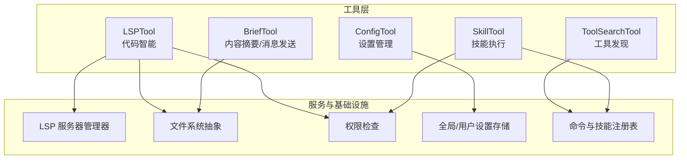
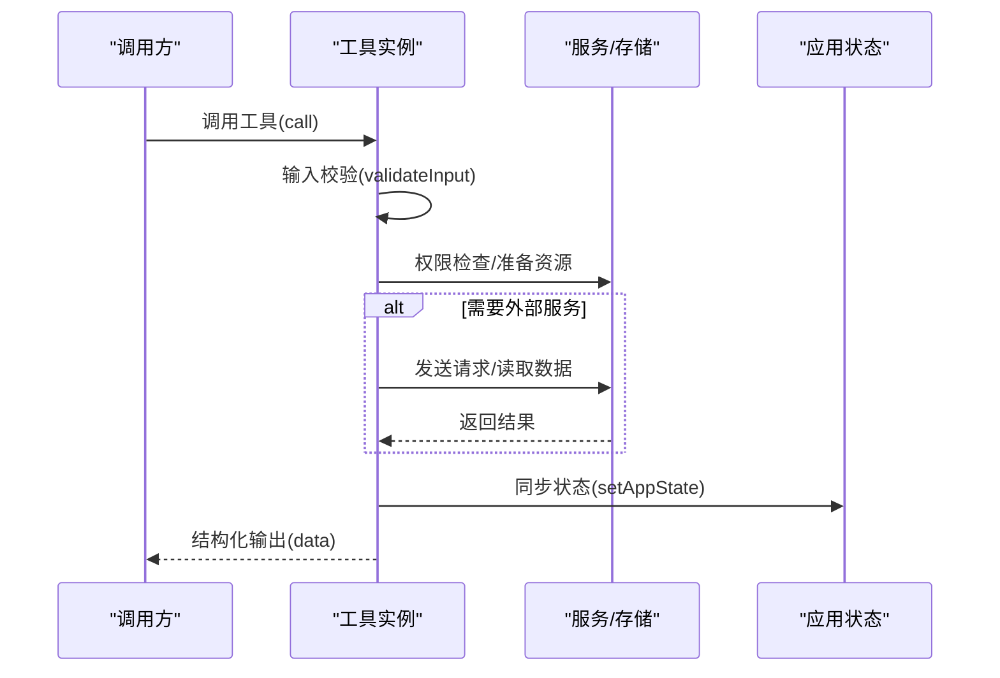
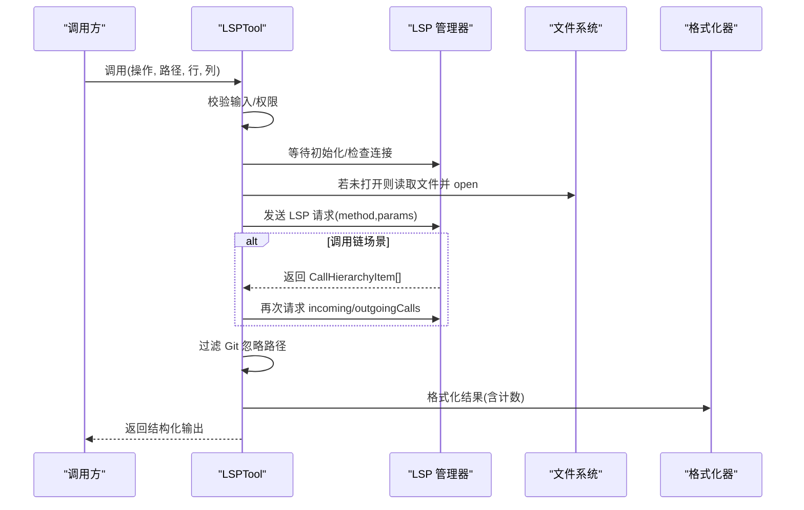
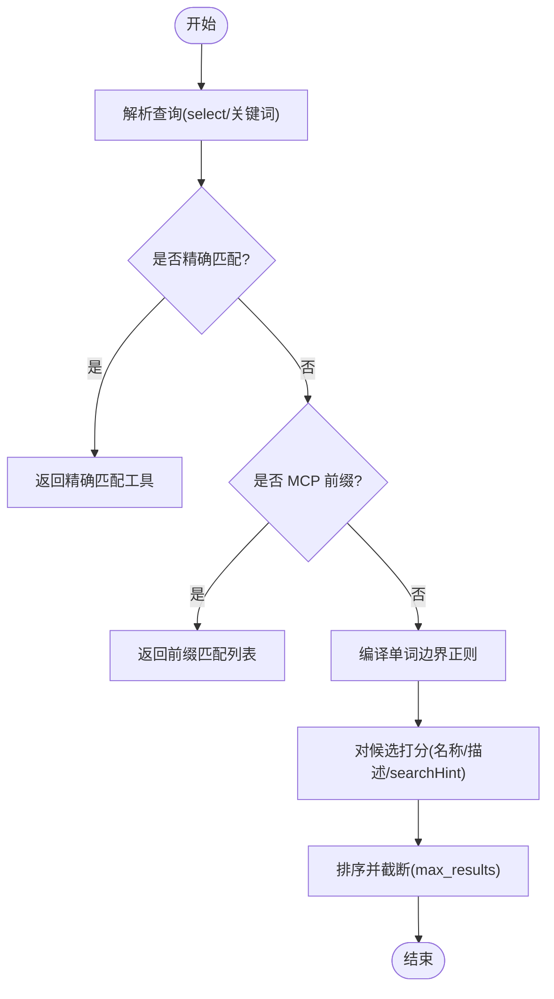
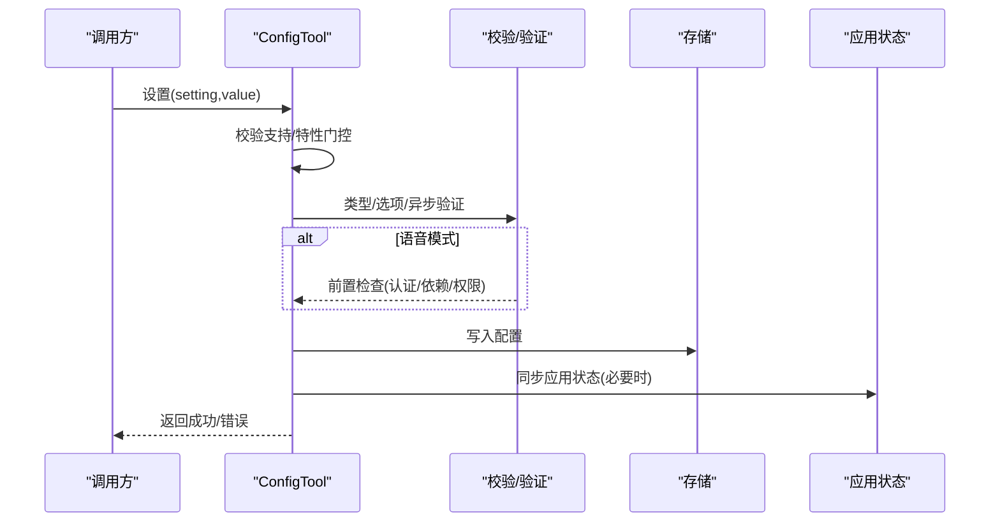
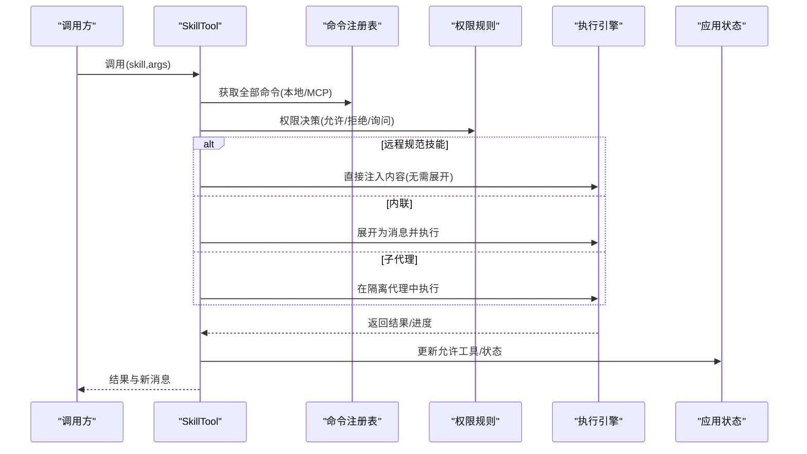
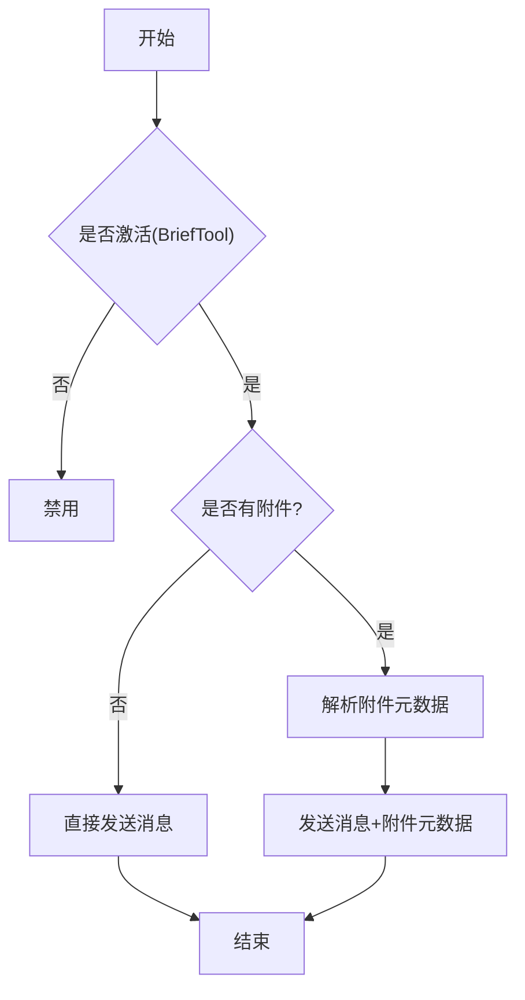
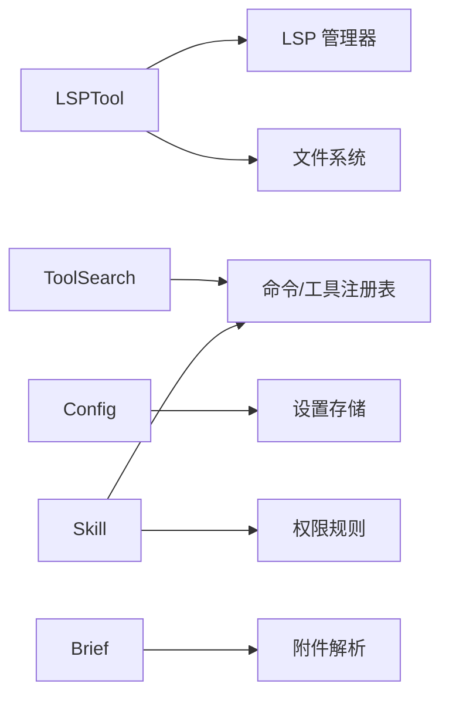

# 开发工具

<cite>
**本文引用的文件**
- [LSPTool.ts](file://src/tools/LSPTool/LSPTool.ts)
- [formatters.ts](file://src/tools/LSPTool/formatters.ts)
- [prompt.ts](file://src/tools/LSPTool/prompt.ts)
- [schemas.ts](file://src/tools/LSPTool/schemas.ts)
- [symbolContext.ts](file://src/tools/LSPTool/symbolContext.ts)
- [ToolSearchTool.ts](file://src/tools/ToolSearchTool/ToolSearchTool.ts)
- [constants.ts](file://src/tools/ToolSearchTool/constants.ts)
- [prompt.ts](file://src/tools/ToolSearchTool/prompt.ts)
- [ConfigTool.ts](file://src/tools/ConfigTool/ConfigTool.ts)
- [UI.tsx](file://src/tools/ConfigTool/UI.tsx)
- [constants.ts](file://src/tools/ConfigTool/constants.ts)
- [prompt.ts](file://src/tools/ConfigTool/prompt.ts)
- [supportedSettings.ts](file://src/tools/ConfigTool/supportedSettings.ts)
- [SkillTool.ts](file://src/tools/SkillTool/SkillTool.ts)
- [UI.tsx](file://src/tools/SkillTool/UI.tsx)
- [constants.ts](file://src/tools/SkillTool/constants.ts)
- [prompt.ts](file://src/tools/SkillTool/prompt.ts)
- [BriefTool.ts](file://src/tools/BriefTool/BriefTool.ts)
- [UI.tsx](file://src/tools/BriefTool/UI.tsx)
- [attachments.ts](file://src/tools/BriefTool/attachments.ts)
- [prompt.ts](file://src/tools/BriefTool/prompt.ts)
</cite>

## 目录
1. [简介](#简介)
2. [项目结构](#项目结构)
3. [核心组件](#核心组件)
4. [架构总览](#架构总览)
5. [详细组件分析](#详细组件分析)
6. [依赖关系分析](#依赖关系分析)
7. [性能考量](#性能考量)
8. [故障排除指南](#故障排除指南)
9. [结论](#结论)
10. [附录](#附录)

## 简介
本文件面向开发工具的使用者与维护者，系统性阐述以下工具的能力与实现细节：
- 语言服务器协议工具（LSPTool）：提供代码补全、语法检查、符号导航、调用链分析等能力。
- 工具搜索工具（ToolSearch）：用于在延迟加载的工具集合中进行发现与选择。
- 配置工具（ConfigTool）：统一读取与设置各类运行时配置项。
- 技能工具（SkillTool）：以“技能”为单位执行命令式或提示工程式的任务，并支持权限与进度反馈。
- 简报工具（BriefTool）：向用户发送消息与附件，作为主要可见输出通道。

同时覆盖工具与 IDE/开发环境的协同方式、集成方法、性能优化策略、扩展机制以及最佳实践与故障排除建议。

## 项目结构
围绕上述工具，相关源码位于 src/tools 下的子目录中，每个工具均遵循统一的工具定义模式（buildTool），并配套输入/输出模式、提示词、格式化器与 UI 渲染层。

图表来源
- [LSPTool.ts:127-422](file://src/tools/LSPTool/LSPTool.ts#L127-L422)
- [ToolSearchTool.ts:304-471](file://src/tools/ToolSearchTool/ToolSearchTool.ts#L304-L471)
- [ConfigTool.ts:67-434](file://src/tools/ConfigTool/ConfigTool.ts#L67-L434)
- [SkillTool.ts:331-800](file://src/tools/SkillTool/SkillTool.ts#L331-L800)
- [BriefTool.ts:136-204](file://src/tools/BriefTool/BriefTool.ts#L136-L204)

章节来源
- [LSPTool.ts:127-422](file://src/tools/LSPTool/LSPTool.ts#L127-L422)
- [ToolSearchTool.ts:304-471](file://src/tools/ToolSearchTool/ToolSearchTool.ts#L304-L471)
- [ConfigTool.ts:67-434](file://src/tools/ConfigTool/ConfigTool.ts#L67-L434)
- [SkillTool.ts:331-800](file://src/tools/SkillTool/SkillTool.ts#L331-L800)
- [BriefTool.ts:136-204](file://src/tools/BriefTool/BriefTool.ts#L136-L204)

## 核心组件
- LSPTool：封装 LSP 协议操作，支持跳转定义、引用查找、悬停信息、文档/工作区符号、实现跳转与调用层次分析；内置安全校验、权限检查与 Git 忽略过滤。
- ToolSearch：对延迟加载工具集进行关键词检索与前缀匹配，支持“直接选择”与“关键字搜索”，并记录分析事件。
- ConfigTool：集中式配置读取/写入，支持类型校验、选项约束、异步验证（如模型可用性）、语音模式前置检查与即时状态同步。
- SkillTool：将“技能”解析为完整提示工程，支持内联与派生子代理两种执行路径，具备权限规则、遥测与进度上报。
- BriefTool：在受控特性下向用户发送消息与附件，支持主动/常规两类状态，具备附件解析与时间戳记录。

章节来源
- [LSPTool.ts:127-422](file://src/tools/LSPTool/LSPTool.ts#L127-L422)
- [ToolSearchTool.ts:304-471](file://src/tools/ToolSearchTool/ToolSearchTool.ts#L304-L471)
- [ConfigTool.ts:67-434](file://src/tools/ConfigTool/ConfigTool.ts#L67-L434)
- [SkillTool.ts:331-800](file://src/tools/SkillTool/SkillTool.ts#L331-L800)
- [BriefTool.ts:136-204](file://src/tools/BriefTool/BriefTool.ts#L136-L204)

## 架构总览
工具体系通过统一的工具定义接口构建，各工具在调用前进行输入校验、权限决策与必要准备（如打开 LSP 文档、解析附件），随后执行业务逻辑并返回结构化结果。部分工具还负责与应用状态（AppState）同步，确保 UI 与行为即时生效。

图表来源
- [LSPTool.ts:224-414](file://src/tools/LSPTool/LSPTool.ts#L224-L414)
- [ConfigTool.ts:111-411](file://src/tools/ConfigTool/ConfigTool.ts#L111-L411)
- [SkillTool.ts:580-799](file://src/tools/SkillTool/SkillTool.ts#L580-L799)
- [BriefTool.ts:186-203](file://src/tools/BriefTool/BriefTool.ts#L186-L203)

## 详细组件分析

### LSPTool：代码补全、语法检查、符号导航
- 功能范围
  - 文档级：文档符号、工作区符号、悬停信息。
  - 定位级：跳转定义、跳转实现、引用查找。
  - 调用链：准备调用层次、入边/出边调用。
  - 文件大小限制与未打开文件自动打开，避免不必要的 I/O。
- 关键流程
  - 初始化等待与连接检测，确保 LSP 可用。
  - 将操作映射到 LSP 方法与参数，必要时二次请求（如调用链）。
  - 过滤 Git 忽略路径，保证结果可落地。
  - 统一格式化输出，统计结果数量与文件数。
- 错误处理
  - 记录调试日志与错误日志，返回用户可读的错误信息。
- 性能要点
  - 批量执行 git check-ignore，减少进程开销。
  - 对位置坐标进行 1 基到 0 基转换，避免重复计算。
  - 并发安全，支持高并发调用。

图表来源
- [LSPTool.ts:224-394](file://src/tools/LSPTool/LSPTool.ts#L224-L394)
- [formatters.ts](file://src/tools/LSPTool/formatters.ts)

章节来源
- [LSPTool.ts:127-422](file://src/tools/LSPTool/LSPTool.ts#L127-L422)
- [formatters.ts](file://src/tools/LSPTool/formatters.ts)
- [prompt.ts](file://src/tools/LSPTool/prompt.ts)
- [schemas.ts](file://src/tools/LSPTool/schemas.ts)
- [symbolContext.ts](file://src/tools/LSPTool/symbolContext.ts)

### ToolSearch：工具发现机制
- 能力概述
  - 支持“直接选择”（select:）与“关键字搜索”，并按评分排序返回候选。
  - 自动缓存描述文本，当延迟工具集合变化时失效缓存。
  - 支持 MCP 工具命名规范（mcp__server__action）与普通驼峰命名。
- 关键流程
  - 解析查询词，区分必需词与可选词，预编译单词边界正则。
  - 名称拆分与描述缓存，结合 searchHint 提升命中质量。
  - 处理 select 模式下的精确匹配与缺失提示。
- 性能要点
  - 描述缓存与缓存键失效，避免重复解析。
  - 一次性编译正则，减少重复开销。
  - 前缀匹配优先，快速短路。

图表来源
- [ToolSearchTool.ts:186-302](file://src/tools/ToolSearchTool/ToolSearchTool.ts#L186-L302)

章节来源
- [ToolSearchTool.ts:304-471](file://src/tools/ToolSearchTool/ToolSearchTool.ts#L304-L471)
- [constants.ts](file://src/tools/ToolSearchTool/constants.ts)
- [prompt.ts](file://src/tools/ToolSearchTool/prompt.ts)

### ConfigTool：设置管理
- 能力概述
  - 读取/设置多种配置项，支持布尔值字符串互转、枚举选项校验、异步写前验证。
  - 特定配置（如远程控制启动）支持“默认”回退策略，即时同步到应用状态。
  - 语音模式启用前进行多轮前置检查（认证、录音可用性、依赖、麦克风权限）。
- 关键流程
  - 校验设置是否受支持与当前特性门控。
  - GET：读取并格式化显示值。
  - SET：类型/选项/异步验证，写入存储，必要时通知应用状态变更。
  - 语音模式：严格前置检查与引导。
- 性能要点
  - 写入采用批量更新策略，避免多次 IO。
  - 仅在需要时触发应用状态同步，降低 UI 重绘成本。

图表来源
- [ConfigTool.ts:111-411](file://src/tools/ConfigTool/ConfigTool.ts#L111-L411)
- [supportedSettings.ts](file://src/tools/ConfigTool/supportedSettings.ts)

章节来源
- [ConfigTool.ts:67-434](file://src/tools/ConfigTool/ConfigTool.ts#L67-L434)
- [UI.tsx](file://src/tools/ConfigTool/UI.tsx)
- [constants.ts](file://src/tools/ConfigTool/constants.ts)
- [prompt.ts](file://src/tools/ConfigTool/prompt.ts)
- [supportedSettings.ts](file://src/tools/ConfigTool/supportedSettings.ts)

### SkillTool：学习与应用机制
- 能力概述
  - 将“技能名”解析为命令对象，支持本地/捆绑/MCP 技能合并。
  - 内联执行与派生子代理两种路径：内联适合轻量任务，子代理用于复杂/长耗时任务。
  - 权限规则：显式允许/拒绝、安全属性白名单、建议规则添加。
  - 遥测与进度：记录调用上下文、来源、插件信息、发现来源等；支持进度消息透传。
- 关键流程
  - 输入校验：去除斜杠前缀、远程规范名识别、存在性与类型检查。
  - 权限决策：规则匹配、安全属性白名单、建议规则。
  - 执行：远程规范技能直发、内联处理或派生子代理执行。
  - 上下文修饰：根据技能声明更新允许工具集合。
- 性能要点
  - 命令去重（本地+MCP 合并）避免重复加载。
  - 子代理隔离执行，避免阻塞主线程。
  - 进度消息仅在包含工具使用内容时上报，减少噪声。

图表来源
- [SkillTool.ts:580-799](file://src/tools/SkillTool/SkillTool.ts#L580-L799)
- [UI.tsx](file://src/tools/SkillTool/UI.tsx)
- [constants.ts](file://src/tools/SkillTool/constants.ts)
- [prompt.ts](file://src/tools/SkillTool/prompt.ts)

章节来源
- [SkillTool.ts:331-800](file://src/tools/SkillTool/SkillTool.ts#L331-L800)
- [UI.tsx](file://src/tools/SkillTool/UI.tsx)
- [constants.ts](file://src/tools/SkillTool/constants.ts)
- [prompt.ts](file://src/tools/SkillTool/prompt.ts)

### BriefTool：内容摘要与消息发送
- 能力概述
  - 在受控特性下作为主要可见输出通道，支持主动/常规两类消息。
  - 支持附件上传与元数据解析，记录发送事件与附件数量。
  - 具备资格判定与激活门控，结合用户消息开启状态与特性门控。
- 关键流程
  - 资格检查：构建时标志 + 运行时门控 + 用户消息开启。
  - 输入校验：附件路径合法性检查。
  - 发送：无附件直接返回，有附件解析并返回元数据与时间戳。
- 性能要点
  - 附件解析在工具内部完成，避免 UI 回放时的崩溃风险。
  - 输出字段可选，兼容会话恢复。

图表来源
- [BriefTool.ts:186-203](file://src/tools/BriefTool/BriefTool.ts#L186-L203)
- [attachments.ts](file://src/tools/BriefTool/attachments.ts)

章节来源
- [BriefTool.ts:136-204](file://src/tools/BriefTool/BriefTool.ts#L136-L204)
- [UI.tsx](file://src/tools/BriefTool/UI.tsx)
- [attachments.ts](file://src/tools/BriefTool/attachments.ts)
- [prompt.ts](file://src/tools/BriefTool/prompt.ts)

## 依赖关系分析
- 工具间耦合
  - LSPTool 依赖 LSP 服务器管理器与文件系统抽象，输出经格式化器统一。
  - ToolSearch 依赖工具注册表与描述缓存，结果用于选择延迟工具。
  - ConfigTool 依赖全局/用户设置存储与应用状态同步。
  - SkillTool 依赖命令注册表、权限规则与执行引擎，可能产生新消息与上下文修改。
  - BriefTool 依赖附件解析与应用状态（激活门控）。
- 外部依赖
  - LSPTool 使用 LSP 协议方法与位置坐标转换。
  - ToolSearch 使用正则与缓存策略提升搜索效率。
  - ConfigTool 使用特性门控与异步验证。
  - SkillTool 使用子代理执行与遥测。
  - BriefTool 使用附件解析与时间戳记录。

图表来源
- [LSPTool.ts:224-394](file://src/tools/LSPTool/LSPTool.ts#L224-L394)
- [ToolSearchTool.ts:328-434](file://src/tools/ToolSearchTool/ToolSearchTool.ts#L328-L434)
- [ConfigTool.ts:313-381](file://src/tools/ConfigTool/ConfigTool.ts#L313-L381)
- [SkillTool.ts:580-799](file://src/tools/SkillTool/SkillTool.ts#L580-L799)
- [BriefTool.ts:186-203](file://src/tools/BriefTool/BriefTool.ts#L186-L203)

章节来源
- [LSPTool.ts:127-422](file://src/tools/LSPTool/LSPTool.ts#L127-L422)
- [ToolSearchTool.ts:304-471](file://src/tools/ToolSearchTool/ToolSearchTool.ts#L304-L471)
- [ConfigTool.ts:67-434](file://src/tools/ConfigTool/ConfigTool.ts#L67-L434)
- [SkillTool.ts:331-800](file://src/tools/SkillTool/SkillTool.ts#L331-L800)
- [BriefTool.ts:136-204](file://src/tools/BriefTool/BriefTool.ts#L136-L204)

## 性能考量
- 缓存与预处理
  - ToolSearch 的描述缓存与缓存键失效，避免重复解析与网络请求。
  - LSPTool 的 git check-ignore 批处理与位置坐标转换复用。
- I/O 优化
  - LSPTool 仅在文件未打开时读取，避免重复 I/O。
  - BriefTool 的附件解析在工具内部完成，UI 恢复时更稳健。
- 并发与隔离
  - LSPTool 标记并发安全，SkillTool 的子代理执行避免阻塞。
- 事件与遥测
  - 各工具记录分析事件与调用上下文，便于定位性能瓶颈与使用模式。

[本节为通用指导，不直接分析具体文件]

## 故障排除指南
- LSPTool
  - 现象：无 LSP 服务器可用或文件过大。
  - 排查：确认 LSP 初始化状态、文件大小限制（默认 10MB）、Git 忽略过滤结果。
  - 参考
    - [LSPTool.ts:230-297](file://src/tools/LSPTool/LSPTool.ts#L230-L297)
    - [LSPTool.ts:556-611](file://src/tools/LSPTool/LSPTool.ts#L556-L611)
- ToolSearch
  - 现象：搜索无结果或返回过少。
  - 排查：检查查询词是否包含必需词、MCP 前缀是否正确、描述缓存是否失效。
  - 参考
    - [ToolSearchTool.ts:186-302](file://src/tools/ToolSearchTool/ToolSearchTool.ts#L186-L302)
    - [ToolSearchTool.ts:91-105](file://src/tools/ToolSearchTool/ToolSearchTool.ts#L91-L105)
- ConfigTool
  - 现象：设置无效或写入失败。
  - 排查：确认设置受支持、类型/选项校验、异步验证结果、语音模式前置检查。
  - 参考
    - [ConfigTool.ts:111-411](file://src/tools/ConfigTool/ConfigTool.ts#L111-L411)
- SkillTool
  - 现象：技能不可用或权限被拒。
  - 排查：检查命令是否存在、类型是否为提示型、权限规则匹配、远程规范技能是否已发现。
  - 参考
    - [SkillTool.ts:354-430](file://src/tools/SkillTool/SkillTool.ts#L354-L430)
    - [SkillTool.ts:432-578](file://src/tools/SkillTool/SkillTool.ts#L432-L578)
- BriefTool
  - 现象：消息未发送或附件解析失败。
  - 排查：确认激活门控、附件路径合法性、解析信号中断。
  - 参考
    - [BriefTool.ts:151-203](file://src/tools/BriefTool/BriefTool.ts#L151-L203)
    - [attachments.ts](file://src/tools/BriefTool/attachments.ts)

章节来源
- [LSPTool.ts:224-414](file://src/tools/LSPTool/LSPTool.ts#L224-L414)
- [ToolSearchTool.ts:328-434](file://src/tools/ToolSearchTool/ToolSearchTool.ts#L328-L434)
- [ConfigTool.ts:111-411](file://src/tools/ConfigTool/ConfigTool.ts#L111-L411)
- [SkillTool.ts:354-578](file://src/tools/SkillTool/SkillTool.ts#L354-L578)
- [BriefTool.ts:151-203](file://src/tools/BriefTool/BriefTool.ts#L151-L203)
- [attachments.ts](file://src/tools/BriefTool/attachments.ts)

## 结论
上述工具围绕统一的工具定义框架构建，分别覆盖代码智能、工具发现、配置管理、技能执行与消息发送五大能力域。通过严格的输入校验、权限决策、状态同步与可观测性设计，既保障了安全性与稳定性，也为扩展与性能优化提供了清晰路径。在 IDE/开发环境中，这些工具可作为 Claude Code 的核心能力模块，配合 MCP、插件与命令系统，形成完整的开发辅助生态。

[本节为总结性内容，不直接分析具体文件]

## 附录
- 集成方式
  - 通过工具注册表与延迟加载机制，模型可在对话中动态选择工具。
  - ToolSearch 用于在延迟工具集合中进行发现与选择。
  - ConfigTool 与 SkillTool 通过应用状态同步实现即时 UI 反馈。
- 最佳实践
  - 使用 ToolSearch 的 select: 前缀进行精确选择，减少歧义。
  - 对于大型文件，优先使用 LSPTool 的“未打开即读取”策略，避免重复 I/O。
  - 设置 ConfigTool 时尽量使用枚举选项与布尔字符串，减少验证失败。
  - 使用 SkillTool 的子代理执行长耗时任务，避免阻塞主线程。
  - BriefTool 仅在激活状态下使用，确保用户消息开启与特性门控满足。
- 扩展机制
  - 新增工具：遵循 buildTool 接口，提供输入/输出模式、提示词与 UI 渲染。
  - 新增配置：在 supportedSettings 中注册，提供类型、选项与验证函数。
  - 新增技能：在命令注册表中新增，必要时提供权限规则与上下文修饰。

[本节为通用指导，不直接分析具体文件]