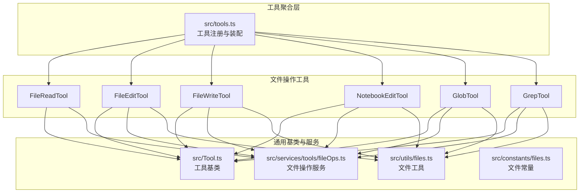
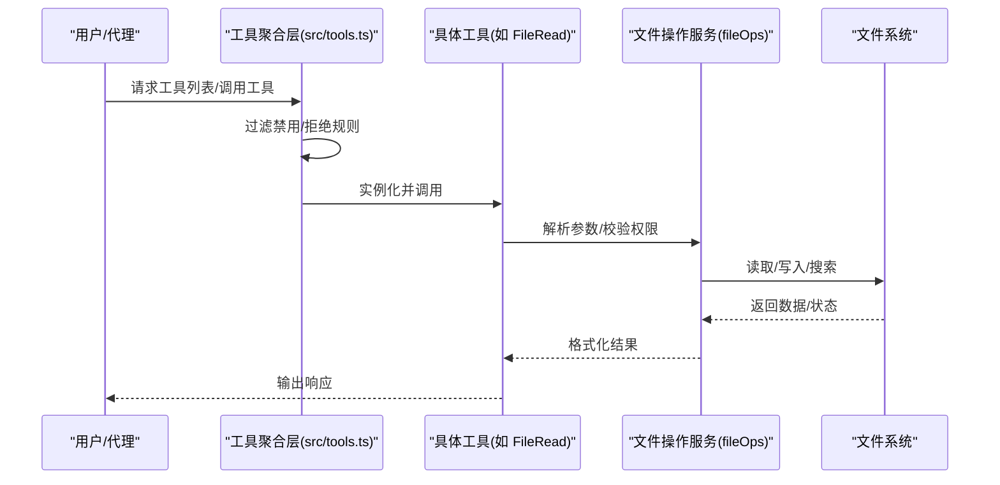
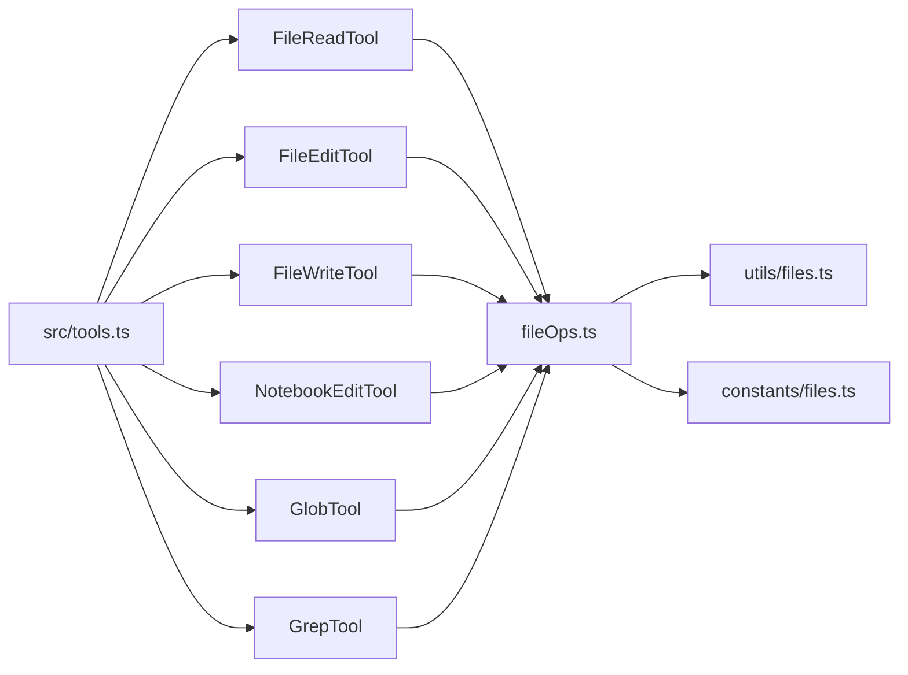
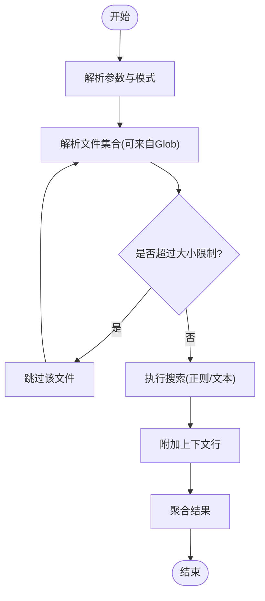

# 文件操作工具

<cite>
**本文引用的文件**
- [src/tools.ts](file://src/tools.ts)
- [src/tools/FileReadTool/FileReadTool.ts](file://src/tools/FileReadTool/FileReadTool.ts)
- [src/tools/FileEditTool/FileEditTool.ts](file://src/tools/FileEditTool/FileEditTool.ts)
- [src/tools/FileWriteTool/FileWriteTool.ts](file://src/tools/FileWriteTool/FileWriteTool.ts)
- [src/tools/NotebookEditTool/NotebookEditTool.ts](file://src/tools/NotebookEditTool/NotebookEditTool.ts)
- [src/tools/GlobTool/GlobTool.ts](file://src/tools/GlobTool/GlobTool.ts)
- [src/tools/GrepTool/GrepTool.ts](file://src/tools/GrepTool/GrepTool.ts)
- [src/Tool.ts](file://src/Tool.ts)
- [src/utils/files.ts](file://src/utils/files.ts)
- [src/constants/files.ts](file://src/constants/files.ts)
- [src/services/tools/fileOps.ts](file://src/services/tools/fileOps.ts)
- [src/components/FileEditToolDiff.tsx](file://src/components/FileEditToolDiff.tsx)
- [src/components/FileEditToolUpdatedMessage.tsx](file://src/components/FileEditToolUpdatedMessage.tsx)
- [src/components/NotebookEditToolUseRejectedMessage.tsx](file://src/components/NotebookEditToolUseRejectedMessage.tsx)
- [src/hooks/useFileHistorySnapshotInit.ts](file://src/hooks/useFileHistorySnapshotInit.ts)
- [src/utils/embeddedTools.ts](file://src/utils/embeddedTools.ts)
</cite>

## 目录
1. [简介](#简介)
2. [项目结构](#项目结构)
3. [核心组件](#核心组件)
4. [架构总览](#架构总览)
5. [详细组件分析](#详细组件分析)
6. [依赖关系分析](#依赖关系分析)
7. [性能考量](#性能考量)
8. [故障排除指南](#故障排除指南)
9. [结论](#结论)
10. [附录](#附录)

## 简介
本文件面向“文件操作工具”的使用者与维护者，系统性梳理以下内置工具：文件读取工具（FileRead）、文件编辑工具（FileEdit）、文件写入工具（FileWrite）、笔记本编辑工具（NotebookEdit）、文件通配符工具（Glob）、文件搜索工具（Grep）。文档覆盖功能特性、使用场景、参数配置、权限要求、安全限制、性能考虑、最佳实践以及组合使用模式，并对文件路径处理、内容编码、图像文件支持、笔记本格式处理等技术细节进行说明。

## 项目结构
文件操作工具作为系统内置工具集的一部分，统一由工具注册与装配模块管理。核心入口位于工具聚合层，各具体工具实现位于独立目录中，并通过通用基类与服务层协同工作。

图表来源
- [src/tools.ts:193-251](file://src/tools.ts#L193-L251)
- [src/Tool.ts](file://src/Tool.ts)
- [src/services/tools/fileOps.ts](file://src/services/tools/fileOps.ts)
- [src/utils/files.ts](file://src/utils/files.ts)
- [src/constants/files.ts](file://src/constants/files.ts)

章节来源
- [src/tools.ts:193-251](file://src/tools.ts#L193-L251)

## 核心组件
- 工具基类与接口：所有文件操作工具均继承自统一的工具抽象，具备一致的生命周期、权限校验与调用约定。
- 文件操作服务：封装底层文件系统访问、编码处理、路径解析与错误处理。
- 文件工具与常量：提供路径规范化、扩展名判断、大小限制、二进制检测等能力。
- 组合装配：根据运行环境与特性开关决定是否启用内置搜索工具（Glob/Grep），或使用嵌入式替代方案。

章节来源
- [src/Tool.ts](file://src/Tool.ts)
- [src/services/tools/fileOps.ts](file://src/services/tools/fileOps.ts)
- [src/utils/files.ts](file://src/utils/files.ts)
- [src/constants/files.ts](file://src/constants/files.ts)
- [src/utils/embeddedTools.ts](file://src/utils/embeddedTools.ts)

## 架构总览
文件操作工具的调用链路遵循“工具注册 → 权限过滤 → 服务执行 → 结果返回”的模式。当系统检测到可用的嵌入式搜索工具时，会优先使用它们以提升性能；否则回退到内置的 Glob/Grep 工具。

图表来源
- [src/tools.ts:271-327](file://src/tools.ts#L271-L327)
- [src/tools.ts:193-251](file://src/tools.ts#L193-L251)
- [src/services/tools/fileOps.ts](file://src/services/tools/fileOps.ts)

## 详细组件分析

### 文件读取工具（FileRead）
- 功能特性
  - 支持按路径读取文本文件内容，自动识别编码并进行解码。
  - 对超大文件进行安全限制，避免一次性加载导致内存压力。
  - 提供可选的上下文窗口（如前/后若干行）以辅助检索。
- 使用场景
  - 快速预览文件内容、提取关键信息、配合搜索定位。
  - 在对话中作为上下文输入，帮助模型理解文件背景。
- 参数配置
  - 路径：目标文件的绝对或相对路径。
  - 编码：显式指定或自动推断。
  - 行范围：可选的起止行号，用于截取片段。
  - 大小限制：受全局文件大小限制约束。
- 权限要求
  - 需要对该文件具有只读权限。
  - 受工具权限规则与拒绝规则过滤。
- 技术细节
  - 路径处理：统一归一化，防止路径穿越与越权访问。
  - 编码处理：优先采用 UTF-8，失败时尝试其他常见编码。
  - 图像文件支持：默认不读取二进制图像文件，除非明确允许且满足大小限制。
- 安全限制
  - 禁止读取敏感系统文件与隐藏文件（受常量与策略约束）。
  - 超过阈值的文件会被拒绝读取。
- 性能考虑
  - 建议仅读取必要片段，避免全量读取。
  - 对频繁读取的文件可结合缓存策略。
- 最佳实践
  - 明确指定编码，减少解码失败概率。
  - 使用行范围缩小输出，便于后续处理。
- 组合使用模式
  - 先用 Glob/搜索定位文件，再用 FileRead 读取具体内容。
- 故障排除
  - 若读取失败，检查路径是否存在、权限是否足够、文件是否被占用。
  - 调整行范围或关闭大小限制（若合理）。

章节来源
- [src/tools/FileReadTool/FileReadTool.ts](file://src/tools/FileReadTool/FileReadTool.ts)
- [src/services/tools/fileOps.ts](file://src/services/tools/fileOps.ts)
- [src/utils/files.ts](file://src/utils/files.ts)
- [src/constants/files.ts](file://src/constants/files.ts)

### 文件编辑工具（FileEdit）
- 功能特性
  - 基于补丁或替换的方式修改文件内容，支持高亮差异展示。
  - 自动检测冲突并提示合并策略。
  - 支持撤销与重做（视实现而定）。
- 使用场景
  - 批量替换、结构调整、注释增删、格式化。
  - 与搜索工具配合，先定位再编辑。
- 参数配置
  - 目标路径：待编辑文件。
  - 操作类型：插入、替换、删除、追加等。
  - 内容块：新旧内容或补丁。
  - 上下文：可选的前后文行数，用于增强定位准确性。
- 权限要求
  - 需要对该文件具有读写权限。
  - 受工具权限规则与拒绝规则过滤。
- 技术细节
  - 路径处理：严格归一化，禁止越权路径。
  - 编码处理：保持原文件编码一致性。
  - 差异展示：通过专用组件渲染变更前后对比。
- 安全限制
  - 禁止修改系统关键文件与受保护资源。
  - 超过阈值的文件会被拒绝编辑。
- 性能考虑
  - 大文件建议分段编辑，避免一次性写入。
  - 合理设置上下文，减少不必要的重算。
- 最佳实践
  - 先预览差异，确认无误后再提交。
  - 对重要文件保留备份。
- 组合使用模式
  - 使用 Grep/搜索定位匹配行，再用 FileEdit 应用替换。
- 故障排除
  - 若冲突，检查补丁是否与当前内容一致。
  - 若失败，确认文件未被外部进程锁定。

章节来源
- [src/tools/FileEditTool/FileEditTool.ts](file://src/tools/FileEditTool/FileEditTool.ts)
- [src/components/FileEditToolDiff.tsx](file://src/components/FileEditToolDiff.tsx)
- [src/components/FileEditToolUpdatedMessage.tsx](file://src/components/FileEditToolUpdatedMessage.tsx)
- [src/services/tools/fileOps.ts](file://src/services/tools/fileOps.ts)
- [src/utils/files.ts](file://src/utils/files.ts)

### 文件写入工具（FileWrite）
- 功能特性
  - 将内容写入指定路径，支持覆盖与追加模式。
  - 自动创建不存在的父级目录。
  - 支持原子写入（视平台与实现而定）。
- 使用场景
  - 新建配置文件、生成报告、批量导出。
  - 与编辑工具配合，完成最终落盘。
- 参数配置
  - 目标路径：输出文件路径。
  - 写入模式：覆盖或追加。
  - 内容：文本或二进制内容（需符合编码）。
  - 权限：可选的文件权限位（受平台支持）。
- 权限要求
  - 需要对目标路径具有写入权限。
  - 受工具权限规则与拒绝规则过滤。
- 技术细节
  - 路径处理：确保路径存在且合法。
  - 编码处理：按指定编码写入，UTF-8 为默认首选。
  - 目录创建：自动递归创建缺失的父目录。
- 安全限制
  - 禁止写入系统关键路径与受保护资源。
  - 超过阈值的文件会被拒绝写入。
- 性能考虑
  - 大文件写入建议分块写入，降低内存峰值。
  - 追加模式适合日志类输出。
- 最佳实践
  - 先写临时文件，再原子重命名，避免部分写入。
  - 对不可变文件使用备份策略。
- 组合使用模式
  - 使用 FileRead 读取模板，经处理后用 FileWrite 写入。
- 故障排除
  - 若写入失败，检查磁盘空间、权限与路径有效性。

章节来源
- [src/tools/FileWriteTool/FileWriteTool.ts](file://src/tools/FileWriteTool/FileWriteTool.ts)
- [src/services/tools/fileOps.ts](file://src/services/tools/fileOps.ts)
- [src/utils/files.ts](file://src/utils/files.ts)

### 笔记本编辑工具（NotebookEdit）
- 功能特性
  - 支持对 Jupyter 等笔记本格式进行单元编辑与更新。
  - 保持元数据与输出的一致性。
- 使用场景
  - 修改代码单元、更新说明文本、调整执行顺序。
- 参数配置
  - 笔记本路径：目标笔记本文件。
  - 单元索引：目标单元编号。
  - 新内容：单元的新代码或 Markdown 文本。
  - 元数据：可选的单元元数据更新。
- 权限要求
  - 需要对该文件具有读写权限。
  - 受工具权限规则与拒绝规则过滤。
- 技术细节
  - 格式解析：识别并解析笔记本内部结构。
  - 安全更新：避免破坏内核状态与输出缓存。
- 安全限制
  - 禁止修改受保护的系统笔记本。
  - 超过阈值的文件会被拒绝编辑。
- 性能考虑
  - 大型笔记本建议分单元处理，避免全量重载。
- 最佳实践
  - 修改前备份笔记本，确保可恢复。
  - 逐步验证单元执行结果。
- 组合使用模式
  - 使用 FileRead 读取笔记本，定位单元后用 NotebookEdit 更新。
- 故障排除
  - 若单元无法执行，检查语法与依赖。
  - 若格式异常，尝试用官方工具修复。

章节来源
- [src/tools/NotebookEditTool/NotebookEditTool.ts](file://src/tools/NotebookEditTool/NotebookEditTool.ts)
- [src/components/NotebookEditToolUseRejectedMessage.tsx](file://src/components/NotebookEditToolUseRejectedMessage.tsx)
- [src/services/tools/fileOps.ts](file://src/services/tools/fileOps.ts)
- [src/utils/files.ts](file://src/utils/files.ts)

### 文件通配符工具（Glob）
- 功能特性
  - 基于通配符表达式匹配文件集合，支持多层级目录遍历。
  - 可过滤隐藏文件、忽略大小写（可选）。
- 使用场景
  - 快速定位同类型文件、批量处理前的筛选。
- 参数配置
  - 模式：通配符表达式（如 *.ts、**/test/*.js）。
  - 排除：可选的排除模式列表。
  - 大小限制：受全局文件大小限制约束。
- 权限要求
  - 需要对匹配到的文件具有读取权限。
  - 受工具权限规则与拒绝规则过滤。
- 技术细节
  - 路径处理：统一归一化，防止路径穿越。
  - 性能优化：在嵌入式环境中优先使用内置搜索工具。
- 安全限制
  - 禁止匹配系统关键路径与受保护资源。
- 性能考虑
  - 合理使用排除模式，减少扫描范围。
  - 在大型仓库中优先使用嵌入式搜索工具。
- 最佳实践
  - 使用更精确的模式，避免过度匹配。
  - 与 FileRead/Grep 组合使用，先筛后查。
- 组合使用模式
  - 使用 Glob 获取候选文件列表，再用 FileRead/Grep 进一步筛选。
- 故障排除
  - 若无结果，检查模式是否正确或排除规则是否过于严格。

章节来源
- [src/tools/GlobTool/GlobTool.ts](file://src/tools/GlobTool/GlobTool.ts)
- [src/utils/embeddedTools.ts](file://src/utils/embeddedTools.ts)
- [src/services/tools/fileOps.ts](file://src/services/tools/fileOps.ts)
- [src/utils/files.ts](file://src/utils/files.ts)

### 文件搜索工具（Grep）
- 功能特性
  - 在文件内容中搜索正则表达式或固定字符串，支持多文件并发。
  - 提供上下文行、计数统计与高亮显示。
- 使用场景
  - 定位代码片段、查找配置项、审计敏感信息。
- 参数配置
  - 模式：正则表达式或纯文本。
  - 文件集合：可由 Glob 提供或直接传入。
  - 上下文：前后若干行用于定位。
  - 大小限制：受全局文件大小限制约束。
- 权限要求
  - 需要对匹配到的文件具有读取权限。
  - 受工具权限规则与拒绝规则过滤。
- 技术细节
  - 路径处理：统一归一化，防止路径穿越。
  - 性能优化：在嵌入式环境中优先使用内置搜索工具。
- 安全限制
  - 禁止搜索系统关键路径与受保护资源。
- 性能考虑
  - 合理使用排除模式与大小限制，避免全仓库扫描。
  - 在大型仓库中优先使用嵌入式搜索工具。
- 最佳实践
  - 使用锚点与边界限定提高命中精度。
  - 与 FileEdit 组合，先搜后改。
- 组合使用模式
  - 使用 Grep 定位匹配行，再用 FileEdit 应用替换。
- 故障排除
  - 若无结果，检查正则表达式或搜索范围。
  - 若性能差，缩小搜索范围或启用排除规则。

章节来源
- [src/tools/GrepTool/GrepTool.ts](file://src/tools/GrepTool/GrepTool.ts)
- [src/utils/embeddedTools.ts](file://src/utils/embeddedTools.ts)
- [src/services/tools/fileOps.ts](file://src/services/tools/fileOps.ts)
- [src/utils/files.ts](file://src/utils/files.ts)

## 依赖关系分析
- 工具聚合层负责装配与过滤，确保工具池稳定且受控。
- 文件操作工具依赖通用服务层与文件工具库，保证行为一致与安全。
- 在具备嵌入式搜索工具的环境下，Glob/Grep 会被条件性地从工具池中移除，以避免重复与冗余。

图表来源
- [src/tools.ts:193-251](file://src/tools.ts#L193-L251)
- [src/services/tools/fileOps.ts](file://src/services/tools/fileOps.ts)
- [src/utils/files.ts](file://src/utils/files.ts)
- [src/constants/files.ts](file://src/constants/files.ts)

章节来源
- [src/tools.ts:193-251](file://src/tools.ts#L193-L251)

## 性能考量
- 路径与文件大小
  - 统一路径归一化与大小限制，避免越权与内存溢出。
- 搜索效率
  - 在具备嵌入式搜索工具的环境中优先使用，减少跨语言桥接开销。
- I/O 模式
  - 大文件建议分块读取/写入，避免阻塞主线程。
- 并发与批处理
  - 对多文件操作采用并发但受限的策略，避免资源争用。
- 缓存与快照
  - 利用文件历史快照与增量更新，减少重复计算。

章节来源
- [src/utils/files.ts](file://src/utils/files.ts)
- [src/utils/embeddedTools.ts](file://src/utils/embeddedTools.ts)
- [src/hooks/useFileHistorySnapshotInit.ts](file://src/hooks/useFileHistorySnapshotInit.ts)

## 故障排除指南
- 权限相关
  - 确认工具权限规则与拒绝规则未阻止当前工具或路径。
- 路径问题
  - 检查路径是否归一化、是否存在、是否越权。
- 编码问题
  - 显式指定编码或接受自动推断，避免乱码。
- 大小限制
  - 调整大小限制或分批处理，避免被拒绝。
- 搜索无结果
  - 检查模式、排除规则与搜索范围。
- 编辑冲突
  - 预览差异，确认补丁与当前内容一致。

章节来源
- [src/tools.ts:262-269](file://src/tools.ts#L262-L269)
- [src/services/tools/fileOps.ts](file://src/services/tools/fileOps.ts)
- [src/utils/files.ts](file://src/utils/files.ts)

## 结论
文件操作工具围绕“安全、可控、高效”设计，通过统一的工具基类、服务层与文件工具库，实现了对文件读取、编辑、写入、通配符匹配与内容搜索的完整覆盖。在具备嵌入式搜索工具的环境中，系统进一步优化了性能与体验。建议在生产使用中遵循权限最小化、路径安全化与大小限制化的最佳实践，并结合组合使用模式提升效率与可靠性。

## 附录
- 组合使用模式示例
  - 定位：Glob/搜索 → 精确：FileRead → 修改：FileEdit → 落盘：FileWrite
  - 分析：Grep → 定位：NotebookEdit → 验证：FileRead
- 关键流程图（以 Grep 为例）

图表来源
- [src/tools/GrepTool/GrepTool.ts](file://src/tools/GrepTool/GrepTool.ts)
- [src/services/tools/fileOps.ts](file://src/services/tools/fileOps.ts)
- [src/utils/files.ts](file://src/utils/files.ts)