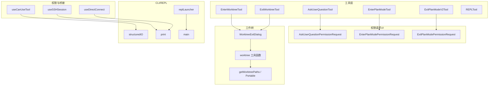
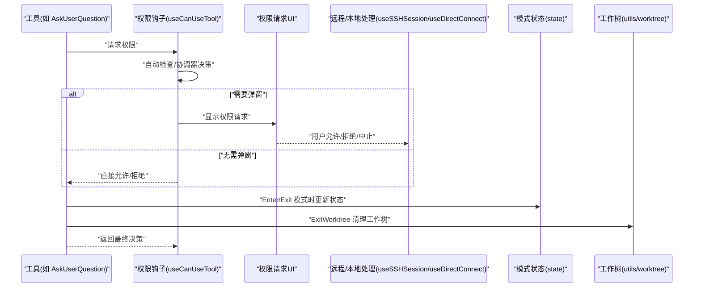
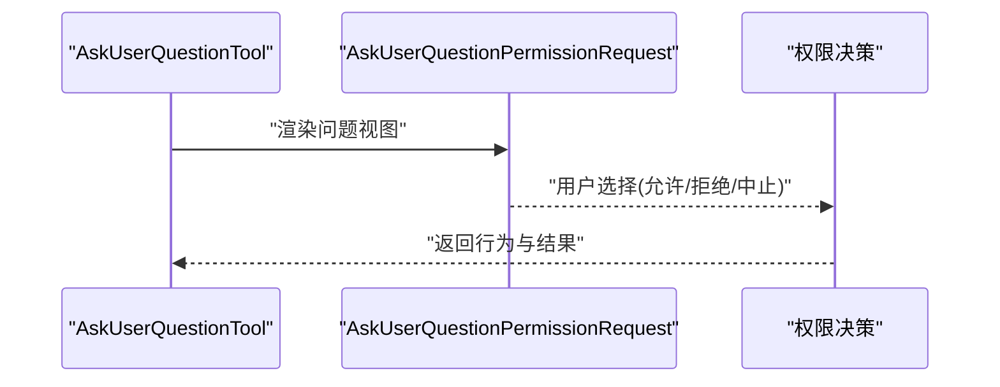
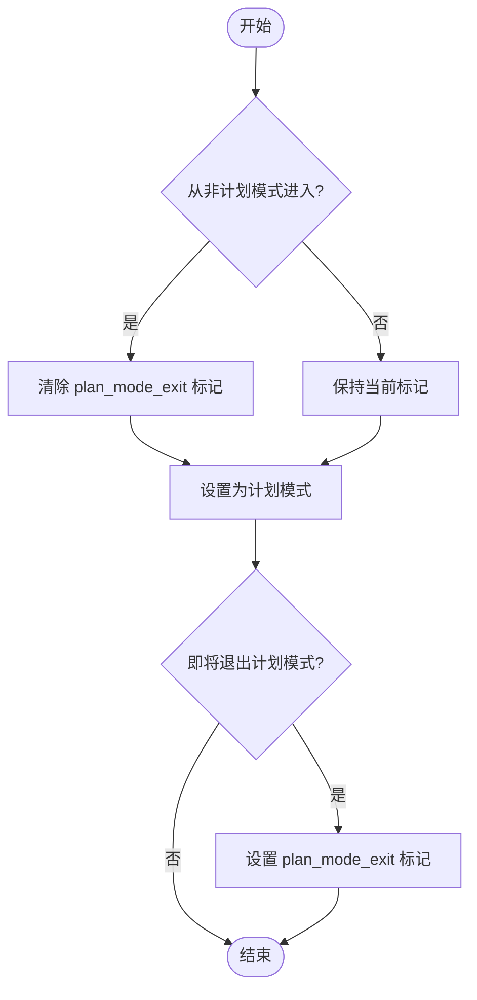
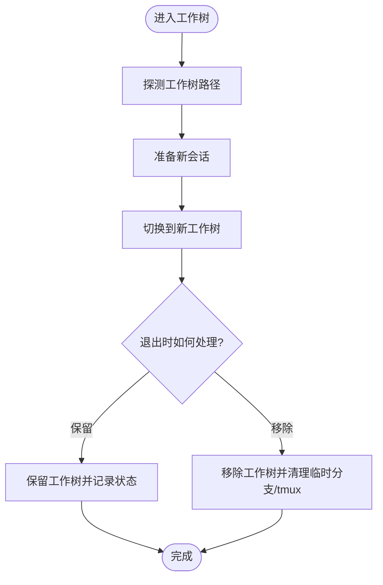
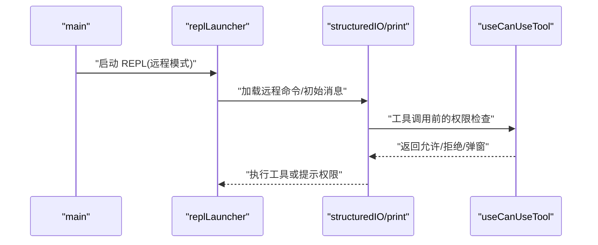
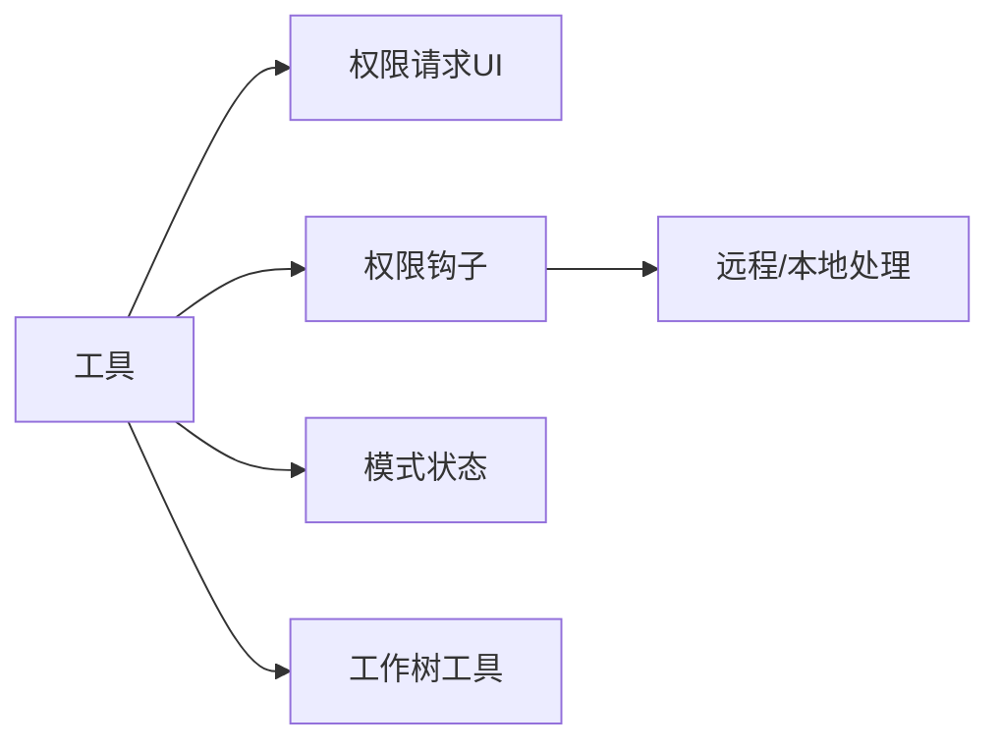

# 权限审批工具

<cite>
**本文引用的文件**
- [AskUserQuestionTool.tsx](file://src/tools/AskUserQuestionTool/AskUserQuestionTool.tsx)
- [AskUserQuestionPermissionRequest.tsx](file://src/components/permissions/AskUserQuestionPermissionRequest/AskUserQuestionPermissionRequest.tsx)
- [EnterPlanModeTool.ts](file://src/tools/EnterPlanModeTool/EnterPlanModeTool.ts)
- [EnterPlanModePermissionRequest.tsx](file://src/components/permissions/EnterPlanModePermissionRequest/EnterPlanModePermissionRequest.tsx)
- [ExitPlanModeV2Tool.ts](file://src/tools/ExitPlanModeTool/ExitPlanModeV2Tool.ts)
- [ExitPlanModePermissionRequest.tsx](file://src/components/permissions/ExitPlanModePermissionRequest/ExitPlanModePermissionRequest.tsx)
- [EnterWorktreeTool.ts](file://src/tools/EnterWorktreeTool/EnterWorktreeTool.ts)
- [ExitWorktreeTool.ts](file://src/tools/ExitWorktreeTool/ExitWorktreeTool.ts)
- [WorktreeExitDialog.tsx](file://src/components/WorktreeExitDialog.tsx)
- [worktree.ts](file://src/utils/worktree.ts)
- [getWorktreePaths.ts](file://src/utils/getWorktreePaths.ts)
- [getWorktreePathsPortable.ts](file://src/utils/getWorktreePathsPortable.ts)
- [useCanUseTool.tsx](file://src/hooks/useCanUseTool.tsx)
- [useSSHSession.ts](file://src/hooks/useSSHSession.ts)
- [useDirectConnect.ts](file://src/hooks/useDirectConnect.ts)
- [structuredIO.ts](file://src/cli/structuredIO.ts)
- [print.ts](file://src/cli/print.ts)
- [state.ts](file://src/bootstrap/state.ts)
- [replLauncher.tsx](file://src/replLauncher.tsx)
- [main.tsx](file://src/main.tsx)
</cite>

## 目录
1. [简介](#简介)
2. [项目结构](#项目结构)
3. [核心组件](#核心组件)
4. [架构总览](#架构总览)
5. [详细组件分析](#详细组件分析)
6. [依赖关系分析](#依赖关系分析)
7. [性能考量](#性能考量)
8. [故障排查指南](#故障排查指南)
9. [结论](#结论)
10. [附录](#附录)

## 简介
本文件面向“权限审批工具”的功能与实现，重点覆盖以下能力：
- 用户问答工具（AskUserQuestion）：通过交互式对话收集用户对工具使用的决策输入，支持多轮问答与预览。
- 计划模式工具（EnterPlanMode、ExitPlanMode）：在“计划模式”与常规模式之间切换，并维护会话状态与附件标记。
- 工作树模式工具（EnterWorktree、ExitWorktree）：在 Git 工作树之间切换与清理，提供保留或移除两种退出策略，并与 REPL 集成。
- 权限请求流程与用户确认机制：从工具调用到权限决策的完整链路，包括自动检查、弹窗确认、远程/本地分支处理。
- 安全控制与状态管理：权限状态、模式状态、工作树会话状态的持久化与一致性保障。

## 项目结构
围绕权限审批与模式/工作树管理的关键模块分布如下：
- 工具层：AskUserQuestion、EnterPlanMode、ExitPlanMode、EnterWorktree、ExitWorktree、REPLTool
- 权限请求 UI 组件：AskUserQuestionPermissionRequest、EnterPlanModePermissionRequest、ExitPlanModePermissionRequest
- 工作树工具与 UI：WorktreeExitDialog、worktree 工具函数、工作树路径探测
- 权限钩子与桥接：useCanUseTool、useSSHSession、useDirectConnect
- CLI 与 REPL 启动：structuredIO、print、replLauncher、main

**图表来源**
- [AskUserQuestionTool.tsx](file://src/tools/AskUserQuestionTool/AskUserQuestionTool.tsx)
- [EnterPlanModeTool.ts](file://src/tools/EnterPlanModeTool/EnterPlanModeTool.ts)
- [ExitPlanModeV2Tool.ts](file://src/tools/ExitPlanModeTool/ExitPlanModeV2Tool.ts)
- [EnterWorktreeTool.ts](file://src/tools/EnterWorktreeTool/EnterWorktreeTool.ts)
- [ExitWorktreeTool.ts](file://src/tools/ExitWorktreeTool/ExitWorktreeTool.ts)
- [AskUserQuestionPermissionRequest.tsx](file://src/components/permissions/AskUserQuestionPermissionRequest/AskUserQuestionPermissionRequest.tsx)
- [EnterPlanModePermissionRequest.tsx](file://src/components/permissions/EnterPlanModePermissionRequest/EnterPlanModePermissionRequest.tsx)
- [ExitPlanModePermissionRequest.tsx](file://src/components/permissions/ExitPlanModePermissionRequest/ExitPlanModePermissionRequest.tsx)
- [WorktreeExitDialog.tsx](file://src/components/WorktreeExitDialog.tsx)
- [worktree.ts](file://src/utils/worktree.ts)
- [getWorktreePaths.ts](file://src/utils/getWorktreePaths.ts)
- [getWorktreePathsPortable.ts](file://src/utils/getWorktreePathsPortable.ts)
- [useCanUseTool.tsx](file://src/hooks/useCanUseTool.tsx)
- [useSSHSession.ts](file://src/hooks/useSSHSession.ts)
- [useDirectConnect.ts](file://src/hooks/useDirectConnect.ts)
- [structuredIO.ts](file://src/cli/structuredIO.ts)
- [print.ts](file://src/cli/print.ts)
- [replLauncher.tsx](file://src/replLauncher.tsx)
- [main.tsx](file://src/main.tsx)

**章节来源**
- [AskUserQuestionTool.tsx](file://src/tools/AskUserQuestionTool/AskUserQuestionTool.tsx)
- [EnterPlanModeTool.ts](file://src/tools/EnterPlanModeTool/EnterPlanModeTool.ts)
- [ExitPlanModeV2Tool.ts](file://src/tools/ExitPlanModeTool/ExitPlanModeV2Tool.ts)
- [EnterWorktreeTool.ts](file://src/tools/EnterWorktreeTool/EnterWorktreeTool.ts)
- [ExitWorktreeTool.ts](file://src/tools/ExitWorktreeTool/ExitWorktreeTool.ts)
- [AskUserQuestionPermissionRequest.tsx](file://src/components/permissions/AskUserQuestionPermissionRequest/AskUserQuestionPermissionRequest.tsx)
- [EnterPlanModePermissionRequest.tsx](file://src/components/permissions/EnterPlanModePermissionRequest/EnterPlanModePermissionRequest.tsx)
- [ExitPlanModePermissionRequest.tsx](file://src/components/permissions/ExitPlanModePermissionRequest/ExitPlanModePermissionRequest.tsx)
- [WorktreeExitDialog.tsx](file://src/components/WorktreeExitDialog.tsx)
- [worktree.ts](file://src/utils/worktree.ts)
- [getWorktreePaths.ts](file://src/utils/getWorktreePaths.ts)
- [getWorktreePathsPortable.ts](file://src/utils/getWorktreePathsPortable.ts)
- [useCanUseTool.tsx](file://src/hooks/useCanUseTool.tsx)
- [useSSHSession.ts](file://src/hooks/useSSHSession.ts)
- [useDirectConnect.ts](file://src/hooks/useDirectConnect.ts)
- [structuredIO.ts](file://src/cli/structuredIO.ts)
- [print.ts](file://src/cli/print.ts)
- [replLauncher.tsx](file://src/replLauncher.tsx)
- [main.tsx](file://src/main.tsx)

## 核心组件
- 用户问答工具（AskUserQuestion）
  - 作用：以交互式问答形式向用户征求对特定工具使用请求的许可，支持问题预览与多轮确认。
  - 关键点：与权限请求 UI 组件配合，提供“允许/拒绝/中止”三态反馈；在 CLI/远程场景下统一走权限决策流程。
- 计划模式工具（EnterPlanMode、ExitPlanMode）
  - 作用：在“计划模式”与常规模式之间切换，维护会话内模式状态与退出附件标记，避免快速切换导致的重复附件。
  - 关键点：状态转换时清除/设置“需要发送 plan_mode_exit”的标记，确保消息语义清晰。
- 工作树模式工具（EnterWorktree、ExitWorktree）
  - 作用：进入/退出工作树环境，支持保留当前工作树或强制移除，清理临时分支与 tmux 会话。
  - 关键点：区分“hook 基于”与“git 基于”的工作树清理策略；提供退出对话框进行用户选择。
- REPL 工具与交互式编程
  - 作用：在 REPL 中提供交互式编程体验，结合远程/本地桥接与命令过滤，保证安全可控的执行环境。
  - 关键点：远程模式下预过滤命令集，启动时注入必要的初始消息与配置。

**章节来源**
- [AskUserQuestionTool.tsx](file://src/tools/AskUserQuestionTool/AskUserQuestionTool.tsx)
- [EnterPlanModeTool.ts](file://src/tools/EnterPlanModeTool/EnterPlanModeTool.ts)
- [ExitPlanModeV2Tool.ts](file://src/tools/ExitPlanModeTool/ExitPlanModeV2Tool.ts)
- [EnterWorktreeTool.ts](file://src/tools/EnterWorktreeTool/EnterWorktreeTool.ts)
- [ExitWorktreeTool.ts](file://src/tools/ExitWorktreeTool/ExitWorktreeTool.ts)
- [WorktreeExitDialog.tsx](file://src/components/WorktreeExitDialog.tsx)
- [worktree.ts](file://src/utils/worktree.ts)
- [replLauncher.tsx](file://src/replLauncher.tsx)
- [main.tsx](file://src/main.tsx)

## 架构总览
权限审批与模式/工作树管理的整体流程如下：
- 工具调用触发权限请求：工具通过统一的权限决策入口发起请求。
- 自动检查与弹窗确认：优先尝试自动化判断，若无法判定则弹出权限请求 UI。
- 远程/本地分支处理：根据运行环境（本地/远程）采用不同的响应路径。
- 模式与工作树状态更新：在 Enter/Exit 工具中更新内部状态与附件标记，清理工作树资源。
- REPL 集成：在 REPL 启动时注入远程命令集与初始消息，确保交互式编程的安全性。

**图表来源**
- [useCanUseTool.tsx](file://src/hooks/useCanUseTool.tsx)
- [useSSHSession.ts](file://src/hooks/useSSHSession.ts)
- [useDirectConnect.ts](file://src/hooks/useDirectConnect.ts)
- [AskUserQuestionTool.tsx](file://src/tools/AskUserQuestionTool/AskUserQuestionTool.tsx)
- [state.ts](file://src/bootstrap/state.ts)
- [worktree.ts](file://src/utils/worktree.ts)

## 详细组件分析

### 用户问答工具（AskUserQuestion）
- 交互式决策机制
  - 通过权限请求 UI 展示工具名称、输入摘要与描述，支持多选/问答预览。
  - 用户可选择“允许（可附带更新后的输入）”、“拒绝（可附带反馈）”或“中止（取消）”。
- 与权限系统集成
  - 在 CLI/远程环境中，统一由权限钩子与权限提示工具完成决策，避免工具直接访问敏感资源。
- 最佳实践
  - 提供明确的工具描述与输入预览，减少误操作。
  - 对可能影响系统的工具，建议默认拒绝并要求显式确认。

**图表来源**
- [AskUserQuestionTool.tsx](file://src/tools/AskUserQuestionTool/AskUserQuestionTool.tsx)
- [AskUserQuestionPermissionRequest.tsx](file://src/components/permissions/AskUserQuestionPermissionRequest/AskUserQuestionPermissionRequest.tsx)

**章节来源**
- [AskUserQuestionTool.tsx](file://src/tools/AskUserQuestionTool/AskUserQuestionTool.tsx)
- [AskUserQuestionPermissionRequest.tsx](file://src/components/permissions/AskUserQuestionPermissionRequest/AskUserQuestionPermissionRequest.tsx)

### 计划模式工具（EnterPlanMode、ExitPlanMode）
- 切换逻辑
  - 进入计划模式时清除“需要发送 plan_mode_exit”的标记，防止快速切换导致重复附件。
  - 退出计划模式时设置“需要发送 plan_mode_exit”，并在后续消息中附带退出信息。
- 状态管理
  - 使用全局状态模块维护会话内的模式切换标记，确保跨组件一致性。
- 最佳实践
  - 在频繁切换模式时，避免同时发送“进入/退出”两类附件，保持消息简洁明确。

**图表来源**
- [EnterPlanModeTool.ts](file://src/tools/EnterPlanModeTool/EnterPlanModeTool.ts)
- [ExitPlanModeV2Tool.ts](file://src/tools/ExitPlanModeTool/ExitPlanModeV2Tool.ts)
- [state.ts](file://src/bootstrap/state.ts)

**章节来源**
- [EnterPlanModeTool.ts](file://src/tools/EnterPlanModeTool/EnterPlanModeTool.ts)
- [ExitPlanModeV2Tool.ts](file://src/tools/ExitPlanModeTool/ExitPlanModeV2Tool.ts)
- [state.ts](file://src/bootstrap/state.ts)

### 工作树模式工具（EnterWorktree、ExitWorktree）
- 进入工作树
  - 识别当前仓库的工作树列表，解析当前工作树位置，准备新的工作树会话。
- 退出工作树
  - 提供“保留/移除”两种选项；移除时清理临时分支与 tmux 会话；保留时记录状态并返回原目录。
- 路径探测与清理
  - 支持“便携版”与“带分析版”两种路径探测方式；清理时区分 hook 基于与 git 基于的工作树类型。

**图表来源**
- [EnterWorktreeTool.ts](file://src/tools/EnterWorktreeTool/EnterWorktreeTool.ts)
- [ExitWorktreeTool.ts](file://src/tools/ExitWorktreeTool/ExitWorktreeTool.ts)
- [WorktreeExitDialog.tsx](file://src/components/WorktreeExitDialog.tsx)
- [worktree.ts](file://src/utils/worktree.ts)
- [getWorktreePaths.ts](file://src/utils/getWorktreePaths.ts)
- [getWorktreePathsPortable.ts](file://src/utils/getWorktreePathsPortable.ts)

**章节来源**
- [EnterWorktreeTool.ts](file://src/tools/EnterWorktreeTool/EnterWorktreeTool.ts)
- [ExitWorktreeTool.ts](file://src/tools/ExitWorktreeTool/ExitWorktreeTool.ts)
- [WorktreeExitDialog.tsx](file://src/components/WorktreeExitDialog.tsx)
- [worktree.ts](file://src/utils/worktree.ts)
- [getWorktreePaths.ts](file://src/utils/getWorktreePaths.ts)
- [getWorktreePathsPortable.ts](file://src/utils/getWorktreePathsPortable.ts)

### REPL 工具与交互式编程
- REPL 启动与远程模式
  - 在远程模式下预过滤命令集，仅暴露安全可用的命令；注入初始消息与远程配置。
- 与权限系统集成
  - REPL 中的工具调用同样遵循权限决策流程，确保交互式编程过程中的安全控制。

**图表来源**
- [main.tsx](file://src/main.tsx)
- [replLauncher.tsx](file://src/replLauncher.tsx)
- [structuredIO.ts](file://src/cli/structuredIO.ts)
- [print.ts](file://src/cli/print.ts)
- [useCanUseTool.tsx](file://src/hooks/useCanUseTool.tsx)

**章节来源**
- [main.tsx](file://src/main.tsx)
- [replLauncher.tsx](file://src/replLauncher.tsx)
- [structuredIO.ts](file://src/cli/structuredIO.ts)
- [print.ts](file://src/cli/print.ts)
- [useCanUseTool.tsx](file://src/hooks/useCanUseTool.tsx)

## 依赖关系分析
- 工具与权限请求 UI 的耦合
  - 工具通过权限请求 UI 组件展示与收集用户决策，UI 组件负责呈现与交互。
- 权限钩子与远程处理的协作
  - useCanUseTool 负责自动化判断与协调器决策；useSSHSession/useDirectConnect 处理远程/本地分支的响应。
- 模式与工作树状态的集中管理
  - state 模块提供模式切换标记；worktree 工具函数负责工作树生命周期管理。

**图表来源**
- [useCanUseTool.tsx](file://src/hooks/useCanUseTool.tsx)
- [useSSHSession.ts](file://src/hooks/useSSHSession.ts)
- [useDirectConnect.ts](file://src/hooks/useDirectConnect.ts)
- [state.ts](file://src/bootstrap/state.ts)
- [worktree.ts](file://src/utils/worktree.ts)

**章节来源**
- [useCanUseTool.tsx](file://src/hooks/useCanUseTool.tsx)
- [useSSHSession.ts](file://src/hooks/useSSHSession.ts)
- [useDirectConnect.ts](file://src/hooks/useDirectConnect.ts)
- [state.ts](file://src/bootstrap/state.ts)
- [worktree.ts](file://src/utils/worktree.ts)

## 性能考量
- 工作树路径探测
  - “便携版”探测不引入额外依赖，适合 SDK/无 CLI 环境；“带分析版”包含性能指标与日志，适合诊断与监控。
- 权限决策的并发控制
  - CLI 层通过竞态控制（race）等待权限提示工具与中止信号，避免长时间阻塞。
- REPL 启动与命令过滤
  - 远程模式下预过滤命令集，减少不必要的初始化开销。

**章节来源**
- [getWorktreePaths.ts](file://src/utils/getWorktreePaths.ts)
- [getWorktreePathsPortable.ts](file://src/utils/getWorktreePathsPortable.ts)
- [structuredIO.ts](file://src/cli/structuredIO.ts)
- [print.ts](file://src/cli/print.ts)
- [main.tsx](file://src/main.tsx)

## 故障排查指南
- 权限请求未弹窗或被自动拒绝
  - 检查权限钩子是否启用自动化判断；查看自动模式拒绝通知与日志。
- 远程/本地响应异常
  - 确认 useSSHSession/useDirectConnect 的回调是否正确触发；检查远程权限响应结构。
- 工作树清理失败
  - 查看工作树清理日志与错误输出；确认是否为 hook 基于或 git 基于的不同清理路径。
- REPL 启动后命令不可用
  - 检查远程命令过滤逻辑与初始消息注入；确认远程配置是否正确。

**章节来源**
- [useCanUseTool.tsx](file://src/hooks/useCanUseTool.tsx)
- [useSSHSession.ts](file://src/hooks/useSSHSession.ts)
- [useDirectConnect.ts](file://src/hooks/useDirectConnect.ts)
- [worktree.ts](file://src/utils/worktree.ts)
- [main.tsx](file://src/main.tsx)

## 结论
权限审批工具通过“工具—权限钩子—UI—远程/本地处理”的分层设计，实现了对用户交互、模式切换与工作树管理的统一控制。AskUserQuestion 提供直观的交互式决策入口；Enter/Exit PlanMode 与 Enter/Exit Worktree 工具分别负责模式与工作树状态的维护；REPL 集成确保交互式编程的安全可控。建议在涉及高风险操作时，默认拒绝并要求显式确认，同时利用便携式工作树探测与远程命令过滤提升稳定性与安全性。

## 附录
- 最佳实践清单
  - 明确工具描述与输入预览，降低误操作概率。
  - 对高风险工具默认拒绝，要求显式确认。
  - 在频繁切换模式/工作树时，避免重复发送附件，保持消息简洁。
  - 使用便携式探测与远程命令过滤，提升跨环境兼容性与安全性。
- 用户体验优化建议
  - 在权限请求 UI 中提供“记住我的选择”与“默认行为”选项。
  - 在 REPL 中提供“帮助/历史/快捷键”提示，降低学习成本。
  - 在工作树退出时提供简要总结（提交数、变更文件数），便于回顾。