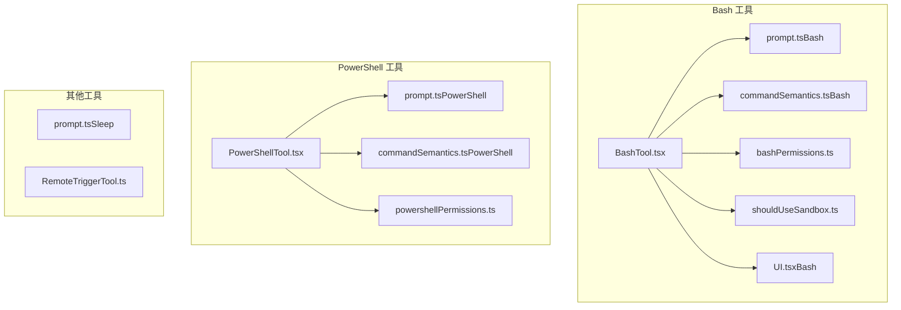
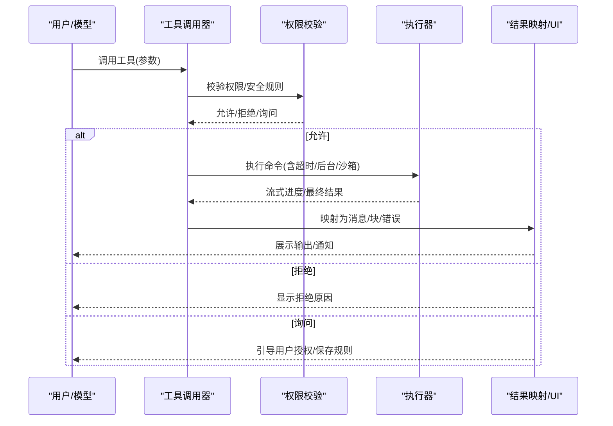
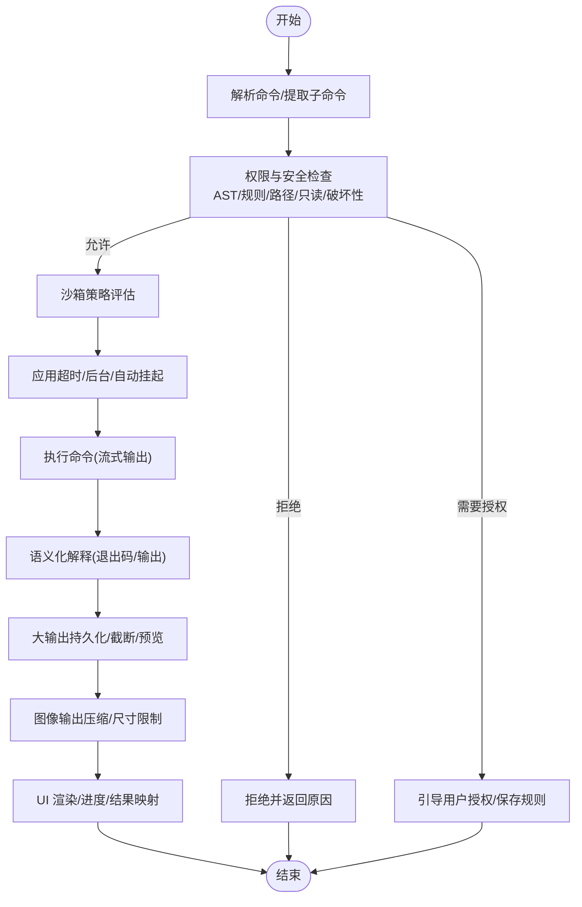
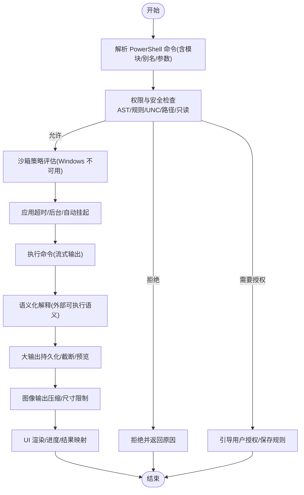
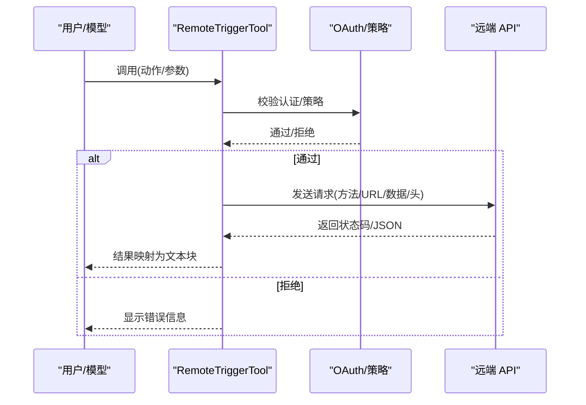
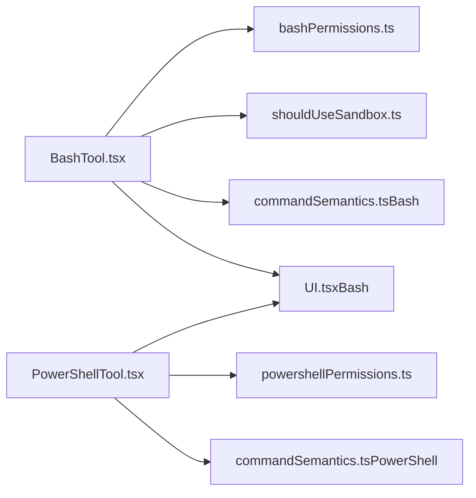

# 系统工具

<cite>
**本文引用的文件**
- [BashTool.tsx](file://src/tools/BashTool/BashTool.tsx)
- [prompt.ts（Bash）](file://src/tools/BashTool/prompt.ts)
- [commandSemantics.ts（Bash）](file://src/tools/BashTool/commandSemantics.ts)
- [bashPermissions.ts](file://src/tools/BashTool/bashPermissions.ts)
- [shouldUseSandbox.ts](file://src/tools/BashTool/shouldUseSandbox.ts)
- [UI.tsx（Bash）](file://src/tools/BashTool/UI.tsx)
- [PowerShellTool.tsx](file://src/tools/PowerShellTool/PowerShellTool.tsx)
- [prompt.ts（PowerShell）](file://src/tools/PowerShellTool/prompt.ts)
- [commandSemantics.ts（PowerShell）](file://src/tools/PowerShellTool/commandSemantics.ts)
- [powershellPermissions.ts](file://src/tools/PowerShellTool/powershellPermissions.ts)
- [prompt.ts（Sleep）](file://src/tools/SleepTool/prompt.ts)
- [RemoteTriggerTool.ts](file://src/tools/RemoteTriggerTool/RemoteTriggerTool.ts)
</cite>

## 目录
1. [简介](#简介)
2. [项目结构](#项目结构)
3. [核心组件](#核心组件)
4. [架构总览](#架构总览)
5. [详细组件分析](#详细组件分析)
6. [依赖关系分析](#依赖关系分析)
7. [性能考量](#性能考量)
8. [故障排查指南](#故障排查指南)
9. [结论](#结论)
10. [附录](#附录)

## 简介
本文件面向系统工具的使用者与维护者，系统性阐述以下工具的能力边界、执行机制、安全限制与权限控制，并提供可操作的最佳实践与故障排查建议：
- Bash 命令工具（BashTool）
- PowerShell 工具（PowerShellTool）
- 睡眠工具（SleepTool）
- 远程触发工具（RemoteTriggerTool）

内容覆盖命令解析、输出处理、错误处理、超时控制、后台任务与自动挂起、沙箱策略、权限与安全规则、跨平台差异与平台特定限制等。

## 项目结构
系统工具位于 src/tools 下，每个工具以独立目录组织，包含：
- 工具主实现（如 BashTool.tsx、PowerShellTool.tsx）
- 提示词与默认行为（prompt.ts）
- 命令语义解释（commandSemantics.ts）
- 权限与安全检查（bashPermissions.ts、powershellPermissions.ts）
- 沙箱策略（shouldUseSandbox.ts）
- UI 渲染与进度展示（UI.tsx）

**图表来源**
- [BashTool.tsx](file://src/tools/BashTool/BashTool.tsx)
- [prompt.ts（Bash）](file://src/tools/BashTool/prompt.ts)
- [commandSemantics.ts（Bash）](file://src/tools/BashTool/commandSemantics.ts)
- [bashPermissions.ts](file://src/tools/BashTool/bashPermissions.ts)
- [shouldUseSandbox.ts](file://src/tools/BashTool/shouldUseSandbox.ts)
- [UI.tsx（Bash）](file://src/tools/BashTool/UI.tsx)
- [PowerShellTool.tsx](file://src/tools/PowerShellTool/PowerShellTool.tsx)
- [prompt.ts（PowerShell）](file://src/tools/PowerShellTool/prompt.ts)
- [commandSemantics.ts（PowerShell）](file://src/tools/PowerShellTool/commandSemantics.ts)
- [powershellPermissions.ts](file://src/tools/PowerShellTool/powershellPermissions.ts)
- [prompt.ts（Sleep）](file://src/tools/SleepTool/prompt.ts)
- [RemoteTriggerTool.ts](file://src/tools/RemoteTriggerTool/RemoteTriggerTool.ts)

**章节来源**
- [BashTool.tsx](file://src/tools/BashTool/BashTool.tsx)
- [PowerShellTool.tsx](file://src/tools/PowerShellTool/PowerShellTool.tsx)
- [prompt.ts（Bash）](file://src/tools/BashTool/prompt.ts)
- [prompt.ts（PowerShell）](file://src/tools/PowerShellTool/prompt.ts)
- [prompt.ts（Sleep）](file://src/tools/SleepTool/prompt.ts)
- [RemoteTriggerTool.ts](file://src/tools/RemoteTriggerTool/RemoteTriggerTool.ts)

## 核心组件
- BashTool：在类 Unix 环境执行 shell 命令，支持后台运行、自动挂起、超时控制、大输出持久化、图像输出压缩、进度流式反馈、权限与安全检查、沙箱策略。
- PowerShellTool：在 Windows 平台执行 PowerShell 命令，支持后台运行、自动挂起、超时控制、大输出持久化、图像输出压缩、进度流式反馈、权限与安全检查、沙箱策略（Windows 平台限制）。
- SleepTool：提供轻量级时间控制，避免占用 shell 进程，适合并发调用与周期性唤醒。
- RemoteTriggerTool：通过 OAuth 认证访问远端触发器资源，支持列出、查询、创建、更新、触发远程任务，受功能开关与策略限制。

**章节来源**
- [BashTool.tsx](file://src/tools/BashTool/BashTool.tsx)
- [PowerShellTool.tsx](file://src/tools/PowerShellTool/PowerShellTool.tsx)
- [prompt.ts（Sleep）](file://src/tools/SleepTool/prompt.ts)
- [RemoteTriggerTool.ts](file://src/tools/RemoteTriggerTool/RemoteTriggerTool.ts)

## 架构总览
系统工具遵循统一的工具抽象（buildTool），围绕输入/输出模式、权限检查、执行器、结果映射与 UI 展示构建。BashTool 与 PowerShellTool 共享大量通用能力（超时、后台、进度、大输出处理、图像输出、错误语义解释），并在平台差异处做适配。

**图表来源**
- [BashTool.tsx](file://src/tools/BashTool/BashTool.tsx)
- [PowerShellTool.tsx](file://src/tools/PowerShellTool/PowerShellTool.tsx)
- [bashPermissions.ts](file://src/tools/BashTool/bashPermissions.ts)
- [powershellPermissions.ts](file://src/tools/PowerShellTool/powershellPermissions.ts)

## 详细组件分析

### BashTool 组件分析
- 命令解析与 UI 可折叠：根据命令类型（搜索/读取/列表）决定 UI 折叠与摘要提示，提升可读性。
- 后台运行与自动挂起：支持 run_in_background 参数；阻塞型命令（如 sleep）在特定条件下被阻止或自动挂起，避免阻塞助手。
- 超时与中断：基于配置的最大超时与默认超时，支持中断信号，区分用户中断与进程异常中断。
- 输出处理：支持大输出持久化到工具结果目录，自动截断与预览生成；图像输出压缩与尺寸限制；空行清理与提示标签剥离。
- 错误处理：基于命令语义解释（如 grep/ripgrep 的“无匹配”非错误），结合退出码与标准错误进行语义化解读；非零退出码在特定情况下不视为错误。
- 权限与安全：多层安全检查（AST 解析、前缀规则、环境变量剥离、重定向目标路径约束、只读模式验证、破坏性命令警告、沙箱排除命令等）；支持分类器辅助决策。
- 沙箱策略：根据设置与策略决定是否启用沙箱；支持用户自定义“排除命令”；Windows 平台不支持沙箱。
- 并发与一致性：只读命令具备并发安全属性；复杂复合命令拆分为子命令逐一评估。

**图表来源**
- [BashTool.tsx](file://src/tools/BashTool/BashTool.tsx)
- [bashPermissions.ts](file://src/tools/BashTool/bashPermissions.ts)
- [shouldUseSandbox.ts](file://src/tools/BashTool/shouldUseSandbox.ts)
- [commandSemantics.ts（Bash）](file://src/tools/BashTool/commandSemantics.ts)
- [UI.tsx（Bash）](file://src/tools/BashTool/UI.tsx)

**章节来源**
- [BashTool.tsx](file://src/tools/BashTool/BashTool.tsx)
- [prompt.ts（Bash）](file://src/tools/BashTool/prompt.ts)
- [commandSemantics.ts（Bash）](file://src/tools/BashTool/commandSemantics.ts)
- [bashPermissions.ts](file://src/tools/BashTool/bashPermissions.ts)
- [shouldUseSandbox.ts](file://src/tools/BashTool/shouldUseSandbox.ts)
- [UI.tsx（Bash）](file://src/tools/BashTool/UI.tsx)

### PowerShellTool 组件分析
- 命令解析与 UI 可折叠：基于 PowerShell 语法与 cmdlet 类型识别搜索/读取操作，支持 UI 折叠与摘要提示。
- 后台运行与自动挂起：与 BashTool 类似的后台与自动挂起策略；阻塞型命令（Start-Sleep/sleep）在特定条件下被阻止或自动挂起。
- 超时与中断：统一的超时与中断处理逻辑；区分用户中断与其他中断场景。
- 输出处理：大输出持久化、截断与预览；图像输出压缩；提示标签剥离；背景任务 ID 注入以便后续通知。
- 错误处理：基于外部可执行程序的语义解释（如 grep/ripgrep/findstr/robocopy 等），避免将“无匹配/复制成功但带位标志”误判为错误。
- 权限与安全：基于 AST 的命令名解析、模块限定名处理、别名标准化、路径重定向检查、只读/安全输出命令识别、破坏性命令识别、UNC 路径风险检测；支持精确/前缀/通配规则匹配与建议。
- 沙箱策略：Windows 平台不支持沙箱；若企业策略要求沙箱且不可绕过，则直接拒绝执行。
- 并发与一致性：只读命令具备并发安全属性；复杂复合命令拆分为子命令逐一评估。

**图表来源**
- [PowerShellTool.tsx](file://src/tools/PowerShellTool/PowerShellTool.tsx)
- [powershellPermissions.ts](file://src/tools/PowerShellTool/powershellPermissions.ts)
- [commandSemantics.ts（PowerShell）](file://src/tools/PowerShellTool/commandSemantics.ts)

**章节来源**
- [PowerShellTool.tsx](file://src/tools/PowerShellTool/PowerShellTool.tsx)
- [prompt.ts（PowerShell）](file://src/tools/PowerShellTool/prompt.ts)
- [commandSemantics.ts（PowerShell）](file://src/tools/PowerShellTool/commandSemantics.ts)
- [powershellPermissions.ts](file://src/tools/PowerShellTool/powershellPermissions.ts)

### SleepTool 组件分析
- 功能定位：提供轻量级时间控制，避免占用 shell 进程，适合并发调用与周期性唤醒。
- 使用建议：优先使用该工具而非 Bash(sleep ...)，以减少资源占用与 API 调用成本。
- 交互特性：支持周期性唤醒（tick）提示，便于在空闲状态下保持对话活性。

**章节来源**
- [prompt.ts（Sleep）](file://src/tools/SleepTool/prompt.ts)

### RemoteTriggerTool 组件分析
- 功能定位：管理远程代理触发器，支持列出、查询、创建、更新、触发远程任务。
- 认证与策略：依赖 OAuth 令牌与组织 UUID；受功能开关与策略限制（如 allow_remote_sessions）。
- 请求流程：根据 action 分派 GET/POST 请求，携带必要的头部与超时控制，返回状态码与 JSON 内容。
- 并发与只读：根据 action 判断是否只读（list/get），其余为写操作。

**图表来源**
- [RemoteTriggerTool.ts](file://src/tools/RemoteTriggerTool/RemoteTriggerTool.ts)

**章节来源**
- [RemoteTriggerTool.ts](file://src/tools/RemoteTriggerTool/RemoteTriggerTool.ts)

## 依赖关系分析
- 工具抽象：所有工具均通过 buildTool 构建，共享输入/输出模式、权限接口、UI 渲染与进度回调。
- 执行器：BashTool 使用 runShellCommand，PowerShellTool 使用 runPowerShellCommand，二者均支持超时、后台、进度回调、大输出持久化与中断处理。
- 安全与权限：BashTool 依赖 bashPermissions.ts（AST/规则/路径/只读/破坏性/沙箱排除），PowerShellTool 依赖 powershellPermissions.ts（AST/规则/UNC/路径/只读/破坏性/模块限定名）。
- 语义解释：BashTool 使用 commandSemantics.ts（grep/ripgrep/find/diff/test 等），PowerShellTool 使用 commandSemantics.ts（外部可执行语义解释）。
- 沙箱策略：BashTool 使用 shouldUseSandbox.ts（动态排除命令/策略），PowerShellTool 在 Windows 平台不支持沙箱。

**图表来源**
- [BashTool.tsx](file://src/tools/BashTool/BashTool.tsx)
- [bashPermissions.ts](file://src/tools/BashTool/bashPermissions.ts)
- [shouldUseSandbox.ts](file://src/tools/BashTool/shouldUseSandbox.ts)
- [commandSemantics.ts（Bash）](file://src/tools/BashTool/commandSemantics.ts)
- [PowerShellTool.tsx](file://src/tools/PowerShellTool/PowerShellTool.tsx)
- [powershellPermissions.ts](file://src/tools/PowerShellTool/powershellPermissions.ts)
- [commandSemantics.ts（PowerShell）](file://src/tools/PowerShellTool/commandSemantics.ts)
- [UI.tsx（Bash）](file://src/tools/BashTool/UI.tsx)

**章节来源**
- [BashTool.tsx](file://src/tools/BashTool/BashTool.tsx)
- [PowerShellTool.tsx](file://src/tools/PowerShellTool/PowerShellTool.tsx)
- [bashPermissions.ts](file://src/tools/BashTool/bashPermissions.ts)
- [powershellPermissions.ts](file://src/tools/PowerShellTool/powershellPermissions.ts)
- [shouldUseSandbox.ts](file://src/tools/BashTool/shouldUseSandbox.ts)
- [commandSemantics.ts（Bash）](file://src/tools/BashTool/commandSemantics.ts)
- [commandSemantics.ts（PowerShell）](file://src/tools/PowerShellTool/commandSemantics.ts)
- [UI.tsx（Bash）](file://src/tools/BashTool/UI.tsx)

## 性能考量
- 大输出持久化：当输出超过阈值时，自动落盘并生成预览，避免内存压力与模型侧传输开销。
- 图像输出压缩：对终端图像输出进行尺寸与字节数限制，降低传输与渲染成本。
- 后台运行与自动挂起：长耗时命令自动转入后台，避免阻塞主线程与对话响应。
- 流式进度：通过进度回调实时反馈输出增量，改善用户体验。
- 并发安全：只读命令具备并发安全属性，可并行调用以提升吞吐。

[本节为通用指导，无需具体文件引用]

## 故障排查指南
- 命令被阻止（BashTool）：
  - 检查是否为阻塞型命令（sleep ≥ 2 秒）且未使用 run_in_background。
  - 查看权限规则（deny/ask/allow）与建议；必要时调整规则或使用允许列表。
  - 若为沙箱限制导致失败，考虑使用 dangerouslyDisableSandbox（需满足策略允许）。
- PowerShell 无法执行（Windows）：
  - 若企业策略要求沙箱且不可绕过，将直接拒绝执行。
  - 确认 PowerShell 可执行文件存在与版本兼容性。
- 大输出未显示：
  - 确认已生成持久化文件与预览；模型侧将收到“查看工具结果目录”的提示。
- 退出码与错误混淆：
  - BashTool：grep/ripgrep/ find 等“无匹配”被视为成功；diff/ test 等按语义解释。
  - PowerShellTool：robocopy 等外部工具的位标志需按语义解释，避免误报错误。
- UNC 路径风险：
  - PowerShellTool 对包含 UNC 路径的命令会触发询问，避免潜在网络请求与凭据泄露。

**章节来源**
- [BashTool.tsx](file://src/tools/BashTool/BashTool.tsx)
- [PowerShellTool.tsx](file://src/tools/PowerShellTool/PowerShellTool.tsx)
- [bashPermissions.ts](file://src/tools/BashTool/bashPermissions.ts)
- [powershellPermissions.ts](file://src/tools/PowerShellTool/powershellPermissions.ts)
- [commandSemantics.ts（Bash）](file://src/tools/BashTool/commandSemantics.ts)
- [commandSemantics.ts（PowerShell）](file://src/tools/PowerShellTool/commandSemantics.ts)

## 结论
系统工具在保证安全性与合规性的前提下，提供了强大的命令执行能力与良好的用户体验。BashTool 与 PowerShellTool 在权限、安全、超时、后台与输出处理方面高度一致，仅在平台差异（沙箱可用性、语法与工具集）上有所区别。SleepTool 与 RemoteTriggerTool 则分别承担时间控制与远程会话管理职责，补充了系统工具链的完整性。

[本节为总结性内容，无需具体文件引用]

## 附录

### 安全使用指南与最佳实践
- 优先使用专用工具替代通用命令（如文件读写/编辑/搜索使用 FileRead/FileEdit/Glob/Grep 等），以获得更好的权限控制与体验。
- 避免不必要的 sleep 或轮询；长耗时任务使用 run_in_background 获取完成通知。
- 对可能产生副作用的命令（删除/修改/推送/安装）谨慎使用，确保有明确的只读/破坏性检查与权限规则。
- 在 Windows 上，若企业策略要求沙箱且不可绕过，请遵循策略限制，不要尝试规避。
- 对于外部可执行程序（如 grep/ripgrep/findstr/robocopy），理解其退出码与语义，避免误判为错误。
- 对于 PowerShell，注意版本差异（5.1 与 7+）带来的语法与特性差异，必要时使用条件分支或兼容写法。
- 对于远程触发器，确保已登录并具备相应组织权限，遵守功能开关与策略限制。

[本节为通用指导，无需具体文件引用]