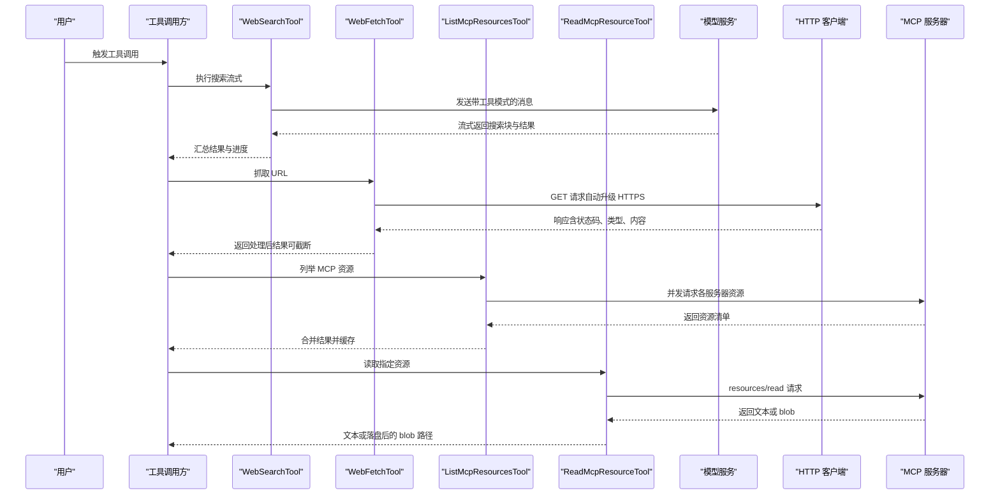
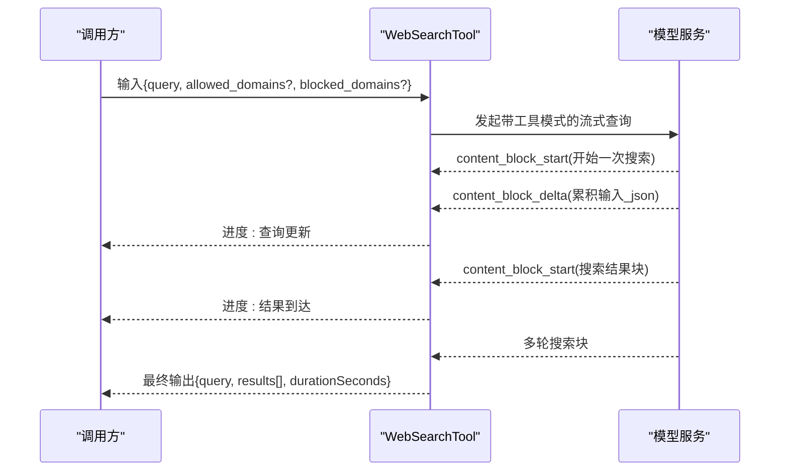
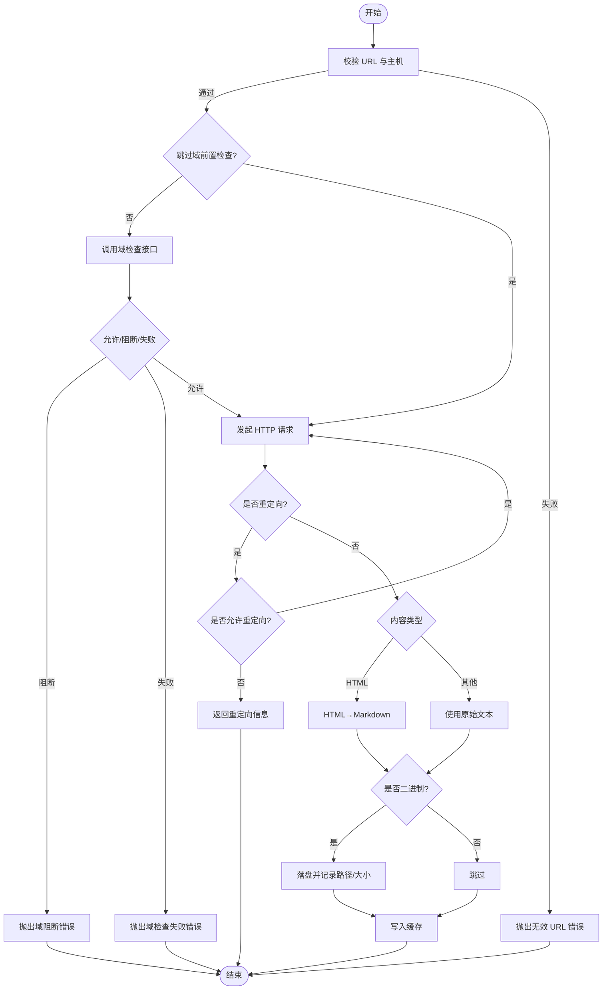
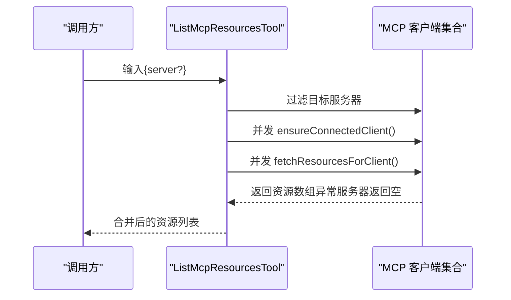
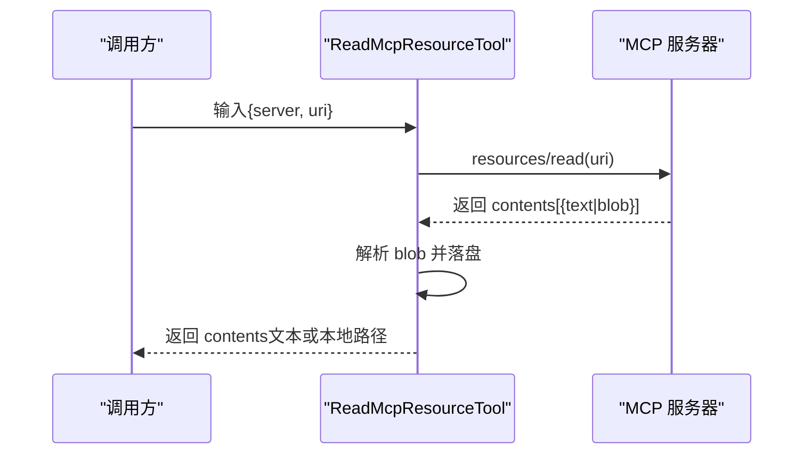
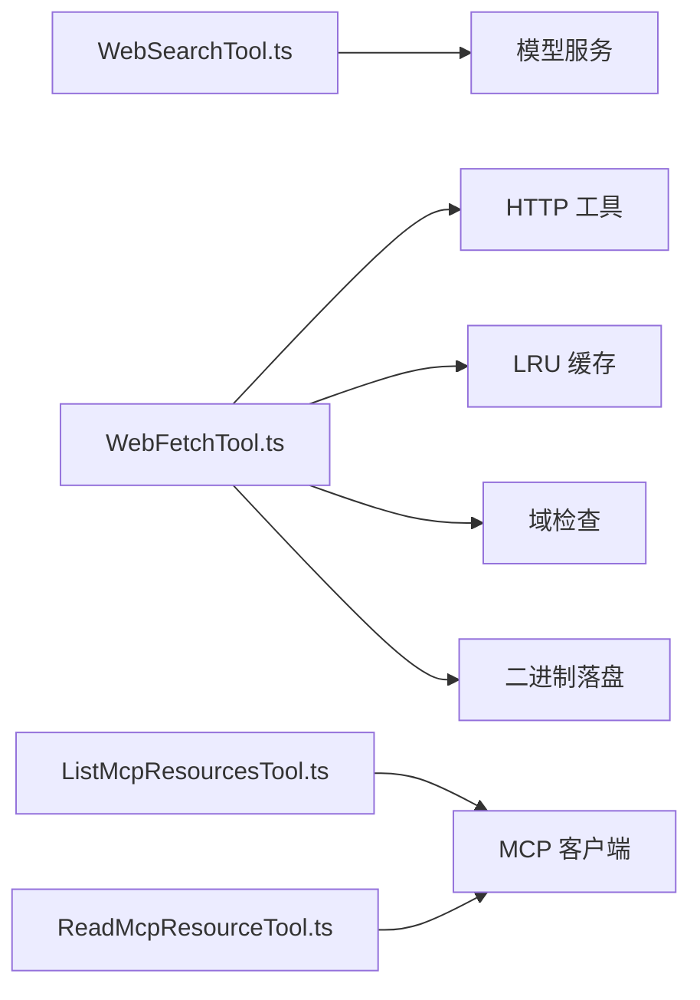

# 网络工具

<cite>
**本文引用的文件**
- [WebSearchTool.ts](file://src/tools/WebSearchTool/WebSearchTool.ts)
- [WebSearch prompt.ts](file://src/tools/WebSearchTool/prompt.ts)
- [WebSearch UI.tsx](file://src/tools/WebSearchTool/UI.tsx)
- [WebFetchTool.ts](file://src/tools/WebFetchTool/WebFetchTool.ts)
- [WebFetch prompt.ts](file://src/tools/WebFetchTool/prompt.ts)
- [WebFetch utils.ts](file://src/tools/WebFetchTool/utils.ts)
- [WebFetch preapproved.ts](file://src/tools/WebFetchTool/preapproved.ts)
- [WebFetch UI.tsx](file://src/tools/WebFetchTool/UI.tsx)
- [ListMcpResourcesTool.ts](file://src/tools/ListMcpResourcesTool/ListMcpResourcesTool.ts)
- [ListMcpResources prompt.ts](file://src/tools/ListMcpResourcesTool/prompt.ts)
- [ListMcpResources UI.tsx](file://src/tools/ListMcpResourcesTool/UI.tsx)
- [ReadMcpResourceTool.ts](file://src/tools/ReadMcpResourceTool/ReadMcpResourceTool.ts)
- [ReadMcpResource prompt.ts](file://src/tools/ReadMcpResourceTool/prompt.ts)
- [ReadMcpResource UI.tsx](file://src/tools/ReadMcpResourceTool/UI.tsx)
</cite>

## 目录
1. [简介](#简介)
2. [项目结构](#项目结构)
3. [核心组件](#核心组件)
4. [架构总览](#架构总览)
5. [详细组件分析](#详细组件分析)
6. [依赖关系分析](#依赖关系分析)
7. [性能考量](#性能考量)
8. [故障排查指南](#故障排查指南)
9. [结论](#结论)
10. [附录](#附录)

## 简介
本文件面向网络工具的使用者与维护者，系统性梳理以下能力：
- 网页搜索工具（WebSearch）：基于模型的搜索调用流程、结果聚合与进度反馈。
- 网页获取工具（WebFetch）：HTTP(S)抓取、HTML 到 Markdown 的转换、内容长度与二进制处理、缓存与权限校验。
- MCP 资源列表工具（ListMcpResources）：连接已配置 MCP 客户端，枚举资源并进行缓存与错误隔离。
- MCP 资源读取工具（ReadMcpResource）：按服务器与 URI 读取资源，处理文本与二进制 blob，并持久化到本地。

文档覆盖搜索算法与内容提取的实现要点、缓存机制、网络请求处理、SSL/TLS 与请求头管理、响应解析、速率与安全限制、与外部服务的集成方式以及错误处理策略。

## 项目结构
网络工具位于 src/tools 下，每个工具由“工具实现 + 提示词 + UI 渲染”三部分组成，并在 src/services/mcp 与 src/utils 中复用通用能力（如 MCP 客户端、HTTP 工具、缓存与权限）。

```mermaid
graph TB
subgraph "工具层"
WS["WebSearchTool.ts"]
WF["WebFetchTool.ts"]
LM["ListMcpResourcesTool.ts"]
RM["ReadMcpResourceTool.ts"]
end
subgraph "提示词"
WSp["WebSearch prompt.ts"]
WFp["WebFetch prompt.ts"]
LMp["ListMcpResources prompt.ts"]
R Mp["ReadMcpResource prompt.ts"]
end
subgraph "UI"
WSui["WebSearch UI.tsx"]
WFui["WebFetch UI.tsx"]
LMui["ListMcpResources UI.tsx"]
RMui["ReadMcpResource UI.tsx"]
end
subgraph "通用能力"
Utils["WebFetch utils.ts"]
Pre["WebFetch preapproved.ts"]
MCP["MCP 客户端服务层"]
end
WS --- WSp
WS --- WSui
WF --- WFp
WF --- WFui
LM --- LMp
LM --- LMui
RM --- R Mp
RM --- RMui
WF --- Utils
WF --- Pre
LM --- MCP
RM --- MCP
```

图表来源
- [WebSearchTool.ts:152-435](file://src/tools/WebSearchTool/WebSearchTool.ts#L152-L435)
- [WebFetchTool.ts:66-307](file://src/tools/WebFetchTool/WebFetchTool.ts#L66-L307)
- [ListMcpResourcesTool.ts:40-123](file://src/tools/ListMcpResourcesTool/ListMcpResourcesTool.ts#L40-L123)
- [ReadMcpResourceTool.ts:49-158](file://src/tools/ReadMcpResourceTool/ReadMcpResourceTool.ts#L49-L158)
- [WebFetch utils.ts:1-531](file://src/tools/WebFetchTool/utils.ts#L1-L531)
- [WebFetch preapproved.ts:1-167](file://src/tools/WebFetchTool/preapproved.ts#L1-L167)

章节来源
- [WebSearchTool.ts:1-436](file://src/tools/WebSearchTool/WebSearchTool.ts#L1-L436)
- [WebFetchTool.ts:1-319](file://src/tools/WebFetchTool/WebFetchTool.ts#L1-L319)
- [ListMcpResourcesTool.ts:1-124](file://src/tools/ListMcpResourcesTool/ListMcpResourcesTool.ts#L1-L124)
- [ReadMcpResourceTool.ts:1-159](file://src/tools/ReadMcpResourceTool/ReadMcpResourceTool.ts#L1-L159)

## 核心组件
- WebSearchTool：通过流式模型调用触发一次性的网页搜索，聚合多轮搜索结果与文本注释，输出结构化结果并提供进度事件。
- WebFetchTool：抓取 URL 内容，自动升级 HTTP 至 HTTPS，执行 HTML→Markdown 转换，应用二次小模型摘要，支持自清理缓存与重定向检测。
- ListMcpResourcesTool：列举已连接 MCP 服务器的资源清单，内部对服务器进行并发拉取并做错误隔离与缓存。
- ReadMcpResourceTool：按服务器名与资源 URI 读取资源，处理文本与二进制 blob，必要时落盘并返回路径信息。

章节来源
- [WebSearchTool.ts:152-435](file://src/tools/WebSearchTool/WebSearchTool.ts#L152-L435)
- [WebFetchTool.ts:66-307](file://src/tools/WebFetchTool/WebFetchTool.ts#L66-L307)
- [ListMcpResourcesTool.ts:40-123](file://src/tools/ListMcpResourcesTool/ListMcpResourcesTool.ts#L40-L123)
- [ReadMcpResourceTool.ts:49-158](file://src/tools/ReadMcpResourceTool/ReadMcpResourceTool.ts#L49-L158)

## 架构总览
下图展示工具调用到外部系统的交互路径，包括模型服务、HTTP 抓取、MCP 协议与本地存储。



图表来源
- [WebSearchTool.ts:254-400](file://src/tools/WebSearchTool/WebSearchTool.ts#L254-L400)
- [WebFetch utils.ts:347-482](file://src/tools/WebFetchTool/utils.ts#L347-L482)
- [ListMcpResourcesTool.ts:66-101](file://src/tools/ListMcpResourcesTool/ListMcpResourcesTool.ts#L66-L101)
- [ReadMcpResourceTool.ts:75-144](file://src/tools/ReadMcpResourceTool/ReadMcpResourceTool.ts#L75-L144)

## 详细组件分析

### WebSearchTool（网页搜索）
- 搜索算法与调用
  - 使用构建的工具模式触发模型搜索，支持 allowed_domains/block_domains 过滤，限制最大使用次数。
  - 通过流式接口接收 content_block_start/content_block_delta，解析查询更新与结果到达事件，累计进度。
  - 将模型返回的混合文本/链接块整理为统一结构，同时保留文本注释。
- 输出映射
  - 将结果映射为工具结果块参数，包含查询与链接列表，并追加“必须包含来源”的提示。
- 权限与可用性
  - 依据当前模型提供商与模型名称决定启用范围；内置权限检查与建议规则。
- UI 与进度
  - 提供“查询更新/结果到达”两类进度消息，最终以“完成计数+耗时”呈现。



图表来源
- [WebSearchTool.ts:254-388](file://src/tools/WebSearchTool/WebSearchTool.ts#L254-L388)
- [WebSearch UI.tsx:55-78](file://src/tools/WebSearchTool/UI.tsx#L55-L78)

章节来源
- [WebSearchTool.ts:76-84](file://src/tools/WebSearchTool/WebSearchTool.ts#L76-L84)
- [WebSearchTool.ts:86-150](file://src/tools/WebSearchTool/WebSearchTool.ts#L86-L150)
- [WebSearchTool.ts:152-400](file://src/tools/WebSearchTool/WebSearchTool.ts#L152-L400)
- [WebSearch UI.tsx:1-101](file://src/tools/WebSearchTool/UI.tsx#L1-L101)
- [WebSearch prompt.ts:1-35](file://src/tools/WebSearchTool/prompt.ts#L1-L35)

### WebFetchTool（网页获取）
- 抓取与转换
  - 自动将 http 升级为 https；对 HTML 内容使用 Markdown 转换器生成结构化文本；非 HTML 内容直接使用原始字符串。
  - 对二进制内容进行落盘保存，返回文件路径与大小，便于后续人工审阅。
- 缓存与重定向
  - 15 分钟 TTL、50MB 总容量的 LRU 缓存；命中缓存直接返回；对相同主机的域前置检查有独立缓存。
  - 允许有限的同源重定向（仅协议/端口一致且主机变化为 www. 或无 www.），超过阈值则报错。
- 权限与预批准
  - 支持“预批准域名白名单”，对特定代码类站点免权限审批；其余域名需匹配用户规则或弹窗询问。
- 速率与安全限制
  - 单次请求最大内容长度限制；HTTP 超时与重定向上限；URL 长度与主机合法性校验；企业代理阻断识别。
- 二次摘要
  - 当内容过长或非预批准域名时，使用小模型对截断后的 Markdown 应用定制提示词进行摘要。



图表来源
- [WebFetch utils.ts:176-203](file://src/tools/WebFetchTool/utils.ts#L176-L203)
- [WebFetch utils.ts:262-329](file://src/tools/WebFetchTool/utils.ts#L262-L329)
- [WebFetch utils.ts:347-482](file://src/tools/WebFetchTool/utils.ts#L347-L482)
- [WebFetch preapproved.ts:1-167](file://src/tools/WebFetchTool/preapproved.ts#L1-L167)

章节来源
- [WebFetchTool.ts:66-307](file://src/tools/WebFetchTool/WebFetchTool.ts#L66-L307)
- [WebFetch utils.ts:50-83](file://src/tools/WebFetchTool/utils.ts#L50-L83)
- [WebFetch utils.ts:108-129](file://src/tools/WebFetchTool/utils.ts#L108-L129)
- [WebFetch utils.ts:139-169](file://src/tools/WebFetchTool/utils.ts#L139-L169)
- [WebFetch utils.ts:262-329](file://src/tools/WebFetchTool/utils.ts#L262-L329)
- [WebFetch utils.ts:484-531](file://src/tools/WebFetchTool/utils.ts#L484-L531)
- [WebFetch preapproved.ts:1-167](file://src/tools/WebFetchTool/preapproved.ts#L1-L167)
- [WebFetch UI.tsx:1-72](file://src/tools/WebFetchTool/UI.tsx#L1-L72)
- [WebFetch prompt.ts:1-47](file://src/tools/WebFetchTool/prompt.ts#L1-L47)

### ListMcpResourcesTool（MCP 资源列表）
- 协议与实现
  - 从全局 MCP 客户端集合中筛选目标服务器；若未指定服务器则全量列举。
  - 对每个已连接客户端确保连接健康后拉取资源，异常服务器不影响整体结果。
- 缓存与一致性
  - 资源列表采用 LRU 缓存（按服务器名键控），启动预热；连接关闭或资源变更通知会失效缓存，避免陈旧。
- 输出与截断
  - 将所有服务器资源扁平化合并；当输出过大时进行终端行截断提示。



图表来源
- [ListMcpResourcesTool.ts:66-101](file://src/tools/ListMcpResourcesTool/ListMcpResourcesTool.ts#L66-L101)

章节来源
- [ListMcpResourcesTool.ts:40-123](file://src/tools/ListMcpResourcesTool/ListMcpResourcesTool.ts#L40-L123)
- [ListMcpResources UI.tsx:1-29](file://src/tools/ListMcpResourcesTool/UI.tsx#L1-L29)
- [ListMcpResources prompt.ts:1-21](file://src/tools/ListMcpResourcesTool/prompt.ts#L1-L21)

### ReadMcpResourceTool（MCP 资源读取）
- 协议实现
  - 通过 resources/read 方法读取指定服务器与 URI 的资源；严格校验服务器连接状态与 capabilities。
- 数据传输与二进制处理
  - 若返回 blob 字段，将其解码为二进制并按 MIME 类型落盘，替换为本地路径以便审阅；文本字段原样返回。
- 输出与截断
  - 输出为 JSON 字符串，必要时进行终端行截断提示。



图表来源
- [ReadMcpResourceTool.ts:75-144](file://src/tools/ReadMcpResourceTool/ReadMcpResourceTool.ts#L75-L144)

章节来源
- [ReadMcpResourceTool.ts:49-158](file://src/tools/ReadMcpResourceTool/ReadMcpResourceTool.ts#L49-L158)
- [ReadMcpResource UI.tsx:1-37](file://src/tools/ReadMcpResourceTool/UI.tsx#L1-L37)
- [ReadMcpResource prompt.ts:1-17](file://src/tools/ReadMcpResourceTool/prompt.ts#L1-L17)

## 依赖关系分析
- 工具到服务层
  - WebSearchTool 依赖模型服务进行流式对话与工具调用。
  - WebFetchTool 依赖 HTTP 工具、缓存、域检查与二进制落盘工具。
  - ListMcpResourcesTool 与 ReadMcpResourceTool 依赖 MCP 客户端与资源读取协议。
- 组件内聚与耦合
  - 工具实现与 UI/提示词分离，职责清晰；MCP 工具对服务器异常具备隔离能力。
- 外部依赖
  - HTTP 客户端（axios）、Markdown 转换器（turndown）、LRU 缓存、MCP SDK 类型定义。



图表来源
- [WebSearchTool.ts:268-291](file://src/tools/WebSearchTool/WebSearchTool.ts#L268-L291)
- [WebFetch utils.ts:66-69](file://src/tools/WebFetchTool/utils.ts#L66-L69)
- [WebFetch utils.ts:176-203](file://src/tools/WebFetchTool/utils.ts#L176-L203)
- [ListMcpResourcesTool.ts:84-96](file://src/tools/ListMcpResourcesTool/ListMcpResourcesTool.ts#L84-L96)
- [ReadMcpResourceTool.ts:94-101](file://src/tools/ReadMcpResourceTool/ReadMcpResourceTool.ts#L94-L101)

章节来源
- [WebSearchTool.ts:1-436](file://src/tools/WebSearchTool/WebSearchTool.ts#L1-L436)
- [WebFetch utils.ts:1-531](file://src/tools/WebFetchTool/utils.ts#L1-L531)
- [ListMcpResourcesTool.ts:1-124](file://src/tools/ListMcpResourcesTool/ListMcpResourcesTool.ts#L1-L124)
- [ReadMcpResourceTool.ts:1-159](file://src/tools/ReadMcpResourceTool/ReadMcpResourceTool.ts#L1-L159)

## 性能考量
- 缓存策略
  - WebFetch：15 分钟 TTL、50MB 总容量的 LRU 缓存，命中即返回；对同域预检有独立短 TTL 缓存，降低重复往返。
  - ListMcpResources：按服务器名缓存资源列表，连接断开或资源变更通知失效，保证一致性。
- 资源消耗控制
  - WebFetch：单次最大内容长度限制、HTTP 超时、重定向上限、URL 长度与主机合法性校验。
- 模型调用优化
  - WebSearch：流式增量解析，尽早反馈进度；WebFetch：对超长内容截断后再摘要，避免“提示过长”错误。
- 并发与隔离
  - ListMcpResources：并发拉取多个服务器资源，单个服务器失败不影响整体结果。

章节来源
- [WebFetch utils.ts:61-69](file://src/tools/WebFetchTool/utils.ts#L61-L69)
- [WebFetch utils.ts:112-125](file://src/tools/WebFetchTool/utils.ts#L112-L125)
- [WebFetch utils.ts:114-116](file://src/tools/WebFetchTool/utils.ts#L114-L116)
- [ListMcpResourcesTool.ts:79-83](file://src/tools/ListMcpResourcesTool/ListMcpResourcesTool.ts#L79-L83)

## 故障排查指南
- 域阻断与检查失败
  - 域检查接口返回阻断或非 200 状态时，抛出相应错误；检查失败会记录日志并提示网络限制或企业代理阻断。
- 企业代理阻断
  - 代理返回 403 且包含特定头部时，抛出“出口受限”错误，提示用户调整网络策略。
- 重定向与循环
  - 超过最大重定向次数或不允许的重定向（协议/端口/凭据/跨主机）会被拒绝；检测到重定向时返回重定向信息而非自动跟随。
- 权限与预批准
  - 非预批准域名需要用户规则匹配或弹窗授权；预批准域名白名单用于特定代码站点的免审场景。
- MCP 服务器问题
  - 服务器未连接或不支持资源能力时抛出明确错误；单个服务器异常不会影响其他服务器结果。

章节来源
- [WebFetch utils.ts:176-203](file://src/tools/WebFetchTool/utils.ts#L176-L203)
- [WebFetch utils.ts:316-328](file://src/tools/WebFetchTool/utils.ts#L316-L328)
- [WebFetch utils.ts:205-243](file://src/tools/WebFetchTool/utils.ts#L205-L243)
- [WebFetch preapproved.ts:1-167](file://src/tools/WebFetchTool/preapproved.ts#L1-L167)
- [ListMcpResourcesTool.ts:73-77](file://src/tools/ListMcpResourcesTool/ListMcpResourcesTool.ts#L73-L77)
- [ReadMcpResourceTool.ts:80-92](file://src/tools/ReadMcpResourceTool/ReadMcpResourceTool.ts#L80-L92)

## 结论
上述网络工具围绕“搜索—抓取—MCP 资源”三大能力构建，既满足通用网页检索与内容抽取需求，又通过严格的缓存、权限与安全限制保障运行稳定与合规。MCP 工具进一步扩展了认证与受控访问场景下的资源读取能力。建议在生产环境中结合速率限制与日志审计，持续监控外部依赖的可用性与稳定性。

## 附录

### 使用限制与安全考虑
- WebSearch
  - 仅在美国可用；要求在响应末尾包含来源链接；支持域名过滤。
- WebFetch
  - 不支持认证或私有 URL；优先使用 MCP 提供的认证工具；对二进制内容提供落盘能力；存在域阻断与企业代理阻断保护。
- MCP
  - 仅读取资源，不修改；服务器需声明 capabilities；对单个服务器异常进行隔离。

章节来源
- [WebSearch prompt.ts:26-32](file://src/tools/WebSearchTool/prompt.ts#L26-L32)
- [WebFetch prompt.ts:11-21](file://src/tools/WebFetchTool/prompt.ts#L11-L21)
- [ReadMcpResource prompt.ts:1-17](file://src/tools/ReadMcpResourceTool/prompt.ts#L1-L17)