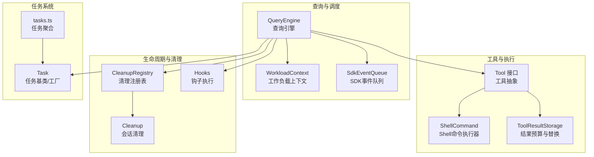
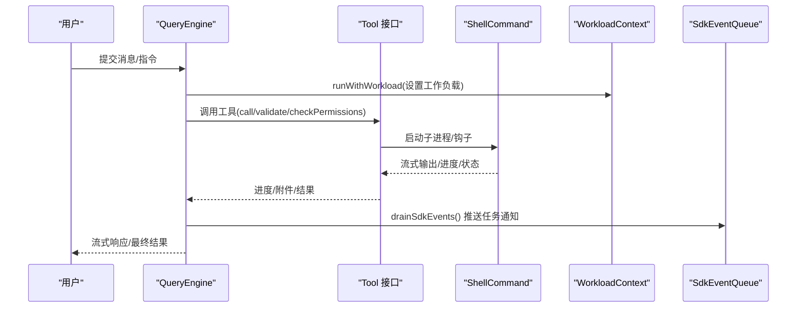
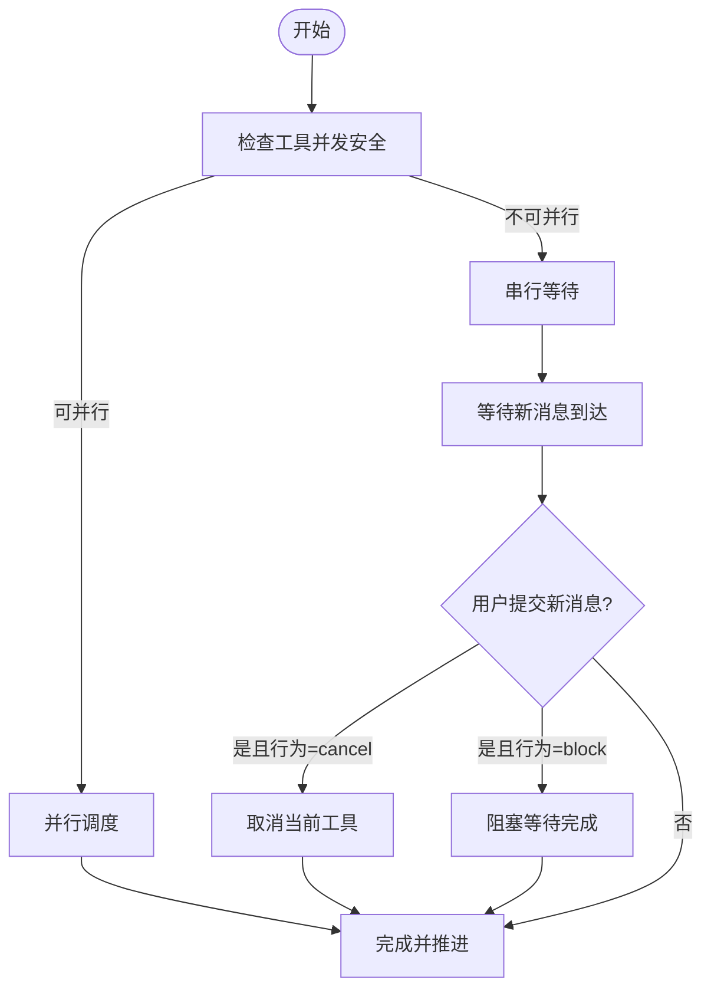
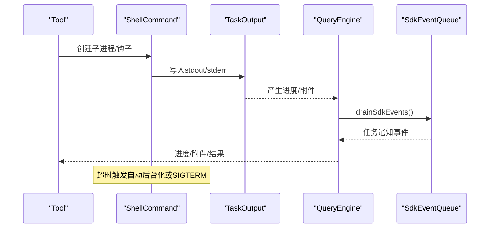
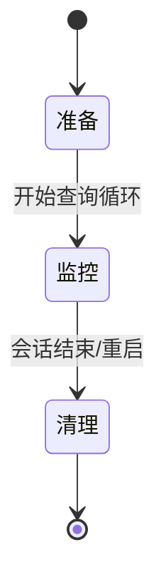
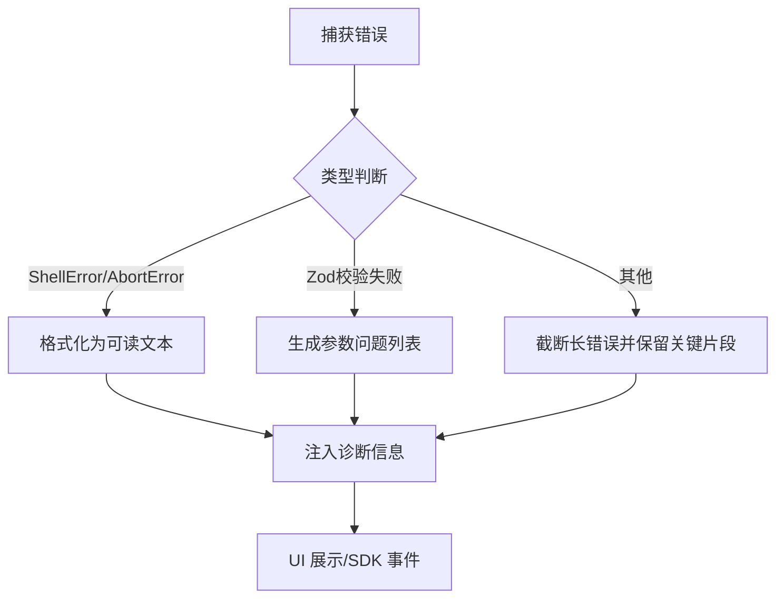
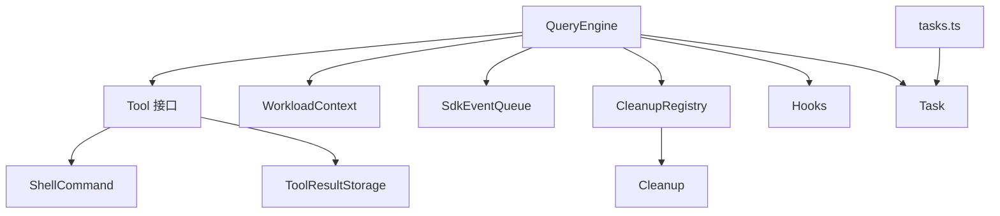

# 工具执行引擎

<cite>
**本文档引用的文件**
- [src/Tool.ts](file://src/Tool.ts)
- [src/QueryEngine.ts](file://src/QueryEngine.ts)
- [src/cli/print.ts](file://src/cli/print.ts)
- [src/utils/workloadContext.ts](file://src/utils/workloadContext.ts)
- [src/utils/sdkEventQueue.ts](file://src/utils/sdkEventQueue.ts)
- [src/utils/ShellCommand.ts](file://src/utils/ShellCommand.ts)
- [src/utils/toolErrors.ts](file://src/utils/toolErrors.ts)
- [src/utils/errors.ts](file://src/utils/errors.ts)
- [src/utils/cleanupRegistry.ts](file://src/utils/cleanupRegistry.ts)
- [src/utils/cleanup.ts](file://src/utils/cleanup.ts)
- [src/utils/toolResultStorage.ts](file://src/utils/toolResultStorage.ts)
- [src/utils/memoize.ts](file://src/utils/memoize.ts)
- [src/tasks.ts](file://src/tasks.ts)
- [src/Task.ts](file://src/Task.ts)
- [src/utils/hooks.ts](file://src/utils/hooks.ts)
- [src/query/stopHooks.ts](file://src/query/stopHooks.ts)
- [src/bootstrap/state.ts](file://src/bootstrap/state.ts)
- [src/components/FallbackToolUseErrorMessage.tsx](file://src/components/FallbackToolUseErrorMessage.tsx)
- [src/components/FallbackToolUseRejectedMessage.tsx](file://src/components/FallbackToolUseRejectedMessage.tsx)
</cite>

## 目录
1. [简介](#简介)
2. [项目结构](#项目结构)
3. [核心组件](#核心组件)
4. [架构总览](#架构总览)
5. [详细组件分析](#详细组件分析)
6. [依赖关系分析](#依赖关系分析)
7. [性能考量](#性能考量)
8. [故障排查指南](#故障排查指南)
9. [结论](#结论)
10. [附录](#附录)

## 简介
本文件系统性阐述 Claude Code 工具执行引擎的设计与实现，覆盖调度机制（并发/串行/优先级）、流式执行器、生命周期管理、错误处理、性能优化、监控与调试以及扩展接口与自定义执行策略开发指南。目标是帮助开发者在不深入源码的前提下理解整体运行机制，并在需要时进行定制化扩展。

## 项目结构
工具执行引擎由“查询引擎”驱动，围绕“工具接口”组织，配合“工作负载上下文”“SDK事件队列”“Shell命令执行器”“错误格式化”“清理注册表”等基础设施协同工作；同时通过“任务系统”支持后台任务与资源管理。

**图表来源**
- [src/QueryEngine.ts:184-207](file://src/QueryEngine.ts#L184-L207)
- [src/utils/workloadContext.ts:30-57](file://src/utils/workloadContext.ts#L30-L57)
- [src/utils/sdkEventQueue.ts:79-134](file://src/utils/sdkEventQueue.ts#L79-L134)
- [src/Tool.ts:362-482](file://src/Tool.ts#L362-L482)
- [src/utils/ShellCommand.ts:114-180](file://src/utils/ShellCommand.ts#L114-L180)
- [src/utils/toolResultStorage.ts:745-774](file://src/utils/toolResultStorage.ts#L745-L774)
- [src/utils/cleanupRegistry.ts:1-25](file://src/utils/cleanupRegistry.ts#L1-L25)
- [src/utils/cleanup.ts:210-260](file://src/utils/cleanup.ts#L210-L260)
- [src/utils/hooks.ts:150-187](file://src/utils/hooks.ts#L150-L187)
- [src/tasks.ts:17-40](file://src/tasks.ts#L17-L40)
- [src/Task.ts:95-125](file://src/Task.ts#L95-L125)

**章节来源**
- [src/QueryEngine.ts:184-207](file://src/QueryEngine.ts#L184-L207)
- [src/Tool.ts:362-482](file://src/Tool.ts#L362-L482)
- [src/utils/ShellCommand.ts:114-180](file://src/utils/ShellCommand.ts#L114-L180)
- [src/utils/toolResultStorage.ts:745-774](file://src/utils/toolResultStorage.ts#L745-L774)
- [src/utils/cleanupRegistry.ts:1-25](file://src/utils/cleanupRegistry.ts#L1-L25)
- [src/utils/cleanup.ts:210-260](file://src/utils/cleanup.ts#L210-L260)
- [src/utils/hooks.ts:150-187](file://src/utils/hooks.ts#L150-L187)
- [src/tasks.ts:17-40](file://src/tasks.ts#L17-L40)
- [src/Task.ts:95-125](file://src/Task.ts#L95-L125)

## 核心组件
- 查询引擎（QueryEngine）：负责一次对话轮次的完整生命周期，包括系统提示构建、消息处理、工具调用、进度与附件处理、结果汇总与费用统计。
- 工具接口（Tool）：统一的工具抽象，定义输入/输出模式、权限校验、并发安全、中断行为、渲染与描述等能力。
- Shell 命令执行器（ShellCommand）：封装子进程、流式输出、超时与自动后台化、大小限制与清理。
- 工作负载上下文（WorkloadContext）：为工具调用提供可隔离的“工作负载”标签，避免上下文泄漏。
- SDK 事件队列（SdkEventQueue）：在非交互模式下缓冲 SDK 事件，保证后台任务进度实时可见。
- 结果预算与替换（ToolResultStorage）：对工具结果进行预算控制与预览替换，避免会话过大。
- 清理注册表（CleanupRegistry）与会话清理（Cleanup）：统一注册与执行清理函数，保障优雅退出。
- 钩子（Hooks）：工具执行前后可插拔的扩展点，带超时与后台执行能力。
- 任务系统（tasks.ts/Task）：统一的任务类型与工厂，支持本地/远程/工作流/代理等任务。

**章节来源**
- [src/QueryEngine.ts:184-207](file://src/QueryEngine.ts#L184-L207)
- [src/Tool.ts:362-482](file://src/Tool.ts#L362-L482)
- [src/utils/ShellCommand.ts:114-180](file://src/utils/ShellCommand.ts#L114-L180)
- [src/utils/workloadContext.ts:30-57](file://src/utils/workloadContext.ts#L30-L57)
- [src/utils/sdkEventQueue.ts:79-134](file://src/utils/sdkEventQueue.ts#L79-L134)
- [src/utils/toolResultStorage.ts:745-774](file://src/utils/toolResultStorage.ts#L745-L774)
- [src/utils/cleanupRegistry.ts:1-25](file://src/utils/cleanupRegistry.ts#L1-L25)
- [src/utils/cleanup.ts:210-260](file://src/utils/cleanup.ts#L210-L260)
- [src/utils/hooks.ts:150-187](file://src/utils/hooks.ts#L150-L187)
- [src/tasks.ts:17-40](file://src/tasks.ts#L17-L40)
- [src/Task.ts:95-125](file://src/Task.ts#L95-L125)

## 架构总览
查询引擎作为主控，将用户输入转化为消息序列，驱动工具调用与模型交互；工具通过 ShellCommand 执行外部命令或钩子；工作负载上下文确保每次调用的环境隔离；SDK 事件队列保障后台任务进度的实时推送；结果预算与替换控制会话规模；清理注册表与钩子提供生命周期扩展点。

**图表来源**
- [src/QueryEngine.ts:675-686](file://src/QueryEngine.ts#L675-L686)
- [src/utils/workloadContext.ts:52-57](file://src/utils/workloadContext.ts#L52-L57)
- [src/utils/sdkEventQueue.ts:89-101](file://src/utils/sdkEventQueue.ts#L89-L101)
- [src/utils/ShellCommand.ts:114-180](file://src/utils/ShellCommand.ts#L114-L180)

**章节来源**
- [src/QueryEngine.ts:675-686](file://src/QueryEngine.ts#L675-L686)
- [src/utils/workloadContext.ts:52-57](file://src/utils/workloadContext.ts#L52-L57)
- [src/utils/sdkEventQueue.ts:89-101](file://src/utils/sdkEventQueue.ts#L89-L101)
- [src/utils/ShellCommand.ts:114-180](file://src/utils/ShellCommand.ts#L114-L180)

## 详细组件分析

### 调度机制：并发、串行与优先级
- 并发安全：工具接口提供 isConcurrencySafe 以声明是否可并行执行；查询引擎在工具选择与执行时尊重该属性，避免竞态。
- 串行阻塞：工具接口 interruptBehavior 可返回 "block"，表示新消息到达时等待当前工具完成；默认为 "block"。
- 优先级与批处理：CLI 打印模块在非 prompt 模式下仅允许 prompt 命令合并批处理，其他命令（如任务通知/孤儿权限）单条处理，保证副作用及时生效。
- 工作负载隔离：runWithWorkload 为每次工具调用建立新的 ALS 上下文边界，防止泄漏。

**图表来源**
- [src/Tool.ts:402-416](file://src/Tool.ts#L402-L416)
- [src/cli/print.ts:1931-1961](file://src/cli/print.ts#L1931-L1961)
- [src/utils/workloadContext.ts:36-57](file://src/utils/workloadContext.ts#L36-L57)

**章节来源**
- [src/Tool.ts:402-416](file://src/Tool.ts#L402-L416)
- [src/cli/print.ts:1931-1961](file://src/cli/print.ts#L1931-L1961)
- [src/utils/workloadContext.ts:36-57](file://src/utils/workloadContext.ts#L36-L57)

### 流式工具执行器：输出、进度与中断
- 流式输出：ShellCommand 在管道模式下通过 StreamWrapper 将 stdout/stderr 实时写入 TaskOutput；在文件模式下通过轮询文件尾部提取进度。
- 进度与事件：查询引擎在非交互模式下使用 SDK 事件队列，drainSdkEvents() 将 task_started/task_progress 等事件实时推送到输出队列，避免后台任务进度被延迟。
- 中断机制：AbortController 统一中断信号；ShellCommand 在收到中断时优先后台化而非直接终止，以便模型看到部分输出；超时回调可触发自动后台化。

**图表来源**
- [src/utils/ShellCommand.ts:66-104](file://src/utils/ShellCommand.ts#L66-L104)
- [src/utils/ShellCommand.ts:114-180](file://src/utils/ShellCommand.ts#L114-L180)
- [src/utils/sdkEventQueue.ts:89-101](file://src/utils/sdkEventQueue.ts#L89-L101)
- [src/QueryEngine.ts:675-686](file://src/QueryEngine.ts#L675-L686)

**章节来源**
- [src/utils/ShellCommand.ts:66-104](file://src/utils/ShellCommand.ts#L66-L104)
- [src/utils/ShellCommand.ts:114-180](file://src/utils/ShellCommand.ts#L114-L180)
- [src/utils/sdkEventQueue.ts:89-101](file://src/utils/sdkEventQueue.ts#L89-L101)
- [src/QueryEngine.ts:675-686](file://src/QueryEngine.ts#L675-L686)

### 生命周期管理：准备—监控—清理
- 准备阶段：构建系统提示、加载技能与插件、初始化文件缓存与会话状态；记录初始消息并持久化。
- 监控阶段：持续接收进度/附件/中间结果，按需刷新 SDK 事件、记录转录、累计用量与成本。
- 清理阶段：注册清理函数（如钩子、锁、临时文件），在关闭或重启时统一执行；会话清理按时间窗口删除过期文件。

**图表来源**
- [src/QueryEngine.ts:436-463](file://src/QueryEngine.ts#L436-L463)
- [src/QueryEngine.ts:675-686](file://src/QueryEngine.ts#L675-L686)
- [src/utils/cleanupRegistry.ts:14-25](file://src/utils/cleanupRegistry.ts#L14-L25)
- [src/utils/cleanup.ts:210-260](file://src/utils/cleanup.ts#L210-L260)

**章节来源**
- [src/QueryEngine.ts:436-463](file://src/QueryEngine.ts#L436-L463)
- [src/QueryEngine.ts:675-686](file://src/QueryEngine.ts#L675-L686)
- [src/utils/cleanupRegistry.ts:14-25](file://src/utils/cleanupRegistry.ts#L14-L25)
- [src/utils/cleanup.ts:210-260](file://src/utils/cleanup.ts#L210-L260)

### 错误处理策略：捕获、恢复与反馈
- 异常捕获：工具错误格式化工具将 ShellError/AbortError 等转换为可读字符串；对 Zod 参数校验失败生成结构化错误信息。
- 恢复与重试：查询引擎根据最大预算/轮次限制、API 错误分类与重试策略生成诊断信息；支持结构化输出工具的多次尝试。
- 用户反馈：提供专用 UI 组件用于拒绝与错误展示，避免泄露内部细节；在非交互模式下通过 SDK 事件与诊断日志辅助定位问题。

**图表来源**
- [src/utils/toolErrors.ts:1-132](file://src/utils/toolErrors.ts#L1-L132)
- [src/utils/errors.ts:125-162](file://src/utils/errors.ts#L125-L162)
- [src/components/FallbackToolUseErrorMessage.tsx:36-84](file://src/components/FallbackToolUseErrorMessage.tsx#L36-L84)
- [src/components/FallbackToolUseRejectedMessage.tsx:1-15](file://src/components/FallbackToolUseRejectedMessage.tsx#L1-L15)

**章节来源**
- [src/utils/toolErrors.ts:1-132](file://src/utils/toolErrors.ts#L1-L132)
- [src/utils/errors.ts:125-162](file://src/utils/errors.ts#L125-L162)
- [src/components/FallbackToolUseErrorMessage.tsx:36-84](file://src/components/FallbackToolUseErrorMessage.tsx#L36-L84)
- [src/components/FallbackToolUseRejectedMessage.tsx:1-15](file://src/components/FallbackToolUseRejectedMessage.tsx#L1-L15)

### 性能优化：缓存、批处理与资源管理
- 缓存机制：LRU 缓存与 TTL 记忆化（memoizeWithTTL）减少重复计算；工作负载上下文避免上下文泄漏导致的重复开销。
- 批处理：CLI 打印模块对 prompt 命令进行批处理合并，降低多次请求带来的往返开销。
- 资源管理：ShellCommand 对输出大小进行上限控制与定时轮询，防止磁盘填满；任务系统统一管理后台任务与输出文件路径。

**章节来源**
- [src/utils/memoize.ts:1-45](file://src/utils/memoize.ts#L1-L45)
- [src/utils/workloadContext.ts:36-57](file://src/utils/workloadContext.ts#L36-L57)
- [src/cli/print.ts:1931-1961](file://src/cli/print.ts#L1931-L1961)
- [src/utils/ShellCommand.ts:52-58](file://src/utils/ShellCommand.ts#L52-L58)
- [src/Task.ts:95-125](file://src/Task.ts#L95-L125)

### 监控与调试：钩子、事件与状态
- 钩子：工具前后钩子支持超时控制与后台执行；会话结束钩子有独立更短超时阈值，确保快速清理。
- 事件：SDK 事件队列在非交互模式下缓冲并实时推送任务通知，便于外部消费者观察后台任务状态。
- 状态：全局状态模块维护交互/非交互模式、缓存命中/缺失等指标，辅助诊断性能与缓存策略。

**章节来源**
- [src/utils/hooks.ts:150-187](file://src/utils/hooks.ts#L150-L187)
- [src/utils/sdkEventQueue.ts:79-134](file://src/utils/sdkEventQueue.ts#L79-L134)
- [src/bootstrap/state.ts:238-262](file://src/bootstrap/state.ts#L238-L262)
- [src/bootstrap/state.ts:1057-1065](file://src/bootstrap/state.ts#L1057-L1065)

### 扩展接口与自定义执行策略
- 自定义工具：通过 buildTool 定义工具，实现 call/description/inputSchema 等方法；利用 isConcurrencySafe/interruptBehavior 控制调度策略。
- 自定义执行策略：可在工具内部实现自定义的 ShellCommand 或钩子逻辑；通过 runWithWorkload 为每次调用注入隔离上下文。
- 自定义错误处理：在工具层覆写 validateInput/checkPermissions，结合工具错误格式化工具生成一致的错误消息。
- 自定义生命周期：通过钩子与清理注册表扩展启动/停止阶段的行为；在查询引擎外层包装以实现自定义批处理或并发策略。

**章节来源**
- [src/Tool.ts:783-793](file://src/Tool.ts#L783-L793)
- [src/utils/workloadContext.ts:52-57](file://src/utils/workloadContext.ts#L52-L57)
- [src/utils/toolErrors.ts:1-132](file://src/utils/toolErrors.ts#L1-L132)
- [src/utils/hooks.ts:150-187](file://src/utils/hooks.ts#L150-L187)
- [src/utils/cleanupRegistry.ts:14-25](file://src/utils/cleanupRegistry.ts#L14-L25)

## 依赖关系分析

**图表来源**
- [src/QueryEngine.ts:184-207](file://src/QueryEngine.ts#L184-L207)
- [src/Tool.ts:362-482](file://src/Tool.ts#L362-L482)
- [src/utils/workloadContext.ts:30-57](file://src/utils/workloadContext.ts#L30-L57)
- [src/utils/sdkEventQueue.ts:79-134](file://src/utils/sdkEventQueue.ts#L79-L134)
- [src/utils/ShellCommand.ts:114-180](file://src/utils/ShellCommand.ts#L114-L180)
- [src/utils/toolResultStorage.ts:745-774](file://src/utils/toolResultStorage.ts#L745-L774)
- [src/utils/cleanupRegistry.ts:1-25](file://src/utils/cleanupRegistry.ts#L1-L25)
- [src/utils/cleanup.ts:210-260](file://src/utils/cleanup.ts#L210-L260)
- [src/utils/hooks.ts:150-187](file://src/utils/hooks.ts#L150-L187)
- [src/tasks.ts:17-40](file://src/tasks.ts#L17-L40)
- [src/Task.ts:95-125](file://src/Task.ts#L95-L125)

**章节来源**
- [src/QueryEngine.ts:184-207](file://src/QueryEngine.ts#L184-L207)
- [src/Tool.ts:362-482](file://src/Tool.ts#L362-L482)
- [src/utils/ShellCommand.ts:114-180](file://src/utils/ShellCommand.ts#L114-L180)
- [src/utils/toolResultStorage.ts:745-774](file://src/utils/toolResultStorage.ts#L745-L774)
- [src/utils/cleanupRegistry.ts:1-25](file://src/utils/cleanupRegistry.ts#L1-L25)
- [src/utils/cleanup.ts:210-260](file://src/utils/cleanup.ts#L210-L260)
- [src/utils/hooks.ts:150-187](file://src/utils/hooks.ts#L150-L187)
- [src/tasks.ts:17-40](file://src/tasks.ts#L17-L40)
- [src/Task.ts:95-125](file://src/Task.ts#L95-L125)

## 性能考量
- 并发与串行：合理设置工具的并发安全与中断行为，避免不必要的阻塞；对高开销工具采用串行或批处理。
- 输出与存储：对大输出启用文件模式并设置上限，避免内存膨胀；定期清理过期输出文件。
- 缓存与记忆化：对昂贵计算使用 TTL 缓存；注意缓存键一致性，避免误判命中。
- 事件与批处理：在非交互模式下利用 SDK 事件队列减少轮询开销；prompt 命令批处理降低往返次数。

[本节为通用指导，无需特定文件引用]

## 故障排查指南
- 工具错误：使用工具错误格式化工具获取结构化错误；在 UI 中使用专用组件展示拒绝/错误消息。
- 钩子超时：检查钩子执行时间与超时配置；必要时调整 SESSION_END_HOOK_TIMEOUT_MS。
- 会话清理：确认清理注册表中的函数已正确注册并在关闭时执行；检查会话清理脚本是否按期运行。
- 资源泄漏：核对 ShellCommand 的 cleanup 是否被调用；确保流式包装器在完成后释放引用。
- 诊断日志：利用查询引擎的结果诊断字段与内存错误缓冲区定位问题。

**章节来源**
- [src/utils/toolErrors.ts:1-132](file://src/utils/toolErrors.ts#L1-L132)
- [src/components/FallbackToolUseErrorMessage.tsx:36-84](file://src/components/FallbackToolUseErrorMessage.tsx#L36-L84)
- [src/components/FallbackToolUseRejectedMessage.tsx:1-15](file://src/components/FallbackToolUseRejectedMessage.tsx#L1-L15)
- [src/utils/hooks.ts:150-187](file://src/utils/hooks.ts#L150-L187)
- [src/utils/cleanupRegistry.ts:14-25](file://src/utils/cleanupRegistry.ts#L14-L25)
- [src/utils/cleanup.ts:210-260](file://src/utils/cleanup.ts#L210-L260)
- [src/utils/ShellCommand.ts:92-104](file://src/utils/ShellCommand.ts#L92-L104)
- [src/QueryEngine.ts:1082-1118](file://src/QueryEngine.ts#L1082-L1118)

## 结论
该工具执行引擎通过“查询引擎 + 工具接口 + Shell 执行器 + 上下文隔离 + SDK 事件 + 生命周期清理”的组合，实现了稳定、可观测、可扩展的工具执行体系。开发者可基于现有接口与基础设施，灵活实现并发/串行策略、流式输出与中断、错误处理与性能优化，并通过钩子与清理机制实现自定义生命周期扩展。

[本节为总结，无需特定文件引用]

## 附录
- 工具接口能力概览：输入/输出模式、权限校验、并发安全、中断行为、渲染与描述、分组显示等。
- 任务类型：本地 Shell、本地代理、远程代理、工作流、梦境任务等，统一由任务工厂管理。
- 状态与模式：交互/非交互模式切换、缓存命中/缺失、最后 API 请求 ID 等，辅助诊断与优化。

**章节来源**
- [src/Tool.ts:362-482](file://src/Tool.ts#L362-L482)
- [src/tasks.ts:17-40](file://src/tasks.ts#L17-L40)
- [src/Task.ts:95-125](file://src/Task.ts#L95-L125)
- [src/bootstrap/state.ts:1057-1065](file://src/bootstrap/state.ts#L1057-L1065)