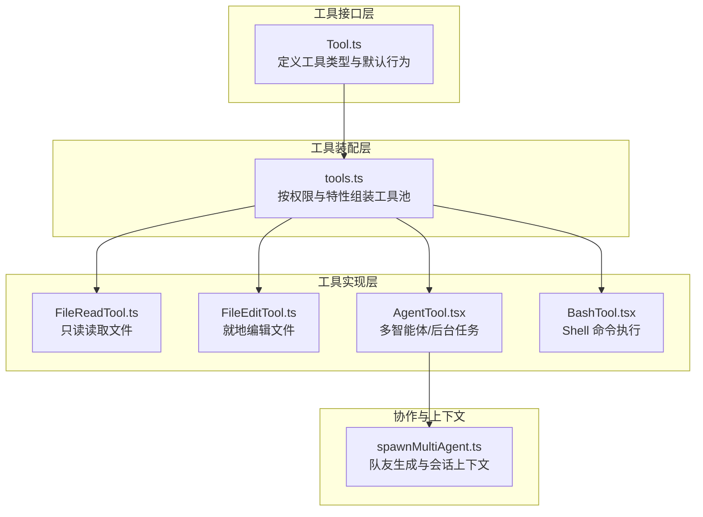
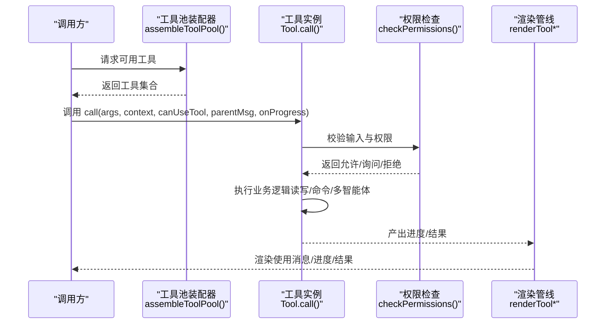
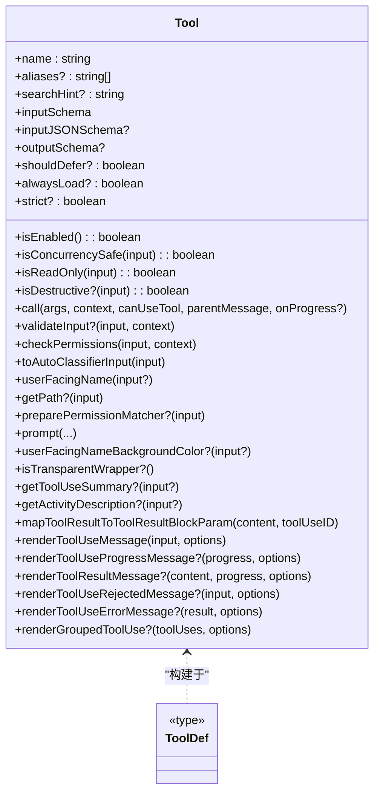
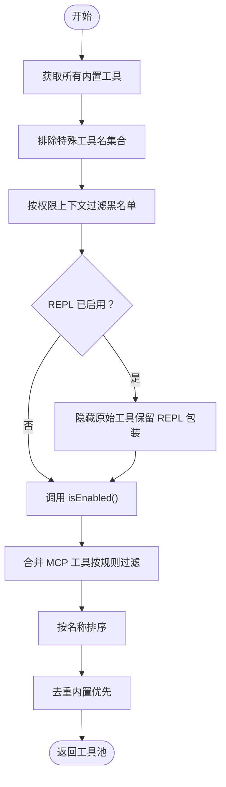
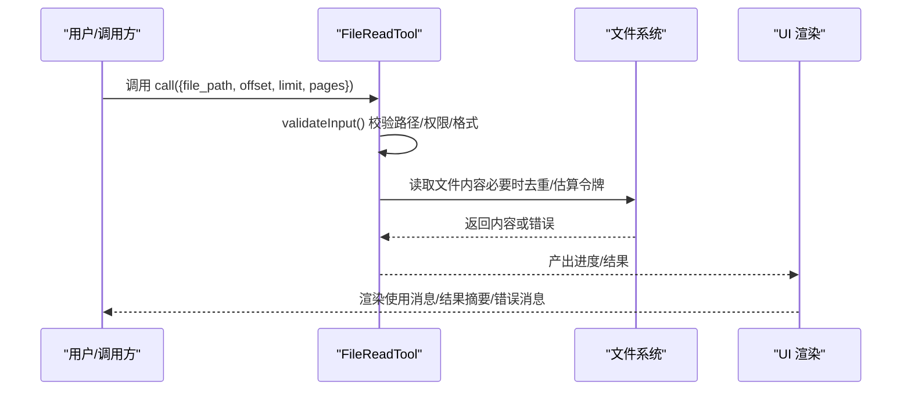
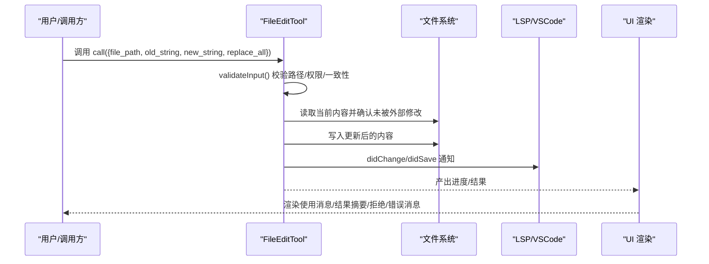
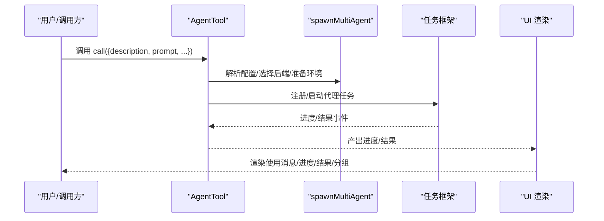
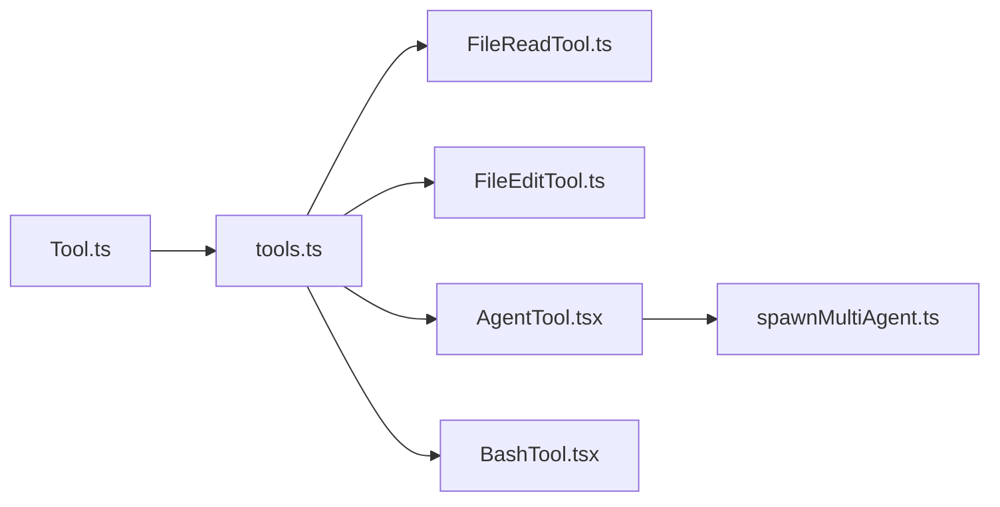

# 工具接口设计

<cite>
**本文引用的文件**
- [Tool.ts](file://src/Tool.ts)
- [tools.ts](file://src/tools.ts)
- [FileReadTool.ts](file://src/tools/FileReadTool/FileReadTool.ts)
- [FileEditTool.ts](file://src/tools/FileEditTool/FileEditTool.ts)
- [AgentTool.tsx](file://src/tools/AgentTool/AgentTool.tsx)
- [BashTool.tsx](file://src/tools/BashTool/BashTool.tsx)
- [spawnMultiAgent.ts](file://src/tools/shared/spawnMultiAgent.ts)
</cite>

## 目录
1. [简介](#简介)
2. [项目结构](#项目结构)
3. [核心组件](#核心组件)
4. [架构总览](#架构总览)
5. [详细组件分析](#详细组件分析)
6. [依赖关系分析](#依赖关系分析)
7. [性能考量](#性能考量)
8. [故障排查指南](#故障排查指南)
9. [结论](#结论)
10. [附录](#附录)

## 简介
本文件面向 Claude Code 的“工具接口设计”，系统化阐述 Tool 接口的设计原理、实现细节与最佳实践。内容覆盖工具的核心属性（名称、描述、输入/输出模式）、关键方法（调用、权限校验、渲染）、生命周期管理（初始化、执行、清理）、能力标识系统（并发安全、只读、破坏性）、渲染机制（工具使用消息、进度消息、结果消息），并结合具体工具实现示例帮助开发者正确实现自定义工具。

## 项目结构
- 工具接口定义位于 src/Tool.ts，包含工具类型、上下文、权限、进度、结果等核心抽象。
- 工具集合装配逻辑位于 src/tools.ts，负责按权限与特性条件组装内置工具与 MCP 工具池。
- 典型工具实现位于 src/tools 下，例如 FileReadTool、FileEditTool、AgentTool、BashTool 等。
- 多智能体协作与队友生成共享逻辑位于 src/tools/shared/spawnMultiAgent.ts。

图表来源
- [Tool.ts:362-695](file://src/Tool.ts#L362-L695)
- [tools.ts:193-389](file://src/tools.ts#L193-L389)
- [FileReadTool.ts:337-718](file://src/tools/FileReadTool/FileReadTool.ts#L337-L718)
- [FileEditTool.ts:86-595](file://src/tools/FileEditTool/FileEditTool.ts#L86-L595)
- [AgentTool.tsx:196-300](file://src/tools/AgentTool/AgentTool.tsx#L196-L300)
- [BashTool.tsx:1-200](file://src/tools/BashTool/BashTool.tsx#L1-L200)
- [spawnMultiAgent.ts:1-200](file://src/tools/shared/spawnMultiAgent.ts#L1-L200)

章节来源
- [Tool.ts:1-793](file://src/Tool.ts#L1-L793)
- [tools.ts:1-390](file://src/tools.ts#L1-L390)

## 核心组件
- 工具类型与默认行为
  - 工具类型 Tool<Input, Output, P> 定义了工具的输入/输出模式、能力标识、渲染钩子、权限与校验方法等。
  - buildTool 提供安全默认值：启用状态、并发安全、只读、破坏性、权限策略、分类器输入、用户可见名等，避免每个工具重复实现。
- 工具上下文 ToolUseContext
  - 提供运行时环境：命令列表、调试/详细模式、主循环模型、工具集、MCP 客户端与资源、交互式/非交互式会话、消息与文件历史、通知、SDK 状态等。
- 工具结果 ToolResult
  - 包含 data、可选新消息、可选上下文修饰器（仅对非并发安全工具生效）以及 MCP 元数据透传。
- 进度与渲染
  - ToolProgressData 与 HookProgress 统一进度类型；工具提供多种渲染函数用于不同 UI 场景（使用消息、进度消息、结果消息、拒绝/错误消息、分组渲染）。

章节来源
- [Tool.ts:362-695](file://src/Tool.ts#L362-L695)
- [Tool.ts:783-792](file://src/Tool.ts#L783-L792)
- [tools.ts:193-389](file://src/tools.ts#L193-L389)

## 架构总览
工具接口通过统一抽象屏蔽底层差异，使工具在权限、渲染、进度、结果等方面保持一致的对外契约。工具池装配器根据权限上下文与特性开关合并内置工具与 MCP 工具，并保证提示缓存稳定性与去重一致性。

图表来源
- [tools.ts:345-367](file://src/tools.ts#L345-L367)
- [Tool.ts:379-385](file://src/Tool.ts#L379-L385)
- [Tool.ts:500-503](file://src/Tool.ts#L500-L503)

## 详细组件分析

### 工具接口与默认行为
- 关键属性与方法
  - 名称与别名：name、aliases、searchHint
  - 模式与约束：inputSchema（Zod）、inputJSONSchema（MCP 可直接提供 JSON Schema）、outputSchema（可选）
  - 能力标识：isConcurrencySafe、isReadOnly、isDestructive、shouldDefer、alwaysLoad、strict
  - 生命周期：call、validateInput（可选）、checkPermissions、toAutoClassifierInput、userFacingName、getPath（可选）
  - 渲染：renderToolUseMessage、renderToolUseProgressMessage、renderToolResultMessage、renderToolUseRejectedMessage、renderToolUseErrorMessage、renderGroupedToolUse（可选）
  - 其他：interruptBehavior、isSearchOrReadCommand、isOpenWorld、requiresUserInteraction、isTransparentWrapper、getToolUseSummary、getActivityDescription、extractSearchText（可选）
- 默认行为
  - buildTool 将未实现的方法填充为安全默认值，确保工具始终具备一致的最小能力集。

图表来源
- [Tool.ts:362-695](file://src/Tool.ts#L362-L695)
- [Tool.ts:721-741](file://src/Tool.ts#L721-L741)
- [Tool.ts:783-792](file://src/Tool.ts#L783-L792)

章节来源
- [Tool.ts:362-695](file://src/Tool.ts#L362-L695)
- [Tool.ts:757-769](file://src/Tool.ts#L757-L769)
- [Tool.ts:783-792](file://src/Tool.ts#L783-L792)

### 工具上下文与权限
- ToolUseContext
  - 提供工具执行所需的运行时信息：命令、调试/详细模式、主循环模型、工具集、MCP 客户端/资源、是否非交互式会话、代理定义、预算、系统提示、刷新工具回调、AbortController、文件状态缓存、应用状态访问器、通知与系统消息追加、进度回调、SDK 状态、文件历史与归属追踪、对话/会话标识、查询链追踪、请求提示回调、工具使用 ID、内容替换状态、冻结的系统提示等。
- 权限上下文与规则
  - ToolPermissionContext 描述权限模式、附加工作目录、允许/禁止/询问规则、是否可绕过权限模式、是否自动模式可用、是否应避免权限提示、自动化检查前置、计划模式前后态等。
  - 工具可通过 checkPermissions 实现特定规则，配合 preparePermissionMatcher 与匹配器闭包进行高效规则匹配。

章节来源
- [Tool.ts:158-300](file://src/Tool.ts#L158-L300)
- [Tool.ts:123-138](file://src/Tool.ts#L123-L138)
- [Tool.ts:500-503](file://src/Tool.ts#L500-L503)
- [Tool.ts:514-516](file://src/Tool.ts#L514-L516)

### 工具装配与去重
- 工具池装配 assembleToolPool
  - 合并内置工具与 MCP 工具，过滤黑名单规则，按名称排序并去重（内置优先）。
- 工具筛选 getTools/filterToolsByDenyRules
  - 根据权限上下文与特性开关筛选工具集合，支持简单模式与 REPL 模式下的特殊处理。

图表来源
- [tools.ts:345-367](file://src/tools.ts#L345-L367)
- [tools.ts:262-269](file://src/tools.ts#L262-L269)
- [tools.ts:271-327](file://src/tools.ts#L271-L327)

章节来源
- [tools.ts:193-389](file://src/tools.ts#L193-L389)

### 文件读取工具（FileReadTool）
- 设计要点
  - 只读工具：isReadOnly 返回 true；isConcurrencySafe 返回 true。
  - 输入模式：file_path、offset、limit、pages（PDF 分页范围）。
  - 输出模式：文本、图片、笔记本、PDF、部分提取、未变更文件等。
  - 权限与校验：expandPath 规范化路径；UNC 路径安全检查；二进制扩展名与设备文件阻断；PDF 页面范围限制；文件存在性与相似路径建议。
  - 结果映射：mapToolResultToToolResultBlockParam 针对不同类型输出生成 API 消息块。
  - 渲染：renderToolUseMessage/renderToolResultMessage/renderToolUseErrorMessage 等。
- 生命周期
  - 初始化：解析与校验输入、发现技能目录、激活条件技能。
  - 执行：读取文件、令牌数估算与限制、去重命中与缓存、异常友好提示。
  - 清理：记录事件、更新分析元数据。

图表来源
- [FileReadTool.ts:496-651](file://src/tools/FileReadTool/FileReadTool.ts#L496-L651)
- [FileReadTool.ts:652-718](file://src/tools/FileReadTool/FileReadTool.ts#L652-L718)
- [FileReadTool.ts:398-405](file://src/tools/FileReadTool/FileReadTool.ts#L398-L405)

章节来源
- [FileReadTool.ts:337-718](file://src/tools/FileReadTool/FileReadTool.ts#L337-L718)

### 文件编辑工具（FileEditTool）
- 设计要点
  - 破坏性工具：isDestructive 未显式实现（默认 false），但实际修改文件，需谨慎使用。
  - 输入模式：file_path、old_string、new_string、replace_all。
  - 输出模式：包含原始文件、补丁、行数统计、用户修改标记、可选 Git Diff。
  - 权限与校验：UNC 路径安全跳过；大小限制；存在性与编码检测；内容一致性校验；笔记本文档拦截；设置文件编辑验证。
  - 结果映射：mapToolResultToToolResultBlockParam 生成简洁结果文本。
  - 渲染：renderToolUseMessage/renderToolResultMessage/renderToolUseRejectedMessage/renderToolUseErrorMessage。
- 生命周期
  - 初始化：路径规范化、技能发现与激活。
  - 执行：原子读取-修改-写入，LSP 通知与 VSCode Diff 更新，文件历史备份，Git Diff 计算（可选）。
  - 清理：事件记录、行数统计、分析指标上报。

图表来源
- [FileEditTool.ts:387-574](file://src/tools/FileEditTool/FileEditTool.ts#L387-L574)
- [FileEditTool.ts:575-595](file://src/tools/FileEditTool/FileEditTool.ts#L575-L595)

章节来源
- [FileEditTool.ts:86-595](file://src/tools/FileEditTool/FileEditTool.ts#L86-L595)

### 多智能体工具（AgentTool）
- 设计要点
  - 输入模式：描述、任务提示、子代理类型、模型覆盖、后台运行、隔离模式（工作树/远程）、工作目录等。
  - 输出模式：同步完成或异步启动两种形态，包含代理 ID、输出文件路径、可读性提示等。
  - 进度类型：AgentToolProgress 与 ShellProgress 统一进度事件。
  - 渲染：renderToolUseMessage/renderToolUseProgressMessage/renderToolResultMessage/renderToolUseRejectedMessage/renderToolUseErrorMessage/renderGroupedToolUse。
- 生命周期
  - 初始化：构建系统提示、选择后端（tmux/pane/进程内）、准备环境变量与会话上下文。
  - 执行：注册前台/后台任务、运行代理、跟踪进度、生成摘要与输出文件。
  - 清理：注销前台、回传结果、持久化元数据。

图表来源
- [AgentTool.tsx:196-300](file://src/tools/AgentTool/AgentTool.tsx#L196-L300)
- [spawnMultiAgent.ts:107-200](file://src/tools/shared/spawnMultiAgent.ts#L107-L200)

章节来源
- [AgentTool.tsx:196-300](file://src/tools/AgentTool/AgentTool.tsx#L196-L300)
- [spawnMultiAgent.ts:1-200](file://src/tools/shared/spawnMultiAgent.ts#L1-L200)

### Shell 工具（BashTool）
- 设计要点
  - 搜索/读取/列出命令识别：isSearchOrReadCommand 基于命令集合与管道解析，支持折叠显示。
  - 只读约束：checkReadOnlyConstraints 与 AST 解析防止危险写操作。
  - 进度阈值：PROGRESS_THRESHOLD_MS 控制后台提示展示时机。
  - 渲染：renderToolUseMessage/renderToolUseProgressMessage/renderToolResultMessage/renderToolUseErrorMessage/renderToolUseQueuedMessage。
- 生命周期
  - 初始化：解析命令、检测只读/搜索/读取语义、计算超时与沙箱策略。
  - 执行：执行命令、截断输出、图像/文本处理、结果预览与存储。
  - 清理：记录事件、分析指标、终端重置提示。

章节来源
- [BashTool.tsx:1-200](file://src/tools/BashTool/BashTool.tsx#L1-L200)

## 依赖关系分析
- 工具接口与实现解耦
  - Tool.ts 定义抽象，各工具实现遵循同一契约，降低耦合。
- 工具池装配
  - tools.ts 通过 getTools/assembleToolPool 统一入口，集中处理权限过滤、特性开关、REPL 模式与简单模式的差异化。
- 上下文与渲染
  - ToolUseContext 作为运行时注入点，贯穿工具执行与 UI 渲染；渲染函数在工具内部实现，便于按场景定制。

图表来源
- [Tool.ts:362-695](file://src/Tool.ts#L362-L695)
- [tools.ts:193-389](file://src/tools.ts#L193-L389)
- [AgentTool.tsx:196-300](file://src/tools/AgentTool/AgentTool.tsx#L196-L300)
- [spawnMultiAgent.ts:1-200](file://src/tools/shared/spawnMultiAgent.ts#L1-L200)

章节来源
- [Tool.ts:362-695](file://src/Tool.ts#L362-L695)
- [tools.ts:193-389](file://src/tools.ts#L193-L389)

## 性能考量
- 并发安全与上下文修饰
  - 并发安全工具可并行执行；非并发安全工具通过 contextModifier 在工具间串行化，避免竞态。
- 结果大小与持久化
  - maxResultSizeChars 控制结果大小，超过阈值自动落盘并返回预览，减少内存压力。
- 去重与缓存
  - FileReadTool 对相同范围且未变更的文件读取进行去重，显著节省缓存创建开销。
- 进度与 UI
  - 合理设置进度阈值与 UI 动画，避免频繁重绘；分组渲染在非详细模式下提升吞吐。

## 故障排查指南
- 权限相关
  - 检查 checkPermissions 与 preparePermissionMatcher 是否正确匹配路径/规则；UNC 路径在权限检查阶段跳过文件系统操作，避免凭据泄露。
- 输入校验
  - validateInput 应覆盖路径存在性、二进制/设备文件阻断、PDF 范围限制、文件大小上限等；错误码与行为（允许/询问/拒绝）需明确。
- 渲染一致性
  - extractSearchText 返回的文本需与 transcript 模式下实际渲染内容一致，避免索引与高亮不匹配。
- 多智能体与后台任务
  - 确认 tmux/pane/进程内后端可用性与会话上下文；关注自动后台任务阈值与进度提示。

章节来源
- [FileReadTool.ts:418-495](file://src/tools/FileReadTool/FileReadTool.ts#L418-L495)
- [FileEditTool.ts:137-362](file://src/tools/FileEditTool/FileEditTool.ts#L137-L362)
- [AgentTool.tsx:196-300](file://src/tools/AgentTool/AgentTool.tsx#L196-L300)

## 结论
Tool 接口通过统一的类型系统、默认行为与丰富的渲染/权限/进度钩子，为 Claude Code 的工具生态提供了强健的抽象与一致的体验。开发者在实现自定义工具时，应充分利用 buildTool 的默认值、严格遵守权限与输入校验、合理设计渲染与进度策略，并在需要时实现并发安全与上下文修饰，以获得稳定、可维护且高性能的工具实现。

## 附录
- 使用示例与最佳实践
  - 使用 buildTool 定义工具，至少提供 name、inputSchema、outputSchema、call、checkPermissions、userFacingName 等；其余方法按需实现。
  - 对只读/搜索/读取类工具，实现 isReadOnly/isSearchOrReadCommand 以优化 UI 折叠与展示。
  - 对可能产生大结果的工具，设置合理的 maxResultSizeChars 并实现 mapToolResultToToolResultBlockParam。
  - 对需要权限细化的工具，实现 preparePermissionMatcher 与 validateInput，确保路径与规则匹配准确。
  - 对后台/长时间运行的工具，提供 renderToolUseProgressMessage 与 interruptBehavior，改善用户体验。