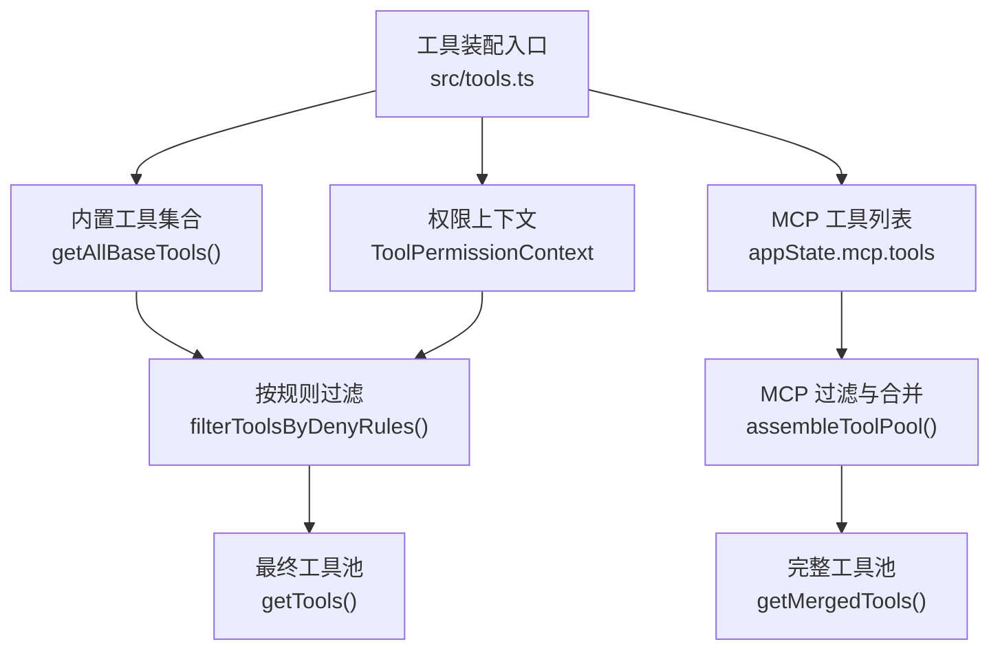
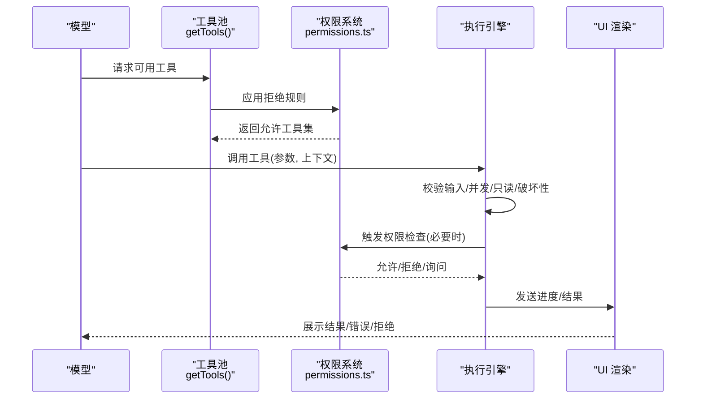
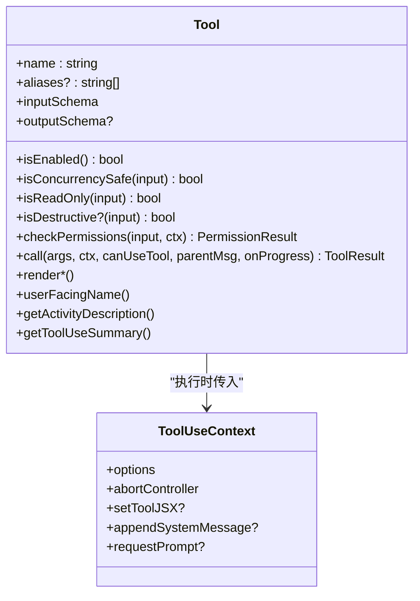
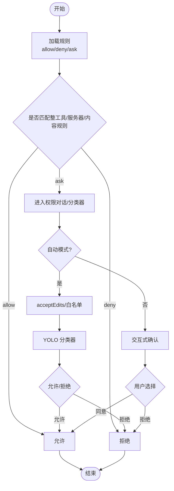
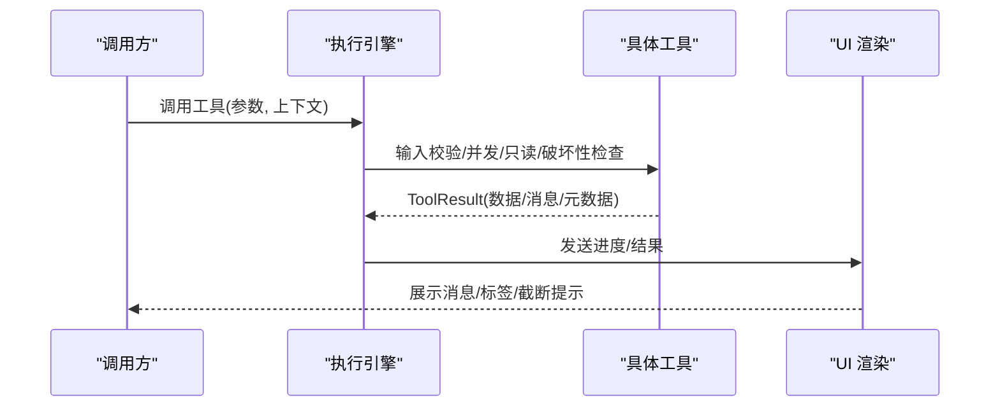
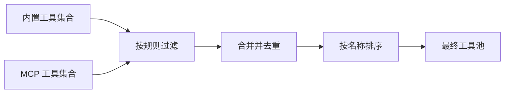
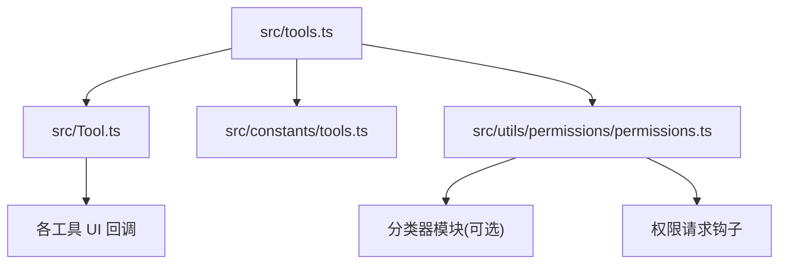

# 工具系统详解

<cite>
**本文引用的文件**
- [src/tools.ts](file://src/tools.ts)
- [src/Tool.ts](file://src/Tool.ts)
- [src/constants/tools.ts](file://src/constants/tools.ts)
- [src/utils/permissions/permissions.ts](file://src/utils/permissions/permissions.ts)
- [src/tools/BashTool/BashTool.tsx](file://src/tools/BashTool/BashTool.tsx)
- [src/tools/FileReadTool/FileReadTool.ts](file://src/tools/FileReadTool/FileReadTool.ts)
- [src/tools/SkillTool/SkillTool.ts](file://src/tools/SkillTool/SkillTool.ts)
</cite>

## 目录
1. [简介](#简介)
2. [项目结构](#项目结构)
3. [核心组件](#核心组件)
4. [架构总览](#架构总览)
5. [详细组件分析](#详细组件分析)
6. [依赖关系分析](#依赖关系分析)
7. [性能考量](#性能考量)
8. [故障排查指南](#故障排查指南)
9. [结论](#结论)
10. [附录](#附录)

## 简介
本文件系统性解析 Claude Code 的工具系统：从工具接口设计、生命周期、能力标识与渲染机制，到权限控制、执行引擎、动态注册与发现、自定义工具开发指南、测试策略与性能优化建议。文档覆盖 40+ 内置工具的分类与实现要点，并通过图示展示关键流程，帮助开发者快速理解并高效扩展工具生态。

## 项目结构
工具系统围绕统一的工具接口与权限框架构建，内置工具通过集中装配函数生成可用集合，并与 MCP 工具进行去重合并。权限规则在运行前进行预过滤，确保模型仅看到允许的工具集。

**图表来源**
- [src/tools.ts:193-390](file://src/tools.ts#L193-L390)

**章节来源**
- [src/tools.ts:193-390](file://src/tools.ts#L193-L390)

## 核心组件
- 工具接口与类型系统
  - 统一的工具契约定义，包含调用签名、输入输出模式、并发安全、只读/破坏性标记、权限校验钩子、UI 渲染回调、摘要与活动描述等。
  - 提供工具构建器以填充默认行为，保证一致性与安全性。
- 权限控制
  - 基于规则的“总是允许/总是拒绝/总是询问”三类规则，支持来源（设置、命令行、会话等）与通配匹配。
  - 自动模式下结合分类器与快速路径，减少交互成本。
- 执行引擎
  - 支持串行与并发执行；工具可声明并发安全以启用并行。
  - 提供进度回调、中断行为、结果渲染与消息注入能力。
- 动态注册与发现
  - 通过特性开关与环境变量控制工具可用性，运行时动态装配。
  - MCP 工具与内置工具合并，保持提示缓存稳定性的排序约束。

**章节来源**
- [src/Tool.ts:362-792](file://src/Tool.ts#L362-L792)
- [src/utils/permissions/permissions.ts:109-302](file://src/utils/permissions/permissions.ts#L109-L302)
- [src/tools.ts:345-390](file://src/tools.ts#L345-L390)

## 架构总览
工具系统的关键路径包括：工具装配、权限预过滤、MCP 合并、执行调度与 UI 渲染。

**图表来源**
- [src/tools.ts:271-327](file://src/tools.ts#L271-L327)
- [src/utils/permissions/permissions.ts:473-800](file://src/utils/permissions/permissions.ts#L473-L800)

## 详细组件分析

### 工具接口与生命周期
- 接口要点
  - 必备方法：call、description、inputSchema、outputSchema、isEnabled、isConcurrencySafe、isReadOnly、checkPermissions、render* 系列回调。
  - 可选能力：搜索/读取折叠、开放世界、用户交互需求、MCP 标识、延迟加载、严格模式、输入回填、路径提取、摘要与活动描述、分组渲染等。
- 生命周期
  - 装配阶段：根据特性开关与环境变量组装内置工具集合。
  - 权限阶段：应用全局/来源规则，过滤不可用工具。
  - 执行阶段：输入校验、并发安全判定、权限检查、工具调用、进度回调、结果渲染。
  - 渲染阶段：根据工具返回内容生成消息块、进度条、拒绝/错误 UI。

**图表来源**
- [src/Tool.ts:362-792](file://src/Tool.ts#L362-L792)

**章节来源**
- [src/Tool.ts:362-792](file://src/Tool.ts#L362-L792)

### 权限控制机制
- 规则体系
  - 总体规则来源：设置、CLI 参数、命令、会话等。
  - 匹配粒度：整工具名、MCP 服务器级（含通配）、带内容的规则（如 Bash(prefix:*)）。
  - 行为：allow/deny/ask；deny 优先级最高。
- 自动模式与分类器
  - 在自动模式下，优先走 acceptEdits 快速路径与安全工具白名单；否则调用分类器进行决策。
  - 分类器失败或不可用时，遵循“失败关闭”策略，必要时回退到交互式确认。
- 头脑/异步代理支持
  - 为无法弹窗的异步代理提供 PermissionRequest 钩子，允许在无 UI 场景中提前决策。

**图表来源**
- [src/utils/permissions/permissions.ts:109-302](file://src/utils/permissions/permissions.ts#L109-L302)
- [src/utils/permissions/permissions.ts:473-800](file://src/utils/permissions/permissions.ts#L473-L800)

**章节来源**
- [src/utils/permissions/permissions.ts:109-302](file://src/utils/permissions/permissions.ts#L109-L302)
- [src/utils/permissions/permissions.ts:473-800](file://src/utils/permissions/permissions.ts#L473-L800)

### 工具执行引擎
- 并发与串行
  - 工具声明并发安全后可并行执行；否则串行排队，避免资源竞争。
- 中断行为
  - 工具可声明“取消/阻塞”，影响新消息到达时的处理策略。
- 结果与渲染
  - 工具返回 ToolResult，可携带新消息、上下文修改元数据与 MCP 元信息。
  - UI 回调负责生成消息块、进度、拒绝/错误视图，支持简洁/详细模式切换。

**图表来源**
- [src/Tool.ts:379-560](file://src/Tool.ts#L379-L560)

**章节来源**
- [src/Tool.ts:379-560](file://src/Tool.ts#L379-L560)

### 动态注册与发现机制
- 特性开关与环境变量
  - 通过 Bun 特性标志与环境变量控制工具可用性，实现按需裁剪与灰度发布。
- 模式过滤
  - 简化模式、REPL 模式、协调者模式等对工具集合进行二次筛选。
- MCP 合并
  - 将内置工具与 MCP 工具按名称去重，内置工具优先，保持排序稳定性以保护提示缓存键。

**图表来源**
- [src/tools.ts:193-251](file://src/tools.ts#L193-L251)
- [src/tools.ts:345-367](file://src/tools.ts#L345-L367)

**章节来源**
- [src/tools.ts:193-251](file://src/tools.ts#L193-L251)
- [src/tools.ts:345-367](file://src/tools.ts#L345-L367)

### 内置工具分类与实现要点（精选）
- 文件操作类
  - FileReadTool：路径合法性与设备文件阻断、编码检测、大小/令牌限制、PDF/图像处理、监听器通知、摘要与活动描述、UI 渲染。
  - FileEditTool：路径提取、只读约束、增量写入、历史追踪、VS Code 同步、UI 渲染。
  - FileWriteTool：路径提取、覆盖/追加策略、令牌上限、UI 渲染。
- 系统工具
  - BashTool：命令拆分与语义解析、搜索/读取/列表命令折叠、静默命令识别、沙箱策略、超时与任务管理、UI 进度与错误处理。
  - PowerShellTool：平台特定权限与自动模式策略、UI 渲染。
- 开发工具
  - SkillTool：技能发现与合并、子代理派生执行、插件市场与来源统计、遥测字段、UI 渲染与拒绝视图。
  - LSPTool：语言服务集成（条件启用）。
  - GrepTool/GlobTool：嵌入式搜索工具条件启用、UI 渲染。
- 代理工具
  - AgentTool：多智能体协作、团队创建/删除、消息发送、UI 渲染。
  - TeamCreateTool/TeamDeleteTool：团队管理与触发器路由。
- 代理工具（续）
  - Task* 系列：任务创建/查询/更新/列表/停止，与 UI 与消息系统集成。
  - TaskOutputTool：任务输出注入。
- 代理工具（续）
  - Enter/Exit Plan Mode、Enter/Exit Worktree：工作模式切换与 UI 协同。
- 代理工具（续）
  - SendMessageTool：跨线程消息发送。
- 代理工具（续）
  - BriefTool：摘要生成。
- 代理工具（续）
  - WebSearchTool/WebFetchTool：网络检索与抓取。
- 代理工具（续）
  - NotebookEditTool：Jupyter 笔记本读写与单元格映射。
- 代理工具（续）
  - TodoWriteTool：待办写入。
- 代理工具（续）
  - AskUserQuestionTool：用户问答。
- 代理工具（续）
  - ToolSearchTool：工具搜索（乐观启用）。
- 代理工具（续）
  - SyntheticOutputTool：合成输出。
- 代理工具（续）
  - MCP 工具族：ListMcpResourcesTool、ReadMcpResourceTool、MCPTool、McpAuthTool。
- 代理工具（续）
  - Cron 系列：ScheduleCronTool（创建/删除/列出）。
- 代理工具（续）
  - RemoteTriggerTool：远程触发。
- 代理工具（续）
  - MonitorTool：监控。
- 代理工具（续）
  - SleepTool：休眠。
- 代理工具（续）
  - WorkflowTool：工作流脚本（条件启用）。
- 代理工具（续）
  - REPLTool：REPL 包装器（条件启用）。
- 代理工具（续）
  - 其他：CtxInspectTool、TerminalCaptureTool、WebBrowserTool、SnipTool、OverflowTestTool、VerifyPlanExecutionTool、SendUserFileTool、PushNotificationTool、SubscribePRTool、TungstenTool、ConfigTool、SuggestBackgroundPRTool、ListPeersTool 等。

**章节来源**
- [src/tools/FileReadTool/FileReadTool.ts:1-200](file://src/tools/FileReadTool/FileReadTool.ts#L1-L200)
- [src/tools/BashTool/BashTool.tsx:1-200](file://src/tools/BashTool/BashTool.tsx#L1-L200)
- [src/tools/SkillTool/SkillTool.ts:1-200](file://src/tools/SkillTool/SkillTool.ts#L1-L200)
- [src/tools.ts:1-135](file://src/tools.ts#L1-L135)

### 工具权限设计原则
- 默认安全：非并发安全、非只读、非破坏性为默认值，确保最小暴露面。
- 明确声明：工具需明确标注并发安全、只读/破坏性、权限检查逻辑与 UI 行为。
- 规则优先：deny 优先于 allow；ask 用于需要人工介入的场景。
- 自动模式降本：acceptEdits 快速路径与白名单减少分类器调用；失败即回退到交互。
- 异步代理：提供钩子以在无 UI 场景中提前决策，避免阻塞。

**章节来源**
- [src/Tool.ts:757-792](file://src/Tool.ts#L757-L792)
- [src/utils/permissions/permissions.ts:109-302](file://src/utils/permissions/permissions.ts#L109-L302)

### UI 集成方法
- 渲染回调
  - renderToolUseMessage：即时消息渲染（尽早可见）。
  - renderToolResultMessage：结果消息渲染（可选择简洁/详细）。
  - renderToolUseProgressMessage：进度消息渲染。
  - renderToolUseRejectedMessage/renderToolUseErrorMessage：拒绝/错误视图定制。
- 摘要与活动描述
  - getToolUseSummary/getActivityDescription：用于紧凑视图与转录索引。
- 截断与展开
  - isResultTruncated：控制点击展开。
- 分组渲染
  - renderGroupedToolUse：批量工具调用的聚合视图。

**章节来源**
- [src/Tool.ts:560-694](file://src/Tool.ts#L560-L694)

### 自定义工具开发指南
- 实现步骤
  - 定义输入/输出模式（Zod Schema），声明工具名称、别名、能力标识（并发安全、只读、破坏性、搜索/读取折叠等）。
  - 实现 call 与 checkPermissions；必要时实现 validateInput、getPath、preparePermissionMatcher。
  - 提供 UI 渲染回调（消息、进度、拒绝/错误视图）与摘要/活动描述。
  - 使用 buildTool 注册工具，确保默认行为一致。
- 权限设计
  - 明确工具的危险级别与交互需求；对高风险工具设置严格权限与拒绝规则。
  - 利用规则内容（如 Bash(prefix:*)）精细化控制。
- 动态注册
  - 通过特性开关与环境变量控制工具可用性；在 getTools/getAllBaseTools 中注册。
- UI 集成
  - 提供简洁/详细两种渲染模式；支持分组渲染与截断。
- 测试策略
  - 单元测试：输入校验、并发安全、只读/破坏性判定、UI 渲染输出。
  - 集成测试：权限检查链路、自动模式分类器、REPL/协调者模式下的行为。
  - 性能测试：大文件读取、长管道命令、大量工具并发场景。

**章节来源**
- [src/Tool.ts:757-792](file://src/Tool.ts#L757-L792)
- [src/tools.ts:193-251](file://src/tools.ts#L193-L251)

## 依赖关系分析
- 工具装配依赖
  - 工具装配函数依赖特性开关、环境变量、工具常量与权限上下文。
- 权限系统依赖
  - 权限系统依赖规则来源、分类器模块、钩子系统、沙箱与工作目录策略。
- UI 依赖
  - UI 渲染依赖主题、工具集合、消息系统与进度状态。

**图表来源**
- [src/tools.ts:1-135](file://src/tools.ts#L1-L135)
- [src/Tool.ts:362-792](file://src/Tool.ts#L362-L792)
- [src/utils/permissions/permissions.ts:1-120](file://src/utils/permissions/permissions.ts#L1-L120)

**章节来源**
- [src/tools.ts:1-135](file://src/tools.ts#L1-L135)
- [src/Tool.ts:362-792](file://src/Tool.ts#L362-L792)
- [src/utils/permissions/permissions.ts:1-120](file://src/utils/permissions/permissions.ts#L1-L120)

## 性能考量
- 工具装配
  - 使用特性开关与环境变量裁剪工具集合，减少初始提示长度与缓存碎片。
  - 对 MCP 工具与内置工具分别排序后合并，保持内置工具连续前缀，提升提示缓存命中率。
- 权限检查
  - deny 优先与规则预匹配，避免昂贵的分类器调用。
  - acceptEdits 快速路径与白名单显著降低自动模式开销。
- 执行效率
  - 并发安全工具可并行执行；非并发安全工具串行排队，避免资源争用。
  - 大结果落盘与预览机制减少内存占用与传输成本。
- UI 渲染
  - 摘要与活动描述用于紧凑视图，减少转录渲染负担。
  - 分组渲染与截断控制提升长输出场景的交互体验。

**章节来源**
- [src/tools.ts:345-367](file://src/tools.ts#L345-L367)
- [src/utils/permissions/permissions.ts:593-800](file://src/utils/permissions/permissions.ts#L593-L800)

## 故障排查指南
- 权限相关
  - 检查规则来源与匹配内容，确认是否存在整工具/服务器/内容规则导致拒绝。
  - 在自动模式下，若分类器不可用，确认失败回退策略与日志。
- 工具调用
  - 若工具被拒绝，查看拒绝原因与 UI 提示；必要时调整规则或改为交互模式。
  - 对并发安全工具，确认是否被串行队列阻塞。
- UI 渲染
  - 若结果未显示，检查 renderToolResultMessage 返回值；确认 isResultTruncated 与分组渲染配置。
- 日志与遥测
  - 关注权限决策事件与分类器调用成本，定位性能瓶颈。

**章节来源**
- [src/utils/permissions/permissions.ts:137-211](file://src/utils/permissions/permissions.ts#L137-L211)
- [src/Tool.ts:625-667](file://src/Tool.ts#L625-L667)

## 结论
Claude Code 的工具系统以统一接口为核心，配合灵活的权限规则与自动模式分类器，在保证安全的前提下最大化自动化效率。通过特性开关与环境变量实现动态装配，结合 MCP 工具合并与排序稳定性，确保提示缓存与用户体验的平衡。开发者可基于工具构建器与 UI 回调快速实现自定义工具，并遵循权限设计原则与测试策略保障质量。

## 附录
- 工具能力标识速览
  - 并发安全：isConcurrencySafe
  - 只读：isReadOnly
  - 破坏性：isDestructive
  - 搜索/读取折叠：isSearchOrReadCommand
  - 用户交互：requiresUserInteraction
  - 延迟加载：shouldDefer/alwaysLoad
  - 严格模式：strict
  - MCP 标识：isMcp
  - LSP 标识：isLsp
- 常用工具常量
  - Bash、PowerShell、FileRead、FileEdit、FileWrite、Skill、Agent、Task*、WebSearch/Fetch、NotebookEdit、TodoWrite、AskUserQuestion、ToolSearch、SyntheticOutput、MCP 工具族、Cron、RemoteTrigger、Monitor、Sleep、Workflow、REPL、Config、SuggestBackgroundPR、ListPeers、CtxInspect、TerminalCapture、WebBrowser、Snip、OverflowTest、VerifyPlanExecution、SendUserFile、PushNotification、SubscribePR、Tungsten 等。

**章节来源**
- [src/constants/tools.ts:1-113](file://src/constants/tools.ts#L1-L113)
- [src/tools.ts:1-135](file://src/tools.ts#L1-L135)