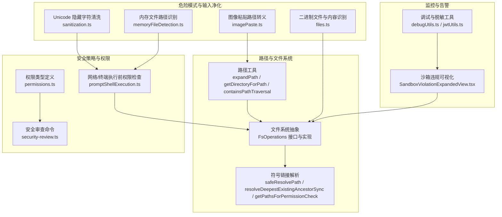
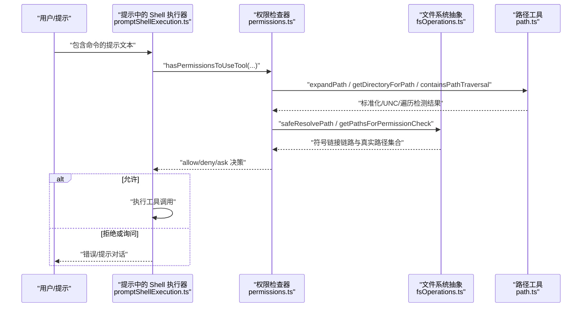
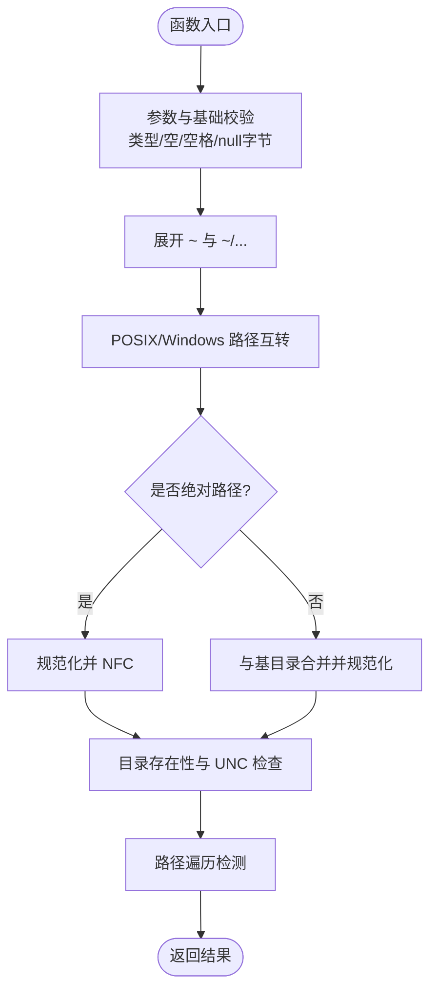
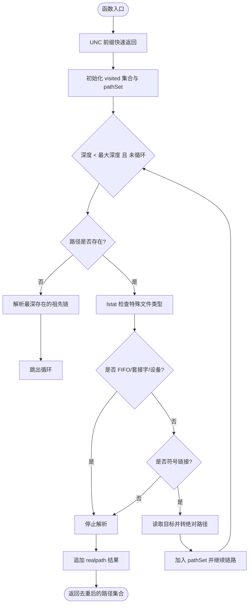
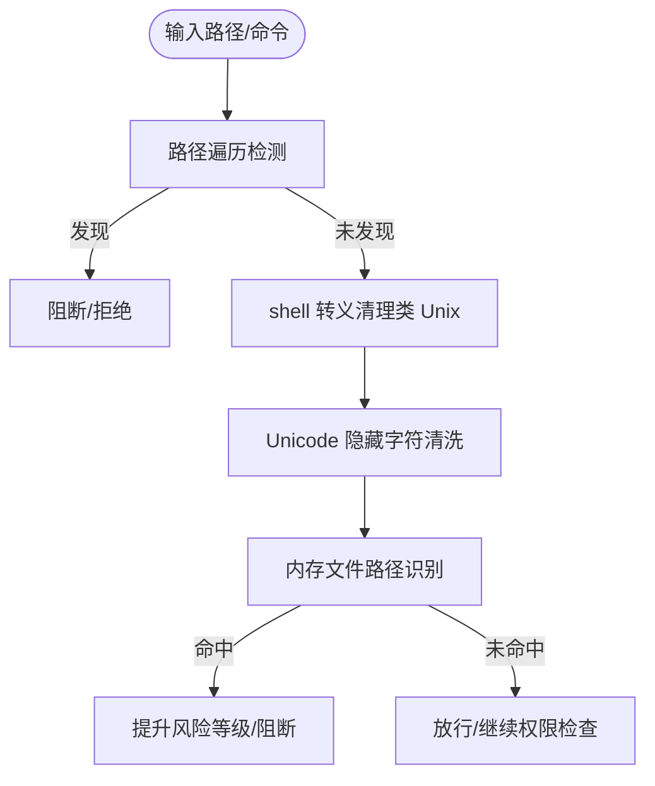
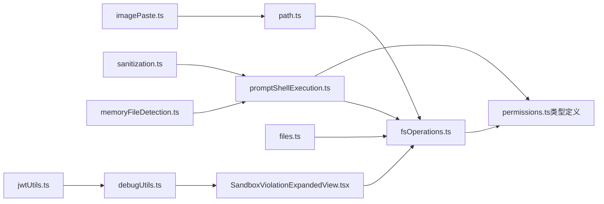

# 安全路径防护

<cite>
**本文引用的文件**
- [fsOperations.ts](file://src/utils/fsOperations.ts)
- [path.ts](file://src/utils/path.ts)
- [files.ts](file://src/constants/files.ts)
- [permissions.ts（类型定义）](file://src/types/permissions.ts)
- [security-review.ts](file://src/commands/security-review.ts)
- [cyberRiskInstruction.ts](file://src/constants/cyberRiskInstruction.ts)
- [imagePaste.ts](file://src/utils/imagePaste.ts)
- [sanitization.ts](file://src/utils/sanitization.ts)
- [promptShellExecution.ts](file://src/utils/promptShellExecution.ts)
- [memoryFileDetection.ts](file://src/utils/memoryFileDetection.ts)
- [SandboxViolationExpandedView.tsx](file://src/components/SandboxViolationExpandedView.tsx)
- [jwtUtils.ts](file://src/bridge/jwtUtils.ts)
- [debugUtils.ts](file://src/bridge/debugUtils.ts)
</cite>

## 目录
1. [引言](#引言)
2. [项目结构](#项目结构)
3. [核心组件](#核心组件)
4. [架构总览](#架构总览)
5. [详细组件分析](#详细组件分析)
6. [依赖关系分析](#依赖关系分析)
7. [性能考量](#性能考量)
8. [故障排查指南](#故障排查指南)
9. [结论](#结论)
10. [附录](#附录)

## 引言
本技术文档聚焦于 Claude Code 的“安全路径防护”体系，围绕路径验证机制、危险模式检测、文件系统权限检查、安全策略配置与管理、安全事件监控与告警等维度进行系统化梳理。文档旨在帮助开发者与安全工程师理解并正确使用与扩展该体系，以抵御路径遍历、符号链接逃逸、命令注入、敏感信息泄露等风险。

## 项目结构
安全路径防护相关能力主要分布在以下模块：
- 路径解析与规范化：路径展开、UNC 防护、相对/绝对路径处理、跨平台兼容
- 符号链接与真实路径解析：链式解析、深度祖先解析、最终规范化
- 危险模式检测：路径遍历检测、特殊字符与转义处理、Unicode 隐藏字符清洗
- 文件类型与二进制内容识别：扩展名黑名单、字节级二进制判定
- 权限策略与决策：规则来源、行为模式、更新与持久化
- 安全事件监控与告警：沙箱违规可视化、调试消息过滤与脱敏

图表来源
- [path.ts:32-135](file://src/utils/path.ts#L32-L135)
- [fsOperations.ts:138-382](file://src/utils/fsOperations.ts#L138-L382)
- [permissions.ts（类型定义）:1-442](file://src/types/permissions.ts#L1-L442)
- [security-review.ts:42-171](file://src/commands/security-review.ts#L42-L171)
- [promptShellExecution.ts:88-121](file://src/utils/promptShellExecution.ts#L88-L121)
- [imagePaste.ts:280-315](file://src/utils/imagePaste.ts#L280-L315)
- [sanitization.ts:1-51](file://src/utils/sanitization.ts#L1-L51)
- [memoryFileDetection.ts:224-253](file://src/utils/memoryFileDetection.ts#L224-L253)
- [files.ts:1-156](file://src/constants/files.ts#L1-L156)
- [SandboxViolationExpandedView.tsx:1-87](file://src/components/SandboxViolationExpandedView.tsx#L1-L87)
- [debugUtils.ts:1-46](file://src/bridge/debugUtils.ts#L1-L46)
- [jwtUtils.ts:1-37](file://src/bridge/jwtUtils.ts#L1-L37)

章节来源
- [path.ts:32-135](file://src/utils/path.ts#L32-L135)
- [fsOperations.ts:138-382](file://src/utils/fsOperations.ts#L138-L382)
- [permissions.ts（类型定义）:1-442](file://src/types/permissions.ts#L1-L442)
- [security-review.ts:42-171](file://src/commands/security-review.ts#L42-L171)
- [promptShellExecution.ts:88-121](file://src/utils/promptShellExecution.ts#L88-L121)
- [imagePaste.ts:280-315](file://src/utils/imagePaste.ts#L280-L315)
- [sanitization.ts:1-51](file://src/utils/sanitization.ts#L1-L51)
- [memoryFileDetection.ts:224-253](file://src/utils/memoryFileDetection.ts#L224-L253)
- [files.ts:1-156](file://src/constants/files.ts#L1-L156)
- [SandboxViolationExpandedView.tsx:1-87](file://src/components/SandboxViolationExpandedView.tsx#L1-L87)
- [debugUtils.ts:1-46](file://src/bridge/debugUtils.ts#L1-L46)
- [jwtUtils.ts:1-37](file://src/bridge/jwtUtils.ts#L1-L37)

## 核心组件
- 路径解析与规范化
  - 展开波浪号与 POSIX/Windows 路径互转、空路径与空白路径处理、null 字节校验、相对/绝对路径解析、UNC 跳过文件系统操作
  - 提供相对路径化与目录提取工具，避免路径遍历
- 符号链接与真实路径解析
  - 安全解析：阻断 FIFO/套接字/设备；失败时回退原路径；循环保护；深度祖先解析；收集中间目标与最终规范化路径
  - 权限检查覆盖：原始路径、中间链路、最终真实路径三者均纳入校验
- 危险模式检测
  - 路径遍历正则检测
  - 图像粘贴路径在类 Unix 平台去除 shell 转义
  - Unicode 隐藏字符清洗（NFKC 规范化 + 分类移除）
  - 内存文件路径识别（结合配置目录与路径 token 匹配）
- 文件类型与二进制内容识别
  - 扩展名黑名单（二进制/可执行/数据库/字体/设计等）
  - 字节级二进制判定（零字节、非打印字符比例阈值）
- 权限策略与决策
  - 模式：默认/免审/绕过/自动/计划等
  - 行为：允许/询问/拒绝
  - 规则来源：用户设置/项目设置/本地设置/策略设置/会话等
  - 更新：增删改规则、设置模式、工作目录增删
- 安全事件监控与告警
  - 沙箱违规计数与最近事件展示
  - 调试消息过滤与敏感字段脱敏
  - JWT 载荷解码（不验证签名）

章节来源
- [path.ts:32-135](file://src/utils/path.ts#L32-L135)
- [fsOperations.ts:138-382](file://src/utils/fsOperations.ts#L138-L382)
- [files.ts:1-156](file://src/constants/files.ts#L1-L156)
- [permissions.ts（类型定义）:1-442](file://src/types/permissions.ts#L1-L442)
- [imagePaste.ts:280-315](file://src/utils/imagePaste.ts#L280-L315)
- [sanitization.ts:1-51](file://src/utils/sanitization.ts#L1-L51)
- [memoryFileDetection.ts:224-253](file://src/utils/memoryFileDetection.ts#L224-L253)
- [SandboxViolationExpandedView.tsx:1-87](file://src/components/SandboxViolationExpandedView.tsx#L1-L87)
- [debugUtils.ts:1-46](file://src/bridge/debugUtils.ts#L1-L46)
- [jwtUtils.ts:1-37](file://src/bridge/jwtUtils.ts#L1-L37)

## 架构总览
下图展示了从用户输入到工具调用的路径验证与权限检查主流程，以及关键的安全检查点。

图表来源
- [promptShellExecution.ts:88-121](file://src/utils/promptShellExecution.ts#L88-L121)
- [permissions.ts（类型定义）:1-442](file://src/types/permissions.ts#L1-L442)
- [fsOperations.ts:138-382](file://src/utils/fsOperations.ts#L138-L382)
- [path.ts:32-135](file://src/utils/path.ts#L32-L135)

## 详细组件分析

### 组件一：路径解析与规范化
- 功能要点
  - 展开波浪号与 POSIX/Windows 路径互转，统一 NFC 规范化
  - UNC 前缀路径跳过文件系统操作，防止凭据泄漏与网络请求
  - 空字符串与空白路径处理，null 字节校验
  - 目录提取：若为目录返回自身，否则返回父目录
  - 路径遍历检测：正则匹配 ../ 或 ..\ 或结尾为 ..
- 安全意义
  - 防止路径穿越与 UNC 凭据泄露
  - 保证后续权限检查与符号链接解析基于同一规范化路径

图表来源
- [path.ts:32-135](file://src/utils/path.ts#L32-L135)

章节来源
- [path.ts:32-135](file://src/utils/path.ts#L32-L135)

### 组件二：符号链接与真实路径解析
- 功能要点
  - 安全解析：先 lstat 检测 FIFO/套接字/设备，再 realpath；失败回退原路径
  - 循环保护：最大深度与已访问集合
  - 新建文件场景：resolveDeepestExistingAncestorSync 解析存在的祖先链，避免写入逃逸
  - 权限检查集合：原始路径、中间链路、最终真实路径三者均纳入
- 安全意义
  - 防止通过符号链接绕过工作区限制
  - 避免循环链路导致的无限递归与资源耗尽

图表来源
- [fsOperations.ts:138-382](file://src/utils/fsOperations.ts#L138-L382)

章节来源
- [fsOperations.ts:138-382](file://src/utils/fsOperations.ts#L138-L382)

### 组件三：危险模式检测与输入净化
- 路径遍历检测
  - 使用正则检测 ../、..\、结尾为 .. 的模式
- 特殊字符与转义
  - 图像粘贴路径在类 Unix 平台去除 shell 转义，避免命令行注入
- Unicode 隐藏字符清洗
  - NFKC 规范化 + 移除危险 Unicode 类别 + 显式范围清洗
- 内存文件路径识别
  - 匹配配置目录与路径 token，结合平台差异（Windows MinGW 形式）判断是否命中内存路径

图表来源
- [path.ts:133-135](file://src/utils/path.ts#L133-L135)
- [imagePaste.ts:280-315](file://src/utils/imagePaste.ts#L280-L315)
- [sanitization.ts:1-51](file://src/utils/sanitization.ts#L1-L51)
- [memoryFileDetection.ts:224-253](file://src/utils/memoryFileDetection.ts#L224-L253)

章节来源
- [path.ts:133-135](file://src/utils/path.ts#L133-L135)
- [imagePaste.ts:280-315](file://src/utils/imagePaste.ts#L280-L315)
- [sanitization.ts:1-51](file://src/utils/sanitization.ts#L1-L51)
- [memoryFileDetection.ts:224-253](file://src/utils/memoryFileDetection.ts#L224-L253)

### 组件四：文件类型与二进制内容识别
- 扩展名黑名单：图片/视频/音频/压缩包/可执行/数据库/字体/设计/字节码等
- 字节级二进制判定：前若干字节内出现零字节或非打印字符比例超过阈值即判定为二进制
- 应用场景：避免对二进制文件进行文本比较或上下文注入

章节来源
- [files.ts:1-156](file://src/constants/files.ts#L1-L156)

### 组件五：权限策略与决策
- 模式与行为
  - 模式：acceptEdits/bypassPermissions/default/dontAsk/plan/auto/bubble
  - 行为：allow/deny/ask
- 规则来源与持久化
  - userSettings/projectSettings/localSettings/flagSettings/policySettings/cliArg/command/session
  - 支持增删改规则、设置模式、工作目录增删
- 决策原因与解释
  - 规则/模式/子命令结果/异步代理/分类器/工作目录/安全检查等
- 自动模式与分类器
  - 在敏感路径或高风险场景下，分类器可异步评估并可能自动批准

章节来源
- [permissions.ts（类型定义）:1-442](file://src/types/permissions.ts#L1-L442)

### 组件六：安全事件监控与告警
- 沙箱违规可视化
  - 订阅沙箱违规存储，展示最近事件与总数
- 调试消息过滤与脱敏
  - 分类过滤、敏感字段脱敏（最小长度阈值）、消息截断
- JWT 载荷解码
  - 解析 base64url 载荷段（不验证签名），用于诊断与审计

章节来源
- [SandboxViolationExpandedView.tsx:1-87](file://src/components/SandboxViolationExpandedView.tsx#L1-L87)
- [debugUtils.ts:1-46](file://src/bridge/debugUtils.ts#L1-L46)
- [jwtUtils.ts:1-37](file://src/bridge/jwtUtils.ts#L1-L37)

## 依赖关系分析
- 路径工具依赖文件系统抽象接口，确保在不同运行环境（Node/Bun/虚拟实现）下行为一致
- 权限检查贯穿工具调用前链路，前置阻断高风险路径与命令
- 危险模式检测作为输入净化的一部分，与权限检查协同工作
- 安全事件监控独立于业务逻辑，通过订阅与脱敏保障可观测性与隐私

图表来源
- [path.ts:32-135](file://src/utils/path.ts#L32-L135)
- [fsOperations.ts:138-382](file://src/utils/fsOperations.ts#L138-L382)
- [permissions.ts（类型定义）:1-442](file://src/types/permissions.ts#L1-L442)
- [promptShellExecution.ts:88-121](file://src/utils/promptShellExecution.ts#L88-L121)
- [imagePaste.ts:280-315](file://src/utils/imagePaste.ts#L280-L315)
- [sanitization.ts:1-51](file://src/utils/sanitization.ts#L1-L51)
- [memoryFileDetection.ts:224-253](file://src/utils/memoryFileDetection.ts#L224-L253)
- [files.ts:1-156](file://src/constants/files.ts#L1-L156)
- [SandboxViolationExpandedView.tsx:1-87](file://src/components/SandboxViolationExpandedView.tsx#L1-L87)
- [debugUtils.ts:1-46](file://src/bridge/debugUtils.ts#L1-L46)
- [jwtUtils.ts:1-37](file://src/bridge/jwtUtils.ts#L1-L37)

## 性能考量
- 符号链接解析采用“深度优先 + 循环保护”，最大深度与已访问集合避免无限递归
- realpathSync 仅在必要时调用，lstatSync 优先探测特殊文件类型以避免阻塞
- 文件读取采用分块反向读取与范围读取，降低内存占用
- 权限检查在工具调用前进行，减少无效 IO 与潜在风险暴露

## 故障排查指南
- 路径解析失败
  - 检查 UNC 前缀是否被正确识别与短路
  - 确认波浪号展开与 POSIX/Windows 路径转换是否符合预期
- 符号链接逃逸
  - 确保 getPathsForPermissionCheck 收集了中间链路与最终真实路径
  - 检查循环保护与最大深度设置
- 权限误判
  - 核对规则来源与行为模式，确认是否命中自动模式或分类器
  - 查看决策原因（规则/模式/工作目录/安全检查）
- 沙箱违规频繁
  - 通过可视化组件查看最近事件，结合调试消息过滤与脱敏定位问题
- 日志与令牌
  - 使用调试脱敏工具屏蔽敏感字段，使用 JWT 工具解码载荷辅助诊断

章节来源
- [fsOperations.ts:138-382](file://src/utils/fsOperations.ts#L138-L382)
- [permissions.ts（类型定义）:1-442](file://src/types/permissions.ts#L1-L442)
- [SandboxViolationExpandedView.tsx:1-87](file://src/components/SandboxViolationExpandedView.tsx#L1-L87)
- [debugUtils.ts:1-46](file://src/bridge/debugUtils.ts#L1-L46)
- [jwtUtils.ts:1-37](file://src/bridge/jwtUtils.ts#L1-L37)

## 结论
该安全路径防护体系通过“路径规范化 + 符号链接解析 + 危险模式检测 + 权限策略 + 事件监控”的多层防御，有效降低了路径遍历、命令注入、符号链接逃逸与敏感信息泄露的风险。建议在新增工具或路径处理逻辑时，严格复用现有路径与权限检查组件，并结合自动化安全审查与分类器能力，持续提升整体安全性。

## 附录
- 安全审查范围与方法
  - 输入验证漏洞、认证授权问题、加密与密钥管理、注入与代码执行、数据暴露
  - 方法论：阶段化研究、对比分析、脆弱性评估、排除噪声与理论问题
- 网络与终端执行前的权限检查
  - 在工具调用前进行权限评估，失败即中止，避免执行高风险命令

章节来源
- [security-review.ts:42-171](file://src/commands/security-review.ts#L42-L171)
- [promptShellExecution.ts:88-121](file://src/utils/promptShellExecution.ts#L88-L121)
- [cyberRiskInstruction.ts:1-24](file://src/constants/cyberRiskInstruction.ts#L1-L24)