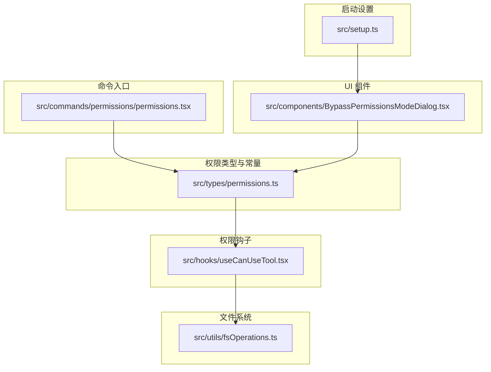
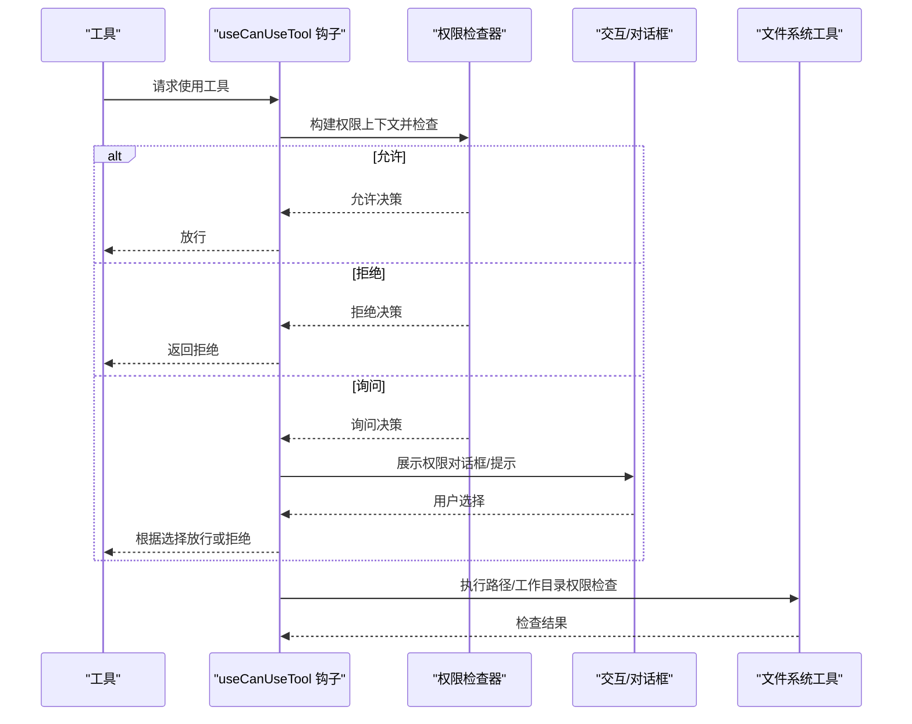
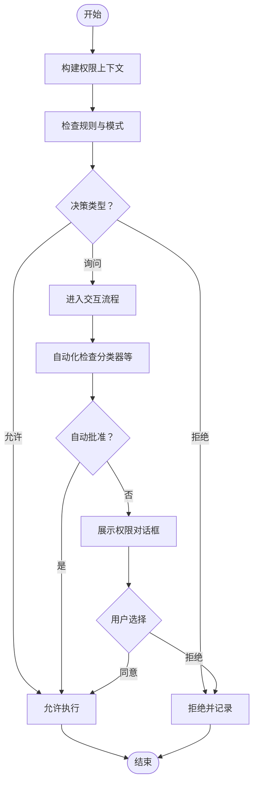
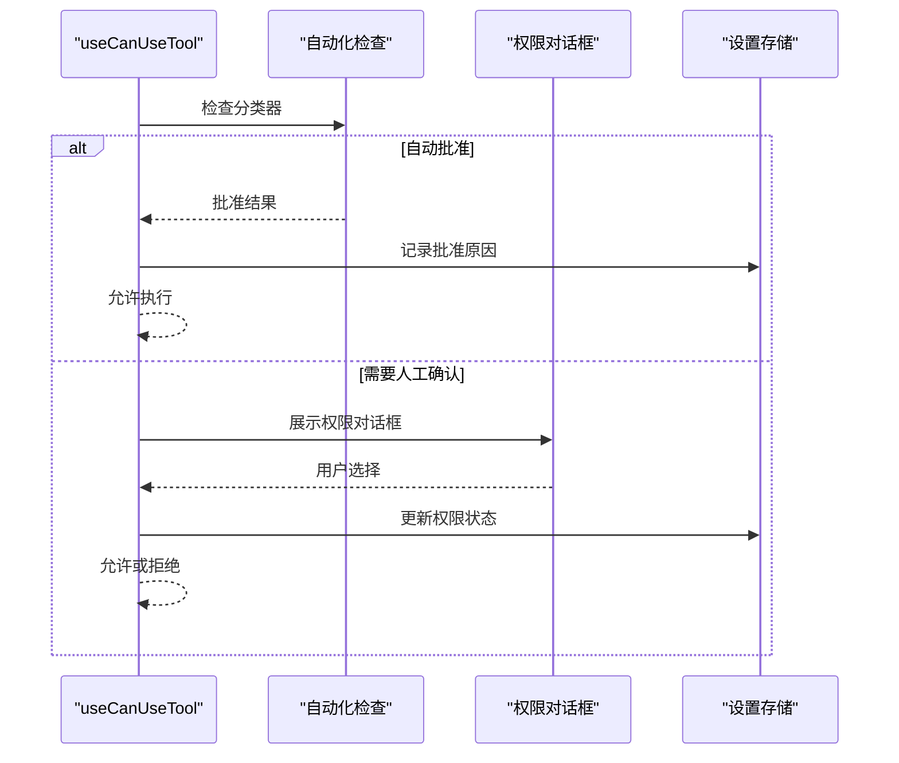
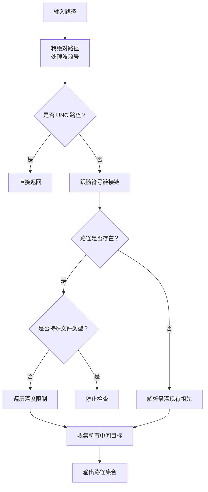
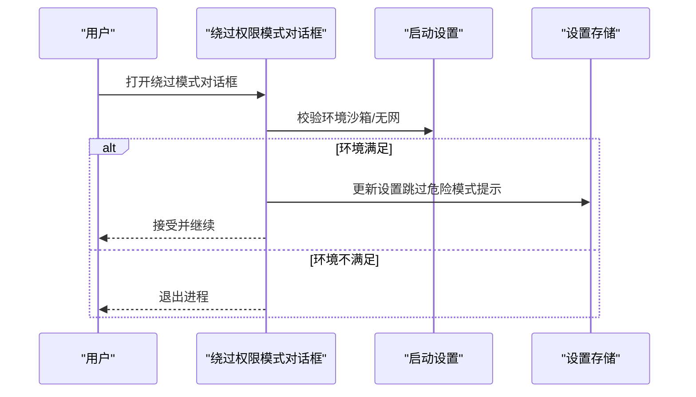
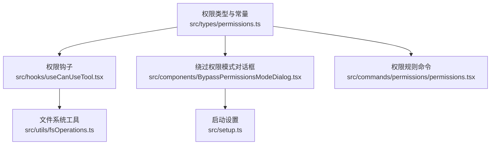

# 权限控制系统

<cite>
**本文档引用的文件**
- [src\types\permissions.ts](file://src\types\permissions.ts)
- [src\commands\permissions\permissions.tsx](file://src\commands\permissions\permissions.tsx)
- [src\components\BypassPermissionsModeDialog.tsx](file://src\components\BypassPermissionsModeDialog.tsx)
- [src\hooks\useCanUseTool.tsx](file://src\hooks\useCanUseTool.tsx)
- [src\utils\fsOperations.ts](file://src\utils\fsOperations.ts)
- [src\setup.ts](file://src\setup.ts)
</cite>

## 目录
1. [简介](#简介)
2. [项目结构](#项目结构)
3. [核心组件](#核心组件)
4. [架构总览](#架构总览)
5. [详细组件分析](#详细组件分析)
6. [依赖关系分析](#依赖关系分析)
7. [性能考虑](#性能考虑)
8. [故障排除指南](#故障排除指南)
9. [结论](#结论)
10. [附录](#附录)

## 简介
本文件为 Claude Code 工具权限控制系统的技术文档，聚焦于权限检查机制、规则引擎工作流、用户交互流程、安全路径限制、绕过权限模式以及最佳实践与扩展方法。文档基于仓库中的类型定义、命令入口、对话框组件、权限钩子与工具检查逻辑、文件系统权限检查以及启动时的安全约束进行综合分析。

## 项目结构
权限控制涉及以下关键模块：
- 类型与常量：集中定义权限模式、行为、规则、决策结果等类型与常量
- 命令入口：提供管理权限规则的本地 JSX 命令界面
- 对话框组件：用于展示绕过权限模式的确认对话框
- 权限钩子：在工具执行前进行权限决策与交互
- 文件系统工具：对路径进行安全检查与规范化
- 启动设置：对危险模式的使用进行环境约束

**图表来源**
- [src\types\permissions.ts:16-38](file://src\types\permissions.ts#L16-L38)
- [src\commands\permissions\permissions.tsx:1-10](file://src\commands\permissions\permissions.tsx#L1-L10)
- [src\components\BypassPermissionsModeDialog.tsx:1-87](file://src\components\BypassPermissionsModeDialog.tsx#L1-L87)
- [src\hooks\useCanUseTool.tsx:1-204](file://src\hooks\useCanUseTool.tsx#L1-L204)
- [src\utils\fsOperations.ts:283-353](file://src\utils\fsOperations.ts#L283-L353)
- [src\setup.ts:414-443](file://src\setup.ts#L414-L443)

**章节来源**
- [src\types\permissions.ts:16-38](file://src\types\permissions.ts#L16-L38)
- [src\commands\permissions\permissions.tsx:1-10](file://src\commands\permissions\permissions.tsx#L1-L10)
- [src\components\BypassPermissionsModeDialog.tsx:1-87](file://src\components\BypassPermissionsModeDialog.tsx#L1-L87)
- [src\hooks\useCanUseTool.tsx:1-204](file://src\hooks\useCanUseTool.tsx#L1-L204)
- [src\utils\fsOperations.ts:283-353](file://src\utils\fsOperations.ts#L283-L353)
- [src\setup.ts:414-443](file://src\setup.ts#L414-L443)

## 核心组件
- 权限模式与行为
  - 外部权限模式：acceptEdits、bypassPermissions、default、dontAsk、plan
  - 内部权限模式：在外部模式基础上，根据特性开关可能包含 auto
  - 行为：allow、deny、ask
- 权限规则
  - 规则来源：userSettings、projectSettings、localSettings、flagSettings、policySettings、cliArg、command、session
  - 规则值：包含工具名与可选内容
  - 规则行为：allow、deny、ask
- 权限决策与结果
  - 决策类型：允许、询问、拒绝
  - 结果类型：在决策基础上增加 passthrough
  - 决策原因：来自规则、模式、子命令结果、提示工具、钩子、异步代理、沙箱覆盖、分类器、工作目录、安全检查等
- 分类器与自动模式
  - 分类器结果：匹配状态、置信度、原因
  - 自动模式下的分类器批准与记录

**章节来源**
- [src\types\permissions.ts:16-38](file://src\types\permissions.ts#L16-L38)
- [src\types\permissions.ts:54-79](file://src\types\permissions.ts#L54-L79)
- [src\types\permissions.ts:174-266](file://src\types\permissions.ts#L174-L266)
- [src\types\permissions.ts:271-325](file://src\types\permissions.ts#L271-L325)
- [src\types\permissions.ts:330-397](file://src\types\permissions.ts#L330-L397)

## 架构总览
权限控制的整体流程如下：
- 工具调用前通过钩子进行权限上下文构建与决策
- 若决策为允许，直接放行；若为拒绝，记录并返回拒绝结果；若为询问，则进入交互流程
- 交互流程中，优先尝试自动化检查（如分类器），随后根据模式与规则决定是否弹出对话框或直接放行
- 路径与工作目录的权限检查贯穿于工具执行前后，确保不越权访问

**图表来源**
- [src\hooks\useCanUseTool.tsx:28-191](file://src\hooks\useCanUseTool.tsx#L28-L191)
- [src\types\permissions.ts:174-266](file://src\types\permissions.ts#L174-L266)
- [src\utils\fsOperations.ts:283-353](file://src\utils\fsOperations.ts#L283-L353)

## 详细组件分析

### 权限模式与规则引擎
- 权限模式
  - default：默认模式，遵循规则与交互策略
  - auto：自动模式（按特性开关启用），支持异步分类器评估
  - ask：总是询问用户
  - bypassPermissions：绕过权限模式（需满足严格环境条件）
  - acceptEdits/dontAsk/plan：其他外部模式
- 规则解析与匹配
  - 规则来源与行为组合形成决策依据
  - 决策原因包含规则来源、模式、子命令结果、分类器、工作目录、安全检查等
- 决策过程
  - 优先级：明确规则 > 模式 > 子命令结果 > 提示工具 > 钩子 > 异步代理 > 沙箱覆盖 > 分类器 > 工作目录 > 安全检查
  - 自动模式下，分类器可提前批准，减少用户交互

**图表来源**
- [src\types\permissions.ts:16-38](file://src\types\permissions.ts#L16-L38)
- [src\types\permissions.ts:54-79](file://src\types\permissions.ts#L54-L79)
- [src\types\permissions.ts:174-266](file://src\types\permissions.ts#L174-L266)
- [src\hooks\useCanUseTool.tsx:95-167](file://src\hooks\useCanUseTool.tsx#L95-L167)

**章节来源**
- [src\types\permissions.ts:16-38](file://src\types\permissions.ts#L16-L38)
- [src\types\permissions.ts:54-79](file://src\types\permissions.ts#L54-L79)
- [src\types\permissions.ts:174-266](file://src\types\permissions.ts#L174-L266)
- [src\hooks\useCanUseTool.tsx:95-167](file://src\hooks\useCanUseTool.tsx#L95-L167)

### 用户交互流程与权限记忆
- 交互触发点
  - 当决策为 ask 且未开启“等待自动化检查后再弹窗”时，进入交互流程
  - 自动模式下，若存在分类器批准，可直接放行并记录
- 用户选择处理
  - 分类器提前批准：记录批准原因，直接允许
  - 对话框确认：根据用户选择更新权限状态
- 权限记忆机制
  - 通过设置源（如 userSettings）持久化权限偏好
  - 自动模式拒绝会生成通知，引导用户查看权限规则

**图表来源**
- [src\hooks\useCanUseTool.tsx:43-53](file://src\hooks\useCanUseTool.tsx#L43-L53)
- [src\hooks\useCanUseTool.tsx:126-159](file://src\hooks\useCanUseTool.tsx#L126-L159)
- [src\hooks\useCanUseTool.tsx:160-167](file://src\hooks\useCanUseTool.tsx#L160-L167)

**章节来源**
- [src\hooks\useCanUseTool.tsx:43-53](file://src\hooks\useCanUseTool.tsx#L43-L53)
- [src\hooks\useCanUseTool.tsx:126-159](file://src\hooks\useCanUseTool.tsx#L126-L159)
- [src\hooks\useCanUseTool.tsx:160-167](file://src\hooks\useCanUseTool.tsx#L160-L167)

### 安全路径限制与防护
- 路径验证
  - 将输入路径转换为绝对路径，处理波浪号展开
  - 阻止 UNC 路径以避免网络请求
  - 跟随符号链接链，收集所有中间目标，防止通过链接逃逸
- 危险模式检测
  - 对 FIFO、套接字、字符设备、块设备等特殊文件类型跳过处理
  - 对不存在路径进行祖先链深度解析，确保权限检查看到真实目标
- 防护措施
  - 限制符号链接遍历深度，防止循环链接导致的无限循环
  - 在 macOS 等平台正确处理路径规范化

**图表来源**
- [src\utils\fsOperations.ts:283-353](file://src\utils\fsOperations.ts#L283-L353)

**章节来源**
- [src\utils\fsOperations.ts:283-353](file://src\utils\fsOperations.ts#L283-L353)

### 绕过权限模式的实现与使用场景
- 绕过模式对话框
  - 展示警告信息，强调仅在沙箱容器/虚拟机中使用
  - 提供“接受/退出”选项，接受后更新设置以跳过危险模式权限提示
- 使用场景
  - 受控沙箱环境（Docker、Bubblewrap、IS_SANDBOX）且无互联网访问
  - 中途切换：桌面应用等场景下允许在会话中切换
- 启动时约束
  - 仅在特定入口类型下允许使用危险模式
  - 必须满足沙箱与无网条件，否则直接退出

**图表来源**
- [src\components\BypassPermissionsModeDialog.tsx:12-87](file://src\components\BypassPermissionsModeDialog.tsx#L12-L87)
- [src\setup.ts:414-443](file://src\setup.ts#L414-L443)

**章节来源**
- [src\components\BypassPermissionsModeDialog.tsx:12-87](file://src\components\BypassPermissionsModeDialog.tsx#L12-L87)
- [src\setup.ts:414-443](file://src\setup.ts#L414-L443)

### 权限规则管理命令
- 命令入口
  - 提供本地 JSX 命令，渲染权限规则列表
  - 支持重试被拒绝的规则，将消息注入上下文
- 功能要点
  - 列表展示当前规则与来源
  - 允许用户调整规则行为与目标

**章节来源**
- [src\commands\permissions\permissions.tsx:1-10](file://src\commands\permissions\permissions.tsx#L1-L10)

## 依赖关系分析
- 类型层
  - 权限类型与常量集中定义，避免循环依赖
- 组件层
  - 钩子依赖类型定义与工具检查逻辑
  - 对话框组件依赖设置存储与分析事件
  - 命令入口依赖规则列表组件
- 工具层
  - 文件系统工具为权限检查提供路径安全能力
- 启动层
  - 启动设置对危险模式使用进行环境约束

**图表来源**
- [src\types\permissions.ts:16-38](file://src\types\permissions.ts#L16-L38)
- [src\hooks\useCanUseTool.tsx:1-204](file://src\hooks\useCanUseTool.tsx#L1-L204)
- [src\components\BypassPermissionsModeDialog.tsx:1-87](file://src\components\BypassPermissionsModeDialog.tsx#L1-L87)
- [src\commands\permissions\permissions.tsx:1-10](file://src\commands\permissions\permissions.tsx#L1-L10)
- [src\utils\fsOperations.ts:283-353](file://src\utils\fsOperations.ts#L283-L353)
- [src\setup.ts:414-443](file://src\setup.ts#L414-L443)

**章节来源**
- [src\types\permissions.ts:16-38](file://src\types\permissions.ts#L16-L38)
- [src\hooks\useCanUseTool.tsx:1-204](file://src\hooks\useCanUseTool.tsx#L1-L204)
- [src\components\BypassPermissionsModeDialog.tsx:1-87](file://src\components\BypassPermissionsModeDialog.tsx#L1-L87)
- [src\commands\permissions\permissions.tsx:1-10](file://src\commands\permissions\permissions.tsx#L1-L10)
- [src\utils\fsOperations.ts:283-353](file://src\utils\fsOperations.ts#L283-L353)
- [src\setup.ts:414-443](file://src\setup.ts#L414-L443)

## 性能考虑
- 自动化检查
  - 分类器评估采用非阻塞方式，必要时与 UI 交互并行
  - 对 Bash 命令的分类器检查支持竞速，提高响应速度
- 路径检查
  - 符号链接遍历深度限制，避免极端情况下的性能问题
  - 对不存在路径的祖先链解析仅在必要时进行
- 决策缓存
  - 分类器批准结果可用于后续快速放行，减少重复计算

[本节为通用性能讨论，无需具体文件分析]

## 故障排除指南
- 权限检查抛出中断错误
  - 若捕获到中断或用户取消，记录调试日志并取消权限流程
- 自动模式拒绝通知
  - 自动模式拒绝会生成即时通知，提示用户通过权限命令查看与调整
- 启动时危险模式失败
  - 当环境不满足沙箱与无网要求时，直接退出进程并输出错误信息

**章节来源**
- [src\hooks\useCanUseTool.tsx:171-182](file://src\hooks\useCanUseTool.tsx#L171-L182)
- [src\hooks\useCanUseTool.tsx:84-88](file://src\hooks\useCanUseTool.tsx#L84-L88)
- [src\setup.ts:434-441](file://src\setup.ts#L434-L441)

## 结论
该权限控制系统通过清晰的模式与规则体系、严格的路径安全检查、智能的自动化评估与交互流程，实现了在保证安全的前提下提升用户体验的目标。绕过权限模式仅在受控环境下启用，并通过启动时约束与对话框确认降低风险。建议在生产环境中优先使用默认模式与自动模式，谨慎启用绕过模式，并定期审查权限规则。

## 附录
- 最佳实践
  - 默认使用 default 或 auto 模式，结合规则最小化授权
  - 在沙箱环境中启用绕过模式，并确保无互联网访问
  - 定期审查权限规则与自动模式拒绝记录
- 扩展方法
  - 新增权限规则来源：在类型定义中扩展规则来源枚举
  - 自定义权限处理器：在钩子中添加新的处理分支
  - 自定义分类器：实现分类器评估逻辑并集成到自动化检查流程

[本节为通用指导，无需具体文件分析]