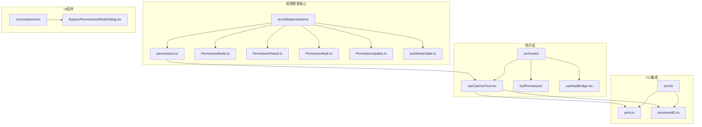
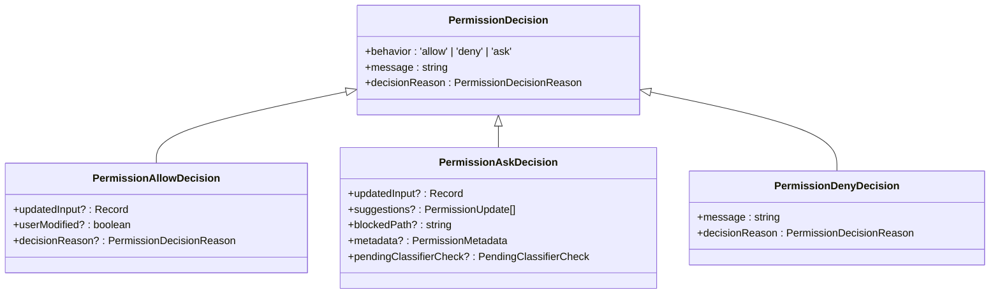
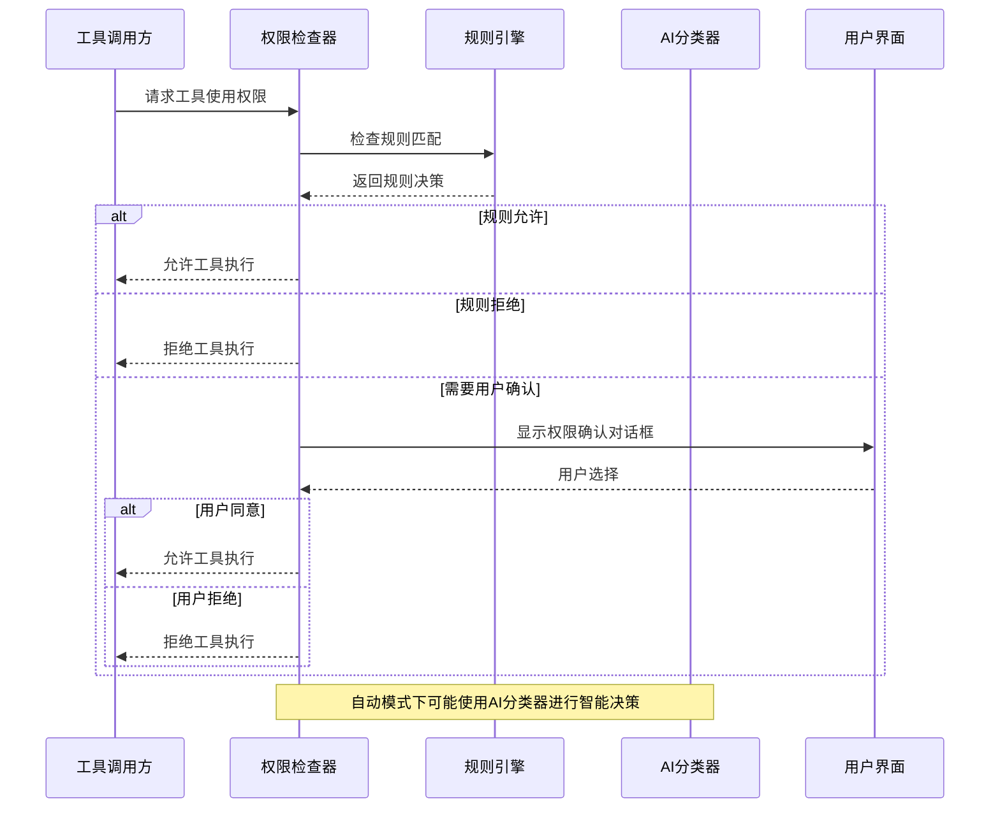
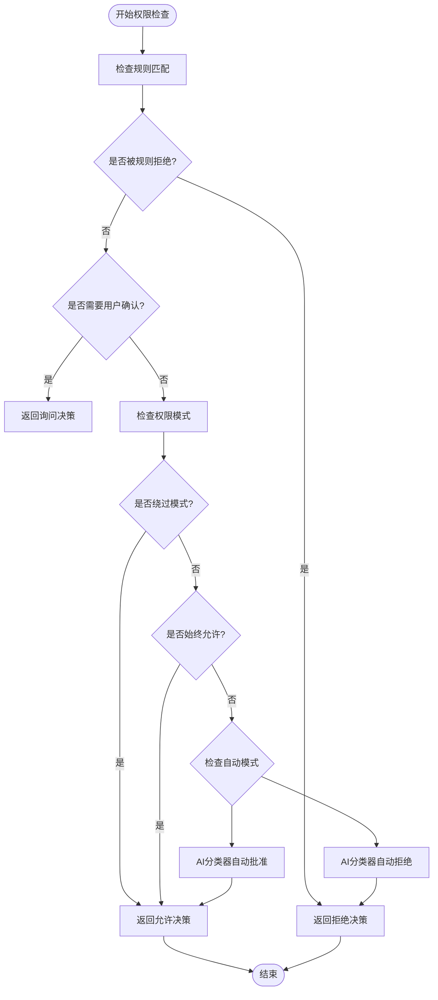
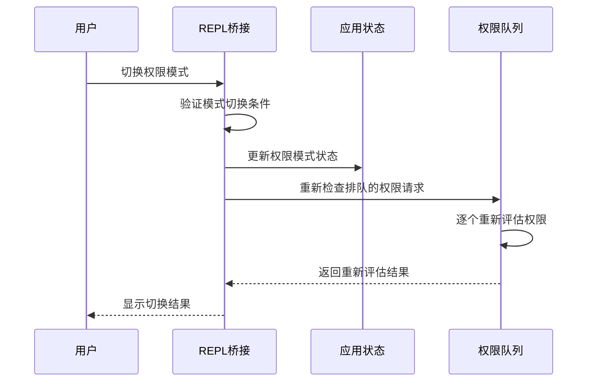
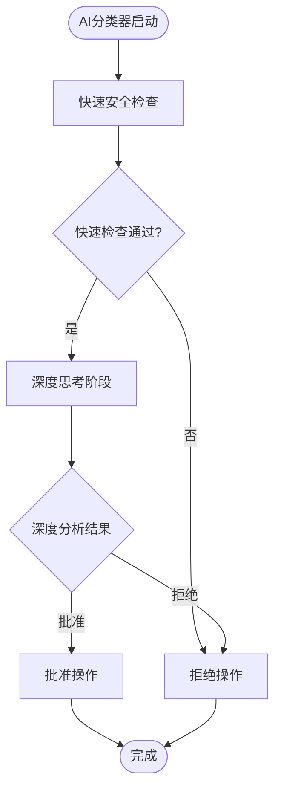
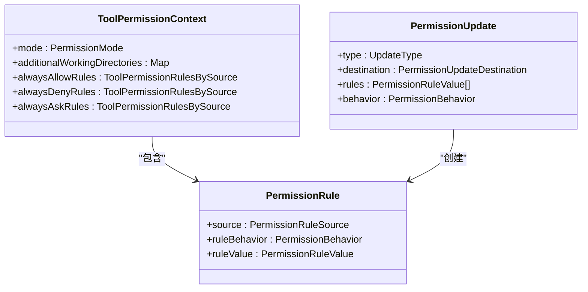
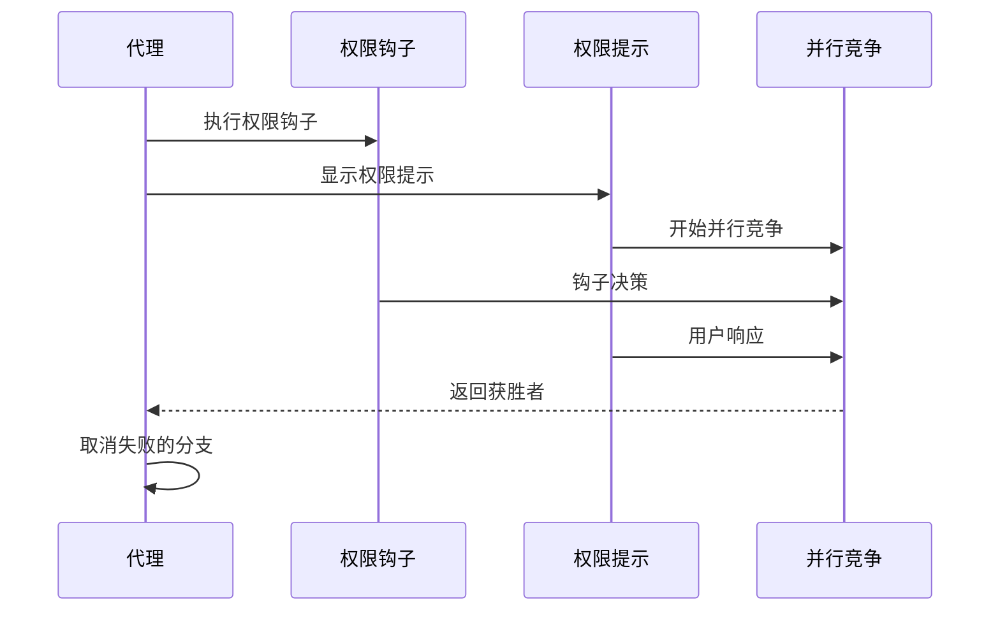
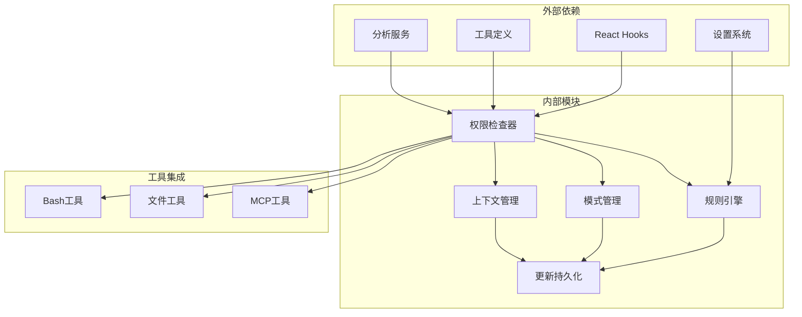

# 权限检查机制

<cite>
**本文档引用的文件**
- [src/tabs/permissions.ts](file://src/tabs/permissions.ts)
- [src/utils/permissions/permissions.ts](file://src/utils/permissions/permissions.ts)
- [src/utils/permissions/PermissionMode.ts](file://src/utils/permissions/PermissionMode.ts)
- [src/utils/permissions/PermissionResult.ts](file://src/utils/permissions/PermissionResult.ts)
- [src/utils/permissions/PermissionRule.ts](file://src/utils/permissions/PermissionRule.ts)
- [src/utils/permissions/PermissionUpdate.ts](file://src/utils/permissions/PermissionUpdate.ts)
- [src/utils/permissions/autoModeState.ts](file://src/utils/permissions/autoModeState.ts)
- [src/hooks/useCanUseTool.tsx](file://src/hooks/useCanUseTool.tsx)
- [src/hooks/toolPermission/PermissionContext.ts](file://src/hooks/toolPermission/PermissionContext.ts)
- [src/hooks/useReplBridge.tsx](file://src/hooks/useReplBridge.tsx)
- [src/cli/print.ts](file://src/cli/print.ts)
- [src/cli/structuredIO.ts](file://src/cli/structuredIO.ts)
- [src/components/BypassPermissionsModeDialog.tsx](file://src/components/BypassPermissionsModeDialog.tsx)
- [src/utils/fsOperations.ts](file://src/utils/fsOperations.ts)
- [src/hooks/useSwarmPermissionPoller.ts](file://src/hooks/useSwarmPermissionPoller.ts)
- [src/hooks/useInboxPoller.ts](file://src/hooks/useInboxPoller.ts)
</cite>

## 目录
1. [简介](#简介)
2. [项目结构](#项目结构)
3. [核心组件](#核心组件)
4. [架构概览](#架构概览)
5. [详细组件分析](#详细组件分析)
6. [依赖关系分析](#依赖关系分析)
7. [性能考虑](#性能考虑)
8. [故障排除指南](#故障排除指南)
9. [结论](#结论)

## 简介

Claude Code 的权限检查机制是一个多层次、可配置的安全系统，旨在保护用户免受潜在危险操作的影响。该系统支持多种权限模式，包括默认模式、自动模式、询问模式和绕过模式，并提供了灵活的规则引擎来处理不同类型的工具调用。

权限检查机制的核心特点包括：
- 多层次权限验证：从规则匹配到AI分类器的渐进式验证
- 实时决策：在工具调用前进行即时权限评估
- 智能缓存：避免重复计算相同的权限决策
- 异步处理：支持后台权限请求和自动批准流程
- 安全隔离：确保危险操作得到适当的安全检查

## 项目结构

权限检查机制主要分布在以下目录中：

**图表来源**
- [src/utils/permissions/permissions.ts:1-1487](file://src/utils/permissions/permissions.ts#L1-L1487)
- [src/hooks/useCanUseTool.tsx:20-203](file://src/hooks/useCanUseTool.tsx#L20-L203)

**章节来源**
- [src/utils/permissions/permissions.ts:1-1487](file://src/utils/permissions/permissions.ts#L1-L1487)
- [src/hooks/useCanUseTool.tsx:20-203](file://src/hooks/useCanUseTool.tsx#L20-L203)

## 核心组件

### 权限模式系统

权限系统支持以下模式：

| 模式 | 描述 | 特殊属性 |
|------|------|----------|
| default | 默认模式，需要用户确认 | 标准权限检查流程 |
| auto | 自动模式，使用AI分类器 | 支持自动批准/拒绝 |
| ask | 询问模式，总是显示确认对话框 | 强制用户交互 |
| bypassPermissions | 绕过模式，跳过权限检查 | 危险模式，仅限沙箱环境 |
| plan | 计划模式，用于任务规划 | 预检查模式 |

### 权限决策类型

权限检查返回三种主要决策：

**图表来源**
- [src/types/permissions.ts:174-246](file://src/types/permissions.ts#L174-L246)

**章节来源**
- [src/types/permissions.ts:174-246](file://src/types/permissions.ts#L174-L246)
- [src/utils/permissions/PermissionResult.ts:1-36](file://src/utils/permissions/PermissionResult.ts#L1-L36)

## 架构概览

权限检查机制采用分层架构设计，确保安全性和灵活性：

**图表来源**
- [src/utils/permissions/permissions.ts:1158-1319](file://src/utils/permissions/permissions.ts#L1158-L1319)
- [src/hooks/useCanUseTool.tsx:62-203](file://src/hooks/useCanUseTool.tsx#L62-L203)

## 详细组件分析

### 权限检查核心算法

权限检查遵循严格的决策流程：

**图表来源**
- [src/utils/permissions/permissions.ts:1158-1319](file://src/utils/permissions/permissions.ts#L1158-L1319)

#### 权限模式切换机制

权限模式的切换通过集中式状态管理实现：

**图表来源**
- [src/hooks/useReplBridge.tsx:425-481](file://src/hooks/useReplBridge.tsx#L425-L481)

**章节来源**
- [src/utils/permissions/permissions.ts:1158-1319](file://src/utils/permissions/permissions.ts#L1158-L1319)
- [src/hooks/useReplBridge.tsx:425-481](file://src/hooks/useReplBridge.tsx#L425-L481)

### 自动模式AI分类器

自动模式使用多阶段AI分类器进行智能决策：

**图表来源**
- [src/utils/permissions/permissions.ts:688-927](file://src/utils/permissions/permissions.ts#L688-L927)

**章节来源**
- [src/utils/permissions/permissions.ts:688-927](file://src/utils/permissions/permissions.ts#L688-L927)

### 权限规则引擎

权限规则引擎支持复杂的规则匹配和组合：

**图表来源**
- [src/types/permissions.ts:75-146](file://src/types/permissions.ts#L75-L146)
- [src/utils/permissions/PermissionUpdate.ts:55-206](file://src/utils/permissions/PermissionUpdate.ts#L55-L206)

**章节来源**
- [src/types/permissions.ts:75-146](file://src/types/permissions.ts#L75-L146)
- [src/utils/permissions/PermissionUpdate.ts:55-206](file://src/utils/permissions/PermissionUpdate.ts#L55-L206)

### 异步权限处理

系统支持异步权限请求和后台处理：

**图表来源**
- [src/cli/structuredIO.ts:567-639](file://src/cli/structuredIO.ts#L567-L639)

**章节来源**
- [src/cli/structuredIO.ts:567-639](file://src/cli/structuredIO.ts#L567-L639)

## 依赖关系分析

权限检查机制的依赖关系如下：

**图表来源**
- [src/utils/permissions/permissions.ts:1-100](file://src/utils/permissions/permissions.ts#L1-L100)
- [src/hooks/useCanUseTool.tsx:20-27](file://src/hooks/useCanUseTool.tsx#L20-L27)

**章节来源**
- [src/utils/permissions/permissions.ts:1-100](file://src/utils/permissions/permissions.ts#L1-L100)
- [src/hooks/useCanUseTool.tsx:20-27](file://src/hooks/useCanUseTool.tsx#L20-L27)

## 性能考虑

### 缓存策略

系统实现了多层次的缓存机制以提高性能：

1. **分类器结果缓存**：避免重复的AI分类器调用
2. **规则匹配缓存**：缓存已验证的规则匹配结果
3. **状态变更缓存**：减少不必要的状态更新

### 异步处理优化

- 使用Promise.race模式并行处理多个权限源
- 实现超时机制防止长时间阻塞
- 支持中断信号以响应用户取消操作

### 内存管理

- 及时清理已完成的权限请求
- 合理的垃圾回收策略
- 避免内存泄漏的资源管理

## 故障排除指南

### 常见问题诊断

1. **权限检查不响应**
   - 检查网络连接和AI分类器可用性
   - 验证权限钩子是否正常运行
   - 查看日志中的错误信息

2. **绕过模式失效**
   - 确认会话是否正确启动
   - 检查配置文件中的设置
   - 验证用户权限级别

3. **自动模式异常**
   - 检查分类器API密钥
   - 验证模型可用性
   - 查看分类器错误日志

### 调试技巧

- 启用详细日志记录
- 使用开发者工具监控权限请求
- 检查状态变更历史
- 分析性能指标和瓶颈

**章节来源**
- [src/components/BypassPermissionsModeDialog.tsx:1-86](file://src/components/BypassPermissionsModeDialog.tsx#L1-L86)
- [src/utils/fsOperations.ts:315-353](file://src/utils/fsOperations.ts#L315-L353)

## 结论

Claude Code 的权限检查机制通过其精心设计的多层架构，为用户提供了强大而灵活的安全保障。该系统不仅能够有效防止潜在的危险操作，还通过智能的自动模式和丰富的配置选项，为不同用户需求提供了个性化的安全体验。

关键优势包括：
- **全面的安全覆盖**：从基础规则到高级AI分类器的多层次防护
- **灵活的配置选项**：支持多种权限模式和自定义规则
- **优秀的用户体验**：智能的自动批准减少了不必要的用户交互
- **强大的扩展性**：模块化设计便于添加新的工具和功能

通过持续的优化和改进，该权限检查机制将继续为 Claude Code 提供可靠的安全保障，同时保持系统的易用性和效率。