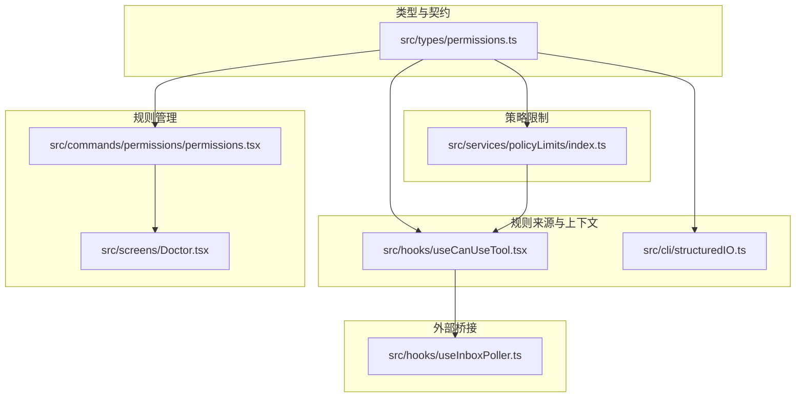
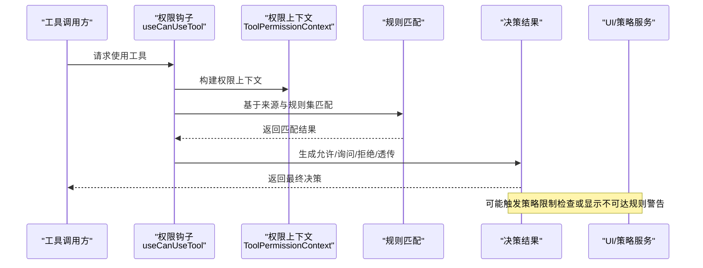
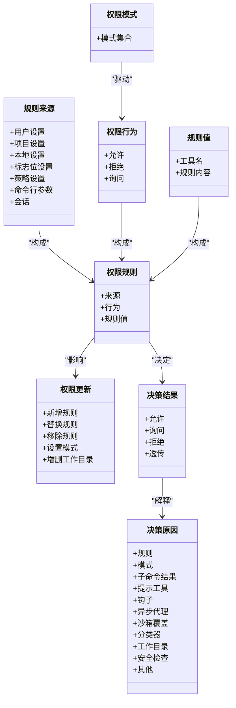
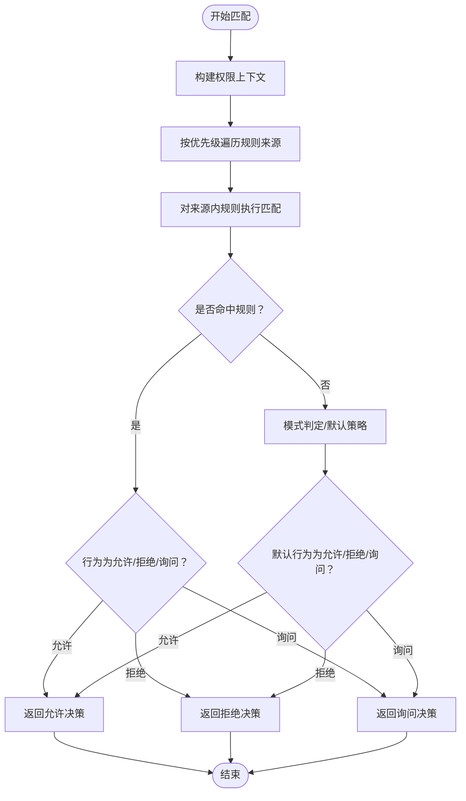
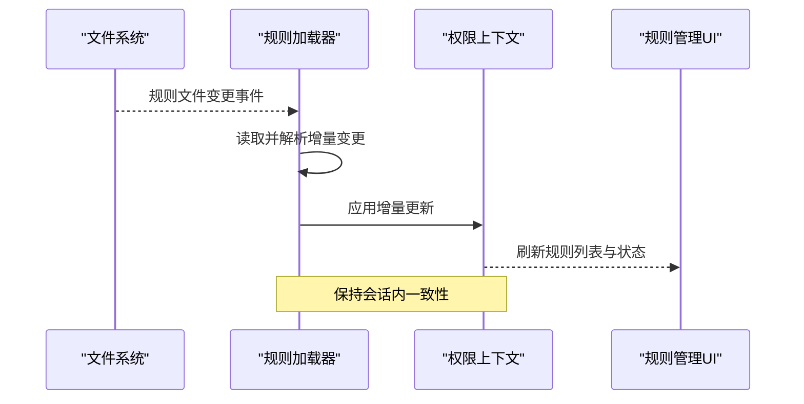
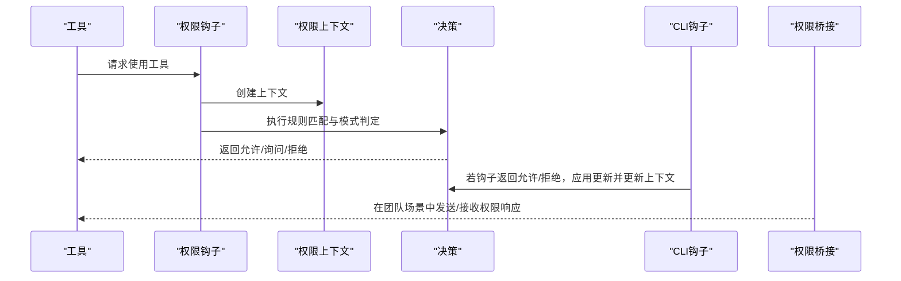
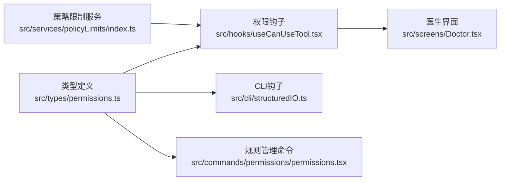

# 权限规则引擎

<cite>
**本文引用的文件**
- [src/types/permissions.ts](file://src/types/permissions.ts)
- [src/services/policyLimits/index.ts](file://src/services/policyLimits/index.ts)
- [src/hooks/useInboxPoller.ts](file://src/hooks/useInboxPoller.ts)
- [src/hooks/useCanUseTool.tsx](file://src/hooks/useCanUseTool.tsx)
- [src/cli/structuredIO.ts](file://src/cli/structuredIO.ts)
- [src/screens/Doctor.tsx](file://src/screens/Doctor.tsx)
- [src/commands/permissions/permissions.tsx](file://src/commands/permissions/permissions.tsx)
</cite>

## 目录
1. [简介](#简介)
2. [项目结构](#项目结构)
3. [核心组件](#核心组件)
4. [架构总览](#架构总览)
5. [详细组件分析](#详细组件分析)
6. [依赖关系分析](#依赖关系分析)
7. [性能考虑](#性能考虑)
8. [故障排查指南](#故障排查指南)
9. [结论](#结论)
10. [附录](#附录)

## 简介
本技术文档聚焦于 Claude Code 的权限规则引擎，系统性阐述权限规则的定义、解析与匹配机制，规则冲突检测与解决（含影子规则提示），动态加载与热更新（含文件监控、增量更新与一致性保障），以及性能优化策略（规则索引、缓存与批量处理）。同时提供自定义权限规则的开发指南与规则模板示例，帮助开发者在不直接阅读源码的情况下理解并扩展权限体系。

## 项目结构
权限规则引擎相关代码主要分布在以下区域：
- 类型与契约：统一的权限类型定义与决策结果类型
- 规则来源与上下文：规则来源枚举、按来源分组的规则集合、工具使用时的权限上下文
- 决策入口与流程：工具使用前的权限检查钩子、CLI 钩子中的权限请求处理
- 规则管理界面：权限规则列表命令入口与 UI 组件
- 策略限制服务：组织级策略限制的拉取、缓存与后台轮询
- 运行时诊断：不可达规则警告等运行时诊断信息

**图表来源**
- [src/types/permissions.ts:1-442](file://src/types/permissions.ts#L1-L442)
- [src/hooks/useCanUseTool.tsx:20-203](file://src/hooks/useCanUseTool.tsx#L20-L203)
- [src/cli/structuredIO.ts:811-859](file://src/cli/structuredIO.ts#L811-L859)
- [src/commands/permissions/permissions.tsx:1-9](file://src/commands/permissions/permissions.tsx#L1-L9)
- [src/screens/Doctor.tsx:459-473](file://src/screens/Doctor.tsx#L459-L473)
- [src/services/policyLimits/index.ts:1-664](file://src/services/policyLimits/index.ts#L1-L664)
- [src/hooks/useInboxPoller.ts:296-337](file://src/hooks/useInboxPoller.ts#L296-L337)

**章节来源**
- [src/types/permissions.ts:1-442](file://src/types/permissions.ts#L1-L442)
- [src/hooks/useCanUseTool.tsx:20-203](file://src/hooks/useCanUseTool.tsx#L20-L203)
- [src/cli/structuredIO.ts:811-859](file://src/cli/structuredIO.ts#L811-L859)
- [src/commands/permissions/permissions.tsx:1-9](file://src/commands/permissions/permissions.tsx#L1-L9)
- [src/screens/Doctor.tsx:459-473](file://src/screens/Doctor.tsx#L459-L473)
- [src/services/policyLimits/index.ts:1-664](file://src/services/policyLimits/index.ts#L1-L664)
- [src/hooks/useInboxPoller.ts:296-337](file://src/hooks/useInboxPoller.ts#L296-L337)

## 核心组件
- 权限模式与行为
  - 模式：包含对外可配置模式与内部模式集合，支持自动与冒泡等模式
  - 行为：允许、拒绝、询问
- 权限规则
  - 规则来源：用户设置、项目设置、本地设置、标志位设置、策略设置、命令行参数、会话等
  - 规则值：工具名与可选规则内容
  - 规则对象：包含来源、行为与值
- 权限更新
  - 更新目标：用户设置、项目设置、本地设置、会话、命令行参数
  - 更新操作：新增规则、替换规则、移除规则、设置模式、增删工作目录
- 决策结果与解释
  - 结果类型：允许、询问、拒绝、透传
  - 决策原因：规则、模式、子命令结果、提示工具、钩子、异步代理、沙箱覆盖、分类器、工作目录、安全检查、其他
- 工具权限上下文
  - 包含模式、额外工作目录映射、按来源分组的“总是允许/拒绝/询问”规则集等

**章节来源**
- [src/types/permissions.ts:16-39](file://src/types/permissions.ts#L16-L39)
- [src/types/permissions.ts:44-45](file://src/types/permissions.ts#L44-L45)
- [src/types/permissions.ts:54-79](file://src/types/permissions.ts#L54-L79)
- [src/types/permissions.ts:88-131](file://src/types/permissions.ts#L88-L131)
- [src/types/permissions.ts:171-266](file://src/types/permissions.ts#L171-L266)
- [src/types/permissions.ts:271-324](file://src/types/permissions.ts#L271-L324)
- [src/types/permissions.ts:419-441](file://src/types/permissions.ts#L419-L441)

## 架构总览
权限规则引擎围绕“规则来源—规则上下文—决策入口—UI/策略服务”的链路展开。工具使用前通过钩子进行权限检查；CLI 钩子中可直接返回允许/拒绝决策；策略限制服务提供组织级限制并支持后台轮询；运行时诊断组件展示不可达规则等告警。

**图表来源**
- [src/hooks/useCanUseTool.tsx:20-203](file://src/hooks/useCanUseTool.tsx#L20-L203)
- [src/types/permissions.ts:419-441](file://src/types/permissions.ts#L419-L441)
- [src/services/policyLimits/index.ts:510-526](file://src/services/policyLimits/index.ts#L510-L526)
- [src/screens/Doctor.tsx:459-473](file://src/screens/Doctor.tsx#L459-L473)

## 详细组件分析

### 权限规则定义与数据模型
- 规则来源与行为
  - 来源涵盖用户、项目、本地、标志位、策略、命令行、会话等，便于区分优先级与作用域
  - 行为分为允许、拒绝、询问三类，分别对应不同后续处理路径
- 规则值与规则对象
  - 规则值包含工具名与可选规则内容，用于细化匹配条件
  - 规则对象整合来源、行为与值，作为规则匹配的基本单元
- 权限更新
  - 支持新增、替换、移除规则，以及设置模式、增删工作目录等操作
  - 更新目标明确持久化位置，便于跨会话与跨进程一致化
- 决策与解释
  - 决策结果包含行为、消息、建议、阻断路径、元数据等
  - 决策原因类型丰富，便于审计与诊断

**图表来源**
- [src/types/permissions.ts:16-39](file://src/types/permissions.ts#L16-L39)
- [src/types/permissions.ts:44-45](file://src/types/permissions.ts#L44-L45)
- [src/types/permissions.ts:54-79](file://src/types/permissions.ts#L54-L79)
- [src/types/permissions.ts:88-131](file://src/types/permissions.ts#L88-L131)
- [src/types/permissions.ts:171-266](file://src/types/permissions.ts#L171-L266)
- [src/types/permissions.ts:271-324](file://src/types/permissions.ts#L271-L324)

**章节来源**
- [src/types/permissions.ts:16-39](file://src/types/permissions.ts#L16-L39)
- [src/types/permissions.ts:44-45](file://src/types/permissions.ts#L44-L45)
- [src/types/permissions.ts:54-79](file://src/types/permissions.ts#L54-L79)
- [src/types/permissions.ts:88-131](file://src/types/permissions.ts#L88-L131)
- [src/types/permissions.ts:171-266](file://src/types/permissions.ts#L171-L266)
- [src/types/permissions.ts:271-324](file://src/types/permissions.ts#L271-L324)

### 规则匹配算法与优先级
- 匹配输入
  - 工具名称、当前工作目录、附加工作目录、命令元数据、请求上下文
- 匹配步骤
  - 从高优先级来源到低优先级来源遍历规则集
  - 对每个来源内的规则执行匹配（工具名精确匹配、规则内容模糊匹配）
  - 若命中“总是允许/拒绝/询问”，立即返回对应决策
  - 否则进入模式判定或交互询问
- 优先级排序
  - 来源优先级：会话 > 命令行 > 策略设置 > 项目设置 > 本地设置 > 用户设置 > 标志位设置
  - 规则优先级：按来源内顺序，先匹配者生效
- 影子规则检测
  - 当某条规则被更高优先级来源的规则覆盖时，标记为“不可达”并在诊断界面提示

**图表来源**
- [src/types/permissions.ts:419-441](file://src/types/permissions.ts#L419-L441)
- [src/screens/Doctor.tsx:459-473](file://src/screens/Doctor.tsx#L459-L473)

**章节来源**
- [src/types/permissions.ts:419-441](file://src/types/permissions.ts#L419-L441)
- [src/screens/Doctor.tsx:459-473](file://src/screens/Doctor.tsx#L459-L473)

### 动态加载与热更新机制
- 文件监控与增量更新
  - 规则文件变更后，系统重新加载并应用增量更新
  - 保持会话内一致性：更新后刷新权限上下文，确保后续决策基于最新规则
- 一致性保证
  - 使用来源优先级与规则覆盖逻辑，避免并发更新导致的竞态
  - 对于 UI 层，提供“最近拒绝”与“工作区目录”等标签页，便于用户快速定位与修复
- 策略限制服务的热更新
  - 后台定时轮询组织级策略限制，失败时采用“失效开路”策略（继续运行但不施加限制）
  - 使用 ETag 缓存与校验和，减少网络开销并保证缓存一致性

**图表来源**
- [src/commands/permissions/permissions.tsx:1-9](file://src/commands/permissions/permissions.tsx#L1-L9)
- [src/services/policyLimits/index.ts:613-630](file://src/services/policyLimits/index.ts#L613-L630)

**章节来源**
- [src/commands/permissions/permissions.tsx:1-9](file://src/commands/permissions/permissions.tsx#L1-L9)
- [src/services/policyLimits/index.ts:613-630](file://src/services/policyLimits/index.ts#L613-L630)

### 决策入口与流程
- 工具使用前的权限检查
  - 钩子负责构建上下文、调用规则匹配、生成决策并记录日志
  - 支持在“等待自动化检查后再弹窗”场景下，协调协调者/交互式处理器
- CLI 钩子中的权限请求
  - 若钩子返回允许/拒绝，直接应用权限更新（如需要）并更新上下文
- 外部桥接
  - 在团队协作场景中，通过邮箱盒发送/接收权限响应，支持批准/拒绝/中止等动作

**图表来源**
- [src/hooks/useCanUseTool.tsx:20-203](file://src/hooks/useCanUseTool.tsx#L20-L203)
- [src/cli/structuredIO.ts:811-859](file://src/cli/structuredIO.ts#L811-L859)
- [src/hooks/useInboxPoller.ts:296-337](file://src/hooks/useInboxPoller.ts#L296-L337)

**章节来源**
- [src/hooks/useCanUseTool.tsx:20-203](file://src/hooks/useCanUseTool.tsx#L20-L203)
- [src/cli/structuredIO.ts:811-859](file://src/cli/structuredIO.ts#L811-L859)
- [src/hooks/useInboxPoller.ts:296-337](file://src/hooks/useInboxPoller.ts#L296-L337)

### 自定义权限规则开发指南与模板
- 开发步骤
  - 明确规则来源：选择合适的来源（用户/项目/本地/策略/会话）
  - 定义规则值：指定工具名与规则内容（如路径、命令片段等）
  - 设定行为：根据风险评估选择允许/拒绝/询问
  - 应用更新：通过权限更新操作持久化到目标位置
- 规则模板示例
  - 允许特定工具在特定目录范围内使用
  - 拒绝高风险命令或路径
  - 将某些规则设为“询问”，以便用户确认
- 最佳实践
  - 优先使用更具体来源（如项目设置）以减少全局影响
  - 为敏感规则提供清晰的决策原因与解释
  - 使用“最近拒绝”与“工作区目录”等视图辅助调试

**章节来源**
- [src/types/permissions.ts:88-131](file://src/types/permissions.ts#L88-L131)
- [src/types/permissions.ts:171-266](file://src/types/permissions.ts#L171-L266)
- [src/commands/permissions/permissions.tsx:1-9](file://src/commands/permissions/permissions.tsx#L1-L9)

## 依赖关系分析
- 类型层
  - 所有权限相关模块依赖统一的类型定义文件，避免循环依赖并确保类型一致性
- 决策层
  - 工具使用钩子依赖类型定义与权限上下文，CLI 钩子在特定场景下直接返回决策
- 策略层
  - 策略限制服务独立于权限规则，但其结果会影响最终许可判断
- UI 层
  - 规则管理命令与医生界面提供可视化与诊断能力

**图表来源**
- [src/types/permissions.ts:1-442](file://src/types/permissions.ts#L1-L442)
- [src/hooks/useCanUseTool.tsx:20-203](file://src/hooks/useCanUseTool.tsx#L20-L203)
- [src/cli/structuredIO.ts:811-859](file://src/cli/structuredIO.ts#L811-L859)
- [src/commands/permissions/permissions.tsx:1-9](file://src/commands/permissions/permissions.tsx#L1-L9)
- [src/services/policyLimits/index.ts:1-664](file://src/services/policyLimits/index.ts#L1-L664)
- [src/screens/Doctor.tsx:459-473](file://src/screens/Doctor.tsx#L459-L473)

**章节来源**
- [src/types/permissions.ts:1-442](file://src/types/permissions.ts#L1-L442)
- [src/hooks/useCanUseTool.tsx:20-203](file://src/hooks/useCanUseTool.tsx#L20-L203)
- [src/cli/structuredIO.ts:811-859](file://src/cli/structuredIO.ts#L811-L859)
- [src/commands/permissions/permissions.tsx:1-9](file://src/commands/permissions/permissions.tsx#L1-L9)
- [src/services/policyLimits/index.ts:1-664](file://src/services/policyLimits/index.ts#L1-L664)
- [src/screens/Doctor.tsx:459-473](file://src/screens/Doctor.tsx#L459-L473)

## 性能考虑
- 规则索引与缓存
  - 按来源与工具名建立索引，减少每次匹配的扫描范围
  - 对规则内容进行哈希或预处理，加速模糊匹配
- 批量处理
  - 对同一来源的规则进行批量匹配与合并，降低重复计算
- 轮询与失效开路
  - 策略限制服务采用定时轮询与 ETag 缓存，避免频繁网络请求
  - 失败时采用“失效开路”策略，保证系统可用性
- 日志与诊断
  - 记录决策原因与耗时，便于定位热点规则与慢查询

[本节为通用性能建议，无需列出具体文件来源]

## 故障排查指南
- 不可达规则警告
  - 当某条规则被更高优先级来源覆盖时，医生界面会提示“不可达规则”，应调整来源优先级或删除冗余规则
- 策略限制加载失败
  - 若获取组织级策略限制失败，系统采用“失效开路”策略继续运行；可在后台轮询恢复后自动生效
- 权限桥接问题
  - 团队协作场景中，若权限响应未到达，检查桥接通道与权限响应回调

**章节来源**
- [src/screens/Doctor.tsx:459-473](file://src/screens/Doctor.tsx#L459-L473)
- [src/services/policyLimits/index.ts:510-526](file://src/services/policyLimits/index.ts#L510-L526)
- [src/hooks/useInboxPoller.ts:296-337](file://src/hooks/useInboxPoller.ts#L296-L337)

## 结论
该权限规则引擎通过清晰的类型定义、严格的来源优先级与行为约束、完善的决策解释与诊断能力，实现了可维护、可观测且可扩展的权限控制体系。结合策略限制服务与热更新机制，能够在保证安全性的同时提升用户体验与运维效率。建议在实际使用中遵循来源优先级原则、提供充分的决策原因与解释，并利用 UI 工具进行规则治理与问题定位。

[本节为总结性内容，无需列出具体文件来源]

## 附录
- 关键类型与职责速览
  - 权限模式与行为：定义权限控制的宏观策略与具体动作
  - 权限规则与来源：定义规则的组成与来源优先级
  - 权限更新：定义规则变更的持久化与传播方式
  - 决策结果与原因：定义决策输出与审计依据
  - 工具权限上下文：定义决策所需的全部上下文信息

**章节来源**
- [src/types/permissions.ts:16-39](file://src/types/permissions.ts#L16-L39)
- [src/types/permissions.ts:44-45](file://src/types/permissions.ts#L44-L45)
- [src/types/permissions.ts:54-79](file://src/types/permissions.ts#L54-L79)
- [src/types/permissions.ts:88-131](file://src/types/permissions.ts#L88-L131)
- [src/types/permissions.ts:171-266](file://src/types/permissions.ts#L171-L266)
- [src/types/permissions.ts:271-324](file://src/types/permissions.ts#L271-L324)
- [src/types/permissions.ts:419-441](file://src/types/permissions.ts#L419-L441)