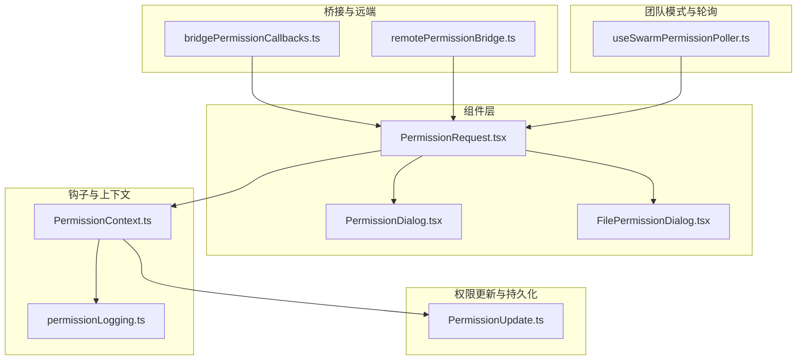
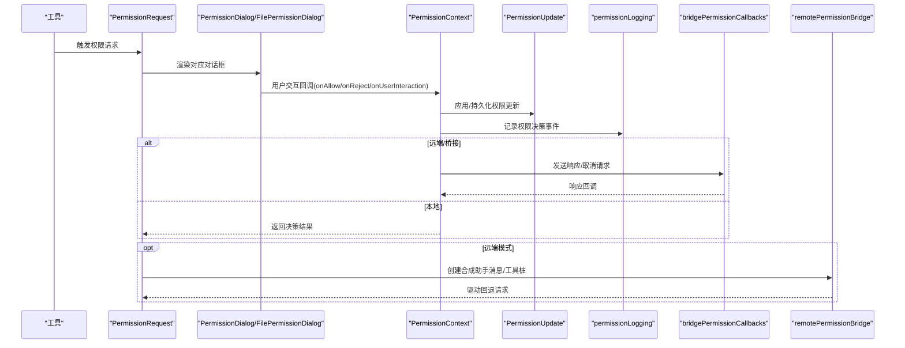
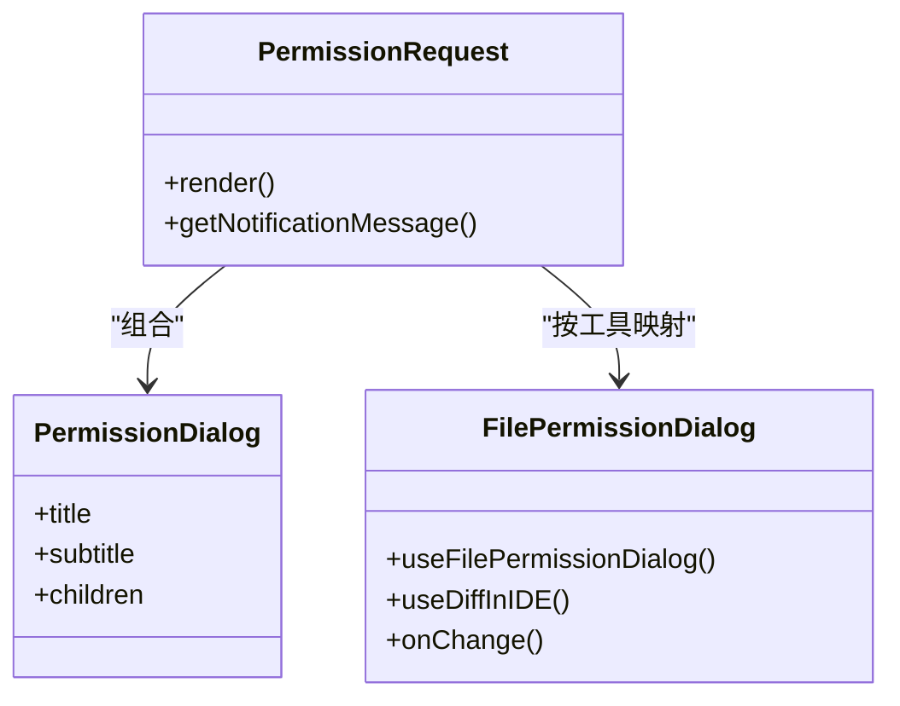
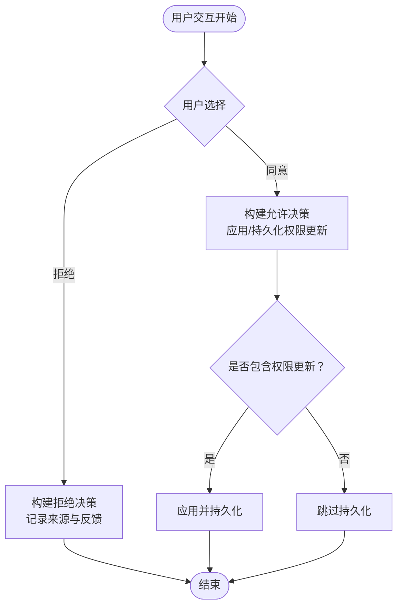
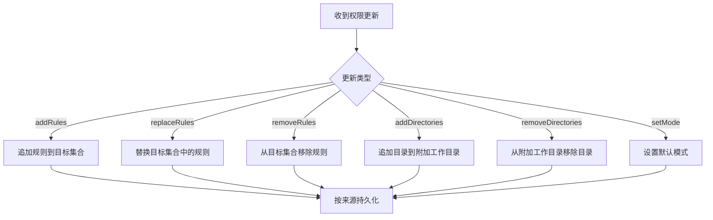
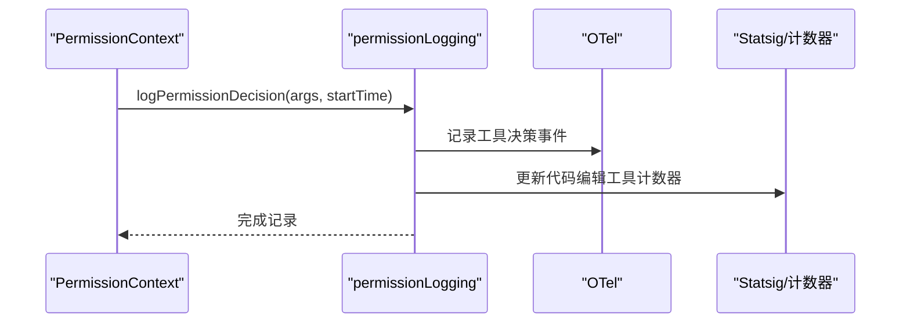
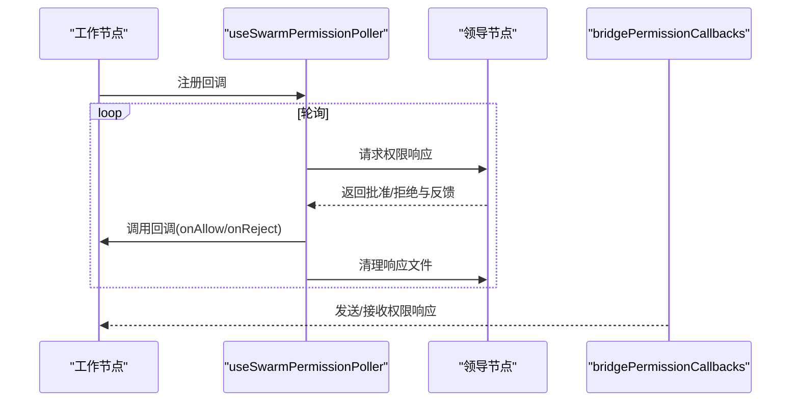
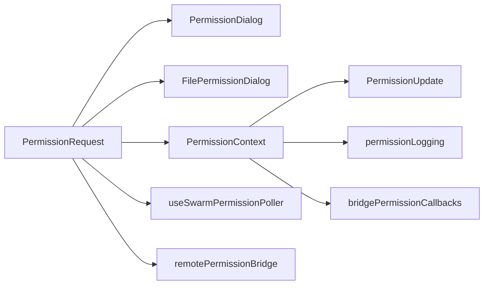

# 用户交互流程

<cite>
**本文引用的文件**
- [src/components/permissions/FilePermissionDialog/FilePermissionDialog.tsx](file://src/components/permissions/FilePermissionDialog/FilePermissionDialog.tsx)
- [src/components/permissions/PermissionDialog.tsx](file://src/components/permissions/PermissionDialog.tsx)
- [src/components/permissions/PermissionRequest.tsx](file://src/components/permissions/PermissionRequest.tsx)
- [src/bridge/bridgePermissionCallbacks.ts](file://src/bridge/bridgePermissionCallbacks.ts)
- [src/hooks/toolPermission/PermissionContext.ts](file://src/hooks/toolPermission/PermissionContext.ts)
- [src/hooks/toolPermission/permissionLogging.ts](file://src/hooks/toolPermission/permissionLogging.ts)
- [src/utils/permissions/PermissionUpdate.ts](file://src/utils/permissions/PermissionUpdate.ts)
- [src/hooks/useSwarmPermissionPoller.ts](file://src/hooks/useSwarmPermissionPoller.ts)
- [src/remote/remotePermissionBridge.ts](file://src/remote/remotePermissionBridge.ts)
- [src/utils/permissions/PermissionResult.ts](file://src/utils/permissions/PermissionResult.ts)
</cite>

## 目录
1. [简介](#简介)
2. [项目结构](#项目结构)
3. [核心组件](#核心组件)
4. [架构总览](#架构总览)
5. [详细组件分析](#详细组件分析)
6. [依赖关系分析](#依赖关系分析)
7. [性能考量](#性能考量)
8. [故障排查指南](#故障排查指南)
9. [结论](#结论)
10. [附录](#附录)

## 简介
本技术文档聚焦于 Claude Code 的“权限用户交互流程”，系统性阐述权限提示对话框的设计与实现、触发条件、显示逻辑与布局、用户选择处理机制（同意、拒绝、记住选择、永久拒绝）、权限记忆与持久化、拒绝追踪与统计、多语言与本地化策略，以及用户体验优化与交互最佳实践。文档以代码级分析为基础，辅以多种可视化图表，帮助开发者与产品人员快速理解并优化权限交互体验。

## 项目结构
围绕权限交互的关键模块分布如下：
- 组件层：权限对话框与请求封装（如 FilePermissionDialog、PermissionDialog、PermissionRequest）
- 钩子与上下文：权限决策上下文、日志与统计（PermissionContext、permissionLogging）
- 桥接与远端：桥接回调类型定义、远程权限桥接工具
- 权限更新与持久化：规则解析、应用与持久化（PermissionUpdate）
- 团队模式与轮询：工作节点权限轮询与响应处理（useSwarmPermissionPoller）

**图表来源**
- [src/components/permissions/PermissionRequest.tsx:146-216](file://src/components/permissions/PermissionRequest.tsx#L146-L216)
- [src/components/permissions/PermissionDialog.tsx:17-71](file://src/components/permissions/PermissionDialog.tsx#L17-L71)
- [src/components/permissions/FilePermissionDialog/FilePermissionDialog.tsx:48-203](file://src/components/permissions/FilePermissionDialog/FilePermissionDialog.tsx#L48-L203)
- [src/hooks/toolPermission/PermissionContext.ts:96-347](file://src/hooks/toolPermission/PermissionContext.ts#L96-L347)
- [src/hooks/toolPermission/permissionLogging.ts:181-235](file://src/hooks/toolPermission/permissionLogging.ts#L181-L235)
- [src/bridge/bridgePermissionCallbacks.ts:10-43](file://src/bridge/bridgePermissionCallbacks.ts#L10-L43)
- [src/remote/remotePermissionBridge.ts:12-78](file://src/remote/remotePermissionBridge.ts#L12-L78)
- [src/utils/permissions/PermissionUpdate.ts:196-353](file://src/utils/permissions/PermissionUpdate.ts#L196-L353)
- [src/hooks/useSwarmPermissionPoller.ts:268-330](file://src/hooks/useSwarmPermissionPoller.ts#L268-L330)

**章节来源**
- [src/components/permissions/PermissionRequest.tsx:146-216](file://src/components/permissions/PermissionRequest.tsx#L146-L216)
- [src/components/permissions/PermissionDialog.tsx:17-71](file://src/components/permissions/PermissionDialog.tsx#L17-L71)
- [src/components/permissions/FilePermissionDialog/FilePermissionDialog.tsx:48-203](file://src/components/permissions/FilePermissionDialog/FilePermissionDialog.tsx#L48-L203)
- [src/hooks/toolPermission/PermissionContext.ts:96-347](file://src/hooks/toolPermission/PermissionContext.ts#L96-L347)
- [src/hooks/toolPermission/permissionLogging.ts:181-235](file://src/hooks/toolPermission/permissionLogging.ts#L181-L235)
- [src/bridge/bridgePermissionCallbacks.ts:10-43](file://src/bridge/bridgePermissionCallbacks.ts#L10-L43)
- [src/remote/remotePermissionBridge.ts:12-78](file://src/remote/remotePermissionBridge.ts#L12-L78)
- [src/utils/permissions/PermissionUpdate.ts:196-353](file://src/utils/permissions/PermissionUpdate.ts#L196-L353)
- [src/hooks/useSwarmPermissionPoller.ts:268-330](file://src/hooks/useSwarmPermissionPoller.ts#L268-L330)

## 核心组件
- 权限请求入口（PermissionRequest）：根据工具类型动态选择对应的权限对话框组件，并注入工具使用上下文、回调与通知消息；负责键盘中断绑定与粘性页脚注册。
- 权限对话框容器（PermissionDialog）：统一的边框与内边距布局，支持标题、副标题、右侧装饰与工作者徽章。
- 文件权限对话框（FilePermissionDialog）：面向文件读写场景，支持 IDE 差异展示、符号链接目标检测、输入解析与变更应用、选项选择与反馈收集。
- 权限上下文（PermissionContext）：集中处理权限决策（允许/拒绝/询问）、持久化更新、分类器自动审批、钩子审批、取消与中止、日志记录。
- 权限更新与持久化（PermissionUpdate）：规则增删改、目录附加、模式设置、按来源持久化到本地/用户/项目设置。
- 日志与统计（permissionLogging）：统一的权限决策事件记录，区分批准与拒绝，支持等待时长、语言属性、代码编辑工具计数器与 OTel 输出。
- 桥接回调（bridgePermissionCallbacks）：定义跨桥通信的请求/响应契约与校验。
- 远程桥接（remotePermissionBridge）：在远端模式下生成合成助手消息与工具桩，驱动回退权限请求。
- 团队模式轮询（useSwarmPermissionPoller）：工作节点轮询领导节点的权限响应，处理批准/拒绝与反馈，清理响应文件。

**章节来源**
- [src/components/permissions/PermissionRequest.tsx:146-216](file://src/components/permissions/PermissionRequest.tsx#L146-L216)
- [src/components/permissions/PermissionDialog.tsx:17-71](file://src/components/permissions/PermissionDialog.tsx#L17-L71)
- [src/components/permissions/FilePermissionDialog/FilePermissionDialog.tsx:48-203](file://src/components/permissions/FilePermissionDialog/FilePermissionDialog.tsx#L48-L203)
- [src/hooks/toolPermission/PermissionContext.ts:96-347](file://src/hooks/toolPermission/PermissionContext.ts#L96-L347)
- [src/utils/permissions/PermissionUpdate.ts:196-353](file://src/utils/permissions/PermissionUpdate.ts#L196-L353)
- [src/hooks/toolPermission/permissionLogging.ts:181-235](file://src/hooks/toolPermission/permissionLogging.ts#L181-L235)
- [src/bridge/bridgePermissionCallbacks.ts:10-43](file://src/bridge/bridgePermissionCallbacks.ts#L10-L43)
- [src/remote/remotePermissionBridge.ts:12-78](file://src/remote/remotePermissionBridge.ts#L12-L78)
- [src/hooks/useSwarmPermissionPoller.ts:268-330](file://src/hooks/useSwarmPermissionPoller.ts#L268-L330)

## 架构总览
权限交互从工具调用开始，经由权限请求组件选择具体对话框，用户在终端界面进行确认或拒绝，随后通过上下文与钩子完成决策、持久化与日志记录，并在需要时通过桥接或远程桥接与远端通信。

**图表来源**
- [src/components/permissions/PermissionRequest.tsx:146-216](file://src/components/permissions/PermissionRequest.tsx#L146-L216)
- [src/components/permissions/PermissionDialog.tsx:17-71](file://src/components/permissions/PermissionDialog.tsx#L17-L71)
- [src/components/permissions/FilePermissionDialog/FilePermissionDialog.tsx:48-203](file://src/components/permissions/FilePermissionDialog/FilePermissionDialog.tsx#L48-L203)
- [src/hooks/toolPermission/PermissionContext.ts:291-347](file://src/hooks/toolPermission/PermissionContext.ts#L291-L347)
- [src/utils/permissions/PermissionUpdate.ts:196-353](file://src/utils/permissions/PermissionUpdate.ts#L196-L353)
- [src/hooks/toolPermission/permissionLogging.ts:181-235](file://src/hooks/toolPermission/permissionLogging.ts#L181-L235)
- [src/bridge/bridgePermissionCallbacks.ts:10-43](file://src/bridge/bridgePermissionCallbacks.ts#L10-L43)
- [src/remote/remotePermissionBridge.ts:12-78](file://src/remote/remotePermissionBridge.ts#L12-L78)

## 详细组件分析

### 权限提示对话框设计与实现
- 动态组件映射：根据工具类型选择具体权限对话框组件，确保不同工具（如 Bash、文件读写、Web 获取等）有专门的交互体验。
- 统一容器：PermissionDialog 提供一致的边框、内边距与标题区域，支持右侧装饰与工作者徽章。
- 文件权限增强：FilePermissionDialog 支持 IDE 差异视图、符号链接目标检测、路径解析、输入变更应用与选项联动。

**图表来源**
- [src/components/permissions/PermissionRequest.tsx:146-216](file://src/components/permissions/PermissionRequest.tsx#L146-L216)
- [src/components/permissions/PermissionDialog.tsx:17-71](file://src/components/permissions/PermissionDialog.tsx#L17-L71)
- [src/components/permissions/FilePermissionDialog/FilePermissionDialog.tsx:48-203](file://src/components/permissions/FilePermissionDialog/FilePermissionDialog.tsx#L48-L203)

**章节来源**
- [src/components/permissions/PermissionRequest.tsx:47-82](file://src/components/permissions/PermissionRequest.tsx#L47-L82)
- [src/components/permissions/PermissionDialog.tsx:17-71](file://src/components/permissions/PermissionDialog.tsx#L17-L71)
- [src/components/permissions/FilePermissionDialog/FilePermissionDialog.tsx:48-203](file://src/components/permissions/FilePermissionDialog/FilePermissionDialog.tsx#L48-L203)

### 触发条件与显示逻辑
- 触发条件：当工具需要权限时（例如文件读写、执行命令、网络访问），系统会构造 ToolUseConfirm 并交由 PermissionRequest 渲染。
- 显示逻辑：根据工具类型选择对话框组件；若存在 IDE 差异配置，则优先在 IDE 中展示差异；否则在终端对话框中呈现选项与描述。

**章节来源**
- [src/components/permissions/PermissionRequest.tsx:146-216](file://src/components/permissions/PermissionRequest.tsx#L146-L216)
- [src/components/permissions/FilePermissionDialog/FilePermissionDialog.tsx:150-167](file://src/components/permissions/FilePermissionDialog/FilePermissionDialog.tsx#L150-L167)

### 用户选择处理机制
- 同意（onAllow）：构建允许决策，可携带用户修改标记、接受反馈与内容块；若包含权限更新则持久化。
- 拒绝（onReject）：构建拒绝决策，记录来源（用户/钩子/中止），必要时中止工具执行。
- 记住选择（持久化）：通过 PermissionUpdate 将规则或目录添加到本地/用户/项目设置，后续自动放行。
- 永久拒绝：在拒绝时可选择将规则加入“始终拒绝”集合，避免重复弹窗。

**图表来源**
- [src/hooks/toolPermission/PermissionContext.ts:291-347](file://src/hooks/toolPermission/PermissionContext.ts#L291-L347)
- [src/utils/permissions/PermissionUpdate.ts:196-353](file://src/utils/permissions/PermissionUpdate.ts#L196-L353)

**章节来源**
- [src/hooks/toolPermission/PermissionContext.ts:291-347](file://src/hooks/toolPermission/PermissionContext.ts#L291-L347)
- [src/utils/permissions/PermissionUpdate.ts:196-353](file://src/utils/permissions/PermissionUpdate.ts#L196-L353)

### 权限记忆机制与持久化
- 规则管理：支持添加/替换/移除规则，按行为（允许/拒绝/询问）归类存储；目录附加与移除支持去重与覆盖。
- 源选择：仅对可编辑设置源（本地/用户/项目）进行持久化，避免不可持久化来源被写入。
- 路径规范化：规则内容转换为标准化字符串，保证匹配一致性；目录路径转换为 POSIX 格式以适配跨平台。

**图表来源**
- [src/utils/permissions/PermissionUpdate.ts:55-353](file://src/utils/permissions/PermissionUpdate.ts#L55-L353)

**章节来源**
- [src/utils/permissions/PermissionUpdate.ts:55-353](file://src/utils/permissions/PermissionUpdate.ts#L55-L353)

### 拒绝追踪与统计
- 决策来源：区分用户（临时/永久）、钩子、分类器、配置（允许/拒绝）等来源，用于精细化分析。
- 统计维度：等待用户授权时长、工具名称、语言（针对代码编辑工具）、沙箱启用状态等。
- 指标输出：Analytics 事件、OTel 事件、代码编辑工具计数器，便于漏斗分析与趋势观察。

**图表来源**
- [src/hooks/toolPermission/permissionLogging.ts:181-235](file://src/hooks/toolPermission/permissionLogging.ts#L181-L235)
- [src/hooks/toolPermission/PermissionContext.ts:113-131](file://src/hooks/toolPermission/PermissionContext.ts#L113-L131)

**章节来源**
- [src/hooks/toolPermission/permissionLogging.ts:181-235](file://src/hooks/toolPermission/permissionLogging.ts#L181-L235)
- [src/hooks/toolPermission/PermissionContext.ts:113-131](file://src/hooks/toolPermission/PermissionContext.ts#L113-L131)

### 多语言支持与本地化
- 工具名称与描述：通过工具的用户可见名称与描述进行本地化渲染，确保提示文案符合当前语言环境。
- 语言属性：代码编辑工具的决策事件可附带语言标签，便于按语言维度统计与分析。
- IDE 差异：在 IDE 中展示差异时，语言高亮与差异视图也遵循 IDE 的本地化设置。

**章节来源**
- [src/components/permissions/PermissionRequest.tsx:128-143](file://src/components/permissions/PermissionRequest.tsx#L128-L143)
- [src/hooks/toolPermission/permissionLogging.ts:41-65](file://src/hooks/toolPermission/permissionLogging.ts#L41-L65)

### 团队模式与远程交互
- 工作节点轮询：工作节点通过轮询机制获取领导节点的权限响应，处理批准/拒绝与反馈，并清理响应文件。
- 桥接回调：定义跨桥通信的请求/响应契约，支持取消请求与响应订阅。
- 远端桥接：在远端模式下生成合成助手消息与工具桩，驱动回退权限请求，确保远端工具也能获得一致的权限体验。

**图表来源**
- [src/hooks/useSwarmPermissionPoller.ts:268-330](file://src/hooks/useSwarmPermissionPoller.ts#L268-L330)
- [src/bridge/bridgePermissionCallbacks.ts:10-43](file://src/bridge/bridgePermissionCallbacks.ts#L10-L43)
- [src/remote/remotePermissionBridge.ts:12-78](file://src/remote/remotePermissionBridge.ts#L12-L78)

**章节来源**
- [src/hooks/useSwarmPermissionPoller.ts:268-330](file://src/hooks/useSwarmPermissionPoller.ts#L268-L330)
- [src/bridge/bridgePermissionCallbacks.ts:10-43](file://src/bridge/bridgePermissionCallbacks.ts#L10-L43)
- [src/remote/remotePermissionBridge.ts:12-78](file://src/remote/remotePermissionBridge.ts#L12-L78)

## 依赖关系分析
- 组件耦合：PermissionRequest 与各对话框组件松耦合，通过工具类型映射选择具体组件，降低扩展成本。
- 上下文与持久化：PermissionContext 聚合权限决策与持久化逻辑，PermissionUpdate 提供规则与目录操作能力，二者协作完成权限记忆。
- 日志与统计：permissionLogging 作为统一入口，向多个后端（Analytics、OTel、计数器）输出指标，避免分散埋点。
- 团队模式：useSwarmPermissionPoller 与 bridgePermissionCallbacks 协同，实现跨进程/跨节点的权限响应分发。

**图表来源**
- [src/components/permissions/PermissionRequest.tsx:146-216](file://src/components/permissions/PermissionRequest.tsx#L146-L216)
- [src/components/permissions/PermissionDialog.tsx:17-71](file://src/components/permissions/PermissionDialog.tsx#L17-L71)
- [src/components/permissions/FilePermissionDialog/FilePermissionDialog.tsx:48-203](file://src/components/permissions/FilePermissionDialog/FilePermissionDialog.tsx#L48-L203)
- [src/hooks/toolPermission/PermissionContext.ts:96-347](file://src/hooks/toolPermission/PermissionContext.ts#L96-L347)
- [src/utils/permissions/PermissionUpdate.ts:196-353](file://src/utils/permissions/PermissionUpdate.ts#L196-L353)
- [src/hooks/toolPermission/permissionLogging.ts:181-235](file://src/hooks/toolPermission/permissionLogging.ts#L181-L235)
- [src/bridge/bridgePermissionCallbacks.ts:10-43](file://src/bridge/bridgePermissionCallbacks.ts#L10-L43)
- [src/hooks/useSwarmPermissionPoller.ts:268-330](file://src/hooks/useSwarmPermissionPoller.ts#L268-L330)
- [src/remote/remotePermissionBridge.ts:12-78](file://src/remote/remotePermissionBridge.ts#L12-L78)

**章节来源**
- [src/components/permissions/PermissionRequest.tsx:146-216](file://src/components/permissions/PermissionRequest.tsx#L146-L216)
- [src/hooks/toolPermission/PermissionContext.ts:96-347](file://src/hooks/toolPermission/PermissionContext.ts#L96-L347)
- [src/utils/permissions/PermissionUpdate.ts:196-353](file://src/utils/permissions/PermissionUpdate.ts#L196-L353)
- [src/hooks/toolPermission/permissionLogging.ts:181-235](file://src/hooks/toolPermission/permissionLogging.ts#L181-L235)
- [src/bridge/bridgePermissionCallbacks.ts:10-43](file://src/bridge/bridgePermissionCallbacks.ts#L10-L43)
- [src/hooks/useSwarmPermissionPoller.ts:268-330](file://src/hooks/useSwarmPermissionPoller.ts#L268-L330)
- [src/remote/remotePermissionBridge.ts:12-78](file://src/remote/remotePermissionBridge.ts#L12-L78)

## 性能考量
- 渲染优化：FilePermissionDialog 使用 useMemo 缓存语言名与事件元数据，减少不必要的重渲染。
- I/O 优化：IDE 差异配置与旧内容差异读取可能涉及磁盘 I/O，通过 memo 化与稳定引用降低开销。
- 轮询节流：团队模式轮询间隔固定，避免频繁轮询造成资源浪费；同时防止并发轮询。
- 分支裁剪：仅在需要时加载特性分支（如 REVIEW_ARTIFACT、WORKFLOW_SCRIPTS），减少运行时负担。

[本节为通用指导，无需特定文件引用]

## 故障排查指南
- 权限未生效：检查权限更新是否成功持久化至可编辑设置源；核对规则行为与目标集合是否正确。
- 拒绝统计异常：确认 permissionLogging 是否正确记录等待时长与来源字段；检查 OTel 与 Analytics 输出。
- 团队模式无响应：验证 useSwarmPermissionPoller 是否处于工作节点状态、回调是否注册、响应文件是否存在且可清理。
- 远端模式异常：确认 remotePermissionBridge 是否生成了有效的合成助手消息与工具桩；检查桥接回调是否正确发送/接收响应。

**章节来源**
- [src/utils/permissions/PermissionUpdate.ts:222-353](file://src/utils/permissions/PermissionUpdate.ts#L222-L353)
- [src/hooks/toolPermission/permissionLogging.ts:181-235](file://src/hooks/toolPermission/permissionLogging.ts#L181-L235)
- [src/hooks/useSwarmPermissionPoller.ts:268-330](file://src/hooks/useSwarmPermissionPoller.ts#L268-L330)
- [src/remote/remotePermissionBridge.ts:12-78](file://src/remote/remotePermissionBridge.ts#L12-L78)

## 结论
该权限用户交互体系通过“请求-对话框-决策-持久化-日志”的闭环，实现了对各类工具权限的可控、可观测与可记忆。组件化设计与统一上下文使扩展与维护更为便捷；团队模式与远程桥接保障了分布式场景的一致性；完善的统计与追踪为产品优化提供了数据基础。建议在实际落地中结合业务场景持续迭代交互细节与提示文案，提升用户信任与效率。

[本节为总结性内容，无需特定文件引用]

## 附录
- 用户体验优化建议
  - 明确的拒绝原因与建议：在拒绝时提供简短反馈入口与常见原因提示，便于用户快速表达。
  - 可逆的“记住选择”：允许用户撤销已记住的规则，避免误操作带来的长期影响。
  - 透明的等待时长：在长时间等待时显示进度或预计时间，缓解用户焦虑。
  - 一致的视觉语言：统一颜色、图标与文案风格，减少认知负担。
- 交互最佳实践
  - 最小化干扰：仅在必要时弹窗，提供“一次性”与“记住选择”选项。
  - 清晰的后果说明：在对话框中明确展示操作范围与潜在风险。
  - 键盘友好：提供快捷键与焦点管理，支持 Tab 切换与 Esc 取消。
  - 多语言一致性：确保工具名称、描述与提示文案在不同语言环境下保持语义一致。

[本节为通用指导，无需特定文件引用]