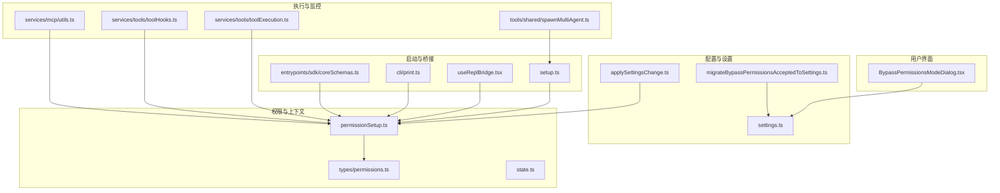
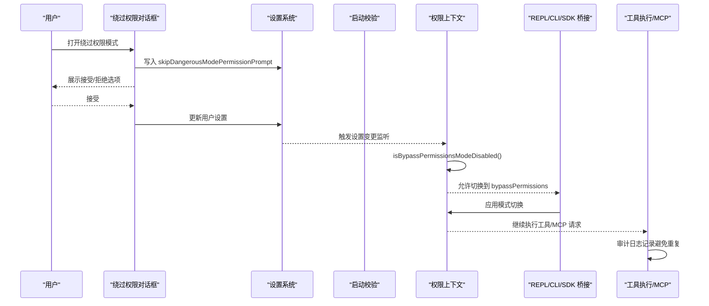
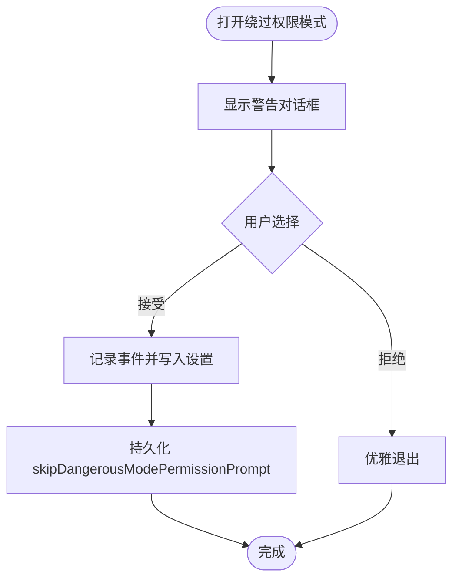
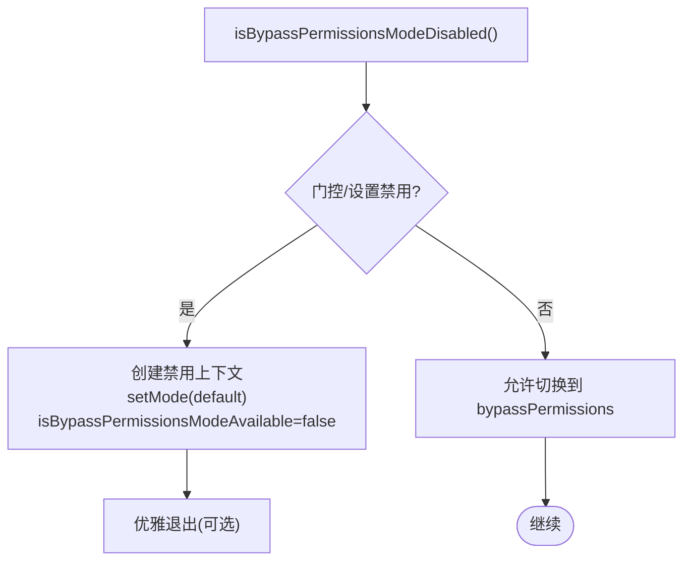
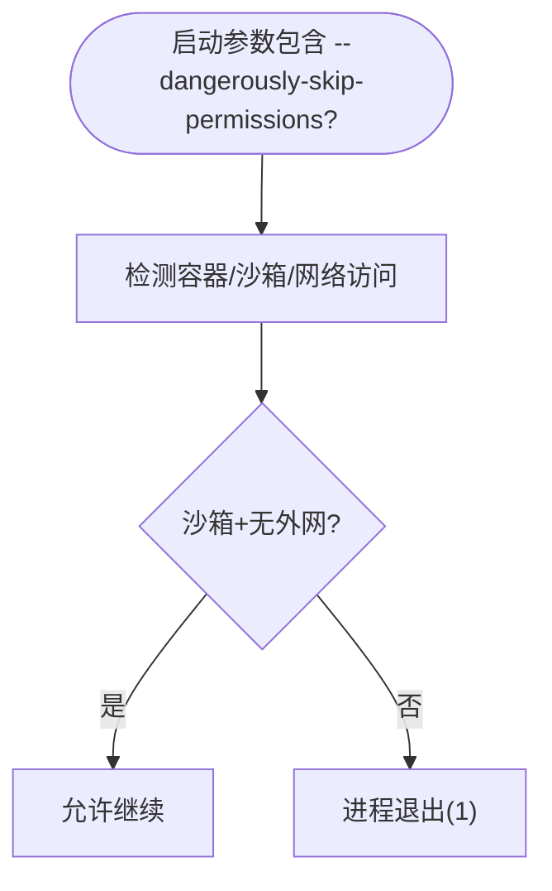
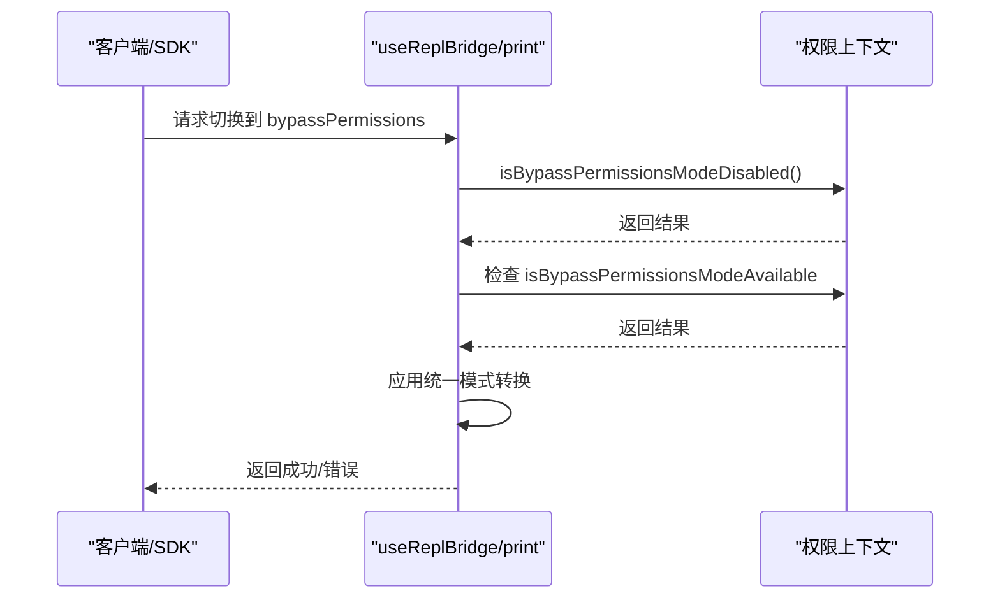
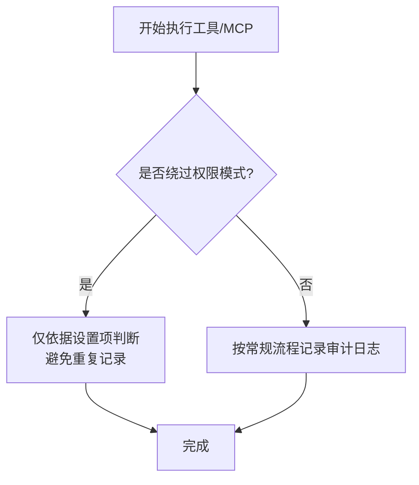
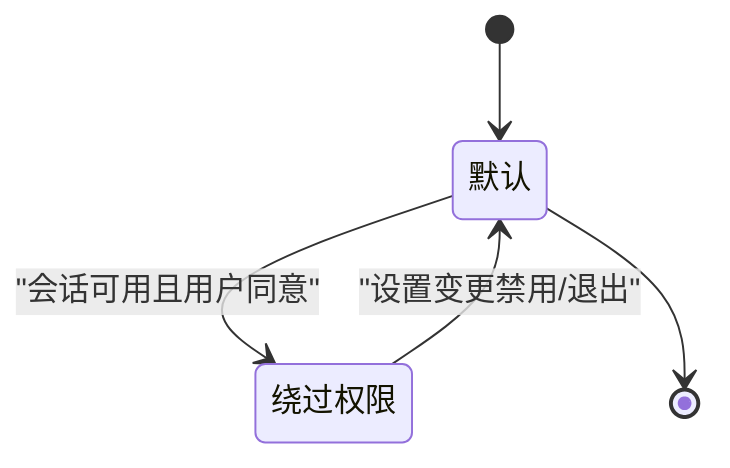
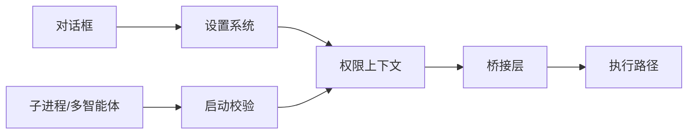

# 绕过权限模式

<cite>
**本文引用的文件**
- [BypassPermissionsModeDialog.tsx](file://src/components/BypassPermissionsModeDialog.tsx)
- [migrateBypassPermissionsAcceptedToSettings.ts](file://src/migrations/migrateBypassPermissionsAcceptedToSettings.ts)
- [permissionSetup.ts](file://src/utils/permissions/permissionSetup.ts)
- [applySettingsChange.ts](file://src/utils/settings/applySettingsChange.ts)
- [setup.ts](file://src/setup.ts)
- [useReplBridge.tsx](file://src/hooks/useReplBridge.tsx)
- [print.ts](file://src/cli/print.ts)
- [state.ts](file://src/bootstrap/state.ts)
- [permissions.ts](file://src/types/permissions.ts)
- [settings.ts](file://src/utils/settings/settings.ts)
- [toolExecution.ts](file://src/services/tools/toolExecution.ts)
- [toolHooks.ts](file://src/services/tools/toolHooks.ts)
- [mcp/utils.ts](file://src/services/mcp/utils.ts)
- [spawnMultiAgent.ts](file://src/tools/shared/spawnMultiAgent.ts)
- [coreSchemas.ts](file://src/entrypoints/sdk/coreSchemas.ts)
</cite>

## 目录
1. [简介](#简介)
2. [项目结构](#项目结构)
3. [核心组件](#核心组件)
4. [架构总览](#架构总览)
5. [详细组件分析](#详细组件分析)
6. [依赖关系分析](#依赖关系分析)
7. [性能考量](#性能考量)
8. [故障排查指南](#故障排查指南)
9. [结论](#结论)
10. [附录](#附录)

## 简介
本技术文档围绕 Claude Code 的“绕过权限模式”（bypassPermissions）进行系统化梳理，目标是帮助读者理解该模式的设计目的、使用场景、激活机制、配置管理、生命周期控制、安全监控与最佳实践。该模式允许在特定条件下跳过常规的权限提示与规则校验，以满足紧急情况、管理员权限或特殊任务执行等需求；同时通过严格的启动条件、运行时门控与审计日志确保最小化风险暴露。

## 项目结构
与绕过权限模式直接相关的代码分布在以下模块：
- 用户交互与确认：BypassPermissionsModeDialog.tsx
- 配置迁移与持久化：migrateBypassPermissionsAcceptedToSettings.ts、settings.ts
- 权限上下文与门控：permissionSetup.ts、applySettingsChange.ts、permissions.ts
- 启动安全校验：setup.ts
- 运行期模式切换与桥接：useReplBridge.tsx、print.ts、coreSchemas.ts
- 生命周期与状态：state.ts
- 工具执行与钩子：toolExecution.ts、toolHooks.ts、mcp/utils.ts
- 子进程与多智能体：spawnMultiAgent.ts

**图表来源**
- [BypassPermissionsModeDialog.tsx:1-87](file://src/components/BypassPermissionsModeDialog.tsx#L1-L87)
- [migrateBypassPermissionsAcceptedToSettings.ts:1-41](file://src/migrations/migrateBypassPermissionsAcceptedToSettings.ts#L1-L41)
- [settings.ts:883-886](file://src/utils/settings/settings.ts#L883-L886)
- [applySettingsChange.ts:1-93](file://src/utils/settings/applySettingsChange.ts#L1-L93)
- [permissionSetup.ts:1370-1431](file://src/utils/permissions/permissionSetup.ts#L1370-L1431)
- [types/permissions.ts:427-441](file://src/types/permissions.ts#L427-L441)
- [state.ts:132-133](file://src/bootstrap/state.ts#L132-L133)
- [useReplBridge.tsx:425-481](file://src/hooks/useReplBridge.tsx#L425-L481)
- [cli/print.ts:4584-4635](file://src/cli/print.ts#L4584-L4635)
- [entrypoints/sdk/coreSchemas.ts:343-343](file://src/entrypoints/sdk/coreSchemas.ts#L343-L343)
- [setup.ts:414-443](file://src/setup.ts#L414-L443)
- [services/tools/toolExecution.ts:948-948](file://src/services/tools/toolExecution.ts#L948-L948)
- [services/tools/toolHooks.ts:381-381](file://src/services/tools/toolHooks.ts#L381-L381)
- [services/mcp/utils.ts:375-378](file://src/services/mcp/utils.ts#L375-L378)
- [tools/shared/spawnMultiAgent.ts:222-222](file://src/tools/shared/spawnMultiAgent.ts#L222-L222)

**章节来源**
- [BypassPermissionsModeDialog.tsx:1-87](file://src/components/BypassPermissionsModeDialog.tsx#L1-L87)
- [migrateBypassPermissionsAcceptedToSettings.ts:1-41](file://src/migrations/migrateBypassPermissionsAcceptedToSettings.ts#L1-L41)
- [settings.ts:883-886](file://src/utils/settings/settings.ts#L883-L886)
- [applySettingsChange.ts:1-93](file://src/utils/settings/applySettingsChange.ts#L1-L93)
- [permissionSetup.ts:1370-1431](file://src/utils/permissions/permissionSetup.ts#L1370-L1431)
- [types/permissions.ts:427-441](file://src/types/permissions.ts#L427-L441)
- [state.ts:132-133](file://src/bootstrap/state.ts#L132-L133)
- [useReplBridge.tsx:425-481](file://src/hooks/useReplBridge.tsx#L425-L481)
- [cli/print.ts:4584-4635](file://src/cli/print.ts#L4584-L4635)
- [entrypoints/sdk/coreSchemas.ts:343-343](file://src/entrypoints/sdk/coreSchemas.ts#L343-L343)
- [setup.ts:414-443](file://src/setup.ts#L414-L443)
- [services/tools/toolExecution.ts:948-948](file://src/services/tools/toolExecution.ts#L948-L948)
- [services/tools/toolHooks.ts:381-381](file://src/services/tools/toolHooks.ts#L381-L381)
- [services/mcp/utils.ts:375-378](file://src/services/mcp/utils.ts#L375-L378)
- [tools/shared/spawnMultiAgent.ts:222-222](file://src/tools/shared/spawnMultiAgent.ts#L222-L222)

## 核心组件
- 绕过权限对话框：负责在用户首次启用该模式时弹出警告并要求确认，记录展示与接受事件，并写入用户设置以跳过后续危险模式提示。
- 配置迁移器：将历史全局配置中的“已接受绕过权限”标记迁移到用户可编辑的 settings.json 中，保证设置来源清晰且可追踪。
- 权限上下文与门控：提供是否禁用绕过权限模式的判断、在设置变更时动态禁用模式的能力、以及会话可用性标志位。
- 启动安全校验：对使用 --dangerously-skip-permissions 的环境进行沙箱与网络访问限制检查，防止在不安全环境中滥用。
- 模式切换与桥接：在 REPL/CLI/SDK 等入口处对模式切换请求进行校验，确保仅在满足条件时允许切换到 bypassPermissions。
- 执行路径与钩子：在工具执行与 MCP 路径中，针对绕过权限模式进行特殊处理与审计日志记录，避免重复记录或遗漏。

**章节来源**
- [BypassPermissionsModeDialog.tsx:1-87](file://src/components/BypassPermissionsModeDialog.tsx#L1-L87)
- [migrateBypassPermissionsAcceptedToSettings.ts:1-41](file://src/migrations/migrateBypassPermissionsAcceptedToSettings.ts#L1-L41)
- [permissionSetup.ts:1370-1431](file://src/utils/permissions/permissionSetup.ts#L1370-L1431)
- [applySettingsChange.ts:61-66](file://src/utils/settings/applySettingsChange.ts#L61-L66)
- [setup.ts:414-443](file://src/setup.ts#L414-L443)
- [useReplBridge.tsx:425-481](file://src/hooks/useReplBridge.tsx#L425-L481)
- [cli/print.ts:4584-4635](file://src/cli/print.ts#L4584-L4635)
- [services/tools/toolExecution.ts:948-948](file://src/services/tools/toolExecution.ts#L948-L948)
- [services/tools/toolHooks.ts:381-381](file://src/services/tools/toolHooks.ts#L381-L381)
- [services/mcp/utils.ts:375-378](file://src/services/mcp/utils.ts#L375-L378)

## 架构总览
下图展示了从用户交互到权限上下文更新、再到工具执行的整体流程，以及关键的门控点与审计日志位置。

**图表来源**
- [BypassPermissionsModeDialog.tsx:27-42](file://src/components/BypassPermissionsModeDialog.tsx#L27-L42)
- [settings.ts:883-886](file://src/utils/settings/settings.ts#L883-L886)
- [applySettingsChange.ts:61-66](file://src/utils/settings/applySettingsChange.ts#L61-L66)
- [permissionSetup.ts:1370-1384](file://src/utils/permissions/permissionSetup.ts#L1370-L1384)
- [useReplBridge.tsx:425-481](file://src/hooks/useReplBridge.tsx#L425-L481)
- [cli/print.ts:4584-4635](file://src/cli/print.ts#L4584-L4635)
- [services/tools/toolExecution.ts:948-948](file://src/services/tools/toolExecution.ts#L948-L948)
- [services/mcp/utils.ts:375-378](file://src/services/mcp/utils.ts#L375-L378)

## 详细组件分析

### 组件A：绕过权限对话框与配置迁移
- 设计目的：在用户首次启用绕过权限模式时进行强提醒与确认，明确责任归属，并将用户选择持久化到 settings.json。
- 关键行为：
  - 展示警告信息与外部链接，引导用户了解风险与安全建议。
  - 接受后记录事件并写入 skipDangerousModePermissionPrompt，使后续会话无需再次弹窗。
  - 拒绝则触发优雅退出，确保不会在未授权情况下进入危险模式。
- 配置迁移：将历史全局配置中的“已接受绕过权限”标记迁移到用户可编辑的 settings.json，保证设置来源与可追踪性。

**图表来源**
- [BypassPermissionsModeDialog.tsx:52-79](file://src/components/BypassPermissionsModeDialog.tsx#L52-L79)
- [migrateBypassPermissionsAcceptedToSettings.ts:21-34](file://src/migrations/migrateBypassPermissionsAcceptedToSettings.ts#L21-L34)

**章节来源**
- [BypassPermissionsModeDialog.tsx:1-87](file://src/components/BypassPermissionsModeDialog.tsx#L1-L87)
- [migrateBypassPermissionsAcceptedToSettings.ts:1-41](file://src/migrations/migrateBypassPermissionsAcceptedToSettings.ts#L1-L41)
- [settings.ts:883-886](file://src/utils/settings/settings.ts#L883-L886)

### 组件B：权限上下文与门控
- 是否禁用绕过权限模式：综合统计门控与用户设置，返回布尔值，用于在 UI 与桥接层阻止切换。
- 动态禁用：在设置变更时，若门控开启，则将当前上下文转换为默认模式并标记不可用，必要时触发优雅退出。
- 会话可用性：isBypassPermissionsModeAvailable 标记决定是否允许在当前会话中切换到绕过权限模式。

**图表来源**
- [permissionSetup.ts:1370-1431](file://src/utils/permissions/permissionSetup.ts#L1370-L1431)
- [applySettingsChange.ts:61-66](file://src/utils/settings/applySettingsChange.ts#L61-L66)
- [types/permissions.ts:427-441](file://src/types/permissions.ts#L427-L441)

**章节来源**
- [permissionSetup.ts:1370-1431](file://src/utils/permissions/permissionSetup.ts#L1370-L1431)
- [applySettingsChange.ts:61-66](file://src/utils/settings/applySettingsChange.ts#L61-L66)
- [types/permissions.ts:427-441](file://src/types/permissions.ts#L427-L441)

### 组件C：启动安全校验
- 仅允许在受限沙箱容器内使用 --dangerously-skip-permissions，且无外网访问。
- 对于特定用户类型（如 ant），在未满足沙箱与网络条件时直接退出，避免在不安全环境滥用。

**图表来源**
- [setup.ts:414-443](file://src/setup.ts#L414-L443)

**章节来源**
- [setup.ts:414-443](file://src/setup.ts#L414-L443)

### 组件D：模式切换与桥接
- REPL/CLI/SDK 在收到模式切换请求时，先进行门控与可用性校验，再应用统一的状态转换。
- 若目标模式为 auto，还需检查分类器门控是否开启。

**图表来源**
- [useReplBridge.tsx:425-481](file://src/hooks/useReplBridge.tsx#L425-L481)
- [cli/print.ts:4584-4635](file://src/cli/print.ts#L4584-L4635)
- [coreSchemas.ts:343-343](file://src/entrypoints/sdk/coreSchemas.ts#L343-L343)

**章节来源**
- [useReplBridge.tsx:425-481](file://src/hooks/useReplBridge.tsx#L425-L481)
- [cli/print.ts:4584-4635](file://src/cli/print.ts#L4584-L4635)
- [coreSchemas.ts:343-343](file://src/entrypoints/sdk/coreSchemas.ts#L343-L343)

### 组件E：工具执行与 MCP 路径中的绕过权限处理
- 工具执行：在 headless 模式下，若权限路径已记录过，则不再重复记录，避免冗余审计。
- MCP 工具：在绕过权限模式下，仅通过设置项判断是否跳过危险模式提示，不依赖用户交互。
- 钩子：当工具被钩子批准时，记录“绕过权限提示”的审计日志，便于追踪自动化决策。

**图表来源**
- [services/tools/toolExecution.ts:948-948](file://src/services/tools/toolExecution.ts#L948-L948)
- [services/mcp/utils.ts:375-378](file://src/services/mcp/utils.ts#L375-L378)
- [services/tools/toolHooks.ts:381-381](file://src/services/tools/toolHooks.ts#L381-L381)

**章节来源**
- [services/tools/toolExecution.ts:948-948](file://src/services/tools/toolExecution.ts#L948-L948)
- [services/mcp/utils.ts:375-378](file://src/services/mcp/utils.ts#L375-L378)
- [services/tools/toolHooks.ts:381-381](file://src/services/tools/toolHooks.ts#L381-L381)

### 组件F：生命周期与状态
- 会话级标志：sessionBypassPermissionsMode 表示当前会话是否处于绕过权限模式，且不持久化。
- 子进程与多智能体：在需要时向子进程传递 --dangerously-skip-permissions 标志，确保继承相同的信任模型。

**图表来源**
- [state.ts:132-133](file://src/bootstrap/state.ts#L132-L133)
- [tools/shared/spawnMultiAgent.ts:222-222](file://src/tools/shared/spawnMultiAgent.ts#L222-L222)

**章节来源**
- [state.ts:132-133](file://src/bootstrap/state.ts#L132-L133)
- [tools/shared/spawnMultiAgent.ts:222-222](file://src/tools/shared/spawnMultiAgent.ts#L222-L222)

## 依赖关系分析
- 松耦合与高内聚：绕过权限模式的 UI、配置、权限上下文与执行路径分别由独立模块维护，通过统一的门控函数与状态标志进行协调。
- 外部依赖：
  - 设置系统：settings.ts 提供 skipDangerousModePermissionPrompt 读取。
  - 统计门控：permissionSetup.ts 使用缓存的门控值进行快速判断。
  - 启动环境：setup.ts 依赖容器/沙箱/网络探测能力。
- 循环依赖规避：通过“会话可用性”标志与“动态禁用”策略，避免在初始化阶段就硬编码依赖。

**图表来源**
- [settings.ts:883-886](file://src/utils/settings/settings.ts#L883-L886)
- [permissionSetup.ts:1370-1431](file://src/utils/permissions/permissionSetup.ts#L1370-L1431)
- [useReplBridge.tsx:425-481](file://src/hooks/useReplBridge.tsx#L425-L481)
- [setup.ts:414-443](file://src/setup.ts#L414-L443)
- [tools/shared/spawnMultiAgent.ts:222-222](file://src/tools/shared/spawnMultiAgent.ts#L222-L222)

**章节来源**
- [settings.ts:883-886](file://src/utils/settings/settings.ts#L883-L886)
- [permissionSetup.ts:1370-1431](file://src/utils/permissions/permissionSetup.ts#L1370-L1431)
- [useReplBridge.tsx:425-481](file://src/hooks/useReplBridge.tsx#L425-L481)
- [setup.ts:414-443](file://src/setup.ts#L414-L443)
- [tools/shared/spawnMultiAgent.ts:222-222](file://src/tools/shared/spawnMultiAgent.ts#L222-L222)

## 性能考量
- 门控判断采用缓存版本，减少频繁 IO 与网络探测带来的开销。
- 设置变更时批量应用，避免多次磁盘读取与上下文重建。
- 模式切换通过统一入口进行，减少分支判断与重复计算。

[本节为通用指导，无需具体文件分析]

## 故障排查指南
- 无法切换到绕过权限模式
  - 检查门控是否开启：调用 isBypassPermissionsModeDisabled()。
  - 检查会话可用性：确认 isBypassPermissionsModeAvailable 是否为真。
  - 检查启动参数与环境：确保使用了 --dangerously-skip-permissions 且满足沙箱与网络限制。
- 设置未生效
  - 确认 settings.json 中 skipDangerousModePermissionPrompt 已正确写入。
  - 触发设置变更监听，确保 applySettingsChange 流程执行。
- 审计日志缺失
  - 在工具执行与 MCP 路径中，注意绕过权限模式下的日志策略，避免重复记录。
  - 如需确认自动化钩子审批，请查看工具钩子日志。

**章节来源**
- [permissionSetup.ts:1370-1431](file://src/utils/permissions/permissionSetup.ts#L1370-L1431)
- [applySettingsChange.ts:61-66](file://src/utils/settings/applySettingsChange.ts#L61-L66)
- [setup.ts:414-443](file://src/setup.ts#L414-L443)
- [services/tools/toolExecution.ts:948-948](file://src/services/tools/toolExecution.ts#L948-L948)
- [services/mcp/utils.ts:375-378](file://src/services/mcp/utils.ts#L375-L378)
- [services/tools/toolHooks.ts:381-381](file://src/services/tools/toolHooks.ts#L381-L381)

## 结论
绕过权限模式在 Claude Code 中是一个高风险但必要的能力，其设计强调“最小化可用面、严格启动条件、动态门控与全面审计”。通过对话框确认、配置迁移、权限上下文门控、启动安全校验与统一的模式切换入口，系统在满足紧急与管理员场景的同时，最大限度地降低了误用与滥用的风险。配合完善的审计日志与钩子机制，可以实现对模式使用行为的全程可追溯。

[本节为总结，无需具体文件分析]

## 附录
- 使用场景建议
  - 紧急情况：在受控沙箱中执行一次性高风险操作，且具备快速回滚能力。
  - 管理员权限：在隔离环境中进行批量运维或调试，且有明确的审计与复核流程。
  - 特殊任务：在严格隔离的 CI/CD 或测试环境中执行自动化脚本。
- 最佳实践
  - 始终在沙箱/容器中启用，且关闭外网访问。
  - 仅在必要时启用，任务完成后立即恢复默认权限模式。
  - 通过设置 skipDangerousModePermissionPrompt 仅在用户明确同意的情况下跳过后续提示。
  - 强化审计与告警，对绕过权限模式的使用进行集中监控与定期审查。
  - 与团队约定最小权限原则，避免长期保持绕过权限模式。

[本节为通用指导，无需具体文件分析]