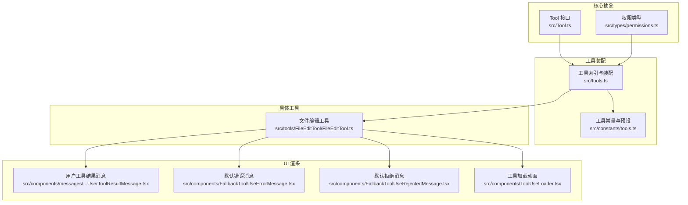
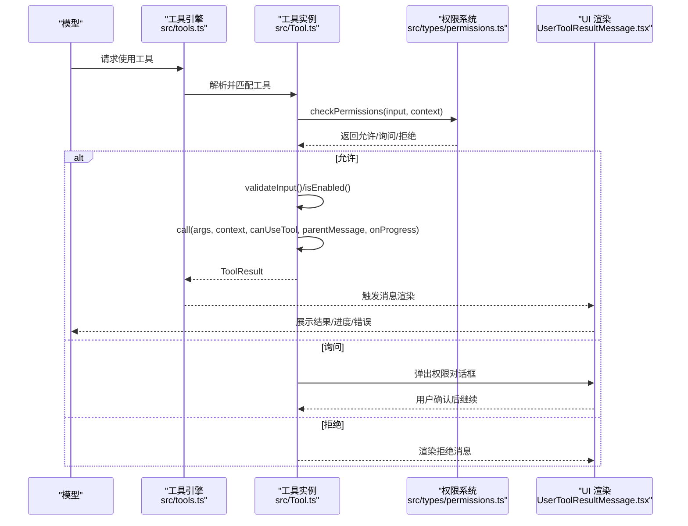
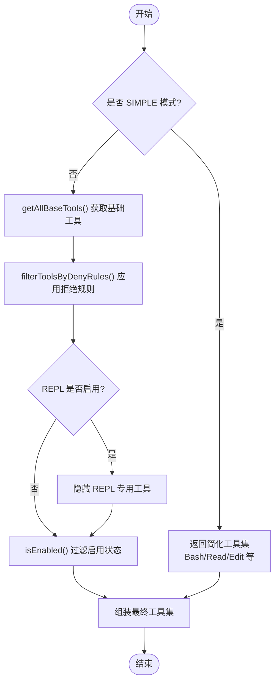
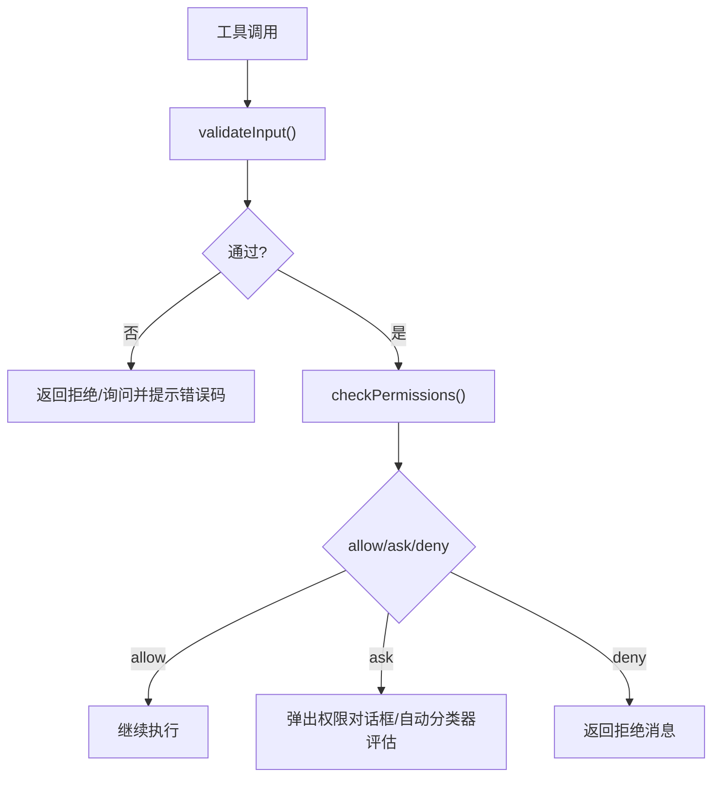
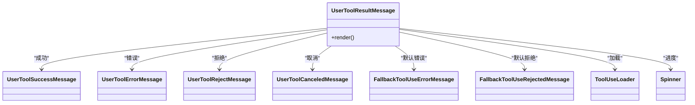
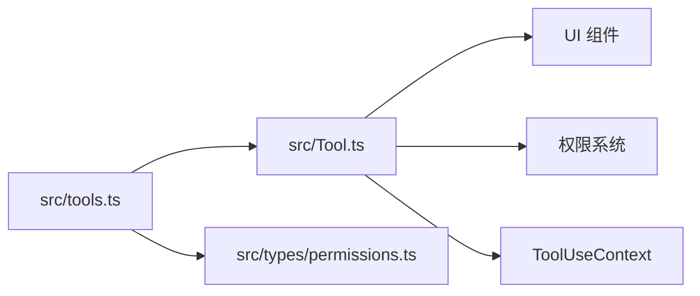

# 自定义工具开发

<cite>
**本文引用的文件**
- [src/Tool.ts](file://src/Tool.ts)
- [src/tools.ts](file://src/tools.ts)
- [src/constants/tools.ts](file://src/constants/tools.ts)
- [src/types/permissions.ts](file://src/types/permissions.ts)
- [src/tools/FileEditTool/FileEditTool.ts](file://src/tools/FileEditTool/FileEditTool.ts)
- [src/components/messages/UserToolResultMessage/UserToolResultMessage.tsx](file://src/components/messages/UserToolResultMessage/UserToolResultMessage.tsx)
- [src/components/FallbackToolUseErrorMessage.tsx](file://src/components/FallbackToolUseErrorMessage.tsx)
- [src/components/FallbackToolUseRejectedMessage.tsx](file://src/components/FallbackToolUseRejectedMessage.tsx)
- [src/components/ToolUseLoader.tsx](file://src/components/ToolUseLoader.tsx)
- [src/components/Spinner.tsx](file://src/components/Spinner.tsx)
- [src/hooks/useCanUseTool.tsx](file://src/hooks/useCanUseTool.tsx)
- [src/utils/permissions/filesystem.ts](file://src/utils/permissions/filesystem.ts)
- [src/utils/permissions/PermissionResult.ts](file://src/utils/permissions/PermissionResult.ts)
- [src/utils/permissions/PermissionMode.ts](file://src/utils/permissions/PermissionMode.ts)
- [src/utils/permissions/PermissionPromptToolResultSchema.ts](file://src/utils/permissions/PermissionPromptToolResultSchema.ts)
- [src/utils/permissions/PermissionPromptToolResultSchema.ts](file://src/utils/permissions/PermissionPromptToolResultSchema.ts)
- [src/utils/permissions/PermissionPromptToolResultSchema.ts](file://src/utils/permissions/PermissionPromptToolResultSchema.ts)
- [src/utils/permissions/PermissionPromptToolResultSchema.ts](file://src/utils/permissions/PermissionPromptToolResultSchema.ts)
- [src/utils/permissions/PermissionPromptToolResultSchema.ts](file://src/utils/permissions/PermissionPromptToolResultSchema.ts)
- [src/utils/permissions/PermissionPromptToolResultSchema.ts](file://src/utils/permissions/PermissionPromptToolResultSchema.ts)
- [src/utils/permissions/PermissionPromptToolResultSchema.ts](file://src/utils/permissions/PermissionPromptToolResultSchema.ts)
- [src/utils/permissions/PermissionPromptToolResultSchema.ts](file://src/utils/permissions/PermissionPromptToolResultSchema.ts)
- [src/utils/permissions/PermissionPromptToolResultSchema.ts](file://src/utils/permissions/PermissionPromptToolResultSchema.ts)
- [src/utils/permissions/PermissionPromptToolResultSchema.ts](file://src/utils/permissions/PermissionPromptToolResultSchema.ts)
- [src/utils/permissions/PermissionPromptToolResultSchema.ts](file://src/utils/permissions/PermissionPromptToolResultSchema.ts)
- [src/utils/permissions/PermissionPromptToolResultSchema.ts](file://src/utils/permissions/PermissionPromptToolResultSchema.ts)
- [src/utils/permissions/PermissionPromptToolResultSchema.ts](file://src/utils/permissions/PermissionPromptToolResultSchema.ts)
- [src/utils/permissions/PermissionPromptToolResultSchema.ts](file://src/utils/permissions/PermissionPromptToolResultSchema.ts)
- [src/utils/permissions/PermissionPromptToolResultSchema.ts](file://src/utils/permissions/PermissionPromptToolResultSchema.ts)
- [src/utils/permissions/PermissionPromptToolResultSchema.ts](file://src/utils/permissions/PermissionPromptToolResultSchema.ts)
- [src/utils/permissions/PermissionPromptToolResultSchema.ts](file://src/utils/permissions/PermissionPromptToolResultSchema.ts)
- [src/utils/permissions/PermissionPromptToolResultSchema.ts](file://src/utils/permissions/PermissionPromptToolResultSchema.ts)
- [src/utils/permissions......](file://src/utils/permissions/PermissionPromptToolResultSchema.ts)
</cite>

## 目录
1. [简介](#简介)
2. [项目结构](#项目结构)
3. [核心组件](#核心组件)
4. [架构总览](#架构总览)
5. [详细组件分析](#详细组件分析)
6. [依赖关系分析](#依赖关系分析)
7. [性能考量](#性能考量)
8. [故障排查指南](#故障排查指南)
9. [结论](#结论)
10. [附录](#附录)

## 简介
本指南面向希望在 Claude Code 中开发“自定义工具”的工程师，覆盖从需求分析、设计规划、实现与测试，到打包发布与版本管理的全流程。文档重点围绕以下主题展开：
- 工具接口规范与实现要求（必需/可选方法、最佳实践）
- 权限设计原则与实现（权限检查、规则配置、用户交互）
- 工具 UI 集成（消息渲染、进度显示、错误处理）
- 测试策略（单元、集成、用户验收）
- 打包、发布与版本管理
- 提供模板与示例路径，帮助快速上手

## 项目结构
本仓库采用“按功能域分层 + 按类型聚合”的组织方式：
- 核心类型与抽象：src/Tool.ts 定义工具接口与上下文；src/types/permissions.ts 定义权限类型
- 工具装配与过滤：src/tools.ts 负责工具集合装配、模式过滤、MCP 工具合并
- 工具常量与预设：src/constants/tools.ts 提供工具集合与可用性约束
- 具体工具实现：src/tools/<ToolName>/ 下的各工具模块
- UI 渲染：src/components/messages/ 下的工具结果消息组件
- 权限系统：src/utils/permissions/ 与 src/hooks/toolPermission/ 下的权限逻辑与交互

图表来源
- [src/Tool.ts:1-793](file://src/Tool.ts#L1-L793)
- [src/tools.ts:190-390](file://src/tools.ts#L190-L390)
- [src/constants/tools.ts:1-113](file://src/constants/tools.ts#L1-L113)
- [src/tools/FileEditTool/FileEditTool.ts:1-200](file://src/tools/FileEditTool/FileEditTool.ts#L1-L200)
- [src/components/messages/UserToolResultMessage/UserToolResultMessage.tsx:1-106](file://src/components/messages/UserToolResultMessage/UserToolResultMessage.tsx#L1-L106)

章节来源
- [src/Tool.ts:1-793](file://src/Tool.ts#L1-L793)
- [src/tools.ts:190-390](file://src/tools.ts#L190-L390)
- [src/constants/tools.ts:1-113](file://src/constants/tools.ts#L1-L113)

## 核心组件
- 工具接口与上下文
  - 工具接口定义了调用、描述、输入输出模式、并发安全、只读/破坏性标记、权限检查、UI 渲染钩子等能力
  - 工具上下文 ToolUseContext 提供运行期环境（命令、调试、模型、工具集、会话状态、通知、进度回调等）
- 工具装配与过滤
  - getAllBaseTools/getTools/assembleToolPool 统一装配内置工具与 MCP 工具，支持模式过滤、REPL 隐藏、启用状态过滤、权限规则过滤
- 权限类型与决策
  - 权限模式、规则来源、行为（允许/询问/拒绝）、决策结果与解释、自动分类器等类型定义
- UI 渲染
  - 用户工具结果消息根据工具返回内容选择成功/错误/拒绝/取消等不同 UI 组件
  - 进度与加载：ToolUseLoader、Spinner 等

章节来源
- [src/Tool.ts:158-793](file://src/Tool.ts#L158-L793)
- [src/tools.ts:271-390](file://src/tools.ts#L271-L390)
- [src/types/permissions.ts:16-442](file://src/types/permissions.ts#L16-L442)
- [src/components/messages/UserToolResultMessage/UserToolResultMessage.tsx:1-106](file://src/components/messages/UserToolResultMessage/UserToolResultMessage.tsx#L1-L106)

## 架构总览
下图展示了工具从“被模型选择”到“执行与结果渲染”的端到端流程，以及权限检查与 UI 渲染的关键节点。

图表来源
- [src/tools.ts:271-390](file://src/tools.ts#L271-L390)
- [src/Tool.ts:379-524](file://src/Tool.ts#L379-L524)
- [src/types/permissions.ts:164-267](file://src/types/permissions.ts#L164-L267)
- [src/components/messages/UserToolResultMessage/UserToolResultMessage.tsx:1-106](file://src/components/messages/UserToolResultMessage/UserToolResultMessage.tsx#L1-L106)

## 详细组件分析

### 工具接口与实现要求
- 必需方法
  - call(args, context, canUseTool, parentMessage, onProgress): 工具执行入口，返回 ToolResult
  - description(input, options): 生成工具描述文本
  - inputSchema: 输入模式（Zod 或 JSON Schema）
  - isEnabled(): 是否启用
  - checkPermissions(input, context): 权限检查
- 可选方法与钩子
  - outputSchema: 输出模式
  - isConcurrencySafe(input)/isReadOnly(input)/isDestructive(input)
  - interruptBehavior(): 中断行为（取消/阻塞）
  - isSearchOrReadCommand(input): 搜索/读取类操作，用于 UI 折叠
  - isOpenWorld?(input): 开放世界工具标识
  - requiresUserInteraction?(): 是否需要用户交互
  - isMcp/isLsp: 标识 MCP/LSP 工具
  - shouldDefer/alwaysLoad: 延迟加载与强制加载
  - mcpInfo: MCP 服务器与工具名
  - maxResultSizeChars: 结果大小阈值
  - strict: 严格模式
  - backfillObservableInput(input): 观察者可见输入回填
  - validateInput?(input, context): 输入验证
  - preparePermissionMatcher?(input): 权限规则匹配器
  - prompt(options): 动态系统提示
  - userFacingName(input)/userFacingNameBackgroundColor(input)
  - isTransparentWrapper?(): 透明包装器
  - getToolUseSummary?(input)/getActivityDescription?(input)
  - toAutoClassifierInput(input): 自动分类器输入
  - mapToolResultToToolResultBlockParam(content, toolUseID)
  - renderToolResultMessage?(content, progressMessages, options)
  - extractSearchText?(out)
  - renderToolUseMessage(input, options)
  - isResultTruncated?(output)
  - renderToolUseTag?(input)
  - renderToolUseProgressMessage?(progressMessages, options)
  - renderToolUseQueuedMessage?()
  - renderToolUseRejectedMessage?(input, options)
  - renderToolUseErrorMessage?(result, options)
  - renderGroupedToolUse?(toolUses, options)

- 最佳实践
  - 使用 buildTool 包装工具定义，确保默认行为一致
  - 明确 isReadOnly/isDestructive，便于权限与 UI 提示
  - 实现 validateInput 与 checkPermissions，前置校验与权限分离
  - 提供 userFacingName 与 getActivityDescription，提升 UX
  - 对大结果设置合理 maxResultSizeChars，并考虑持久化策略

章节来源
- [src/Tool.ts:362-793](file://src/Tool.ts#L362-L793)
- [src/Tool.ts:783-793](file://src/Tool.ts#L783-L793)

### 工具装配与过滤
- getTools(permissionContext): 根据权限上下文与模式（如 SIMPLE/REPL）过滤工具
- getAllBaseTools(): 汇总所有可用内置工具，受特性开关与环境变量控制
- assembleToolPool(permissionContext, mcpTools): 合并内置与 MCP 工具，去重并排序以保证缓存稳定
- filterToolsByDenyRules(tools, permissionContext): 应用拒绝规则过滤

图表来源
- [src/tools.ts:271-327](file://src/tools.ts#L271-L327)
- [src/tools.ts:193-251](file://src/tools.ts#L193-L251)
- [src/tools.ts:262-269](file://src/tools.ts#L262-L269)

章节来源
- [src/tools.ts:193-390](file://src/tools.ts#L193-L390)

### 权限设计与实现
- 权限模式与规则
  - 模式：default、dontAsk、acceptEdits、bypassPermissions、plan、auto（可选）
  - 规则来源：用户设置、项目设置、本地设置、策略、CLI、命令、会话
  - 行为：allow、deny、ask
  - 决策：PermissionDecision/PermissionResult，含原因解释与建议更新
- 工具侧权限钩子
  - checkPermissions(input, context): 工具特定权限逻辑
  - preparePermissionMatcher?(input): 为规则匹配器准备闭包
  - validateInput?(input, context): 输入验证（通过后再进入权限检查）
- 文件系统权限示例
  - 文件写入权限检查、UNC 路径安全、忽略规则匹配等

图表来源
- [src/Tool.ts:489-503](file://src/Tool.ts#L489-L503)
- [src/types/permissions.ts:164-267](file://src/types/permissions.ts#L164-L267)
- [src/utils/permissions/filesystem.ts](file://src/utils/permissions/filesystem.ts)

章节来源
- [src/types/permissions.ts:16-442](file://src/types/permissions.ts#L16-L442)
- [src/tools/FileEditTool/FileEditTool.ts:125-132](file://src/tools/FileEditTool/FileEditTool.ts#L125-L132)

### 工具 UI 集成
- 用户工具结果消息
  - 根据工具结果类型（成功/错误/拒绝/取消）选择对应 UI 组件
  - 支持非冗长模式下的分组渲染与动画
- 默认错误/拒绝消息
  - FallbackToolUseErrorMessage.tsx 与 FallbackToolUseRejectedMessage.tsx 提供通用兜底
- 加载与进度
  - ToolUseLoader.tsx 与 Spinner.tsx 提供加载与进度指示
- 交互与可使用性
  - useCanUseTool.tsx 提供 canUseTool 回调，用于权限与并发控制

图表来源
- [src/components/messages/UserToolResultMessage/UserToolResultMessage.tsx:1-106](file://src/components/messages/UserToolResultMessage/UserToolResultMessage.tsx#L1-L106)
- [src/components/FallbackToolUseErrorMessage.tsx](file://src/components/FallbackToolUseErrorMessage.tsx)
- [src/components/FallbackToolUseRejectedMessage.tsx](file://src/components/FallbackToolUseRejectedMessage.tsx)
- [src/components/ToolUseLoader.tsx](file://src/components/ToolUseLoader.tsx)
- [src/components/Spinner.tsx](file://src/components/Spinner.tsx)

章节来源
- [src/components/messages/UserToolResultMessage/UserToolResultMessage.tsx:1-106](file://src/components/messages/UserToolResultMessage/UserToolResultMessage.tsx#L1-L106)

### 示例：文件编辑工具（FileEditTool）
- 关键点
  - 权限：checkWritePermissionForTool，路径扩展与 UNC 安全
  - 输入：validateInput 检查相同字符串、忽略规则、超大文件
  - UI：renderToolUseMessage/renderToolResultMessage 等
  - 分类器输入：toAutoClassifierInput
  - 路径：getPath
  - 回填：backfillObservableInput
- 参考路径
  - [src/tools/FileEditTool/FileEditTool.ts:86-200](file://src/tools/FileEditTool/FileEditTool.ts#L86-L200)

章节来源
- [src/tools/FileEditTool/FileEditTool.ts:86-200](file://src/tools/FileEditTool/FileEditTool.ts#L86-L200)

## 依赖关系分析
- 工具装配对权限系统的依赖
  - assembleToolPool/getTools 依赖 filterToolsByDenyRules 与 ToolPermissionContext
- 工具对 UI 的依赖
  - 多数工具通过 renderToolUseMessage/renderToolResultMessage 等钩子与 UI 组件协作
- 工具对权限系统的依赖
  - 工具内部通过 checkPermissions 与 preparePermissionMatcher 与权限系统交互
- 工具对上下文的依赖
  - ToolUseContext 提供文件状态、消息、通知、会话状态等

图表来源
- [src/tools.ts:271-390](file://src/tools.ts#L271-L390)
- [src/Tool.ts:158-793](file://src/Tool.ts#L158-L793)
- [src/types/permissions.ts:412-442](file://src/types/permissions.ts#L412-L442)

章节来源
- [src/tools.ts:271-390](file://src/tools.ts#L271-L390)
- [src/Tool.ts:158-793](file://src/Tool.ts#L158-L793)
- [src/types/permissions.ts:412-442](file://src/types/permissions.ts#L412-L442)

## 性能考量
- 工具结果大小
  - 设置合理的 maxResultSizeChars，避免超大结果导致内存压力与传输开销
- 并发与只读
  - isConcurrencySafe 与 isReadOnly 有助于并发控制与 UI 优化
- 缓存与提示稳定性
  - assembleToolPool 对内置与 MCP 工具进行排序与去重，保持提示缓存稳定
- 输入验证与权限前置
  - 在 checkPermissions 之前进行 validateInput，减少无效调用

## 故障排查指南
- 工具未出现在列表
  - 检查 isEnabled() 与 getTools() 过滤条件（SIMPLE/REPL/特性开关）
  - 检查 deny 规则与 filterToolsByDenyRules
  - 参考：[src/tools.ts:271-327](file://src/tools.ts#L271-L327)
- 权限被拒绝
  - 查看 PermissionDecisionReason，确认规则来源与模式
  - 使用 preparePermissionMatcher 与 matchingRuleForInput 辅助定位
  - 参考：[src/types/permissions.ts:268-325](file://src/types/permissions.ts#L268-L325)
- UI 不显示或显示异常
  - 检查 renderToolResultMessage/renderToolUseMessage 的返回值
  - 确认 UserToolResultMessage 的分支逻辑
  - 参考：[src/components/messages/UserToolResultMessage/UserToolResultMessage.tsx:1-106](file://src/components/messages/UserToolResultMessage/UserToolResultMessage.tsx#L1-L106)
- 错误消息不友好
  - 提供自定义 renderToolUseErrorMessage 或使用默认兜底组件
  - 参考：[src/components/FallbackToolUseErrorMessage.tsx](file://src/components/FallbackToolUseErrorMessage.tsx)

章节来源
- [src/tools.ts:271-327](file://src/tools.ts#L271-L327)
- [src/types/permissions.ts:268-325](file://src/types/permissions.ts#L268-L325)
- [src/components/messages/UserToolResultMessage/UserToolResultMessage.tsx:1-106](file://src/components/messages/UserToolResultMessage/UserToolResultMessage.tsx#L1-L106)
- [src/components/FallbackToolUseErrorMessage.tsx](file://src/components/FallbackToolUseErrorMessage.tsx)

## 结论
通过统一的工具接口、严格的权限体系与完善的 UI 渲染机制，Claude Code 为自定义工具开发提供了清晰的框架。遵循本文档的接口规范、权限设计与 UI 集成建议，可以高效地构建安全、可维护且用户体验良好的工具。

## 附录

### 工具开发流程清单
- 需求分析
  - 明确工具目标、输入输出、副作用（只读/破坏性）、并发安全
- 设计规划
  - 定义输入/输出模式（Zod/JSON Schema），确定是否延迟加载
  - 设计权限规则与用户交互（是否需要 ask）
- 实现
  - 使用 buildTool 包装工具定义
  - 实现必需方法与可选钩子
  - 编写 validateInput 与 checkPermissions
  - 实现 UI 渲染钩子（消息、进度、错误、拒绝）
- 测试
  - 单元测试：输入验证、权限检查、UI 渲染
  - 集成测试：工具装配、REPL/简单模式、MCP 工具合并
  - 用户验收：真实场景回归（权限、错误、进度）
- 打包与发布
  - 将工具纳入工具装配（如需），添加特性开关与环境变量控制
  - 更新工具常量与可用性集合
- 版本管理
  - 语义化版本，记录破坏性变更与权限规则调整

### 权限规则配置要点
- 规则来源与行为
  - 来源：用户设置、项目设置、本地设置、策略、CLI、命令、会话
  - 行为：allow、deny、ask
- 常见场景
  - 文件写入：使用文件系统权限检查与 UNC 安全
  - 脚本执行：结合自动分类器与用户确认
  - MCP 工具：通过 mcpInfo 与服务器前缀规则控制

章节来源
- [src/types/permissions.ts:50-132](file://src/types/permissions.ts#L50-L132)
- [src/tools/FileEditTool/FileEditTool.ts:125-132](file://src/tools/FileEditTool/FileEditTool.ts#L125-L132)