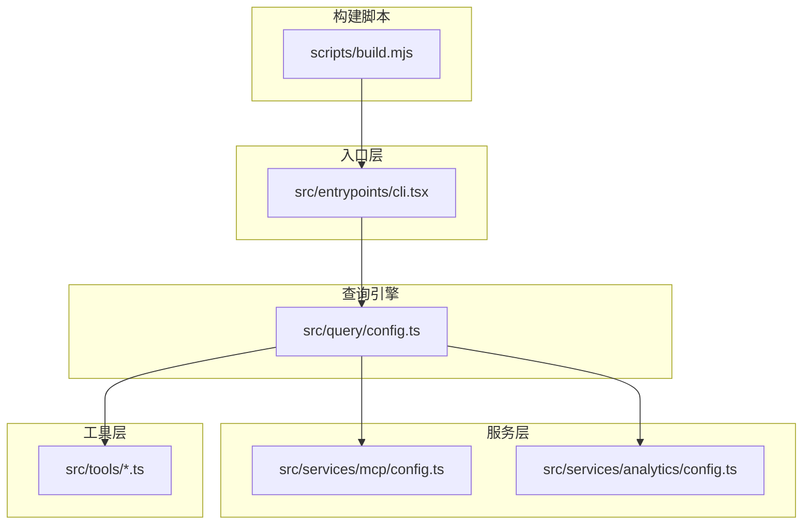
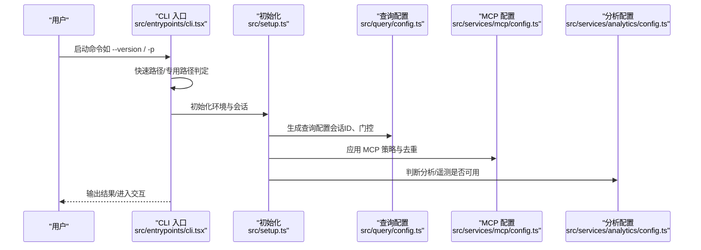
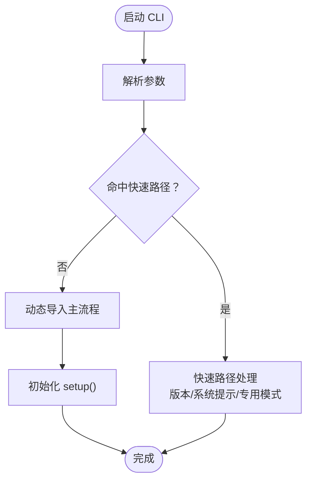
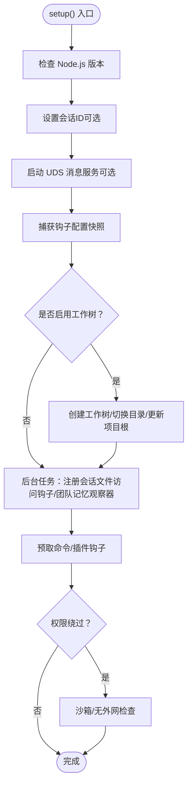
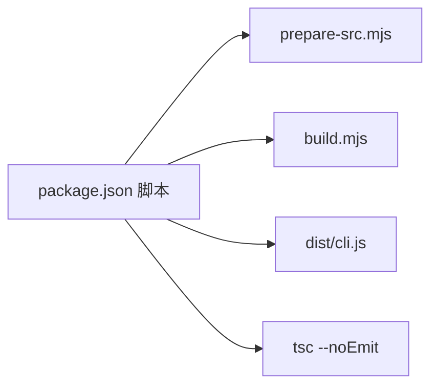

# 快速开始

<cite>
**本文引用的文件**
- [README.md](file://README.md)
- [QUICKSTART.md](file://QUICKSTART.md)
- [package.json](file://package.json)
- [scripts/build.mjs](file://scripts/build.mjs)
- [src/entrypoints/cli.tsx](file://src/entrypoints/cli.tsx)
- [src/setup.ts](file://src/setup.ts)
- [src/commands/init.ts](file://src/commands/init.ts)
- [src/query/config.ts](file://src/query/config.ts)
- [src/services/analytics/config.ts](file://src/services/analytics/config.ts)
- [src/services/mcp/config.ts](file://src/services/mcp/config.ts)
</cite>

## 目录
1. [简介](#简介)
2. [项目结构](#项目结构)
3. [核心组件](#核心组件)
4. [架构总览](#架构总览)
5. [详细组件分析](#详细组件分析)
6. [依赖分析](#依赖分析)
7. [性能考虑](#性能考虑)
8. [故障排除指南](#故障排除指南)
9. [结论](#结论)
10. [附录](#附录)

## 简介
本指南面向首次接触 Claude Code 的开发者，帮助你在本地完成安装、构建与基础使用。你将学会：
- 安装与运行预编译 CLI（推荐）
- 从源码构建可执行文件
- 基本使用：启动 CLI、非交互式查询、常用命令
- 初始配置：API 密钥、权限策略、MCP 服务器、会话与工作树
- 常见问题排查与优化建议

Claude Code 提供了完整的 TypeScript 源码与构建脚本，支持在本地通过最佳努力构建或直接使用已发布的 CLI。

## 项目结构
仓库采用模块化组织，核心目录与职责概览如下：
- docs/：多语言深度分析报告
- scripts/：构建与准备脚本
- src/entrypoints/：应用入口（CLI、SDK、MCP）
- src/cli/：命令行基础设施与传输层
- src/commands/：内置命令集合（约 80+）
- src/services/：业务服务（API、分析、MCP、工具执行等）
- src/tools/：工具实现（文件读写、搜索、终端、网络、MCP 包装等）
- src/components/：React/Ink 终端 UI 组件
- src/utils/：通用工具（权限、消息格式、模型选择、沙箱、钩子、内存、Git、GitHub、telemetry 等）

图表来源
- [src/entrypoints/cli.tsx:1-303](file://src/entrypoints/cli.tsx#L1-L303)
- [src/query/config.ts:1-47](file://src/query/config.ts#L1-L47)
- [src/services/mcp/config.ts:1-800](file://src/services/mcp/config.ts#L1-L800)
- [src/services/analytics/config.ts:1-39](file://src/services/analytics/config.ts#L1-L39)
- [scripts/build.mjs:1-246](file://scripts/build.mjs#L1-L246)

章节来源
- [README.md:250-380](file://README.md#L250-L380)
- [package.json:1-21](file://package.json#L1-L21)

## 核心组件
- CLI 入口：解析参数、按需动态加载模块、快速路径短路、桥接/守护进程/模板等专用路径。
- 查询配置：快照式查询配置，包含会话 ID、运行时门控（流式工具执行、摘要输出、是否为内部用户、是否启用快速模式）。
- 分析配置：统一判断分析/遥测是否禁用，兼容测试环境、第三方云提供商与隐私级别。
- MCP 配置：企业级 MCP 服务器管理、去重、策略过滤、环境变量展开、安全校验与持久化。

章节来源
- [src/entrypoints/cli.tsx:33-299](file://src/entrypoints/cli.tsx#L33-L299)
- [src/query/config.ts:15-46](file://src/query/config.ts#L15-L46)
- [src/services/analytics/config.ts:11-38](file://src/services/analytics/config.ts#L11-L38)
- [src/services/mcp/config.ts:62-131](file://src/services/mcp/config.ts#L62-L131)

## 架构总览
下图展示了从 CLI 启动到查询循环的关键路径，以及工具与服务层的交互关系。

图表来源
- [src/entrypoints/cli.tsx:33-299](file://src/entrypoints/cli.tsx#L33-L299)
- [src/setup.ts:56-478](file://src/setup.ts#L56-L478)
- [src/query/config.ts:29-46](file://src/query/config.ts#L29-L46)
- [src/services/mcp/config.ts:536-551](file://src/services/mcp/config.ts#L536-L551)
- [src/services/analytics/config.ts:19-38](file://src/services/analytics/config.ts#L19-L38)

## 详细组件分析

### CLI 入口与启动流程
- 参数解析与快速路径：支持 --version、--dump-system-prompt、桥接模式、守护进程、后台会话、模板作业、环境运行器、自托管运行器、工作树+tmux 等。
- 动态导入：除极少数快速路径外，其余逻辑延迟加载以缩短启动时间。
- 权限与策略：在桥接模式前检查认证与策略限制；在后台会话路径中按需启用配置。

图表来源
- [src/entrypoints/cli.tsx:33-299](file://src/entrypoints/cli.tsx#L33-L299)

章节来源
- [src/entrypoints/cli.tsx:33-299](file://src/entrypoints/cli.tsx#L33-L299)

### 初始化与会话设置
- 环境检查：Node.js 版本要求（>= 18），必要时退出。
- 会话与工作树：支持 --worktree/--tmux，自动切换到主仓库根，创建 tmux 会话，更新项目根与钩子快照。
- 插件与钩子：预取命令与插件钩子，注册会话文件访问钩子、团队记忆观察器等。
- 权限绕过：在受信沙箱且无外网访问的条件下允许 --dangerously-skip-permissions。

图表来源
- [src/setup.ts:56-478](file://src/setup.ts#L56-L478)

章节来源
- [src/setup.ts:56-478](file://src/setup.ts#L56-L478)

### 查询配置与门控
- 会话 ID：来自状态管理。
- 运行时门控：流式工具执行、工具使用摘要、是否为内部用户、快速模式开关。
- 与测试环境/第三方云提供商/隐私级别隔离，避免在不适用场景开启特定能力。

章节来源
- [src/query/config.ts:15-46](file://src/query/config.ts#L15-L46)
- [src/services/analytics/config.ts:19-38](file://src/services/analytics/config.ts#L19-L38)

### MCP 配置与策略
- 企业级 MCP：支持名称/命令/URL 三类白名单/黑名单匹配，去重策略优先手动配置，其次插件先入为主。
- 写入策略：原子写入 .mcp.json，保留文件权限，失败回滚。
- 环境变量展开：支持在命令、URL、头信息中使用环境变量占位符。

章节来源
- [src/services/mcp/config.ts:62-131](file://src/services/mcp/config.ts#L62-L131)
- [src/services/mcp/config.ts:536-551](file://src/services/mcp/config.ts#L536-L551)
- [src/services/mcp/config.ts:618-616](file://src/services/mcp/config.ts#L618-L616)

### 常用命令与示例
- 初始化项目知识库：/init 生成 CLAUDE.md、技能与钩子建议，提升协作效率。
- 非交互式查询：使用 -p 或 --prompt 直接提交问题并返回结果。
- 查看系统提示：--dump-system-prompt 输出渲染后的系统提示，便于评估提示工程效果。

章节来源
- [src/commands/init.ts:226-257](file://src/commands/init.ts#L226-L257)
- [src/entrypoints/cli.tsx:50-71](file://src/entrypoints/cli.tsx#L50-L71)

## 依赖分析
- 运行时与构建
  - Node.js >= 18（引擎声明）
  - esbuild（开发依赖，用于最佳努力构建）
  - TypeScript（类型检查）
- 关键脚本
  - build：准备源码 → 构建 CLI
  - start：运行 dist/cli.js
  - check：准备源码 → 类型检查

图表来源
- [package.json:7-12](file://package.json#L7-L12)
- [scripts/build.mjs:1-246](file://scripts/build.mjs#L1-L246)

章节来源
- [package.json:1-21](file://package.json#L1-L21)
- [scripts/build.mjs:1-246](file://scripts/build.mjs#L1-L246)

## 性能考虑
- 启动性能：CLI 入口采用“快速路径”与“动态导入”，减少模块评估开销。
- 查询配置：一次性快照运行时门控，避免重复计算。
- MCP 写入：原子写入与权限保留，降低磁盘 IO 与失败重试成本。
- 工作树与 tmux：在大型仓库中显著提升迭代效率，减少上下文切换。

## 故障排除指南
- 无法运行 CLI
  - 确认 Node.js 版本满足 >= 18。
  - 使用预编译 CLI：直接运行 dist/cli.js 或全局安装后使用 claude 命令。
- 构建失败（最佳努力 esbuild）
  - 缺失模块：根据错误提示创建缺失桩文件（空函数导出或空文本），重新运行构建脚本。
  - 特性门控：部分内部特性在源码中通过 feature() 开关，esbuild 无法消除死分支，需手动处理。
- 认证与权限
  - 设置 API 密钥：ANTROPIC_API_KEY 或运行登录流程。
  - 权限绕过：仅在受信沙箱且无外网访问时可用，否则会被拒绝。
- MCP 服务器冲突
  - 名称/命令/URL 重复：遵循“手动优先、先入为主”的去重规则；检查 .mcp.json 与用户/项目/本地配置范围。
- 分析/遥测被禁用
  - 测试环境、第三方云提供商或隐私级别限制会导致分析关闭；请在合适环境中运行以启用遥测。

章节来源
- [src/setup.ts:69-79](file://src/setup.ts#L69-L79)
- [src/setup.ts:395-442](file://src/setup.ts#L395-L442)
- [src/services/mcp/config.ts:223-266](file://src/services/mcp/config.ts#L223-L266)
- [src/services/analytics/config.ts:19-27](file://src/services/analytics/config.ts#L19-L27)
- [QUICKSTART.md:58-87](file://QUICKSTART.md#L58-L87)

## 结论
通过本指南，你可以：
- 快速安装并运行 Claude Code CLI
- 从源码构建可执行文件（最佳努力或完整重建）
- 完成初始配置（API 密钥、权限策略、MCP 服务器）
- 使用 /init、-p 等命令完成日常开发任务
- 在遇到问题时快速定位与修复

建议在正式项目中结合工作树/ tmux、MCP 服务器与团队钩子/技能，进一步提升协作效率与一致性。

## 附录

### 安装与运行（推荐：预编译 CLI）
- 进入包含 cli.js 的目录，查看版本与运行非交互式查询
- 或全局安装后使用 claude 命令

章节来源
- [QUICKSTART.md:7-22](file://QUICKSTART.md#L7-L22)

### 从源码构建（最佳努力）
- 前置条件：Node.js >= 18，npm >= 9
- 步骤：安装 esbuild → 运行构建脚本 → 检查 dist/cli.js

章节来源
- [QUICKSTART.md:23-46](file://QUICKSTART.md#L23-L46)
- [scripts/build.mjs:44-50](file://scripts/build.mjs#L44-L50)

### 常见初始配置
- API 密钥：设置 ANTROPIC_API_KEY 或运行登录流程
- 权限策略：根据组织策略决定是否允许权限绕过
- MCP 服务器：添加/移除服务器，注意去重与策略过滤
- 会话与工作树：使用 --worktree 与 --tmux 提升迭代效率

章节来源
- [src/setup.ts:395-442](file://src/setup.ts#L395-L442)
- [src/services/mcp/config.ts:625-761](file://src/services/mcp/config.ts#L625-L761)
- [src/entrypoints/cli.tsx:247-274](file://src/entrypoints/cli.tsx#L247-L274)