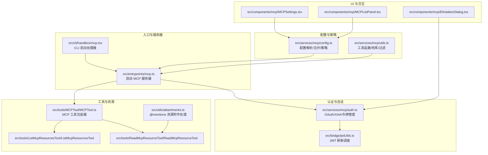
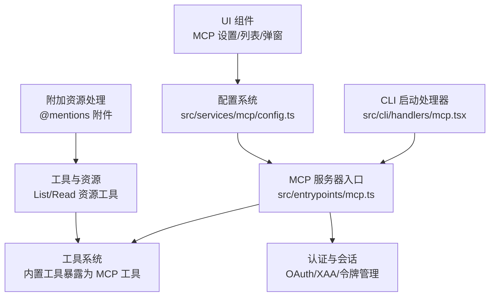
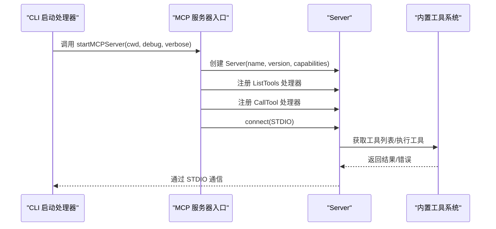
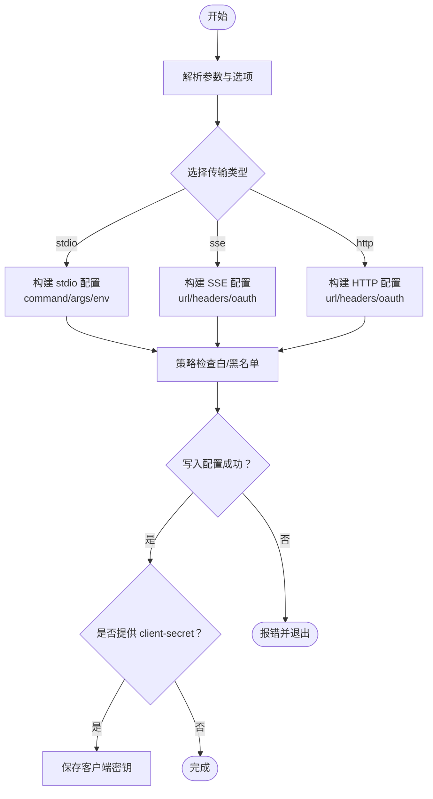
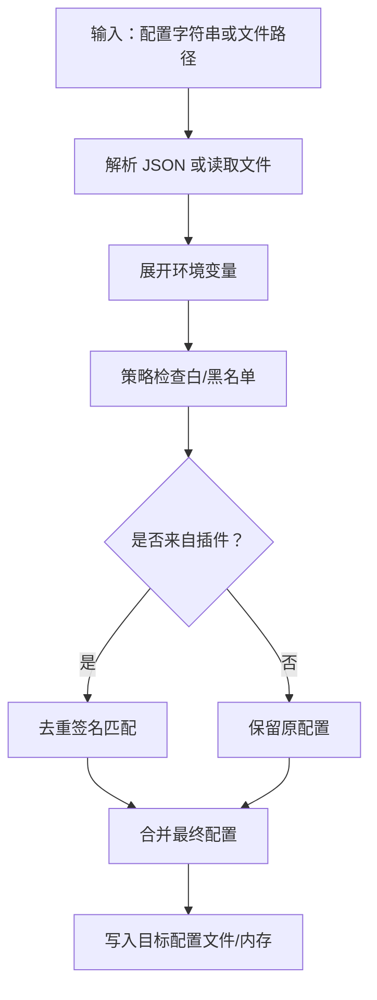
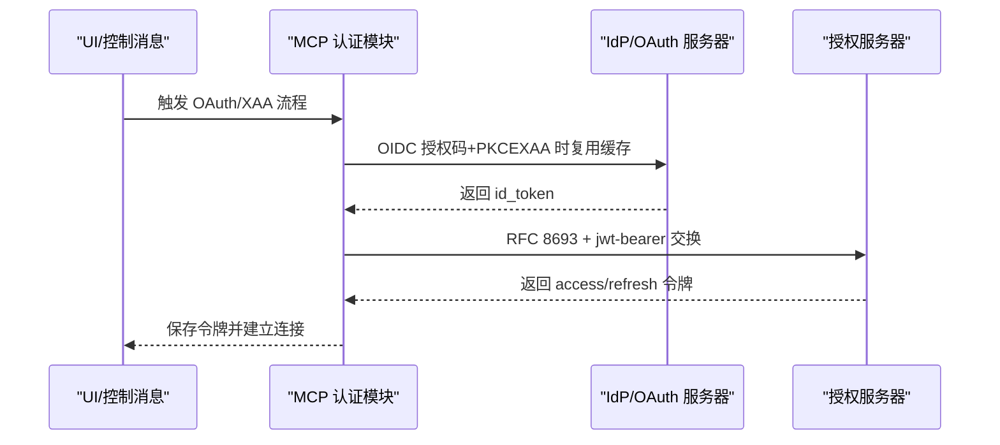
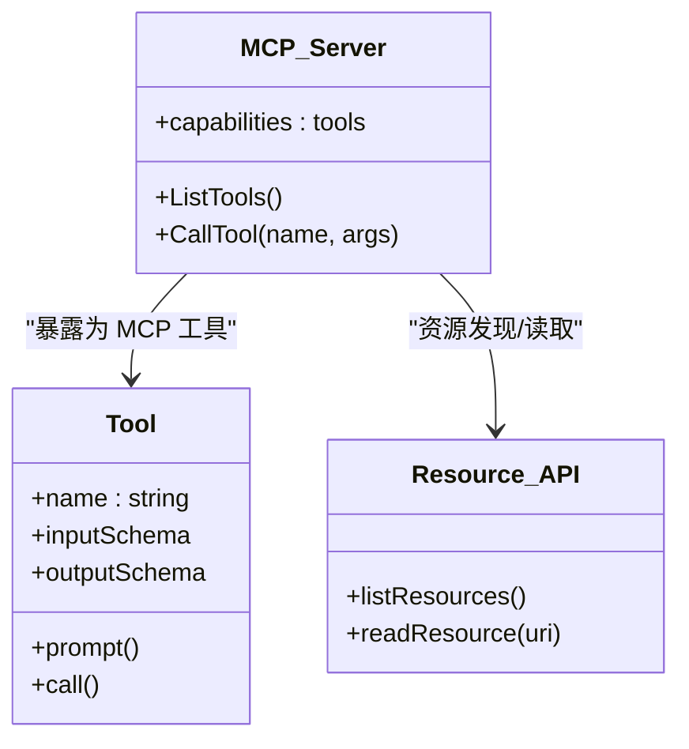
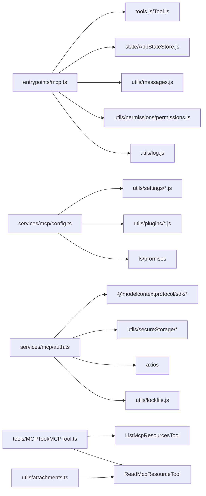

# MCP 服务器开发

<cite>
**本文引用的文件**
- [README.md](file://README.md)
- [src/entrypoints/mcp.ts](file://src/entrypoints/mcp.ts)
- [src/commands/mcp/addCommand.ts](file://src/commands/mcp/addCommand.ts)
- [src/services/mcp/config.ts](file://src/services/mcp/config.ts)
- [src/services/mcp/auth.ts](file://src/services/mcp/auth.ts)
- [src/services/mcp/utils.ts](file://src/services/mcp/utils.ts)
- [src/cli/print.ts](file://src/cli/print.ts)
- [src/cli/handlers/mcp.tsx](file://src/cli/handlers/mcp.tsx)
- [src/main.tsx](file://src/main.tsx)
- [src/components/mcp/MCPSettings.tsx](file://src/components/mcp/MCPSettings.tsx)
- [src/components/mcp/MCPListPanel.tsx](file://src/components/mcp/MCPListPanel.tsx)
- [src/components/mcp/ElicitationDialog.tsx](file://src/components/mcp/ElicitationDialog.tsx)
- [src/tools/MCPTool/MCPTool.ts](file://src/tools/MCPTool/MCPTool.ts)
- [src/tools/ListMcpResourcesTool/ListMcpResourcesTool](file://src/tools/ListMcpResourcesTool/ListMcpResourcesTool)
- [src/tools/ReadMcpResourceTool/ReadMcpResourceTool](file://src/tools/ReadMcpResourceTool/ReadMcpResourceTool)
- [src/utils/attachments.ts](file://src/utils/attachments.ts)
- [src/bridge/jwtUtils.ts](file://src/bridge/jwtUtils.ts)
</cite>

## 目录
1. [引言](#引言)
2. [项目结构](#项目结构)
3. [核心组件](#核心组件)
4. [架构总览](#架构总览)
5. [详细组件分析](#详细组件分析)
6. [依赖关系分析](#依赖关系分析)
7. [性能考虑](#性能考虑)
8. [故障排查指南](#故障排查指南)
9. [结论](#结论)
10. [附录](#附录)

## 引言
本文件面向希望基于 Claude Code 的 MCP（Model Context Protocol）实现开发“工具服务器”“通知服务器”“资源服务器”的工程师，系统性阐述 MCP 协议在 Claude Code 中的实现与集成方式，涵盖协议规范映射、消息格式、通信机制、服务器初始化与连接管理、配置系统、认证与会话、资源管理、最佳实践、部署建议以及调试与监控方法。文中所有技术细节均以仓库源码为依据，并通过图表与路径指引帮助读者快速定位实现位置。

## 项目结构
Claude Code 将 MCP 作为“服务层”的一部分，贯穿于命令行、UI 组件、工具系统与业务服务之间。关键模块包括：
- 入口与服务器：入口点负责启动 MCP 服务器；CLI 命令用于添加/移除服务器配置。
- 配置与策略：解析与合并多源配置，支持企业策略白名单/黑名单、动态配置与插件注入。
- 认证与会话：支持 OAuth 流程、XAA（跨应用访问）、令牌刷新与撤销。
- 工具与资源：将内置工具暴露为 MCP 工具，支持资源列举与读取。
- UI 与交互：设置面板、列表面板、弹窗对话框等用于管理 MCP 服务器。

**图表来源**
- [src/entrypoints/mcp.ts:35-197](file://src/entrypoints/mcp.ts#L35-L197)
- [src/cli/handlers/mcp.tsx:56-71](file://src/cli/handlers/mcp.tsx#L56-L71)
- [src/services/mcp/config.ts:618-761](file://src/services/mcp/config.ts#L618-L761)
- [src/services/mcp/auth.ts:256-311](file://src/services/mcp/auth.ts#L256-L311)
- [src/tools/MCPTool/MCPTool.ts](file://src/tools/MCPTool/MCPTool.ts)
- [src/tools/ListMcpResourcesTool/ListMcpResourcesTool](file://src/tools/ListMcpResourcesTool/ListMcpResourcesTool)
- [src/tools/ReadMcpResourceTool/ReadMcpResourceTool](file://src/tools/ReadMcpResourceTool/ReadMcpResourceTool)
- [src/utils/attachments.ts:1995-2033](file://src/utils/attachments.ts#L1995-L2033)
- [src/bridge/jwtUtils.ts:71-105](file://src/bridge/jwtUtils.ts#L71-L105)

**章节来源**
- [README.md:693-724](file://README.md#L693-L724)
- [src/entrypoints/mcp.ts:35-197](file://src/entrypoints/mcp.ts#L35-L197)
- [src/commands/mcp/addCommand.ts:33-281](file://src/commands/mcp/addCommand.ts#L33-L281)
- [src/services/mcp/config.ts:618-761](file://src/services/mcp/config.ts#L618-L761)
- [src/services/mcp/auth.ts:256-311](file://src/services/mcp/auth.ts#L256-L311)
- [src/services/mcp/utils.ts:325-349](file://src/services/mcp/utils.ts#L325-L349)
- [src/cli/print.ts:3301-3452](file://src/cli/print.ts#L3301-L3452)
- [src/main.tsx:1415-1452](file://src/main.tsx#L1415-L1452)

## 核心组件
- MCP 服务器入口：负责创建 Server 实例、注册 ListTools 与 CallTool 请求处理器、建立 STDIO 传输并运行。
- CLI 添加服务器：支持 stdio/sse/http 三种传输类型，可配置头信息、OAuth 客户端信息、回调端口与 XAA。
- 配置系统：解析 .mcp.json、用户级与项目级配置，合并策略（白名单/黑名单），去重与签名匹配，动态配置与插件注入。
- 认证与会话：OAuth 发现元数据、令牌刷新/撤销、XAA（跨应用访问）流程、安全存储与密钥管理。
- 工具与资源：将内置工具暴露为 MCP 工具，支持资源列举与读取，支持 @mentions 资源附件。
- UI 与交互：设置面板、列表面板、弹窗对话框用于服务器管理与权限提示。

**章节来源**
- [src/entrypoints/mcp.ts:35-197](file://src/entrypoints/mcp.ts#L35-L197)
- [src/commands/mcp/addCommand.ts:33-281](file://src/commands/mcp/addCommand.ts#L33-L281)
- [src/services/mcp/config.ts:618-761](file://src/services/mcp/config.ts#L618-L761)
- [src/services/mcp/auth.ts:256-311](file://src/services/mcp/auth.ts#L256-L311)
- [src/tools/MCPTool/MCPTool.ts](file://src/tools/MCPTool/MCPTool.ts)
- [src/tools/ListMcpResourcesTool/ListMcpResourcesTool](file://src/tools/ListMcpResourcesTool/ListMcpResourcesTool)
- [src/tools/ReadMcpResourceTool/ReadMcpResourceTool](file://src/tools/ReadMcpResourceTool/ReadMcpResourceTool)
- [src/utils/attachments.ts:1995-2033](file://src/utils/attachments.ts#L1995-L2033)

## 架构总览
下图展示了 MCP 服务器在 Claude Code 中的总体架构：从 CLI 入口到 MCP 服务器，再到工具系统与资源管理，以及认证与配置的支撑。

**图表来源**
- [src/cli/handlers/mcp.tsx:56-71](file://src/cli/handlers/mcp.tsx#L56-L71)
- [src/entrypoints/mcp.ts:35-197](file://src/entrypoints/mcp.ts#L35-L197)
- [src/services/mcp/config.ts:618-761](file://src/services/mcp/config.ts#L618-L761)
- [src/tools/ListMcpResourcesTool/ListMcpResourcesTool](file://src/tools/ListMcpResourcesTool/ListMcpResourcesTool)
- [src/tools/ReadMcpResourceTool/ReadMcpResourceTool](file://src/tools/ReadMcpResourceTool/ReadMcpResourceTool)
- [src/utils/attachments.ts:1995-2033](file://src/utils/attachments.ts#L1995-L2033)

## 详细组件分析

### MCP 服务器入口与协议实现
- 服务器初始化：创建 Server 实例，声明 capabilities 为 tools。
- ListTools 请求处理器：枚举内置工具，转换输入/输出 Schema，生成工具描述。
- CallTool 请求处理器：根据工具名查找内置工具，构造 ToolUseContext，执行工具调用，返回文本内容或错误。
- 传输：STDIO 服务器传输，通过 connect 建立连接。
- 缓存：为 readFileState 使用大小受限的 LRU 缓存，防止内存增长。

**图表来源**
- [src/entrypoints/mcp.ts:35-197](file://src/entrypoints/mcp.ts#L35-L197)

**章节来源**
- [src/entrypoints/mcp.ts:35-197](file://src/entrypoints/mcp.ts#L35-L197)

### CLI 添加 MCP 服务器（stdio/sse/http）
- 支持传输类型：stdio、sse、http，默认 stdio。
- 参数与选项：scope、transport、env、header、client-id、client-secret、callback-port、--xaa。
- 类型校验与警告：对 URL 形式的误用给出警告；OAuth 仅对 http/sse 生效。
- 写入配置：按 scope 写入 .mcp.json 或用户配置；保存客户端密钥（如需要）。

**图表来源**
- [src/commands/mcp/addCommand.ts:33-281](file://src/commands/mcp/addCommand.ts#L33-L281)

**章节来源**
- [src/commands/mcp/addCommand.ts:33-281](file://src/commands/mcp/addCommand.ts#L33-L281)

### 配置系统与动态配置更新
- 配置来源：.mcp.json（项目）、用户配置、本地配置、动态配置、企业配置、claude.ai 配置。
- 解析与合并：解析 JSON 字符串或文件路径，展开环境变量，合并策略（白名单/黑名单），去重（签名匹配）。
- 动态配置：支持命令行传入配置字符串或文件路径，扩展变量后解析为服务器配置。
- 插件与企业策略：插件 MCP 服务器与手动配置去重；企业策略优先级高于用户策略。

**图表来源**
- [src/services/mcp/config.ts:618-761](file://src/services/mcp/config.ts#L618-L761)
- [src/main.tsx:1415-1452](file://src/main.tsx#L1415-L1452)

**章节来源**
- [src/services/mcp/config.ts:618-761](file://src/services/mcp/config.ts#L618-L761)
- [src/main.tsx:1415-1452](file://src/main.tsx#L1415-L1452)

### 认证机制（OAuth、XAA、JWT）
- OAuth 元数据发现：支持配置元数据 URL 或 RFC 9728/RFC 8414 自动发现；POST 响应体标准化处理非标准错误码。
- 令牌管理：获取/刷新/撤销令牌，支持 RFC 7009 令牌撤销；区分客户端认证方式（client_secret_basic/post）。
- XAA（跨应用访问）：一次 IdP 登录复用至多个 MCP 服务器，执行 RFC 8693+jwt-bearer 交换，保存令牌到统一存储。
- JWT 刷新调度：基于过期时间定时刷新，带缓冲与失败计数，避免并发冲突。
- 控制消息：支持通过 SDK 控制消息触发 OAuth 流程与重新连接。

**图表来源**
- [src/services/mcp/auth.ts:256-311](file://src/services/mcp/auth.ts#L256-L311)
- [src/services/mcp/auth.ts:664-800](file://src/services/mcp/auth.ts#L664-L800)
- [src/bridge/jwtUtils.ts:71-105](file://src/bridge/jwtUtils.ts#L71-L105)
- [src/cli/print.ts:3301-3452](file://src/cli/print.ts#L3301-L3452)

**章节来源**
- [src/services/mcp/auth.ts:256-311](file://src/services/mcp/auth.ts#L256-L311)
- [src/services/mcp/auth.ts:664-800](file://src/services/mcp/auth.ts#L664-L800)
- [src/bridge/jwtUtils.ts:71-105](file://src/bridge/jwtUtils.ts#L71-L105)
- [src/cli/print.ts:3301-3452](file://src/cli/print.ts#L3301-L3452)

### 资源管理（工具注册、能力声明、资源发现）
- 工具注册：MCP 服务器将内置工具暴露为 MCP 工具，名称前缀为 mcp__<server>__，Schema 由工具定义转换而来。
- 能力声明：capabilities 为 tools，ListTools 返回工具清单。
- 资源发现：提供 ListMcpResourcesTool 与 ReadMcpResourceTool，支持资源列举与读取；@mentions 语法自动解析资源并发起读取请求。

**图表来源**
- [src/entrypoints/mcp.ts:59-188](file://src/entrypoints/mcp.ts#L59-L188)
- [src/tools/MCPTool/MCPTool.ts](file://src/tools/MCPTool/MCPTool.ts)
- [src/tools/ListMcpResourcesTool/ListMcpResourcesTool](file://src/tools/ListMcpResourcesTool/ListMcpResourcesTool)
- [src/tools/ReadMcpResourceTool/ReadMcpResourceTool](file://src/tools/ReadMcpResourceTool/ReadMcpResourceTool)
- [src/utils/attachments.ts:1995-2033](file://src/utils/attachments.ts#L1995-L2033)

**章节来源**
- [src/entrypoints/mcp.ts:59-188](file://src/entrypoints/mcp.ts#L59-L188)
- [src/tools/MCPTool/MCPTool.ts](file://src/tools/MCPTool/MCPTool.ts)
- [src/tools/ListMcpResourcesTool/ListMcpResourcesTool](file://src/tools/ListMcpResourcesTool/ListMcpResourcesTool)
- [src/tools/ReadMcpResourceTool/ReadMcpResourceTool](file://src/tools/ReadMcpResourceTool/ReadMcpResourceTool)
- [src/utils/attachments.ts:1995-2033](file://src/utils/attachments.ts#L1995-L2033)

### 连接管理与生命周期
- 连接类型：stdio、sse、http、ws、sdk。
- 生命周期：connect → initialize → list tools → tool calls → disconnect/reconnect（带退避）。
- 重新连接：当认证成功后重建连接，更新工具/命令/资源集合。
- 动态 MCP：支持通过控制消息动态增删服务器，序列化调用避免竞态。

**章节来源**
- [README.md:693-724](file://README.md#L693-L724)
- [src/cli/print.ts:1432-1460](file://src/cli/print.ts#L1432-L1460)
- [src/cli/print.ts:3301-3452](file://src/cli/print.ts#L3301-L3452)

## 依赖关系分析
- 入口依赖：依赖工具系统、状态存储、消息构造、权限检查、日志与错误处理。
- 配置依赖：依赖设置系统、插件加载、企业策略、平台信息、文件系统操作。
- 认证依赖：依赖 SDK OAuth 客户端、HTTP 客户端、安全存储、浏览器打开、锁文件与并发控制。
- 工具与资源：依赖 MCP 工具包装器、资源工具、附件解析。

**图表来源**
- [src/entrypoints/mcp.ts:10-28](file://src/entrypoints/mcp.ts#L10-L28)
- [src/services/mcp/config.ts:1-57](file://src/services/mcp/config.ts#L1-L57)
- [src/services/mcp/auth.ts:1-51](file://src/services/mcp/auth.ts#L1-L51)
- [src/tools/MCPTool/MCPTool.ts](file://src/tools/MCPTool/MCPTool.ts)
- [src/utils/attachments.ts:1995-2033](file://src/utils/attachments.ts#L1995-L2033)

**章节来源**
- [src/entrypoints/mcp.ts:10-28](file://src/entrypoints/mcp.ts#L10-L28)
- [src/services/mcp/config.ts:1-57](file://src/services/mcp/config.ts#L1-L57)
- [src/services/mcp/auth.ts:1-51](file://src/services/mcp/auth.ts#L1-L51)
- [src/tools/MCPTool/MCPTool.ts](file://src/tools/MCPTool/MCPTool.ts)
- [src/utils/attachments.ts:1995-2033](file://src/utils/attachments.ts#L1995-L2033)

## 性能考虑
- 缓存：为文件状态读取使用大小受限的 LRU 缓存，限制内存占用。
- 并发：工具执行采用并行/串行分区策略，避免阻塞。
- 序列化：动态 MCP 服务器变更通过序列化调用避免竞态。
- 策略检查：白/黑名单与去重在配置阶段完成，减少运行时开销。
- 日志与错误：统一错误处理与日志记录，便于定位性能瓶颈。

**章节来源**
- [src/entrypoints/mcp.ts:40-46](file://src/entrypoints/mcp.ts#L40-L46)
- [src/cli/print.ts:1535-1547](file://src/cli/print.ts#L1535-L1547)
- [src/services/mcp/config.ts:223-266](file://src/services/mcp/config.ts#L223-L266)

## 故障排查指南
- OAuth 失败：检查元数据发现、客户端凭据、回调端口可用性、令牌交换与 JWT bearer 步骤；查看敏感参数脱敏日志。
- 令牌撤销：遵循先刷新令牌再访问令牌的顺序，兼容非 RFC 7009 服务器的回退方案。
- 重新连接：通过控制消息触发重新认证与连接，确保工具/命令/资源集合正确更新。
- 配置问题：确认 .mcp.json 语法、环境变量展开、策略白/黑名单、动态配置来源。
- 资源读取：检查资源 URI 与服务器资源列表，确认 @mentions 语法与解析逻辑。

**章节来源**
- [src/services/mcp/auth.ts:157-191](file://src/services/mcp/auth.ts#L157-L191)
- [src/services/mcp/auth.ts:381-459](file://src/services/mcp/auth.ts#L381-L459)
- [src/cli/print.ts:3389-3452](file://src/cli/print.ts#L3389-L3452)
- [src/services/mcp/config.ts:618-761](file://src/services/mcp/config.ts#L618-L761)
- [src/utils/attachments.ts:1995-2033](file://src/utils/attachments.ts#L1995-L2033)

## 结论
Claude Code 的 MCP 服务器实现以清晰的模块划分与严格的策略控制为核心，结合完善的认证体系与资源管理能力，为开发者提供了可扩展、可观测且安全的 MCP 服务器开发框架。通过 CLI、配置系统、认证与工具/资源接口的协同，开发者可以快速搭建工具服务器、通知服务器与资源服务器，并在生产环境中进行安全与性能优化。

## 附录
- 部署建议（概念性）：容器化时使用 STDIO 传输，配合进程管理器；集群部署时通过 HTTP/SSE 传输并启用 OAuth/XAA；负载均衡建议基于会话亲和或无状态令牌管理。
- 最佳实践（概念性）：严格遵循 MCP Schema；使用缓存与并发控制；完善日志与指标；最小权限原则与企业策略集成；定期轮换密钥与撤销令牌。