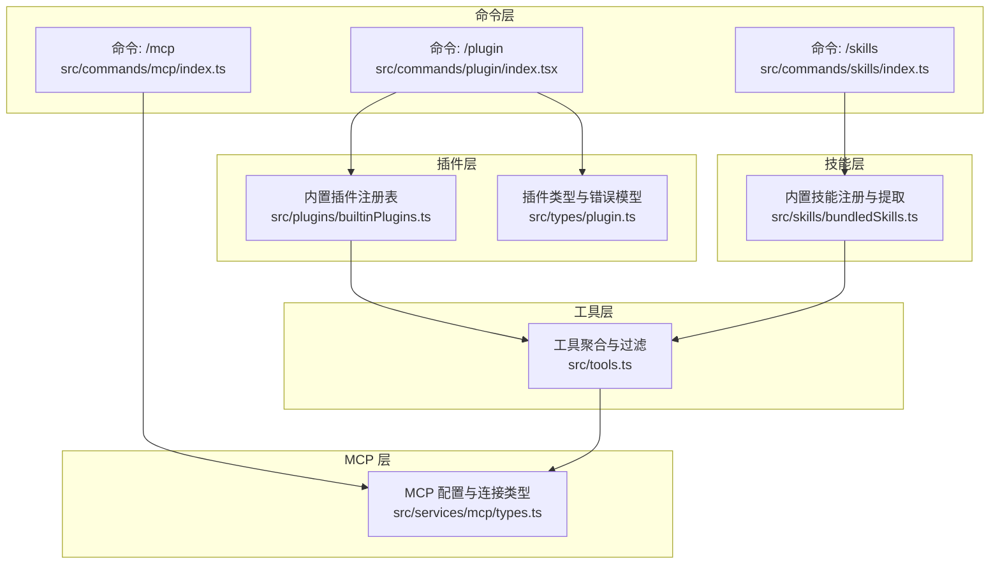
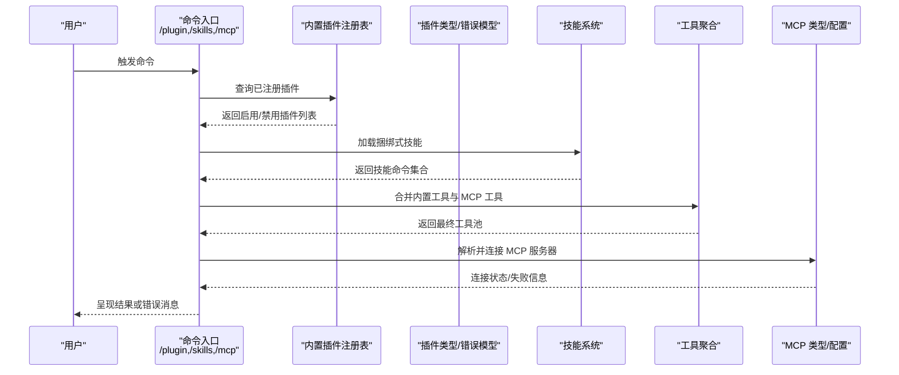
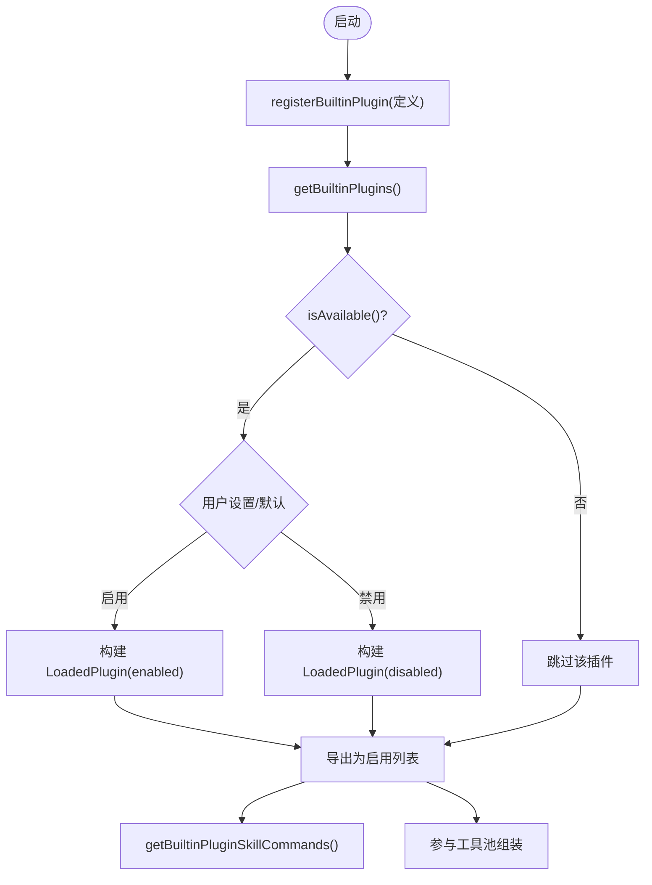
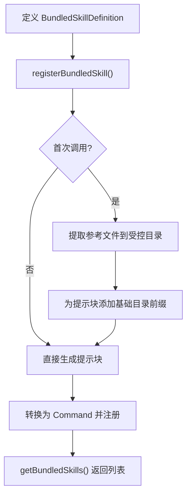
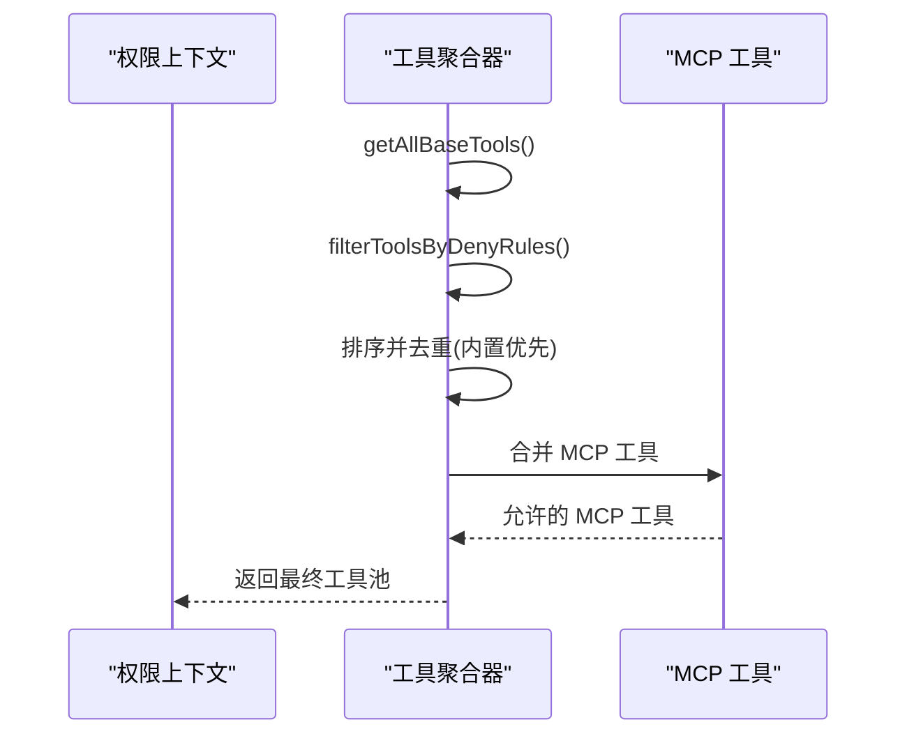
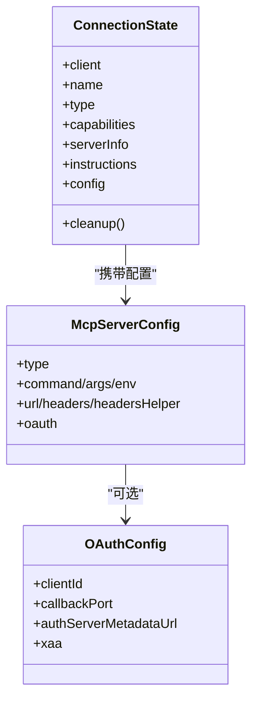
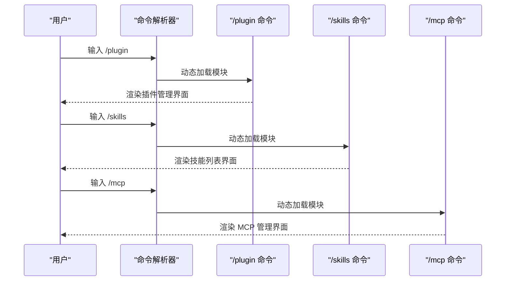
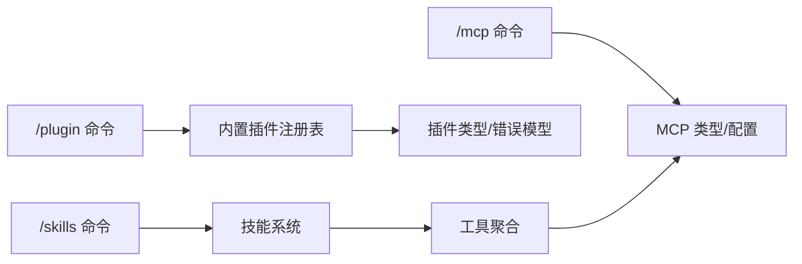

# 扩展开发

<cite>
**本文引用的文件**
- [builtinPlugins.ts](file://src/plugins/builtinPlugins.ts)
- [plugin.ts](file://src/types/plugin.ts)
- [tools.ts](file://src/tools.ts)
- [bundledSkills.ts](file://src/skills/bundledSkills.ts)
- [types.ts](file://src/services/mcp/types.ts)
- [index.tsx](file://src/commands/plugin/index.tsx)
- [index.ts](file://src/commands/skills/index.ts)
- [index.ts](file://src/commands/mcp/index.ts)
</cite>

## 目录
1. [引言](#引言)
2. [项目结构](#项目结构)
3. [核心组件](#核心组件)
4. [架构总览](#架构总览)
5. [详细组件分析](#详细组件分析)
6. [依赖关系分析](#依赖关系分析)
7. [性能考量](#性能考量)
8. [故障排除指南](#故障排除指南)
9. [结论](#结论)
10. [附录](#附录)

## 引言
本技术文档面向 Claude Code 扩展开发者，系统性阐述扩展体系的架构设计与实现原理，覆盖以下主题：
- 插件注册机制与生命周期管理（内置插件与市场插件）
- 插件开发指南（接口实现、配置与依赖管理）
- 自定义工具开发（工具接口、权限设计与 UI 集成）
- MCP 服务器开发（协议实现、配置与认证）
- 技能系统（技能定义、加载与扩展）
- 最佳实践（性能优化、安全与测试）
- 打包、分发与安装流程
- 调试与故障排除
- 使用真实源码路径展示开发步骤
- 提供可复用的模板与示例项目指引

## 项目结构
Claude Code 的扩展能力由“插件”“技能”“工具”“MCP 服务器”四大支柱构成，并通过统一的命令入口与状态管理进行编排。

**图表来源**
- [index.tsx:1-11](file://src/commands/plugin/index.tsx#L1-L11)
- [index.ts:1-11](file://src/commands/skills/index.ts#L1-L11)
- [index.ts:1-13](file://src/commands/mcp/index.ts#L1-L13)
- [builtinPlugins.ts:1-160](file://src/plugins/builtinPlugins.ts#L1-L160)
- [plugin.ts:1-364](file://src/types/plugin.ts#L1-L364)
- [bundledSkills.ts:1-221](file://src/skills/bundledSkills.ts#L1-L221)
- [tools.ts:1-390](file://src/tools.ts#L1-L390)
- [types.ts:1-259](file://src/services/mcp/types.ts#L1-L259)

**章节来源**
- [index.tsx:1-11](file://src/commands/plugin/index.tsx#L1-L11)
- [index.ts:1-11](file://src/commands/skills/index.ts#L1-L11)
- [index.ts:1-13](file://src/commands/mcp/index.ts#L1-L13)
- [builtinPlugins.ts:1-160](file://src/plugins/builtinPlugins.ts#L1-L160)
- [plugin.ts:1-364](file://src/types/plugin.ts#L1-L364)
- [bundledSkills.ts:1-221](file://src/skills/bundledSkills.ts#L1-L221)
- [tools.ts:1-390](file://src/tools.ts#L1-L390)
- [types.ts:1-259](file://src/services/mcp/types.ts#L1-L259)

## 核心组件
- 内置插件注册表：负责内置插件的注册、可用性检查、启用状态持久化与聚合导出。
- 插件类型与错误模型：定义 LoadedPlugin、BuiltinPluginDefinition、PluginError 等关键类型，提供类型安全的错误处理。
- 技能系统：支持“捆绑式技能”的注册、首次调用时的文件提取与提示拼接。
- 工具系统：统一聚合内置工具与 MCP 工具，支持权限过滤、REPL 模式下的工具隐藏、以及去重合并。
- MCP 类型与配置：提供多种传输协议（stdio、sse、sse-ide、ws-ide、http、ws、sdk、claudeai-proxy）的配置模式与连接状态模型。

**章节来源**
- [builtinPlugins.ts:1-160](file://src/plugins/builtinPlugins.ts#L1-L160)
- [plugin.ts:1-364](file://src/types/plugin.ts#L1-L364)
- [bundledSkills.ts:1-221](file://src/skills/bundledSkills.ts#L1-L221)
- [tools.ts:1-390](file://src/tools.ts#L1-L390)
- [types.ts:1-259](file://src/services/mcp/types.ts#L1-L259)

## 架构总览
下图展示了从命令入口到插件、技能、工具与 MCP 的交互路径，以及错误模型在各层的落地。

**图表来源**
- [index.tsx:1-11](file://src/commands/plugin/index.tsx#L1-L11)
- [index.ts:1-11](file://src/commands/skills/index.ts#L1-L11)
- [index.ts:1-13](file://src/commands/mcp/index.ts#L1-L13)
- [builtinPlugins.ts:57-102](file://src/plugins/builtinPlugins.ts#L57-L102)
- [bundledSkills.ts:106-108](file://src/skills/bundledSkills.ts#L106-L108)
- [tools.ts:345-367](file://src/tools.ts#L345-L367)
- [types.ts:180-227](file://src/services/mcp/types.ts#L180-L227)

## 详细组件分析

### 插件注册与生命周期
- 注册机制：通过注册函数将插件定义写入内存映射；插件 ID 采用“名称@市场名”格式，内置插件以“名称@builtin”标识。
- 可用性与默认状态：支持按系统能力判断是否可用；启用状态优先取用户设置，其次取插件默认值。
- 生命周期：内置插件在启动时被加载为 LoadedPlugin，包含清单、路径、来源、仓库、钩子与 MCP 服务器等元数据；禁用插件不参与技能与工具的导出。
- 错误模型：提供丰富的 PluginError 类型，便于 UI 与日志进行精准提示与引导。

**图表来源**
- [builtinPlugins.ts:28-102](file://src/plugins/builtinPlugins.ts#L28-L102)
- [builtinPlugins.ts:108-121](file://src/plugins/builtinPlugins.ts#L108-L121)

**章节来源**
- [builtinPlugins.ts:1-160](file://src/plugins/builtinPlugins.ts#L1-L160)
- [plugin.ts:18-35](file://src/types/plugin.ts#L18-L35)
- [plugin.ts:48-70](file://src/types/plugin.ts#L48-L70)
- [plugin.ts:101-289](file://src/types/plugin.ts#L101-L289)

### 技能系统
- 定义与注册：BundledSkillDefinition 支持名称、描述、别名、使用时机、参数提示、允许工具、模型、是否可被用户调用、钩子、上下文、代理、文件引用等字段。
- 文件提取：首次调用时将参考文件解压至受控目录，确保路径不越界；若失败则继续运行但不带基础目录前缀。
- 导出为命令：注册后转换为 Command，作为技能命令参与 UI 列表与提示生成。

**图表来源**
- [bundledSkills.ts:53-100](file://src/skills/bundledSkills.ts#L53-L100)
- [bundledSkills.ts:131-145](file://src/skills/bundledSkills.ts#L131-L145)
- [bundledSkills.ts:208-220](file://src/skills/bundledSkills.ts#L208-L220)

**章节来源**
- [bundledSkills.ts:1-221](file://src/skills/bundledSkills.ts#L1-L221)

### 工具系统与权限集成
- 工具聚合：getAllBaseTools() 产出当前环境可用的全部内置工具；assembleToolPool()/getMergedTools() 将内置工具与 MCP 工具合并，内置工具优先。
- 权限过滤：根据 deny 规则过滤工具；REPL 模式下隐藏仅原语工具，避免直接调用。
- 特性开关：通过环境变量与特性标志控制工具集，实现按需裁剪与死代码消除。

**图表来源**
- [tools.ts:193-251](file://src/tools.ts#L193-L251)
- [tools.ts:262-269](file://src/tools.ts#L262-L269)
- [tools.ts:345-367](file://src/tools.ts#L345-L367)

**章节来源**
- [tools.ts:1-390](file://src/tools.ts#L1-L390)

### MCP 服务器开发
- 配置类型：支持 stdio、sse、sse-ide、ws-ide、http、ws、sdk、claudeai-proxy 多种传输；OAuth/XAA 配置可选。
- 连接状态：Connected/Failed/NeedsAuth/Pending/Disabled 五态模型，便于 UI 与控制流处理。
- 认证机制：OAuth 客户端 ID、回调端口、授权服务器元数据 URL；XAA 标志用于跨应用访问。
- CLI 状态：序列化客户端、配置、工具与资源，便于调试与持久化。

**图表来源**
- [types.ts:28-135](file://src/services/mcp/types.ts#L28-L135)
- [types.ts:43-56](file://src/services/mcp/types.ts#L43-L56)
- [types.ts:180-227](file://src/services/mcp/types.ts#L180-L227)

**章节来源**
- [types.ts:1-259](file://src/services/mcp/types.ts#L1-L259)

### 命令入口与 UI 集成
- /plugin：本地 JSX 命令，负责插件管理 UI 的加载与交互。
- /skills：本地 JSX 命令，负责技能列表 UI 的加载与交互。
- /mcp：本地 JSX 命令，负责 MCP 服务器管理 UI 的加载与交互。

**图表来源**
- [index.tsx:1-11](file://src/commands/plugin/index.tsx#L1-L11)
- [index.ts:1-11](file://src/commands/skills/index.ts#L1-L11)
- [index.ts:1-13](file://src/commands/mcp/index.ts#L1-L13)

**章节来源**
- [index.tsx:1-11](file://src/commands/plugin/index.tsx#L1-L11)
- [index.ts:1-11](file://src/commands/skills/index.ts#L1-L11)
- [index.ts:1-13](file://src/commands/mcp/index.ts#L1-L13)

## 依赖关系分析
- 插件层依赖类型层（LoadedPlugin、PluginError），并通过设置持久化启用状态。
- 技能层依赖工具层（Command 作为技能命令），并在首次调用时进行文件提取。
- 工具层依赖 MCP 类型（MCP 工具与内置工具合并），并受权限规则约束。
- 命令层作为 UI 入口，串联插件、技能、MCP 的动态加载。

**图表来源**
- [builtinPlugins.ts:57-102](file://src/plugins/builtinPlugins.ts#L57-L102)
- [bundledSkills.ts:106-108](file://src/skills/bundledSkills.ts#L106-L108)
- [tools.ts:345-367](file://src/tools.ts#L345-L367)
- [types.ts:180-227](file://src/services/mcp/types.ts#L180-L227)
- [index.tsx:1-11](file://src/commands/plugin/index.tsx#L1-L11)
- [index.ts:1-11](file://src/commands/skills/index.ts#L1-L11)
- [index.ts:1-13](file://src/commands/mcp/index.ts#L1-L13)

**章节来源**
- [builtinPlugins.ts:1-160](file://src/plugins/builtinPlugins.ts#L1-L160)
- [plugin.ts:1-364](file://src/types/plugin.ts#L1-L364)
- [bundledSkills.ts:1-221](file://src/skills/bundledSkills.ts#L1-L221)
- [tools.ts:1-390](file://src/tools.ts#L1-L390)
- [types.ts:1-259](file://src/services/mcp/types.ts#L1-L259)
- [index.tsx:1-11](file://src/commands/plugin/index.tsx#L1-L11)
- [index.ts:1-11](file://src/commands/skills/index.ts#L1-L11)
- [index.ts:1-13](file://src/commands/mcp/index.ts#L1-L13)

## 性能考量
- 工具池排序与去重：保持内置工具连续前缀，避免缓存键被打乱导致的缓存失效。
- 条件加载与死代码消除：通过特性标志与环境变量裁剪工具集，减少运行时与打包体积。
- MCP 连接状态管理：Pending/Failed/NeedsAuth 状态有助于快速失败与重连策略，降低无效等待。
- 技能文件提取：惰性提取与一次性写入，避免重复 IO。

**章节来源**
- [tools.ts:354-366](file://src/tools.ts#L354-L366)
- [bundledSkills.ts:131-145](file://src/skills/bundledSkills.ts#L131-L145)
- [types.ts:207-213](file://src/services/mcp/types.ts#L207-L213)

## 故障排除指南
- 插件错误类型：涵盖路径不存在、Git 认证失败、网络错误、清单解析/校验失败、市场不可用、MCP 配置无效、LSP 请求超时/失败、依赖未满足、缓存缺失等。
- 错误消息映射：统一的错误消息生成函数，便于 UI 展示与日志记录。
- 建议排查步骤：
  - 确认插件 ID 与市场名格式正确（内置以 @builtin 结尾）。
  - 检查用户设置中的启用状态与默认值。
  - 校验 MCP 配置（传输类型、URL、认证参数）。
  - 查看连接状态（NeedsAuth/Failed/Pending）并执行相应修复。
  - 若出现依赖未满足，确认依赖插件已启用且存在于配置的市场中。

**章节来源**
- [plugin.ts:101-289](file://src/types/plugin.ts#L101-L289)
- [plugin.ts:295-363](file://src/types/plugin.ts#L295-L363)

## 结论
Claude Code 的扩展体系以“插件—技能—工具—MCP”为核心，通过类型安全的错误模型、灵活的配置与连接状态管理、以及严格的权限过滤，实现了可扩展、可观测、可维护的生态。开发者可基于内置注册表与工具聚合器快速实现插件与工具，结合 MCP 类型完成外部服务集成，并通过命令入口与 UI 实现一致的用户体验。

## 附录

### 扩展开发最佳实践
- 插件开发
  - 使用注册函数将插件定义写入注册表，提供 isAvailable 与 defaultEnabled。
  - 在 manifest 中声明 hooks 与 mcpServers，确保 UI 能正确呈现。
  - 使用 PluginError 类型化错误，提升诊断效率。
  - 参考路径：[builtinPlugins.ts:28-102](file://src/plugins/builtinPlugins.ts#L28-L102)、[plugin.ts:18-35](file://src/types/plugin.ts#L18-L35)、[plugin.ts:101-289](file://src/types/plugin.ts#L101-L289)
- 技能开发
  - 通过 BundledSkillDefinition 注册技能，必要时提供 files 以便首次调用提取。
  - 注意路径安全，避免相对路径逃逸。
  - 参考路径：[bundledSkills.ts:53-100](file://src/skills/bundledSkills.ts#L53-L100)、[bundledSkills.ts:195-206](file://src/skills/bundledSkills.ts#L195-L206)
- 工具开发
  - 在工具聚合器中注册新工具，遵循 isEnabled 与权限过滤。
  - 在 REPL 模式下注意隐藏仅原语工具。
  - 参考路径：[tools.ts:193-251](file://src/tools.ts#L193-L251)、[tools.ts:345-367](file://src/tools.ts#L345-L367)
- MCP 服务器开发
  - 选择合适的传输类型，配置认证与头部。
  - 维护连接状态，处理 NeedsAuth/Failed/Pending。
  - 参考路径：[types.ts:28-135](file://src/services/mcp/types.ts#L28-L135)、[types.ts:180-227](file://src/services/mcp/types.ts#L180-L227)
- UI 集成
  - 使用命令入口加载对应 UI 模块，确保交互一致性。
  - 参考路径：[/plugin 命令:1-11](file://src/commands/plugin/index.tsx#L1-L11)、[/skills 命令:1-11](file://src/commands/skills/index.ts#L1-L11)、[/mcp 命令:1-13](file://src/commands/mcp/index.ts#L1-L13)

### 打包、分发与安装
- 内置插件：随 CLI 发行，无需额外安装。
- 市场插件：通过市场配置与依赖解析机制安装，遵循 PluginError 的错误提示。
- MCP 服务器：通过配置文件或 UI 管理，支持多种传输与认证方式。
- 参考路径：[plugin.ts:44-46](file://src/types/plugin.ts#L44-L46)、[types.ts:171-177](file://src/services/mcp/types.ts#L171-L177)

### 调试与故障排除
- 使用 getPluginErrorMessage 获取统一错误消息。
- 检查连接状态与配置，定位失败原因。
- 参考路径：[plugin.ts:295-363](file://src/types/plugin.ts#L295-L363)、[types.ts:180-227](file://src/services/mcp/types.ts#L180-L227)