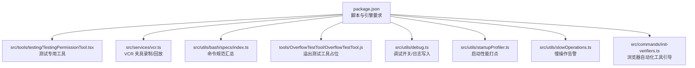
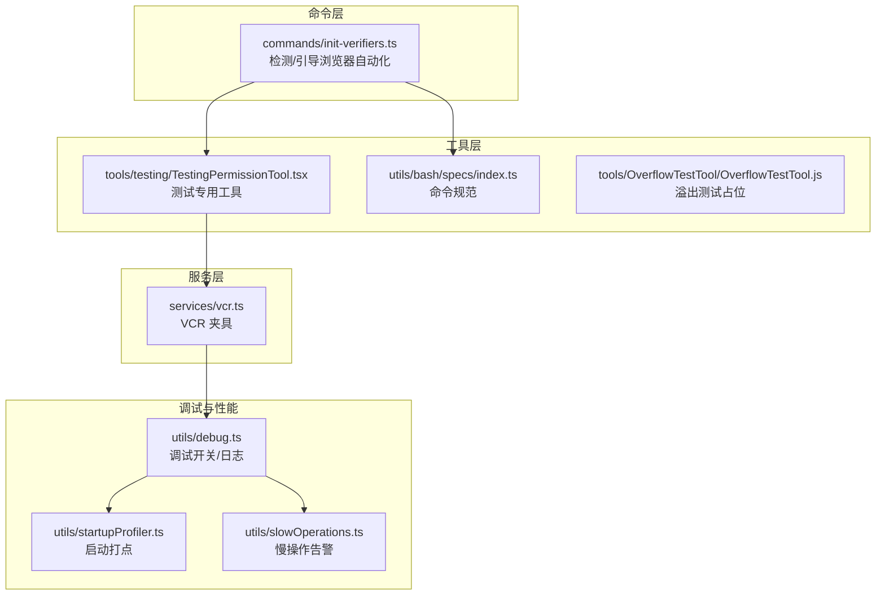
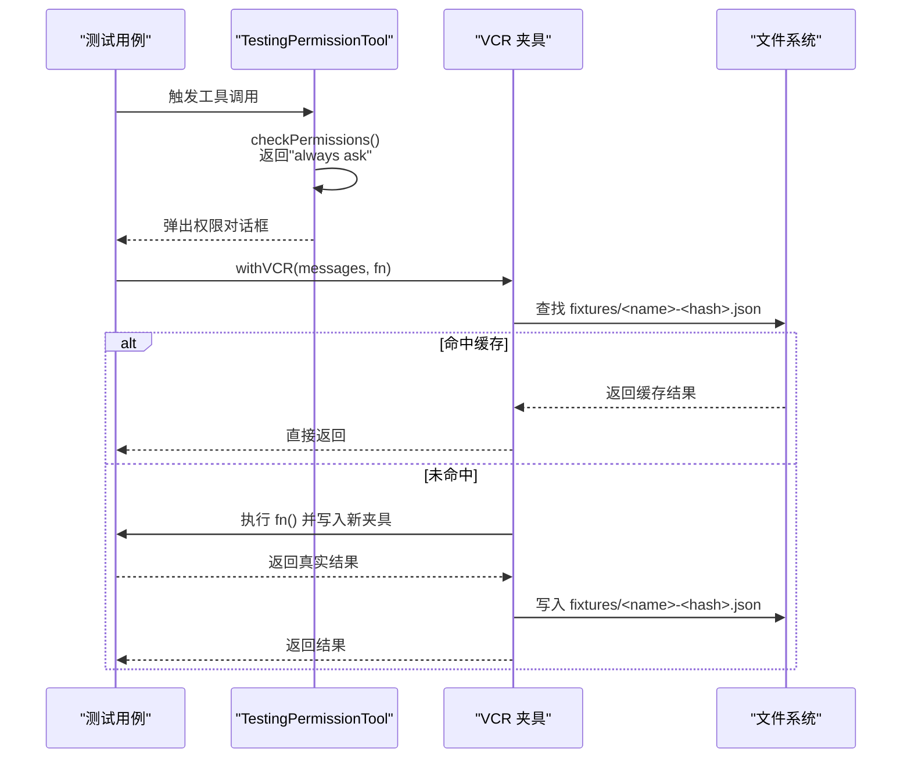
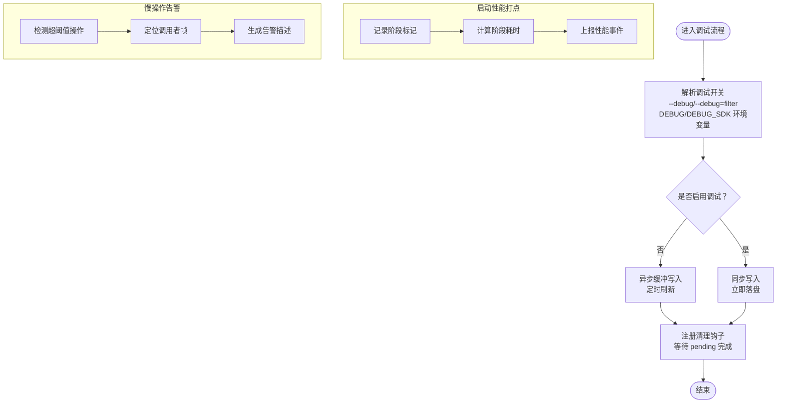
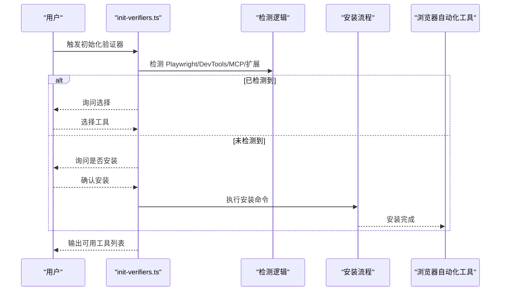
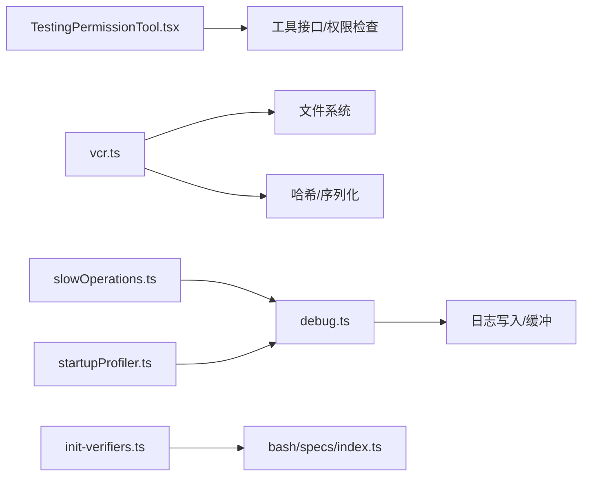

# 扩展测试与调试

<cite>
**本文引用的文件**
- [README.md](file://README.md)
- [package.json](file://package.json)
- [src/tools/testing/TestingPermissionTool.tsx](file://src/tools/testing/TestingPermissionTool.tsx)
- [src/services/vcr.ts](file://src/services/vcr.ts)
- [src/utils/debug.ts](file://src/utils/debug.ts)
- [src/utils/startupProfiler.ts](file://src/utils/startupProfiler.ts)
- [src/utils/slowOperations.ts](file://src/utils/slowOperations.ts)
- [src/commands/init-verifiers.ts](file://src/commands/init-verifiers.ts)
- [src/utils/bash/specs/index.ts](file://src/utils/bash/specs/index.ts)
- [tools/OverflowTestTool/OverflowTestTool.js](file://tools/OverflowTestTool/OverflowTestTool.js)
</cite>

## 目录
1. [简介](#简介)
2. [项目结构](#项目结构)
3. [核心组件](#核心组件)
4. [架构总览](#架构总览)
5. [详细组件分析](#详细组件分析)
6. [依赖分析](#依赖分析)
7. [性能考虑](#性能考虑)
8. [故障排查指南](#故障排查指南)
9. [结论](#结论)
10. [附录](#附录)

## 简介
本指南面向 Claude Code 扩展的测试与调试场景，聚焦于单元测试、集成测试与端到端测试的策略与落地方法；系统性阐述断点调试、日志分析与性能分析工具的使用；明确错误处理与异常捕获的分类、报告与恢复机制；给出内存、CPU 与响应时间的监控建议；覆盖跨平台、多版本与多配置的兼容性测试要点；并总结测试数据准备、测试环境搭建与测试自动化的最佳实践。文档同时结合仓库中的实际实现（如 VCR 录放、调试开关、启动性能打点、慢操作告警等）进行说明，并通过图示与路径引用帮助读者快速定位到相关源码位置。

## 项目结构
- 顶层脚本与构建信息位于 package.json，提供构建、类型检查与运行入口。
- 测试与调试相关能力在多个子系统中体现：
  - 工具层：TestingPermissionTool.tsx 提供“总是弹出权限对话框”的测试工具，便于端到端测试。
  - 服务层：vcr.ts 提供基于夹具（fixture）的录制与回放能力，用于稳定集成测试。
  - 工具链层：utils/bash/specs/index.ts 汇总命令规范，支撑工具行为的可预期性与可验证性。
  - 工具层：tools/OverflowTestTool/OverflowTestTool.js 展示了溢出类测试工具的占位实现。
  - 调试与性能：utils/debug.ts、utils/startupProfiler.ts、utils/slowOperations.ts 提供调试开关、启动性能打点与慢操作告警。
  - 命令层：commands/init-verifiers.ts 提供浏览器自动化工具检测与引导安装流程，辅助 UI/端到端验证。

**图表来源**
- [package.json:1-21](file://package.json#L1-L21)
- [src/tools/testing/TestingPermissionTool.tsx:1-74](file://src/tools/testing/TestingPermissionTool.tsx#L1-L74)
- [src/services/vcr.ts:38-406](file://src/services/vcr.ts#L38-L406)
- [src/utils/bash/specs/index.ts:1-19](file://src/utils/bash/specs/index.ts#L1-L19)
- [tools/OverflowTestTool/OverflowTestTool.js:1-3](file://tools/OverflowTestTool/OverflowTestTool.js#L1-L3)
- [src/utils/debug.ts:36-207](file://src/utils/debug.ts#L36-L207)
- [src/utils/startupProfiler.ts:152-194](file://src/utils/startupProfiler.ts#L152-L194)
- [src/utils/slowOperations.ts:35-75](file://src/utils/slowOperations.ts#L35-L75)
- [src/commands/init-verifiers.ts:58-80](file://src/commands/init-verifiers.ts#L58-L80)

**章节来源**
- [package.json:1-21](file://package.json#L1-L21)
- [README.md:250-380](file://README.md#L250-L380)

## 核心组件
- 测试工具与夹具
  - TestingPermissionTool.tsx：始终触发权限弹窗，适合端到端测试中验证权限交互链路。
  - vcr.ts：withFixture/withVCR/withTokenCountVCR 提供稳定的外部依赖交互复现，支持 CI 下缺失夹具时的提示与记录。
- 调试与性能
  - utils/debug.ts：统一的调试开关解析、运行时启用、过滤器提取、异步缓冲写入与符号链接维护。
  - utils/startupProfiler.ts：启动阶段打点与统计，按阶段计算耗时并上报。
  - utils/slowOperations.ts：慢操作阈值与调用栈定位，辅助识别阻塞热点。
- 工具与命令
  - utils/bash/specs/index.ts：命令规范聚合，保障工具行为一致性。
  - commands/init-verifiers.ts：检测并引导安装浏览器自动化工具（Playwright、Chrome DevTools MCP 等），用于 UI 验证。
  - tools/OverflowTestTool/OverflowTestTool.js：溢出测试工具占位实现，便于边界条件验证。

**章节来源**
- [src/tools/testing/TestingPermissionTool.tsx:1-74](file://src/tools/testing/TestingPermissionTool.tsx#L1-L74)
- [src/services/vcr.ts:38-406](file://src/services/vcr.ts#L38-L406)
- [src/utils/debug.ts:36-207](file://src/utils/debug.ts#L36-L207)
- [src/utils/startupProfiler.ts:152-194](file://src/utils/startupProfiler.ts#L152-L194)
- [src/utils/slowOperations.ts:35-75](file://src/utils/slowOperations.ts#L35-L75)
- [src/utils/bash/specs/index.ts:1-19](file://src/utils/bash/specs/index.ts#L1-L19)
- [src/commands/init-verifiers.ts:58-80](file://src/commands/init-verifiers.ts#L58-L80)
- [tools/OverflowTestTool/OverflowTestTool.js:1-3](file://tools/OverflowTestTool/OverflowTestTool.js#L1-L3)

## 架构总览
下图展示了测试与调试在系统中的位置与交互关系：命令层负责引导与检测；工具层提供可测试的工具；服务层通过 VCR 稳定外部依赖；调试与性能工具贯穿运行期以支持问题定位与优化。

**图表来源**
- [src/commands/init-verifiers.ts:58-80](file://src/commands/init-verifiers.ts#L58-L80)
- [src/tools/testing/TestingPermissionTool.tsx:1-74](file://src/tools/testing/TestingPermissionTool.tsx#L1-L74)
- [src/utils/bash/specs/index.ts:1-19](file://src/utils/bash/specs/index.ts#L1-L19)
- [tools/OverflowTestTool/OverflowTestTool.js:1-3](file://tools/OverflowTestTool/OverflowTestTool.js#L1-L3)
- [src/services/vcr.ts:38-406](file://src/services/vcr.ts#L38-L406)
- [src/utils/debug.ts:36-207](file://src/utils/debug.ts#L36-L207)
- [src/utils/startupProfiler.ts:152-194](file://src/utils/startupProfiler.ts#L152-L194)
- [src/utils/slowOperations.ts:35-75](file://src/utils/slowOperations.ts#L35-L75)

## 详细组件分析

### 组件一：测试工具与夹具（TestingPermissionTool 与 VCR）
- TestingPermissionTool 的设计目标是“总是弹出权限对话框”，从而在端到端测试中稳定地触发权限交互链路，便于验证权限拦截、拒绝与允许的完整流程。
- VCR（withFixture/withVCR/withTokenCountVCR）通过输入哈希生成夹具文件名，优先命中缓存；在 CI 缺失夹具时抛出明确提示，指导本地录制后提交；对消息与时间戳进行脱敏，确保跨环境一致性。

**图表来源**
- [src/tools/testing/TestingPermissionTool.tsx:36-42](file://src/tools/testing/TestingPermissionTool.tsx#L36-L42)
- [src/services/vcr.ts:38-86](file://src/services/vcr.ts#L38-L86)

**章节来源**
- [src/tools/testing/TestingPermissionTool.tsx:1-74](file://src/tools/testing/TestingPermissionTool.tsx#L1-L74)
- [src/services/vcr.ts:38-406](file://src/services/vcr.ts#L38-L406)

### 组件二：调试与性能（调试开关、启动打点、慢操作告警）
- 调试开关解析与运行时启用：支持从环境变量、命令行参数、标准错误输出重定向等多种方式开启调试；运行时可通过指令动态启用并刷新缓存。
- 启动性能打点：在模块加载时采样，记录关键阶段的 mark，计算阶段耗时并通过事件上报。
- 慢操作告警：定义慢操作阈值，定位调用栈中首个非库内帧，输出人类可读描述，辅助识别阻塞热点。

**图表来源**
- [src/utils/debug.ts:44-69](file://src/utils/debug.ts#L44-L69)
- [src/utils/debug.ts:163-196](file://src/utils/debug.ts#L163-L196)
- [src/utils/startupProfiler.ts:159-194](file://src/utils/startupProfiler.ts#L159-L194)
- [src/utils/slowOperations.ts:59-75](file://src/utils/slowOperations.ts#L59-L75)

**章节来源**
- [src/utils/debug.ts:36-207](file://src/utils/debug.ts#L36-L207)
- [src/utils/startupProfiler.ts:152-194](file://src/utils/startupProfiler.ts#L152-L194)
- [src/utils/slowOperations.ts:35-75](file://src/utils/slowOperations.ts#L35-L75)

### 组件三：命令与工具规范（Bash 规范与浏览器自动化引导）
- Bash 规范汇总：通过 index.ts 聚合各命令规范，保证工具行为一致且可验证。
- 浏览器自动化引导：检测已安装工具或引导安装 Playwright、Chrome DevTools MCP 或 Claude Chrome 扩展，用于 UI 级别的端到端验证。

**图表来源**
- [src/commands/init-verifiers.ts:58-80](file://src/commands/init-verifiers.ts#L58-L80)
- [src/utils/bash/specs/index.ts:10-19](file://src/utils/bash/specs/index.ts#L10-L19)

**章节来源**
- [src/commands/init-verifiers.ts:58-80](file://src/commands/init-verifiers.ts#L58-L80)
- [src/utils/bash/specs/index.ts:1-19](file://src/utils/bash/specs/index.ts#L1-L19)

## 依赖分析
- 测试工具与夹具
  - TestingPermissionTool 依赖工具接口与权限检查逻辑，用于端到端测试。
  - VCR 依赖文件系统与哈希算法，配合测试执行器实现稳定复现。
- 调试与性能
  - debug.ts 与 slowOperations.ts 共同构成运行期诊断能力；startupProfiler.ts 作为独立性能观测模块。
- 命令与工具
  - init-verifiers.ts 与 bash specs 共同保障工具行为的可预期性与可验证性。

**图表来源**
- [src/tools/testing/TestingPermissionTool.tsx:1-74](file://src/tools/testing/TestingPermissionTool.tsx#L1-L74)
- [src/services/vcr.ts:38-86](file://src/services/vcr.ts#L38-L86)
- [src/utils/debug.ts:163-196](file://src/utils/debug.ts#L163-L196)
- [src/utils/slowOperations.ts:35-75](file://src/utils/slowOperations.ts#L35-L75)
- [src/utils/startupProfiler.ts:159-194](file://src/utils/startupProfiler.ts#L159-L194)
- [src/commands/init-verifiers.ts:58-80](file://src/commands/init-verifiers.ts#L58-L80)
- [src/utils/bash/specs/index.ts:10-19](file://src/utils/bash/specs/index.ts#L10-L19)

**章节来源**
- [src/tools/testing/TestingPermissionTool.tsx:1-74](file://src/tools/testing/TestingPermissionTool.tsx#L1-L74)
- [src/services/vcr.ts:38-406](file://src/services/vcr.ts#L38-L406)
- [src/utils/debug.ts:36-207](file://src/utils/debug.ts#L36-L207)
- [src/utils/startupProfiler.ts:152-194](file://src/utils/startupProfiler.ts#L152-L194)
- [src/utils/slowOperations.ts:35-75](file://src/utils/slowOperations.ts#L35-L75)
- [src/commands/init-verifiers.ts:58-80](file://src/commands/init-verifiers.ts#L58-L80)
- [src/utils/bash/specs/index.ts:1-19](file://src/utils/bash/specs/index.ts#L1-L19)

## 性能考虑
- 启动性能
  - 使用启动性能打点模块记录关键阶段并计算耗时，便于定位启动瓶颈。
- 运行期性能
  - 慢操作告警模块提供阈值与调用栈定位，帮助识别阻塞热点。
- 外部依赖稳定性
  - VCR 夹具减少网络波动对测试的影响，提升回归稳定性，间接降低测试执行时间的不确定性。

**章节来源**
- [src/utils/startupProfiler.ts:152-194](file://src/utils/startupProfiler.ts#L152-L194)
- [src/utils/slowOperations.ts:35-75](file://src/utils/slowOperations.ts#L35-L75)
- [src/services/vcr.ts:38-86](file://src/services/vcr.ts#L38-L86)

## 故障排查指南
- 调试开关与日志
  - 通过命令行参数或环境变量开启调试；运行时可动态启用；日志写入支持同步与异步两种模式，并在进程退出前进行刷新。
- 启动性能
  - 启动阶段打点与上报可用于对比不同配置或版本的启动表现。
- 慢操作告警
  - 当检测到慢操作时，模块会定位调用者帧并生成可读描述，便于快速定位问题代码。
- VCR 夹具缺失
  - 在 CI 环境下若缺失夹具，将抛出明确提示，指导本地录制并提交；本地开发可直接执行测试以生成夹具。

**章节来源**
- [src/utils/debug.ts:44-69](file://src/utils/debug.ts#L44-L69)
- [src/utils/debug.ts:163-196](file://src/utils/debug.ts#L163-L196)
- [src/utils/startupProfiler.ts:159-194](file://src/utils/startupProfiler.ts#L159-L194)
- [src/utils/slowOperations.ts:59-75](file://src/utils/slowOperations.ts#L59-L75)
- [src/services/vcr.ts:71-75](file://src/services/vcr.ts#L71-L75)

## 结论
本指南基于仓库中的实际实现，给出了测试与调试的系统性方法论：以 TestingPermissionTool 与 VCR 为核心，结合 init-verifiers 的工具引导、debug 的灵活开关、startupProfiler 的启动打点与 slowOperations 的慢操作告警，形成从单元到端到端的完整测试闭环。建议在团队内推广夹具驱动的集成测试、以慢操作告警为抓手的性能回归、以及以启动打点为核心的冷启动优化策略。

## 附录
- 测试策略与实施要点
  - 单元测试：针对工具与服务的纯函数与边界条件，优先使用 VCR 夹具稳定外部依赖。
  - 集成测试：围绕工具注册、权限流与 MCP 交互，结合 TestingPermissionTool 验证权限拦截与允许路径。
  - 端到端测试：利用 init-verifiers 引导浏览器自动化工具，覆盖 UI 交互与工作流。
- 错误处理与异常捕获
  - 分类：权限拒绝、外部依赖失败、慢操作阻塞、夹具缺失。
  - 报告：调试日志、启动性能事件、慢操作告警描述。
  - 恢复：权限弹窗重试、VCR 回放降级、阈值调整与热点优化。
- 兼容性测试
  - 平台：Windows、macOS、Linux。
  - 版本：Node.js 18+、不同包管理器（npm/yarn/pnpm）。
  - 配置：不同 DEBUG/CI/VCR_RECORD 环境变量组合。
- 最佳实践
  - 测试数据：使用 VCR 夹具，避免真实外部依赖；对时间戳与 UUID 进行脱敏。
  - 测试环境：在 CI 中强制要求夹具存在，缺失时提示录制；本地开发启用调试与缓冲写入。
  - 自动化：将 init-verifiers 的检测与安装流程纳入测试前置步骤，确保浏览器自动化工具可用。