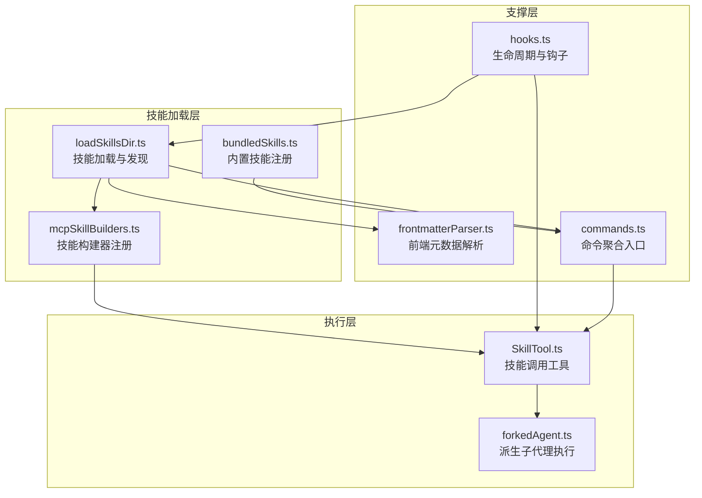
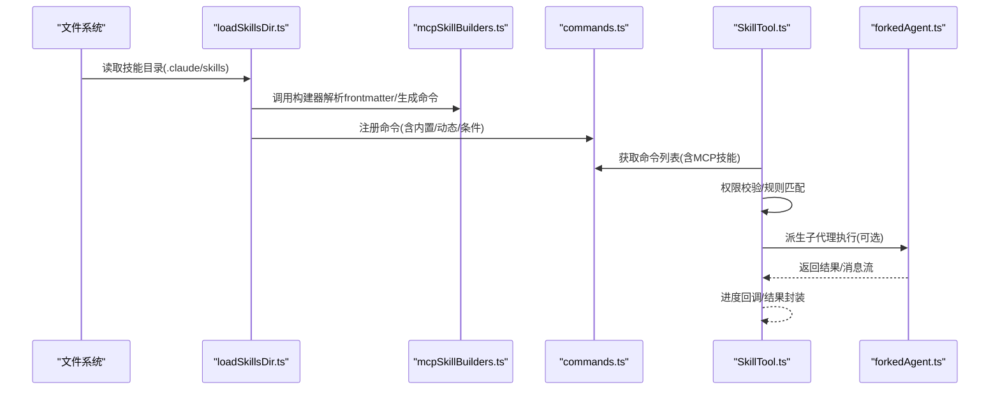
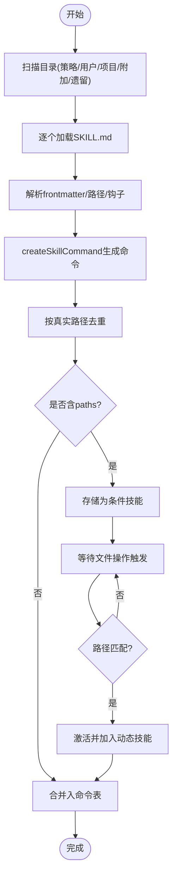
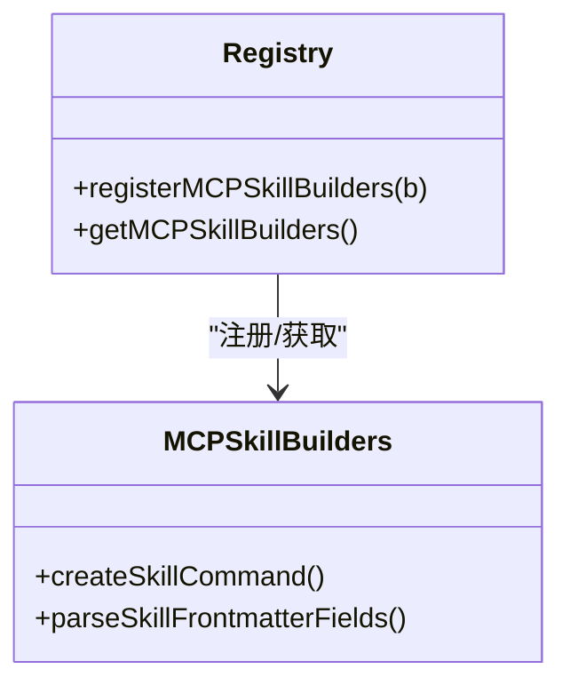
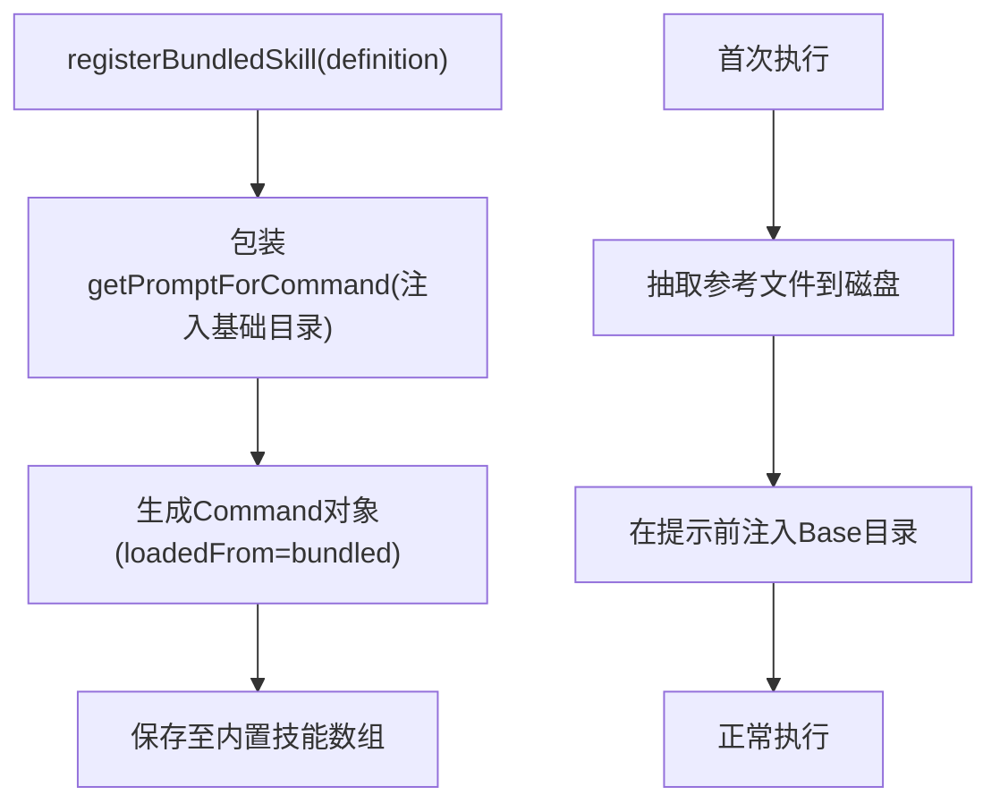
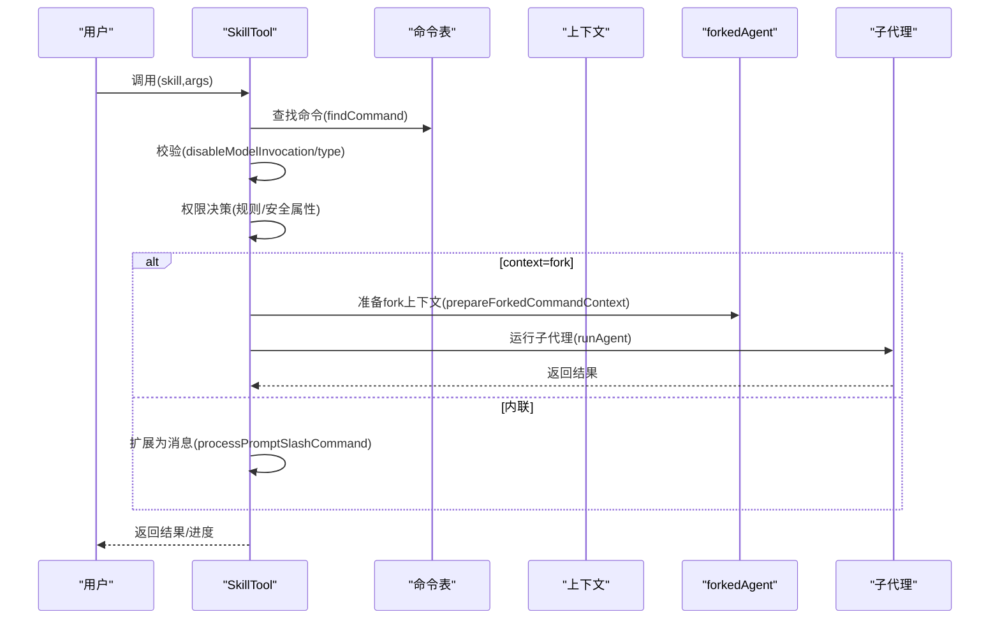
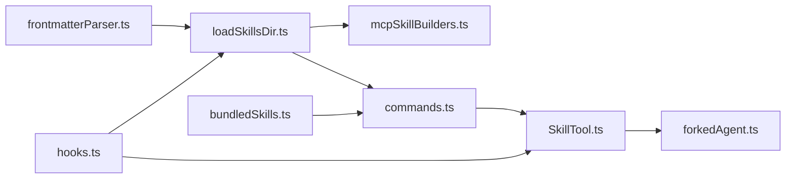

# 技能系统开发

<cite>
**本文引用的文件**
- [loadSkillsDir.ts](file://src/skills/loadSkillsDir.ts)
- [mcpSkillBuilders.ts](file://src/skills/mcpSkillBuilders.ts)
- [bundledSkills.ts](file://src/skills/bundledSkills.ts)
- [SkillTool.ts](file://src/tools/SkillTool/SkillTool.ts)
- [forkedAgent.ts](file://src/utils/forkedAgent.ts)
- [frontmatterParser.ts](file://src/utils/frontmatterParser.ts)
- [hooks.ts](file://src/utils/hooks.ts)
- [commands.ts](file://src/commands.ts)
- [README.md](file://README.md)
</cite>

## 目录
1. [引言](#引言)
2. [项目结构](#项目结构)
3. [核心组件](#核心组件)
4. [架构总览](#架构总览)
5. [详细组件分析](#详细组件分析)
6. [依赖关系分析](#依赖关系分析)
7. [性能考量](#性能考量)
8. [故障排查指南](#故障排查指南)
9. [结论](#结论)
10. [附录](#附录)

## 引言
本文件面向 Claude Code 技能系统（Skill System）的开发者与维护者，系统性阐述技能定义格式、加载机制、执行流程与生命周期管理；并提供技能开发指南、权限控制策略、扩展机制与测试验证方法。文档以仓库源码为依据，结合架构图与流程图，帮助读者在不深入源码细节的前提下快速掌握技能系统的全貌与最佳实践。

## 项目结构
技能系统主要由以下模块构成：
- 技能加载与发现：负责从用户目录、项目目录、策略目录与插件目录加载技能，并支持动态发现与条件激活。
- 技能构建器：统一生成技能命令对象与解析前端元数据。
- 内置技能注册：将打包进 CLI 的内置技能注册到命令表。
- 技能调用工具：封装技能执行、权限检查、上下文派生与结果返回。
- 前端元数据解析：标准化解析技能/命令的 frontmatter 字段。
- 生命周期与钩子：提供动态技能变更信号与配置变更钩子，便于缓存清理与审计。



**图表来源**
- [loadSkillsDir.ts:638-804](file://src/skills/loadSkillsDir.ts#L638-L804)
- [mcpSkillBuilders.ts:1-45](file://src/skills/mcpSkillBuilders.ts#L1-L45)
- [bundledSkills.ts:43-115](file://src/skills/bundledSkills.ts#L43-L115)
- [SkillTool.ts:1-120](file://src/tools/SkillTool/SkillTool.ts#L1-L120)
- [forkedAgent.ts:151-196](file://src/utils/forkedAgent.ts#L151-L196)
- [frontmatterParser.ts:130-161](file://src/utils/frontmatterParser.ts#L130-L161)
- [hooks.ts:4168-4210](file://src/utils/hooks.ts#L4168-L4210)
- [commands.ts:375-398](file://src/commands.ts#L375-L398)

**章节来源**
- [loadSkillsDir.ts:638-804](file://src/skills/loadSkillsDir.ts#L638-L804)
- [mcpSkillBuilders.ts:1-45](file://src/skills/mcpSkillBuilders.ts#L1-L45)
- [bundledSkills.ts:43-115](file://src/skills/bundledSkills.ts#L43-L115)
- [SkillTool.ts:1-120](file://src/tools/SkillTool/SkillTool.ts#L1-L120)
- [forkedAgent.ts:151-196](file://src/utils/forkedAgent.ts#L151-L196)
- [frontmatterParser.ts:130-161](file://src/utils/frontmatterParser.ts#L130-L161)
- [hooks.ts:4168-4210](file://src/utils/hooks.ts#L4168-L4210)
- [commands.ts:375-398](file://src/commands.ts#L375-L398)

## 核心组件
- 技能加载与发现（loadSkillsDir.ts）
  - 支持多来源目录：策略目录、用户目录、项目目录、附加目录与遗留 commands 目录。
  - 提供动态技能发现与条件技能激活（基于路径匹配）。
  - 统一去重与缓存管理，暴露变更信号用于缓存清理。
- 技能构建器（mcpSkillBuilders.ts）
  - 注册 createSkillCommand 与 parseSkillFrontmatterFields，供 MCP 技能发现使用。
- 内置技能注册（bundledSkills.ts）
  - 定义内置技能的最小接口，支持首次调用时抽取参考文件到磁盘，统一注入“基础目录”提示。
- 技能调用工具（SkillTool.ts）
  - 校验输入、权限决策、执行策略（内联或派生子代理）、进度反馈与结果输出。
- 前端元数据解析（frontmatterParser.ts）
  - 解析技能/命令的 frontmatter，支持路径过滤、shell 执行、钩子等字段。
- 生命周期与钩子（hooks.ts）
  - 提供配置变更钩子，支持企业级审计与策略强制执行。

**章节来源**
- [loadSkillsDir.ts:638-804](file://src/skills/loadSkillsDir.ts#L638-L804)
- [mcpSkillBuilders.ts:31-44](file://src/skills/mcpSkillBuilders.ts#L31-L44)
- [bundledSkills.ts:15-42](file://src/skills/bundledSkills.ts#L15-L42)
- [SkillTool.ts:354-430](file://src/tools/SkillTool/SkillTool.ts#L354-L430)
- [frontmatterParser.ts:130-161](file://src/utils/frontmatterParser.ts#L130-L161)
- [hooks.ts:4168-4210](file://src/utils/hooks.ts#L4168-L4210)

## 架构总览
技能系统围绕“加载—构建—注册—调用—执行—反馈”的闭环展开。下图展示了从磁盘到内存命令表，再到工具调用与子代理执行的关键节点。



**图表来源**
- [loadSkillsDir.ts:638-804](file://src/skills/loadSkillsDir.ts#L638-L804)
- [mcpSkillBuilders.ts:31-44](file://src/skills/mcpSkillBuilders.ts#L31-L44)
- [commands.ts:375-398](file://src/commands.ts#L375-L398)
- [SkillTool.ts:580-766](file://src/tools/SkillTool/SkillTool.ts#L580-L766)
- [forkedAgent.ts:191-289](file://src/utils/forkedAgent.ts#L191-L289)

## 详细组件分析

### 技能加载与发现（loadSkillsDir.ts）
- 多源目录加载
  - 策略目录（policySettings）、用户目录（userSettings）、项目目录（projectSettings）、附加目录（--add-dir）与遗留 commands 目录并行加载。
  - 使用缓存与去重（按真实路径）避免重复与符号链接问题。
- 动态发现与条件激活
  - 通过文件路径向上遍历发现 .claude/skills 目录，按深度排序优先级更高。
  - 条件技能（frontmatter paths）在匹配到目标文件时激活并加入动态技能集合。
- 构建与注册
  - 统一使用 createSkillCommand 生成命令对象，parseSkillFrontmatterFields 解析 frontmatter 字段。
  - 暴露 onDynamicSkillsLoaded 信号，供其他模块清理缓存。



**图表来源**
- [loadSkillsDir.ts:638-804](file://src/skills/loadSkillsDir.ts#L638-L804)
- [loadSkillsDir.ts:861-915](file://src/skills/loadSkillsDir.ts#L861-L915)
- [loadSkillsDir.ts:997-1058](file://src/skills/loadSkillsDir.ts#L997-L1058)

**章节来源**
- [loadSkillsDir.ts:638-804](file://src/skills/loadSkillsDir.ts#L638-L804)
- [loadSkillsDir.ts:861-915](file://src/skills/loadSkillsDir.ts#L861-L915)
- [loadSkillsDir.ts:997-1058](file://src/skills/loadSkillsDir.ts#L997-L1058)

### 技能构建器（mcpSkillBuilders.ts）
- 作用
  - 将 createSkillCommand 与 parseSkillFrontmatterFields 注册为全局可用，供 MCP 技能发现使用。
  - 采用“叶子模块”设计，避免循环依赖与打包问题。
- 访问控制
  - 未注册时访问会抛出明确错误，确保初始化顺序正确。



**图表来源**
- [mcpSkillBuilders.ts:26-44](file://src/skills/mcpSkillBuilders.ts#L26-L44)

**章节来源**
- [mcpSkillBuilders.ts:31-44](file://src/skills/mcpSkillBuilders.ts#L31-L44)

### 内置技能注册（bundledSkills.ts）
- 设计要点
  - 定义 BundledSkillDefinition 接口，支持首次调用时抽取参考文件到磁盘，并在提示前注入“基础目录”。
  - 对写入进行安全保护（权限、防符号链接穿越、一次性写入），失败不影响技能运行但会移除基础目录前缀。
- 注册与查询
  - registerBundledSkill 注册内置技能；getBundledSkills 返回副本防止外部修改。



**图表来源**
- [bundledSkills.ts:53-99](file://src/skills/bundledSkills.ts#L53-L99)
- [bundledSkills.ts:131-145](file://src/skills/bundledSkills.ts#L131-L145)
- [bundledSkills.ts:195-220](file://src/skills/bundledSkills.ts#L195-L220)

**章节来源**
- [bundledSkills.ts:15-42](file://src/skills/bundledSkills.ts#L15-L42)
- [bundledSkills.ts:53-99](file://src/skills/bundledSkills.ts#L53-L99)
- [bundledSkills.ts:131-145](file://src/skills/bundledSkills.ts#L131-L145)
- [bundledSkills.ts:195-220](file://src/skills/bundledSkills.ts#L195-L220)

### 技能调用工具（SkillTool.ts）
- 输入校验与权限
  - 校验技能名格式、存在性、类型与禁用标志；对允许/拒绝规则进行匹配，支持自动放行安全属性技能。
- 执行策略
  - 若命令声明 context=fork，则派生子代理执行；否则走内联流程，直接扩展为消息并返回。
- 结果与进度
  - 内联：返回新消息与上下文修饰；派生：返回子代理结果文本与代理ID。
  - 支持进度回调，将工具使用消息映射为技能进度。



**图表来源**
- [SkillTool.ts:354-430](file://src/tools/SkillTool/SkillTool.ts#L354-L430)
- [SkillTool.ts:580-766](file://src/tools/SkillTool/SkillTool.ts#L580-L766)
- [SkillTool.ts:122-289](file://src/tools/SkillTool/SkillTool.ts#L122-L289)
- [forkedAgent.ts:191-289](file://src/utils/forkedAgent.ts#L191-L289)

**章节来源**
- [SkillTool.ts:354-430](file://src/tools/SkillTool/SkillTool.ts#L354-L430)
- [SkillTool.ts:580-766](file://src/tools/SkillTool/SkillTool.ts#L580-L766)
- [SkillTool.ts:122-289](file://src/tools/SkillTool/SkillTool.ts#L122-L289)
- [forkedAgent.ts:191-289](file://src/utils/forkedAgent.ts#L191-L289)

### 前端元数据解析（frontmatterParser.ts）
- 能力
  - 解析 frontmatter，支持 paths（gitignore风格）、shell（bash/powershell）、钩子等字段。
  - 对包含特殊字符的值进行自动加引号处理，提升兼容性。
- 用途
  - 为技能加载与构建提供统一的数据源，确保 paths 与钩子等字段被正确识别与验证。

**章节来源**
- [frontmatterParser.ts:130-161](file://src/utils/frontmatterParser.ts#L130-L161)
- [frontmatterParser.ts:85-121](file://src/utils/frontmatterParser.ts#L85-L121)

### 生命周期与钩子（hooks.ts）
- 配置变更钩子
  - 当配置文件（含技能）发生变化时触发，支持审计日志与策略强制（策略类配置不可被钩子阻断）。
- 与技能系统的协作
  - 技能动态加载完成后发出信号，监听方可清理缓存，保证一致性。

**章节来源**
- [hooks.ts:4168-4210](file://src/utils/hooks.ts#L4168-L4210)
- [loadSkillsDir.ts:839-851](file://src/skills/loadSkillsDir.ts#L839-L851)

## 依赖关系分析
- 模块耦合
  - loadSkillsDir.ts 依赖 frontmatterParser.ts 与 fs 实现，向外暴露构建器注册与动态技能接口。
  - mcpSkillBuilders.ts 仅依赖 loadSkillsDir.ts 导出的构建函数，避免循环依赖。
  - SkillTool.ts 依赖 commands.ts 获取命令表，依赖 forkedAgent.ts 执行派生代理。
  - bundledSkills.ts 与 commands.ts 通过 getBundledSkills 与 getSkills 聚合。
- 外部依赖
  - ignore 库用于路径匹配；memoize 用于缓存；zod 用于输入/输出模式校验。



**图表来源**
- [loadSkillsDir.ts:638-804](file://src/skills/loadSkillsDir.ts#L638-L804)
- [mcpSkillBuilders.ts:1-45](file://src/skills/mcpSkillBuilders.ts#L1-L45)
- [bundledSkills.ts:106-115](file://src/skills/bundledSkills.ts#L106-L115)
- [SkillTool.ts:1-120](file://src/tools/SkillTool/SkillTool.ts#L1-L120)
- [forkedAgent.ts:151-196](file://src/utils/forkedAgent.ts#L151-L196)
- [hooks.ts:4168-4210](file://src/utils/hooks.ts#L4168-L4210)

**章节来源**
- [loadSkillsDir.ts:638-804](file://src/skills/loadSkillsDir.ts#L638-L804)
- [mcpSkillBuilders.ts:1-45](file://src/skills/mcpSkillBuilders.ts#L1-L45)
- [bundledSkills.ts:106-115](file://src/skills/bundledSkills.ts#L106-L115)
- [SkillTool.ts:1-120](file://src/tools/SkillTool/SkillTool.ts#L1-L120)
- [forkedAgent.ts:151-196](file://src/utils/forkedAgent.ts#L151-L196)
- [hooks.ts:4168-4210](file://src/utils/hooks.ts#L4168-L4210)

## 性能考量
- 缓存与去重
  - 使用 memoize 缓存目录扫描与 Markdown 加载；按 realpath 去重避免重复加载。
- 并行加载
  - 不同来源目录并行加载，缩短启动时间。
- 动态技能延迟
  - 条件技能仅在匹配时激活，减少常驻内存占用。
- 安全写入
  - 内置技能文件写入采用一次性打开与严格权限，避免竞态与越权。

[本节为通用指导，无需列出具体文件来源]

## 故障排查指南
- 技能未显示
  - 检查目录是否存在且未被 gitignore 屏蔽；确认 frontmatter 是否有效；查看去重日志。
- 条件技能未激活
  - 确认 paths 是否与当前文件匹配；检查相对路径与 cwd 边界。
- 权限被阻断
  - 检查 allow/deny 规则；确认是否命中安全属性自动放行；查看建议的规则添加。
- 执行异常
  - 查看子代理执行日志；核对 allowedTools 与模型覆盖；检查 shell 块执行环境。

**章节来源**
- [loadSkillsDir.ts:861-915](file://src/skills/loadSkillsDir.ts#L861-L915)
- [loadSkillsDir.ts:997-1058](file://src/skills/loadSkillsDir.ts#L997-L1058)
- [SkillTool.ts:432-578](file://src/tools/SkillTool/SkillTool.ts#L432-L578)

## 结论
Claude Code 技能系统通过“多源加载—统一构建—动态激活—权限控制—派生执行”的设计，在保证安全性的同时提供了强大的可扩展性。内置技能与动态技能并存，frontmatter 元数据驱动能力，配合钩子与信号实现可观测与可审计。遵循本文档的开发与测试实践，可高效构建高质量技能并稳定集成到生产环境中。

[本节为总结，无需列出具体文件来源]

## 附录

### 技能开发指南（实践步骤）
- 文件结构
  - 使用目录式结构：skill-name/SKILL.md；根目录为技能基础目录，可在提示中通过 Base 目录引用。
- 前端元数据
  - 必填：description；常用：allowed-tools、argument-hint、arguments、when_to_use、model、disable-model-invocation、user-invocable、hooks、context、agent、effort、shell、paths。
- 逻辑实现
  - 在 SKILL.md 中编写提示词，必要时使用 !`...` 或 ```! ... ``` 执行 shell 命令（注意安全边界）。
  - 使用 ${CLAUDE_SKILL_DIR} 与 ${CLAUDE_SESSION_ID} 替换变量。
- 配置管理
  - 使用 frontmatter 的 paths 控制条件激活；hooks 支持前后置钩子；context=fork 可启用子代理执行。

**章节来源**
- [loadSkillsDir.ts:344-399](file://src/skills/loadSkillsDir.ts#L344-L399)
- [frontmatterParser.ts:130-161](file://src/utils/frontmatterParser.ts#L130-L161)

### 技能分类与管理
- 内置技能（bundled）
  - 编译进 CLI，随应用分发；首次调用抽取参考文件；可通过 files 字段预置资源。
- 用户技能（skills）
  - 存放在用户配置目录 ~/.claude/skills 下；默认可被用户调用。
- 第三方技能（plugin/mcp）
  - 通过插件或 MCP 服务器提供；MCP 技能需经构建器注册后方可被 SkillTool 调用。

**章节来源**
- [bundledSkills.ts:15-42](file://src/skills/bundledSkills.ts#L15-L42)
- [loadSkillsDir.ts:638-804](file://src/skills/loadSkillsDir.ts#L638-L804)
- [mcpSkillBuilders.ts:31-44](file://src/skills/mcpSkillBuilders.ts#L31-L44)

### 权限控制与安全边界
- 规则匹配
  - 支持 exact 与 prefix（:*) 匹配；deny 优先于 allow；策略类配置不可被钩子阻断。
- 自动放行
  - 仅使用安全属性的技能自动放行，新属性默认需要权限。
- 执行边界
  - MCP 技能内容不执行内联 shell 命令；内置/用户技能在非 mcp 来源时才执行内联 shell。

**章节来源**
- [SkillTool.ts:432-578](file://src/tools/SkillTool/SkillTool.ts#L432-L578)
- [loadSkillsDir.ts:371-396](file://src/skills/loadSkillsDir.ts#L371-L396)

### 生命周期管理
- 注册
  - 内置技能：registerBundledSkill；动态技能：addSkillDirectories；MCP 技能：通过构建器注册。
- 激活
  - 启动时加载；动态发现按深度优先；条件技能在文件操作时激活。
- 停用/卸载
  - 清理动态状态（clearDynamicSkills）；条件技能计数（getConditionalSkillCount）。
- 通知
  - onDynamicSkillsLoaded 用于缓存清理与一致性维护。

**章节来源**
- [bundledSkills.ts:113-115](file://src/skills/bundledSkills.ts#L113-L115)
- [loadSkillsDir.ts:923-975](file://src/skills/loadSkillsDir.ts#L923-L975)
- [loadSkillsDir.ts:997-1058](file://src/skills/loadSkillsDir.ts#L997-L1058)
- [loadSkillsDir.ts:839-851](file://src/skills/loadSkillsDir.ts#L839-L851)

### 最佳实践
- 代码组织
  - 将技能按功能域拆分为独立目录；使用 frontmatter 明确 allowed-tools 与 effort。
- 错误处理
  - 在 frontmatter 中提供清晰的 when_to_use 与 argument-hint；对 shell 命令做好失败回退。
- 性能优化
  - 使用 paths 限制激活范围；避免在 SKILL.md 中放置过大的静态资源；必要时使用 bundled 的 files 字段。

[本节为通用指导，无需列出具体文件来源]

### 测试与验证
- 单元测试
  - 验证 frontmatter 解析（paths、hooks、shell）；验证去重与缓存命中。
- 集成测试
  - 模拟动态发现与条件激活；验证权限规则与自动放行行为。
- 场景测试
  - 覆盖内联与 fork 执行路径；验证子代理消息流与进度回调。

[本节为通用指导，无需列出具体文件来源]

### 示例：不同类型的技能实现
- 命令技能（内联）
  - 在 frontmatter 中声明 allowed-tools 与 model；在 SKILL.md 中编写提示词；通过 SkillTool 调用。
- 工具技能（fork）
  - 设置 context=fork；在 getPromptForCommand 中注入基础目录；通过 prepareForkedCommandContext 与 runAgent 执行。
- 复合技能（条件）
  - 使用 paths 指定匹配规则；在文件操作时自动激活；结合 hooks 做前置/后置处理。

**章节来源**
- [SkillTool.ts:622-632](file://src/tools/SkillTool/SkillTool.ts#L622-L632)
- [forkedAgent.ts:191-289](file://src/utils/forkedAgent.ts#L191-L289)
- [loadSkillsDir.ts:997-1058](file://src/skills/loadSkillsDir.ts#L997-L1058)

### 扩展机制
- 技能钩子
  - 通过 hooks 字段声明；在配置变更时触发钩子，支持审计与策略强制。
- 事件处理
  - onDynamicSkillsLoaded 用于动态技能变更后的缓存清理与一致性维护。
- 插件集成
  - 通过 MCP 技能构建器注册；MCP 技能仅在 loadedFrom==='mcp' 时可见。

**章节来源**
- [hooks.ts:4168-4210](file://src/utils/hooks.ts#L4168-L4210)
- [loadSkillsDir.ts:839-851](file://src/skills/loadSkillsDir.ts#L839-L851)
- [mcpSkillBuilders.ts:31-44](file://src/skills/mcpSkillBuilders.ts#L31-L44)