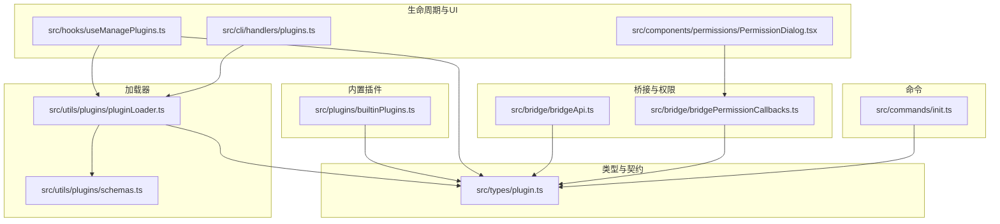
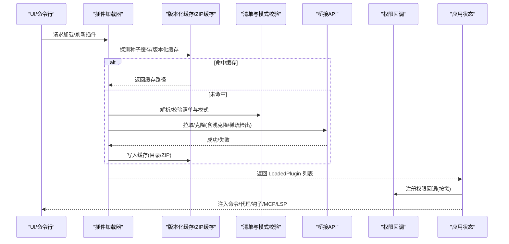
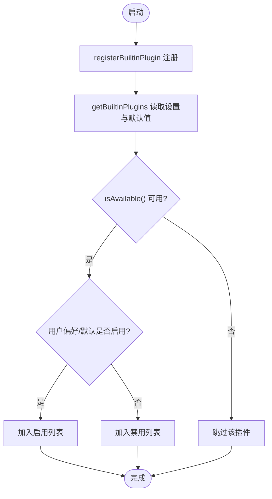
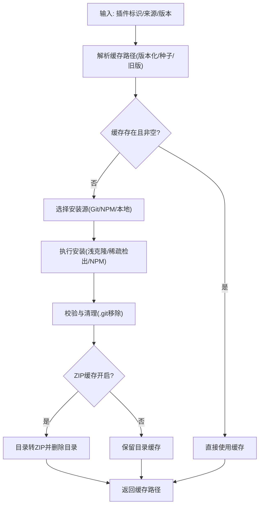
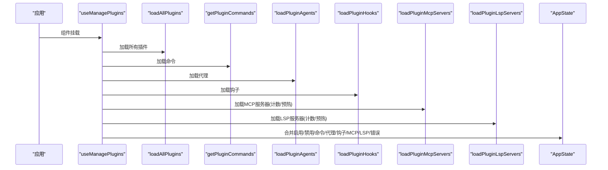
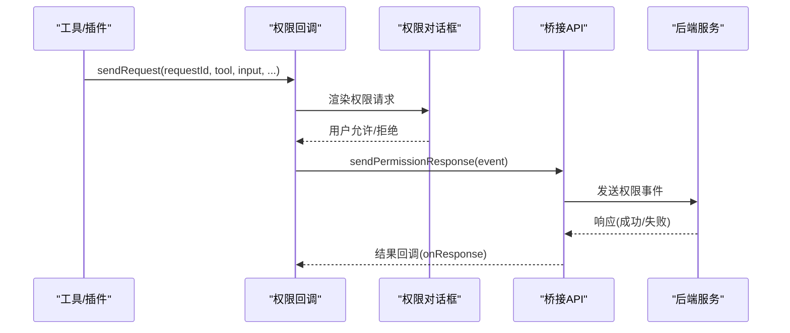
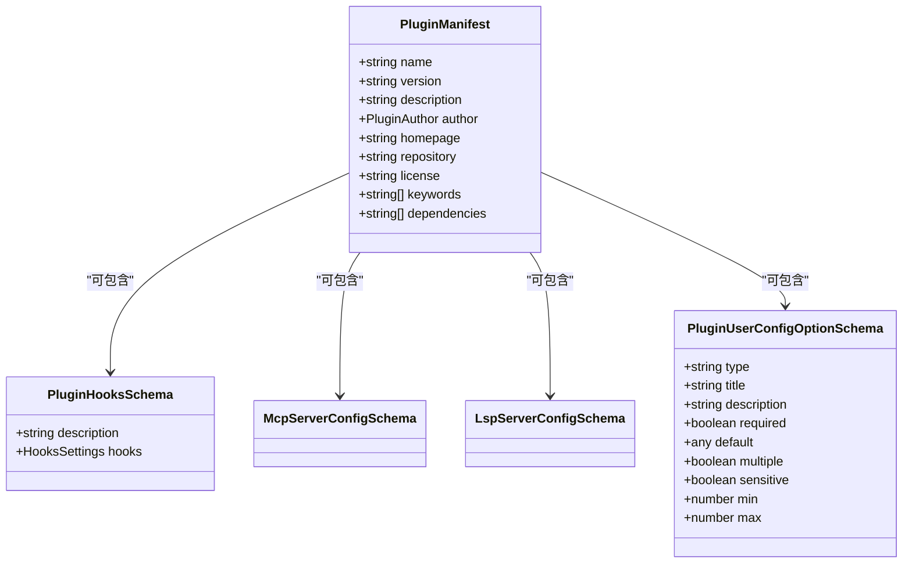
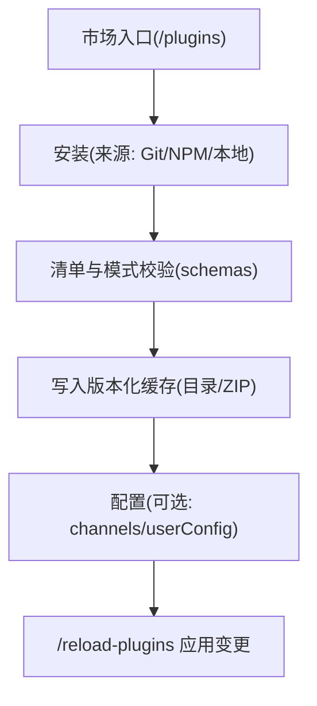
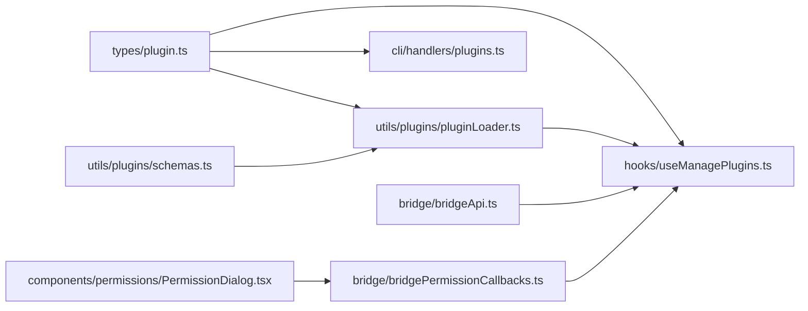

# 插件开发

<cite>
**本文引用的文件**
- [builtinPlugins.ts](file://src/plugins/builtinPlugins.ts)
- [plugin.ts](file://src/types/plugin.ts)
- [bridgeApi.ts](file://src/bridge/bridgeApi.ts)
- [bridgePermissionCallbacks.ts](file://src/bridge/bridgePermissionCallbacks.ts)
- [schemas.ts](file://src/utils/plugins/schemas.ts)
- [pluginLoader.ts](file://src/utils/plugins/pluginLoader.ts)
- [useManagePlugins.ts](file://src/hooks/useManagePlugins.ts)
- [plugins.ts](file://src/cli/handlers/plugins.ts)
- [PermissionDialog.tsx](file://src/components/permissions/PermissionDialog.tsx)
- [init.ts](file://src/commands/init.ts)
</cite>

## 目录
1. [简介](#简介)
2. [项目结构](#项目结构)
3. [核心组件](#核心组件)
4. [架构总览](#架构总览)
5. [详细组件分析](#详细组件分析)
6. [依赖关系分析](#依赖关系分析)
7. [性能考量](#性能考量)
8. [故障排查指南](#故障排查指南)
9. [结论](#结论)
10. [附录](#附录)

## 简介
本技术文档面向 Claude Code 插件开发者，系统阐述插件体系的架构设计、生命周期管理、依赖解析、加载与缓存策略、权限系统、UI 集成、打包与分发流程，并提供最佳实践与常见问题排查方法。文档以仓库现有实现为依据，结合类型定义、加载器、权限桥接与 UI 组件，帮助你从零到一构建工具插件、命令插件与 UI 插件。

## 项目结构
围绕插件系统的关键目录与文件：
- 类型与契约：src/types/plugin.ts 定义 LoadedPlugin、PluginError、插件清单与组件类型等核心类型。
- 内置插件注册：src/plugins/builtinPlugins.ts 提供内置插件注册表与启用/禁用逻辑。
- 插件加载器：src/utils/plugins/pluginLoader.ts 负责从市场或本地源发现、拉取、校验、缓存与装配插件。
- 权限与桥接：src/bridge/bridgeApi.ts 与 src/bridge/bridgePermissionCallbacks.ts 提供远端桥接调用与权限请求回调。
- 插件清单与模式：src/utils/plugins/schemas.ts 定义插件清单、钩子、MCP/LSP、用户配置等模式。
- 生命周期与 UI 集成：src/hooks/useManagePlugins.ts 在应用启动时加载插件并注入命令、代理、钩子、MCP/LSP；CLI 命令 src/cli/handlers/plugins.ts 提供 /plugins 列表与可用插件查询。
- 权限对话框：src/components/permissions/PermissionDialog.tsx 用于展示权限请求与结果。
- 初始化命令：src/commands/init.ts 展示了如何在初始化流程中引导技能与钩子的生成。

**图表来源**
- [plugin.ts:48-70](file://src/types/plugin.ts#L48-L70)
- [builtinPlugins.ts:21-102](file://src/plugins/builtinPlugins.ts#L21-L102)
- [pluginLoader.ts:1-120](file://src/utils/plugins/pluginLoader.ts#L1-L120)
- [schemas.ts:274-320](file://src/utils/plugins/schemas.ts#L274-L320)
- [useManagePlugins.ts:51-180](file://src/hooks/useManagePlugins.ts#L51-L180)
- [plugins.ts:198-305](file://src/cli/handlers/plugins.ts#L198-L305)
- [bridgeApi.ts:68-140](file://src/bridge/bridgeApi.ts#L68-L140)
- [bridgePermissionCallbacks.ts:10-27](file://src/bridge/bridgePermissionCallbacks.ts#L10-L27)
- [PermissionDialog.tsx:17-71](file://src/components/permissions/PermissionDialog.tsx#L17-L71)
- [init.ts:226-257](file://src/commands/init.ts#L226-L257)

**章节来源**
- [plugin.ts:48-70](file://src/types/plugin.ts#L48-L70)
- [builtinPlugins.ts:21-102](file://src/plugins/builtinPlugins.ts#L21-L102)
- [pluginLoader.ts:1-120](file://src/utils/plugins/pluginLoader.ts#L1-L120)
- [schemas.ts:274-320](file://src/utils/plugins/schemas.ts#L274-L320)
- [useManagePlugins.ts:51-180](file://src/hooks/useManagePlugins.ts#L51-L180)
- [plugins.ts:198-305](file://src/cli/handlers/plugins.ts#L198-L305)
- [bridgeApi.ts:68-140](file://src/bridge/bridgeApi.ts#L68-L140)
- [bridgePermissionCallbacks.ts:10-27](file://src/bridge/bridgePermissionCallbacks.ts#L10-L27)
- [PermissionDialog.tsx:17-71](file://src/components/permissions/PermissionDialog.tsx#L17-L71)
- [init.ts:226-257](file://src/commands/init.ts#L226-L257)

## 核心组件
- 插件类型与错误模型：LoadedPlugin 描述已加载插件的元数据与能力（命令、代理、钩子、MCP/LSP 等）；PluginError 提供结构化错误类型，便于 UI 与诊断。
- 内置插件注册表：registerBuiltinPlugin 注册内置插件；getBuiltinPlugins 按用户设置与默认值返回启用/禁用列表。
- 加载器：支持从市场、Git/GitHub 子目录、NPM 包、本地路径等多种来源安装与缓存；提供版本化缓存、ZIP 缓存、种子缓存命中、浅克隆与稀疏检出等优化。
- 生命周期钩子：useManagePlugins 在应用启动时一次性加载插件，同步命令、代理、钩子、MCP/LSP，并记录错误；后续通过 /reload-plugins 触发刷新。
- 权限桥接：bridgeApi 提供带重试与致命错误处理的桥接 API；bridgePermissionCallbacks 定义权限请求/响应回调协议。
- 清单与模式：schemas.ts 定义插件清单、钩子、命令元数据、MCP/LSP、用户配置等模式，确保插件内容可验证、可复现。

**章节来源**
- [plugin.ts:48-70](file://src/types/plugin.ts#L48-L70)
- [plugin.ts:101-289](file://src/types/plugin.ts#L101-L289)
- [builtinPlugins.ts:28-102](file://src/plugins/builtinPlugins.ts#L28-L102)
- [pluginLoader.ts:123-287](file://src/utils/plugins/pluginLoader.ts#L123-L287)
- [pluginLoader.ts:365-465](file://src/utils/plugins/pluginLoader.ts#L365-L465)
- [pluginLoader.ts:534-640](file://src/utils/plugins/pluginLoader.ts#L534-L640)
- [useManagePlugins.ts:51-180](file://src/hooks/useManagePlugins.ts#L51-L180)
- [bridgeApi.ts:68-140](file://src/bridge/bridgeApi.ts#L68-L140)
- [bridgePermissionCallbacks.ts:10-27](file://src/bridge/bridgePermissionCallbacks.ts#L10-L27)
- [schemas.ts:274-320](file://src/utils/plugins/schemas.ts#L274-L320)

## 架构总览
下图展示了插件从“发现/安装”到“装配与运行”的整体流程，以及与桥接、权限、UI 的交互。

**图表来源**
- [pluginLoader.ts:123-287](file://src/utils/plugins/pluginLoader.ts#L123-L287)
- [pluginLoader.ts:365-465](file://src/utils/plugins/pluginLoader.ts#L365-L465)
- [pluginLoader.ts:534-640](file://src/utils/plugins/pluginLoader.ts#L534-L640)
- [schemas.ts:274-320](file://src/utils/plugins/schemas.ts#L274-L320)
- [bridgeApi.ts:141-197](file://src/bridge/bridgeApi.ts#L141-L197)
- [useManagePlugins.ts:51-180](file://src/hooks/useManagePlugins.ts#L51-L180)

## 详细组件分析

### 组件A：内置插件注册与启用/禁用
- 注册机制：registerBuiltinPlugin 将插件定义写入内存映射；getBuiltinPlugins 读取用户设置与默认值，生成 LoadedPlugin 并区分启用/禁用。
- 元数据与能力：每个内置插件可提供 skills、hooks、mcpServers 等；skills 会转换为命令对象注入 UI。
- 可用性过滤：isAvailable 可根据系统能力隐藏插件。

**图表来源**
- [builtinPlugins.ts:28-102](file://src/plugins/builtinPlugins.ts#L28-L102)

**章节来源**
- [builtinPlugins.ts:28-102](file://src/plugins/builtinPlugins.ts#L28-L102)

### 组件B：插件加载器与缓存策略
- 多源安装：支持 Git/GitHub、Git 子目录、NPM 包、本地路径；对子目录使用稀疏检出与浅克隆，显著降低网络与存储开销。
- 版本化缓存：按 marketplace/name/version 生成缓存路径；支持 ZIP 缓存与种子缓存命中；兼容旧版非版本化缓存。
- 错误与回退：安装失败时抛出结构化错误；缓存为空则回退到拷贝；种子缓存命中直接返回只读路径。
- 性能优化：浅克隆、稀疏检出、ZIP 缓存、种子缓存、memoize 使用等。

**图表来源**
- [pluginLoader.ts:123-287](file://src/utils/plugins/pluginLoader.ts#L123-L287)
- [pluginLoader.ts:365-465](file://src/utils/plugins/pluginLoader.ts#L365-L465)
- [pluginLoader.ts:534-640](file://src/utils/plugins/pluginLoader.ts#L534-L640)

**章节来源**
- [pluginLoader.ts:123-287](file://src/utils/plugins/pluginLoader.ts#L123-L287)
- [pluginLoader.ts:365-465](file://src/utils/plugins/pluginLoader.ts#L365-L465)
- [pluginLoader.ts:534-640](file://src/utils/plugins/pluginLoader.ts#L534-L640)

### 组件C：生命周期与 UI 集成
- 启动阶段一次性加载：useManagePlugins 在应用启动时调用 loadAllPlugins，随后分别加载命令、代理、钩子、MCP/LSP，并更新 AppState.plugins。
- 错误聚合：将各组件加载错误合并到 AppState.plugins.errors，避免重复；保留 LSP 与插件相关错误。
- 刷新机制：通过 needsRefresh 触发通知，统一由 /reload-plugins 执行 refreshActivePlugins，保证命令、代理、钩子、MCP 的一致性切换。
- CLI 支持：/plugins 列表输出插件状态、MCP 服务器、错误信息；支持 --available 查询市场可用插件。

**图表来源**
- [useManagePlugins.ts:51-180](file://src/hooks/useManagePlugins.ts#L51-L180)
- [plugins.ts:198-305](file://src/cli/handlers/plugins.ts#L198-L305)

**章节来源**
- [useManagePlugins.ts:51-180](file://src/hooks/useManagePlugins.ts#L51-L180)
- [plugins.ts:198-305](file://src/cli/handlers/plugins.ts#L198-L305)

### 组件D：权限系统与安全沙箱
- 权限请求：bridgePermissionCallbacks 定义 sendRequest/sendResponse/cancelRequest/onResponse 回调；UI 通过 PermissionDialog 展示权限请求与结果。
- 桥接 API：bridgeApi 提供带认证重试与致命错误处理的桥接调用（如注册环境、轮询工作、心跳、停止工作等），并进行 401/403/404/410 等错误分类。
- 安全约束：桥接层支持可信设备令牌头、安全等级、策略限制与抑制性 403（仅提示不阻断核心功能）。

**图表来源**
- [bridgePermissionCallbacks.ts:10-27](file://src/bridge/bridgePermissionCallbacks.ts#L10-L27)
- [PermissionDialog.tsx:17-71](file://src/components/permissions/PermissionDialog.tsx#L17-L71)
- [bridgeApi.ts:419-450](file://src/bridge/bridgeApi.ts#L419-L450)

**章节来源**
- [bridgePermissionCallbacks.ts:10-27](file://src/bridge/bridgePermissionCallbacks.ts#L10-L27)
- [PermissionDialog.tsx:17-71](file://src/components/permissions/PermissionDialog.tsx#L17-L71)
- [bridgeApi.ts:419-450](file://src/bridge/bridgeApi.ts#L419-L450)

### 组件E：插件清单与模式校验
- 清单字段：name、version、description、author、homepage、repository、license、keywords、dependencies 等。
- 钩子与命令：支持 hooks.json 与对象映射格式；命令可指定 source 或 content，支持参数提示与默认模型。
- MCP/LSP：MCP 服务器可来自内联配置、外部 .mcp.json、MCPB 文件（含本地路径或 URL）、或 MCPB 下载；LSP 服务器配置严格校验命令、扩展映射、传输方式等。
- 用户配置：支持 userConfig 与通道 channels，提供标题、描述、敏感字段、默认值等，统一注入到 MCP/LSP 环境变量与钩子命令。

**图表来源**
- [schemas.ts:274-320](file://src/utils/plugins/schemas.ts#L274-L320)
- [schemas.ts:328-340](file://src/utils/plugins/schemas.ts#L328-L340)
- [schemas.ts:429-452](file://src/utils/plugins/schemas.ts#L429-L452)
- [schemas.ts:543-572](file://src/utils/plugins/schemas.ts#L543-L572)
- [schemas.ts:708-788](file://src/utils/plugins/schemas.ts#L708-L788)
- [schemas.ts:587-621](file://src/utils/plugins/schemas.ts#L587-L621)

**章节来源**
- [schemas.ts:274-320](file://src/utils/plugins/schemas.ts#L274-L320)
- [schemas.ts:429-452](file://src/utils/plugins/schemas.ts#L429-L452)
- [schemas.ts:543-572](file://src/utils/plugins/schemas.ts#L543-L572)
- [schemas.ts:708-788](file://src/utils/plugins/schemas.ts#L708-L788)
- [schemas.ts:587-621](file://src/utils/plugins/schemas.ts#L587-L621)

### 组件F：打包、分发与安装流程
- 清单与模式：遵循 schemas.ts 中的插件清单与组件模式，确保可被加载器与市场识别。
- 安装来源：支持 Git/GitHub、Git 子目录、NPM 包、本地路径；CLI /plugins 可列出已安装与可用插件。
- 分发与市场：内置 marketplace 名称保留与来源校验逻辑，防止第三方冒用官方名称；支持自动更新策略与黑名单策略。
- 安装与配置：安装后可进入插件选项配置（channels/userConfig），随后通过 /reload-plugins 应用变更。

**图表来源**
- [plugins.ts:198-305](file://src/cli/handlers/plugins.ts#L198-L305)
- [schemas.ts:274-320](file://src/utils/plugins/schemas.ts#L274-L320)
- [pluginLoader.ts:365-465](file://src/utils/plugins/pluginLoader.ts#L365-L465)

**章节来源**
- [plugins.ts:198-305](file://src/cli/handlers/plugins.ts#L198-L305)
- [schemas.ts:274-320](file://src/utils/plugins/schemas.ts#L274-L320)
- [pluginLoader.ts:365-465](file://src/utils/plugins/pluginLoader.ts#L365-L465)

## 依赖关系分析
- 类型耦合：LoadedPlugin、PluginError、PluginComponent 等类型贯穿加载器、生命周期钩子与 CLI 输出。
- 组件内聚：加载器内部职责清晰（发现/安装/缓存/校验），对外暴露统一接口；生命周期钩子负责装配与状态同步。
- 外部依赖：桥接 API 依赖认证与网络；权限回调依赖 UI 对话框；清单与模式依赖 Zod 校验。
- 循环依赖：当前模块划分避免了循环依赖风险；如需扩展，建议保持“类型定义 → 校验 → 加载 → 装配”的单向依赖。

**图表来源**
- [plugin.ts:48-70](file://src/types/plugin.ts#L48-L70)
- [pluginLoader.ts:1-120](file://src/utils/plugins/pluginLoader.ts#L1-L120)
- [useManagePlugins.ts:51-180](file://src/hooks/useManagePlugins.ts#L51-L180)
- [plugins.ts:198-305](file://src/cli/handlers/plugins.ts#L198-L305)
- [schemas.ts:274-320](file://src/utils/plugins/schemas.ts#L274-L320)
- [bridgeApi.ts:68-140](file://src/bridge/bridgeApi.ts#L68-L140)
- [bridgePermissionCallbacks.ts:10-27](file://src/bridge/bridgePermissionCallbacks.ts#L10-L27)
- [PermissionDialog.tsx:17-71](file://src/components/permissions/PermissionDialog.tsx#L17-L71)

**章节来源**
- [plugin.ts:48-70](file://src/types/plugin.ts#L48-L70)
- [pluginLoader.ts:1-120](file://src/utils/plugins/pluginLoader.ts#L1-L120)
- [useManagePlugins.ts:51-180](file://src/hooks/useManagePlugins.ts#L51-L180)
- [plugins.ts:198-305](file://src/cli/handlers/plugins.ts#L198-L305)
- [schemas.ts:274-320](file://src/utils/plugins/schemas.ts#L274-L320)
- [bridgeApi.ts:68-140](file://src/bridge/bridgeApi.ts#L68-L140)
- [bridgePermissionCallbacks.ts:10-27](file://src/bridge/bridgePermissionCallbacks.ts#L10-L27)
- [PermissionDialog.tsx:17-71](file://src/components/permissions/PermissionDialog.tsx#L17-L71)

## 性能考量
- 缓存优先：版本化缓存与 ZIP 缓存显著减少重复安装时间；种子缓存命中可直接使用只读缓存。
- 网络优化：Git 浅克隆与稀疏检出大幅降低下载体积；对特定提交 SHA 的获取采用分步回退策略。
- 并发与去重：生命周期钩子在初始加载阶段并发加载命令/代理/钩子/MCP/LSP，并在 UI 层合并错误，避免重复渲染。
- 资源释放：LSP 管理器在刷新时重新初始化，确保资源正确回收与重建。

[本节为通用指导，无需具体文件分析]

## 故障排查指南
- 结构化错误：使用 PluginError 类型与 getPluginErrorMessage 获取可读错误消息，定位路径、网络、清单解析、MCP/LSP 配置等问题。
- 缓存缺失：当出现“缓存未命中”类错误时，执行 /plugins 刷新缓存；确认版本化缓存路径与 ZIP 缓存开关。
- 权限问题：若出现 401/403/404/410，检查认证令牌与可信设备令牌头；必要时触发 OAuth 刷新或重新登录。
- 市场策略：若插件被阻止，检查企业策略与黑名单；确认 marketplace 名称合法性与来源校验。

**章节来源**
- [plugin.ts:295-363](file://src/types/plugin.ts#L295-L363)
- [pluginLoader.ts:123-287](file://src/utils/plugins/pluginLoader.ts#L123-L287)
- [bridgeApi.ts:454-500](file://src/bridge/bridgeApi.ts#L454-L500)

## 结论
本插件体系以类型安全为核心，通过严格的清单与模式校验、多源安装与版本化缓存、统一的生命周期与 UI 集成、以及完善的权限与桥接机制，实现了可扩展、可观测、可维护的插件生态。开发者可基于内置插件注册表、加载器与权限桥接快速构建工具、命令与 UI 插件，并通过 CLI 与 UI 完成安装、配置与刷新。

[本节为总结，无需具体文件分析]

## 附录

### 开发指南：不同插件类型的实现要点
- 工具插件（Tool）：在插件目录下提供工具实现，配合 hooks 与 MCP/LSP 服务；通过 userConfig 与 channels 提升可配置性。
- 命令插件（Command）：在 commands/ 目录编写技能/命令文件，或通过清单中的 commands 字段声明；使用 CommandMetadata 自定义描述与参数提示。
- UI 插件（UI 组件）：在 UI 层注册组件并通过 AppState 同步状态；权限请求通过 PermissionDialog 展示，回调由 bridgePermissionCallbacks 管理。

**章节来源**
- [schemas.ts:429-452](file://src/utils/plugins/schemas.ts#L429-L452)
- [schemas.ts:543-572](file://src/utils/plugins/schemas.ts#L543-L572)
- [PermissionDialog.tsx:17-71](file://src/components/permissions/PermissionDialog.tsx#L17-L71)
- [bridgePermissionCallbacks.ts:10-27](file://src/bridge/bridgePermissionCallbacks.ts#L10-L27)

### 最佳实践
- 清单先行：先完善 plugin.json 与 hooks.json，再实现功能，确保可验证与可复现。
- 缓存友好：优先使用版本化缓存与 ZIP 缓存；避免在插件中写入临时文件，减少缓存污染。
- 并发安全：在生命周期钩子中并发加载组件，但注意错误聚合与去重。
- 权限最小化：仅在必要时请求权限；通过 PermissionDialog 明确告知用户权限用途。
- 性能监控：利用 CLI /plugins 输出的错误与统计信息，持续优化加载与运行时性能。

[本节为通用指导，无需具体文件分析]