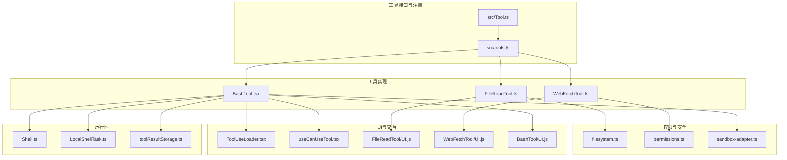
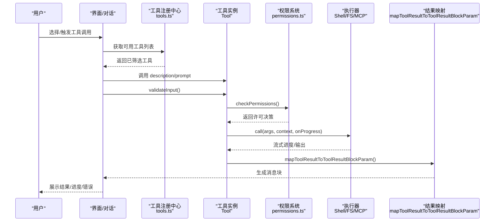
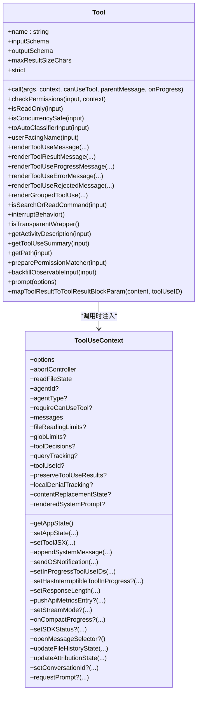
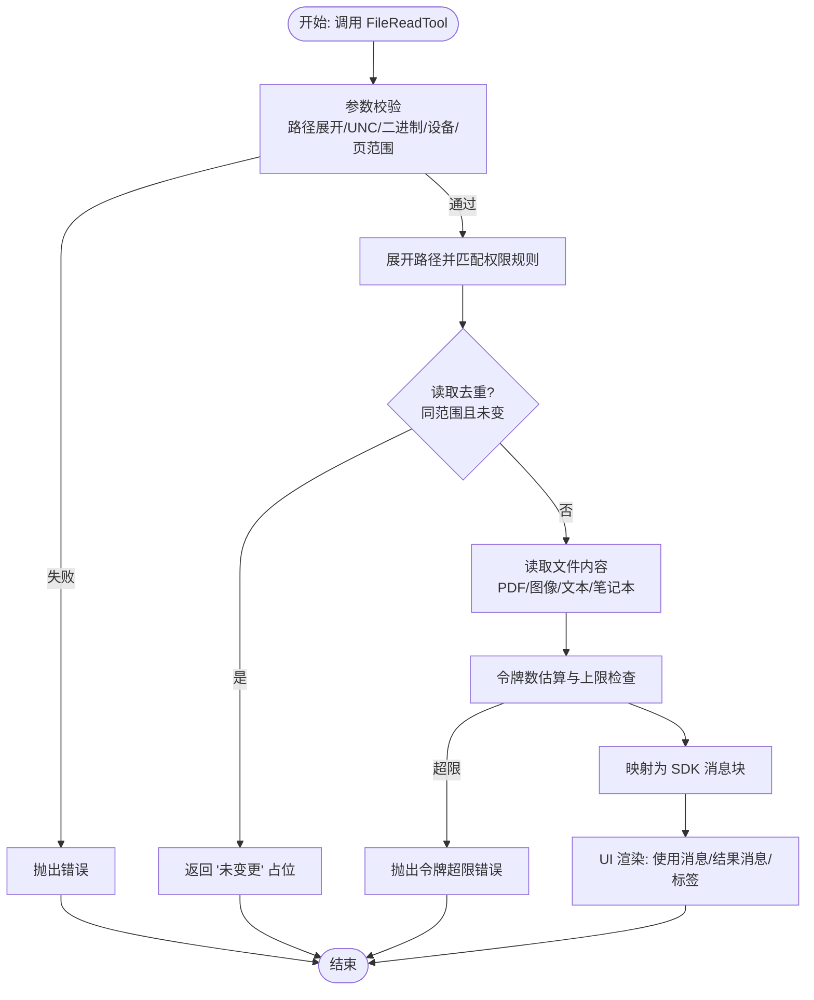
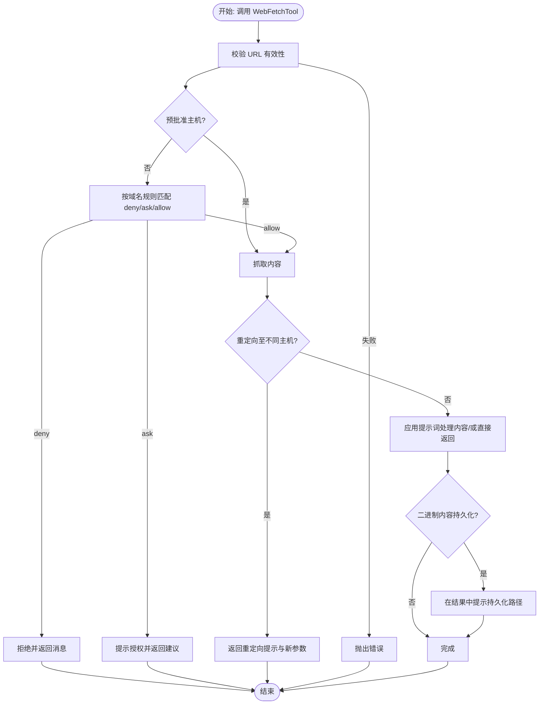
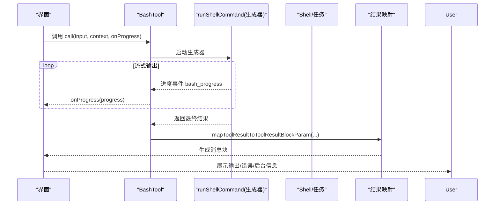
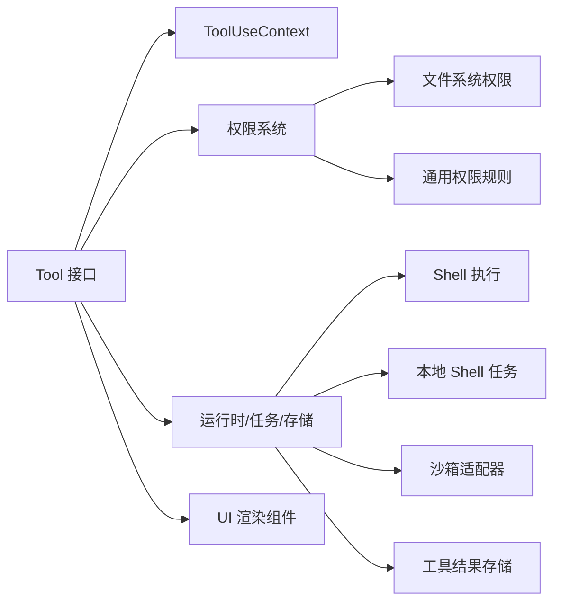

# 自定义工具开发

<cite>
**本文引用的文件**
- [src/Tool.ts](file://src/Tool.ts)
- [src/tools.ts](file://src/tools.ts)
- [src/tools/FileReadTool/FileReadTool.ts](file://src/tools/FileReadTool/FileReadTool.ts)
- [src/tools/WebFetchTool/WebFetchTool.ts](file://src/tools/WebFetchTool/WebFetchTool.ts)
- [src/tools/BashTool/BashTool.tsx](file://src/tools/BashTool/BashTool.tsx)
- [src/components/ToolUseLoader.tsx](file://src/components/ToolUseLoader.tsx)
- [src/hooks/useCanUseTool.tsx](file://src/hooks/useCanUseTool.tsx)
- [src/utils/permissions/filesystem.ts](file://src/utils/permissions/filesystem.ts)
- [src/utils/permissions/permissions.ts](file://src/utils/permissions/permissions.ts)
- [src/services/mcp/types.ts](file://src/services/mcp/types.ts)
- [src/types/tools.ts](file://src/types/tools.ts)
- [src/types/permissions.ts](file://src/types/permissions.ts)
- [src/constants/toolLimits.ts](file://src/constants/toolLimits.ts)
- [src/utils/toolResultStorage.ts](file://src/utils/toolResultStorage.ts)
- [src/utils/sandbox/sandbox-adapter.ts](file://src/utils/sandbox/sandbox-adapter.ts)
- [src/utils/Shell.ts](file://src/utils/Shell.ts)
- [src/tasks/LocalShellTask/LocalShellTask.ts](file://src/tasks/LocalShellTask/LocalShellTask.ts)
- [src/utils/bash/ast.js](file://src/utils/bash/ast.js)
- [src/utils/bash/commands.js](file://src/utils/bash/commands.js)
- [src/utils/bash/commandSemantics.js](file://src/utils/bash/commandSemantics.js)
- [src/utils/bash/shouldUseSandbox.js](file://src/utils/bash/shouldUseSandbox.js)
- [src/utils/bash/toolName.js](file://src/utils/bash/toolName.js)
- [src/utils/bash/prompt.js](file://src/utils/bash/prompt.js)
- [src/utils/bash/readOnlyValidation.js](file://src/utils/bash/readOnlyValidation.js)
- [src/utils/bash/sedEditParser.js](file://src/utils/bash/sedEditParser.js)
- [src/utils/bash/utils.js](file://src/utils/bash/utils.js)
- [src/tools/BashTool/UI.js](file://src/tools/BashTool/UI.js)
- [src/tools/FileReadTool/UI.js](file://src/tools/FileReadTool/UI.js)
- [src/tools/WebFetchTool/UI.js](file://src/tools/WebFetchTool/UI.js)
</cite>

## 目录
1. [引言](#引言)
2. [项目结构](#项目结构)
3. [核心组件](#核心组件)
4. [架构总览](#架构总览)
5. [详细组件分析](#详细组件分析)
6. [依赖关系分析](#依赖关系分析)
7. [性能考量](#性能考量)
8. [故障排查指南](#故障排查指南)
9. [结论](#结论)
10. [附录](#附录)

## 引言
本技术文档面向希望在 Claude Code 中开发“自定义工具”的工程师与高级用户，系统性阐述工具接口设计、实现原理、生命周期管理、权限体系、UI 集成、异步处理与流式输出、最佳实践以及测试策略。文档以仓库中的真实代码为依据，结合具体工具（文件读取、网页抓取、系统命令）的实现细节，帮助读者快速上手并高质量交付工具。

## 项目结构
- 工具接口与基类：位于 src/Tool.ts，定义了 Tool 类型、工具上下文、权限上下文、进度类型、结果映射等核心契约。
- 工具注册与装配：位于 src/tools.ts，负责内置工具的收集、过滤、去重与合并（含 MCP 工具），并提供按权限上下文筛选工具的能力。
- 典型工具实现：
  - 文件读取工具：src/tools/FileReadTool/FileReadTool.ts
  - 网页抓取工具：src/tools/WebFetchTool/WebFetchTool.ts
  - 系统命令工具：src/tools/BashTool/BashTool.tsx
- 权限与安全：
  - 文件系统权限：src/utils/permissions/filesystem.ts
  - 通用权限规则：src/utils/permissions/permissions.ts
  - 沙箱适配器：src/utils/sandbox/sandbox-adapter.ts
- UI 组件与交互：
  - 工具加载指示器：src/components/ToolUseLoader.tsx
  - 工具调用入口钩子：src/hooks/useCanUseTool.tsx
  - 各工具 UI 渲染：src/tools/*/UI.js
- 运行时与任务：
  - Shell 执行与任务：src/utils/Shell.ts、src/tasks/LocalShellTask/LocalShellTask.ts
  - 工具结果持久化：src/utils/toolResultStorage.ts
- 类型与常量：
  - 工具类型：src/types/tools.ts
  - 权限类型：src/types/permissions.ts
  - 工具限制：src/constants/toolLimits.ts

图表来源
- [src/Tool.ts:1-793](file://src/Tool.ts#L1-L793)
- [src/tools.ts:1-390](file://src/tools.ts#L1-L390)
- [src/tools/FileReadTool/FileReadTool.ts:1-800](file://src/tools/FileReadTool/FileReadTool.ts#L1-L800)
- [src/tools/WebFetchTool/WebFetchTool.ts:1-319](file://src/tools/WebFetchTool/WebFetchTool.ts#L1-L319)
- [src/tools/BashTool/BashTool.tsx:1-800](file://src/tools/BashTool/BashTool.tsx#L1-L800)
- [src/utils/permissions/filesystem.ts](file://src/utils/permissions/filesystem.ts)
- [src/utils/permissions/permissions.ts](file://src/utils/permissions/permissions.ts)
- [src/utils/sandbox/sandbox-adapter.ts](file://src/utils/sandbox/sandbox-adapter.ts)
- [src/utils/Shell.ts](file://src/utils/Shell.ts)
- [src/tasks/LocalShellTask/LocalShellTask.ts](file://src/tasks/LocalShellTask/LocalShellTask.ts)
- [src/utils/toolResultStorage.ts](file://src/utils/toolResultStorage.ts)
- [src/components/ToolUseLoader.tsx](file://src/components/ToolUseLoader.tsx)
- [src/hooks/useCanUseTool.tsx](file://src/hooks/useCanUseTool.tsx)
- [src/tools/BashTool/UI.js](file://src/tools/BashTool/UI.js)
- [src/tools/FileReadTool/UI.js](file://src/tools/FileReadTool/UI.js)
- [src/tools/WebFetchTool/UI.js](file://src/tools/WebFetchTool/UI.js)

章节来源
- [src/Tool.ts:1-793](file://src/Tool.ts#L1-L793)
- [src/tools.ts:1-390](file://src/tools.ts#L1-L390)

## 核心组件
- 工具接口与基类
  - Tool 定义：包含名称、输入/输出模式、描述、权限检查、并发安全、只读/破坏性标记、搜索/读取命令判定、活动描述、摘要、渲染函数、进度渲染、错误/拒绝 UI、分组渲染等。
  - buildTool：提供默认实现（如 isEnabled/isConcurrencySafe/isReadOnly/isDestructive/checkPermissions/toAutoClassifierInput/userFacingName），确保工具导出的一致性与安全性。
  - ToolUseContext：贯穿工具调用的上下文，包含命令集合、调试/思考配置、MCP 客户端与资源、会话状态、AbortController、文件读缓存、通知与消息追加、进度回调、SDK 状态、文件历史与归属信息更新等。
  - ToolPermissionContext：集中化的权限上下文，支持模式、额外工作目录、允许/禁止/询问规则集、是否可绕过权限模式、避免弹窗等策略。
- 工具注册与装配
  - getAllBaseTools/getTools/filterToolsByDenyRules/assembleToolPool/getMergedTools：统一收集内置工具，按权限规则过滤，合并 MCP 工具，保证提示词缓存稳定排序与去重。
- 进度与结果
  - ToolProgressData/HookProgress/Progress：统一进度类型；filterToolProgressMessages 过滤非工具进度消息。
  - ToolResult：封装数据、新消息、上下文修改器与 MCP 元数据。
  - mapToolResultToToolResultBlockParam：将工具输出映射为 SDK 的消息块参数。

章节来源
- [src/Tool.ts:362-792](file://src/Tool.ts#L362-L792)
- [src/tools.ts:193-389](file://src/tools.ts#L193-L389)

## 架构总览
下图展示了工具从“被选择”到“执行与渲染”的全链路：工具注册与筛选、权限校验、参数校验、调用执行、进度上报、结果映射与 UI 渲染。

图表来源
- [src/tools.ts:271-327](file://src/tools.ts#L271-L327)
- [src/Tool.ts:379-560](file://src/Tool.ts#L379-L560)
- [src/utils/permissions/permissions.ts](file://src/utils/permissions/permissions.ts)
- [src/utils/Shell.ts](file://src/utils/Shell.ts)
- [src/utils/toolResultStorage.ts](file://src/utils/toolResultStorage.ts)

## 详细组件分析

### 工具接口与生命周期
- 接口要点
  - 必备字段：name、inputSchema、call、checkPermissions、isReadOnly、isConcurrencySafe、toAutoClassifierInput、userFacingName。
  - 可选扩展：validateInput、renderToolUseMessage/renderToolResultMessage/renderToolUseProgressMessage/renderToolUseErrorMessage/renderToolUseRejectedMessage/renderGroupedToolUse、isSearchOrReadCommand、interruptBehavior、maxResultSizeChars、strict、isTransparentWrapper、getActivityDescription、getToolUseSummary、getPath、preparePermissionMatcher、backfillObservableInput、prompt、mapToolResultToToolResultBlockParam。
- 生命周期
  - 参数准备：buildTool 注入默认行为；validateInput 在执行前进行参数合法性与范围约束。
  - 权限阶段：checkPermissions 结合规则系统决定 allow/ask/deny，并可返回建议或更新后的输入。
  - 执行阶段：call 内部通过流式生成器/异步 I/O/子进程等方式产出结果，期间可多次 onProgress 上报进度。
  - 映射阶段：mapToolResultToToolResultBlockParam 将内部输出转换为 SDK 消息块，必要时持久化大结果。
  - 渲染阶段：UI 渲染工具使用消息、进度消息与主题/简洁模式等参数，生成用户可见内容。
- 并发与中断
  - isConcurrencySafe 控制并发安全；interruptBehavior 决定用户提交新消息时是 cancel 还是 block。
  - AbortController 由 ToolUseContext 提供，工具应在关键点检查信号并优雅中止。

图表来源
- [src/Tool.ts:362-695](file://src/Tool.ts#L362-L695)
- [src/Tool.ts:158-300](file://src/Tool.ts#L158-L300)

章节来源
- [src/Tool.ts:362-792](file://src/Tool.ts#L362-L792)

### 文件读取工具（FileReadTool）
- 设计要点
  - 输入/输出模式：严格对象输入（路径、偏移、限制、PDF 页范围），输出多态（文本/图片/笔记本/PDF/部分提取/未变更占位）。
  - 参数校验：路径展开、UNC 检查、二进制扩展过滤、设备文件阻断、PDF 页范围与数量限制。
  - 权限：基于路径匹配规则的读取权限检查。
  - 并发安全：标记为只读，isConcurrencySafe 返回 true。
  - 性能：读取去重（相同范围且文件未变时返回“未变更”占位）、令牌数估算与上限控制、PDF/图像处理与尺寸压缩。
  - 结果映射：根据类型映射为 SDK 消息块；文本内容附加“风险缓解提醒”（除特定模型豁免）。
  - UI：摘要、使用消息、结果消息、错误消息、搜索文本抽取为空（UI 不索引内容）。
- 关键流程

图表来源
- [src/tools/FileReadTool/FileReadTool.ts:418-718](file://src/tools/FileReadTool/FileReadTool.ts#L418-L718)
- [src/tools/FileReadTool/FileReadTool.ts:398-405](file://src/tools/FileReadTool/FileReadTool.ts#L398-L405)
- [src/utils/permissions/filesystem.ts](file://src/utils/permissions/filesystem.ts)

章节来源
- [src/tools/FileReadTool/FileReadTool.ts:1-800](file://src/tools/FileReadTool/FileReadTool.ts#L1-L800)

### 网页抓取工具（WebFetchTool）
- 设计要点
  - 输入/输出：URL 与提示词；输出包含字节数、HTTP 码、结果文本、耗时、URL。
  - 权限：预批准主机直通；否则按域名规则匹配 deny/ask/allow；支持建议添加规则。
  - 参数校验：URL 有效性检查。
  - 并发安全：只读，标记为并发安全。
  - 特殊处理：重定向检测与提示；预批准 Markdown 且长度足够时直接返回内容，否则应用提示词处理；二进制内容持久化后在结果中提示路径。
  - UI：使用消息、进度消息、结果消息。
- 关键流程

图表来源
- [src/tools/WebFetchTool/WebFetchTool.ts:191-307](file://src/tools/WebFetchTool/WebFetchTool.ts#L191-L307)
- [src/utils/permissions/permissions.ts](file://src/utils/permissions/permissions.ts)

章节来源
- [src/tools/WebFetchTool/WebFetchTool.ts:1-319](file://src/tools/WebFetchTool/WebFetchTool.ts#L1-L319)

### 系统命令工具（BashTool）
- 设计要点
  - 输入/输出：命令、超时、描述、后台运行标志、危险禁沙箱覆盖、内部模拟 sed 编辑；输出包含 stdout/stderr、中断标志、图像标志、后台任务信息、结构化内容、持久化路径与大小。
  - 并发与只读：根据命令解析与只读约束判断是否只读；并发安全取决于只读性。
  - 权限：基于 AST 解析与子命令匹配的权限规则检查。
  - 搜索/读取命令：对管道与复合命令进行语义分析，判定是否为搜索/读取/列表命令，用于 UI 折叠显示。
  - 中断与预算：阻断长时间前台 sleep；助手模式下超过阻塞预算自动后台化。
  - 流式输出与进度：runShellCommand 作为异步生成器，周期性 onProgress 上报 bash_progress；支持图像输出压缩与尺寸调整。
  - 大结果持久化：超过阈值时复制到工具结果目录并生成预览；映射为“已持久化”消息块。
  - UI：使用消息、排队消息、进度消息、结果消息；错误消息包含中断提示与背景任务信息。
- 关键流程

图表来源
- [src/tools/BashTool/BashTool.tsx:624-800](file://src/tools/BashTool/BashTool.tsx#L624-L800)
- [src/utils/Shell.ts](file://src/utils/Shell.ts)
- [src/tasks/LocalShellTask/LocalShellTask.ts](file://src/tasks/LocalShellTask/LocalShellTask.ts)
- [src/utils/toolResultStorage.ts](file://src/utils/toolResultStorage.ts)

章节来源
- [src/tools/BashTool/BashTool.tsx:1-800](file://src/tools/BashTool/BashTool.tsx#L1-L800)

### 权限设计与安全验证
- 权限上下文
  - ToolPermissionContext：集中承载权限模式、额外工作目录、允许/禁止/询问规则集、是否可绕过权限模式等。
  - getEmptyToolPermissionContext：提供默认空上下文。
- 规则匹配
  - 文件系统权限：基于路径与规则匹配，支持通配符与前缀匹配。
  - 通用权限：按工具名与规则内容匹配 deny/ask/allow，支持建议添加规则。
- 安全验证
  - 沙箱：SandboxManager 对输出进行标注与拦截，防止越权写入。
  - 只读约束：BashTool 对命令进行只读检查，避免破坏性操作。
  - 设备文件阻断：FileReadTool 阻止无限输出或阻塞输入的设备文件。
- UI 集成
  - ToolUseLoader.tsx：在工具执行期间显示加载状态。
  - useCanUseTool.tsx：在调用前进行权限与输入校验，必要时弹出授权对话。

章节来源
- [src/Tool.ts:123-148](file://src/Tool.ts#L123-L148)
- [src/utils/permissions/filesystem.ts](file://src/utils/permissions/filesystem.ts)
- [src/utils/permissions/permissions.ts](file://src/utils/permissions/permissions.ts)
- [src/utils/sandbox/sandbox-adapter.ts](file://src/utils/sandbox/sandbox-adapter.ts)
- [src/tools/BashTool/BashTool.tsx:437-541](file://src/tools/BashTool/BashTool.tsx#L437-L541)
- [src/tools/FileReadTool/FileReadTool.ts:398-405](file://src/tools/FileReadTool/FileReadTool.ts#L398-L405)
- [src/components/ToolUseLoader.tsx](file://src/components/ToolUseLoader.tsx)
- [src/hooks/useCanUseTool.tsx](file://src/hooks/useCanUseTool.tsx)

### UI 集成与交互
- 工具表单与摘要
  - userFacingName/getToolUseSummary/getActivityDescription：为 UI 提供人类可读的名称、摘要与活动描述。
- 进度显示
  - renderToolUseProgressMessage：在工具执行期间显示进度消息（如 BashTool 的 bash_progress）。
- 错误与拒绝
  - renderToolUseErrorMessage/renderToolUseRejectedMessage：针对错误与拒绝场景提供定制化 UI。
- 分组渲染
  - renderGroupedToolUse：在非冗长模式下对多个工具使用进行分组展示。
- 加载与通知
  - ToolUseLoader.tsx：工具执行时的加载指示。
  - appendSystemMessage/sendOSNotification：向系统消息或操作系统发送通知。

章节来源
- [src/Tool.ts:566-694](file://src/Tool.ts#L566-L694)
- [src/tools/BashTool/UI.js](file://src/tools/BashTool/UI.js)
- [src/tools/FileReadTool/UI.js](file://src/tools/FileReadTool/UI.js)
- [src/tools/WebFetchTool/UI.js](file://src/tools/WebFetchTool/UI.js)
- [src/components/ToolUseLoader.tsx](file://src/components/ToolUseLoader.tsx)

### 异步处理与流式输出
- 流式生成器
  - BashTool 使用 runShellCommand 作为异步生成器，周期性产出输出片段，工具侧在每次迭代时调用 onProgress 上报进度。
- 进度类型
  - BashProgress/ToolProgressData：统一进度载体，便于 UI 与分析系统消费。
- 取消机制
  - AbortController：由 ToolUseContext 提供，工具需在关键点检查信号并清理资源。
- 大结果处理
  - 工具结果超过阈值时持久化到磁盘，UI 仅显示预览与路径，模型可通过 FileReadTool 二次读取。

章节来源
- [src/Tool.ts:307-340](file://src/Tool.ts#L307-L340)
- [src/tools/BashTool/BashTool.tsx:646-679](file://src/tools/BashTool/BashTool.tsx#L646-L679)
- [src/utils/toolResultStorage.ts](file://src/utils/toolResultStorage.ts)

## 依赖关系分析
- 工具到上下文
  - Tool 依赖 ToolUseContext 提供的命令、MCP、文件缓存、AbortController、状态更新、通知与消息追加等能力。
- 工具到权限
  - FileReadTool：文件系统权限匹配；WebFetchTool：域名规则匹配；BashTool：AST 解析与子命令匹配。
- 工具到运行时
  - BashTool：Shell 执行、任务管理、沙箱标注、图像压缩、结果持久化。
- 工具到 UI
  - 各工具的 UI 渲染函数与加载组件协作，形成一致的用户体验。

图表来源
- [src/Tool.ts:158-300](file://src/Tool.ts#L158-L300)
- [src/tools.ts:271-327](file://src/tools.ts#L271-L327)
- [src/utils/permissions/filesystem.ts](file://src/utils/permissions/filesystem.ts)
- [src/utils/permissions/permissions.ts](file://src/utils/permissions/permissions.ts)
- [src/utils/Shell.ts](file://src/utils/Shell.ts)
- [src/tasks/LocalShellTask/LocalShellTask.ts](file://src/tasks/LocalShellTask/LocalShellTask.ts)
- [src/utils/sandbox/sandbox-adapter.ts](file://src/utils/sandbox/sandbox-adapter.ts)
- [src/utils/toolResultStorage.ts](file://src/utils/toolResultStorage.ts)

章节来源
- [src/Tool.ts:1-793](file://src/Tool.ts#L1-L793)
- [src/tools.ts:1-390](file://src/tools.ts#L1-L390)

## 性能考量
- 参数与输入校验前置：尽早失败，减少无效 I/O 与计算。
- 令牌与大小限制：FileReadTool 对内容进行令牌估算与上限控制，避免超大文本进入模型。
- 读取去重：FileReadTool 对相同范围且未变更的文件返回占位，降低重复传输与缓存开销。
- 大结果持久化：BashTool 在输出过大时写入磁盘并生成预览，避免内存与网络压力。
- 并发安全：合理设置 isConcurrencySafe，避免竞态条件；对只读命令尽量标记为并发安全。
- 进程与任务管理：BashTool 支持后台运行与自动后台化，提升响应性；合理设置超时与预算。
- UI 渲染优化：UI 仅渲染摘要与预览，避免全量内容索引与高成本渲染。

## 故障排查指南
- 参数错误
  - FileReadTool：路径不存在、二进制文件、设备文件、PDF 页范围非法、UNC 路径等均会返回明确错误码与消息。
  - WebFetchTool：URL 无效、重定向至不同主机、权限不足等。
  - BashTool：长时间前台 sleep、只读约束不满足、沙箱违规等。
- 权限问题
  - 检查 ToolPermissionContext 中的规则集；使用建议添加规则快速放行。
- 中断与取消
  - 确认 AbortController 信号是否正确传递；在工具内部定期检查并清理资源。
- 大结果无法显示
  - 检查持久化路径与预览生成逻辑；确认 UI 是否正确显示“已持久化”消息。
- UI 不显示进度
  - 确认 onProgress 回调是否正确注册；检查进度类型与 UI 渲染函数。

章节来源
- [src/tools/FileReadTool/FileReadTool.ts:418-495](file://src/tools/FileReadTool/FileReadTool.ts#L418-L495)
- [src/tools/WebFetchTool/WebFetchTool.ts:191-249](file://src/tools/WebFetchTool/WebFetchTool.ts#L191-L249)
- [src/tools/BashTool/BashTool.tsx:624-723](file://src/tools/BashTool/BashTool.tsx#L624-L723)

## 结论
通过统一的工具接口、严格的权限体系、完善的 UI 集成与异步流式处理，Claude Code 为自定义工具开发提供了坚实基础。遵循本文档的接口规范、权限设计、UI 集成与性能优化建议，可以高效构建高质量、安全可控、体验友好的工具。

## 附录
- 最佳实践清单
  - 使用 buildTool 注入默认行为，避免遗漏关键方法。
  - 在 validateInput 中进行参数与范围校验，在 checkPermissions 中进行权限与规则匹配。
  - 对可能产生大量输出的工具启用大结果持久化与预览。
  - 合理设置 isConcurrencySafe 与 interruptBehavior，保障并发与中断体验。
  - 为 UI 提供清晰的摘要、活动描述与进度消息，增强可观测性。
- 测试策略
  - 单元测试：覆盖参数校验、权限匹配、只读/破坏性判定、进度上报与结果映射。
  - 集成测试：模拟工具调用链路，验证 UI 渲染、权限弹窗、后台任务与取消机制。
  - 用户验收测试：在真实场景中验证工具的易用性、稳定性与安全性。