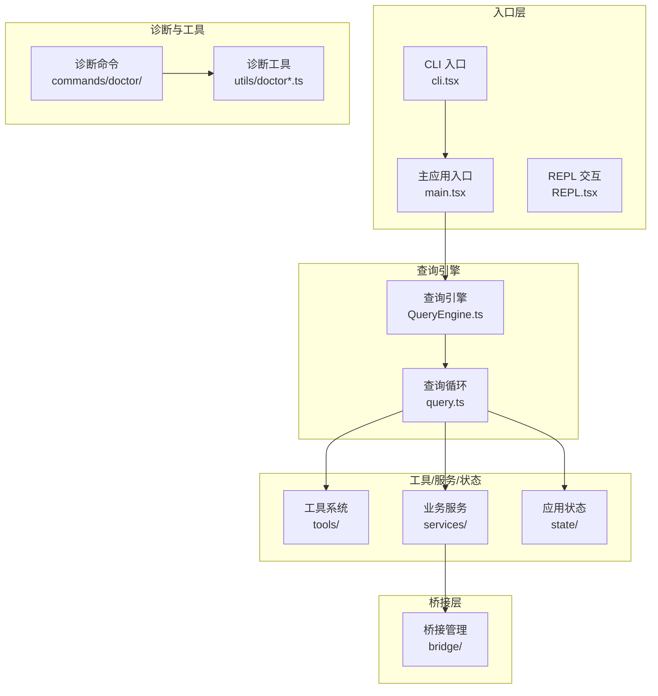
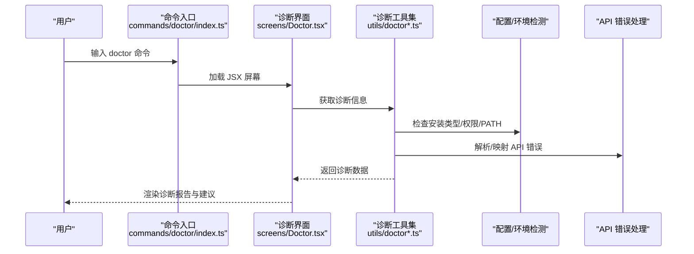
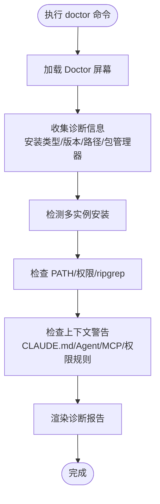
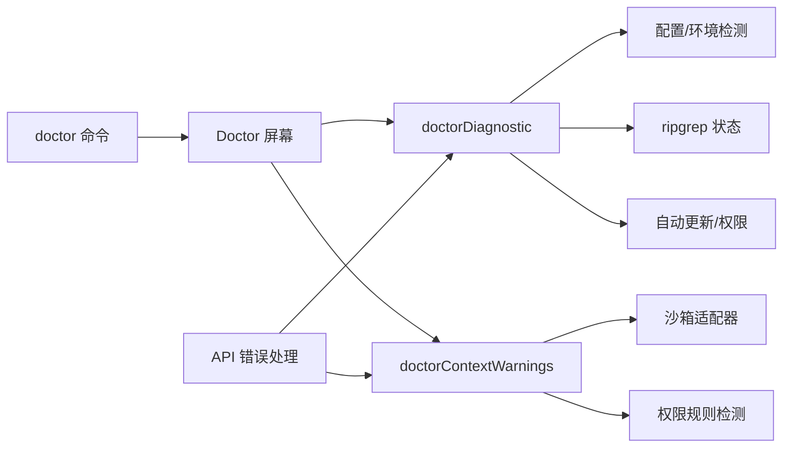

# 故障排除指南

<cite>
**本文档引用的文件**
- [README.md](file://README.md)
- [QUICKSTART.md](file://QUICKSTART.md)
- [package.json](file://package.json)
- [src/screens/Doctor.tsx](file://src/screens/Doctor.tsx)
- [src/commands/doctor/index.ts](file://src/commands/doctor/index.ts)
- [src/utils/doctorDiagnostic.ts](file://src/utils/doctorDiagnostic.ts)
- [src/utils/doctorContextWarnings.ts](file://src/utils/doctorContextWarnings.ts)
- [src/services/api/errors.ts](file://src/services/api/errors.ts)
- [src/constants/errorIds.ts](file://src/constants/errorIds.ts)
- [src/utils/errors.ts](file://src/utils/errors.ts)
- [src/utils/errorLogSink.ts](file://src/utils/errorLogSink.ts)
- [src/utils/analytics/index.ts](file://src/utils/analytics/index.ts)
</cite>

## 目录
1. [简介](#简介)
2. [项目结构](#项目结构)
3. [核心组件](#核心组件)
4. [架构总览](#架构总览)
5. [详细组件分析](#详细组件分析)
6. [依赖关系分析](#依赖关系分析)
7. [性能考虑](#性能考虑)
8. [故障排除指南](#故障排除指南)
9. [结论](#结论)
10. [附录](#附录)

## 简介
本指南面向 Claude Code 用户与维护者，提供系统化的故障排除方法。内容涵盖安装问题、配置问题、性能问题、兼容性问题的诊断与修复；包含调试技巧（日志分析、性能分析、错误诊断）、问题定位与根因分析、系统性排查流程、错误码与错误信息解读、性能优化建议、预防性维护与最佳实践，并提供实际案例与社区支持渠道。

## 项目结构
Claude Code 采用模块化架构，核心由“入口层 → 查询引擎 → 工具/服务/状态层”构成，配合桥接层（桌面/远程）与任务系统。命令体系丰富，内置诊断工具 doctor 提供一键式健康检查。

图表来源
- [README.md:383-446](file://README.md#L383-L446)
- [src/commands/doctor/index.ts:1-13](file://src/commands/doctor/index.ts#L1-L13)
- [src/screens/Doctor.tsx:1-575](file://src/screens/Doctor.tsx#L1-L575)

章节来源
- [README.md:250-379](file://README.md#L250-L379)
- [QUICKSTART.md:106-122](file://QUICKSTART.md#L106-L122)

## 核心组件
- 诊断命令 doctor：提供安装类型、版本、路径、包管理器、自动更新权限、多实例检测、警告与建议等综合诊断。
- 诊断工具集：负责检测安装方式、PATH、权限、ripgrep、沙箱规则、MCP 工具上下文、不可达权限规则等。
- 错误处理与消息：统一解析 API 错误、速率限制、提示过长、媒体大小、并发工具调用错误等，并生成用户可读提示。
- 错误追踪：通过错误 ID 与日志通道进行错误溯源与统计。

章节来源
- [src/commands/doctor/index.ts:1-13](file://src/commands/doctor/index.ts#L1-L13)
- [src/utils/doctorDiagnostic.ts:514-626](file://src/utils/doctorDiagnostic.ts#L514-L626)
- [src/utils/doctorContextWarnings.ts:246-266](file://src/utils/doctorContextWarnings.ts#L246-L266)
- [src/services/api/errors.ts:425-770](file://src/services/api/errors.ts#L425-L770)
- [src/constants/errorIds.ts:1-16](file://src/constants/errorIds.ts#L1-L16)

## 架构总览
下图展示 doctor 命令从触发到输出诊断结果的端到端流程，以及与诊断工具、配置与环境检测、API 错误处理的关系。

图表来源
- [src/commands/doctor/index.ts:1-13](file://src/commands/doctor/index.ts#L1-L13)
- [src/screens/Doctor.tsx:100-502](file://src/screens/Doctor.tsx#L100-L502)
- [src/utils/doctorDiagnostic.ts:514-626](file://src/utils/doctorDiagnostic.ts#L514-L626)
- [src/utils/doctorContextWarnings.ts:246-266](file://src/utils/doctorContextWarnings.ts#L246-L266)
- [src/services/api/errors.ts:425-770](file://src/services/api/errors.ts#L425-L770)

## 详细组件分析

### 诊断命令 doctor 组件
- 功能：提供安装状态、版本、路径、包管理器、自动更新、ripgrep、多实例、警告与建议的集中展示。
- 关键点：支持禁用 doctor 的环境变量开关；异步加载诊断工具集；渲染环境变量有效性、版本锁、插件错误、上下文使用警告等。

图表来源
- [src/screens/Doctor.tsx:100-502](file://src/screens/Doctor.tsx#L100-L502)
- [src/utils/doctorDiagnostic.ts:514-626](file://src/utils/doctorDiagnostic.ts#L514-L626)
- [src/utils/doctorContextWarnings.ts:246-266](file://src/utils/doctorContextWarnings.ts#L246-L266)

章节来源
- [src/commands/doctor/index.ts:1-13](file://src/commands/doctor/index.ts#L1-L13)
- [src/screens/Doctor.tsx:1-575](file://src/screens/Doctor.tsx#L1-L575)

### 诊断工具集（doctorDiagnostic）
- 安装类型识别：开发、本地 npm、原生、包管理器、未知等。
- 版本与路径：当前运行版本、二进制/脚本路径、真实路径解析。
- 多实例检测：全局 npm、本地 npm、原生安装并存时的清理建议。
- 配置问题：安装方式与配置不一致、PATH 缺失、别名无效等。
- 权限与自动更新：全局安装权限不足、自动更新禁用原因。
- ripgrep 状态：工作状态、模式（系统/内置/嵌入）、系统路径。
- Linux 沙箱 glob 规则警告。

章节来源
- [src/utils/doctorDiagnostic.ts:46-71](file://src/utils/doctorDiagnostic.ts#L46-L71)
- [src/utils/doctorDiagnostic.ts:86-148](file://src/utils/doctorDiagnostic.ts#L86-L148)
- [src/utils/doctorDiagnostic.ts:150-189](file://src/utils/doctorDiagnostic.ts#L150-L189)
- [src/utils/doctorDiagnostic.ts:205-315](file://src/utils/doctorDiagnostic.ts#L205-L315)
- [src/utils/doctorDiagnostic.ts:317-485](file://src/utils/doctorDiagnostic.ts#L317-L485)
- [src/utils/doctorDiagnostic.ts:487-512](file://src/utils/doctorDiagnostic.ts#L487-L512)
- [src/utils/doctorDiagnostic.ts:514-626](file://src/utils/doctorDiagnostic.ts#L514-L626)

### 上下文警告检查（doctorContextWarnings）
- CLAUDE.md 文件过大：按字符数阈值检测并排序，给出前 N 个文件详情。
- Agent 描述令牌数：估算总令牌数与阈值比较，列出高开销自定义 Agent。
- MCP 工具上下文：估算或统计令牌数，按服务器分组显示前 N 个服务器详情。
- 不可达权限规则：检测被更宽泛规则遮蔽的细粒度允许规则，给出修复建议。

章节来源
- [src/utils/doctorContextWarnings.ts:20-41](file://src/utils/doctorContextWarnings.ts#L20-L41)
- [src/utils/doctorContextWarnings.ts:43-68](file://src/utils/doctorContextWarnings.ts#L43-L68)
- [src/utils/doctorContextWarnings.ts:73-114](file://src/utils/doctorContextWarnings.ts#L73-L114)
- [src/utils/doctorContextWarnings.ts:119-207](file://src/utils/doctorContextWarnings.ts#L119-L207)
- [src/utils/doctorContextWarnings.ts:212-241](file://src/utils/doctorContextWarnings.ts#L212-L241)
- [src/utils/doctorContextWarnings.ts:246-266](file://src/utils/doctorContextWarnings.ts#L246-L266)

### API 错误处理与消息映射
- 统一错误消息前缀与格式化，区分超时、429 速率限制、提示过长、PDF/图片大小、并发工具调用错误、模型名称无效、余额不足、组织禁用等。
- 对特定错误（如工具调用并发问题）记录事件并提供恢复建议（如回溯）。
- 对新式统一配额头进行解析，生成更精确的用户提示。

章节来源
- [src/services/api/errors.ts:54-77](file://src/services/api/errors.ts#L54-L77)
- [src/services/api/errors.ts:85-118](file://src/services/api/errors.ts#L85-L118)
- [src/services/api/errors.ts:133-153](file://src/services/api/errors.ts#L133-L153)
- [src/services/api/errors.ts:425-770](file://src/services/api/errors.ts#L425-L770)

### 错误追踪与日志
- 错误 ID：用于生产环境追踪错误来源，便于定位具体日志调用点。
- 错误日志通道：统一错误上报与统计。
- 分析事件：对特定错误（如工具调用不匹配）记录事件，辅助根因分析。

章节来源
- [src/constants/errorIds.ts:1-16](file://src/constants/errorIds.ts#L1-L16)
- [src/utils/errorLogSink.ts](file://src/utils/errorLogSink.ts)
- [src/utils/analytics/index.ts](file://src/utils/analytics/index.ts)

## 依赖关系分析
- doctor 命令依赖 Doctor 屏幕组件与诊断工具集。
- 诊断工具集依赖配置/环境检测、ripgrep 状态、沙箱适配器、权限规则检测等。
- 错误处理依赖 API SDK、速率限制与配额头解析、媒体尺寸校验等。

图表来源
- [src/commands/doctor/index.ts:1-13](file://src/commands/doctor/index.ts#L1-L13)
- [src/screens/Doctor.tsx:1-575](file://src/screens/Doctor.tsx#L1-L575)
- [src/utils/doctorDiagnostic.ts:1-626](file://src/utils/doctorDiagnostic.ts#L1-L626)
- [src/utils/doctorContextWarnings.ts:1-266](file://src/utils/doctorContextWarnings.ts#L1-L266)
- [src/services/api/errors.ts:1-1208](file://src/services/api/errors.ts#L1-L1208)

章节来源
- [src/commands/doctor/index.ts:1-13](file://src/commands/doctor/index.ts#L1-L13)
- [src/screens/Doctor.tsx:1-575](file://src/screens/Doctor.tsx#L1-L575)
- [src/utils/doctorDiagnostic.ts:1-626](file://src/utils/doctorDiagnostic.ts#L1-L626)
- [src/utils/doctorContextWarnings.ts:1-266](file://src/utils/doctorContextWarnings.ts#L1-L266)
- [src/services/api/errors.ts:1-1208](file://src/services/api/errors.ts#L1-L1208)

## 性能考虑
- 上下文压缩：当历史消息达到阈值时自动压缩，减少令牌占用。
- 并行工具执行：工具执行器支持并发安全与串行执行的分区，提升吞吐。
- 输出长度限制：对 shell 与任务输出设置上限，避免大输出阻塞。
- 沙箱规则：Linux 下 glob 模式在编辑/读取规则中会被忽略，需注意性能与权限影响。

章节来源
- [README.md:650-690](file://README.md#L650-L690)
- [README.md:500-564](file://README.md#L500-L564)
- [src/utils/doctorContextWarnings.ts:496-512](file://src/utils/doctorContextWarnings.ts#L496-L512)

## 故障排除指南

### 一、安装问题
- 症状
  - 无法找到可执行文件或命令无效
  - 多个安装共存导致行为异常
  - PATH 未包含本地安装路径
- 排查步骤
  - 使用 doctor 命令查看安装类型、版本、路径、包管理器、自动更新状态
  - 检查是否存在多实例（本地 npm、全局 npm、原生），按提示清理冗余
  - 若为原生安装但不在 PATH，按提示添加 ~/.local/bin 或对应平台路径
- 解决方案
  - 使用原生安装：claude install
  - 更新 PATH 或创建有效别名
  - 清理遗留 npm 安装（全局/孤儿包/本地）

章节来源
- [src/utils/doctorDiagnostic.ts:205-315](file://src/utils/doctorDiagnostic.ts#L205-L315)
- [src/utils/doctorDiagnostic.ts:373-430](file://src/utils/doctorDiagnostic.ts#L373-L430)
- [src/utils/doctorDiagnostic.ts:527-566](file://src/utils/doctorDiagnostic.ts#L527-L566)

### 二、配置问题
- 症状
  - 运行环境与配置不一致（如原生安装但配置为本地）
  - 环境变量或 shell 别名失效
  - 自动更新权限不足
- 排查步骤
  - doctor 输出中查看“配置安装方式”与当前安装类型是否一致
  - 检查 PATH 是否包含本地安装目录
  - 检查自动更新权限与禁用原因
- 解决方案
  - 使用 claude install 同步配置
  - 添加 PATH 或修正别名
  - 以非 sudo 方式重装 Node 或改用原生安装

章节来源
- [src/utils/doctorDiagnostic.ts:432-448](file://src/utils/doctorDiagnostic.ts#L432-L448)
- [src/utils/doctorDiagnostic.ts:573-586](file://src/utils/doctorDiagnostic.ts#L573-L586)

### 三、性能问题
- 症状
  - 响应缓慢、上下文过大、工具执行耗时
- 排查步骤
  - 使用 doctor 检查上下文警告：CLAUDE.md 文件过大、Agent 描述令牌数过高、MCP 工具上下文过大、不可达权限规则
  - 检查输出长度限制是否触发
  - 检查 Linux 沙箱 glob 规则警告
- 解决方案
  - 清理或拆分大型 CLAUDE.md 文件
  - 精简自定义 Agent 描述
  - 减少 MCP 工具数量或按服务器分组管理
  - 优化权限规则，移除冗余/不可达规则
  - 调整输出长度上限或分批处理

章节来源
- [src/utils/doctorContextWarnings.ts:43-68](file://src/utils/doctorContextWarnings.ts#L43-L68)
- [src/utils/doctorContextWarnings.ts:73-114](file://src/utils/doctorContextWarnings.ts#L73-L114)
- [src/utils/doctorContextWarnings.ts:119-207](file://src/utils/doctorContextWarnings.ts#L119-L207)
- [src/utils/doctorContextWarnings.ts:212-241](file://src/utils/doctorContextWarnings.ts#L212-L241)
- [src/utils/doctorContextWarnings.ts:496-512](file://src/utils/doctorContextWarnings.ts#L496-L512)

### 四、兼容性问题
- 症状
  - 在不同操作系统（Linux/macOS/Windows）上行为不一致
  - 浏览器/桌面集成异常
- 排查步骤
  - doctor 输出中查看包管理器与安装方式
  - 检查 ripgrep 模式与系统路径
  - 检查 PATH 与 shell 配置
- 解决方案
  - 使用原生安装以获得一致体验
  - 在 Windows 上正确配置 PATH
  - 确保 ripgrep 正常工作（系统/内置/嵌入模式）

章节来源
- [src/utils/doctorDiagnostic.ts:599-604](file://src/utils/doctorDiagnostic.ts#L599-L604)
- [src/utils/doctorDiagnostic.ts:68-70](file://src/utils/doctorDiagnostic.ts#L68-L70)

### 五、API 错误与消息解读
- 常见错误与处理
  - 超时：检查网络与代理，重试请求
  - 429 速率限制：根据统一配额头生成更精确提示，必要时切换模型或等待重置
  - 提示过长：使用紧凑模式或减少上下文
  - PDF/图片过大：转换为文本或缩小尺寸
  - 并发工具调用错误：回溯并修复对话历史中的工具调用配对
  - 模型名称无效：确认订阅计划与可用模型
  - 余额不足：充值或切换计费方式
  - 组织禁用：清除过期环境变量或登录新的账户
- 错误 ID 与日志
  - 使用错误 ID 快速定位日志来源
  - 通过错误日志通道与分析事件进行根因分析

章节来源
- [src/services/api/errors.ts:433-558](file://src/services/api/errors.ts#L433-L558)
- [src/services/api/errors.ts:560-664](file://src/services/api/errors.ts#L560-L664)
- [src/services/api/errors.ts:666-733](file://src/services/api/errors.ts#L666-L733)
- [src/services/api/errors.ts:735-770](file://src/services/api/errors.ts#L735-L770)
- [src/constants/errorIds.ts:1-16](file://src/constants/errorIds.ts#L1-L16)
- [src/utils/errorLogSink.ts](file://src/utils/errorLogSink.ts)

### 六、系统性故障排除流程
- 问题分类
  - 安装类：多实例、PATH、权限
  - 配置类：安装方式不一致、别名失效
  - 性能类：上下文过大、工具执行慢、输出过大
  - 兼容性类：平台差异、ripgrep、沙箱规则
  - API 类：超时、429、提示过长、媒体大小、并发错误
- 优先级评估
  - 高：API 错误导致会话中断
  - 中：性能问题影响体验
  - 低：兼容性与配置微小差异
- 解决策略
  - 使用 doctor 一次性获取诊断与建议
  - 依据诊断报告逐项修复
  - 通过错误 ID 与日志通道定位根因
  - 必要时回溯对话历史或切换模型

章节来源
- [src/screens/Doctor.tsx:1-575](file://src/screens/Doctor.tsx#L1-L575)
- [src/utils/doctorDiagnostic.ts:514-626](file://src/utils/doctorDiagnostic.ts#L514-L626)
- [src/utils/doctorContextWarnings.ts:246-266](file://src/utils/doctorContextWarnings.ts#L246-L266)
- [src/services/api/errors.ts:425-770](file://src/services/api/errors.ts#L425-L770)

### 七、调试技巧与工具使用
- 日志分析
  - 使用错误 ID 快速检索日志
  - 通过错误日志通道聚合错误事件
- 性能分析
  - 使用 doctor 上下文警告定位瓶颈
  - 结合输出长度限制与上下文压缩策略
- 错误诊断
  - 统一 API 错误消息映射，快速识别问题类型
  - 对并发工具调用错误记录事件并提供回溯建议

章节来源
- [src/constants/errorIds.ts:1-16](file://src/constants/errorIds.ts#L1-L16)
- [src/utils/errorLogSink.ts](file://src/utils/errorLogSink.ts)
- [src/utils/analytics/index.ts](file://src/utils/analytics/index.ts)
- [src/utils/doctorContextWarnings.ts:212-241](file://src/utils/doctorContextWarnings.ts#L212-L241)

### 八、预防性维护与最佳实践
- 定期运行 doctor，保持安装与配置一致性
- 控制 CLAUDE.md 与 Agent 描述规模，避免上下文膨胀
- 合理管理 MCP 工具数量，按服务器分组与权限最小化
- 在 Linux 平台谨慎使用 glob 模式，避免权限与性能问题
- 保持 Node/npm 权限正确，避免 sudo 安装带来的后续问题

章节来源
- [src/utils/doctorDiagnostic.ts:527-566](file://src/utils/doctorDiagnostic.ts#L527-L566)
- [src/utils/doctorContextWarnings.ts:496-512](file://src/utils/doctorContextWarnings.ts#L496-L512)

### 九、社区支持与问题反馈
- 社区渠道：通过反馈通道提交问题与日志文件，便于开发者复现与修复。
- 建议流程：先运行 doctor 获取诊断报告，复制关键信息与错误 ID，附上日志后提交至社区渠道。

章节来源
- [src/services/api/errors.ts:687-705](file://src/services/api/errors.ts#L687-L705)

## 结论
通过 doctor 命令与配套诊断工具，可以系统化地定位安装、配置、性能与兼容性问题；结合 API 错误映射与错误 ID/日志通道，能够高效完成根因分析与修复。建议将 doctor 作为日常维护与问题排查的首选工具，并遵循预防性维护最佳实践，确保系统稳定与高效运行。

## 附录

### 实际案例与解决方案
- 案例 1：原生安装但不在 PATH
  - 现象：原生安装存在但命令不可用
  - 处理：doctor 提示添加 ~/.local/bin 到 PATH，或在 Windows 上通过系统属性设置
- 案例 2：多实例并存
  - 现象：同时存在本地 npm 与原生安装
  - 处理：doctor 列出多实例并提供清理命令（rmdir/rm -rf）
- 案例 3：上下文过大导致 429
  - 现象：频繁出现 429
  - 处理：doctor 显示 MCP 工具上下文过大警告，建议减少工具数量或切换模型

章节来源
- [src/utils/doctorDiagnostic.ts:527-566](file://src/utils/doctorDiagnostic.ts#L527-L566)
- [src/utils/doctorContextWarnings.ts:119-207](file://src/utils/doctorContextWarnings.ts#L119-L207)