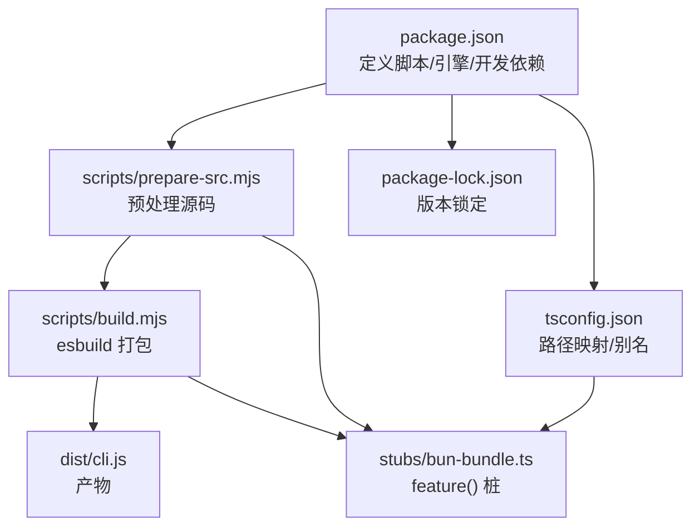
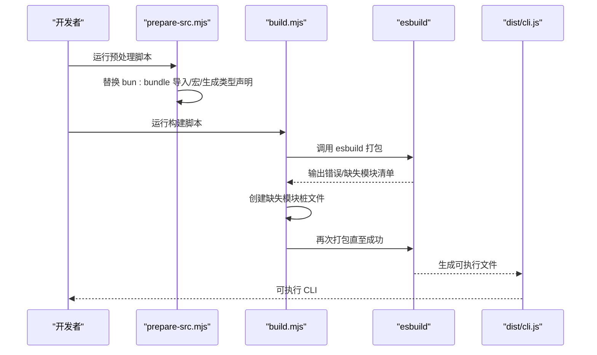
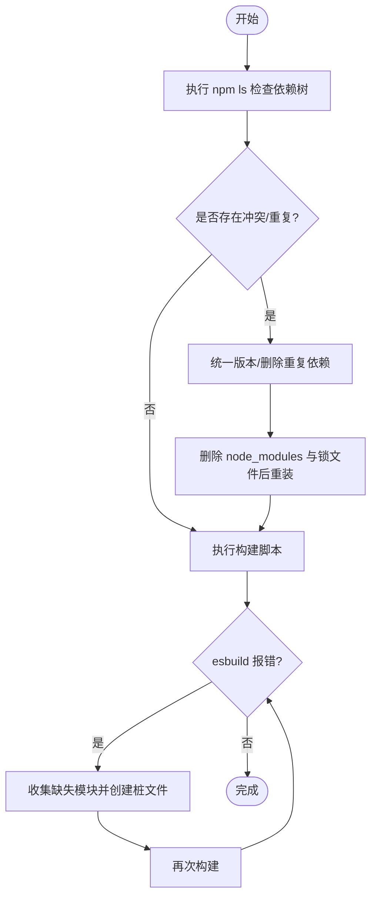
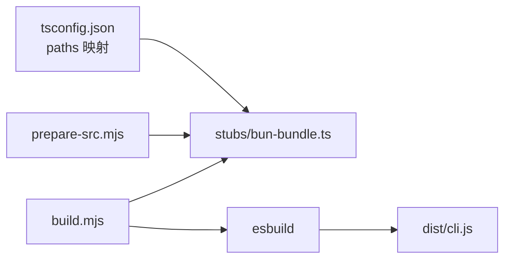

# 依赖管理

<cite>
**本文引用的文件列表**
- [package.json](file://package.json)
- [package-lock.json](file://package-lock.json)
- [tsconfig.json](file://tsconfig.json)
- [scripts/build.mjs](file://scripts/build.mjs)
- [scripts/prepare-src.mjs](file://scripts/prepare-src.mjs)
- [stubs/bun-bundle.ts](file://stubs/bun-bundle.ts)
- [QUICKSTART.md](file://QUICKSTART.md)
- [README.md](file://README.md)
- [src/QueryEngine.ts](file://src/QueryEngine.ts)
</cite>

## 目录
1. [简介](#简介)
2. [项目结构](#项目结构)
3. [核心组件](#核心组件)
4. [架构总览](#架构总览)
5. [详细组件分析](#详细组件分析)
6. [依赖关系分析](#依赖关系分析)
7. [性能考量](#性能考量)
8. [故障排查指南](#故障排查指南)
9. [结论](#结论)
10. [附录](#附录)

## 简介
本文件面向 Claude Code 的依赖管理系统，系统性梳理 package.json 中的依赖配置（生产依赖、开发依赖、可选依赖），解释版本控制与语义化版本的使用规范，阐述安装与更新流程（npm install 与版本锁定机制），区分运行时依赖与构建时依赖，并给出依赖冲突检测与解决策略、依赖安全扫描与漏洞管理最佳实践，以及本地开发与生产环境的依赖差异。文档同时结合仓库中的脚本与配置文件，提供可操作的依赖管理流程与示例。

## 项目结构
该仓库采用“源码 + 构建脚本 + 类型声明 + 锁定文件”的组织方式：
- 根级配置：package.json 定义包元信息、脚本、引擎与开发依赖；package-lock.json 记录精确版本与依赖树；tsconfig.json 定义 TypeScript 编译路径映射与别名。
- 构建脚本：scripts/build.mjs 与 scripts/prepare-src.mjs 提供预处理与打包流程，用于在非 Bun 环境下进行“尽力而为”的构建。
- 类型与桩模块：stubs/ 提供 Bun 编译期特性（如 feature()）的桩实现，使 esbuild 能够完成打包。
- 文档与说明：QUICKSTART.md 与 README.md 提供构建与运行说明，包含依赖与版本要求。

图表来源
- [package.json:1-21](file://package.json#L1-L21)
- [scripts/prepare-src.mjs:1-116](file://scripts/prepare-src.mjs#L1-L116)
- [scripts/build.mjs:1-246](file://scripts/build.mjs#L1-L246)
- [tsconfig.json:1-37](file://tsconfig.json#L1-L37)
- [stubs/bun-bundle.ts:1-5](file://stubs/bun-bundle.ts#L1-L5)

章节来源
- [package.json:1-21](file://package.json#L1-L21)
- [tsconfig.json:1-37](file://tsconfig.json#L1-L37)
- [scripts/prepare-src.mjs:1-116](file://scripts/prepare-src.mjs#L1-L116)
- [scripts/build.mjs:1-246](file://scripts/build.mjs#L1-L246)
- [stubs/bun-bundle.ts:1-5](file://stubs/bun-bundle.ts#L1-L5)

## 核心组件
- 包元信息与脚本
  - name、version、description、type、private 等字段定义包属性。
  - scripts 字段包含 prepare-src、build、check、start 等命令，分别对应源码准备、构建、类型检查与启动。
  - engines.node 指定最低 Node.js 版本要求（>=18）。
- 开发依赖
  - esbuild：构建打包工具，用于将源码打包为单文件可执行。
  - typescript：类型检查与编译支持。
- 类型配置
  - tsconfig.json 使用 bundler 解析器，启用 JSX、声明生成、源码映射等；通过 paths 将 bun:bundle 映射到 stubs/bun-bundle.ts，以适配 esbuild 打包。
- 构建脚本
  - prepare-src.mjs：替换 Bun 编译期宏与导入，生成全局类型声明与 bun:ffi 桩。
  - build.mjs：复制源码、转换源码（feature() 替换、MACRO 注入、bun:bundle 导入替换）、创建入口包装、esbuild 打包并迭代补齐缺失模块的桩文件。

章节来源
- [package.json:7-19](file://package.json#L7-L19)
- [package.json:13-15](file://package.json#L13-L15)
- [tsconfig.json:19-22](file://tsconfig.json#L19-L22)
- [scripts/prepare-src.mjs:36-98](file://scripts/prepare-src.mjs#L36-L98)
- [scripts/build.mjs:44-50](file://scripts/build.mjs#L44-L50)
- [scripts/build.mjs:149-173](file://scripts/build.mjs#L149-L173)

## 架构总览
依赖管理贯穿“源码准备 → 构建打包 → 产物产出”的全链路，其中：
- 源码准备阶段：将 Bun 编译期特性（feature()、MACRO.X、bun:bundle）转换为可在 Node/ESBuild 环境运行的形式。
- 构建打包阶段：通过 esbuild 将源码与桩模块打包为单一可执行文件，同时处理缺失模块并通过桩文件补齐。
- 运行阶段：dist/cli.js 作为 CLI 入口，配合环境变量与权限配置运行。

图表来源
- [scripts/prepare-src.mjs:36-98](file://scripts/prepare-src.mjs#L36-L98)
- [scripts/build.mjs:144-229](file://scripts/build.mjs#L144-L229)

章节来源
- [scripts/prepare-src.mjs:1-116](file://scripts/prepare-src.mjs#L1-L116)
- [scripts/build.mjs:1-246](file://scripts/build.mjs#L1-L246)

## 详细组件分析

### package.json 依赖配置与分类
- 生产依赖
  - 本仓库未定义生产依赖字段，表明运行时依赖由构建产物与运行环境提供，不通过 npm 发布。
- 开发依赖
  - esbuild：用于打包，版本范围 ^0.27.4。
  - typescript：用于类型检查与编译，版本范围 ^6.0.2。
- 引擎要求
  - engines.node >= 18，确保在 Node 18+ 环境运行构建脚本与 CLI。
- 脚本命令
  - prepare-src：准备源码，替换 Bun 编译期特性与宏。
  - build：先执行 prepare-src，再调用 build.mjs 打包。
  - check：先执行 prepare-src，再执行 tsc --noEmit 进行类型检查。
  - start：运行 dist/cli.js。

章节来源
- [package.json:16-19](file://package.json#L16-L19)
- [package.json:13-15](file://package.json#L13-L15)
- [package.json:7-12](file://package.json#L7-L12)

### 版本控制与语义化版本
- 语义化版本
  - 包版本为 2.1.88，遵循主.次.补丁格式；升级应遵循语义化版本规则，避免破坏性变更影响兼容性。
- 版本锁定
  - package-lock.json 记录精确版本与依赖树，保证安装一致性与可复现性。
- 构建期版本注入
  - 构建脚本将 MACRO.VERSION 注入到产物中，确保运行时可见的版本信息与包版本一致。

章节来源
- [package.json:2-4](file://package.json#L2-L4)
- [package-lock.json:1-16](file://package-lock.json#L1-L16)
- [scripts/build.mjs:68-78](file://scripts/build.mjs#L68-L78)

### 依赖安装与更新流程
- 安装
  - 使用 npm install 安装开发依赖（esbuild、typescript）与项目依赖（若存在）。由于本仓库未定义生产依赖，安装后主要为开发依赖。
- 更新
  - 使用 npm update 或指定依赖版本进行更新；更新后建议重新执行构建脚本以验证兼容性。
- 版本锁定
  - package-lock.json 由 npm 自动生成与维护，确保团队成员与 CI 环境获得一致的依赖树。

章节来源
- [package.json:16-19](file://package.json#L16-L19)
- [package-lock.json:1-16](file://package-lock.json#L1-L16)

### 运行时依赖与构建时依赖
- 构建时依赖
  - esbuild、typescript：仅在开发与构建阶段使用，不随产物发布。
- 运行时依赖
  - 本仓库未定义生产依赖，CLI 运行依赖于 Node.js 环境与已打包的 dist/cli.js。
- Bun 编译期特性适配
  - 通过 stubs/bun-bundle.ts 提供 feature() 桩，使 esbuild 能解析 require() 并完成打包；prepare-src.mjs 与 build.mjs 在构建前替换 Bun 特性，避免运行时依赖。

章节来源
- [stubs/bun-bundle.ts:1-5](file://stubs/bun-bundle.ts#L1-L5)
- [scripts/prepare-src.mjs:36-98](file://scripts/prepare-src.mjs#L36-L98)
- [scripts/build.mjs:86-116](file://scripts/build.mjs#L86-L116)

### 依赖冲突检测与解决
- 冲突识别
  - 使用 npm ls 查看依赖树，定位重复或版本不一致的包。
- 解决策略
  - 统一版本：在 package.json 中固定关键依赖版本，减少冲突。
  - 清理缓存：删除 node_modules 与 package-lock.json 后重新安装。
  - 迭代补齐：构建脚本会自动收集“无法解析”的模块并生成桩文件，便于继续打包。

图表来源
- [scripts/build.mjs:149-193](file://scripts/build.mjs#L149-L193)

章节来源
- [scripts/build.mjs:149-193](file://scripts/build.mjs#L149-L193)

### 依赖安全扫描与漏洞管理
- 安全扫描
  - 使用 npm audit 对依赖进行安全审计，修复高危与严重漏洞。
- 漏洞管理
  - 优先升级至修复版本；若无法升级，评估风险并制定缓解措施（如限制访问、最小权限等）。
- 供应链安全
  - 使用 npm ci 结合 package-lock.json 进行可复现安装，降低被篡改风险。
- 最佳实践
  - 定期更新依赖并运行安全审计；对关键依赖采用固定版本策略；在 CI 中集成安全扫描步骤。

章节来源
- [package-lock.json:1-16](file://package-lock.json#L1-L16)

### 本地开发与生产环境差异
- 本地开发
  - 需要 Node.js >= 18、npm >= 9；安装开发依赖后可通过 npm run build 进行构建。
- 生产环境
  - 产物为 dist/cli.js，直接通过 node 运行；无需 Bun 编译期特性。
- 版本一致性
  - 使用 package-lock.json 保证本地与生产环境依赖一致。

章节来源
- [package.json:13-15](file://package.json#L13-L15)
- [QUICKSTART.md:25-45](file://QUICKSTART.md#L25-L45)

## 依赖关系分析
- tsconfig.json 中的路径映射将 bun:bundle 指向 stubs/bun-bundle.ts，确保 esbuild 能解析 Bun 编译期特性。
- 构建脚本在预处理阶段替换 Bun 导入与宏，在打包阶段通过迭代补齐缺失模块桩文件，最终输出单一可执行文件。

图表来源
- [tsconfig.json:19-22](file://tsconfig.json#L19-L22)
- [stubs/bun-bundle.ts:1-5](file://stubs/bun-bundle.ts#L1-L5)
- [scripts/prepare-src.mjs:36-98](file://scripts/prepare-src.mjs#L36-L98)
- [scripts/build.mjs:144-229](file://scripts/build.mjs#L144-L229)

章节来源
- [tsconfig.json:19-22](file://tsconfig.json#L19-L22)
- [stubs/bun-bundle.ts:1-5](file://stubs/bun-bundle.ts#L1-L5)
- [scripts/prepare-src.mjs:36-98](file://scripts/prepare-src.mjs#L36-L98)
- [scripts/build.mjs:144-229](file://scripts/build.mjs#L144-L229)

## 性能考量
- 构建性能
  - esbuild 速度快，适合大体量源码的打包；迭代补齐缺失模块的策略可减少一次性修复成本。
- 运行性能
  - 单文件可执行 CLI 降低了运行时加载开销；通过死代码消除（DCE）与条件导入减少不必要的模块加载。
- 依赖体积
  - package-lock.json 记录精确版本，有助于控制依赖体积与网络传输时间。

章节来源
- [package-lock.json:1-16](file://package-lock.json#L1-L16)
- [scripts/build.mjs:144-229](file://scripts/build.mjs#L144-L229)

## 故障排查指南
- 构建失败
  - 检查 esbuild 是否安装并可用；确认 Node.js 版本满足 engines.node 要求。
  - 使用构建脚本提供的“查找缺失模块”命令，逐个创建桩文件并重试。
- 运行失败
  - 确认已正确设置环境变量（如 API 密钥）；检查 dist/cli.js 是否存在且可执行。
- 依赖冲突
  - 使用 npm ls 定位冲突；统一版本或删除重复依赖后重新安装。

章节来源
- [scripts/build.mjs:44-50](file://scripts/build.mjs#L44-L50)
- [package.json:13-15](file://package.json#L13-L15)
- [QUICKSTART.md:75-87](file://QUICKSTART.md#L75-L87)

## 结论
本仓库的依赖管理以“开发依赖 + 构建脚本 + 类型桩 + 版本锁定”为核心，通过 esbuild 实现快速打包与可执行产物输出。尽管缺少生产依赖，但通过 Bun 编译期特性的桩替换与条件导入，实现了与原生 Bun 构建相近的功能覆盖。建议在团队内统一 Node.js 与 npm 版本，定期运行安全审计，并在 CI 中集成依赖安装与安全扫描，以保障构建稳定性与安全性。

## 附录
- 依赖管理流程示例
  - 安装开发依赖：npm install --save-dev esbuild typescript
  - 预处理源码：node scripts/prepare-src.mjs
  - 构建产物：node scripts/build.mjs
  - 运行 CLI：node dist/cli.js --version
- 关键文件参考
  - [package.json](file://package.json)
  - [package-lock.json](file://package-lock.json)
  - [tsconfig.json](file://tsconfig.json)
  - [scripts/prepare-src.mjs](file://scripts/prepare-src.mjs)
  - [scripts/build.mjs](file://scripts/build.mjs)
  - [stubs/bun-bundle.ts](file://stubs/bun-bundle.ts)
  - [QUICKSTART.md](file://QUICKSTART.md)
  - [README.md](file://README.md)
  - [src/QueryEngine.ts](file://src/QueryEngine.ts)