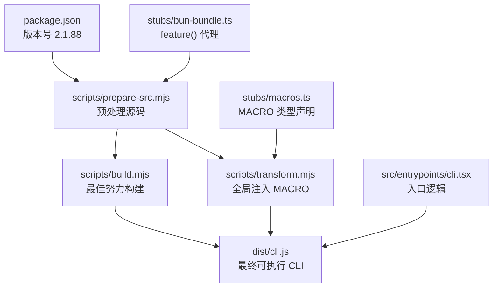
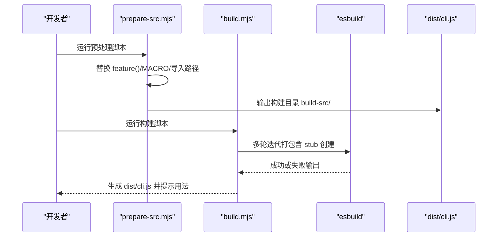
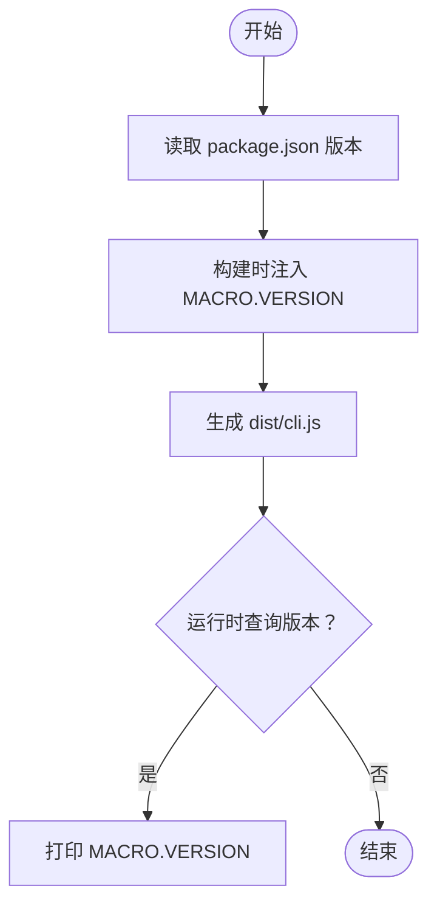
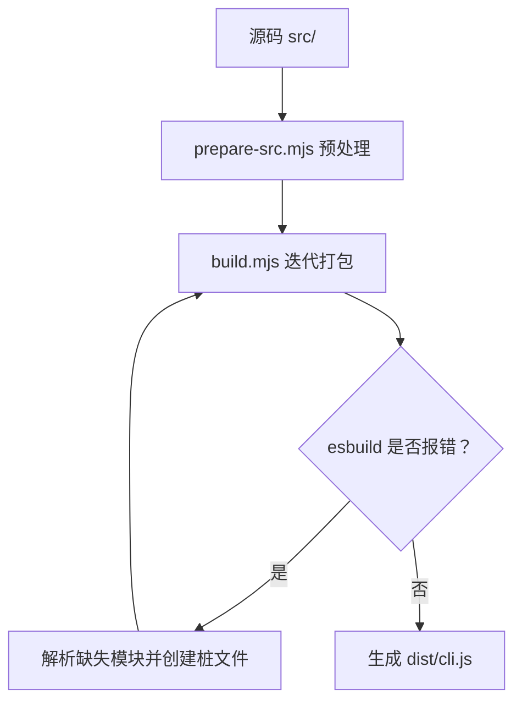
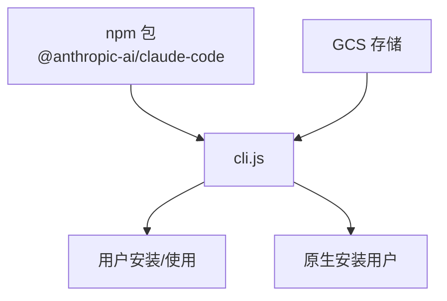
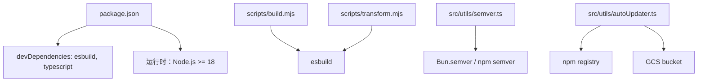

# 发布部署

<cite>
**本文引用的文件**
- [package.json](file://package.json)
- [README.md](file://README.md)
- [QUICKSTART.md](file://QUICKSTART.md)
- [scripts/build.mjs](file://scripts/build.mjs)
- [scripts/prepare-src.mjs](file://scripts/prepare-src.mjs)
- [scripts/stub-modules.mjs](file://scripts/stub-modules.mjs)
- [scripts/transform.mjs](file://scripts/transform.mjs)
- [src/entrypoints/cli.tsx](file://src/entrypoints/cli.tsx)
- [src/commands/version.ts](file://src/commands/version.ts)
- [src/utils/autoUpdater.ts](file://src/utils/autoUpdater.ts)
- [src/utils/semver.ts](file://src/utils/semver.ts)
- [src/utils/releaseNotes.ts](file://src/utils/releaseNotes.ts)
- [stubs/bun-bundle.ts](file://stubs/bun-bundle.ts)
- [stubs/macros.ts](file://stubs/macros.ts)
- [stubs/global.d.ts](file://stubs/global.d.ts)
</cite>

## 目录
1. [简介](#简介)
2. [项目结构](#项目结构)
3. [核心组件](#核心组件)
4. [架构总览](#架构总览)
5. [详细组件分析](#详细组件分析)
6. [依赖分析](#依赖分析)
7. [性能考虑](#性能考虑)
8. [故障排查指南](#故障排查指南)
9. [结论](#结论)
10. [附录](#附录)

## 简介
本技术文档面向 Claude Code 的发布与部署流程，聚焦于版本管理策略、发布前准备、构建产物打包与优化、发布渠道选择与配置、持续集成与自动化部署、生产环境部署以及回滚与应急处理。文档基于仓库中的构建脚本、入口点与版本信息源进行系统性梳理，并通过可视化图表帮助读者快速理解整体流程。

## 项目结构
- 核心发布产物：dist/cli.js（单文件可执行 CLI）
- 构建脚本：scripts/build.mjs、scripts/prepare-src.mjs、scripts/stub-modules.mjs、scripts/transform.mjs
- 版本来源：package.json（版本号）、构建脚本内硬编码版本字符串、入口点与命令模块中的运行时版本输出
- 入口点：src/entrypoints/cli.tsx（CLI 主入口）
- 发布渠道：npm 包含已编译的 cli.js；同时支持从源码最佳努力构建
- 发布工具链：esbuild（Node.js 环境下）替代 Bun 原生编译时间特性

**图表来源**
- [package.json:1-21](file://package.json#L1-L21)
- [scripts/prepare-src.mjs:1-116](file://scripts/prepare-src.mjs#L1-L116)
- [scripts/build.mjs:1-246](file://scripts/build.mjs#L1-L246)
- [scripts/transform.mjs:1-144](file://scripts/transform.mjs#L1-L144)
- [src/entrypoints/cli.tsx:1-303](file://src/entrypoints/cli.tsx#L1-L303)
- [stubs/bun-bundle.ts:1-5](file://stubs/bun-bundle.ts#L1-L5)
- [stubs/macros.ts:1-21](file://stubs/macros.ts#L1-L21)

**章节来源**
- [package.json:1-21](file://package.json#L1-L21)
- [README.md:1-944](file://README.md#L1-L944)
- [QUICKSTART.md:1-122](file://QUICKSTART.md#L1-L122)

## 核心组件
- 版本管理与版本号规则
  - 使用语义化版本（SemVer），版本号在 package.json 与构建脚本中统一维护
  - 运行时版本输出来源于 MACRO.VERSION（构建时注入）
- 发布前准备
  - 代码审查与测试验证：仓库未包含 CI 配置，建议在本地执行类型检查与构建验证
  - 文档更新：README 与 QUICKSTART 提供构建与发布说明
- 构建与打包
  - 最佳努力构建：使用 esbuild 在 Node.js 环境下模拟 Bun 编译期特性
  - 迭代式 stub 创建：解析 esbuild 错误，自动生成缺失模块桩文件
- 发布渠道
  - npm：发布包内含已编译的 cli.js
  - 二进制分发：通过 GCS 获取版本指针（用于非 npm 安装场景）

**章节来源**
- [package.json:1-21](file://package.json#L1-L21)
- [scripts/prepare-src.mjs:19](file://scripts/prepare-src.mjs#L19)
- [scripts/build.mjs:28](file://scripts/build.mjs#L28)
- [src/entrypoints/cli.tsx:38-42](file://src/entrypoints/cli.tsx#L38-L42)
- [src/utils/autoUpdater.ts:355-410](file://src/utils/autoUpdater.ts#L355-L410)

## 架构总览
发布流程由“版本定义 → 源码预处理 → 构建打包 → 产物校验 → 渠道发布”构成。入口点负责快速路径（如 --version）与完整启动流程，构建脚本通过替换与注入实现对 Bun 编译期特性的近似还原。

**图表来源**
- [scripts/prepare-src.mjs:79-116](file://scripts/prepare-src.mjs#L79-L116)
- [scripts/build.mjs:144-245](file://scripts/build.mjs#L144-L245)

**章节来源**
- [scripts/prepare-src.mjs:1-116](file://scripts/prepare-src.mjs#L1-L116)
- [scripts/build.mjs:1-246](file://scripts/build.mjs#L1-L246)

## 详细组件分析

### 组件一：版本管理与版本号规则
- 版本号来源
  - package.json 中的 version 字段作为官方版本标识
  - 构建脚本内硬编码版本字符串，确保构建产物与包版本一致
  - 运行时版本输出通过 MACRO.VERSION 注入，保证 --version 快速路径正确
- 语义化版本比较
  - 工具函数封装了 Bun.semver 与 npm semver 的兼容逻辑，用于版本比较与排序

**图表来源**
- [package.json:3](file://package.json#L3)
- [scripts/build.mjs:28](file://scripts/build.mjs#L28)
- [src/entrypoints/cli.tsx:38-42](file://src/entrypoints/cli.tsx#L38-L42)
- [src/utils/semver.ts:19-45](file://src/utils/semver.ts#L19-L45)

**章节来源**
- [package.json:1-21](file://package.json#L1-L21)
- [scripts/build.mjs:28](file://scripts/build.mjs#L28)
- [src/entrypoints/cli.tsx:38-42](file://src/entrypoints/cli.tsx#L38-L42)
- [src/utils/semver.ts:1-46](file://src/utils/semver.ts#L1-L46)

### 组件二：发布前准备（代码审查、测试验证、文档更新）
- 代码审查与测试验证
  - 仓库未包含 CI 配置，建议在本地执行类型检查与构建验证
  - 类型检查脚本：npm run check（基于 tsc）
- 文档更新
  - README 与 QUICKSTART 提供构建与发布说明，便于复现与审计

**章节来源**
- [package.json:10](file://package.json#L10)
- [README.md:1-944](file://README.md#L1-L944)
- [QUICKSTART.md:23-87](file://QUICKSTART.md#L23-L87)

### 组件三：构建产物打包与优化策略
- 最佳努力构建策略
  - 预处理阶段：替换 feature('X')、MACRO.X、bun:bundle 导入等
  - 构建阶段：esbuild 打包，迭代式创建缺失模块桩文件
  - 产物：dist/cli.js（包含 banner 与 sourcemap）
- 优化与兼容
  - 使用 --packages=external 与 --external:bun:* 控制外部依赖与原生模块排除
  - sourcemap 便于调试与定位问题

**图表来源**
- [scripts/prepare-src.mjs:36-77](file://scripts/prepare-src.mjs#L36-L77)
- [scripts/build.mjs:144-229](file://scripts/build.mjs#L144-L229)

**章节来源**
- [scripts/prepare-src.mjs:1-116](file://scripts/prepare-src.mjs#L1-L116)
- [scripts/build.mjs:1-246](file://scripts/build.mjs#L1-L246)

### 组件四：发布渠道选择与配置
- npm 发布
  - 包内已包含编译后的 cli.js，可通过 npm install -g 或直接 node cli.js 使用
  - 版本号与发布包名在 package.json 中定义
- 二进制分发
  - 通过 GCS 获取版本指针（latest/stable），适用于非 npm 安装场景
  - 仅在 ant 用户场景下使用 NATIVE_PACKAGE_URL 以确保存在对应原生二进制

**图表来源**
- [package.json:2-3](file://package.json#L2-L3)
- [src/utils/autoUpdater.ts:355-410](file://src/utils/autoUpdater.ts#L355-L410)

**章节来源**
- [package.json:1-21](file://package.json#L1-L21)
- [src/utils/autoUpdater.ts:355-410](file://src/utils/autoUpdater.ts#L355-L410)

### 组件五：持续集成与自动化部署
- 当前仓库未包含 CI 配置文件
- 建议实践
  - 在 CI 中执行：npm ci → npm run check → 构建脚本 → 产物校验
  - 将 dist/cli.js 与 package.json 一起发布到 npm

**章节来源**
- [package.json:7-11](file://package.json#L7-L11)
- [scripts/build.mjs:144-245](file://scripts/build.mjs#L144-L245)

### 组件六：生产环境部署指南
- 服务器配置与环境准备
  - Node.js 版本要求：>= 18（engines 指定）
  - 安装依赖：npm install --save-dev esbuild（构建时）
  - 认证：设置 ANTHROPIC_API_KEY 或运行登录命令
- 产物使用
  - 直接运行：node dist/cli.js --version
  - 全局安装后：claude --version

**章节来源**
- [package.json:13-15](file://package.json#L13-L15)
- [QUICKSTART.md:7-22](file://QUICKSTART.md#L7-L22)

### 组件七：回滚策略与应急处理
- 回滚策略
  - 通过版本历史接口获取可用版本列表（ant 用户可使用 NATIVE_PACKAGE_URL）
  - 选择目标版本后，按发行渠道进行降级安装
- 应急处理
  - 若构建失败，根据 esbuild 报错解析缺失模块并手动创建桩文件
  - 使用 sourcemap 定位问题，逐步缩小范围

**章节来源**
- [src/utils/autoUpdater.ts:421-429](file://src/utils/autoUpdater.ts#L421-L429)
- [scripts/stub-modules.mjs:21-123](file://scripts/stub-modules.mjs#L21-L123)

## 依赖分析
- 构建依赖
  - esbuild：用于打包与优化
  - TypeScript：类型检查与开发体验
- 运行时依赖
  - 通过 --packages=external 与 --external:bun:* 控制外部依赖与原生模块排除
- 版本比较与发布渠道
  - semver 工具函数兼容 Bun 与 npm 实现
  - 自动更新工具从 npm 与 GCS 获取版本信息

**图表来源**
- [package.json:16-19](file://package.json#L16-L19)
- [scripts/build.mjs:134-163](file://scripts/build.mjs#L134-L163)
- [scripts/transform.mjs:101-140](file://scripts/transform.mjs#L101-L140)
- [src/utils/semver.ts:19-45](file://src/utils/semver.ts#L19-L45)
- [src/utils/autoUpdater.ts:355-410](file://src/utils/autoUpdater.ts#L355-L410)

**章节来源**
- [package.json:1-21](file://package.json#L1-L21)
- [scripts/build.mjs:1-246](file://scripts/build.mjs#L1-L246)
- [src/utils/semver.ts:1-46](file://src/utils/semver.ts#L1-L46)
- [src/utils/autoUpdater.ts:1-460](file://src/utils/autoUpdater.ts#L1-L460)

## 性能考虑
- 构建性能
  - esbuild 作为打包器，具备较快的打包速度
  - 迭代式 stub 创建避免一次性修复所有缺失模块，提升容错性
- 运行时性能
  - 入口点采用动态导入与快速路径（如 --version）减少模块加载开销
  - 版本比较函数在 Bun 环境下优先使用原生 semver，提升比较效率

**章节来源**
- [scripts/build.mjs:144-229](file://scripts/build.mjs#L144-L229)
- [src/entrypoints/cli.tsx:33-42](file://src/entrypoints/cli.tsx#L33-L42)
- [src/utils/semver.ts:19-45](file://src/utils/semver.ts#L19-L45)

## 故障排查指南
- 构建失败
  - 使用 scripts/stub-modules.mjs 解析并创建缺失模块桩文件
  - 检查 build-src/ 内部转换后的文件，确认替换是否生效
- 运行时版本不一致
  - 确认 MACRO.VERSION 注入是否正确，入口点与命令模块应输出一致版本
- 发布渠道异常
  - npm 视图失败时，检查网络与 .npmrc 配置
  - GCS 获取失败时，检查存储桶访问权限与超时设置

**章节来源**
- [scripts/stub-modules.mjs:21-159](file://scripts/stub-modules.mjs#L21-L159)
- [scripts/build.mjs:231-245](file://scripts/build.mjs#L231-L245)
- [src/entrypoints/cli.tsx:38-42](file://src/entrypoints/cli.tsx#L38-L42)
- [src/utils/autoUpdater.ts:355-410](file://src/utils/autoUpdater.ts#L355-L410)

## 结论
本仓库提供了从源码到可执行 CLI 的完整构建链路，通过预处理与迭代式 stub 创建，在 Node.js 环境下实现了对 Bun 编译期特性的最佳还原。发布流程以版本号为核心，结合 npm 与 GCS 的多渠道发布策略，满足不同安装场景的需求。建议在 CI 中固化构建与校验步骤，确保发布质量与一致性。

## 附录
- 关键命令与路径
  - 预处理：node scripts/prepare-src.mjs
  - 构建：node scripts/build.mjs
  - 类型检查：npm run check
  - 运行：node dist/cli.js --version
- 版本号与入口点
  - 版本号：package.json 与构建脚本中的硬编码版本
  - 入口点：src/entrypoints/cli.tsx（--version 快速路径）
  - 命令模块：src/commands/version.ts（运行时版本输出）

**章节来源**
- [package.json:7-11](file://package.json#L7-L11)
- [scripts/prepare-src.mjs:79-116](file://scripts/prepare-src.mjs#L79-L116)
- [scripts/build.mjs:144-245](file://scripts/build.mjs#L144-L245)
- [src/entrypoints/cli.tsx:33-42](file://src/entrypoints/cli.tsx#L33-L42)
- [src/commands/version.ts:1-23](file://src/commands/version.ts#L1-L23)