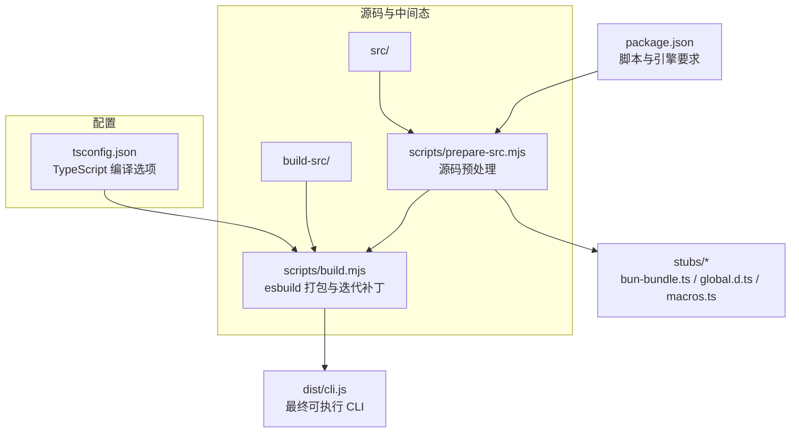
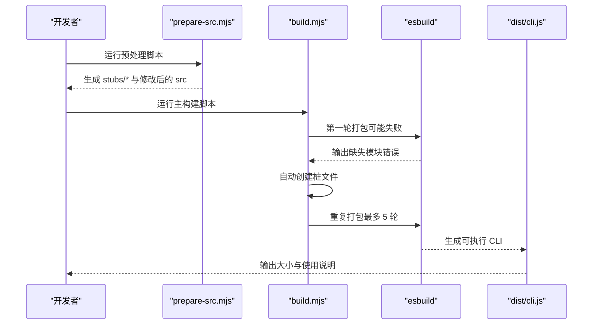
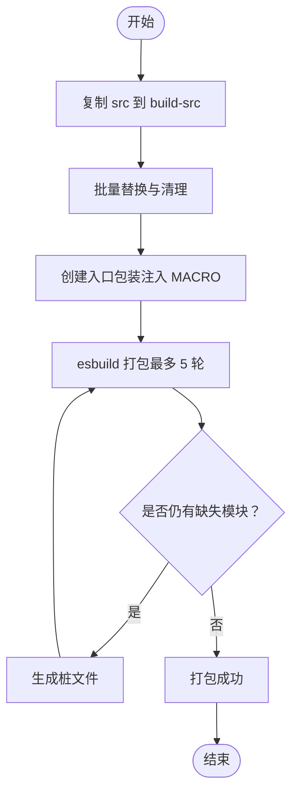
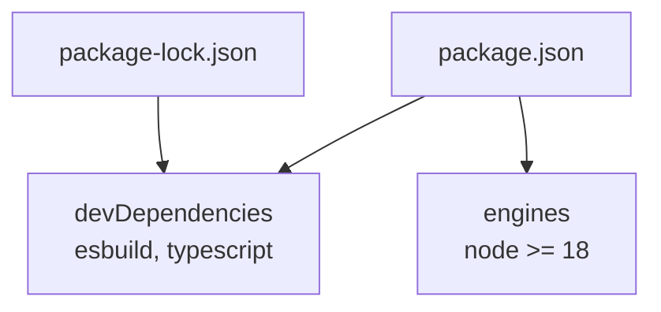

# 构建和部署

<cite>
**本文引用的文件**
- [package.json](file://package.json)
- [tsconfig.json](file://tsconfig.json)
- [README.md](file://README.md)
- [QUICKSTART.md](file://QUICKSTART.md)
- [scripts/build.mjs](file://scripts/build.mjs)
- [scripts/prepare-src.mjs](file://scripts/prepare-src.mjs)
- [scripts/stub-modules.mjs](file://scripts/stub-modules.mjs)
- [scripts/transform.mjs](file://scripts/transform.mjs)
- [stubs/bun-bundle.ts](file://stubs/bun-bundle.ts)
- [stubs/global.d.ts](file://stubs/global.d.ts)
- [stubs/macros.ts](file://stubs/macros.ts)
- [.gitignore](file://.gitignore)
- [package-lock.json](file://package-lock.json)
</cite>

## 目录
1. [简介](#简介)
2. [项目结构](#项目结构)
3. [核心组件](#核心组件)
4. [架构总览](#架构总览)
5. [详细组件分析](#详细组件分析)
6. [依赖分析](#依赖分析)
7. [性能考虑](#性能考虑)
8. [故障排除指南](#故障排除指南)
9. [结论](#结论)
10. [附录](#附录)

## 简介
本文件面向希望在本地构建与部署 Claude Code 的工程师与研究者，系统性阐述其构建系统、TypeScript 编译配置、依赖与打包策略、发布与版本管理、开发与生产环境部署、性能优化与资源压缩、构建产物结构与优化技术，以及常见问题排查方法。  
项目以“最佳努力”方式在 Node.js + esbuild 环境下完成可运行的单文件 CLI（dist/cli.js），但源码中大量使用 Bun 编译期特性（如 feature()、MACRO 宏、bun:bundle）导致完全等价复刻需要 Bun 运行时。本文提供分步骤的修复路径与替代方案。

## 项目结构
- 核心目录与职责
  - scripts：构建脚本集合，负责源码预处理、特征门替换、esbuild 打包与迭代补丁生成
  - src：TypeScript 源代码（约 1884 文件，51 万行）
  - stubs：为 Bun 编译期特性提供的类型与运行时桩（如 bun-bundle.ts、global.d.ts、macros.ts）
  - dist：构建输出目录（生成单文件 CLI）
  - build-src：构建脚本复制与转换后的中间工作区
  - node_modules：npm 依赖（由 package-lock.json 锁定）

**图表来源**
- [package.json](file://package.json)
- [scripts/prepare-src.mjs](file://scripts/prepare-src.mjs)
- [scripts/build.mjs](file://scripts/build.mjs)
- [tsconfig.json](file://tsconfig.json)

**章节来源**
- [package.json](file://package.json)
- [tsconfig.json](file://tsconfig.json)
- [README.md](file://README.md)
- [.gitignore](file://.gitignore)

## 核心组件
- 构建脚本
  - scripts/prepare-src.mjs：对源码进行“预处理”，将 bun:bundle 导入替换为本地桩，并注入 MACRO 常量声明，便于后续 esbuild 处理
  - scripts/build.mjs：主构建脚本，执行拷贝、多次转换、入口包装、esbuild 打包与缺失模块的自动桩生成
  - scripts/stub-modules.mjs：解析 esbuild 报错中的缺失模块，自动生成桩文件并尝试再次打包
  - scripts/transform.mjs：另一种构建策略（较旧），通过 esbuild define 注入 MACRO 并循环生成桩
- 类型与桩
  - stubs/bun-bundle.ts：提供 feature() 桩函数（返回 false）
  - stubs/global.d.ts：声明全局 MACRO 类型
  - stubs/macros.ts：声明全局 MACRO 接口（供 TS 检查）
- TypeScript 配置
  - tsconfig.json：目标 ES2022、模块系统 ESNext、bundler 解析器、开启 sourceMap、声明文件输出、路径映射等

**章节来源**
- [scripts/prepare-src.mjs](file://scripts/prepare-src.mjs)
- [scripts/build.mjs](file://scripts/build.mjs)
- [scripts/stub-modules.mjs](file://scripts/stub-modules.mjs)
- [scripts/transform.mjs](file://scripts/transform.mjs)
- [stubs/bun-bundle.ts](file://stubs/bun-bundle.ts)
- [stubs/global.d.ts](file://stubs/global.d.ts)
- [stubs/macros.ts](file://stubs/macros.ts)
- [tsconfig.json](file://tsconfig.json)

## 架构总览
从源码到可执行 CLI 的端到端流程如下：

**图表来源**
- [scripts/prepare-src.mjs](file://scripts/prepare-src.mjs)
- [scripts/build.mjs](file://scripts/build.mjs)

## 详细组件分析

### 构建脚本：prepare-src.mjs
- 功能要点
  - 将所有引入 bun:bundle 的语句替换为本地桩导入，修正相对路径深度
  - 将 MACRO.X 替换为字符串字面量，确保 esbuild 不报未定义
  - 生成 bun-ffi.ts 与 global.d.ts 类型桩，避免编译期类型错误
- 关键行为
  - 遍历 src 下的 TS/TSX 文件，按需写回
  - 输出已修补文件数量统计

**章节来源**
- [scripts/prepare-src.mjs](file://scripts/prepare-src.mjs)

### 构建脚本：build.mjs
- 功能要点
  - 清理/创建 build-src，复制 src 与 stubs
  - 多轮转换：feature('X') → false；MACRO.X → 字符串；移除 bun:bundle 导入；清理 global.d.ts 引用
  - 创建入口包装文件，注入全局 MACRO
  - 使用 esbuild 打包，最多 5 轮：若报“无法解析模块”，则解析缺失模块并生成桩后重试
- 错误处理
  - 若 5 轮后仍失败，打印“transformed source”位置，指导手动修复

**图表来源**
- [scripts/build.mjs](file://scripts/build.mjs)

**章节来源**
- [scripts/build.mjs](file://scripts/build.mjs)

### 构建脚本：stub-modules.mjs
- 功能要点
  - 先尝试一次 esbuild，解析“无法解析模块”的列表
  - 对每个缺失模块，定位导入它的源文件，推断绝对路径并创建桩
  - 支持 .d.ts、文本资产与 JS/TS 模块三类桩
  - 再次尝试打包并输出结果

**章节来源**
- [scripts/stub-modules.mjs](file://scripts/stub-modules.mjs)

### 构建脚本：transform.mjs
- 功能要点
  - 复制 src 与 stubs 到 build-src
  - 将 bun:bundle 导入替换为本地桩
  - 在入口包装中注入全局 MACRO
  - 使用 esbuild 打包，支持 --minify 参数
- 适用场景
  - 作为 build.mjs 的替代或补充策略

**章节来源**
- [scripts/transform.mjs](file://scripts/transform.mjs)

### 类型与桩：stubs/*
- bun-bundle.ts：提供 feature(flag) 桩函数，返回 false，模拟 Bun 编译期 feature() 的“关闭”分支
- global.d.ts：声明全局 MACRO 类型，避免 TS 未定义错误
- macros.ts：声明全局接口，配合入口包装中的运行时赋值

**章节来源**
- [stubs/bun-bundle.ts](file://stubs/bun-bundle.ts)
- [stubs/global.d.ts](file://stubs/global.d.ts)
- [stubs/macros.ts](file://stubs/macros.ts)

### TypeScript 配置：tsconfig.json
- 编译目标与模块系统
  - target: ES2022
  - module: ESNext
  - moduleResolution: bundler
- 严格性与检查
  - skipLibCheck: true
  - strict: false
  - allowSyntheticDefaultImports: true
  - esModuleInterop: true
- 输出与路径
  - outDir: dist
  - rootDir: src
  - baseUrl: .
  - paths: 映射 src/* 与 bun:bundle 桩
- 资源与 sourcemap
  - declaration/declarationMap/sourceMap: 开启
  - jsx: react-jsx
  - lib: ES2022, DOM
- 包含与排除
  - include: src/**/*, stubs/**/*
  - exclude: node_modules, dist

**章节来源**
- [tsconfig.json](file://tsconfig.json)

## 依赖分析
- 脚本与工具
  - esbuild：用于打包与生成 sourcemap
  - TypeScript：类型检查与编译（与 esbuild 协作）
- 运行时与引擎
  - Node.js >= 18（engines.node）
- 依赖锁定
  - package-lock.json 记录了 esbuild 与 TypeScript 的版本

**图表来源**
- [package.json](file://package.json)
- [package-lock.json](file://package-lock.json)

**章节来源**
- [package.json](file://package.json)
- [package-lock.json](file://package-lock.json)

## 性能考虑
- 打包体积
  - 发布包为单文件 CLI（约 12MB），构建脚本会输出最终文件大小
- 压缩与最小化
  - esbuild 默认不启用最小化，可在某些脚本中传入 --minify 参数以减小体积
- 源码映射
  - 启用 sourceMap 便于调试，但会增加体积与构建时间
- 特征门与死代码消除
  - 由于 Bun 编译期 feature() 无法在 esbuild 中完全复现，部分分支仍可能被保留，建议通过脚本逐步生成桩以减少冗余

**章节来源**
- [scripts/build.mjs](file://scripts/build.mjs)
- [scripts/transform.mjs](file://scripts/transform.mjs)
- [tsconfig.json](file://tsconfig.json)

## 故障排除指南
- 常见问题与修复
  - 缺少 108 个特性模块：这些模块在发布包中不存在，需手动创建桩文件
    - 使用 scripts/stub-modules.mjs 解析缺失模块并生成桩
    - 或参考 QUICKSTART.md 的步骤逐个创建
  - MACRO 未定义：确保入口包装中注入全局 MACRO，或使用 prepare-src.mjs 生成类型声明
  - bun:bundle 导入：确保 prepare-src.mjs 已将 bun:bundle 替换为本地桩
  - esbuild 未安装：脚本会自动安装，也可手动执行 npm install --save-dev esbuild
- 诊断命令
  - 查看未解析模块：使用 esbuild 命令行输出中的“Could not resolve”信息
  - 重新运行构建：修复桩后再次执行 node scripts/build.mjs

**章节来源**
- [scripts/stub-modules.mjs](file://scripts/stub-modules.mjs)
- [scripts/prepare-src.mjs](file://scripts/prepare-src.mjs)
- [QUICKSTART.md](file://QUICKSTART.md)

## 结论
Claude Code 的构建系统以“最佳努力”为目标，在 Node.js + esbuild 环境下实现了可运行的 CLI。由于源码大量依赖 Bun 编译期特性，完全等价复刻需要 Bun 运行时。通过预处理脚本、入口包装、迭代式桩生成与 esbuild 打包，可以稳定产出 dist/cli.js。建议在生产环境中优先使用官方发布的单文件 CLI，若需二次构建，请遵循本文提供的步骤与排障建议。

## 附录

### 开发环境搭建
- 前置条件
  - Node.js >= 18，npm >= 9
- 快速步骤
  - 安装 esbuild：npm install --save-dev esbuild
  - 运行构建：node scripts/build.mjs
  - 验证输出：node dist/cli.js --version

**章节来源**
- [QUICKSTART.md](file://QUICKSTART.md)
- [package.json](file://package.json)

### TypeScript 编译与优化
- 编译选项要点
  - 目标与模块：ES2022 + ESNext + bundler
  - 严格性：skipLibCheck=true，strict=false
  - 输出：outDir=dist，rootDir=src，开启 declaration/declarationMap/sourceMap
  - JSX：react-jsx
- 优化建议
  - 在 CI 中仅做类型检查（tsc --noEmit），构建阶段使用 esbuild
  - 保持 paths 与 baseUrl 清晰，避免解析歧义

**章节来源**
- [tsconfig.json](file://tsconfig.json)

### 发布流程与版本管理
- 版本号
  - package.json 中 version 为 2.1.88
- 发布策略
  - 发布包内含单文件 CLI（dist/cli.js），无需二次构建即可直接运行
  - 如需从源码发布，需遵循构建脚本与桩生成流程

**章节来源**
- [package.json](file://package.json)
- [README.md](file://README.md)

### 生产环境部署指南
- 直接运行
  - 使用 dist/cli.js：node dist/cli.js --version
- 安装与使用
  - 全局安装：npm install -g .
  - 命令行：claude --version
- 注意事项
  - 需要设置 Anthropic API 密钥或先登录
  - 若自行构建，确保已生成 dist/cli.js 并正确注入全局 MACRO

**章节来源**
- [QUICKSTART.md](file://QUICKSTART.md)
- [README.md](file://README.md)

### 构建产物结构与优化
- 产物
  - dist/cli.js：单文件可执行 CLI
  - dist/*.map：sourcemap（若启用）
- 优化技术
  - esbuild 打包与迭代补丁生成
  - 可选 --minify 减小体积
  - 通过 stubs 减少无效依赖与冗余模块

**章节来源**
- [scripts/build.mjs](file://scripts/build.mjs)
- [scripts/transform.mjs](file://scripts/transform.mjs)
- [tsconfig.json](file://tsconfig.json)