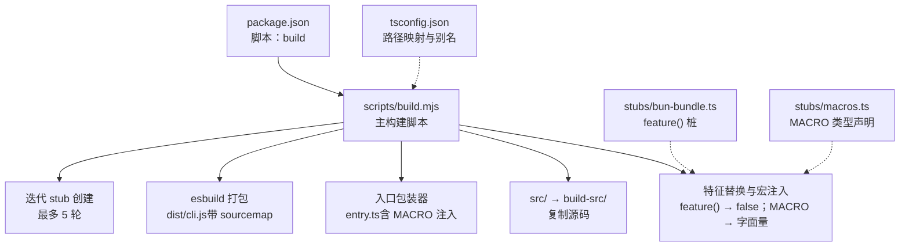
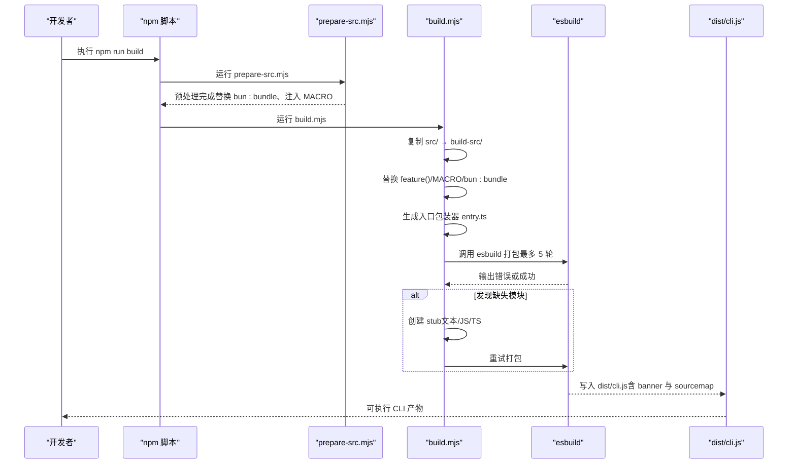
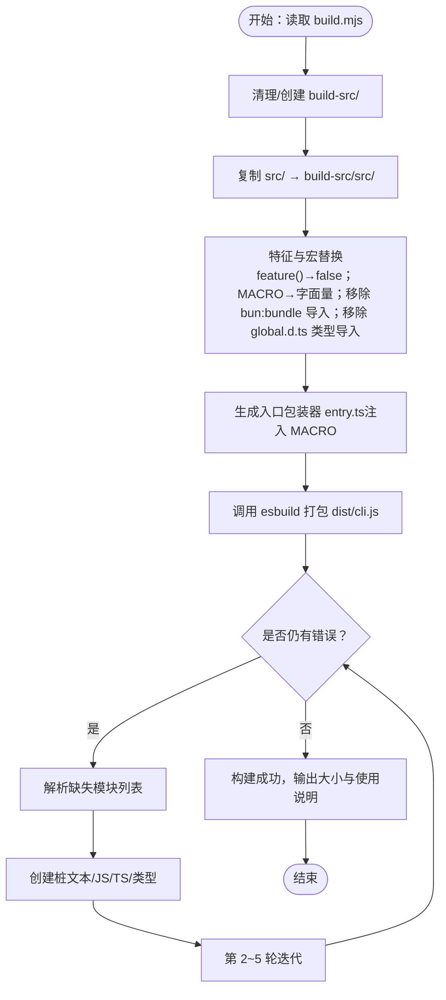
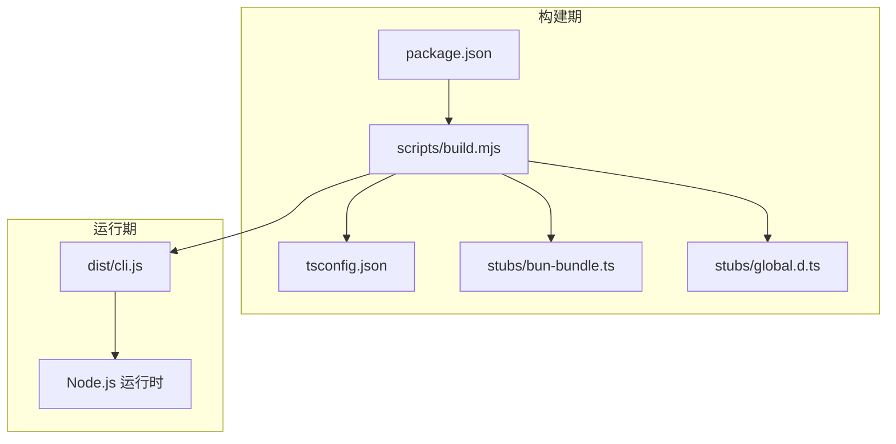

# 构建系统

<cite>
**本文引用的文件**
- [scripts/build.mjs](file://scripts/build.mjs)
- [scripts/prepare-src.mjs](file://scripts/prepare-src.mjs)
- [scripts/stub-modules.mjs](file://scripts/stub-modules.mjs)
- [scripts/transform.mjs](file://scripts/transform.mjs)
- [package.json](file://package.json)
- [tsconfig.json](file://tsconfig.json)
- [stubs/bun-bundle.ts](file://stubs/bun-bundle.ts)
- [stubs/macros.ts](file://stubs/macros.ts)
- [stubs/global.d.ts](file://stubs/global.d.ts)
- [src/main.tsx](file://src/main.tsx)
- [src/entrypoints/init.ts](file://src/entrypoints/init.ts)
</cite>

## 目录
1. [简介](#简介)
2. [项目结构](#项目结构)
3. [核心组件](#核心组件)
4. [架构总览](#架构总览)
5. [详细组件分析](#详细组件分析)
6. [依赖关系分析](#依赖关系分析)
7. [性能考量](#性能考量)
8. [故障排除指南](#故障排除指南)
9. [结论](#结论)
10. [附录](#附录)

## 简介
本文件面向 Claude Code 的构建系统，聚焦于构建脚本 build.mjs 的工作原理与实现细节，涵盖以下主题：
- 源码复制与准备
- 编译时宏替换（feature() 函数替换、MACRO 常量注入）
- Bun 特性移除与模块桩（stub）创建
- 五轮迭代构建策略与错误处理
- esbuild 配置参数与打包优化
- 构建产物结构与输出格式
- 常见问题排查与修复建议
- 完整构建流程与命令示例

## 项目结构
构建系统围绕 scripts 目录下的多个脚本协同工作，并通过 stubs 提供缺失的运行时桩与类型声明，最终由 esbuild 将源码打包为单一可执行的 dist/cli.js。

图表来源
- [scripts/build.mjs:53-246](file://scripts/build.mjs#L53-L246)
- [package.json:7-11](file://package.json#L7-L11)
- [tsconfig.json:19-22](file://tsconfig.json#L19-L22)

章节来源
- [scripts/build.mjs:53-246](file://scripts/build.mjs#L53-L246)
- [package.json:7-11](file://package.json#L7-L11)
- [tsconfig.json:19-22](file://tsconfig.json#L19-L22)

## 核心组件
- 主构建脚本：负责复制源码、进行特征与宏替换、生成入口包装器、调用 esbuild 并在失败时自动创建 stub 进行迭代修复。
- 预处理脚本：在完整构建前对源码进行预处理，替换 bun:bundle 导入并注入 MACRO 常量。
- stub-modules 脚本：解析 esbuild 错误，定位缺失模块并批量生成桩文件。
- transform 脚本：另一种构建策略，直接复制 stubs 并通过 esbuild --define 注入 MACRO。
- 配置与桩文件：tsconfig.json 提供路径映射，stubs 提供 bun:bundle 与 MACRO 的运行时替代。

章节来源
- [scripts/build.mjs:53-246](file://scripts/build.mjs#L53-L246)
- [scripts/prepare-src.mjs:1-116](file://scripts/prepare-src.mjs#L1-L116)
- [scripts/stub-modules.mjs:1-159](file://scripts/stub-modules.mjs#L1-L159)
- [scripts/transform.mjs:1-144](file://scripts/transform.mjs#L1-L144)
- [tsconfig.json:19-22](file://tsconfig.json#L19-L22)
- [stubs/bun-bundle.ts:1-5](file://stubs/bun-bundle.ts#L1-L5)
- [stubs/macros.ts:1-21](file://stubs/macros.ts#L1-L21)

## 架构总览
下图展示了从源码到最终产物的端到端流程，以及各阶段的关键动作与交互。

图表来源
- [package.json:7-11](file://package.json#L7-L11)
- [scripts/prepare-src.mjs:79-116](file://scripts/prepare-src.mjs#L79-L116)
- [scripts/build.mjs:53-246](file://scripts/build.mjs#L53-L246)

## 详细组件分析

### 主构建脚本 build.mjs
- 目标与职责
  - 复制 src/ 到 build-src/，保持原始源码不受污染
  - 对 feature('FLAG')、MACRO 常量、bun:bundle 导入与全局类型导入进行替换
  - 生成入口包装器 entry.ts，注入全局 MACRO
  - 使用 esbuild 打包为 dist/cli.js，并支持最多 5 轮迭代以自动创建缺失模块的桩
- 关键步骤
  - 源码复制与清理
  - 特征与宏替换
  - 入口包装器生成
  - esbuild 打包与错误解析
  - 自动桩创建与重试
- esbuild 参数要点
  - 平台与目标：--platform=node、--target=node18
  - 输出格式：--format=esm
  - 外部化策略：--packages=external、--external:bun:*
  - 源码映射：--sourcemap
  - 日志级别：--log-level=error、--log-limit=0
  - Banner：添加 shebang 与版权信息
- 迭代策略
  - 解析 esbuild 输出中的“无法解析模块”错误
  - 过滤 node: 与 bun: 前缀的内置模块
  - 为缺失模块创建桩（文本资产、JS/TS 模块、类型声明）
  - 最多 5 轮，若仍失败则输出失败信息与手动修复指引

图表来源
- [scripts/build.mjs:53-246](file://scripts/build.mjs#L53-L246)

章节来源
- [scripts/build.mjs:53-246](file://scripts/build.mjs#L53-L246)

### 预处理脚本 prepare-src.mjs
- 目标与职责
  - 在完整构建前对源码进行预处理，确保在非 Bun 环境下可被 esbuild 正常解析
  - 将 import { feature } from 'bun:bundle' 替换为本地 stub
  - 将 MACRO.X 替换为字符串字面量
  - 生成缺失的类型声明（如 bun:ffi 与 global MACRO 类型）
- 关键点
  - 递归遍历 src 下的 TS/TSX 文件
  - 修正相对路径以适配不同目录深度
  - 生成 stubs/bun-ffi.ts 与 stubs/global.d.ts

章节来源
- [scripts/prepare-src.mjs:1-116](file://scripts/prepare-src.mjs#L1-L116)

### stub-modules.mjs（可选构建策略）
- 目标与职责
  - 通过解析 esbuild 输出，收集所有“无法解析”的模块
  - 将相对导入解析为绝对路径并批量创建桩
  - 成功后再次尝试打包，失败则提示重复运行以继续迭代
- 适用场景
  - 当 build.mjs 的自动桩策略不足以覆盖复杂依赖时，可单独运行此脚本进行精细化修复

章节来源
- [scripts/stub-modules.mjs:1-159](file://scripts/stub-modules.mjs#L1-L159)

### transform.mjs（另一种构建策略）
- 目标与职责
  - 复制 src 与 stubs 到 build-src
  - 将 bun:bundle 导入替换为本地 stub
  - 通过 esbuild --define 注入 MACRO 常量
  - 打包为 dist/cli.js
- 与 build.mjs 的差异
  - 更偏向于直接注入而非运行时包装
  - 支持可选的最小化参数

章节来源
- [scripts/transform.mjs:1-144](file://scripts/transform.mjs#L1-L144)

### 配置与桩文件
- tsconfig.json
  - 提供 bun:bundle → stubs/bun-bundle.ts 的路径映射
  - 启用 bundler 模块解析、声明与 sourcemap
- stubs/bun-bundle.ts
  - 提供 feature(flag) 的运行时桩，返回 false
- stubs/macros.ts / stubs/global.d.ts
  - 提供 MACRO 常量的类型声明与运行时值

章节来源
- [tsconfig.json:19-22](file://tsconfig.json#L19-L22)
- [stubs/bun-bundle.ts:1-5](file://stubs/bun-bundle.ts#L1-L5)
- [stubs/macros.ts:1-21](file://stubs/macros.ts#L1-L21)
- [stubs/global.d.ts:1-12](file://stubs/global.d.ts#L1-L12)

### 编译时指令与宏处理
- feature('FLAG')
  - 在 Bun 原生构建中由编译时内联替换为布尔字面量
  - 在本构建系统中，build.mjs 与 prepare-src.mjs 将其替换为 false，从而实现“无条件关闭”特性
- MACRO 常量
  - 在 Bun 原生构建中由 --define 注入为字符串字面量
  - 在本构建系统中，通过入口包装器注入全局对象或在 transform.mjs 中通过 --define 注入
- bun:bundle 导入
  - 在 Bun 原生构建中提供 feature() 实现
  - 在本构建系统中替换为本地 stub，避免运行时依赖

章节来源
- [scripts/build.mjs:86-110](file://scripts/build.mjs#L86-L110)
- [scripts/prepare-src.mjs:40-76](file://scripts/prepare-src.mjs#L40-L76)
- [stubs/bun-bundle.ts:1-5](file://stubs/bun-bundle.ts#L1-L5)
- [stubs/macros.ts:1-21](file://stubs/macros.ts#L1-L21)

### 构建产物结构与输出格式
- 输出位置：dist/cli.js
- 产物特性：
  - 单文件 ESM 包
  - 带 shebang 与版权声明的 banner
  - 生成 sourcemap 便于调试
  - 体积统计与使用说明输出

章节来源
- [scripts/build.mjs:136-163](file://scripts/build.mjs#L136-L163)
- [scripts/build.mjs:231-236](file://scripts/build.mjs#L231-L236)

## 依赖关系分析
- 构建脚本依赖
  - build.mjs 依赖 esbuild（自动安装或通过 npm 安装）
  - tsconfig.json 提供路径映射，使 bun:bundle 能解析到 stubs/bun-bundle.ts
- 模块依赖与外部化
  - 外部化策略：--packages=external 与 --external:bun:*，避免将 node_modules 与 Bun 特性打包进产物
- 运行时依赖
  - dist/cli.js 作为独立可执行文件，需在 Node.js 环境运行

图表来源
- [package.json:7-11](file://package.json#L7-L11)
- [scripts/build.mjs:134-163](file://scripts/build.mjs#L134-L163)
- [tsconfig.json:19-22](file://tsconfig.json#L19-L22)
- [stubs/bun-bundle.ts:1-5](file://stubs/bun-bundle.ts#L1-L5)
- [stubs/global.d.ts:1-12](file://stubs/global.d.ts#L1-L12)

章节来源
- [package.json:7-11](file://package.json#L7-L11)
- [scripts/build.mjs:134-163](file://scripts/build.mjs#L134-L163)
- [tsconfig.json:19-22](file://tsconfig.json#L19-L22)

## 性能考量
- 迭代构建策略
  - 通过最多 5 轮自动创建桩，减少手工干预，提升成功率
- 外部化与最小化
  - 使用 --packages=external 与 --external:bun:* 控制打包范围，降低产物体积
- 源码映射
  - 生成 sourcemap 便于调试，但会增加体积与构建时间
- 平台与目标
  - 目标平台与版本固定，有助于稳定构建与运行

## 故障排除指南
- 常见错误与原因
  - “无法解析模块”：通常由相对导入未找到对应文件导致
  - “缺少 Bun 特性”：bun:bundle 或 bun:ffi 等在非 Bun 环境不可用
  - “MACRO 未定义”：未正确注入全局 MACRO 或未通过 --define 注入
- 修复步骤
  - 使用 build.mjs 的自动桩策略：运行脚本后根据提示检查 build-src/ 并补充缺失文件
  - 手动创建桩：在 build-src/src/ 对应路径创建空文件或导出空函数
  - 确认 tsconfig.json 的路径映射与 stubs 存在
  - 若仍失败，参考脚本输出的错误行数定位具体文件并修复导入路径
- 退出码与后续操作
  - 构建失败时，脚本会输出失败信息与手动修复指引，按提示补充桩后重新运行

章节来源
- [scripts/build.mjs:175-245](file://scripts/build.mjs#L175-L245)

## 结论
build.mjs 通过“源码复制 + 特征与宏替换 + 入口包装 + esbuild 打包 + 五轮迭代桩创建”的组合策略，在非 Bun 环境下实现了对 Claude Code 的最佳努力构建。该方案兼顾了可维护性与可扩展性，适合研究与二次开发场景。对于需要更严格原生行为的场景，建议使用 Bun 原生构建或参考 transform.mjs 的策略。

## 附录

### 完整构建流程与命令示例
- 安装依赖与准备
  - npm ci 或 npm install
- 执行构建
  - npm run build
- 运行产物
  - node dist/cli.js --version
  - node dist/cli.js -p "Hello"

章节来源
- [package.json:7-11](file://package.json#L7-L11)