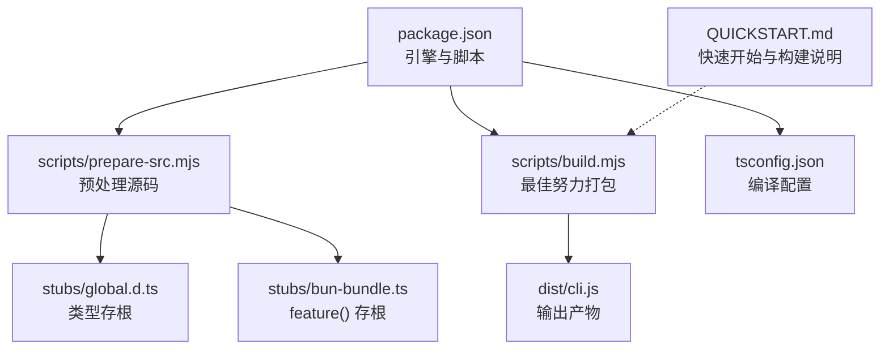
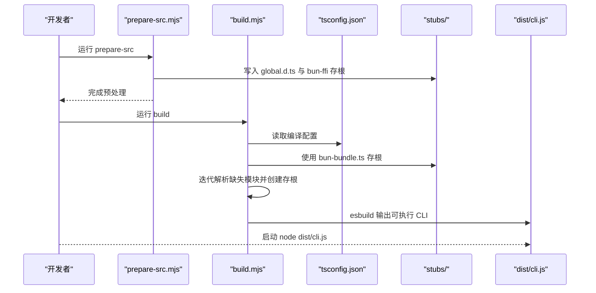
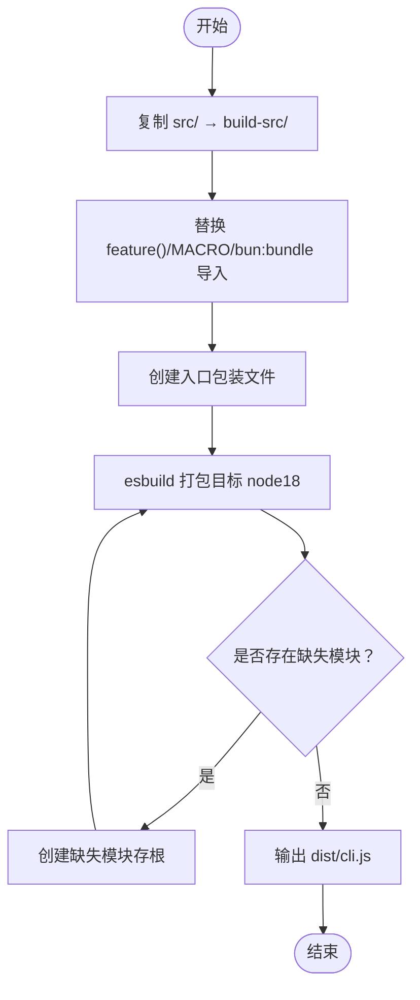
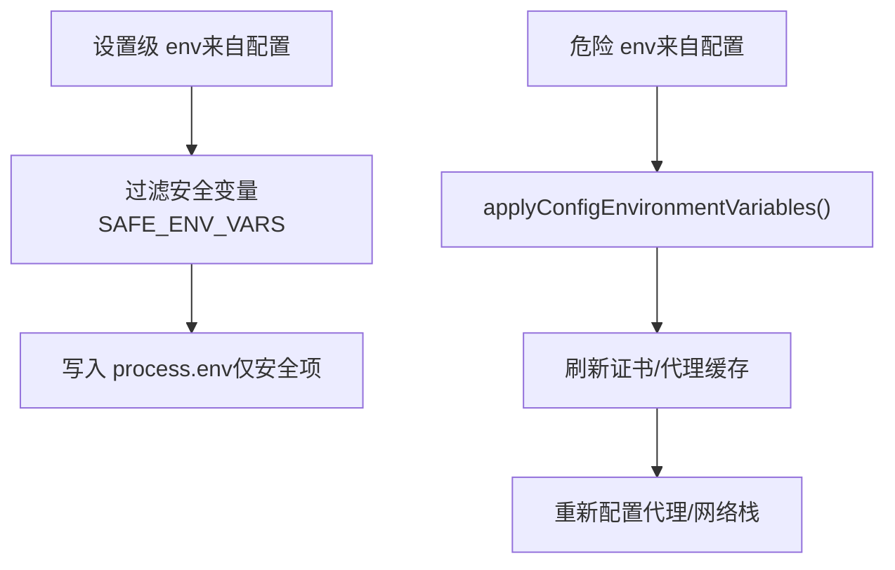
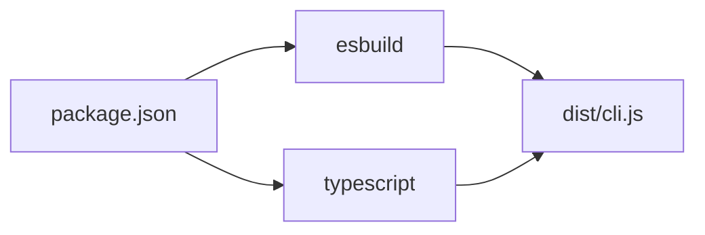

# 环境配置

<cite>
**本文引用的文件**
- [package.json](file://package.json)
- [tsconfig.json](file://tsconfig.json)
- [QUICKSTART.md](file://QUICKSTART.md)
- [scripts/build.mjs](file://scripts/build.mjs)
- [scripts/prepare-src.mjs](file://scripts/prepare-src.mjs)
- [stubs/bun-bundle.ts](file://stubs/bun-bundle.ts)
- [stubs/global.d.ts](file://stubs/global.d.ts)
- [src/utils/sessionEnvVars.ts](file://src/utils/sessionEnvVars.ts)
- [src/utils/managedEnv.ts](file://src/utils/managedEnv.ts)
- [src/bootstrap/state.ts](file://src/bootstrap/state.ts)
</cite>

## 目录
1. [简介](#简介)
2. [项目结构](#项目结构)
3. [核心组件](#核心组件)
4. [架构总览](#架构总览)
5. [详细组件分析](#详细组件分析)
6. [依赖分析](#依赖分析)
7. [性能考虑](#性能考虑)
8. [故障排查指南](#故障排查指南)
9. [结论](#结论)
10. [附录](#附录)

## 简介
本文件面向 Claude Code 的开发者，提供从零到一的开发环境配置指南。内容涵盖：
- Node.js 版本要求与环境变量管理
- IDE 与编辑器推荐配置（含 VS Code）
- 开发脚手架与构建流程（包含最佳努力构建与完整构建路径）
- 环境变量在不同运行阶段的应用（会话级、设置级、进程级）
- 本地开发服务器与启动命令
- 热重载与实时编译机制说明
- 跨平台兼容性与工具链建议（linter/formatter/debugger）

## 项目结构
该仓库采用“源码 + 构建脚本 + 存根”的组织方式：
- 源码位于 src/
- 构建脚本位于 scripts/（构建、准备源码）
- 存根位于 stubs/（用于模拟 Bun 编译期特性）
- TypeScript 配置位于 tsconfig.json
- 快速开始与构建说明位于 QUICKSTART.md
- 根包配置位于 package.json（Node 引擎版本、脚本）

图表来源
- [package.json](file://package.json)
- [scripts/prepare-src.mjs](file://scripts/prepare-src.mjs)
- [scripts/build.mjs](file://scripts/build.mjs)
- [stubs/global.d.ts](file://stubs/global.d.ts)
- [stubs/bun-bundle.ts](file://stubs/bun-bundle.ts)
- [tsconfig.json](file://tsconfig.json)
- [QUICKSTART.md](file://QUICKSTART.md)

章节来源
- [package.json](file://package.json)
- [tsconfig.json](file://tsconfig.json)
- [QUICKSTART.md](file://QUICKSTART.md)

## 核心组件
- Node.js 引擎与脚本
  - engines.node 要求：>= 18
  - 脚本：prepare-src、build、check、start
- TypeScript 编译配置
  - 目标与模块解析策略、路径映射、声明与 sourcemap、jsx、lib 等
- 构建流水线
  - prepare-src.mjs：替换 Bun 编译期宏与导入，生成全局类型存根
  - build.mjs：拷贝并转换源码、迭代创建缺失模块存根、esbuild 打包
- 存根
  - bun-bundle.ts：feature() 存根返回 false
  - global.d.ts：MACRO 全局类型声明
- 环境变量
  - 会话级：通过 /env 设置，仅作用于子进程
  - 设置级：从配置应用到 process.env，可能包含危险变量，需信任建立后应用

章节来源
- [package.json](file://package.json)
- [tsconfig.json](file://tsconfig.json)
- [scripts/prepare-src.mjs](file://scripts/prepare-src.mjs)
- [scripts/build.mjs](file://scripts/build.mjs)
- [stubs/bun-bundle.ts](file://stubs/bun-bundle.ts)
- [stubs/global.d.ts](file://stubs/global.d.ts)
- [src/utils/sessionEnvVars.ts](file://src/utils/sessionEnvVars.ts)
- [src/utils/managedEnv.ts](file://src/utils/managedEnv.ts)

## 架构总览
下图展示了从源码到可执行 CLI 的关键路径，以及环境变量注入点。

图表来源
- [scripts/prepare-src.mjs](file://scripts/prepare-src.mjs)
- [scripts/build.mjs](file://scripts/build.mjs)
- [tsconfig.json](file://tsconfig.json)
- [stubs/bun-bundle.ts](file://stubs/bun-bundle.ts)
- [stubs/global.d.ts](file://stubs/global.d.ts)

## 详细组件分析

### Node.js 与引擎版本
- 引擎要求：>= 18
- 建议使用 Node.js 18+，以确保 esbuild 与 TypeScript 编译链稳定
- 若需要完整构建体验（包含 Bun 编译期特性），请参考 QUICKSTART 的“完整构建”说明

章节来源
- [package.json](file://package.json)

### TypeScript 编译配置（tsconfig.json）
- 目标与模块系统：ES2022 + ESNext
- 模块解析：bundler
- JSX：react-jsx
- 路径别名：src/* 映射
- 类型与 sourcemap：开启声明与 sourcemap
- lib：ES2022 + DOM
- include/exclude：包含 src 与 stubs，排除 node_modules 与 dist

章节来源
- [tsconfig.json](file://tsconfig.json)

### 构建脚本与最佳努力打包（scripts/build.mjs）
- 步骤概览
  - 复制 src/ 到 build-src/
  - 替换 feature('X') → false；替换 MACRO.X → 字面量；移除 bun:bundle 导入；清理类型导入
  - 创建入口包装文件
  - 迭代 esbuild 打包：收集“无法解析模块”→创建存根→重试（最多 5 轮）
- 输出：dist/cli.js（带 banner 与 sourcemap）

图表来源
- [scripts/build.mjs](file://scripts/build.mjs)

章节来源
- [scripts/build.mjs](file://scripts/build.mjs)

### 源码预处理（scripts/prepare-src.mjs）
- 功能
  - 将 import { feature } from 'bun:bundle' 替换为 stubs/bun-bundle.js
  - 将 MACRO.X 替换为字符串字面量
  - 生成 global.d.ts 类型声明
  - 生成 bun-ffi 存根（上游代理使用）
- 影响：使源码可在非 Bun 环境下被 esbuild 处理

章节来源
- [scripts/prepare-src.mjs](file://scripts/prepare-src.mjs)
- [stubs/bun-bundle.ts](file://stubs/bun-bundle.ts)
- [stubs/global.d.ts](file://stubs/global.d.ts)

### 环境变量管理与应用
- 会话级环境变量（/env）
  - 仅对子进程生效，不污染 REPL 进程本身
  - 提供增删清空接口，便于临时覆盖
- 设置级环境变量（applyConfigEnvironmentVariables）
  - 应用来自全局配置与本地设置的 env
  - 包含潜在危险变量（如 PATH、LD_PRELOAD 等），应在信任建立后调用
  - 应用后会刷新证书、mTLS、代理缓存并重新配置代理

图表来源
- [src/utils/sessionEnvVars.ts](file://src/utils/sessionEnvVars.ts)
- [src/utils/managedEnv.ts](file://src/utils/managedEnv.ts)

章节来源
- [src/utils/sessionEnvVars.ts](file://src/utils/sessionEnvVars.ts)
- [src/utils/managedEnv.ts](file://src/utils/managedEnv.ts)

### 启动与运行（package.json 脚本）
- prepare-src：预处理源码，生成类型与存根
- build：先预处理，再打包
- check：预处理后进行类型检查
- start：运行 dist/cli.js

章节来源
- [package.json](file://package.json)

### 本地开发服务器与启动命令
- 推荐做法
  - 使用 npm 脚本完成预处理与打包
  - 通过 node dist/cli.js 启动 CLI
- 交互式与非交互式
  - 非交互：node dist/cli.js -p "<你的提示>"
  - 交互式：直接运行 node dist/cli.js 并进入 REPL

章节来源
- [package.json](file://package.json)
- [QUICKSTART.md](file://QUICKSTART.md)

### 热重载与实时编译
- 当前仓库未提供内置的热重载或实时编译服务
- 开发时建议：
  - 修改源码后重新运行 npm run build
  - 使用外部工具（如 nodemon 或自定义监听脚本）监控 src/ 并自动触发构建
  - 在 VS Code 中配置任务与启动配置，结合调试器进行断点调试

[本节为通用实践说明，不直接分析具体文件，故无“章节来源”]

### IDE 与编辑器配置（VS Code 与通用建议）
- VS Code 推荐设置
  - 扩展：TypeScript Importer、ESLint、Prettier、EditorConfig
  - 设置要点
    - editor.formatOnSave：启用保存即格式化
    - editor.codeActionsOnSave：启用 ESLint 自动修复
    - typescript.preferences.importModuleSpecifier：保持绝对路径或相对路径（按团队约定）
    - files.associations：为特定文件类型绑定语言模式
- 调试器
  - 使用 VS Code 的“运行与调试”面板，添加“Node: Attach”或“当前文件”配置
  - 通过 npm run build 生成 dist/cli.js 后，附加到 node 进程进行断点调试
- 其他编辑器
  - Vim/Neovim：配合 TypeScript 插件与 LSP
  - Emacs：使用 tide 或 lsp-mode
  - JetBrains：启用 TypeScript/ESLint 支持

[本节为通用实践说明，不直接分析具体文件，故无“章节来源”]

### 跨平台兼容性
- Node.js 目标：node18（esbuild 目标）
- 文件系统与路径
  - 代码中使用 realpathSync 与 normalize('NFC') 处理路径一致性
- 平台差异
  - Windows：注意路径分隔符与大小写敏感性；确保 esbuild 与 Node 版本匹配
  - macOS/Linux：遵循 POSIX 行为；注意符号链接解析

章节来源
- [scripts/build.mjs](file://scripts/build.mjs)
- [src/bootstrap/state.ts](file://src/bootstrap/state.ts)

## 依赖分析
- 构建依赖
  - esbuild：打包与目标平台设置
  - TypeScript：类型检查与编译
- 运行时
  - Node.js >= 18
  - 项目内依赖由 node_modules 提供（数量见 QUICKSTART）

图表来源
- [package.json](file://package.json)
- [scripts/build.mjs](file://scripts/build.mjs)

章节来源
- [package.json](file://package.json)
- [QUICKSTART.md](file://QUICKSTART.md)

## 性能考虑
- 构建性能
  - 迭代创建存根与多次 esbuild 重试会增加时间成本
  - 建议在 CI 中缓存 node_modules 与 dist，减少重复构建
- 运行性能
  - dist/cli.js 为单文件打包，启动较快
  - 会话持久化与压缩策略影响内存占用与 IO

[本节为通用指导，不直接分析具体文件，故无“章节来源”]

## 故障排查指南
- 构建失败：无法解析模块
  - 现象：esbuild 报错显示 Could not resolve
  - 处理：根据 build.mjs 的错误解析逻辑，自动创建缺失模块存根；也可手动在 build-src/src 下创建
- 特性门（feature）相关问题
  - 现象：某些功能未生效
  - 原因：build.mjs 将 feature('FLAG') 替换为 false，导致死代码消除分支被剔除
  - 处理：若需保留某特性，请在 Bun 内部构建中启用对应 FLAG
- 环境变量未生效
  - 会话级：确认通过 /env 设置且仅作用于子进程
  - 设置级：需在信任建立后调用 applyConfigEnvironmentVariables，并注意潜在危险变量

章节来源
- [scripts/build.mjs](file://scripts/build.mjs)
- [src/utils/sessionEnvVars.ts](file://src/utils/sessionEnvVars.ts)
- [src/utils/managedEnv.ts](file://src/utils/managedEnv.ts)

## 结论
- 本仓库提供了完整的“最佳努力构建”方案，可在 Node.js 环境下快速产出可执行 CLI
- 若需完整还原内部构建（含 Bun 编译期特性），需具备内部访问权限
- 开发者应重点关注环境变量的生命周期与作用域，避免在不安全的时机污染进程环境
- 建议在本地使用 VS Code 或其他编辑器配合 ESLint/Prettier 与调试器提升开发效率

[本节为总结性内容，不直接分析具体文件，故无“章节来源”]

## 附录

### 开发环境设置清单
- 工具链
  - Node.js >= 18
  - npm（>= 9）
  - esbuild（自动安装）
- 步骤
  - 预处理：npm run prepare-src
  - 构建：npm run build
  - 运行：npm start 或 node dist/cli.js
- 参考
  - QUICKSTART.md 提供更详细的构建与运行说明

章节来源
- [package.json](file://package.json)
- [QUICKSTART.md](file://QUICKSTART.md)