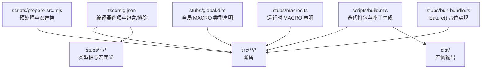
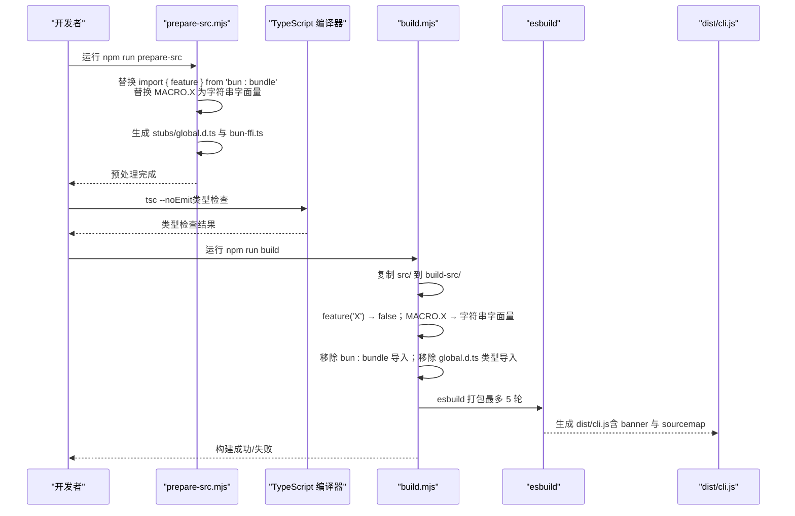
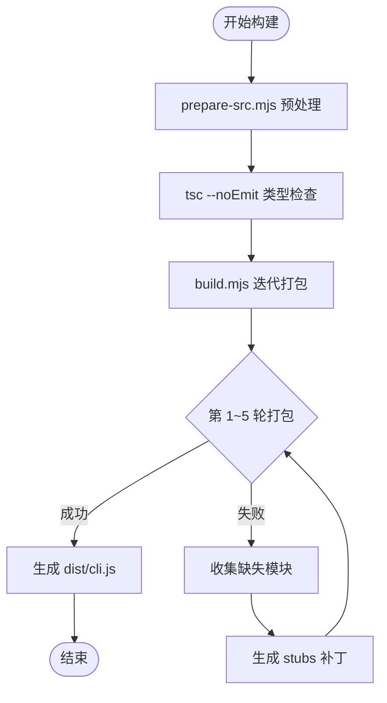
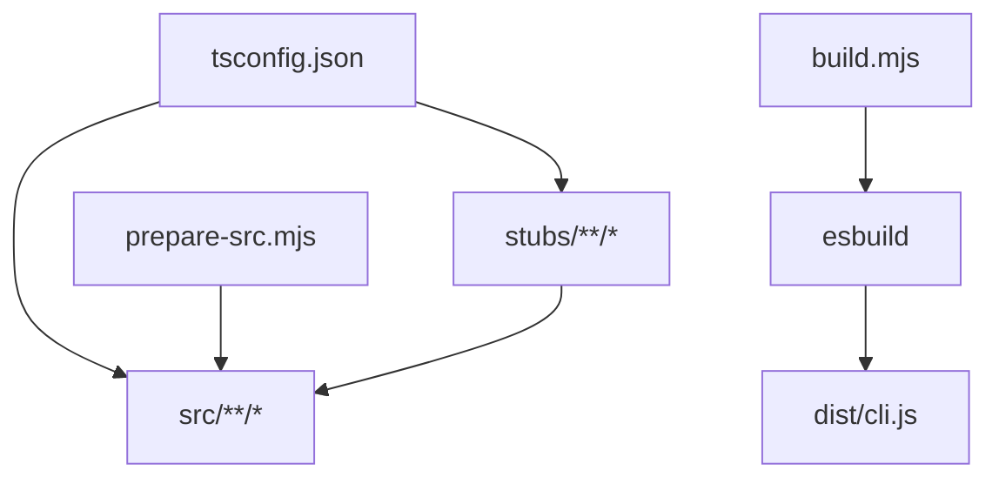

# 编译配置

<cite>
**本文引用的文件**
- [tsconfig.json](file://tsconfig.json)
- [package.json](file://package.json)
- [scripts/build.mjs](file://scripts/build.mjs)
- [scripts/prepare-src.mjs](file://scripts/prepare-src.mjs)
- [stubs/global.d.ts](file://stubs/global.d.ts)
- [stubs/macros.d.ts](file://stubs/macros.d.ts)
- [stubs/macros.ts](file://stubs/macros.ts)
- [stubs/bun-bundle.ts](file://stubs/bun-bundle.ts)
- [src/cli/update.ts](file://src/cli/update.ts)
</cite>

## 目录
1. [简介](#简介)
2. [项目结构](#项目结构)
3. [核心组件](#核心组件)
4. [架构总览](#架构总览)
5. [详细组件分析](#详细组件分析)
6. [依赖关系分析](#依赖关系分析)
7. [性能考量](#性能考量)
8. [故障排查指南](#故障排查指南)
9. [结论](#结论)
10. [附录](#附录)

## 简介
本文件面向 Claude Code 的 TypeScript 编译配置，系统性解析 tsconfig.json 的配置项、编译参数、类型检查策略与严格性设置，并深入说明全局类型声明文件（包括全局 .d.ts 中的类型定义与宏类型声明）以及编译时宏系统的实现（MACRO 常量）。同时，结合构建脚本与打包流程，解释如何在非 Bun 环境下完成最佳努力的源码构建，涵盖路径映射、模块解析、输出格式、声明生成、SourceMap 与 JSX 处理等关键点，并给出最佳实践与常见问题的解决方案。

## 项目结构
本仓库采用“源码 + 构建脚本 + 类型桩”的组织方式：
- 源码位于 src/，包含 CLI、桥接、服务、工具、组件等模块
- 构建脚本位于 scripts/，负责预处理、替换宏常量、打包与生成入口包装
- 类型桩位于 stubs/，用于在非 Bun 环境下提供缺失的类型与运行时占位
- 根目录 tsconfig.json 定义了编译器选项与包含/排除规则

图表来源
- [tsconfig.json:1-37](file://tsconfig.json#L1-L37)
- [scripts/prepare-src.mjs:1-116](file://scripts/prepare-src.mjs#L1-L116)
- [scripts/build.mjs:1-246](file://scripts/build.mjs#L1-L246)

章节来源
- [tsconfig.json:1-37](file://tsconfig.json#L1-L37)
- [package.json:1-21](file://package.json#L1-L21)

## 核心组件
- 编译器配置：tsconfig.json 提供目标平台、模块系统、类型检查、输出格式、路径映射、库与 JSX 设置等
- 全局类型声明：stubs/global.d.ts 与 stubs/macros.d.ts/macros.ts 提供 MACRO 常量的类型与运行时占位
- 构建脚本：scripts/prepare-src.mjs 负责预处理与宏替换；scripts/build.mjs 负责迭代打包与补丁生成
- 路径映射与别名：通过 baseUrl、paths 实现 src/* 与 bun:bundle 的别名映射
- 输出与调试：生成声明文件与 SourceMap，便于调试与二次分发

章节来源
- [tsconfig.json:1-37](file://tsconfig.json#L1-L37)
- [stubs/global.d.ts:1-12](file://stubs/global.d.ts#L1-L12)
- [stubs/macros.d.ts:1-16](file://stubs/macros.d.ts#L1-L16)
- [stubs/macros.ts:1-21](file://stubs/macros.ts#L1-L21)
- [scripts/prepare-src.mjs:1-116](file://scripts/prepare-src.mjs#L1-L116)
- [scripts/build.mjs:1-246](file://scripts/build.mjs#L1-L246)

## 架构总览
下图展示了从源码到可执行产物的编译与打包流程，包括预处理、宏替换、迭代打包与补丁生成的关键步骤。

图表来源
- [scripts/prepare-src.mjs:1-116](file://scripts/prepare-src.mjs#L1-L116)
- [scripts/build.mjs:1-246](file://scripts/build.mjs#L1-L246)
- [package.json:7-11](file://package.json#L7-L11)

## 详细组件分析

### TypeScript 编译器配置（tsconfig.json）
- 目标平台与模块系统
  - target：ES2022，确保现代语法与 API 可用
  - module：ESNext，配合 bundler 解析器
  - moduleResolution：bundler，与 esbuild 配合更佳
  - esModuleInterop 与 allowSyntheticDefaultImports：提升兼容性
- 类型检查与严格性
  - strict：关闭，降低编译门槛，便于快速迭代
  - skipLibCheck：开启，跳过第三方库的类型检查，提升编译速度
  - forceConsistentCasingInFileNames：开启，避免大小写不一致导致的问题
- JSON 与声明
  - resolveJsonModule：允许导入 .json
  - declaration 与 declarationMap：生成 .d.ts 与 .d.ts.map，便于二次分发
  - sourceMap：生成 SourceMap，便于调试
- JSX 与输出
  - jsx：react-jsx，支持 React JSX 转换
  - outDir：dist，输出目录
  - rootDir：src，源码根目录
  - baseUrl：项目根目录，配合 paths 使用
  - paths：src/* 与 bun:bundle 的别名映射
- 库与类型
  - types：["node"]，引入 Node.js 全局类型
  - lib：["ES2022", "DOM"]，指定可用的内置库
- 包含与排除
  - include：src/**/* 与 stubs/**/*，确保源码与类型桩参与编译
  - exclude：node_modules 与 dist，避免无关目录参与编译

章节来源
- [tsconfig.json:1-37](file://tsconfig.json#L1-L37)

### 全局类型声明与宏系统
- 全局类型声明
  - stubs/global.d.ts 与 stubs/macros.d.ts 定义了 MACRO 常量的类型签名，覆盖版本、构建时间、反馈渠道、包地址与变更日志等键
  - stubs/macros.ts 在运行时提供全局声明，保证 TypeScript 不报未声明错误
- 宏常量的使用
  - 在源码中通过 MACRO.VERSION、MACRO.PACKAGE_URL 等常量进行条件逻辑与提示文案拼接
  - 示例：src/cli/update.ts 中使用 MACRO.VERSION 进行版本比较与提示

章节来源
- [stubs/global.d.ts:1-12](file://stubs/global.d.ts#L1-L12)
- [stubs/macros.d.ts:1-16](file://stubs/macros.d.ts#L1-L16)
- [stubs/macros.ts:1-21](file://stubs/macros.ts#L1-L21)
- [src/cli/update.ts:30-32](file://src/cli/update.ts#L30-L32)

### 构建脚本与编译流程
- prepare-src.mjs
  - 将 import { feature } from 'bun:bundle' 替换为 stubs/bun-bundle.js 引用
  - 将 MACRO.X 替换为字符串字面量，确保在非 Bun 环境下可编译
  - 生成 stubs/global.d.ts 与 bun-ffi.ts 等类型桩
- build.mjs
  - 复制 src/ 到 build-src/ 并执行多轮转换：feature('X') → false、MACRO.X → 字符串字面量、移除 bun:bundle 导入、移除 global.d.ts 类型导入
  - 创建入口包装文件 entry.ts，指向 CLI 入口
  - 使用 esbuild 迭代打包，遇到缺失模块则自动生成 stub，最多尝试 5 轮
  - 生成 dist/cli.js，包含 banner 与 sourcemap

图表来源
- [scripts/prepare-src.mjs:1-116](file://scripts/prepare-src.mjs#L1-L116)
- [scripts/build.mjs:144-229](file://scripts/build.mjs#L144-L229)

章节来源
- [scripts/prepare-src.mjs:1-116](file://scripts/prepare-src.mjs#L1-L116)
- [scripts/build.mjs:1-246](file://scripts/build.mjs#L1-L246)

### 编译时宏系统实现（MACRO）
- 宏常量的定义与类型
  - 在 stubs/global.d.ts 与 stubs/macros.d.ts 中定义 MACRO 的键集合
  - 在 stubs/macros.ts 中提供全局声明，确保类型正确且不会报未声明错误
- 宏常量的替换策略
  - prepare-src.mjs 与 build.mjs 在预处理阶段将 MACRO.X 替换为字符串字面量
  - 对于 feature('X') 的调用，统一替换为 false，以模拟 Bun 编译期的特性开关
- 运行时行为
  - 在真实 Bun 构建中，MACRO 常量由 --define 注入为编译期常量
  - 在源码构建中，通过上述替换与全局声明保证类型与编译通过

章节来源
- [stubs/global.d.ts:1-12](file://stubs/global.d.ts#L1-L12)
- [stubs/macros.d.ts:1-16](file://stubs/macros.d.ts#L1-L16)
- [stubs/macros.ts:1-21](file://stubs/macros.ts#L1-L21)
- [scripts/prepare-src.mjs:53-70](file://scripts/prepare-src.mjs#L53-L70)
- [scripts/build.mjs:67-98](file://scripts/build.mjs#L67-L98)

### 类型检查策略与严格性设置
- 当前策略
  - strict 关闭，skipLibCheck 开启，减少编译时间与第三方库的类型噪声
  - forceConsistentCasingInFileNames 开启，避免大小写差异导致的模块解析问题
- 建议
  - 在 CI 或发布前临时开启 strict，以提升类型安全
  - 对关键模块单独启用更严格的检查（如 noImplicitAny、noUnusedLocals）

章节来源
- [tsconfig.json:8-10](file://tsconfig.json#L8-L10)

### 输出格式与路径映射
- 输出目录与格式
  - outDir 与 rootDir 明确 dist 与 src 的对应关系
  - esm 格式通过 esbuild 生成，便于 Node 18+ 运行
- 路径映射
  - baseUrl 与 paths 将 src/* 与 bun:bundle 映射到本地 stub，确保在非 Bun 环境下可解析
- JSX 与库
  - react-jsx 与 ES2022/DOM 库确保 React 组件与浏览器 API 可用

章节来源
- [tsconfig.json:16-24](file://tsconfig.json#L16-L24)
- [scripts/build.mjs:149-163](file://scripts/build.mjs#L149-L163)

## 依赖关系分析
- tsconfig.json 作为编译器入口，影响所有 TypeScript/TSX 文件的编译行为
- 构建脚本对源码进行预处理，确保在非 Bun 环境下仍能编译
- 类型桩（stubs/global.d.ts、stubs/macros.ts、stubs/bun-bundle.ts）为缺失的 Bun 特性与宏提供类型与运行时占位
- esbuild 作为打包器，与 bundler 模块解析器配合，实现高效的打包与迭代补丁

图表来源
- [tsconfig.json:1-37](file://tsconfig.json#L1-L37)
- [scripts/prepare-src.mjs:1-116](file://scripts/prepare-src.mjs#L1-L116)
- [scripts/build.mjs:1-246](file://scripts/build.mjs#L1-L246)

章节来源
- [tsconfig.json:1-37](file://tsconfig.json#L1-L37)
- [scripts/prepare-src.mjs:1-116](file://scripts/prepare-src.mjs#L1-L116)
- [scripts/build.mjs:1-246](file://scripts/build.mjs#L1-L246)

## 性能考量
- 编译速度
  - skipLibCheck 开启，显著减少第三方库类型检查时间
  - strict 关闭，降低类型推断复杂度
- 打包效率
  - esbuild 作为打包器，速度快、体积小
  - 迭代补丁策略（最多 5 轮）在保证成功率的同时控制构建时间
- 资源占用
  - 生成 SourceMap 与声明文件会增加磁盘与内存开销，建议在 CI 中按需开启

章节来源
- [tsconfig.json:8-14](file://tsconfig.json#L8-L14)
- [scripts/build.mjs:144-173](file://scripts/build.mjs#L144-L173)

## 故障排查指南
- 构建失败：Missing modules
  - 现象：esbuild 报错并显示 Could not resolve "xxx"
  - 处理：build.mjs 会自动收集缺失模块并生成 stubs；若仍有错误，检查 build-src/ 中的补丁是否正确
- 特性开关无效
  - 现象：feature('X') 返回值不符合预期
  - 处理：确认 prepare-src.mjs 与 build.mjs 是否已将 feature('X') 替换为 false
- MACRO 常量未定义或类型错误
  - 现象：TypeScript 报未声明或类型不匹配
  - 处理：确认 stubs/global.d.ts 与 stubs/macros.ts 是否存在且内容一致；确保 tsconfig.json 的 include 包含 stubs/**
- 版本比较异常
  - 现象：更新检查或版本提示不符合预期
  - 处理：检查 MACRO.VERSION 是否被正确替换为字符串字面量；确认 prepare-src.mjs 与 build.mjs 的替换逻辑

章节来源
- [scripts/build.mjs:175-229](file://scripts/build.mjs#L175-L229)
- [scripts/prepare-src.mjs:40-76](file://scripts/prepare-src.mjs#L40-L76)
- [stubs/global.d.ts:1-12](file://stubs/global.d.ts#L1-L12)
- [stubs/macros.ts:1-21](file://stubs/macros.ts#L1-L21)

## 结论
本项目的 TypeScript 编译配置在保证可构建性的前提下，通过全局类型声明与宏替换机制，在非 Bun 环境下实现了与原生 Bun 构建一致的功能体验。tsconfig.json 提供了清晰的目标平台、模块系统、类型检查与输出格式设置；构建脚本通过预处理与迭代打包策略，有效解决了特性开关与宏常量在源码构建中的兼容性问题。建议在开发阶段保持较低的严格性以提升效率，在发布前进行更严格的类型检查以保障质量。

## 附录
- 常用编译命令
  - 准备源码：npm run prepare-src
  - 类型检查：npm run check
  - 构建：npm run build
  - 启动：npm run start
- 关键配置要点
  - 目标平台与模块系统：ES2022 + ESNext + bundler
  - 类型检查：strict 关闭，skipLibCheck 开启
  - 输出：dist，esm 格式，包含 SourceMap 与声明文件
  - 路径映射：baseUrl 与 paths，src/* 与 bun:bundle 别名
  - 宏系统：MACRO 常量通过替换与全局声明在源码构建中生效

章节来源
- [package.json:7-11](file://package.json#L7-L11)
- [tsconfig.json:1-37](file://tsconfig.json#L1-L37)
- [scripts/prepare-src.mjs:1-116](file://scripts/prepare-src.mjs#L1-L116)
- [scripts/build.mjs:1-246](file://scripts/build.mjs#L1-L246)