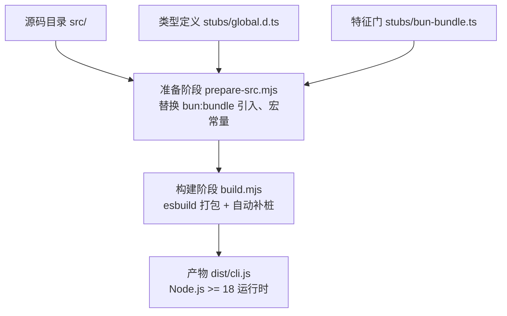
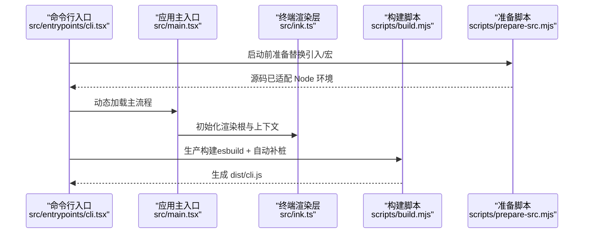
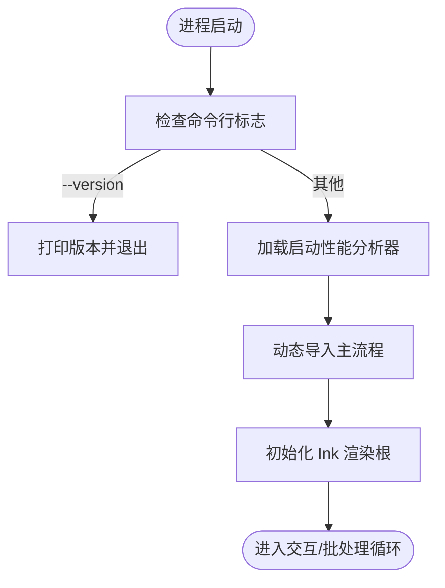
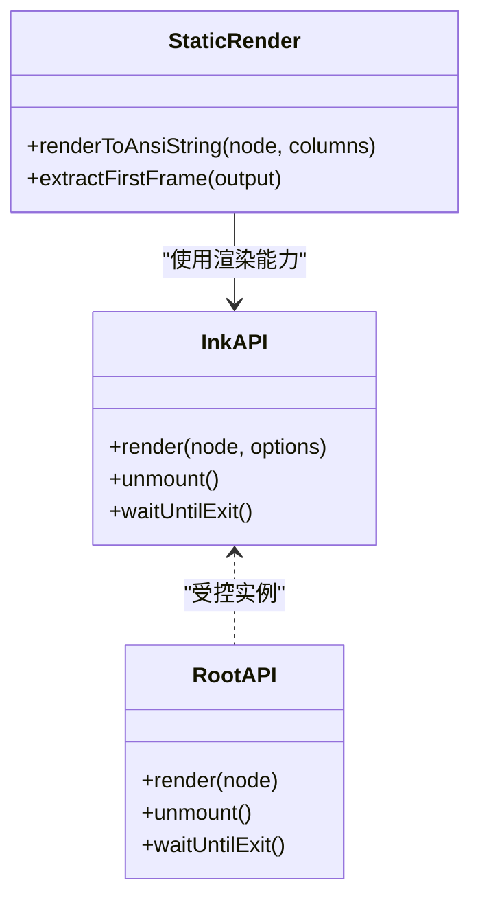
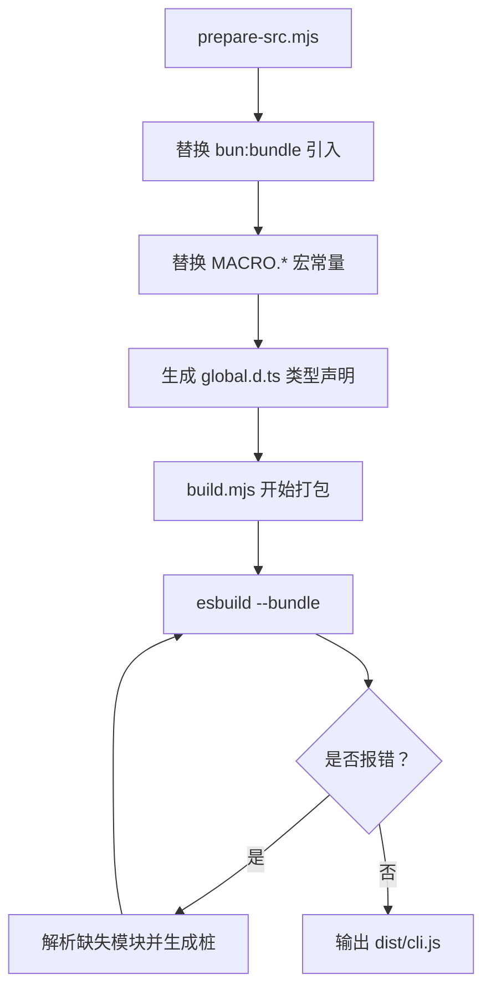
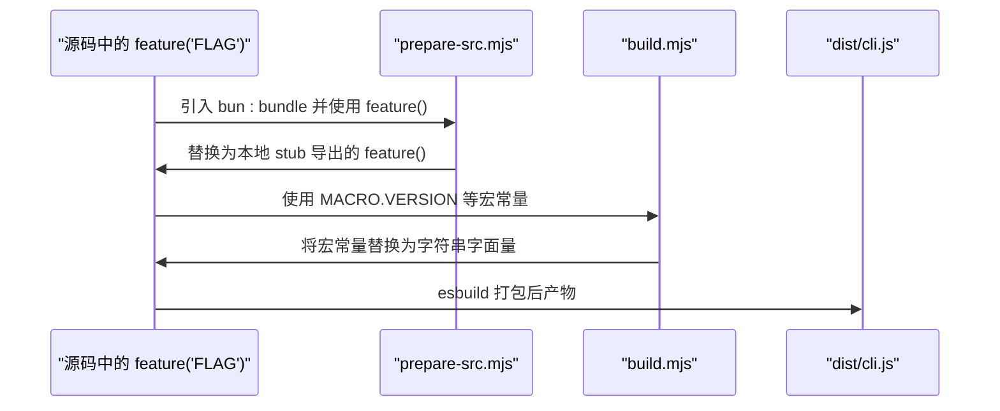
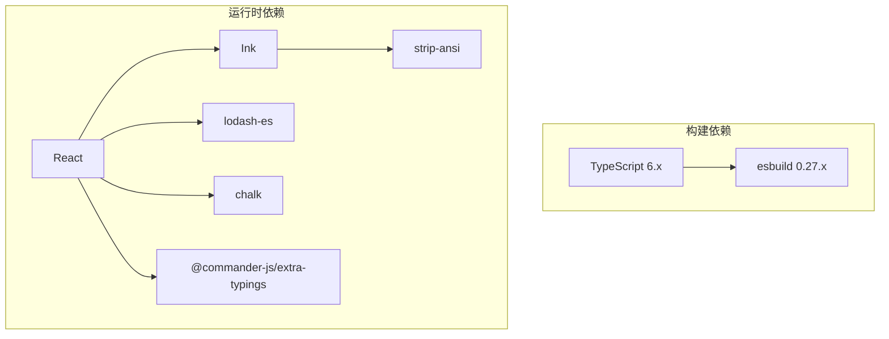

# 技术栈和依赖

<cite>
**本文引用的文件**
- [package.json](file://package.json)
- [tsconfig.json](file://tsconfig.json)
- [README.md](file://README.md)
- [.gitignore](file://.gitignore)
- [scripts/prepare-src.mjs](file://scripts/prepare-src.mjs)
- [scripts/build.mjs](file://scripts/build.mjs)
- [scripts/transform.mjs](file://scripts/transform.mjs)
- [scripts/stub-modules.mjs](file://scripts/stub-modules.mjs)
- [src/main.tsx](file://src/main.tsx)
- [src/entrypoints/cli.tsx](file://src/entrypoints/cli.tsx)
- [src/ink.ts](file://src/ink.ts)
- [src/ink/root.ts](file://src/ink/root.ts)
- [src/utils/staticRender.tsx](file://src/utils/staticRender.tsx)
- [stubs/bun-bundle.ts](file://stubs/bun-bundle.ts)
- [stubs/global.d.ts](file://stubs/global.d.ts)
- [package-lock.json](file://package-lock.json)
</cite>

## 目录
1. [简介](#简介)
2. [项目结构](#项目结构)
3. [核心组件](#核心组件)
4. [架构总览](#架构总览)
5. [详细组件分析](#详细组件分析)
6. [依赖分析](#依赖分析)
7. [性能考量](#性能考量)
8. [故障排查指南](#故障排查指南)
9. [结论](#结论)
10. [附录](#附录)

## 简介
本文件系统性梳理 Claude Code 的技术栈与依赖，重点说明以下方面：
- 核心技术与框架：TypeScript、React、Ink（终端 UI）、Bun（编译期内建能力）
- 第三方依赖管理与版本控制策略
- 构建工具链、编译配置与运行时环境
- 技术选型权衡、性能影响与维护成本
- 依赖更新策略与兼容性管理方案

## 项目结构
该项目采用“源码解包 + 再构建”的发布形态：官方发布的 npm 包为单文件可执行 CLI，而仓库提供了完整的 unbundled TypeScript 源码。构建脚本通过 esbuild 将源码打包为最终可执行文件，并在构建过程中对 Bun 编译期特性进行模拟替换。

图表来源
- [scripts/prepare-src.mjs:1-116](file://scripts/prepare-src.mjs#L1-L116)
- [scripts/build.mjs:1-246](file://scripts/build.mjs#L1-L246)
- [stubs/global.d.ts:1-12](file://stubs/global.d.ts#L1-L12)
- [stubs/bun-bundle.ts:1-5](file://stubs/bun-bundle.ts#L1-L5)

章节来源
- [README.md:1-224](file://README.md#L1-L224)
- [package.json:1-21](file://package.json#L1-L21)
- [.gitignore:1-3](file://.gitignore#L1-L3)

## 核心组件
- TypeScript 与编译配置
  - 目标与模块：ES2022 + ESNext 模块解析，bundler 解析器，启用 JSX（react-jsx），输出到 dist
  - 类型声明：包含 node 与 DOM 库，支持 JSON 模块，生成声明与 sourcemap
  - 路径映射：src/* 与 bun:bundle 别名映射至 stubs
- React 与 Ink 组件生态
  - React 作为 UI 基础；Ink 提供终端渲染、事件处理、布局与状态管理
  - 通过 src/ink.ts 汇总导出 Ink 的核心能力，便于统一接入
- Bun 编译期内建能力
  - feature() 特征门：在内部构建中用于死代码消除（DCE），在公开构建中被替换为恒定 false
  - 宏常量 MACRO：在 Bun 构建时注入，公开构建通过脚本替换为字符串字面量
- 构建与打包
  - prepare-src.mjs：预处理源码，替换 bun:bundle 引入与宏常量，生成全局类型声明
  - build.mjs：迭代式 esbuild 打包，自动识别缺失模块并生成桩文件，直至成功或达到最大轮次

章节来源
- [tsconfig.json:1-37](file://tsconfig.json#L1-L37)
- [src/ink.ts:37-85](file://src/ink.ts#L37-L85)
- [scripts/prepare-src.mjs:1-116](file://scripts/prepare-src.mjs#L1-L116)
- [scripts/build.mjs:1-246](file://scripts/build.mjs#L1-L246)

## 架构总览
从入口到运行时的关键路径如下：

图表来源
- [src/entrypoints/cli.tsx:1-200](file://src/entrypoints/cli.tsx#L1-L200)
- [src/main.tsx:1-200](file://src/main.tsx#L1-L200)
- [src/ink.ts:37-85](file://src/ink.ts#L37-L85)
- [scripts/prepare-src.mjs:1-116](file://scripts/prepare-src.mjs#L1-L116)
- [scripts/build.mjs:1-246](file://scripts/build.mjs#L1-L246)

## 详细组件分析

### 组件一：入口与启动流程
- 入口文件负责快速路径优化（如 --version）与按需动态导入，减少冷启动时间
- 在公开构建中，通过 feature() 门控的分支会被 DCE 掉，确保产物体积与安全边界
- 宏常量 MACRO 在构建时内联，避免运行时解析

图表来源
- [src/entrypoints/cli.tsx:33-93](file://src/entrypoints/cli.tsx#L33-L93)

章节来源
- [src/entrypoints/cli.tsx:1-200](file://src/entrypoints/cli.tsx#L1-L200)

### 组件二：终端 UI 与渲染
- Ink 提供终端内的 React 组件生态，包括输入事件、焦点管理、帧调度与布局
- 通过 src/ink.ts 汇总导出常用组件与钩子，统一接入点
- 静态渲染场景通过自定义工具函数提取首帧内容，保证非 TTY 输出的一致性

图表来源
- [src/ink.ts:37-85](file://src/ink.ts#L37-L85)
- [src/ink/root.ts:67-102](file://src/ink/root.ts#L67-L102)
- [src/utils/staticRender.tsx:74-85](file://src/utils/staticRender.tsx#L74-L85)

章节来源
- [src/ink.ts:37-85](file://src/ink.ts#L37-L85)
- [src/ink/root.ts:67-102](file://src/ink/root.ts#L67-L102)
- [src/utils/staticRender.tsx:1-85](file://src/utils/staticRender.tsx#L1-L85)

### 组件三：构建与打包管线
- prepare-src.mjs：将 bun:bundle 引入替换为本地 stub，将 MACRO.* 替换为字符串字面量，生成全局类型声明
- build.mjs：复制源码到 build-src，迭代式 esbuild 打包，自动收集缺失模块并生成桩文件，最多尝试若干轮
- transform.mjs 与 stub-modules.mjs：作为补充转换与桩生成工具，配合主构建脚本

图表来源
- [scripts/prepare-src.mjs:36-77](file://scripts/prepare-src.mjs#L36-L77)
- [scripts/build.mjs:144-229](file://scripts/build.mjs#L144-L229)

章节来源
- [scripts/prepare-src.mjs:1-116](file://scripts/prepare-src.mjs#L1-L116)
- [scripts/build.mjs:1-246](file://scripts/build.mjs#L1-L246)
- [scripts/transform.mjs](file://scripts/transform.mjs)
- [scripts/stub-modules.mjs](file://scripts/stub-modules.mjs)

### 组件四：特征门与宏常量
- feature(flag)：在 Bun 内部构建中返回 true/false，决定代码是否参与打包；公开构建中被替换为恒定 false
- MACRO.*：在 Bun 构建时注入，公开构建通过脚本替换为字符串字面量，确保产物不含未解析的编译期常量

图表来源
- [stubs/bun-bundle.ts:1-5](file://stubs/bun-bundle.ts#L1-L5)
- [scripts/prepare-src.mjs:40-70](file://scripts/prepare-src.mjs#L40-L70)
- [scripts/build.mjs:67-98](file://scripts/build.mjs#L67-L98)

章节来源
- [stubs/bun-bundle.ts:1-5](file://stubs/bun-bundle.ts#L1-L5)
- [stubs/global.d.ts:1-12](file://stubs/global.d.ts#L1-L12)
- [scripts/prepare-src.mjs:53-70](file://scripts/prepare-src.mjs#L53-L70)
- [scripts/build.mjs:67-98](file://scripts/build.mjs#L67-L98)

## 依赖分析
- 运行时与构建要求
  - Node.js 版本：>= 18（引擎约束）
  - 构建工具：esbuild（版本 0.27.4），TypeScript（版本 6.0.2）
- 关键依赖与用途
  - React：UI 基础库
  - Ink：终端 UI 渲染与事件处理
  - lodash-es：通用工具函数（memoize、mapValues 等）
  - chalk：命令行彩色输出
  - strip-ansi：ANSI 转义序列处理
  - commander-js/extra-typings：命令行参数解析
  - 其他：终端能力检测、键盘事件、帧调度、选择与焦点管理等

图表来源
- [package.json:16-19](file://package.json#L16-L19)
- [package-lock.json:87-503](file://package-lock.json#L87-L503)

章节来源
- [package.json:1-21](file://package.json#L1-L21)
- [package-lock.json:87-503](file://package-lock.json#L87-L503)

## 性能考量
- 启动性能
  - CLI 入口采用快速路径（如 --version）与延迟动态导入，显著降低冷启动时间
  - 启动性能分析器在关键节点打点，便于持续优化
- 渲染性能
  - Ink 帧调度与最小化重绘策略，结合 ANSI 转义序列处理，提升终端渲染效率
  - 静态渲染场景仅提取首帧内容，避免多帧开销
- 构建性能
  - esbuild 快速打包；迭代式补桩减少失败重试次数
  - 特征门与宏常量在构建期确定，避免运行时分支判断

章节来源
- [src/entrypoints/cli.tsx:33-93](file://src/entrypoints/cli.tsx#L33-L93)
- [src/utils/staticRender.tsx:62-85](file://src/utils/staticRender.tsx#L62-L85)
- [scripts/build.mjs:144-229](file://scripts/build.mjs#L144-L229)

## 故障排查指南
- 构建失败
  - 症状：esbuild 报错提示缺少模块
  - 处理：脚本会自动解析缺失模块并生成桩文件；若多次失败，检查 build-src/ 中的转换结果并手动补齐
- 特征门相关问题
  - 症状：某些功能未生效或被移除
  - 处理：确认 feature() 在构建时的行为与预期一致；公开构建中 feature() 返回恒定 false
- 运行时错误
  - 症状：Node.js 版本过低导致启动失败
  - 处理：确保 Node.js >= 18；脚本会在启动时进行版本校验

章节来源
- [scripts/build.mjs:175-229](file://scripts/build.mjs#L175-L229)
- [src/setup.ts:69-79](file://src/setup.ts#L69-L79)

## 结论
本项目在保持功能完整性的同时，通过 Bun 编译期特性与公开构建脚本实现了“内部构建”与“公开构建”的差异化：内部构建启用大量特性门与高级能力，公开构建则通过死代码消除与宏常量内联确保产物稳定与可控。技术栈以 TypeScript、React、Ink 为核心，辅以 esbuild 实现高效打包，整体在性能、可维护性与安全性之间取得平衡。

## 附录
- 版本与产物
  - 项目版本：2.1.88
  - 产物：dist/cli.js（Node.js >= 18）
- 目录与忽略
  - 构建产物输出至 dist/，临时目录 build-src/，node_modules/ 被忽略

章节来源
- [README.md:212-224](file://README.md#L212-L224)
- [.gitignore:1-3](file://.gitignore#L1-L3)