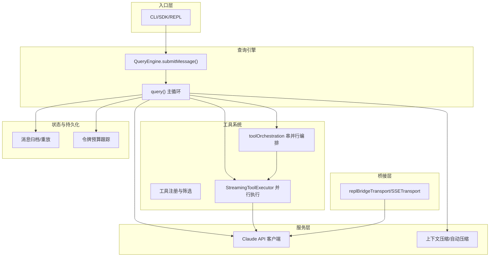
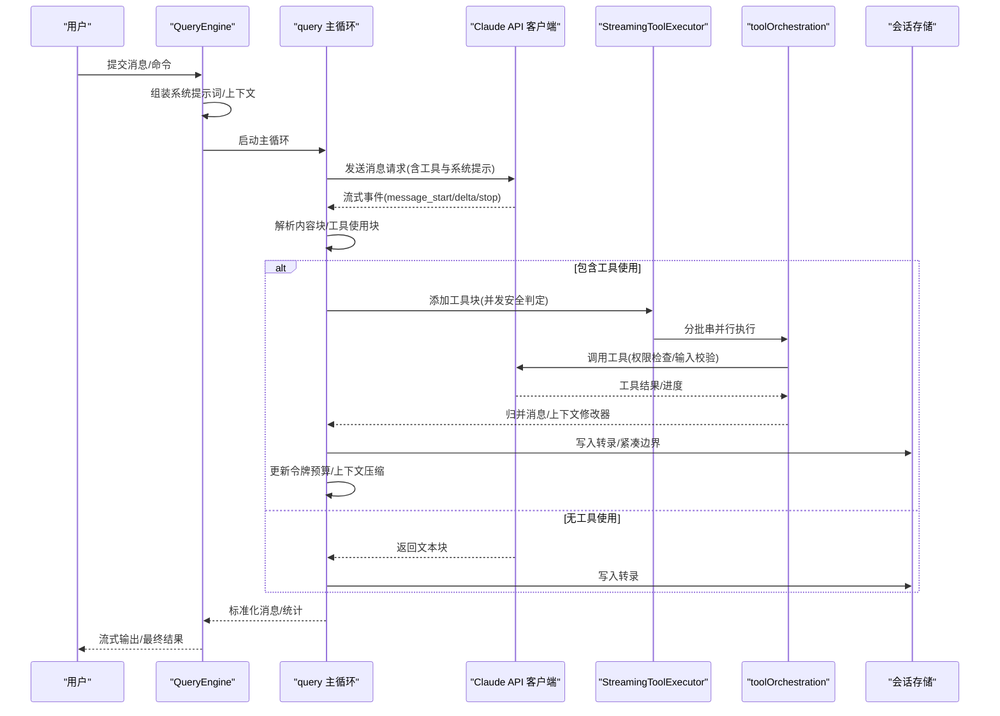
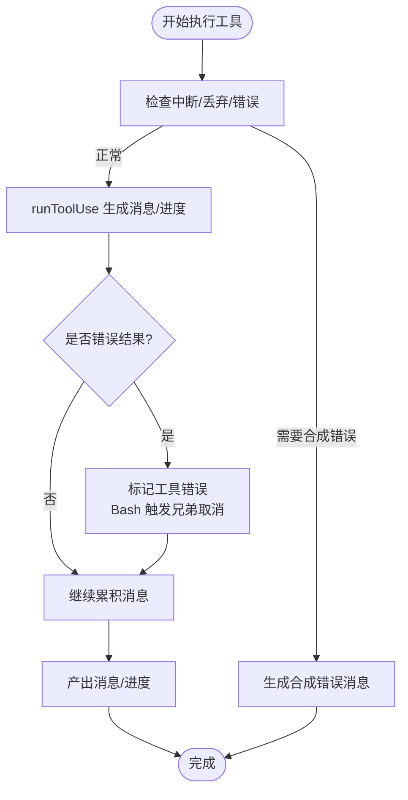
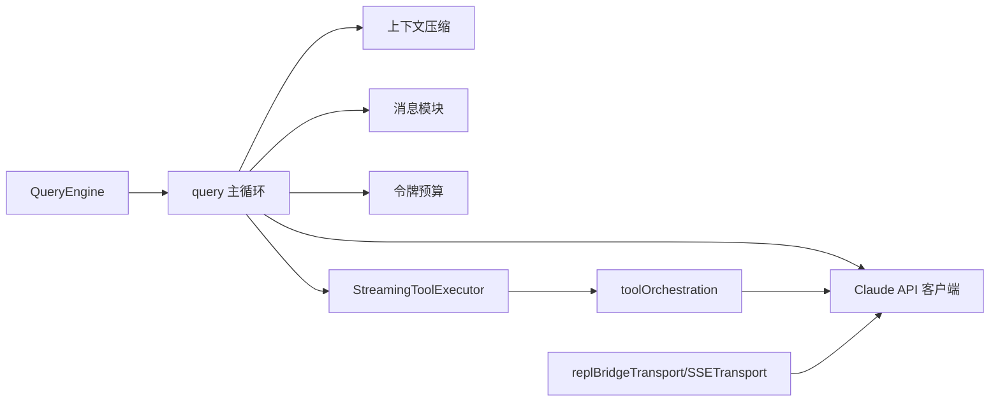

# 数据流架构

<cite>
**本文引用的文件**
- [README.md](file://README.md)
- [QueryEngine.ts](file://src/QueryEngine.ts)
- [query.ts](file://src/query.ts)
- [tools.ts](file://src/tools.ts)
- [StreamingToolExecutor.ts](file://src/services/tools/StreamingToolExecutor.ts)
- [toolOrchestration.ts](file://src/services/tools/toolOrchestration.ts)
- [claude.ts](file://src/services/api/claude.ts)
- [tokenBudget.ts](file://src/query/tokenBudget.ts)
- [autoCompact.ts](file://src/services/compact/autoCompact.ts)
- [messages.ts](file://src/utils/messages.ts)
- [replBridgeTransport.ts](file://src/bridge/replBridgeTransport.ts)
- [SSETransport.ts](file://src/cli/transports/SSETransport.ts)
- [replBridge.ts](file://src/bridge/replBridge.ts)
</cite>

## 目录
1. [引言](#引言)
2. [项目结构](#项目结构)
3. [核心组件](#核心组件)
4. [架构总览](#架构总览)
5. [详细组件分析](#详细组件分析)
6. [依赖关系分析](#依赖关系分析)
7. [性能考量](#性能考量)
8. [故障排查指南](#故障排查指南)
9. [结论](#结论)
10. [附录](#附录)

## 引言
本文件面向 Claude Code 的数据流架构，系统性梳理从用户输入到最终输出的完整数据通路，重点覆盖以下方面：
- Agent 循环的数据处理流程：消息构建、系统提示词组装、主循环迭代、工具调用与结果回填。
- 消息传递机制：流式事件、进度消息、系统边界标记、会话持久化与重放。
- 工具执行的数据流转：并发安全判定、串行/并行编排、上下文修改器、中断与回滚。
- 上下文管理：自动压缩、历史裁剪、上下文重构；令牌预算控制与阈值预警。
- 流式响应的数据处理模式：按块增量产出、错误抑制与恢复、最大输出令牌回收保护。
- 缓存策略：提示词缓存作用域、紧凑边界标记、会话快照与恢复。
- 数据验证、错误传播与回滚：输入校验、权限决策、合成错误消息、取消信号传播。

## 项目结构
- 入口层：CLI/SDK/REPL 通过 QueryEngine 统一接入查询生命周期。
- 查询引擎：负责系统提示词装配、用户输入解析、消息规范化、主循环驱动、工具编排与结果归档。
- 工具系统：内置工具与 MCP 工具统一抽象，支持并发安全判定与只读/破坏性语义。
- 服务层：Claude API 客户端、上下文压缩、分析与遥测、插件加载等。
- 状态层：应用状态、权限上下文、文件历史快照、会话持久化。
- 桥接层：桌面/远程桥接，支持会话传输、认证头注入、断线重连与容量唤醒。

图表来源
- [QueryEngine.ts:184-686](file://src/QueryEngine.ts#L184-L686)
- [query.ts:1-200](file://src/query.ts#L1-L200)
- [StreamingToolExecutor.ts:40-531](file://src/services/tools/StreamingToolExecutor.ts#L40-L531)
- [toolOrchestration.ts:19-189](file://src/services/tools/toolOrchestration.ts#L19-L189)
- [claude.ts:1-200](file://src/services/api/claude.ts#L1-L200)
- [autoCompact.ts:160-200](file://src/services/compact/autoCompact.ts#L160-L200)
- [messages.ts:1-200](file://src/utils/messages.ts#L1-L200)
- [replBridgeTransport.ts:146-182](file://src/bridge/replBridgeTransport.ts#L146-L182)
- [SSETransport.ts:162-711](file://src/cli/transports/SSETransport.ts#L162-L711)

章节来源
- [README.md:383-777](file://README.md#L383-L777)

## 核心组件
- QueryEngine：封装会话状态与查询生命周期，负责系统提示词装配、用户输入处理、消息归档、主循环驱动与结果标准化输出。
- query 主循环：驱动单轮对话，处理流式事件、工具使用块、上下文压缩、令牌预算与停止钩子。
- StreamingToolExecutor：按并发安全策略执行工具，维护执行顺序、进度消息即时产出、兄弟进程取消与中断行为。
- toolOrchestration：将工具调用分批（串行/并行），支持上下文修改器累积与应用。
- Claude API 客户端：封装流式请求、事件解析、错误分类与重试策略。
- 自动压缩与上下文管理：根据模型上下文窗口与保留输出令牌计算阈值，触发压缩或边界标记。
- 令牌预算：基于全局轮次令牌数与预算上限的继续/停止决策，避免边际收益递减。
- 消息与持久化：规范化消息、记录转录、紧凑边界标记、进度消息内联写入、会话快照与恢复。

章节来源
- [QueryEngine.ts:184-686](file://src/QueryEngine.ts#L184-L686)
- [query.ts:1-200](file://src/query.ts#L1-L200)
- [StreamingToolExecutor.ts:40-531](file://src/services/tools/StreamingToolExecutor.ts#L40-L531)
- [toolOrchestration.ts:19-189](file://src/services/tools/toolOrchestration.ts#L19-L189)
- [claude.ts:1-200](file://src/services/api/claude.ts#L1-L200)
- [autoCompact.ts:1-200](file://src/services/compact/autoCompact.ts#L1-L200)
- [messages.ts:1-200](file://src/utils/messages.ts#L1-L200)

## 架构总览
下图展示从用户输入到最终输出的关键数据流路径，涵盖消息构建、系统提示词、API 流式事件、工具执行与回填、压缩与预算控制、持久化与重放。

图表来源
- [QueryEngine.ts:209-686](file://src/QueryEngine.ts#L209-L686)
- [query.ts:1-200](file://src/query.ts#L1-L200)
- [StreamingToolExecutor.ts:76-490](file://src/services/tools/StreamingToolExecutor.ts#L76-L490)
- [toolOrchestration.ts:19-189](file://src/services/tools/toolOrchestration.ts#L19-L189)
- [claude.ts:1-200](file://src/services/api/claude.ts#L1-L200)
- [messages.ts:1-200](file://src/utils/messages.ts#L1-L200)

## 详细组件分析

### QueryEngine：查询生命周期与消息归档
- 责任边界：系统提示词装配、用户输入解析、消息规范化、主循环驱动、结果标准化、权限拒绝记录、会话持久化与重放。
- 关键流程：
  - fetchSystemPromptParts：收集工具、权限、内存提示片段，拼装默认系统提示。
  - processUserInput：解析斜杠命令、构建用户消息、更新工具许可集合。
  - recordTranscript：在进入主循环前写入用户消息，保证中断后可恢复。
  - submitMessage：生成系统初始化消息、驱动 query 主循环、标准化消息、聚合使用统计与权限拒绝。
- 会话持久化：
  - 用户消息：阻塞写入（崩溃恢复）；助手消息：延迟队列写入；进度消息：内联写入去重。
  - 紧凑边界：在写入前先刷写到边界位置，确保恢复时不会孤儿化链路。

章节来源
- [QueryEngine.ts:184-686](file://src/QueryEngine.ts#L184-L686)
- [messages.ts:1-200](file://src/utils/messages.ts#L1-L200)

### query 主循环：Agent 循环与工具编排
- 责任边界：接收 API 流式事件，解析内容块与工具使用块，调度工具执行，维护令牌预算与上下文压缩，处理停止钩子与最大输出令牌回收。
- 关键流程：
  - 流式事件处理：message_start 初始化当前消息用量；message_delta 累积用量与停止原因；message_stop 结束当前块。
  - 工具使用块：识别 tool_use，交由 StreamingToolExecutor 或 toolOrchestration 处理。
  - 上下文压缩：根据阈值触发自动压缩，插入紧凑边界系统消息。
  - 令牌预算：checkTokenBudget 基于全局轮次令牌与预算上限决定继续或停止。
  - 最大输出令牌回收：对 max_output_tokens 错误进行延迟产出，等待恢复循环结束再对外抛出。

章节来源
- [query.ts:1-200](file://src/query.ts#L1-L200)
- [tokenBudget.ts:45-94](file://src/query/tokenBudget.ts#L45-L94)
- [autoCompact.ts:160-200](file://src/services/compact/autoCompact.ts#L160-L200)

### StreamingToolExecutor：并发安全与中断传播
- 责任边界：按并发安全策略执行工具，维护执行顺序，即时产出进度消息，传播兄弟错误与用户中断，支持丢弃与回滚。
- 关键流程：
  - 并发判定：isConcurrencySafe=true 且当前无其他并发执行时并行；否则串行。
  - 中断传播：兄弟 Bash 错误触发 siblingAbortController，级联取消其他并行工具；用户中断仅取消可中断工具。
  - 合成错误：当被丢弃、兄弟错误或用户中断时，生成带错误标记的工具结果消息。
  - 上下文修改器：串行工具支持在完成后应用上下文修改器，保证顺序一致性。

图表来源
- [StreamingToolExecutor.ts:265-405](file://src/services/tools/StreamingToolExecutor.ts#L265-L405)

章节来源
- [StreamingToolExecutor.ts:40-531](file://src/services/tools/StreamingToolExecutor.ts#L40-L531)

### toolOrchestration：串并行编排与上下文修改
- 责任边界：将连续的只读工具批量并行，非只读工具串行，累积上下文修改器并在批次结束后应用。
- 关键流程：
  - 分批策略：连续只读工具合并为一批并行；非只读工具单独批次串行。
  - 并发限制：通过 all(...) 控制最大并发数。
  - 上下文修改器：每个工具可返回 modifyContext 函数，按工具 ID 聚合并在完成后一次性应用。

章节来源
- [toolOrchestration.ts:19-189](file://src/services/tools/toolOrchestration.ts#L19-L189)

### Claude API 客户端：流式事件与错误处理
- 责任边界：封装流式请求、事件解析、错误分类、重试与配额提取、头部缓存编辑与快速模式开关。
- 关键流程：
  - 流式事件：message_start 初始化用量；message_delta 累积用量与停止原因；message_stop 结束。
  - 错误分类：区分连接超时、用户中止、配额限制等，用于上层重试与降级。
  - 头部与特性：快速模式、思考清理、提示词缓存作用域、任务预算等头部开关。

章节来源
- [claude.ts:1-200](file://src/services/api/claude.ts#L1-L200)

### 上下文管理与压缩：自动压缩与紧凑边界
- 自动压缩阈值：基于模型上下文窗口与保留输出令牌计算有效上下文大小，结合缓冲区阈值判断是否触发压缩。
- 紧凑边界：在压缩后插入系统消息，标记保留段尾 UUID，确保恢复时能正确修剪历史。
- 历史裁剪与上下文重构：在长会话中通过裁剪与重构降低占用。

章节来源
- [autoCompact.ts:32-145](file://src/services/compact/autoCompact.ts#L32-L145)
- [QueryEngine.ts:701-715](file://src/QueryEngine.ts#L701-L715)

### 令牌预算控制：继续/停止决策
- 决策依据：全局轮次令牌数占预算比例、连续次数、边际收益阈值。
- 行为：在达到阈值前允许继续，超过阈值或出现边际收益递减时停止，并记录完成事件。

章节来源
- [tokenBudget.ts:45-94](file://src/query/tokenBudget.ts#L45-L94)

### 消息与持久化：规范化与重放
- 规范化：剥离 UI 字段、映射 SDK 消息类型、标准化内容块。
- 重放：用户消息与紧凑边界在转录中明确标注，支持 --continue/--resume/--fork-session。
- 进度消息：内联写入以避免与工具结果交错导致的去重冻结。

章节来源
- [messages.ts:1-200](file://src/utils/messages.ts#L1-L200)
- [QueryEngine.ts:430-463](file://src/QueryEngine.ts#L430-L463)

### 桥接层：传输与认证
- 认证头注入：支持 per-instance getAuthToken 回调，避免多会话冲突；否则回退到进程级环境变量。
- 传输协议：SSETransport 支持 Last-Event-ID 恢复、指数退避重连、心跳检测与关闭回调。
- 会话恢复：replBridge 在收到新工作时关闭旧传输，保留序列水位标记，确保新传输从断点续播。

章节来源
- [replBridgeTransport.ts:146-182](file://src/bridge/replBridgeTransport.ts#L146-L182)
- [SSETransport.ts:162-711](file://src/cli/transports/SSETransport.ts#L162-L711)
- [replBridge.ts:1155-1186](file://src/bridge/replBridge.ts#L1155-L1186)

## 依赖关系分析
- QueryEngine 依赖工具注册表与系统提示词装配，驱动 query 主循环；query 主循环依赖 Claude API 客户端、工具执行器与上下文压缩模块。
- StreamingToolExecutor 与 toolOrchestration 之间存在协作：前者负责并发与中断传播，后者负责分批与上下文修改器应用。
- 消息模块贯穿全链路，承担规范化、紧凑边界标记、进度消息内联写入与转录记录。
- 桥接层为远程/桌面场景提供传输与认证能力，保障会话稳定与安全。

图表来源
- [QueryEngine.ts:184-686](file://src/QueryEngine.ts#L184-L686)
- [query.ts:1-200](file://src/query.ts#L1-L200)
- [StreamingToolExecutor.ts:40-531](file://src/services/tools/StreamingToolExecutor.ts#L40-L531)
- [toolOrchestration.ts:19-189](file://src/services/tools/toolOrchestration.ts#L19-L189)
- [claude.ts:1-200](file://src/services/api/claude.ts#L1-L200)
- [messages.ts:1-200](file://src/utils/messages.ts#L1-L200)
- [replBridgeTransport.ts:146-182](file://src/bridge/replBridgeTransport.ts#L146-L182)
- [SSETransport.ts:162-711](file://src/cli/transports/SSETransport.ts#L162-L711)

章节来源
- [tools.ts:193-390](file://src/tools.ts#L193-L390)
- [QueryEngine.ts:184-686](file://src/QueryEngine.ts#L184-L686)

## 性能考量
- 并发执行：StreamingToolExecutor 与 toolOrchestration 将只读工具批量并行，减少总耗时；非并发工具串行避免资源竞争。
- 流式写入：助手消息采用延迟队列写入，避免阻塞主循环；进度消息内联写入防止去重冻结。
- 自动压缩：在接近阈值前主动压缩，降低后续 API 调用成本与失败概率。
- 令牌预算：通过继续/停止决策避免边际收益递减，提升整体吞吐。
- 传输优化：SSETransport 指数退避与 Last-Event-ID 恢复，降低断线重连成本。

## 故障排查指南
- 工具执行失败：
  - 检查 isConcurrencySafe 判定与中断行为，确认是否为可取消工具。
  - 查看兄弟错误传播：Bash 错误会触发 siblingAbortController，其他并行工具被取消。
  - 合成错误消息：当被丢弃、兄弟错误或用户中断时，系统生成带错误标记的工具结果消息。
- 流式事件异常：
  - 关注 message_start/delta/stop 的用量累积与停止原因；对 max_output_tokens 错误进行延迟产出。
  - 使用 SSETransport 的 Last-Event-ID 与心跳检测定位断线与重连问题。
- 会话恢复失败：
  - 确认转录中包含用户消息与紧凑边界；检查 --continue/--resume/--fork-session 参数。
  - 若中途被杀，确保用户消息已写入（非阻塞模式下为异步写入）。

章节来源
- [StreamingToolExecutor.ts:153-231](file://src/services/tools/StreamingToolExecutor.ts#L153-L231)
- [query.ts:167-179](file://src/query.ts#L167-L179)
- [SSETransport.ts:162-711](file://src/cli/transports/SSETransport.ts#L162-L711)
- [QueryEngine.ts:430-463](file://src/QueryEngine.ts#L430-L463)

## 结论
Claude Code 的数据流以 QueryEngine 为核心，围绕系统提示词、消息规范化、主循环与工具编排展开，辅以上下文压缩、令牌预算与会话持久化，形成高鲁棒性的生产级 Agent 循环。StreamingToolExecutor 与 toolOrchestration 实现了细粒度的并发控制与中断传播，Claude API 客户端提供了稳定的流式事件与错误分类，桥接层保障了远程/桌面场景的可靠性。通过紧凑边界与进度消息内联写入，系统在长会话中仍能保持良好的恢复性与可观测性。

## 附录
- 工具系统概览：内置工具与 MCP 工具统一注册与筛选，支持模式过滤与 REPL 隐藏策略。
- 权限与输入校验：工具输入在运行前进行 schema 校验，权限检查在 canUseTool 中集中处理。
- 缓存策略：提示词缓存作用域与紧凑边界标记共同作用，减少重复计算与 API 调用。

章节来源
- [tools.ts:193-390](file://src/tools.ts#L193-L390)
- [QueryEngine.ts:244-271](file://src/QueryEngine.ts#L244-L271)
- [messages.ts:1-200](file://src/utils/messages.ts#L1-L200)