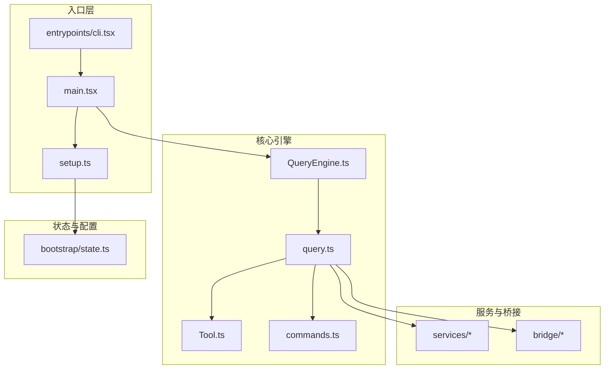
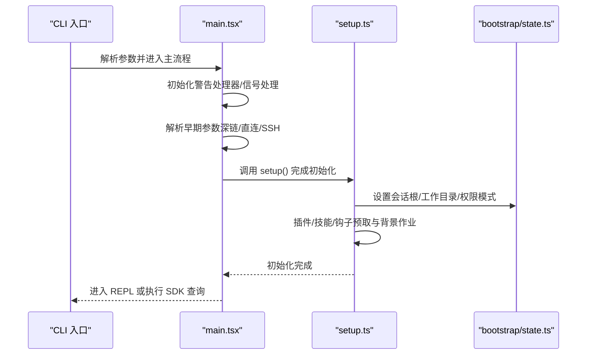
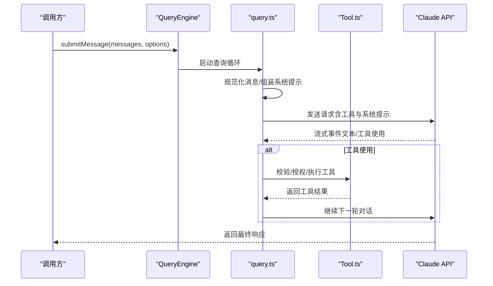
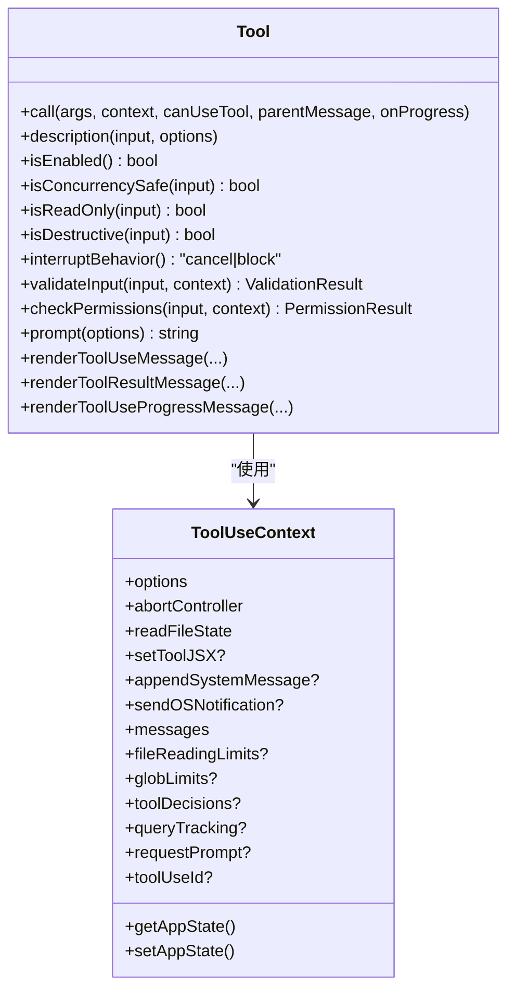
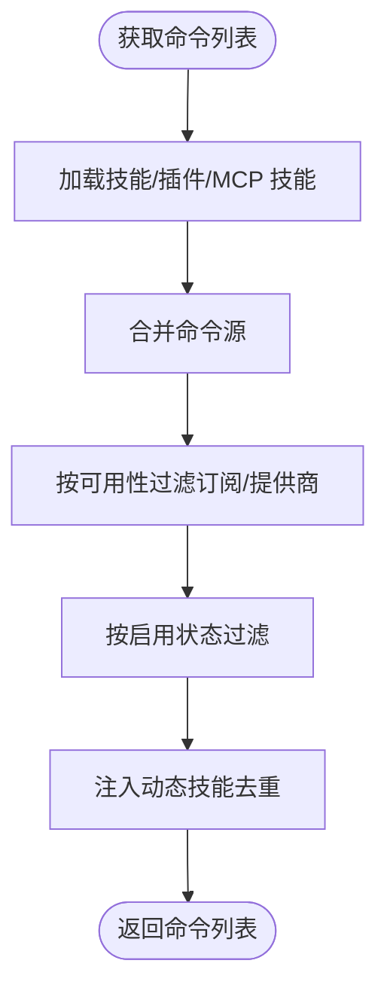
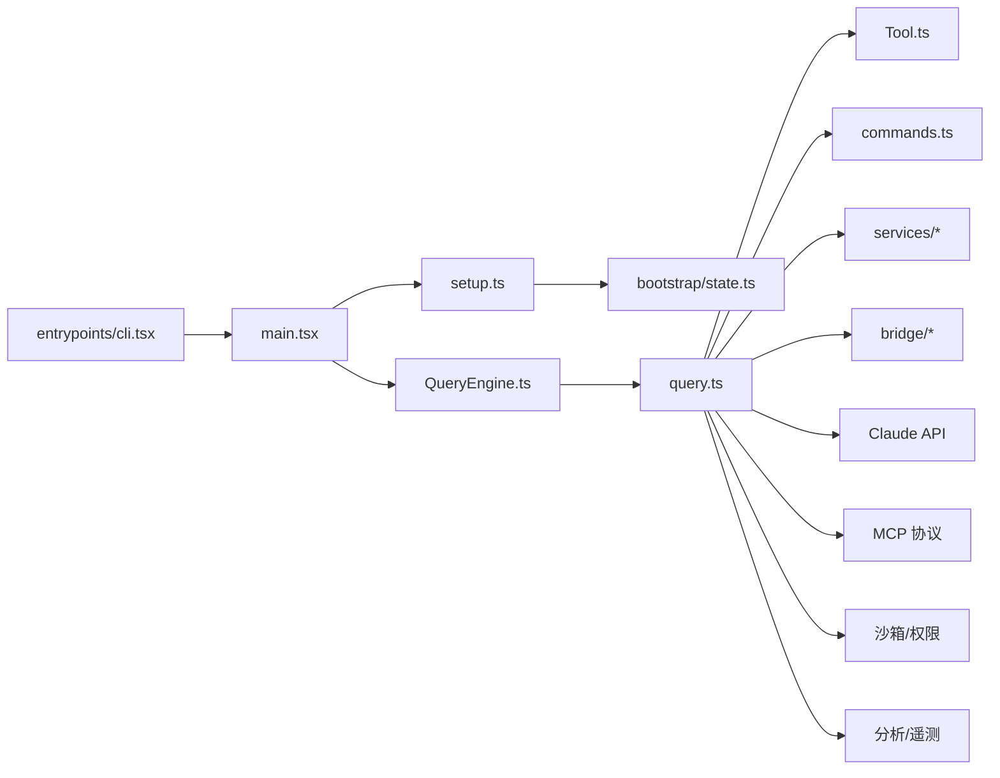

```mermaid
classDiagram
class State {
+originalCwd
+projectRoot
+totalCostUSD
+totalAPIDuration
+totalToolDuration
+turnHookDurationMs
+turnToolDurationMs
+turnClassifierDurationMs
+turnToolCount
+turnHookCount
+startTime
+lastInteractionTime
+totalLinesAdded
+totalLinesRemoved
+hasUnknownModelCost
+cwd
+modelUsage
+mainLoopModelOverride
+initialMainLoopModel
+modelStrings
+isInteractive
+kairosActive
+strictToolResultPairing
+sdkAgentProgressSummariesEnabled
+userMsgOptIn
+clientType
+sessionSource
+questionPreviewFormat
+flagSettingsPath
+flagSettingsInline
+allowedSettingSources
+sessionIngressToken
+oauthTokenFromFd
+apiKeyFromFd
+meter
+sessionCounter
+locCounter
+prCounter
+commitCounter
+costCounter
+tokenCounter
+codeEditToolDecisionCounter
+activeTimeCounter
+statsStore
+sessionId
+parentSessionId
+loggerProvider
+eventLogger
+meterProvider
+tracerProvider
+agentColorMap
+agentColorIndex
+lastAPIRequest
+lastAPIRequestMessages
+lastClassifierRequests
+cachedClaudeMdContent
+inMemoryErrorLog
+inlinePlugins
+chromeFlagOverride
+useCoworkPlugins
+sessionBypassPermissionsMode
+scheduledTasksEnabled
+sessionCronTasks
+sessionCreatedTeams
+sessionTrustAccepted
+sessionPersistenceDisabled
+hasExitedPlanMode
+needsPlanModeExitAttachment
+needsAutoModeExitAttachment
+lspRecommendationShownThisSession
+initJsonSchema
+registeredHooks
+planSlugCache
+teleportedSessionInfo
+invokedSkills
+slowOperations
+sdkBetas
+mainThreadAgentType
+isRemoteMode
+directConnectServerUrl
+systemPromptSectionCache
+lastEmittedDate
+additionalDirectoriesForClaudeMd
+allowedChannels
+hasDevChannels
+sessionProjectDir
+promptCache1hAllowlist
+promptCache1hEligible
+afkModeHeaderLatched
+fastModeHeaderLatched
+cacheEditingHeaderLatched
+thinkingClearLatched
+promptId
+lastMainRequestId
+lastApiCompletionTimestamp
+pendingPostCompaction
}
```

# 整体架构概览

<cite>
**本文档引用的文件**
- [README.md](file://README.md)
- [package.json](file://package.json)
- [src/main.tsx](file://src/main.tsx)
- [src/setup.ts](file://src/setup.ts)
- [src/bootstrap/state.ts](file://src/bootstrap/state.ts)
- [src/QueryEngine.ts](file://src/QueryEngine.ts)
- [src/query.ts](file://src/query.ts)
- [src/Tool.ts](file://src/Tool.ts)
- [src/commands.ts](file://src/commands.ts)
- [src/entrypoints/cli.tsx](file://src/entrypoints/cli.tsx)
</cite>

## 目录
1. [引言](#引言)
2. [项目结构](#项目结构)
3. [核心组件](#核心组件)
4. [架构总览](#架构总览)
5. [详细组件分析](#详细组件分析)
6. [依赖关系分析](#依赖关系分析)
7. [性能考虑](#性能考虑)
8. [故障排除指南](#故障排除指南)
9. [结论](#结论)

## 引言

Claude Code 是一个基于代理（Agent）的智能代码助手，采用“入口层 → 查询引擎 → 工具系统/服务层/状态层”的分层架构。其核心目标是通过多模态（文本、文件、网络、终端等）工具与 Claude API 的流式对话能力，实现从自然语言到代码操作的端到端自动化。系统在设计上强调模块化、可扩展性与安全性，通过权限系统、上下文压缩、会话持久化、桥接层（桌面/远程）等机制，支撑从 CLI 到 REPL 的多种交互形态。

## 项目结构

项目采用按职责分层的模块化组织方式，主要目录与职责如下：

- entrypoints：应用入口与运行时入口点（CLI、MCP、SDK）
- src：核心业务逻辑与基础设施
  - main.tsx：应用主入口，负责初始化、设置、渲染 REPL 或执行 SDK 查询
  - setup.ts：会话级初始化与预取，确保首次查询前的资源就绪
  - bootstrap/state.ts：全局状态管理（会话、计数器、指标、提示词缓存等）
  - QueryEngine.ts：面向 SDK/Headless 的查询生命周期封装
  - query.ts：核心代理循环（消息处理、工具调用、上下文压缩、流式输出）
  - Tool.ts：工具接口与构建器，统一工具生命周期、权限、渲染与结果映射
  - commands.ts：命令系统（内置命令、技能、插件命令、MCP 技能），支持动态加载与可用性过滤
  - bridge/：桥接层（桌面/远程），负责会话生命周期、HTTP 客户端、认证与消息中继
  - services/：业务服务（API 客户端、分析、MCP、工具执行器、插件、设置同步等）
  - components/：React/Ink 组件库（消息渲染、输入框、权限对话框、设置面板等）
  - utils/：通用工具（权限、消息格式化、令牌估算、沙箱、会话存储、调试等）
  - state/：应用状态（React Provider、状态存储、选择器）
  - tasks/：任务实现（本地/远程/进程内子代理、Dream 后台思考等）
  - tools/：内置工具集合（文件读写、搜索、终端、Web 搜索/抓取、MCP、Agent 等）

**图表来源**
- [src/entrypoints/cli.tsx:1-303](file://src/entrypoints/cli.tsx#L1-L303)
- [src/main.tsx:1-800](file://src/main.tsx#L1-L800)
- [src/setup.ts:1-478](file://src/setup.ts#L1-L478)
- [src/bootstrap/state.ts:1-800](file://src/bootstrap/state.ts#L1-L800)
- [src/QueryEngine.ts:1-200](file://src/QueryEngine.ts#L1-L200)
- [src/query.ts:1-200](file://src/query.ts#L1-L200)
- [src/Tool.ts:1-793](file://src/Tool.ts#L1-L793)
- [src/commands.ts:1-755](file://src/commands.ts#L1-L755)

**章节来源**
- [README.md:250-380](file://README.md#L250-L380)
- [package.json:1-21](file://package.json#L1-L21)

## 核心组件

- 入口层
  - CLI 入口：快速路径解析版本、系统提示导出、MCP/Chrome 主机、守护进程、后台会话管理、远程控制桥接等；最终加载 main.tsx
  - 应用主入口：初始化警告处理器、解析早期参数、深链/直连/SSH 等特殊场景、延迟预取、会话设置与权限校验
  - 初始化设置：工作树/会话根目录、插件/技能/钩子预取、背景作业、遥测信标、权限模式检查

- 查询引擎与代理循环
  - QueryEngine：面向 SDK/Headless 的会话生命周期管理，封装 submitMessage 流程
  - query.ts：核心代理循环，包含消息规范化、系统提示组装、自动上下文压缩、工具执行器、流式事件处理、令牌预算与停止钩子

- 工具系统
  - Tool 接口：统一工具生命周期（validateInput/checkPermissions/call）、渲染（输入/结果/进度/拒绝/错误）、权限上下文、并发安全与只读标记
  - 内置工具：文件读写/搜索、终端命令、Web 搜索/抓取、MCP、Agent 子代理、计划/任务/笔记编辑等

- 命令系统
  - commands.ts：内置命令、技能、插件命令、MCP 技能的动态加载与可用性过滤，远程/桥接安全命令白名单

- 状态与配置
  - bootstrap/state.ts：会话级全局状态（路径、计费、使用量、钩子/工具耗时、提示词缓存、频道/通道、遥测计数器等）

**章节来源**
- [src/entrypoints/cli.tsx:1-303](file://src/entrypoints/cli.tsx#L1-L303)
- [src/main.tsx:585-800](file://src/main.tsx#L585-L800)
- [src/setup.ts:56-478](file://src/setup.ts#L56-L478)
- [src/QueryEngine.ts:184-200](file://src/QueryEngine.ts#L184-L200)
- [src/query.ts:181-200](file://src/query.ts#L181-L200)
- [src/Tool.ts:362-695](file://src/Tool.ts#L362-L695)
- [src/commands.ts:258-517](file://src/commands.ts#L258-L517)
- [src/bootstrap/state.ts:45-257](file://src/bootstrap/state.ts#L45-L257)

## 架构总览

系统采用“入口层 → 查询引擎 → 工具系统/服务层/状态层”的分层架构，配合桥接层实现与桌面/远程环境的连接。核心流程如下：

- 入口层负责参数解析、早期快速路径、配置启用与遥测初始化
- 初始化阶段完成工作树/会话根设定、插件/技能/钩子预取、背景作业启动
- 查询引擎/代理循环负责消息处理、系统提示组装、自动上下文压缩、工具执行与流式输出
- 工具系统提供统一接口，结合权限规则与 UI 提示进行授权控制
- 服务层提供 API 客户端、分析、MCP、插件、设置同步等能力
- 状态层提供全局状态与 React Provider，支撑 UI 与后台任务

**图表来源**
- [src/entrypoints/cli.tsx:33-299](file://src/entrypoints/cli.tsx#L33-L299)
- [src/main.tsx:585-800](file://src/main.tsx#L585-L800)
- [src/setup.ts:56-478](file://src/setup.ts#L56-L478)
- [src/QueryEngine.ts:184-200](file://src/QueryEngine.ts#L184-L200)
- [src/query.ts:181-200](file://src/query.ts#L181-L200)
- [src/Tool.ts:362-695](file://src/Tool.ts#L362-L695)
- [src/commands.ts:258-517](file://src/commands.ts#L258-L517)
- [src/bootstrap/state.ts:45-257](file://src/bootstrap/state.ts#L45-L257)

## 详细组件分析

### 入口层与启动流程

- CLI 快速路径：版本查询、系统提示导出、MCP/Chrome 主机、守护进程、后台会话、远程控制桥接等
- 应用主入口：初始化警告处理器、解析早期参数（深链/直连/SSH）、延迟预取、会话设置与权限校验
- 初始化设置：工作树/会话根目录、插件/技能/钩子预取、背景作业、遥测信标、权限模式检查

**图表来源**
- [src/entrypoints/cli.tsx:33-299](file://src/entrypoints/cli.tsx#L33-L299)
- [src/main.tsx:585-800](file://src/main.tsx#L585-L800)
- [src/setup.ts:56-478](file://src/setup.ts#L56-L478)
- [src/bootstrap/state.ts:45-257](file://src/bootstrap/state.ts#L45-L257)

**章节来源**
- [src/entrypoints/cli.tsx:1-303](file://src/entrypoints/cli.tsx#L1-L303)
- [src/main.tsx:1-800](file://src/main.tsx#L1-L800)
- [src/setup.ts:1-478](file://src/setup.ts#L1-L478)

### 查询引擎与代理循环

- QueryEngine：封装 SDK/Headless 的查询生命周期，维护会话状态（消息、文件缓存、用量等）
- query.ts：核心代理循环，包含消息规范化、系统提示组装、自动上下文压缩、工具执行器、流式事件处理、令牌预算与停止钩子

**图表来源**
- [src/QueryEngine.ts:184-200](file://src/QueryEngine.ts#L184-L200)
- [src/query.ts:181-200](file://src/query.ts#L181-L200)
- [src/Tool.ts:362-695](file://src/Tool.ts#L362-L695)

**章节来源**
- [src/QueryEngine.ts:1-200](file://src/QueryEngine.ts#L1-L200)
- [src/query.ts:1-200](file://src/query.ts#L1-L200)
- [src/Tool.ts:1-793](file://src/Tool.ts#L1-L793)

### 工具系统与权限

- Tool 接口：统一工具生命周期（validateInput/checkPermissions/call）、渲染（输入/结果/进度/拒绝/错误）、权限上下文、并发安全与只读标记
- 权限系统：输入验证、预工具钩子、规则匹配（允许/拒绝/询问）、交互式提示、工具特定检查

**图表来源**
- [src/Tool.ts:362-695](file://src/Tool.ts#L362-L695)

**章节来源**
- [src/Tool.ts:1-793](file://src/Tool.ts#L1-L793)

### 命令系统与动态加载

- commands.ts：内置命令、技能、插件命令、MCP 技能的动态加载与可用性过滤，远程/桥接安全命令白名单

**图表来源**
- [src/commands.ts:449-517](file://src/commands.ts#L449-L517)

**章节来源**
- [src/commands.ts:1-755](file://src/commands.ts#L1-L755)

### 状态层与全局状态

- bootstrap/state.ts：会话级全局状态（路径、计费、使用量、钩子/工具耗时、提示词缓存、频道/通道、遥测计数器等）

**图表来源**
- [src/bootstrap/state.ts:45-257](file://src/bootstrap/state.ts#L45-L257)

**章节来源**
- [src/bootstrap/state.ts:1-800](file://src/bootstrap/state.ts#L1-L800)

## 依赖关系分析

- 模块耦合
  - 入口层仅负责参数解析与快速路径，避免对核心逻辑的直接耦合
  - QueryEngine 与 query.ts 通过 Tool 接口与 commands 交互，降低工具与命令的耦合度
  - bootstrap/state.ts 作为全局状态中心，被各层共享但保持最小暴露面
  - 服务层与桥接层通过抽象接口与核心引擎解耦

- 外部依赖与集成点
  - Claude API：流式消息、工具调用、令牌预算与重试策略
  - MCP（Model Context Protocol）：工具/技能发现与调用
  - 沙箱与权限：文件系统访问限制、命令执行隔离
  - 分析与遥测：事件收集、特征门控（GrowthBook）、遥测信标

**图表来源**
- [src/entrypoints/cli.tsx:1-303](file://src/entrypoints/cli.tsx#L1-L303)
- [src/main.tsx:1-800](file://src/main.tsx#L1-L800)
- [src/setup.ts:1-478](file://src/setup.ts#L1-L478)
- [src/bootstrap/state.ts:1-800](file://src/bootstrap/state.ts#L1-L800)
- [src/QueryEngine.ts:1-200](file://src/QueryEngine.ts#L1-L200)
- [src/query.ts:1-200](file://src/query.ts#L1-L200)
- [src/Tool.ts:1-793](file://src/Tool.ts#L1-L793)
- [src/commands.ts:1-755](file://src/commands.ts#L1-L755)

**章节来源**
- [README.md:383-446](file://README.md#L383-L446)

## 性能考虑

- 启动性能
  - 早期参数解析与快速路径（版本、系统提示导出、MCP/Chrome 主机、守护进程、后台会话、远程控制桥接）减少不必要的模块加载
  - 延迟预取：在 REPL 首次渲染后进行，避免阻塞首屏渲染
  - 并行预取：系统上下文、用户上下文、提示、凭证等异步任务并行执行

- 查询性能
  - 自动上下文压缩：在令牌阈值触发时，通过压缩旧消息降低上下文长度
  - 工具执行器：并行安全与串行工具的分区执行，提升吞吐
  - 令牌预算与停止钩子：防止过长输出与无效轮次

- 可扩展性
  - 功能门控（feature flags）：编译期死代码消除，外部发布包移除内部特性
  - 插件/技能/钩子动态加载：按需加载，避免一次性初始化全部资源
  - MCP 协议：第三方工具/技能的无缝接入

[本节为通用指导，不直接分析具体文件]

## 故障排除指南

- 启动阶段
  - 版本信息：使用 --version/-v 快速查看版本
  - 系统提示导出：--dump-system-prompt 输出当前系统提示
  - 深链/直连/SSH：解析失败或权限不足时，检查参数与信任状态

- 查询阶段
  - 工具权限：若被拒绝，检查权限规则与交互式提示
  - 上下文压缩：确认压缩策略与边界消息是否正确
  - 流式输出：检查 API 错误与重试策略

- 状态与会话
  - 会话切换：使用 switchSession 与 getSessionId 确认当前会话
  - 成本与用量：通过状态中的计费与使用量字段核对

**章节来源**
- [src/entrypoints/cli.tsx:33-299](file://src/entrypoints/cli.tsx#L33-L299)
- [src/main.tsx:1-800](file://src/main.tsx#L1-L800)
- [src/bootstrap/state.ts:431-498](file://src/bootstrap/state.ts#L431-L498)

## 结论

Claude Code 通过清晰的分层架构与模块化设计，实现了从 CLI 到 REPL 的多样化交互，并以工具系统为核心，结合权限控制、上下文压缩、会话持久化与桥接层，支撑生产级的智能代码助手体验。系统在设计上兼顾安全性（权限与沙箱）、性能（延迟预取、并行执行、压缩）与可扩展性（插件/技能/MCP）。通过功能门控与动态加载，系统能够在不同环境与用户群体中灵活部署与演进。