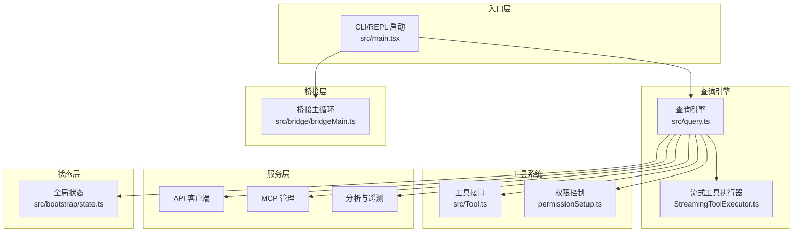
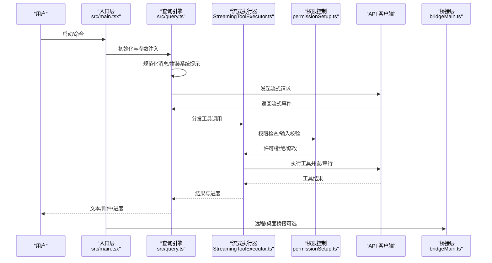
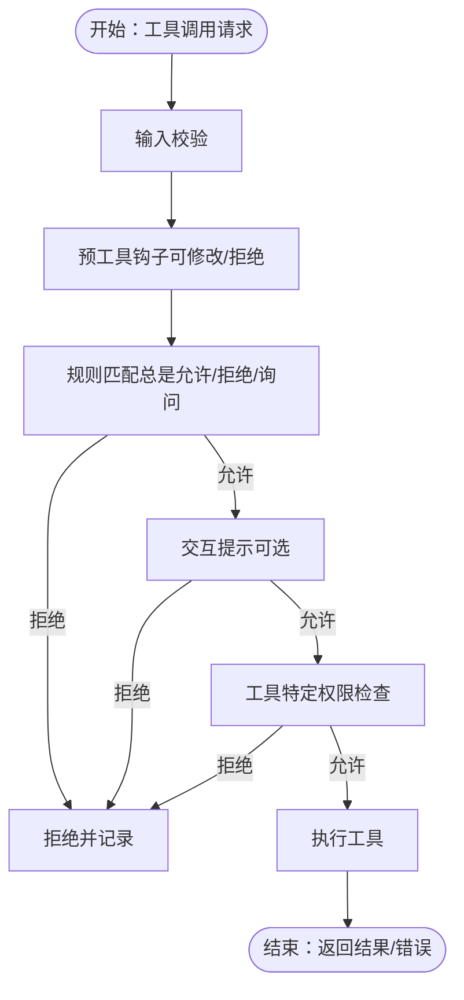
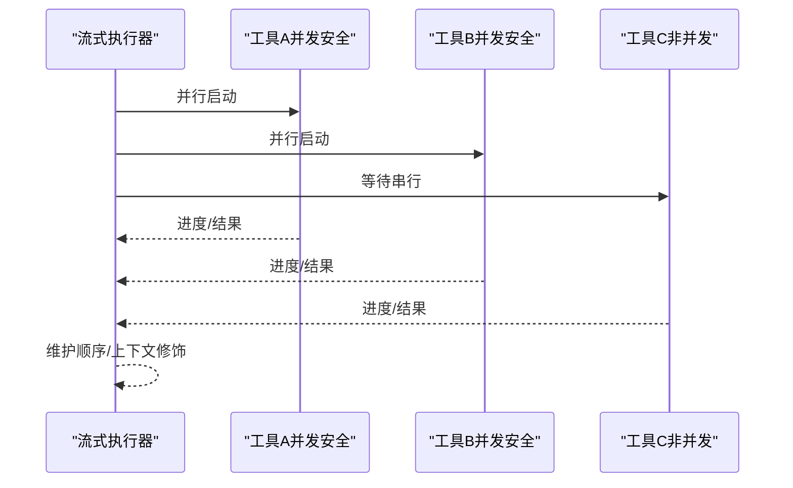
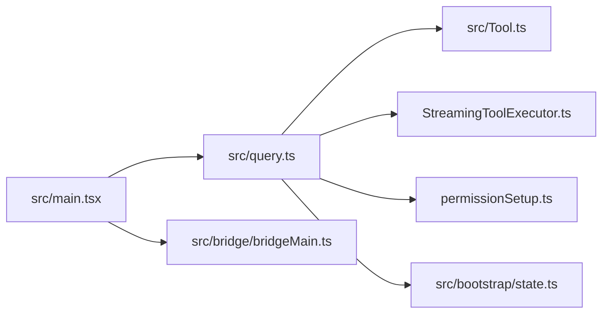

# 架构决策和权衡

<cite>
**本文档引用的文件**
- [README.md](file://README.md)
- [package.json](file://package.json)
- [src/main.tsx](file://src/main.tsx)
- [src/bootstrap/state.ts](file://src/bootstrap/state.ts)
- [src/bridge/bridgeMain.ts](file://src/bridge/bridgeMain.ts)
- [src/Tool.ts](file://src/Tool.ts)
- [src/query.ts](file://src/query.ts)
- [src/services/tools/StreamingToolExecutor.ts](file://src/services/tools/StreamingToolExecutor.ts)
- [src/utils/permissions/permissionSetup.ts](file://src/utils/permissions/permissionSetup.ts)
</cite>

## 目录
1. [引言](#引言)
2. [项目结构](#项目结构)
3. [核心组件](#核心组件)
4. [架构总览](#架构总览)
5. [详细组件分析](#详细组件分析)
6. [依赖关系分析](#依赖关系分析)
7. [性能考量](#性能考量)
8. [故障排查指南](#故障排查指南)
9. [结论](#结论)
10. [附录](#附录)

## 引言
本文件系统性梳理 Claude Code 的架构决策与权衡，聚焦以下关键主题：模块化设计、权限控制机制、异步处理模式与错误处理策略；解释为何选择特定架构与设计模式；评估技术债务、性能取舍与可扩展性；并提供历史背景与演进轨迹。内容基于仓库源码与官方说明文档进行提炼与可视化。

## 项目结构
该项目采用“入口层 → 查询引擎 → 工具/服务/状态层”的分层组织方式，结合桥接层（Bridge）支持远程/桌面集成。主要目录职责如下：
- 入口层：CLI/REPL 启动、命令解析、初始化与环境准备
- 查询引擎：消息规范化、系统提示拼装、主循环、工具编排与上下文压缩
- 工具系统：统一工具接口、权限检查、并发执行与进度渲染
- 服务层：API 客户端、分析与遥测、MCP 协议、插件加载等
- 状态层：全局状态存储与 React Provider
- 桥接层：远程会话生命周期、令牌刷新、容量唤醒与心跳

**图表来源**
- [README.md](file://README.md)
- [src/main.tsx](file://src/main.tsx)
- [src/query.ts](file://src/query.ts)
- [src/services/tools/StreamingToolExecutor.ts](file://src/services/tools/StreamingToolExecutor.ts)
- [src/Tool.ts](file://src/Tool.ts)
- [src/utils/permissions/permissionSetup.ts](file://src/utils/permissions/permissionSetup.ts)
- [src/bootstrap/state.ts](file://src/bootstrap/state.ts)
- [src/bridge/bridgeMain.ts](file://src/bridge/bridgeMain.ts)

**章节来源**
- [README.md](file://README.md)
- [src/main.tsx](file://src/main.tsx)

## 核心组件
- 入口与启动：在入口层完成调试检测、延迟预取、迁移与配置加载，确保启动路径最小化阻塞，并在首次渲染后进行后台预热。
- 查询引擎：负责消息规范化、系统提示组装、主循环、工具编排与上下文压缩，贯穿一次查询的完整生命周期。
- 工具系统：统一的工具接口定义与默认实现，支持并发安全判定、权限检查、输入校验、结果映射与 UI 渲染。
- 流式工具执行器：按并发安全规则调度工具执行，维护顺序一致性与进度消息即时产出。
- 权限控制：多源规则合并、危险规则识别与清理、自动模式下的安全剥离与恢复。
- 全局状态：集中管理会话、指标、计数器、钩子注册与 UI 相关状态。
- 桥接层：远程/桌面桥接的会话生命周期、心跳、令牌刷新与容量唤醒。

**章节来源**
- [src/main.tsx](file://src/main.tsx)
- [src/query.ts](file://src/query.ts)
- [src/Tool.ts](file://src/Tool.ts)
- [src/services/tools/StreamingToolExecutor.ts](file://src/services/tools/StreamingToolExecutor.ts)
- [src/utils/permissions/permissionSetup.ts](file://src/utils/permissions/permissionSetup.ts)
- [src/bootstrap/state.ts](file://src/bootstrap/state.ts)
- [src/bridge/bridgeMain.ts](file://src/bridge/bridgeMain.ts)

## 架构总览
整体采用“主循环 + 工具编排 + 权限控制 + 上下文压缩”的生产级代理模式。入口层负责环境与配置，查询引擎驱动主循环，工具系统提供能力边界，服务层提供外部集成与分析，状态层承载运行时数据，桥接层连接远程/桌面场景。

**图表来源**
- [src/main.tsx](file://src/main.tsx)
- [src/query.ts](file://src/query.ts)
- [src/services/tools/StreamingToolExecutor.ts](file://src/services/tools/StreamingToolExecutor.ts)
- [src/utils/permissions/permissionSetup.ts](file://src/utils/permissions/permissionSetup.ts)
- [src/bridge/bridgeMain.ts](file://src/bridge/bridgeMain.ts)

## 详细组件分析

### 模块化设计与分层
- 分层清晰：入口层仅做初始化与环境准备；查询引擎专注消息与工具编排；工具系统抽象能力边界；服务层提供外部集成；状态层集中数据；桥接层隔离远程交互。
- 动态特性门控：通过编译期特性门控（feature）裁剪未发布的内部模块，避免打包冗余，同时保持对外部可用功能的稳定暴露。
- 延迟初始化：入口层对非关键任务进行延迟预取，减少首帧阻塞；后台预热在首次渲染后执行，避免影响交互体验。

**章节来源**
- [README.md](file://README.md)
- [src/main.tsx](file://src/main.tsx)

### 权限控制机制
- 多源规则合并：来自设置、CLI 参数、会话决策等多源规则合并到权限上下文，支持“总是允许/总是拒绝/询问”三类策略。
- 危险规则识别：针对 Bash/PowerShell/Agent 等高危工具的通配或解释器模式进行识别，自动模式下会剥离危险规则并在退出时恢复。
- 自动模式安全：进入自动模式时剥离危险规则，离开时恢复；通过 Gate 控制启用条件，避免绕过分类器的安全评估。
- CLI 优先级：bypass 权限模式可通过 Gate 或设置禁用，CLI 与设置按优先级生效，最终回退到默认模式。

**图表来源**
- [src/utils/permissions/permissionSetup.ts](file://src/utils/permissions/permissionSetup.ts)
- [src/Tool.ts](file://src/Tool.ts)

**章节来源**
- [src/utils/permissions/permissionSetup.ts](file://src/utils/permissions/permissionSetup.ts)
- [src/Tool.ts](file://src/Tool.ts)

### 异步处理模式与并发控制
- 流式工具执行器：根据工具并发安全属性进行调度，保证非并发工具串行执行，其他工具并行执行；维护顺序一致性与进度消息即时产出。
- 子进程中断传播：当 Bash 工具出错时，通过兄弟进程中断控制器快速终止相关子进程，避免无效执行；用户中断时按工具中断行为决定取消或阻塞。
- 上下文修饰：非并发工具的上下文修改在串行完成后应用，确保后续工具在正确上下文中执行。

**图表来源**
- [src/services/tools/StreamingToolExecutor.ts](file://src/services/tools/StreamingToolExecutor.ts)

**章节来源**
- [src/services/tools/StreamingToolExecutor.ts](file://src/services/tools/StreamingToolExecutor.ts)

### 错误处理策略
- 流式回退与丢弃：当流式执行失败时，丢弃后续工具执行，生成合成错误消息，避免污染后续流程。
- 子进程级联失败：Bash 工具错误触发兄弟进程中断控制器，快速终止相关子进程；用户中断区分“取消/阻塞”两种行为。
- 最终错误抑制：对中间阶段的“最大输出令牌”错误进行延迟抛出，等待恢复逻辑后再决定是否向调用方暴露。

**章节来源**
- [src/services/tools/StreamingToolExecutor.ts](file://src/services/tools/StreamingToolExecutor.ts)
- [src/query.ts](file://src/query.ts)

### 技术债务与可扩展性
- 技术债务
  - 特性门控裁剪：大量内部模块通过编译期门控移除，导致部分功能在发布包中不可用，需通过迁移与兼容策略逐步收敛。
  - 代码规模：单文件 query.ts 超大，建议进一步拆分以提升可维护性。
  - 依赖版本：构建脚本与运行时依赖版本需定期同步，避免不兼容问题。
- 可扩展性
  - 工具接口标准化：统一的工具接口与默认实现便于新增工具；并发安全与只读标记帮助系统安全扩展。
  - 服务层插件化：MCP、分析与插件加载均通过服务层抽象，便于替换与扩展。
  - 状态层可扩展：全局状态集中管理，便于跨模块共享与测试。

**章节来源**
- [README.md](file://README.md)
- [package.json](file://package.json)
- [src/query.ts](file://src/query.ts)

## 依赖关系分析
- 入口层依赖：命令解析、初始化、设置加载、遥测与桥接配置。
- 查询引擎依赖：工具集合、消息规范、系统提示、上下文压缩、分析与钩子。
- 工具系统依赖：权限规则、输入校验、UI 渲染与结果映射。
- 服务层依赖：API 客户端、MCP 客户端、分析与遥测、插件加载。
- 状态层依赖：全局状态、指标与计数器、钩子注册。
- 桥接层依赖：HTTP 客户端、令牌刷新、会话生命周期与容量唤醒。

**图表来源**
- [src/main.tsx](file://src/main.tsx)
- [src/query.ts](file://src/query.ts)
- [src/Tool.ts](file://src/Tool.ts)
- [src/services/tools/StreamingToolExecutor.ts](file://src/services/tools/StreamingToolExecutor.ts)
- [src/utils/permissions/permissionSetup.ts](file://src/utils/permissions/permissionSetup.ts)
- [src/bootstrap/state.ts](file://src/bootstrap/state.ts)
- [src/bridge/bridgeMain.ts](file://src/bridge/bridgeMain.ts)

**章节来源**
- [src/main.tsx](file://src/main.tsx)
- [src/query.ts](file://src/query.ts)
- [src/Tool.ts](file://src/Tool.ts)
- [src/services/tools/StreamingToolExecutor.ts](file://src/services/tools/StreamingToolExecutor.ts)
- [src/utils/permissions/permissionSetup.ts](file://src/utils/permissions/permissionSetup.ts)
- [src/bootstrap/state.ts](file://src/bootstrap/state.ts)
- [src/bridge/bridgeMain.ts](file://src/bridge/bridgeMain.ts)

## 性能考量
- 启动性能
  - 延迟预取：在首次渲染后进行非关键任务预热，避免阻塞首帧。
  - 环境与信任：在非交互模式下跳过信任对话，直接预取系统上下文，减少等待。
- 工具执行性能
  - 并发安全：并发安全工具并行执行，非并发工具串行，平衡吞吐与一致性。
  - 进度即时产出：进度消息优先于结果产出，改善感知性能。
- 上下文压缩
  - 自动压缩与历史修剪：在达到阈值时自动压缩旧消息，降低上下文长度，提升响应速度。
- 令牌预算与恢复
  - 输出令牌限制的恢复机制：对“最大输出令牌”错误进行延迟处理，避免早期中断。

**章节来源**
- [src/main.tsx](file://src/main.tsx)
- [src/services/tools/StreamingToolExecutor.ts](file://src/services/tools/StreamingToolExecutor.ts)
- [src/query.ts](file://src/query.ts)

## 故障排查指南
- 权限相关
  - 危险规则：若出现自动模式下工具被拒绝，检查 Bash/PowerShell/Agent 的危险规则，必要时移除或调整。
  - bypass 权限模式：确认 Gate 与设置是否禁用了该模式，CLI 与设置存在优先级。
- 工具执行
  - 子进程失败：Bash 工具失败会触发兄弟进程中断，检查命令链依赖与权限。
  - 用户中断：根据工具中断行为判断是取消还是阻塞，查看工具实现的中断行为。
- 桥接层
  - 心跳与令牌：关注心跳失败与令牌过期，必要时触发重新连接或刷新。
  - 容量唤醒：在高并发场景下，容量唤醒可加速新工作项的接受。

**章节来源**
- [src/utils/permissions/permissionSetup.ts](file://src/utils/permissions/permissionSetup.ts)
- [src/services/tools/StreamingToolExecutor.ts](file://src/services/tools/StreamingToolExecutor.ts)
- [src/bridge/bridgeMain.ts](file://src/bridge/bridgeMain.ts)

## 结论
本项目通过清晰的分层与模块化设计，结合严格的权限控制、稳健的异步执行与错误处理策略，在生产环境中实现了高可用与可扩展的代理系统。特性门控与动态裁剪提升了发布包的稳定性，同时为内部功能保留了演进空间。未来可在工具执行性能、查询引擎拆分与状态层可观测性方面持续优化。

## 附录
- 历史背景与演进
  - 特性门控：通过编译期特性门控裁剪内部模块，避免发布包膨胀。
  - 自动模式：引入分类器与安全剥离机制，平衡自动化与安全性。
  - 桥接层：支持远程/桌面集成，提供心跳、令牌刷新与容量唤醒。

**章节来源**
- [README.md](file://README.md)
- [src/utils/permissions/permissionSetup.ts](file://src/utils/permissions/permissionSetup.ts)
- [src/bridge/bridgeMain.ts](file://src/bridge/bridgeMain.ts)