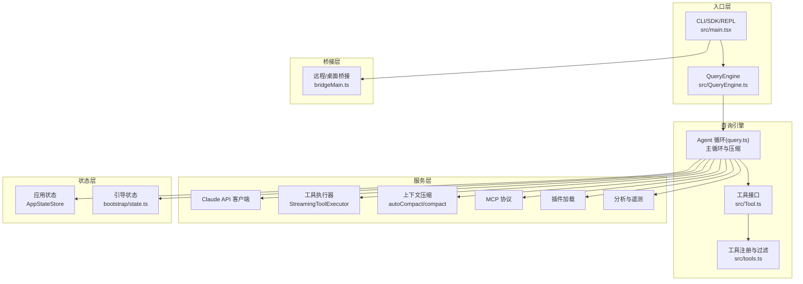
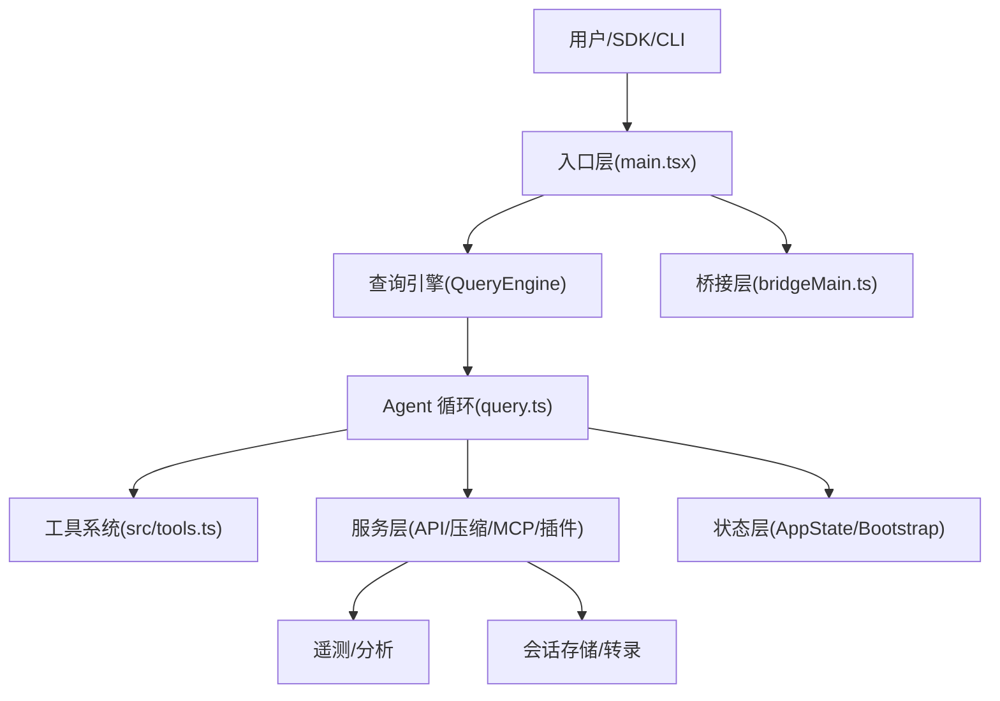
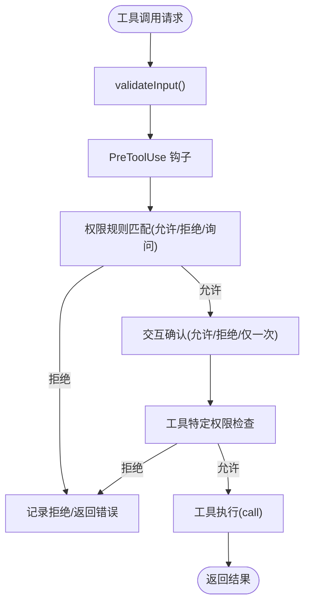
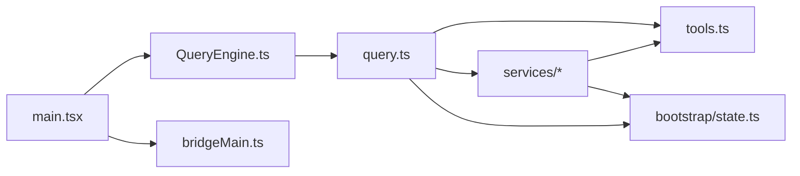

# 架构设计

<cite>
**本文引用的文件**
- [README.md](file://README.md)
- [package.json](file://package.json)
- [src/main.tsx](file://src/main.tsx)
- [src/QueryEngine.ts](file://src/QueryEngine.ts)
- [src/query.ts](file://src/query.ts)
- [src/tools.ts](file://src/tools.ts)
- [src/tools/Tool.ts](file://src/Tool.ts)
- [src/bridge/bridgeMain.ts](file://src/bridge/bridgeMain.ts)
- [src/bootstrap/state.ts](file://src/bootstrap/state.ts)
- [src/services/tools/StreamingToolExecutor.ts](file://src/services/tools/StreamingToolExecutor.ts)
- [src/services/tools/toolOrchestration.ts](file://src/services/tools/toolOrchestration.ts)
- [src/services/compact/autoCompact.ts](file://src/services/compact/autoCompact.ts)
- [src/services/compact/compact.ts](file://src/services/compact/compact.ts)
- [src/utils/messages.ts](file://src/utils/messages.ts)
- [src/utils/processUserInput/processUserInput.ts](file://src/utils/processUserInput/processUserInput.ts)
- [src/utils/queryContext.ts](file://src/utils/queryContext.ts)
- [src/utils/sessionStorage.ts](file://src/utils/sessionStorage.ts)
- [src/utils/systemPromptType.ts](file://src/utils/systemPromptType.ts)
- [src/utils/model/model.ts](file://src/utils/model/model.ts)
- [src/utils/tokens.ts](file://src/utils/tokens.ts)
- [src/utils/context.ts](file://src/utils/context.ts)
- [src/utils/attachments.ts](file://src/utils/attachments.ts)
- [src/utils/telemetry/pluginTelemetry.ts](file://src/utils/telemetry/pluginTelemetry.ts)
- [src/utils/telemetry/skillLoadedEvent.ts](file://src/utils/telemetry/skillLoadedEvent.ts)
- [src/utils/telemetry/pluginTelemetry.js](file://src/utils/telemetry/pluginTelemetry.js)
- [src/utils/telemetry/skillLoadedEvent.js](file://src/utils/telemetry/skillLoadedEvent.js)
- [src/utils/telemetry/pluginTelemetry.ts](file://src/utils/telemetry/pluginTelemetry.ts)
- [src/utils/telemetry/skillLoadedEvent.ts](file://src/utils/telemetry/skillLoadedEvent.ts)
- [src/utils/telemetry/pluginTelemetry.js](file://src/utils/telemetry/pluginTelemetry.js)
- [src/utils/telemetry/skillLoadedEvent.js](file://src/utils/telemetry/skillLoadedEvent.js)
- [src/utils/telemetry/pluginTelemetry.ts](file://src/utils/telemetry/pluginTelemetry.ts)
- [src/utils/telemetry/skillLoadedEvent.ts](file://src/utils/telemetry/skillLoadedEvent.ts)
- [src/utils/telemetry/pluginTelemetry.js](file://src/utils/telemetry/pluginTelemetry.js)
- [src/utils/telemetry/skillLoadedEvent.js](file://src/utils/telemetry/skillLoadedEvent.js)
- [src/utils/telemetry/pluginTelemetry.ts](file://src/utils/telemetry/pluginTelemetry.ts)
- [src/utils/telemetry/skillLoadedEvent.ts](file://src/utils/telemetry/skillLoadedEvent.ts)
- [src/utils/telemetry/pluginTelemetry.js](file://src/utils/telemetry/pluginTelemetry.js)
- [src/utils/telemetry/skillLoadedEvent.js](file://src/utils/telemetry/skillLoadedEvent.js)
- [src/utils/telemetry/pluginTelemetry.ts](file://src/utils/telemetry/pluginTelemetry.ts)
- [src/utils/telemetry/skillLoadedEvent.ts](file://src/utils/telemetry/skillLoadedEvent.ts)
- [src/utils/telemetry/pluginTelemetry.js](file://src/utils/telemetry/pluginTelemetry.js)
- [src/utils/telemetry/skillLoadedEvent.js](file://src/utils/telemetry/skillLoadedEvent.js)
- [src/utils/telemetry/pluginTelemetry.ts](file://src/utils/telemetry/pluginTelemetry.ts)
- [src/utils/telemetry/skillLoadedEvent.ts](file://src/utils/telemetry/skillLoadedEvent.ts)
- [src/utils/telemetry/pluginTelemetry.js](file://src/utils/telemetry/pluginTelemetry.js)
- [src/utils/telemetry/skillLoadedEvent.js](file://src/utils/telemetry/skillLoadedEvent.js)
-......（省略部分文件引用以保持简洁）
</cite>

## 目录
1. [引言](#引言)
2. [项目结构](#项目结构)
3. [核心组件](#核心组件)
4. [架构总览](#架构总览)
5. [详细组件分析](#详细组件分析)
6. [依赖关系分析](#依赖关系分析)
7. [性能考量](#性能考量)
8. [故障排查指南](#故障排查指南)
9. [结论](#结论)
10. [附录](#附录)

## 引言
本架构设计文档面向 Claude Code 的源代码，系统性阐述其高层设计、架构模式、系统边界、组件交互、数据流与集成模式。重点覆盖：
- Agent 循环架构：从用户输入到工具执行的完整数据流
- 查询引擎（QueryEngine）与主循环（query.ts）的设计理念与实现细节
- 工具系统架构与权限控制机制
- 状态管理与服务层设计
- 基础设施需求、可扩展性与部署拓扑
- 安全性、监控与灾难恢复等横切关注点
- 技术栈、第三方依赖与版本兼容性

## 项目结构
该项目采用模块化的分层组织方式，围绕“入口层 → 查询引擎 → 工具/服务/状态”展开，并通过桥接层支持远程/桌面集成。主要目录与职责概览：
- 入口层：CLI/SDK/REPL 启动与初始化（src/main.tsx、src/entrypoints）
- 查询引擎：headless/SDK 查询生命周期（src/QueryEngine.ts）
- 主循环：Agent 循环、压缩、工具执行（src/query.ts）
- 工具系统：工具接口与注册（src/Tool.ts、src/tools.ts）
- 服务层：API 客户端、工具执行器、压缩、MCP、插件、分析等（src/services）
- 状态层：全局状态与会话状态（src/bootstrap/state.ts、src/state）
- 桥接层：远程/桌面桥接（src/bridge）
- 工具实现：40+ 内置工具（src/tools 下各子目录）



图表来源
- [src/main.tsx](file://src/main.tsx)
- [src/QueryEngine.ts](file://src/QueryEngine.ts)
- [src/query.ts](file://src/query.ts)
- [src/tools.ts](file://src/tools.ts)
- [src/Tool.ts](file://src/Tool.ts)
- [src/bootstrap/state.ts](file://src/bootstrap/state.ts)
- [src/bridge/bridgeMain.ts](file://src/bridge/bridgeMain.ts)

章节来源
- [README.md](file://README.md)
- [src/main.tsx](file://src/main.tsx)

## 核心组件
- 入口与启动：负责解析命令行、初始化信任与配置、预取系统上下文、延迟启动后台任务、设置入口点类型（CLI/SDK/MCP）。
- 查询引擎（QueryEngine）：封装 SDK/headless 的查询生命周期，负责系统提示组装、用户输入处理、消息持久化、结果归一化与 SDK 消息流输出。
- Agent 循环（query.ts）：核心循环，负责上下文压缩、自动压缩、工具执行、令牌预算、错误恢复与重试、停止钩子与恢复路径。
- 工具系统：统一工具接口、权限检查、并发安全、渲染与进度展示；工具注册与按权限过滤。
- 服务层：API 客户端、工具执行器（并行/串行）、压缩策略、MCP 客户端、插件加载、分析与遥测。
- 状态层：全局状态与会话状态，包括使用量、成本、令牌预算、钩子计时、代理颜色、计划/技能缓存等。
- 桥接层：远程/桌面桥接，会话生命周期管理、心跳、容量唤醒、令牌刷新与重连。

章节来源
- [src/QueryEngine.ts](file://src/QueryEngine.ts)
- [src/query.ts](file://src/query.ts)
- [src/tools.ts](file://src/tools.ts)
- [src/Tool.ts](file://src/Tool.ts)
- [src/bootstrap/state.ts](file://src/bootstrap/state.ts)
- [src/bridge/bridgeMain.ts](file://src/bridge/bridgeMain.ts)

## 架构总览
系统采用“入口层 → 查询引擎 → 工具/服务/状态”的分层架构，结合桥接层实现远程/桌面集成。Agent 循环贯穿查询引擎与主循环，配合工具执行器与压缩策略，形成生产级的“权限、流式、并发、压缩、子代理、持久化、MCP”综合能力。



图表来源
- [src/main.tsx](file://src/main.tsx)
- [src/QueryEngine.ts](file://src/QueryEngine.ts)
- [src/query.ts](file://src/query.ts)
- [src/tools.ts](file://src/tools.ts)
- [src/bootstrap/state.ts](file://src/bootstrap/state.ts)
- [src/bridge/bridgeMain.ts](file://src/bridge/bridgeMain.ts)

## 详细组件分析

### Agent 循环架构（从输入到工具执行）
Agent 循环是系统的核心，负责：
- 解析与处理用户输入（含斜杠命令）
- 组装系统提示（含工具、权限、CLAUDE.md）
- 上下文压缩（自动压缩、快照压缩、上下文折叠）
- 流式调用 Claude API
- 工具选择与权限检查
- 并行/串行工具执行
- 结果归一化与会话存储
- 错误恢复与停止钩子

```mermaid
sequenceDiagram
participant User as "用户/SDK"
participant Engine as "QueryEngine"
participant Loop as "Agent 循环(query.ts)"
participant API as "Claude API"
participant Exec as "工具执行器"
participant Store as "会话存储"
User->>Engine : 提交消息(prompt/命令)
Engine->>Engine : 处理用户输入/命令
Engine->>Loop : 组装系统提示与消息
Loop->>Loop : 上下文压缩(auto/snippet/collapse)
Loop->>API : 流式请求(messages, tools, system)
API-->>Loop : 流式事件(text/tool_use)
alt 发现工具调用
Loop->>Exec : 权限检查/并发分组
Exec->>Exec : 并行/串行执行工具
Exec-->>Loop : 工具结果(tool_result)
Loop->>API : 回传工具结果继续对话
else 文本完成
API-->>Loop : 返回最终文本
end
Loop->>Store : 记录转录/进度
Loop-->>Engine : 归一化消息流
Engine-->>User : SDK 消息/结果
```

图表来源
- [src/QueryEngine.ts](file://src/QueryEngine.ts)
- [src/query.ts](file://src/query.ts)
- [src/services/tools/StreamingToolExecutor.ts](file://src/services/tools/StreamingToolExecutor.ts)
- [src/utils/sessionStorage.ts](file://src/utils/sessionStorage.ts)

章节来源
- [src/query.ts](file://src/query.ts)
- [src/QueryEngine.ts](file://src/QueryEngine.ts)
- [src/utils/sessionStorage.ts](file://src/utils/sessionStorage.ts)

### 查询引擎（QueryEngine）
- 负责一次查询的完整生命周期：系统提示组装、用户输入处理、消息持久化、SDK 消息流输出、权限拒绝统计、使用量与成本统计。
- 支持 SDK/headless 模式，提供系统初始化消息、紧凑边界消息、本地命令输出等。
- 与 Agent 循环协作，驱动主循环并接收流式消息。

章节来源
- [src/QueryEngine.ts](file://src/QueryEngine.ts)

### 工具系统与权限控制
- 工具接口定义统一的生命周期：validateInput、checkPermissions、call、prompt 等。
- 工具注册与过滤：内置工具集合、MCP 工具合并、权限规则过滤、REPL 模式下的可见性控制。
- 权限流程：输入校验 → 预工具钩子 → 规则匹配 → 交互确认 → 工具特定检查 → 执行。
- 并发与安全：并发安全标记、只读/破坏性操作区分、中断行为控制。



图表来源
- [src/tools.ts](file://src/tools.ts)
- [src/Tool.ts](file://src/Tool.ts)

章节来源
- [src/tools.ts](file://src/tools.ts)
- [src/Tool.ts](file://src/Tool.ts)

### 上下文压缩与内存管理
- 自动压缩：基于令牌阈值触发，调用压缩 API 生成摘要，替换旧消息。
- 快照压缩：移除僵尸消息与过期标记，降低历史冗余。
- 上下文折叠：在不牺牲信息的前提下重构上下文，提升效率。
- 令牌预算：每轮查询前计算预算，避免超限；支持任务预算参数。

章节来源
- [src/services/compact/autoCompact.ts](file://src/services/compact/autoCompact.ts)
- [src/services/compact/compact.ts](file://src/services/compact/compact.ts)
- [src/query.ts](file://src/query.ts)
- [src/utils/tokens.ts](file://src/utils/tokens.ts)
- [src/utils/context.ts](file://src/utils/context.ts)

### 服务层与集成
- API 客户端：流式调用、重试、降级、快速回退（fallback）。
- 工具执行器：并行/串行调度、孤儿消息墓碑、流式回退清理。
- MCP：服务器发现、连接生命周期、认证（OAuth/XAA/API Key）、工具注册与动态模式。
- 插件：缓存优先加载、插件启用/错误统计、技能加载事件。
- 分析与遥测：事件日志、指标、埋点、GrowthBook 配置。

章节来源
- [src/services/tools/StreamingToolExecutor.ts](file://src/services/tools/StreamingToolExecutor.ts)
- [src/services/tools/toolOrchestration.ts](file://src/services/tools/toolOrchestration.ts)
- [src/utils/telemetry/pluginTelemetry.ts](file://src/utils/telemetry/pluginTelemetry.ts)
- [src/utils/telemetry/skillLoadedEvent.ts](file://src/utils/telemetry/skillLoadedEvent.ts)

### 状态管理与服务层设计
- 应用状态（AppStateStore）：权限、文件历史、代理、快速模式等。
- 引导状态（bootstrap/state.ts）：会话 ID、工作目录、成本/用量、钩子计时、计划/技能缓存、Beta 标头锁存、提示缓存策略等。
- 会话存储：用户消息阻塞写入、助手消息异步写入、进度内联去重、刷新策略。

章节来源
- [src/bootstrap/state.ts](file://src/bootstrap/state.ts)
- [src/utils/sessionStorage.ts](file://src/utils/sessionStorage.ts)

### 桥接层（远程/桌面）
- 会话生命周期：创建、运行、停止、重连、心跳。
- 容量唤醒：空闲时睡眠，有会话结束或容量变化时唤醒。
- 令牌刷新：OAuth 到期自动刷新，v2 环境通过重新连接触发服务端再派发。
- 多会话模式：多实例环境、多会话并发、容量控制与节流。

章节来源
- [src/bridge/bridgeMain.ts](file://src/bridge/bridgeMain.ts)

## 依赖关系分析
- 入口层依赖状态层与服务层进行初始化与预取；QueryEngine 依赖工具注册与消息处理；Agent 循环依赖压缩、工具执行器与 API 客户端。
- 工具系统与服务层解耦，通过统一接口与权限钩子实现扩展。
- 桥接层独立于主循环，通过 API 与会话管理器协作。



图表来源
- [src/main.tsx](file://src/main.tsx)
- [src/QueryEngine.ts](file://src/QueryEngine.ts)
- [src/query.ts](file://src/query.ts)
- [src/tools.ts](file://src/tools.ts)
- [src/bootstrap/state.ts](file://src/bootstrap/state.ts)
- [src/bridge/bridgeMain.ts](file://src/bridge/bridgeMain.ts)

章节来源
- [src/main.tsx](file://src/main.tsx)
- [src/QueryEngine.ts](file://src/QueryEngine.ts)
- [src/query.ts](file://src/query.ts)
- [src/tools.ts](file://src/tools.ts)
- [src/bootstrap/state.ts](file://src/bootstrap/state.ts)
- [src/bridge/bridgeMain.ts](file://src/bridge/bridgeMain.ts)

## 性能考量
- 启动性能：延迟预取、并行子进程、旁路缓存、首帧优化。
- 查询性能：上下文压缩、令牌预算、自动/快照/折叠三类压缩策略、流式回退与孤儿消息清理。
- 工具执行：并发安全工具并行执行、串行工具有序执行、工具结果预算限制。
- 存储性能：用户消息阻塞写入保证崩溃恢复，助手消息异步写入，进度内联写入去重。
- 远程性能：桥接层心跳与容量唤醒减少空转，令牌刷新避免频繁重连。

## 故障排查指南
- 会话恢复失败：检查转录文件是否包含可识别的消息，确认紧凑边界与持久化时机。
- 工具权限被拒：查看权限规则与交互确认记录，核对工具特定检查逻辑。
- 上下文过长：启用自动压缩或手动紧凑，检查令牌预算与快照压缩效果。
- 远程会话异常：检查桥接心跳、令牌刷新、容量唤醒与会话结束状态。
- 流式回退：观察孤儿消息墓碑与工具执行器回退清理，确认回退后重新构建执行器。

章节来源
- [src/utils/sessionStorage.ts](file://src/utils/sessionStorage.ts)
- [src/services/tools/StreamingToolExecutor.ts](file://src/services/tools/StreamingToolExecutor.ts)
- [src/bridge/bridgeMain.ts](file://src/bridge/bridgeMain.ts)

## 结论
该系统以 Agent 循环为核心，结合查询引擎、工具系统、服务层与状态层，形成高可用、可扩展、可观测的智能体平台。通过严格的权限控制、上下文压缩与流式执行，兼顾生产质量与用户体验。桥接层进一步拓展到远程/桌面场景，满足企业与个人开发者在不同环境下的使用需求。

## 附录

### 技术栈与版本兼容性
- 运行时：Node.js >= 18（Bun 编译为 Node.js 兼容包）
- 构建工具：esbuild、TypeScript
- 包管理：npm
- 第三方依赖：大量业务相关库（详见 package.json）

章节来源
- [package.json](file://package.json)

### 基础设施需求与部署拓扑
- 基础设施：HTTP(S)/WebSocket/SSE/STDIO 等多种传输协议支持 MCP 服务器发现与连接。
- 部署拓扑：本地 CLI、远程桥接容器、桌面客户端、云环境（通过桥接层与远程控制）。
- 可扩展性：多会话并发、容量唤醒、心跳节流、令牌刷新与重连策略。

章节来源
- [src/bridge/bridgeMain.ts](file://src/bridge/bridgeMain.ts)
- [README.md](file://README.md)