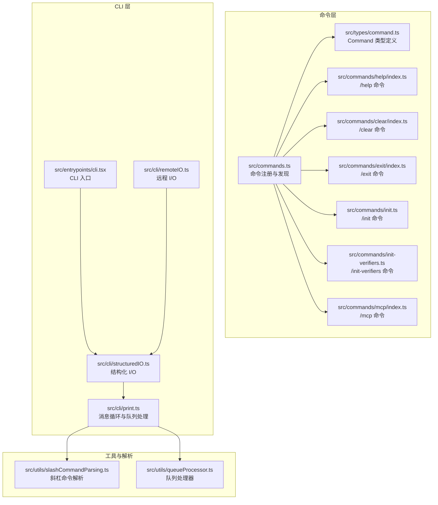
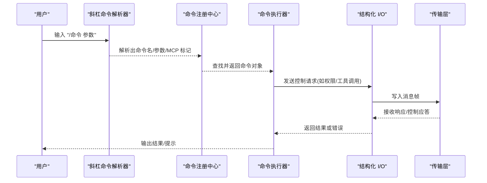
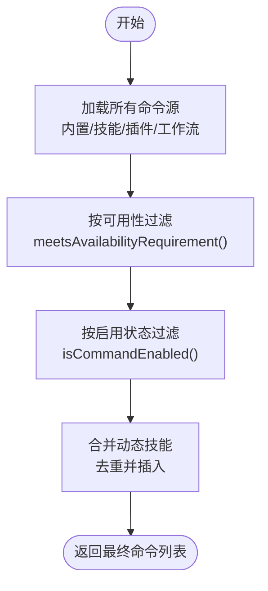
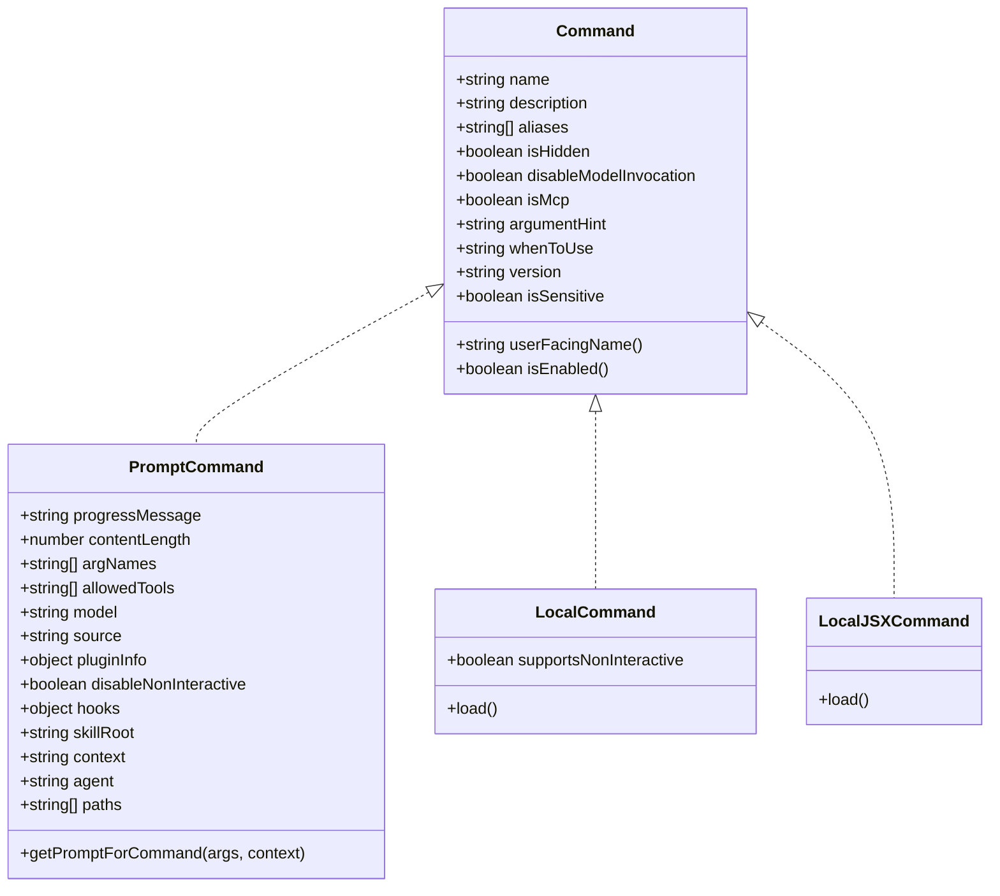
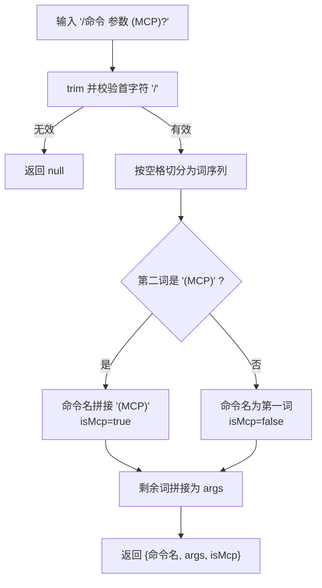
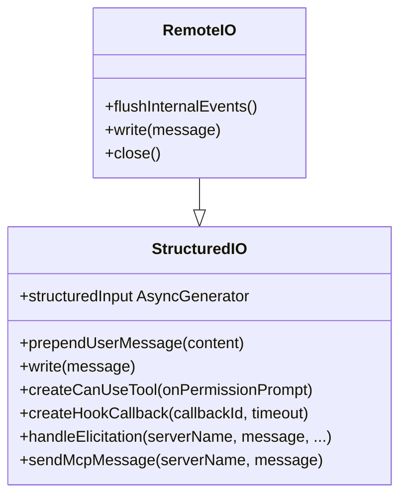
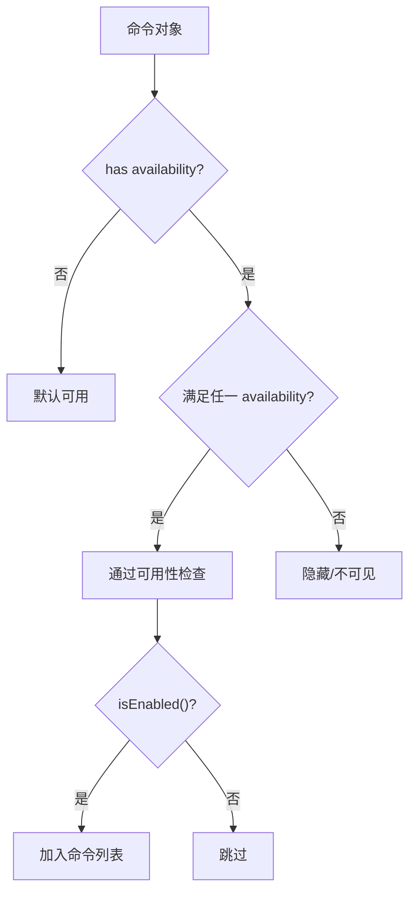
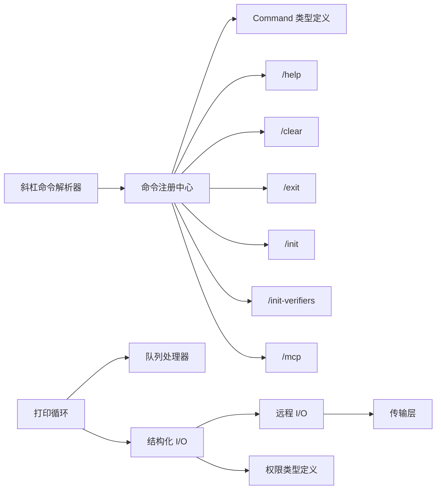

# 命令系统设计

<cite>
**本文引用的文件**
- [commands.ts](file://src/commands.ts)
- [command 类型定义](file://src/types/command.ts)
- [斜杠命令解析器](file://src/utils/slashCommandParsing.ts)
- [/init 命令](file://src/commands/init.ts)
- [/init-verifiers 命令](file://src/commands/init-verifiers.ts)
- [/help 命令](file://src/commands/help/index.ts)
- [/clear 命令](file://src/commands/clear/index.ts)
- [/exit 命令](file://src/commands/exit/index.ts)
- [/mcp 命令](file://src/commands/mcp/index.ts)
- [CLI 结构化 I/O](file://src/cli/structuredIO.ts)
- [CLI 远程 I/O](file://src/cli/remoteIO.ts)
- [CLI 入口](file://src/entrypoints/cli.tsx)
- [队列处理器](file://src/utils/queueProcessor.ts)
- [打印循环](file://src/cli/print.ts)
- [权限类型定义](file://src/types/permissions.ts)
</cite>

## 目录
1. [简介](#简介)
2. [项目结构](#项目结构)
3. [核心组件](#核心组件)
4. [架构总览](#架构总览)
5. [详细组件分析](#详细组件分析)
6. [依赖关系分析](#依赖关系分析)
7. [性能考量](#性能考量)
8. [故障排查指南](#故障排查指南)
9. [结论](#结论)
10. [附录](#附录)

## 简介
本文件面向 Claude Code 的命令系统，提供从架构到实现细节的完整技术文档。内容覆盖命令注册机制、参数解析流程、命令执行管道、斜杠命令实现原理（处理器组织、功能门控、命令别名）、CLI 基础设施（传输层、远程 I/O、结构化 I/O 管理），以及扩展机制、自定义命令开发与命令权限控制。文末包含具体代码示例路径，帮助读者快速定位实现。

## 项目结构
命令系统围绕统一的 Command 类型展开，通过集中式注册与动态加载实现可扩展性；CLI 层以结构化 I/O 协议承载消息流，并在远程模式下通过传输层进行双向通信。



**图表来源**
- [commands.ts:258-346](file://src/commands.ts#L258-L346)
- [command 类型定义:205-217](file://src/types/command.ts#L205-L217)
- [/help 命令:3-10](file://src/commands/help/index.ts#L3-L10)
- [/clear 命令:10-19](file://src/commands/clear/index.ts#L10-L19)
- [/exit 命令:3-12](file://src/commands/exit/index.ts#L3-L12)
- [/init 命令:226-256](file://src/commands/init.ts#L226-L256)
- [/init-verifiers 命令:3-262](file://src/commands/init-verifiers.ts#L3-L262)
- [/mcp 命令:3-10](file://src/commands/mcp/index.ts#L3-L10)
- [CLI 结构化 I/O:135-170](file://src/cli/structuredIO.ts#L135-L170)
- [CLI 远程 I/O:35-51](file://src/cli/remoteIO.ts#L35-L51)
- [CLI 入口:33-106](file://src/entrypoints/cli.tsx#L33-L106)
- [斜杠命令解析器:25-60](file://src/utils/slashCommandParsing.ts#L25-L60)
- [队列处理器:71-95](file://src/utils/queueProcessor.ts#L71-L95)
- [打印循环:1934-1961](file://src/cli/print.ts#L1934-L1961)

**章节来源**
- [commands.ts:258-346](file://src/commands.ts#L258-L346)
- [command 类型定义:205-217](file://src/types/command.ts#L205-L217)
- [CLI 结构化 I/O:135-170](file://src/cli/structuredIO.ts#L135-L170)
- [CLI 远程 I/O:35-51](file://src/cli/remoteIO.ts#L35-L51)
- [CLI 入口:33-106](file://src/entrypoints/cli.tsx#L33-L106)

## 核心组件
- 统一命令类型与元数据：Command 定义了三类命令形态（prompt、local、local-jsx）及通用元数据（名称、别名、可用性、描述等），并提供名称解析与启用判断辅助函数。
- 集中式命令注册与发现：commands.ts 聚合内置命令、技能、插件技能、工作流命令，按可用性与启用状态过滤，并支持动态技能注入与缓存管理。
- 斜杠命令解析：slashCommandParsing.ts 将用户输入解析为命令名、参数与 MCP 标记，支撑命令分发。
- CLI 消息循环与执行：print.ts 驱动消息循环，基于队列处理器批量处理 prompt 命令，同时处理控制请求与权限决策。
- 结构化 I/O 与远程传输：structuredIO.ts 提供标准协议读写、权限请求并发决策、MCP 消息转发；remoteIO.ts 在远程模式下建立传输通道并桥接生命周期事件。

**章节来源**
- [command 类型定义:25-57](file://src/types/command.ts#L25-L57)
- [command 类型定义:74-98](file://src/types/command.ts#L74-L98)
- [command 类型定义:144-152](file://src/types/command.ts#L144-L152)
- [commands.ts:258-346](file://src/commands.ts#L258-L346)
- [斜杠命令解析器:25-60](file://src/utils/slashCommandParsing.ts#L25-L60)
- [打印循环:1934-1961](file://src/cli/print.ts#L1934-L1961)
- [队列处理器:71-95](file://src/utils/queueProcessor.ts#L71-L95)
- [CLI 结构化 I/O:135-170](file://src/cli/structuredIO.ts#L135-L170)

## 架构总览
命令系统采用“类型统一 + 动态注册 + 权限与可用性门控”的设计，CLI 层以结构化协议承载消息与权限交互，远程模式通过传输层透明扩展。



**图表来源**
- [斜杠命令解析器:25-60](file://src/utils/slashCommandParsing.ts#L25-L60)
- [commands.ts:688-719](file://src/commands.ts#L688-L719)
- [CLI 结构化 I/O:469-531](file://src/cli/structuredIO.ts#L469-L531)
- [CLI 远程 I/O:231-242](file://src/cli/remoteIO.ts#L231-L242)

## 详细组件分析

### 命令注册与发现机制
- 命令聚合：commands.ts 使用 memoized 函数一次性构建命令列表，包含内置命令、技能目录命令、插件命令、工作流命令等，并在运行时根据可用性与启用状态过滤。
- 动态技能注入：动态技能在命令列表中去重后插入到插件技能之后、内置命令之前，保证优先级与一致性。
- 缓存与失效：提供多层缓存清理接口，确保新增/删除技能后能及时刷新命令视图。



**图表来源**
- [commands.ts:449-469](file://src/commands.ts#L449-L469)
- [commands.ts:476-517](file://src/commands.ts#L476-L517)
- [commands.ts:417-443](file://src/commands.ts#L417-L443)
- [commands.ts:214-216](file://src/commands.ts#L214-L216)

**章节来源**
- [commands.ts:258-346](file://src/commands.ts#L258-L346)
- [commands.ts:449-469](file://src/commands.ts#L449-L469)
- [commands.ts:476-517](file://src/commands.ts#L476-L517)
- [commands.ts:417-443](file://src/commands.ts#L417-L443)

### 命令类型与元数据
- Prompt 命令：用于生成模型提示，支持进度消息、内容长度、工具限制、上下文模式等。
- Local 命令：本地执行，延迟加载模块，支持非交互模式。
- Local JSX 命令：渲染 UI，延迟加载，适合终端 UI 交互。
- 通用元数据：名称、别名、描述、可用性、是否隐藏、是否禁用模型调用、敏感参数等。



**图表来源**
- [command 类型定义:25-57](file://src/types/command.ts#L25-L57)
- [command 类型定义:74-98](file://src/types/command.ts#L74-L98)
- [command 类型定义:144-152](file://src/types/command.ts#L144-L152)
- [command 类型定义:175-203](file://src/types/command.ts#L175-L203)

**章节来源**
- [command 类型定义:25-57](file://src/types/command.ts#L25-L57)
- [command 类型定义:74-98](file://src/types/command.ts#L74-L98)
- [command 类型定义:144-152](file://src/types/command.ts#L144-L152)
- [command 类型定义:175-203](file://src/types/command.ts#L175-L203)

### 斜杠命令解析与分发
- 解析规则：支持普通命令与 MCP 命令标记，将输入拆分为命令名、参数与是否来自 MCP 的标志位。
- 分发流程：解析后在命令集合中查找匹配项（含别名），找不到则抛出包含可用命令列表的错误信息，便于用户自助排错。



**图表来源**
- [斜杠命令解析器:25-60](file://src/utils/slashCommandParsing.ts#L25-L60)

**章节来源**
- [斜杠命令解析器:25-60](file://src/utils/slashCommandParsing.ts#L25-L60)
- [commands.ts:688-719](file://src/commands.ts#L688-L719)

### CLI 执行管道与队列处理
- 消息循环：print.ts 中的主循环读取结构化 I/O 输入，区分用户消息、控制请求与助手/系统消息，驱动命令生命周期与会话状态。
- 队列批处理：对 prompt 模式命令进行批处理，将排队期间的多个 prompt 命令合并为一次模型调用，减少往返次数。
- 非 prompt 命令单条处理：避免副作用命令被打包导致时序问题。

```mermaid
sequenceDiagram
participant Loop as "消息循环"
participant Queue as "队列处理器"
participant Exec as "执行器"
Loop->>Queue : 取出下一个命令
alt 非斜杠命令且非 prompt
Queue-->>Loop : 返回未处理
else prompt 命令
Queue->>Queue : 批量收集同模式跟随者
Queue->>Exec : 合并后的 prompt 命令
Exec-->>Loop : 返回结果
end
```

**图表来源**
- [打印循环:1934-1961](file://src/cli/print.ts#L1934-L1961)
- [队列处理器:71-95](file://src/utils/queueProcessor.ts#L71-L95)

**章节来源**
- [打印循环:1934-1961](file://src/cli/print.ts#L1934-L1961)
- [队列处理器:71-95](file://src/utils/queueProcessor.ts#L71-L95)

### 结构化 I/O 与远程传输
- 结构化 I/O：StructuredIO 实现标准协议的消息读写、控制请求/响应处理、权限请求并发决策（钩子与 SDK 谁先谁后）、MCP 消息转发与沙箱网络访问代理。
- 远程 I/O：RemoteIO 在远程模式下选择合适传输（如 SSE），维护心跳、会话元数据上报、内部事件持久化与恢复，并在桥接模式下将控制请求回显到 stdout 以便父进程感知。



**图表来源**
- [CLI 结构化 I/O:135-170](file://src/cli/structuredIO.ts#L135-L170)
- [CLI 结构化 I/O:469-531](file://src/cli/structuredIO.ts#L469-L531)
- [CLI 结构化 I/O:661-689](file://src/cli/structuredIO.ts#L661-L689)
- [CLI 远程 I/O:35-51](file://src/cli/remoteIO.ts#L35-L51)
- [CLI 远程 I/O:231-242](file://src/cli/remoteIO.ts#L231-L242)

**章节来源**
- [CLI 结构化 I/O:135-170](file://src/cli/structuredIO.ts#L135-L170)
- [CLI 结构化 I/O:469-531](file://src/cli/structuredIO.ts#L469-L531)
- [CLI 结构化 I/O:661-689](file://src/cli/structuredIO.ts#L661-L689)
- [CLI 远程 I/O:35-51](file://src/cli/remoteIO.ts#L35-L51)
- [CLI 远程 I/O:231-242](file://src/cli/remoteIO.ts#L231-L242)

### 命令别名系统与可用性门控
- 别名匹配：findCommand 支持按 name、userFacingName 与 aliases 匹配，提升可用性与兼容性。
- 功能门控：meetsAvailabilityRequirement 根据订阅/控制台/第三方服务等环境判定命令可见性；isCommandEnabled 支持按特性开关与环境变量启用/禁用。
- 远程安全命令：REMOTE_SAFE_COMMANDS 与 BRIDGE_SAFE_COMMANDS 对远程/桥接模式下的命令执行进行白名单控制。



**图表来源**
- [commands.ts:417-443](file://src/commands.ts#L417-L443)
- [commands.ts:214-216](file://src/commands.ts#L214-L216)
- [commands.ts:688-719](file://src/commands.ts#L688-L719)
- [commands.ts:619-686](file://src/commands.ts#L619-L686)

**章节来源**
- [commands.ts:417-443](file://src/commands.ts#L417-L443)
- [commands.ts:214-216](file://src/commands.ts#L214-L216)
- [commands.ts:619-686](file://src/commands.ts#L619-L686)
- [commands.ts:688-719](file://src/commands.ts#L688-L719)

### 典型命令实现示例
- /help：local-jsx 命令，延迟加载 UI 组件，用于显示帮助与可用命令。
- /clear：local 命令，延迟加载清理逻辑，支持别名 reset/new。
- /exit：local-jsx 命令，immediate 标记表示立即执行，用于退出 REPL。
- /init：prompt 命令，根据特性开关与环境变量决定描述文案，动态生成提示内容。
- /init-verifiers：prompt 命令，引导用户创建验证器技能，自动检测项目类型并生成相应配置。
- /mcp：local-jsx 命令，immediate 标记，用于管理 MCP 服务器。

**章节来源**
- [/help 命令:3-10](file://src/commands/help/index.ts#L3-L10)
- [/clear 命令:10-19](file://src/commands/clear/index.ts#L10-L19)
- [/exit 命令:3-12](file://src/commands/exit/index.ts#L3-L12)
- [/init 命令:226-256](file://src/commands/init.ts#L226-L256)
- [/init-verifiers 命令:3-262](file://src/commands/init-verifiers.ts#L3-L262)
- [/mcp 命令:3-10](file://src/commands/mcp/index.ts#L3-L10)

## 依赖关系分析
命令系统与 CLI 层之间通过统一的 Command 类型与结构化协议耦合，命令注册中心与解析器位于应用层，CLI 层负责消息编解码与传输抽象。



**图表来源**
- [斜杠命令解析器:25-60](file://src/utils/slashCommandParsing.ts#L25-L60)
- [commands.ts:258-346](file://src/commands.ts#L258-L346)
- [command 类型定义:205-217](file://src/types/command.ts#L205-L217)
- [打印循环:1934-1961](file://src/cli/print.ts#L1934-L1961)
- [队列处理器:71-95](file://src/utils/queueProcessor.ts#L71-L95)
- [CLI 结构化 I/O:135-170](file://src/cli/structuredIO.ts#L135-L170)
- [CLI 远程 I/O:35-51](file://src/cli/remoteIO.ts#L35-L51)
- [权限类型定义:157-171](file://src/types/permissions.ts#L157-L171)

**章节来源**
- [commands.ts:258-346](file://src/commands.ts#L258-L346)
- [command 类型定义:205-217](file://src/types/command.ts#L205-L217)
- [斜杠命令解析器:25-60](file://src/utils/slashCommandParsing.ts#L25-L60)
- [打印循环:1934-1961](file://src/cli/print.ts#L1934-L1961)
- [队列处理器:71-95](file://src/utils/queueProcessor.ts#L71-L95)
- [CLI 结构化 I/O:135-170](file://src/cli/structuredIO.ts#L135-L170)
- [CLI 远程 I/O:35-51](file://src/cli/remoteIO.ts#L35-L51)
- [权限类型定义:157-171](file://src/types/permissions.ts#L157-L171)

## 性能考量
- 延迟加载：local 与 local-jsx 命令通过 load() 延迟导入，降低启动时间与内存占用。
- 命令缓存：命令聚合与技能加载使用 memoize 缓存，结合缓存清理接口在动态变化场景下保持一致性。
- 批处理优化：prompt 命令在消息循环中批量合并，减少模型调用次数与往返开销。
- I/O 安全：结构化 I/O 对重复/孤儿控制响应进行去重处理，避免会话状态污染。

[本节为通用指导，无需特定文件来源]

## 故障排查指南
- 命令不存在：findCommand 抛出错误并列出可用命令与别名，便于快速定位。
- 权限拒绝：StructuredIO.createCanUseTool 在钩子与 SDK 之间竞速，若 SDK 先响应则使用其结果；失败时返回拒绝决策并记录原因。
- 远程连接异常：RemoteIO 在关闭回调中结束输入流并触发优雅退出，日志记录初始化失败原因。
- 输入解析错误：StructuredIO.processLine 对未知类型消息进行忽略并记录调试信息，必要时终止进程以避免状态不一致。

**章节来源**
- [commands.ts:704-719](file://src/commands.ts#L704-L719)
- [CLI 结构化 I/O:533-659](file://src/cli/structuredIO.ts#L533-L659)
- [CLI 结构化 I/O:333-463](file://src/cli/structuredIO.ts#L333-L463)
- [CLI 远程 I/O:105-110](file://src/cli/remoteIO.ts#L105-L110)

## 结论
该命令系统通过统一的 Command 类型与集中式注册，结合动态加载、可用性门控与远程安全策略，实现了高扩展性与强健的执行管道。CLI 层以结构化协议与传输抽象保障了本地与远程的一致行为，配合权限与生命周期管理，为复杂场景下的命令执行提供了可靠基础。

[本节为总结，无需特定文件来源]

## 附录

### 命令注册流程示例路径
- 命令聚合与过滤：[commands.ts:258-346](file://src/commands.ts#L258-L346)
- 动态技能合并：[commands.ts:449-517](file://src/commands.ts#L449-L517)
- 可用性与启用判断：[commands.ts:417-443](file://src/commands.ts#L417-L443)

**章节来源**
- [commands.ts:258-346](file://src/commands.ts#L258-L346)
- [commands.ts:449-517](file://src/commands.ts#L449-L517)
- [commands.ts:417-443](file://src/commands.ts#L417-L443)

### 参数验证与错误处理策略
- 斜杠命令解析：[斜杠命令解析器:25-60](file://src/utils/slashCommandParsing.ts#L25-L60)
- 命令查找与错误提示：[commands.ts:688-719](file://src/commands.ts#L688-L719)
- 权限请求并发决策：[CLI 结构化 I/O:533-659](file://src/cli/structuredIO.ts#L533-L659)

**章节来源**
- [斜杠命令解析器:25-60](file://src/utils/slashCommandParsing.ts#L25-L60)
- [commands.ts:688-719](file://src/commands.ts#L688-L719)
- [CLI 结构化 I/O:533-659](file://src/cli/structuredIO.ts#L533-L659)

### CLI 基础设施要点
- 消息循环与批处理：[打印循环:1934-1961](file://src/cli/print.ts#L1934-L1961)
- 队列处理与模式匹配：[队列处理器:71-95](file://src/utils/queueProcessor.ts#L71-L95)
- 结构化 I/O 协议与权限：[CLI 结构化 I/O:135-170](file://src/cli/structuredIO.ts#L135-L170)
- 远程传输与心跳：[CLI 远程 I/O:35-51](file://src/cli/remoteIO.ts#L35-L51)

**章节来源**
- [打印循环:1934-1961](file://src/cli/print.ts#L1934-L1961)
- [队列处理器:71-95](file://src/utils/queueProcessor.ts#L71-L95)
- [CLI 结构化 I/O:135-170](file://src/cli/structuredIO.ts#L135-L170)
- [CLI 远程 I/O:35-51](file://src/cli/remoteIO.ts#L35-L51)